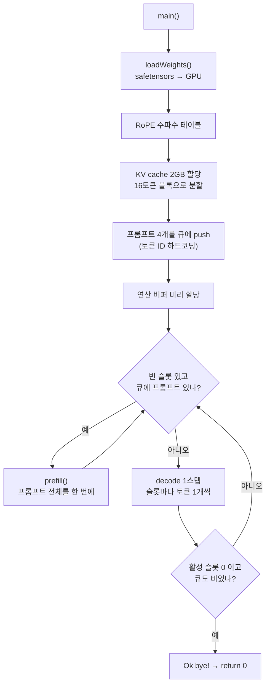

[jmaczan/tiny-vllm](https://github.com/jmaczan/tiny-vllm)은 Llama 3.2 1B Instruct 를 GPU 에서 돌리는 추론 엔진을 C++ 와 CUDA 로 처음부터 짠 저장소다. PyTorch 도, Hugging Face 도, 심지어 토크나이저도 쓰지 않는다. safetensors 파일을 직접 열어 가중치를 GPU 로 올리고, 어텐션과 RMSNorm 과 softmax 를 전부 자기 커널로 계산한다.

놀라운 건 규모다. 제품 코드가 **파일 두 개, 1,572줄**이다.

```
src/main.cpp     1,044줄   호스트 쪽 전부 (가중치 적재, prefill, decode 루프, 배치 관리)
src/kernels.cu     528줄   GPU 커널 11개
```

vLLM 본체가 십수만 줄인 걸 생각하면, 이건 "추론 엔진을 이루는 아이디어들의 최소 증명"에 가깝다. 그래서 읽을 가치가 있다. 논문에서 이름만 보던 것들이 여기서는 100줄 안에 들어와 있다.

이 시리즈는 그 1,572줄을 일곱 편에 나눠 읽는다. 이번 편은 지도다. **무엇이 구현되어 있고, 한 번의 추론이 어떤 길을 지나며, 이 코드가 왜 이렇게 생겼는지**를 본다.

> 이 시리즈의 모든 인용은 커밋 [`e25bf19`](https://github.com/jmaczan/tiny-vllm/tree/e25bf1994efa90bc98b721ba7c527402f86fbeaf) 기준이다. 필자에게 NVIDIA GPU 가 없어 **빌드도 실행도 하지 않았다.** 따라서 성능 수치는 이 시리즈에 일절 없고, 모든 설명은 소스를 읽어 얻은 것이다.

## 무엇이 들어 있나

저장소가 스스로 밝힌 구현 목록은 이렇다. 왼쪽은 원 아이디어의 출처, 오른쪽은 저장소 상의 출처다.

| 아이디어 | 원 출처 | tiny-vllm 에서 | 다룰 편 |
| --- | --- | --- | --- |
| Transformer 추론 | [Attention Is All You Need](https://arxiv.org/pdf/1706.03762) | `prefill()` + decode 루프 | 3, 5편 |
| RMSNorm | [Zhang & Sennrich, 2019](https://arxiv.org/abs/1910.07467) | `rmsNormKernel` | 3편 |
| RoPE (Llama 3 스케일링) | [시각적 해설 — Fleetwood](https://fleetwood.dev/posts/you-could-have-designed-SOTA-positional-encoding) | `ropeKernel_llama3` | 3편 |
| GQA | [Ainslie et al., 2023](https://arxiv.org/pdf/2305.13245) | `GQA_Q_TO_K_RATIO = 4` | 6편 |
| cuBLAS 전치 트릭 | [row/column-major](https://en.wikipedia.org/wiki/Row-_and_column-major_order) | `cublasGemmEx` 호출 규약 | 4편 |
| 병렬 리덕션 | [NVIDIA 기술 문서 (PDF)](https://developer.download.nvidia.com/assets/cuda/files/reduction.pdf) | `__shfl_down_sync` 트리 | 3, 6편 |
| online softmax | [CSE599M 강의노트 (PDF)](https://courses.cs.washington.edu/courses/cse599m/23sp/notes/flashattn.pdf) | `pagedAttentionKernel` | 6편 |
| **PagedAttention** | [Kwon et al., SOSP 2023](https://arxiv.org/pdf/2309.06180) | `block_table` + 16토큰 페이지 | 6편 |
| continuous batching | — | 슬롯 테이블 + 큐 | 7편 |

마지막 두 줄이 이 저장소의 존재 이유다. PagedAttention 은 vLLM 을 유명하게 만든 아이디어 — **KV cache 를 연속된 큰 덩어리가 아니라 운영체제의 페이지처럼 작은 블록으로 쪼개 관리**해서 메모리 낭비를 없애는 것 — 이고, 여기서는 `BLOCK_SIZE = 16` 토큰짜리 페이지와 `block_table` 인덱스 배열로 100줄 남짓에 구현되어 있다.

## 한 번의 추론이 지나는 길

`main()` 부터 따라가 보자. 골격만 남기면 이렇다.

```cpp
int main(int argc, char *argv[])
{
    cublasHandle_t cublas_handle;
    cublasStatus_t status = cublasCreate(&cublas_handle);   // ① 행렬곱 라이브러리
    if (status != CUBLAS_STATUS_SUCCESS) { ... return 1; }

    Weights weights{};
    if (loadWeights(weights) != 0) { return 1; }            // ② safetensors → GPU

    init_rope_frequencies(HEAD_DIM, MAX_SEQ_LEN, 500000.0f, // ③ 위치 인코딩 테이블
                          32.0f, 1.0f, 4.0f, 8192);

    __nv_bfloat16 *kv_cache;                                // ④ KV cache 2GB 통째로
    cudaMalloc(&kv_cache, KV_CACHE_SIZE_BYTES);
    std::vector<int> free_blocks(NUM_BLOCKS);
    std::iota(free_blocks.begin(), free_blocks.end(), 0);
    std::vector<int> block_table(MAX_SEQUENCES * N_LAYERS * MAX_BLOCKS_PER_SEQ, -1);
```
— [`src/main.cpp:555-581`](https://github.com/jmaczan/tiny-vllm/blob/e25bf1994efa90bc98b721ba7c527402f86fbeaf/src/main.cpp#L555-L581)

④ 가 PagedAttention 의 준비 과정이다. 2GB 를 한 번에 잡아 두고(`cudaMalloc` 은 느리니 딱 한 번만 한다), 그걸 16토큰짜리 블록으로 쪼개 번호를 매기고(`free_blocks` = 0,1,2,…), 어떤 시퀀스의 몇 번째 토큰 묶음이 어느 블록에 있는지를 `block_table` 이 기억한다. 초깃값이 `-1` 인 건 "아직 배정 안 됨" 표시다.

그 다음이 이 코드의 성격을 가장 잘 보여주는 부분이다.

```cpp
    // PROMPT 0 (What is 2+2?) - length 17
    std::queue<std::vector<int>> queue;
    queue.push({128000, 128006, 882, 128007, 271, 3923, 374, 220, 17, 10, 17, 30,
                128009, 128006, 78191, 128007, 271});

    // PROMPT 1 (Name a color.) - length 14
    queue.push({128000, 128006, 882, 128007, 271, 678, 264, 1933, 13, ...});
```
— [`src/main.cpp:583-594`](https://github.com/jmaczan/tiny-vllm/blob/e25bf1994efa90bc98b721ba7c527402f86fbeaf/src/main.cpp#L583-L594)

**프롬프트가 토큰 ID 로 소스에 박혀 있다.** 토크나이저가 없기 때문이다. 저장소가 확인해 주는 건 두 개뿐이지만(`END_OF_TEXT_TOKEN_ID = 128001`, `EOT_ID_TOKEN_ID = 128009`), 나머지도 [Llama 3 채팅 템플릿](https://huggingface.co/meta-llama/Llama-3.2-1B-Instruct)의 특수 토큰이다 — `128000` 이 `<|begin_of_text|>`, `128006`/`128007` 이 역할 헤더의 시작과 끝, `271` 이 줄바꿈 두 개. 사람이 손으로 토큰화해서 적어 넣은 것이다.

이어서 버퍼를 전부 미리 잡고, 빈 슬롯을 큐의 프롬프트로 채운 뒤, 무한 루프가 돈다.

```cpp
while (true) // exit condition irrelevant for now, since it's an inference
             // server that's supposed to run foreveeer!!!
{
    ...
    if (num_active_slots == 0) {
        if (queue.empty()) { break; }
        continue;
    }
```
— [`src/main.cpp:720-746`](https://github.com/jmaczan/tiny-vllm/blob/e25bf1994efa90bc98b721ba7c527402f86fbeaf/src/main.cpp#L720-L746)

주석은 "서버니까 영원히 돈다"고 하지만 바로 아래에 `break` 가 있다. 큐가 비고 활성 슬롯이 없으면 끝난다. 즉 이건 **서버가 아니라 4개 프롬프트를 처리하고 종료하는 배치 프로그램**이다. 주석과 코드가 다른 이 지점이, 이 저장소가 "만들어 가는 중"임을 그대로 보여준다.

전체 흐름을 그리면 이렇다.



`prefill` 과 decode 가 나뉘는 이유는 연산의 모양이 다르기 때문이다. prefill 은 프롬프트 17개 토큰을 **한꺼번에** 밀어 넣으니 행렬 × 행렬 곱이고, decode 는 매 스텝 토큰 **하나씩**이니 벡터 × 행렬 곱이다. 같은 수식이지만 GPU 에서의 최적 구현이 달라서, 이 저장소도 커널을 따로 둔다 — `softmaxKernel` 과 `softmaxKernelDecode`, `ropeKernel_llama3` 와 `ropeKernelDecode` 처럼 이름이 짝을 이룬다.

## 인자 51개짜리 함수

이 코드에서 가장 먼저 눈에 띄는 건 `prefill()` 의 시그니처다.

```cpp
void prefill(std::vector<int> &prompt, std::queue<std::vector<int>> &queue,
             int &prompt_len, std::vector<bool> &is_slot_free, int slot,
             int *gpu_input_tokens, nv_bfloat16 *input_embeddings,
             Weights &weights, nv_bfloat16 *hidden_state, nv_bfloat16 *rms_norms,
             nv_bfloat16 *&q_proj, nv_bfloat16 *buf_2048_1,
             cublasHandle_t cublas_handle, float &q_proj_alpha, float &q_proj_beta,
             /* … 36개 더 … */
             std::vector<int> &free_blocks, __nv_bfloat16 *kv_cache)
```
— [`src/main.cpp:150`](https://github.com/jmaczan/tiny-vllm/blob/e25bf1994efa90bc98b721ba7c527402f86fbeaf/src/main.cpp#L150)

**매개변수 51개.** 한 줄에 다 있다. 호출부도 당연히 한 줄이다.

보통의 코드 리뷰였다면 반려됐을 코드지만, 여기엔 이유가 있다. GPU 메모리 할당(`cudaMalloc`)은 비싸서 매 요청마다 하면 안 된다. 그래서 이 저장소는 **모든 버퍼를 `main()` 초입에서 한 번 잡고, 필요한 곳까지 인자로 들고 다닌다.** 구조체로 묶거나 클래스로 감쌀 수도 있었지만, 저장소가 교재를 겸하는 만큼 "지금 GPU 메모리에 무엇이 올라와 있는가"를 한눈에 보이게 하려는 선택으로 보인다. `buf_2048_1`, `buf_2048_2` 같은 이름은 그 버퍼를 여러 용도로 **재사용**한다는 뜻이다. 실제로 `prefill` 안에서 같은 버퍼가 먼저 Q 투영 결과였다가

```cpp
q_proj = buf_2048_1;        // src/main.cpp:177
...
attn_scores_v = buf_2048_1; // src/main.cpp:343
```

나중에는 어텐션 점수 × V 의 결과가 된다. 이름이 붙은 포인터가 여러 개지만 GPU 위의 실체는 하나다. 어떤 버퍼가 어느 단계에서 무엇이 되는지는 2편에서 표로 정리한다.

같은 태도가 상수에도 보인다.

```cpp
constexpr int N_LAYERS = 16;              // TODO: hardcoded for llama 3.2 1B, just like any other value for now
constexpr int BATCH_SIZE = 2;             // TODO: not even close to being good, it's just here to have batching
constexpr int MAX_NEW_TOKENS_GENERATED = 20;  // TODO: parameterize it with program arguments
constexpr int BLOCK_SIZE = 16;            // TODO: tunable as well, defined the size of a single page in pagedattn
```
— [`src/main.cpp:12-35`](https://github.com/jmaczan/tiny-vllm/blob/e25bf1994efa90bc98b721ba7c527402f86fbeaf/src/main.cpp#L12-L35)

모델 설정이 전부 컴파일 타임 상수고, 저자도 그걸 안다(`TODO` 가 나란히 달려 있다). `BATCH_SIZE = 2` 는 continuous batching 을 "있다"고 말할 수 있는 최소값이다. 이 시리즈는 이걸 결함으로 지적하기보다, **무엇이 핵심이고 무엇을 나중으로 미뤘는지 보여 주는 선**으로 읽는다.

## 빌드: 파일 두 개, 백엔드 둘

빌드 정의는 짧다.

```cmake
add_executable(tiny-vllm
    src/main.cpp
    src/kernels.cu
)
```
— [`CMakeLists.txt:49-52`](https://github.com/jmaczan/tiny-vllm/blob/e25bf1994efa90bc98b721ba7c527402f86fbeaf/CMakeLists.txt#L49-L52)

이게 전부다. 저장소에서 가장 큰 파일은 `include/json.hpp`(소스 바이트의 92%)지만 이건 [nlohmann/json](https://github.com/nlohmann/json) 을 통째로 넣어 둔 것이고, safetensors 헤더의 JSON 을 파싱하는 데 딱 한 번 쓰인다. 직접 작성한 코드가 아니므로 이 시리즈에서는 다루지 않는다.

한 가지 더. 같은 코드가 NVIDIA 와 AMD 양쪽에서 빌드된다. 방법은 단순하다 — CUDA 이름을 HIP 이름으로 바꿔 주는 헤더 하나다.

```cpp
#if defined(USE_HIP) || defined(__HIP_PLATFORM_AMD__)
#include <hip/hip_runtime.h>
// bfloat16 type mappings
#define __nv_bfloat16 __hip_bfloat16
// CUDA runtime -> HIP runtime
#define cudaMalloc              hipMalloc
#define cudaFree                hipFree
#define cudaMemcpy              hipMemcpy
```
— [`src/cuda_to_hip.h:6-19`](https://github.com/jmaczan/tiny-vllm/blob/e25bf1994efa90bc98b721ba7c527402f86fbeaf/src/cuda_to_hip.h#L6-L19)

본문은 CUDA 로 쓰고, AMD 로 갈 때만 매크로가 이름을 갈아 끼운다. 대부분은 이름만 바뀌지만 하나는 의미가 바뀐다. `WARP_FULL_MASK` — NVIDIA 는 warp 가 32스레드라 `0xffffffff`, AMD 는 64스레드라 `0xffffffffffffffffULL` 이다. 이 상수는 `pagedAttentionKernel` 안에서 스레드끼리 값을 주고받는 데 쓰이는데, 그 다섯 줄이 이 엔진에서 가장 밀도 높은 코드다. 6편에서 본다.

## 이 시리즈의 지도

| 편 | 다루는 것 | 핵심 질문 |
| --- | --- | --- |
| 1 (이 글) | 전체 구조 | 무엇을 만들었고 어디서 시작하는가 |
| 2 | 가중치 적재와 버퍼 | safetensors 를 어떻게 읽고 GPU 에 뭘 미리 잡는가 |
| 3 | prefill 경로 | 토큰이 임베딩부터 다음 토큰까지 어떤 커널을 지나는가 |
| 4 | cuBLAS 전치 트릭 | 왜 행렬을 뒤집어서 넘기는가 |
| 5 | decode 경로 | 왜 커널을 따로 만들었는가 |
| 6 | **PagedAttention** | 블록 테이블로 어텐션을 어떻게 계산하는가 |
| 7 | continuous batching | 슬롯과 큐로 여러 요청을 어떻게 겹치는가 |

## 더 읽을거리

개념 쪽이 얕다고 느껴진다면, 이 저장소의 [README](https://github.com/jmaczan/tiny-vllm/blob/e25bf1994efa90bc98b721ba7c527402f86fbeaf/README.md) 자체가 94KB 짜리 강의 자료다. 부동소수점부터 PagedAttention 까지 차례로 유도한다. 이 시리즈는 그 강의를 되풀이하지 않고 **완성된 코드를 읽는 데** 집중한다.

- [PagedAttention 논문 (Kwon et al., SOSP 2023)](https://arxiv.org/pdf/2309.06180) — 6편의 배경
- [FlashAttention / online softmax 강의노트](https://courses.cs.washington.edu/courses/cse599m/23sp/notes/flashattn.pdf) — 6편의 배경
- [CUDA 병렬 리덕션 (NVIDIA)](https://developer.download.nvidia.com/assets/cuda/files/reduction.pdf) — 3편과 6편의 `__shfl_down_sync`
- [RoPE 시각적 해설 (Fleetwood)](https://fleetwood.dev/posts/you-could-have-designed-SOTA-positional-encoding) — 3편의 위치 인코딩
- [cublasGemmEx 레퍼런스](https://docs.nvidia.com/cuda/cublas/index.html#cublasgemmex) — 4편의 전치 트릭
- [Llama 3.2 1B Instruct 모델 카드](https://huggingface.co/meta-llama/Llama-3.2-1B-Instruct) — 상수들의 출처

## 이 글의 한계

빌드도 실행도 하지 않았다. 위의 모든 설명은 커밋 `e25bf19` 의 소스를 읽어 얻은 것이고, 실행 시간·메모리 사용량 같은 측정값은 이 시리즈 어디에도 없다. HIP 분기는 컴파일조차 되지 않았으므로 매크로 치환이 실제 AMD 툴체인에서 성립하는지는 확인하지 않았다.
