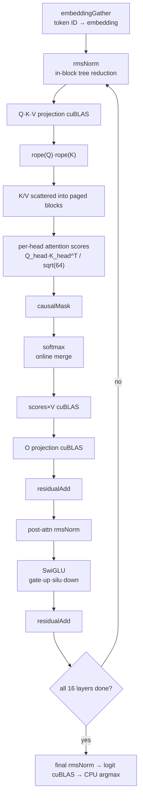
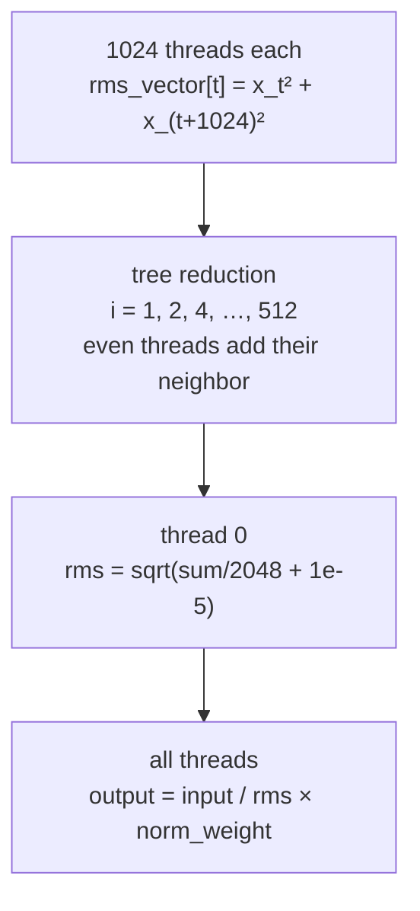

In Part 1 I said `prefill()` is a function that processes the entire prompt in one pass. All 17 tokens pass through everything from embedding to next-token selection within a single call. This part looks inside that function. We follow which kernels the tokens pass through on their way through one layer, in what order, and why that order has the shape it does, by reading each kernel's code.

`prefill` is simple in code. It pops a prompt from the queue, turns it into embeddings, and runs one loop over the 16 layers.

```cpp
    prompt = queue.front();
    prompt_len = prompt.size();
    queue.pop();
    is_slot_free[slot] = false;

    cudaMemcpy(gpu_input_tokens, prompt.data(), prompt_len * sizeof(int), cudaMemcpyHostToDevice);
    embeddingGather(gpu_input_tokens, input_embeddings, weights.embed_tokens, prompt_len);

    cudaMemcpy(hidden_state,
               input_embeddings,
               prompt_len * EMBEDDING_LENGTH * sizeof(__nv_bfloat16),
               cudaMemcpyDeviceToDevice);
    for (int layer = 0; layer < N_LAYERS; ++layer)
    {
        rmsNorm(hidden_state, rms_norms, weights.input_layernorm[layer], prompt_len);
```
— [`src/main.cpp:152-166`](https://github.com/jmaczan/tiny-vllm/blob/e25bf1994efa90bc98b721ba7c527402f86fbeaf/src/main.cpp#L152-L166)

`N_LAYERS = 16` is the number of layers in Llama 3.2 1B. The notable point is that the entire prompt flows through at once — the token count is not what the loop iterates over; all tokens are packed into a single matrix that enters one kernel call. This is the fundamental difference between prefill and decode, and it is why every kernel in the flow below takes the "number of tokens" as one of its dimensions.

What happens inside each layer is fixed. An attention block and an MLP block are joined by residual connections.

<!-- visual: prefill-kernel-sequence supports: [prefill-kernel-sequence] -->


The rest of this part unfolds each box on that map one by one, from the bottom up. Now we go through them in order.

## From token ID to embedding: embeddingGather

The first operation turns token IDs into 2048-dimensional embedding vectors. It copies the corresponding rows of the `model.embed_tokens` matrix. Because this is indexing rather than a matrix product, `embeddingGatherKernel` is solved purely with data parallelism.

```cpp
__global__ void embeddingGatherKernel(int *gpu_input_tokens, __nv_bfloat16 *gpu_input_embeds, __nv_bfloat16 *embed_tokens, int num_input_tokens)
{
    int workIndex = threadIdx.x + blockIdx.x * 2048;
    if (workIndex < num_input_tokens * 2048)
    {
        gpu_input_embeds[workIndex] = embed_tokens[gpu_input_tokens[blockIdx.x] * 2048 + threadIdx.x];
        gpu_input_embeds[workIndex + 1024] = embed_tokens[gpu_input_tokens[blockIdx.x] * 2048 + threadIdx.x + 1024];
    }
}

void embeddingGather(int *gpu_input_tokens, __nv_bfloat16 *gpu_input_embeds, __nv_bfloat16 *embed_tokens, int num_input_tokens)
{
    // even though embedding is 2048, I can only dispatch 1024 because it's max threads per block on my gpu
    embeddingGatherKernel<<<num_input_tokens, 1024>>>(gpu_input_tokens, gpu_input_embeds, embed_tokens, num_input_tokens);
}
```
— [`src/kernels.cu:32-45`](https://github.com/jmaczan/tiny-vllm/blob/e25bf1994efa90bc98b721ba7c527402f86fbeaf/src/kernels.cu#L32-L45)

`blockIdx.x` is the token number. One block handles one token, and 1024 threads split the embedding's 2048 slots in half (`workIndex` and `workIndex + 1024`). The per-block thread limit is 1024, so the comment says "max threads per block on my gpu". The embedding is 2048 wide but a single block cannot cover it, so each thread fills two slots.

The kernel therefore launches as `<<<num_input_tokens, 1024>>>`. It creates as many blocks as there are tokens, and each block looks only at its own token's embedding row.

## First operation: RMSNorm and the in-block tree reduction

A layer's first computation is `rmsNorm`. RMSNorm is a normalization proposed by [Zhang & Sennrich, 2019](https://arxiv.org/abs/1910.07467), which divides each element of an input vector by the root mean square (rms) and then multiplies by a learnable weight. In this repo, computing that rms is the first parallel reduction you run into.

One block is assigned per token row (2048 elements), and 1024 threads inside the block accumulate the sum of squares in shared memory.

```cpp
__global__ void rmsNormKernel(__nv_bfloat16 *input, __nv_bfloat16 *output, __nv_bfloat16 *norm_weights, int num_tokens)
{
    __shared__ float rms_vector[1024];
    int workIndex = threadIdx.x + blockIdx.x * 2048;
    if (workIndex < num_tokens * 2048)
    {
        rms_vector[threadIdx.x] = (float)input[workIndex] * (float)input[workIndex] + (float)input[workIndex + 1024] * (float)input[workIndex + 1024];
        __syncthreads();
        // tree reduction
        for (int i = 1; i < 1024; i = i * 2)
        {
            if (threadIdx.x % (i * 2) == 0)
            {
                rms_vector[threadIdx.x] = rms_vector[threadIdx.x] + rms_vector[threadIdx.x + i];
            }
            __syncthreads();
        }
        if (threadIdx.x == 0)
        {
            rms_vector[0] = sqrt(rms_vector[0] / 2048.0 + 1.0e-5);
        }
        __syncthreads();
        output[workIndex] = (__nv_bfloat16)(((float)input[workIndex] / rms_vector[0]) * (float)norm_weights[threadIdx.x]);
        output[workIndex + 1024] = (__nv_bfloat16)(((float)input[workIndex + 1024] / rms_vector[0]) * (float)norm_weights[threadIdx.x + 1024]);
    }
}
```
— [`src/kernels.cu:55-81`](https://github.com/jmaczan/tiny-vllm/blob/e25bf1994efa90bc98b721ba7c527402f86fbeaf/src/kernels.cu#L55-L81)

<!-- visual: rmsnorm-reduction supports: [rmsnorm-reduction] -->


The point of a parallel reduction is that if a single thread computed the whole sum, it would become sequential. Instead, 1024 threads each deposit a partial sum of two squares into shared memory `rms_vector`, and those values are halved pairwise — a tree — until reduced. Once thread 0 computes `sqrt(sum/2048 + 1e-5)` from the final sum, everyone else reads that value and normalizes. This kernel's race safety is simple: each thread writes only to its own slot `rms_vector[threadIdx.x]`, and `__syncthreads()` guarantees visibility in between.

Of the prefill-family kernels, only this rmsNorm and the softmax that comes later need a reduction, and both use the same tree-merge structure. The decode-family attention kernels use a different means, warp shuffle; that difference is covered in Parts 5 and 6.

Evidence that this kernel actually produces correct values is committed to the repo. `reference.txt` and `python/rms_norm_crosscheck.txt` are reference outputs generated by a Python script, and the front portions of the two files (lines 1-151) are exactly identical. That script ([`python/reference.py:43-44`](https://github.com/jmaczan/tiny-vllm/blob/e25bf1994efa90bc98b721ba7c527402f86fbeaf/python/reference.py#L43-L44), [`python/rms_norm.py:43-44`](https://github.com/jmaczan/tiny-vllm/blob/e25bf1994efa90bc98b721ba7c527402f86fbeaf/python/rms_norm.py#L43-L44)) defines the value of applying the first layer's `input_layernorm` to the embeddings.

```
Token IDs: [128000, 791, 6864, 315, 9822, 374]
...
RMSNorm output shape: torch.Size([1, 6, 2048])

Token 0 (id=128000) RMSNorm first 10 values:
  [0] = 0.021240234375
  [1] = 0.0289306640625
  [2] = -0.08935546875
  [3] = -0.025146484375
  [4] = -0.01904296875
  [5] = -0.002960205078125
  [6] = -0.007354736328125
  [7] = -0.03857421875
  [8] = 0.049072265625
  [9] = 0.0225830078125
```
— [`reference.txt:78-90`](https://github.com/jmaczan/tiny-vllm/blob/e25bf1994efa90bc98b721ba7c527402f86fbeaf/reference.txt#L78-L90)

These values are the output `rmsNormKernel` should produce at layer 0. They look like rounded decimals because every number is stored in bfloat16.

## Q/K/V projection: three cuBLAS calls

The normalized `rms_norms` are multiplied by the query, key, and value projection weights. The three calls have the same form and differ only in size — Q is (tokens, 2048), K and V are (tokens, 512).

```cpp
        q_proj = buf_2048_1;
        cublasStatus_t q_proj_status = cublasGemmEx(cublas_handle,
                                                    CUBLAS_OP_T,
                                                    CUBLAS_OP_N,
                                                    EMBEDDING_LENGTH,
                                                    prompt_len,
                                                    EMBEDDING_LENGTH,
                                                    &q_proj_alpha,
                                                    weights.w_q[layer],
                                                    CUDA_R_16BF,
                                                    EMBEDDING_LENGTH,
                                                    rms_norms,
                                                    CUDA_R_16BF,
                                                    EMBEDDING_LENGTH,
                                                    &q_proj_beta,
                                                    q_proj,
                                                    CUDA_R_16BF,
                                                    EMBEDDING_LENGTH,
                                                    CUBLAS_COMPUTE_32F,
                                                    CUBLAS_GEMM_DEFAULT);
```
— [`src/main.cpp:177-196`](https://github.com/jmaczan/tiny-vllm/blob/e25bf1994efa90bc98b721ba7c527402f86fbeaf/src/main.cpp#L177-L196)

Activations and weights are row-major, but cuBLAS assumes column-major, so the call uses just the `CUBLAS_OP_T` transpose flag plus lda/ldb/ldc. This convention is the most repeated pattern in this series, and why the call is made this way is covered in Part 4. Here it is enough to remember that "all three projections share the same call form, and the results land in `q_proj`, `k_proj_temp_buf`, and `v_proj_temp_buf` as (tokens, 2048)/(tokens, 512)/(tokens, 512) respectively". `buf_2048_1` is the aliased buffer from Part 2; in this spot it holds the Q result.

## RoPE: a rotation that references a table

RoPE is applied only to Q and K. RoPE (rotary positional embedding) is a positional encoding that mixes a token's position into the query and key vectors via sine and cosine rotations. [Fleetwood's visual explanation](https://fleetwood.dev/posts/you-could-have-designed-SOTA-positional-encoding) shows the intuition well. V is not rotated.

```cpp
        rope(q_proj, prompt_len, EMBEDDING_LENGTH);
        rope(k_proj_temp_buf, prompt_len, KV_DIM);
```
— [`src/main.cpp:244-245`](https://github.com/jmaczan/tiny-vllm/blob/e25bf1994efa90bc98b721ba7c527402f86fbeaf/src/main.cpp#L244-L245)

The kernel launches one block per token, reads one half of a head together with the other half, and rotates the pair.

```cpp
__global__ void ropeKernel_llama3(__nv_bfloat16 *input, int num_tokens, int proj_dim,
                                  int head_dim, const float *cos_table, const float *sin_table)
{
    int token_idx = blockIdx.x;
    int tid = threadIdx.x;
    int half_proj = proj_dim / 2;
    int half_dim = head_dim / 2;

    if (tid >= half_proj)
        return;

    int head_idx = tid / half_dim;
    int pair_idx = tid % half_dim;

    int base = token_idx * proj_dim + head_idx * head_dim;
    int idx1 = base + pair_idx;
    int idx2 = base + pair_idx + half_dim;

    float x1 = (float)input[idx1];
    float x2 = (float)input[idx2];

    int table_idx = token_idx * head_dim + pair_idx * 2;
    float c = cos_table[table_idx];
    float s = sin_table[table_idx];

    input[idx1] = (__nv_bfloat16)(x1 * c - x2 * s);
    input[idx2] = (__nv_bfloat16)(x1 * s + x2 * c);
}
```
— [`src/kernels.cu:173-200`](https://github.com/jmaczan/tiny-vllm/blob/e25bf1994efa90bc98b721ba7c527402f86fbeaf/src/kernels.cu#L173-L200)

The kernel does not compute the cos and sin values used in the rotation. `init_rope_frequencies`([`src/kernels.cu:96-152`](https://github.com/jmaczan/tiny-vllm/blob/e25bf1994efa90bc98b721ba7c527402f86fbeaf/src/kernels.cu#L96-L152)) pre-fills `d_cos_table` and `d_sin_table` of size `[max_seq_len, head_dim]` at program startup ([`src/main.cpp:572`](https://github.com/jmaczan/tiny-vllm/blob/e25bf1994efa90bc98b721ba7c527402f86fbeaf/src/main.cpp#L572)) and uploads them to the GPU. The kernel finds its own frequency term via `token_idx * head_dim + pair_idx * 2`. Because adjacent even/odd elements were filled with the same value when the table was built, a pair uses the same c and s.

This kernel's launch guard has a different character from the rest. causalMask and softmax skip the launch and print only a warning when the **number of tokens** exceeds 1024. In contrast, `rope()`'s guard checks the thread count.

```cpp
void rope(__nv_bfloat16 *input, int num_tokens, int proj_dim)
{
    int num_threads = proj_dim / 2;
    if (num_threads > 1024)
    {
        std::cout << "Can't launch more than 1024 threads on RTX 5090, RoPE kernel not launched";
        return;
    }

    ropeKernel_llama3<<<num_tokens, num_threads>>>(
        input, num_tokens, proj_dim, HEAD_DIM, d_cos_table, d_sin_table);
}
```
— [`src/kernels.cu:202-212`](https://github.com/jmaczan/tiny-vllm/blob/e25bf1994efa90bc98b721ba7c527402f86fbeaf/src/kernels.cu#L202-L212)

The condition is `num_threads > 1024` and `num_threads = proj_dim / 2`, so what is checked is the projection width, not the token count. In this model both Q (`2048/2 = 1024`) and K (`512/2 = 256`) stay within 1024, so the guard never trips. No kernel ever sees a "token count above 1024" because the prompt length is capped at `MAX_PROMPT_LEN = 512`, so the causalMask and softmax guards never trip either.

## Distributing K/V into paged blocks

Next is preparation for attention. Q, K, and V are scattered in (tokens, 512) form, and attention needs the K and V of all past tokens. This repo writes those K and V into the 16-token blocks of the KV cache. This is the write side of the PagedAttention we saw in Part 1. Rather than holding the KV cache as one contiguous chunk, it is split into blocks, and a physical block is pulled from `free_blocks` one at a time whenever a sequence needs one.

```cpp
            int block_idx = token_idx / BLOCK_SIZE;
            int block = block_table[slot * N_LAYERS * MAX_BLOCKS_PER_SEQ + layer * MAX_BLOCKS_PER_SEQ + block_idx];
            if (block == -1)
            {
                int physical_block_idx = free_blocks.back();
                free_blocks.pop_back();
                block = physical_block_idx;
                block_table[slot * N_LAYERS * MAX_BLOCKS_PER_SEQ + layer * MAX_BLOCKS_PER_SEQ + block_idx] = block;
            }
            else
            {
                assert(false && "block must be -1 during prefill - what happened?");
                // probably in prefill this doesn't make a lot of sense? but will matter in decode
            }

            // store K
            __nv_bfloat16 *k_cache_ptr = (__nv_bfloat16 *)((char *)kv_cache + block * BLOCK_BYTES);
            __nv_bfloat16 *k_proj_ptr = k_proj_temp_buf + token_idx * KV_DIM;
            cudaMemcpy(k_cache_ptr, k_proj_ptr, num_tokens_to_copy * KV_DIM * sizeof(__nv_bfloat16), cudaMemcpyDeviceToDevice);

            // store V
            __nv_bfloat16 *v_cache_ptr = (__nv_bfloat16 *)((char *)kv_cache + block * BLOCK_BYTES + V_OFFSET);
            __nv_bfloat16 *v_proj_ptr = v_proj_temp_buf + token_idx * KV_DIM;
            cudaMemcpy(v_cache_ptr, v_proj_ptr, num_tokens_to_copy * KV_DIM * sizeof(__nv_bfloat16), cudaMemcpyDeviceToDevice);
```
— [`src/main.cpp:264-287`](https://github.com/jmaczan/tiny-vllm/blob/e25bf1994efa90bc98b721ba7c527402f86fbeaf/src/main.cpp#L264-L287)

16 tokens make one block (`BLOCK_SIZE = 16`). `token_idx / BLOCK_SIZE` is the logical block number, and the physical block for that number is read from `block_table`. `-1` means "not yet assigned", so one is popped from the back of `free_blocks` and recorded. In prefill an already-assigned block is never encountered, so `assert(false)` declares that fact — in decode this branch takes on a different meaning, which is Part 5. K is written to the start of the block and V `V_OFFSET` bytes later via `cudaMemcpy` (D2D). The block layout and the reading-side kernel are covered in Part 6.

## Per-head attention scores and GQA

Now the attention scores are computed from Q and K. For each of the 32 Q heads we build one (tokens, tokens) score matrix and store it in `prefill_attn_scores`(`512×512×32`, [`src/main.cpp:647-648`](https://github.com/jmaczan/tiny-vllm/blob/e25bf1994efa90bc98b721ba7c527402f86fbeaf/src/main.cpp#L647-L648)).

GQA (grouped-query attention) is attention with many query heads but fewer key and value heads, where several consecutive query heads share one key and value head ([Ainslie et al., 2023](https://arxiv.org/pdf/2305.13245)). This model has 32 Q heads and 8 K/V heads, a ratio of 4.

```cpp
        for (int i = 0; i < NUM_Q_HEADS; ++i)
        {
            int k_head_idx = i / GQA_Q_TO_K_RATIO;
            __nv_bfloat16 *q_head = q_proj + i * HEAD_DIM;
            __nv_bfloat16 *k_head = k_proj_temp_buf + k_head_idx * HEAD_DIM;
            __nv_bfloat16 *attn_score_head = prefill_attn_scores + prompt_len * prompt_len * i;

            cublasStatus_t attn_score_status = cublasGemmEx(cublas_handle,
                                                            CUBLAS_OP_T,
                                                            CUBLAS_OP_N,
                                                            prompt_len,
                                                            prompt_len,
                                                            HEAD_DIM,
                                                            &attn_alpha,
                                                            k_head,
                                                            CUDA_R_16BF,
                                                            KV_DIM,
                                                            q_head,
                                                            CUDA_R_16BF,
                                                            EMBEDDING_LENGTH,
                                                            &attn_beta,
                                                            attn_score_head,
                                                            CUDA_R_16BF,
                                                            prompt_len,
                                                            CUBLAS_COMPUTE_32F,
                                                            CUBLAS_GEMM_DEFAULT);
        }
```
— [`src/main.cpp:301-327`](https://github.com/jmaczan/tiny-vllm/blob/e25bf1994efa90bc98b721ba7c527402f86fbeaf/src/main.cpp#L301-L327)

`k_head_idx = i / 4` is the one-line core of GQA. Q heads 0-3 use K head 0, Q heads 4-7 use K head 1, and so on: four queries share one key. The scale is `attn_alpha = 1.0f / 8.0f`([`src/main.cpp:649`](https://github.com/jmaczan/tiny-vllm/blob/e25bf1994efa90bc98b721ba7c527402f86fbeaf/src/main.cpp#L649)), i.e. `1/sqrt(64)`, the inverse square root of `HEAD_DIM = 64`. Each call produces a (tokens, tokens) matrix `Q_head · K_head^T` scaled by `1/8` and writes it to `attn_score_head`.

## causalMask and online softmax

Before normalizing the scores, the future is masked. `causalMask` overwrites a cell with `-HUGE_VALF` if its column (the past-future axis) is greater than its row.

```cpp
__global__ void causalMaskKernel(__nv_bfloat16 *input, int num_tokens)
{
    if (threadIdx.x + blockIdx.x * blockDim.x >= num_tokens * num_tokens * NUM_Q_HEADS)
    {
        return;
    }

    int column = threadIdx.x;
    int row = blockIdx.x % num_tokens;
    if (column > row)
    {
        input[blockIdx.x * num_tokens + threadIdx.x] = -HUGE_VALF;
    }
}
```
— [`src/kernels.cu:224-237`](https://github.com/jmaczan/tiny-vllm/blob/e25bf1994efa90bc98b721ba7c527402f86fbeaf/src/kernels.cu#L224-L237)

It launches as `<<<num_tokens * NUM_Q_HEADS, num_tokens>>>`([`src/kernels.cu:247`](https://github.com/jmaczan/tiny-vllm/blob/e25bf1994efa90bc98b721ba7c527402f86fbeaf/src/kernels.cu#L247)), so one block handles "one row of one head". The masked value is a very large negative number rather than `-inf`, so that `exp()` evaluates to 0 in the following softmax step. Masked cells stay in the softmax formula, but only their probability becomes 0.

Next comes softmax. This kernel is not the usual two-pass. Without a pass that first finds the row maximum, it merges the running maximum and the exponential sum together in a tree. This technique is online softmax, and it is also the approach FlashAttention uses ([CSE599M lecture notes](https://courses.cs.washington.edu/courses/cse599m/23sp/notes/flashattn.pdf)). The very act of defining softmax as "exp(x - max)/Σexp(x - max)" produces the merge rule: two partial sums can be aligned to a common anchor and combined.

```cpp
__global__ void softmaxKernel(__nv_bfloat16 *input, int num_tokens)
{
    __shared__ float m[1024]; // running max per tree node
    __shared__ float d[1024]; // running denominator (sum of exp) per tree node

    int workIndex = blockIdx.x * num_tokens + threadIdx.x;
    float token = (float)input[workIndex];

    m[threadIdx.x] = token;
    d[threadIdx.x] = 1.0f;
    __syncthreads();

    for (int i = 1; i < num_tokens; i = i * 2)
    {
        if (threadIdx.x % (i * 2) == 0 && threadIdx.x + i < num_tokens)
        {
            float m_a = m[threadIdx.x];
            float d_a = d[threadIdx.x];
            float m_b = m[threadIdx.x + i];
            float d_b = d[threadIdx.x + i];

            float m_new = fmaxf(m_a, m_b);
            float d_new = d_a * expf(m_a - m_new) + d_b * expf(m_b - m_new);

            m[threadIdx.x] = m_new;
            d[threadIdx.x] = d_new;
        }
        __syncthreads();
    }

    input[workIndex] = (__nv_bfloat16)(expf(token - m[0]) / d[0]);
}
```
— [`src/kernels.cu:257-290`](https://github.com/jmaczan/tiny-vllm/blob/e25bf1994efa90bc98b721ba7c527402f86fbeaf/src/kernels.cu#L257-L290)

One block handles one row. Each thread starts with its own element as a leaf (`m = x`, `d = 1`), and the two partial results are merged in the same tree as rmsNorm. The merge rule is `m_new = max(m_a, m_b)` and `d_new = d_a·exp(m_a - m_new) + d_b·exp(m_b - m_new)`. Because the two parts hold their sums relative to different maxima, the lower side is recalibrated to the larger maximum and added. It uses the same `threadIdx.x % (i * 2) == 0` pattern as rmsNorm's tree reduction, so the prefill-family reductions are in effect two uses of one structure.

Evidence that this merge actually produces the same values as two-pass is in `tests/test_softmax.cu`. This file is an independent test that calls `softmax()` directly, feeds it several stress rows, and checks that each row sums close to 1 with no NaN/Inf.

```cpp
    float sum = 0.0f;
    bool ok = true;
    for (int i = 0; i < num_tokens; i++)
    {
        float v = (float)host_output[i];
        if (std::isnan(v) || std::isinf(v))
        {
            std::cout << label << ": got NaN/Inf at index " << i << "\n";
            ok = false;
        }
        sum += v;
    }

    if (std::abs(sum - 1.0f) > 0.01f)
    {
        std::cout << label << ": row sums to " << sum << ", expected ~1.0\n";
        ok = false;
    }

    std::cout << (ok ? "PASS  " : "FAIL  ") << label << " (sum=" << sum << ")\n";
```
— [`tests/test_softmax.cu:87-107`](https://github.com/jmaczan/tiny-vllm/blob/e25bf1994efa90bc98b721ba7c527402f86fbeaf/tests/test_softmax.cu#L87-L107)

There are five cases — ordinary values, a row where every maximum is tied (`tied_max_8`), a row with one overwhelmingly large element (`stability_spike_8`), an all-negative row (`all_negative_8`), and length 16 (`bigger_16`).

```cpp
    all_ok &= run_case("ordinary_8", {1.0f, 2.0f, 3.0f, 0.5f, -1.0f, 4.0f, 2.5f, 0.1f});
    all_ok &= run_case("tied_max_8", {3.0f, 3.0f, 3.0f, 3.0f, 3.0f, 3.0f, 3.0f, 3.0f});
    all_ok &= run_case("stability_spike_8", {0.001f, 0.001f, 0.001f, 50.0f, 0.001f, 0.001f, 0.001f, 0.001f});
    all_ok &= run_case("all_negative_8", {-5.0f, -3.0f, -10.0f, -1.0f, -8.0f, -2.0f, -6.0f, -4.0f});
    all_ok &= run_case("bigger_16", {1.0f, 2.0f, 3.0f, 4.0f, 5.0f, 6.0f, 7.0f, 8.0f,
                                      -1.0f, -2.0f, 0.5f, 0.0f, 9.0f, -9.0f, 2.2f, 3.3f});
```
— [`tests/test_softmax.cu:114-119`](https://github.com/jmaczan/tiny-vllm/blob/e25bf1994efa90bc98b721ba7c527402f86fbeaf/tests/test_softmax.cu#L114-L119)

The file's header comment ([`tests/test_softmax.cu:1-52`](https://github.com/jmaczan/tiny-vllm/blob/e25bf1994efa90bc98b721ba7c527402f86fbeaf/tests/test_softmax.cu#L1-L52)) states that the merge kernel was compared against the earlier two-pass version on the same inputs, and every value matched to the last bfloat16 bit. That is the file's own claim. This series has no GPU, so it does not re-run that verification.

## Scores×V → O → residual → SwiGLU

The normalized scores are multiplied by V. GQA applies here too — `v_head_idx = i / GQA_ATTN_SCORES_TO_V_RATIO` makes four query heads share one value head. The output concatenates the 32 heads into (tokens, 2048) and writes directly into `buf_2048_1`, which held the Q result (the Part 2 alias).

```cpp
        attn_scores_v = buf_2048_1;
        for (int i = 0; i < NUM_Q_HEADS; ++i)
        {
            int v_head_idx = i / GQA_ATTN_SCORES_TO_V_RATIO;
            __nv_bfloat16 *attn_scores_head = prefill_attn_scores + i * prompt_len * prompt_len;
            __nv_bfloat16 *v_head = v_proj_temp_buf + v_head_idx * HEAD_DIM;
            __nv_bfloat16 *output_attn_scores_head = attn_scores_v + i * HEAD_DIM;
```
— [`src/main.cpp:343-350`](https://github.com/jmaczan/tiny-vllm/blob/e25bf1994efa90bc98b721ba7c527402f86fbeaf/src/main.cpp#L343-L350)

Then the O projection ([`src/main.cpp:378-396`](https://github.com/jmaczan/tiny-vllm/blob/e25bf1994efa90bc98b721ba7c527402f86fbeaf/src/main.cpp#L378-L396)) maps (tokens, 2048) back to (tokens, 2048), and the residual is added. The residual is not a cuBLAS beta factor but a separate kernel.

```cpp
__global__ void residualKernel(__nv_bfloat16 *input, __nv_bfloat16 *input_embeds)
{
    int workIndex = threadIdx.x + blockIdx.x * 2048;
    input[workIndex] = input[workIndex] + input_embeds[workIndex];
    input[workIndex + 1024] = input[workIndex + 1024] + input_embeds[workIndex + 1024];
}
```
— [`src/kernels.cu:311-316`](https://github.com/jmaczan/tiny-vllm/blob/e25bf1994efa90bc98b721ba7c527402f86fbeaf/src/kernels.cu#L311-L316)

Afterwards it passes through the post-attention RMSNorm again and into the MLP block. The MLP is SwiGLU. The gate and up projections (both (tokens, 8192)) are computed with cuBLAS, then `silu` wakes up the gate with SiLU, multiplies it element-wise with up, and overwrites the gate slot with the result. As the "in-place" comment honestly says, once the computation finishes, the `gate` buffer becomes the input of the down projection.

```cpp
        // SiLU
        // after_silu = SiLU(gate) * up (element-wise multication)
        // after_silu = gate * (1 / (1 + e^(-gate))) * up
        // gate is dim (num_tok, 8192), up too
        silu(gate, up, prompt_len); // gate = after_silu now
```
— [`src/main.cpp:455-459`](https://github.com/jmaczan/tiny-vllm/blob/e25bf1994efa90bc98b721ba7c527402f86fbeaf/src/main.cpp#L455-L459)

```cpp
__global__ void siluKernel(__nv_bfloat16 *a, __nv_bfloat16 *b)
{
    int workIndex = threadIdx.x + blockIdx.x * 8192;
    for (int i = 0; i < 8192; i += 1024)
    {
        a[workIndex + i] = (__nv_bfloat16)((float)a[workIndex + i] * (1 / (1 + expf(-(float)a[workIndex + i]))) * (float)b[workIndex + i]);
    }
}
```
— [`src/kernels.cu:331-338`](https://github.com/jmaczan/tiny-vllm/blob/e25bf1994efa90bc98b721ba7c527402f86fbeaf/src/kernels.cu#L331-L338)

Then the down projection ([`src/main.cpp:471-489`](https://github.com/jmaczan/tiny-vllm/blob/e25bf1994efa90bc98b721ba7c527402f86fbeaf/src/main.cpp#L471-L489)) brings (tokens, 8192) back to (tokens, 2048), and `residualAdd` adds it to the hidden state. That finishes one layer, and the loop returns to the next layer's rmsNorm.

## Choosing the next token: final RMSNorm, logits, argmax

After all 16 layers, it passes through the final RMSNorm([`src/main.cpp:494`](https://github.com/jmaczan/tiny-vllm/blob/e25bf1994efa90bc98b721ba7c527402f86fbeaf/src/main.cpp#L494)) and produces logits. The logits are a matrix product with the embedding matrix — `embed_tokens`(128256, 2048) times (tokens, 2048), giving (tokens, 128256)([`src/main.cpp:509-527`](https://github.com/jmaczan/tiny-vllm/blob/e25bf1994efa90bc98b721ba7c527402f86fbeaf/src/main.cpp#L509-L527)). The result is copied down to the CPU, and argmax picks the next token from the last token's row.

```cpp
    int last_token_offset = (prompt_len - 1) * VOCAB_SIZE;
    float max_token = (float)embed_proj_cpu[last_token_offset];
    int max_token_idx = 0;
    for (int token_idx = 0; token_idx < VOCAB_SIZE; ++token_idx)
    {
        if ((float)embed_proj_cpu[token_idx + last_token_offset] > max_token)
        {
            max_token = embed_proj_cpu[token_idx + last_token_offset];
            max_token_idx = token_idx;
        }
    }
```
— [`src/main.cpp:533-543`](https://github.com/jmaczan/tiny-vllm/blob/e25bf1994efa90bc98b721ba7c527402f86fbeaf/src/main.cpp#L533-L543)

Only the last token's logits are needed, not the whole prompt, so it starts at `last_token_offset = (prompt_len - 1) * VOCAB_SIZE`. The source comment ([`src/main.cpp:531-532`](https://github.com/jmaczan/tiny-vllm/blob/e25bf1994efa90bc98b721ba7c527402f86fbeaf/src/main.cpp#L531-L532)) leaves a TODO to replace this argmax with "a proper kernel later" — this code, which walks 128256 entries in a CPU loop, is one of the spots that best shows prefill's character (and its procrastination).

When prefill ends, the generated token is recorded in `generated_tokens`, and the block table is synced to the GPU side ([`src/main.cpp:546-552`](https://github.com/jmaczan/tiny-vllm/blob/e25bf1994efa90bc98b721ba7c527402f86fbeaf/src/main.cpp#L546-L552)). When this function returns, the decode loop moves to the stage of appending tokens one at a time. Why this function, which flows the entire prompt at once, looks so different from the decode-family kernels, which flow a single token, is the subject of the next part.

## Further reading

This is the background material the repo builds on.

- [RoPE visual explanation (Fleetwood)](https://fleetwood.dev/posts/you-could-have-designed-SOTA-positional-encoding) — the intuition behind positional-encoding rotations
- [RMSNorm (Zhang & Sennrich, 2019)](https://arxiv.org/abs/1910.07467) — the original paper on root-mean-square normalization
- [FlashAttention / online softmax lecture notes](https://courses.cs.washington.edu/courses/cse599m/23sp/notes/flashattn.pdf) — the softmax merge rule and its generalization
- [CUDA parallel reductions (NVIDIA)](https://developer.download.nvidia.com/assets/cuda/files/reduction.pdf) — the background behind tree reductions
- [GQA (Ainslie et al., 2023)](https://arxiv.org/pdf/2305.13245) — the motivation for query-head sharing
- [Llama 3.2 1B Instruct model card](https://huggingface.co/meta-llama/Llama-3.2-1B-Instruct) — the source of this article's constants (`N_LAYERS`, `EMBEDDING_LENGTH`, number of heads)

## Limitations of this article

Like Part 1, this part was not built or run. All explanations were obtained by reading the source at commit `e25bf19`, and the kernel order is supported only by source-order citations. `reference.txt` and `python/rms_norm_crosscheck.txt` are quoted as the repo's committed reference output, not as measurements re-run in this environment. The `tests/test_softmax.cu` claim of "bit-identical to two-pass" is likewise the file's own statement, and because there is no GPU or CUDA toolchain, this series does not perform that verification.
