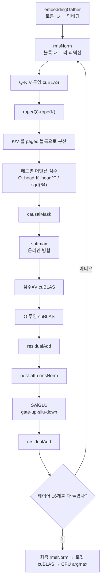
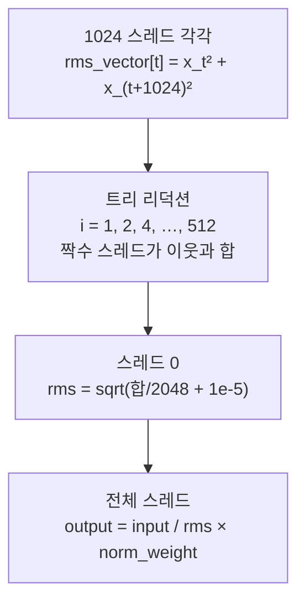

1편에서 `prefill()` 은 프롬프트 전체를 한 번에 처리하는 함수라고 했다. 17개 토큰이 한 호출 안에서 임베딩부터 다음 토큰 선택까지 통과한다. 이번 편은 그 함수의 안을 본다. 토큰들이 레이어 하나를 지나는 동안 어떤 커널을, 어떤 순서로 거치는지, 그리고 그 순서가 왜 그 모양인지를 각 커널 코드로 따라간다.

`prefill` 은 코드로는 간단하다. 프롬프트를 큐에서 꺼내 임베딩으로 바꾸고, 16개 레이어를 도는 반복문 하나다.

```cpp
    prompt = queue.front();
    prompt_len = prompt.size();
    queue.pop();
    is_slot_free[slot] = false;

    cudaMemcpy(gpu_input_tokens, prompt.data(), prompt_len * sizeof(int), cudaMemcpyHostToDevice);
    embeddingGather(gpu_input_tokens, input_embeddings, weights.embed_tokens, prompt_len);

    cudaMemcpy(hidden_state,
               input_embeddings,
               prompt_len * EMBEDDING_LENGTH * sizeof(__nv_bfloat16),
               cudaMemcpyDeviceToDevice);
    for (int layer = 0; layer < N_LAYERS; ++layer)
    {
        rmsNorm(hidden_state, rms_norms, weights.input_layernorm[layer], prompt_len);
```
— [`src/main.cpp:152-166`](https://github.com/jmaczan/tiny-vllm/blob/e25bf1994efa90bc98b721ba7c527402f86fbeaf/src/main.cpp#L152-L166)

`N_LAYERS = 16` 은 Llama 3.2 1B 의 레이어 수다. 주목할 지점은 프롬프트 전체가 한 번에 흐른다는 것 — 토큰 개수가 루프를 도는 기준이 아니라, 모든 토큰이 하나의 행렬로 묶여 한 커널 호출에 들어간다. 이게 prefill 과 decode 의 근본 차이이고, 그래서 아래 흐름의 모든 커널이 "토큰 수"를 한 차원으로 받는다.

각 레이어 안에서 일어나는 일은 정해져 있다. 어텐션 블록과 MLP 블록이 잔차 연결로 이어진다.

<!-- visual: prefill-kernel-sequence supports: [prefill-kernel-sequence] -->


나머지 편은 이 지도의 각 칸을 아래에서부터 하나씩 펼친다. 이제 순서대로 본다.

## 토큰 ID 를 임베딩으로: embeddingGather

첫 연산은 토큰 ID 를 2048차원 임베딩 벡터로 바꾸는 일이다. `model.embed_tokens` 행렬의 해당 행을 복사해 온다. 행렬곱이 아니라 인덱싱이라서 `embeddingGatherKernel` 은 데이터 병렬로만 푼다.

```cpp
__global__ void embeddingGatherKernel(int *gpu_input_tokens, __nv_bfloat16 *gpu_input_embeds, __nv_bfloat16 *embed_tokens, int num_input_tokens)
{
    int workIndex = threadIdx.x + blockIdx.x * 2048;
    if (workIndex < num_input_tokens * 2048)
    {
        gpu_input_embeds[workIndex] = embed_tokens[gpu_input_tokens[blockIdx.x] * 2048 + threadIdx.x];
        gpu_input_embeds[workIndex + 1024] = embed_tokens[gpu_input_tokens[blockIdx.x] * 2048 + threadIdx.x + 1024];
    }
}

void embeddingGather(int *gpu_input_tokens, __nv_bfloat16 *gpu_input_embeds, __nv_bfloat16 *embed_tokens, int num_input_tokens)
{
    // even though embedding is 2048, I can only dispatch 1024 because it's max threads per block on my gpu
    embeddingGatherKernel<<<num_input_tokens, 1024>>>(gpu_input_tokens, gpu_input_embeds, embed_tokens, num_input_tokens);
}
```
— [`src/kernels.cu:32-45`](https://github.com/jmaczan/tiny-vllm/blob/e25bf1994efa90bc98b721ba7c527402f86fbeaf/src/kernels.cu#L32-L45)

`blockIdx.x` 가 토큰 번호다. 블록 하나가 토큰 하나를 담당하고, 1024개 스레드가 임베딩 2048칸을 절반씩 나눠 쓴다(`workIndex` 와 `workIndex + 1024`). 블록당 스레드 수는 1024 가 한계라 주석이 "max threads per block on my gpu" 라고 남겨 두었다. 임베딩은 2048 이지만 블록 하나로는 못 잡으니, 각 스레드가 두 칸을 채우는 방식이다.

이 커널은 그래서 `<<<num_input_tokens, 1024>>>` 로 뜬다. 토큰 수만큼 블록을 만들고, 각 블록이 자기 토큰의 임베딩 행만 본다.

## 첫 연산: RMSNorm 과 블록 내 트리 리덕션

레이어의 첫 계산은 `rmsNorm` 이다. RMSNorm 은 [Zhang & Sennrich, 2019](https://arxiv.org/abs/1910.07467)가 제안한 정규화로, 입력 벡터의 제곱 평균의 제곱근(rms)으로 각 요소를 나눈 뒤 학습 가능한 가중치를 곱한다. 이 저장소에서는 이 rms 를 구하는 일이 가장 먼저 만나는 병렬 리덕션이다.

각 토큰 행(2048 요소)마다 한 블록이 할당되고, 블록 안 1024개 스레드가 제곱의 합을 shared memory 에 모은다.

```cpp
__global__ void rmsNormKernel(__nv_bfloat16 *input, __nv_bfloat16 *output, __nv_bfloat16 *norm_weights, int num_tokens)
{
    __shared__ float rms_vector[1024];
    int workIndex = threadIdx.x + blockIdx.x * 2048;
    if (workIndex < num_tokens * 2048)
    {
        rms_vector[threadIdx.x] = (float)input[workIndex] * (float)input[workIndex] + (float)input[workIndex + 1024] * (float)input[workIndex + 1024];
        __syncthreads();
        // tree reduction
        for (int i = 1; i < 1024; i = i * 2)
        {
            if (threadIdx.x % (i * 2) == 0)
            {
                rms_vector[threadIdx.x] = rms_vector[threadIdx.x] + rms_vector[threadIdx.x + i];
            }
            __syncthreads();
        }
        if (threadIdx.x == 0)
        {
            rms_vector[0] = sqrt(rms_vector[0] / 2048.0 + 1.0e-5);
        }
        __syncthreads();
        output[workIndex] = (__nv_bfloat16)(((float)input[workIndex] / rms_vector[0]) * (float)norm_weights[threadIdx.x]);
        output[workIndex + 1024] = (__nv_bfloat16)(((float)input[workIndex + 1024] / rms_vector[0]) * (float)norm_weights[threadIdx.x + 1024]);
    }
}
```
— [`src/kernels.cu:55-81`](https://github.com/jmaczan/tiny-vllm/blob/e25bf1994efa90bc98b721ba7c527402f86fbeaf/src/kernels.cu#L55-L81)

<!-- visual: rmsnorm-reduction supports: [rmsnorm-reduction] -->


병렬 리덕션의 요점은 "합을 한 스레드가 몽땅 구하면 순차가 된다"는 데 있다. 대신 1024개 스레드가 각자 제곱 두 개를 더한 부분 합을 shared memory `rms_vector` 에 남기고, 그 값을 이웃끼리 반씩 합쳐 가는 트리 구조로 줄인다. 스레드 0 이 최종 합으로 `sqrt(합/2048 + 1e-5)` 를 계산하면, 나머지 전부가 그 값을 읽어 정규화한다. 이 커널의 레이스 안전성은 단순하다. 각 스레드는 `rms_vector[threadIdx.x]` 자기 칸에만 쓰고, `__syncthreads()` 가 그 사이의 가시성을 보장한다.

prefill 계열에서 리덕션이 필요한 커널은 이 rmsNorm 과 뒤에 나올 softmax 둘뿐이고, 둘 다 같은 트리 병합 구조를 쓴다. decode 계열의 어텐션 커널은 워프 셔플이라는 다른 수단을 쓰는데, 그 차이는 5·6편에서 다룬다.

이 커널이 실제로 옳은 값을 내는지에 대한 근거가 저장소에 커밋되어 있다. `reference.txt` 와 `python/rms_norm_crosscheck.txt` 는 파이썬 스크립트가 만든 참조 출력이고, 두 파일의 앞부분(1-151행)은 완전히 같다. 그 스크립트([`python/reference.py:43-44`](https://github.com/jmaczan/tiny-vllm/blob/e25bf1994efa90bc98b721ba7c527402f86fbeaf/python/reference.py#L43-L44), [`python/rms_norm.py:43-44`](https://github.com/jmaczan/tiny-vllm/blob/e25bf1994efa90bc98b721ba7c527402f86fbeaf/python/rms_norm.py#L43-L44))는 첫 레이어의 `input_layernorm` 을 임베딩에 적용한 값을 정의한다.

```
Token IDs: [128000, 791, 6864, 315, 9822, 374]
...
RMSNorm output shape: torch.Size([1, 6, 2048])

Token 0 (id=128000) RMSNorm first 10 values:
  [0] = 0.021240234375
  [1] = 0.0289306640625
  [2] = -0.08935546875
  [3] = -0.025146484375
  [4] = -0.01904296875
  [5] = -0.002960205078125
  [6] = -0.007354736328125
  [7] = -0.03857421875
  [8] = 0.049072265625
  [9] = 0.0225830078125
```
— [`reference.txt:78-90`](https://github.com/jmaczan/tiny-vllm/blob/e25bf1994efa90bc98b721ba7c527402f86fbeaf/reference.txt#L78-L90)

이 값들이 `rmsNormKernel` 이 레이어 0 에서 내야 하는 출력이다. 값이 반올림된 10진수로 보이는 이유는 모든 수치가 bfloat16 으로 저장되어 있기 때문이다.

## Q/K/V 투영: cuBLAS 세 번

정규화된 `rms_norms` 에 쿼리·키·밸류 투영 가중치를 곱한다. 세 호출은 형태가 같고 크기만 다르다 — Q 는 (토큰, 2048), K·V 는 (토큰, 512)다.

```cpp
        q_proj = buf_2048_1;
        cublasStatus_t q_proj_status = cublasGemmEx(cublas_handle,
                                                    CUBLAS_OP_T,
                                                    CUBLAS_OP_N,
                                                    EMBEDDING_LENGTH,
                                                    prompt_len,
                                                    EMBEDDING_LENGTH,
                                                    &q_proj_alpha,
                                                    weights.w_q[layer],
                                                    CUDA_R_16BF,
                                                    EMBEDDING_LENGTH,
                                                    rms_norms,
                                                    CUDA_R_16BF,
                                                    EMBEDDING_LENGTH,
                                                    &q_proj_beta,
                                                    q_proj,
                                                    CUDA_R_16BF,
                                                    EMBEDDING_LENGTH,
                                                    CUBLAS_COMPUTE_32F,
                                                    CUBLAS_GEMM_DEFAULT);
```
— [`src/main.cpp:177-196`](https://github.com/jmaczan/tiny-vllm/blob/e25bf1994efa90bc98b721ba7c527402f86fbeaf/src/main.cpp#L177-L196)

활성과 가중치는 행 우선인데 cuBLAS 는 열 우선을 가정하므로, `CUBLAS_OP_T` 전치 플래그와 lda/ldb/ldc 만으로 호출한다. 이 규약이 이 시리즈에서 가장 흔하게 반복되는 패턴이며, 왜 이렇게 부르는지는 4편이 다룬다. 여기서는 "세 투영이 전부 같은 호출 형식이고, 결과는 `q_proj`, `k_proj_temp_buf`, `v_proj_temp_buf` 에 각각 (토큰, 2048)/(토큰, 512)/(토큰, 512)로 쌓인다"고만 기억하면 된다. `buf_2048_1` 은 2편에서 본 별칭 버퍼로, 이 자리에서는 Q 결과를 담는다.

## RoPE: 테이블을 참조하는 회전

Q 와 K 에만 RoPE 를 적용한다. RoPE(rotary positional embedding) 는 토큰의 위치를 사인·코사인 회전으로 쿼리·키 벡터에 섞는 위치 인코딩이다. [Fleetwood 의 시각적 해설](https://fleetwood.dev/posts/you-could-have-designed-SOTA-positional-encoding)이 직관을 잘 보여준다. V 는 회전하지 않는다.

```cpp
        rope(q_proj, prompt_len, EMBEDDING_LENGTH);
        rope(k_proj_temp_buf, prompt_len, KV_DIM);
```
— [`src/main.cpp:244-245`](https://github.com/jmaczan/tiny-vllm/blob/e25bf1994efa90bc98b721ba7c527402f86fbeaf/src/main.cpp#L244-L245)

커널은 토큰마다 블록 하나를 띄우고, 헤드 하나의 절반과 나머지 절반을 한 쌍으로 읽어 회전시킨다.

```cpp
__global__ void ropeKernel_llama3(__nv_bfloat16 *input, int num_tokens, int proj_dim,
                                  int head_dim, const float *cos_table, const float *sin_table)
{
    int token_idx = blockIdx.x;
    int tid = threadIdx.x;
    int half_proj = proj_dim / 2;
    int half_dim = head_dim / 2;

    if (tid >= half_proj)
        return;

    int head_idx = tid / half_dim;
    int pair_idx = tid % half_dim;

    int base = token_idx * proj_dim + head_idx * head_dim;
    int idx1 = base + pair_idx;
    int idx2 = base + pair_idx + half_dim;

    float x1 = (float)input[idx1];
    float x2 = (float)input[idx2];

    int table_idx = token_idx * head_dim + pair_idx * 2;
    float c = cos_table[table_idx];
    float s = sin_table[table_idx];

    input[idx1] = (__nv_bfloat16)(x1 * c - x2 * s);
    input[idx2] = (__nv_bfloat16)(x1 * s + x2 * c);
}
```
— [`src/kernels.cu:173-200`](https://github.com/jmaczan/tiny-vllm/blob/e25bf1994efa90bc98b721ba7c527402f86fbeaf/src/kernels.cu#L173-L200)

회전에 쓰는 cos·sin 값은 커널이 계산하지 않는다. `init_rope_frequencies`([`src/kernels.cu:96-152`](https://github.com/jmaczan/tiny-vllm/blob/e25bf1994efa90bc98b721ba7c527402f86fbeaf/src/kernels.cu#L96-L152))가 프로그램 시작 시점([`src/main.cpp:572`](https://github.com/jmaczan/tiny-vllm/blob/e25bf1994efa90bc98b721ba7c527402f86fbeaf/src/main.cpp#L572))에 `[max_seq_len, head_dim]` 크기의 `d_cos_table`·`d_sin_table` 을 미리 채워 GPU 로 올려 둔다. 커널은 `token_idx * head_dim + pair_idx * 2` 로 자기 주파수 항을 찾는다. 테이블을 만들 때 인접한 두 요소(짝·홀)에 같은 값을 넣어 두었기 때문에, 한 쌍이 같은 c·s 를 쓴다.

이 커널의 런치 가드는 나머지 커널과 성격이 다르다. causalMask 와 softmax 는 **토큰 수**가 1024 를 넘으면 런치를 건너뛰고 경고만 출력한다. 반면 `rope()` 의 가드는 스레드 수를 검사한다.

```cpp
void rope(__nv_bfloat16 *input, int num_tokens, int proj_dim)
{
    int num_threads = proj_dim / 2;
    if (num_threads > 1024)
    {
        std::cout << "Can't launch more than 1024 threads on RTX 5090, RoPE kernel not launched";
        return;
    }

    ropeKernel_llama3<<<num_tokens, num_threads>>>(
        input, num_tokens, proj_dim, HEAD_DIM, d_cos_table, d_sin_table);
}
```
— [`src/kernels.cu:202-212`](https://github.com/jmaczan/tiny-vllm/blob/e25bf1994efa90bc98b721ba7c527402f86fbeaf/src/kernels.cu#L202-L212)

조건은 `num_threads > 1024` 이고 `num_threads = proj_dim / 2` 이므로, 검사 대상은 토큰 수가 아니라 투영 폭이다. 이 모델에서는 Q(`2048/2 = 1024`), K(`512/2 = 256`) 모두 1024 를 넘지 않아 가드가 걸리지 않는다. 어떤 커널도 "토큰 수가 1024 를 넘는" 일은 벌어지지 않는데, 프롬프트 길이는 `MAX_PROMPT_LEN = 512` 가 상한이라 causalMask·softmax 의 가드도 걸리지 않는다.

## K/V 를 paged 블록으로 분산

다음은 어텐션의 준비다. Q·K·V 는 (토큰, 512) 형태로 흩어져 있고, 어텐션은 모든 과거 토큰의 K·V 가 필요하다. 이 저장소는 그 K·V 를 KV cache 의 16토큰짜리 블록에 써 넣는다. 1편에서 본 PagedAttention 의 쓰기 쪽이다. KV cache 를 연속 덩어리로 잡지 않고 블록으로 쪼개 두었다가, 시퀀스가 필요할 때마다 `free_blocks` 에서 물리 블록을 하나씩 꺼내는 방식이다.

```cpp
            int block_idx = token_idx / BLOCK_SIZE;
            int block = block_table[slot * N_LAYERS * MAX_BLOCKS_PER_SEQ + layer * MAX_BLOCKS_PER_SEQ + block_idx];
            if (block == -1)
            {
                int physical_block_idx = free_blocks.back();
                free_blocks.pop_back();
                block = physical_block_idx;
                block_table[slot * N_LAYERS * MAX_BLOCKS_PER_SEQ + layer * MAX_BLOCKS_PER_SEQ + block_idx] = block;
            }
            else
            {
                assert(false && "block must be -1 during prefill - what happened?");
                // probably in prefill this doesn't make a lot of sense? but will matter in decode
            }

            // store K
            __nv_bfloat16 *k_cache_ptr = (__nv_bfloat16 *)((char *)kv_cache + block * BLOCK_BYTES);
            __nv_bfloat16 *k_proj_ptr = k_proj_temp_buf + token_idx * KV_DIM;
            cudaMemcpy(k_cache_ptr, k_proj_ptr, num_tokens_to_copy * KV_DIM * sizeof(__nv_bfloat16), cudaMemcpyDeviceToDevice);

            // store V
            __nv_bfloat16 *v_cache_ptr = (__nv_bfloat16 *)((char *)kv_cache + block * BLOCK_BYTES + V_OFFSET);
            __nv_bfloat16 *v_proj_ptr = v_proj_temp_buf + token_idx * KV_DIM;
            cudaMemcpy(v_cache_ptr, v_proj_ptr, num_tokens_to_copy * KV_DIM * sizeof(__nv_bfloat16), cudaMemcpyDeviceToDevice);
```
— [`src/main.cpp:264-287`](https://github.com/jmaczan/tiny-vllm/blob/e25bf1994efa90bc98b721ba7c527402f86fbeaf/src/main.cpp#L264-L287)

토큰 16개가 블록 하나다(`BLOCK_SIZE = 16`). `token_idx / BLOCK_SIZE` 가 논리 블록 번호이고, `block_table` 에서 그 번호의 물리 블록을 읽는다. `-1` 은 "아직 배정 안 됨"이라 `free_blocks` 에서 뒤에서 하나를 꺼내 기록한다. prefill 에서는 이미 배정된 블록을 만나는 일이 없으므로 `assert(false)` 가 그 사실을 선언한다 — decode 에서는 이 분기가 다른 의미를 갖는데, 그건 5편이다. K 는 블록의 시작에, V 는 `V_OFFSET` 바이트 뒤에 `cudaMemcpy`(D2D)로 쓴다. 이 블록 레이아웃과 읽는 쪽 커널은 6편이 다룬다.

## 헤드별 어텐션 점수와 GQA

이제 Q 와 K 로 어텐션 점수를 계산한다. Q 헤드 32개 각각에 대해 (토큰, 토큰) 점수 행렬 하나씩을 만들고, `prefill_attn_scores`(`512×512×32`, [`src/main.cpp:647-648`](https://github.com/jmaczan/tiny-vllm/blob/e25bf1994efa90bc98b721ba7c527402f86fbeaf/src/main.cpp#L647-L648))에 쌓는다.

GQA(grouped-query attention) 는 쿼리 헤드가 많은 대신 키·밸류 헤드를 줄여, 연속된 쿼리 헤드 여러 개가 키·밸류 헤드 하나를 공유하는 어텐션이다([Ainslie et al., 2023](https://arxiv.org/pdf/2305.13245)). 이 모델은 Q 32개, K·V 8개라서 비율이 4다.

```cpp
        for (int i = 0; i < NUM_Q_HEADS; ++i)
        {
            int k_head_idx = i / GQA_Q_TO_K_RATIO;
            __nv_bfloat16 *q_head = q_proj + i * HEAD_DIM;
            __nv_bfloat16 *k_head = k_proj_temp_buf + k_head_idx * HEAD_DIM;
            __nv_bfloat16 *attn_score_head = prefill_attn_scores + prompt_len * prompt_len * i;

            cublasStatus_t attn_score_status = cublasGemmEx(cublas_handle,
                                                            CUBLAS_OP_T,
                                                            CUBLAS_OP_N,
                                                            prompt_len,
                                                            prompt_len,
                                                            HEAD_DIM,
                                                            &attn_alpha,
                                                            k_head,
                                                            CUDA_R_16BF,
                                                            KV_DIM,
                                                            q_head,
                                                            CUDA_R_16BF,
                                                            EMBEDDING_LENGTH,
                                                            &attn_beta,
                                                            attn_score_head,
                                                            CUDA_R_16BF,
                                                            prompt_len,
                                                            CUBLAS_COMPUTE_32F,
                                                            CUBLAS_GEMM_DEFAULT);
        }
```
— [`src/main.cpp:301-327`](https://github.com/jmaczan/tiny-vllm/blob/e25bf1994efa90bc98b721ba7c527402f86fbeaf/src/main.cpp#L301-L327)

`k_head_idx = i / 4` 가 GQA 의 핵심 한 줄이다. Q 헤드 0~3 은 K 헤드 0 을, Q 헤드 4~7 은 K 헤드 1 을 쓰는 식으로, 쿼리 4개가 키 1개를 나눠 쓴다. 스케일은 `attn_alpha = 1.0f / 8.0f`([`src/main.cpp:649`](https://github.com/jmaczan/tiny-vllm/blob/e25bf1994efa90bc98b721ba7c527402f86fbeaf/src/main.cpp#L649))로 `1/sqrt(64)`, 즉 `HEAD_DIM = 64` 의 제곱근 역수다. 각 호출은 `Q_head · K_head^T` 를 `1/8` 로 스케일한 (토큰, 토큰) 행렬을 만들어 `attn_score_head` 에 쓴다.

## causalMask 와 온라인 softmax

점수를 정규화하기 전에 미래를 가린다. `causalMask` 는 한 행을 기준으로 열(과거-미래 축)이 행보다 크면 `-HUGE_VALF` 로 덮는다.

```cpp
__global__ void causalMaskKernel(__nv_bfloat16 *input, int num_tokens)
{
    if (threadIdx.x + blockIdx.x * blockDim.x >= num_tokens * num_tokens * NUM_Q_HEADS)
    {
        return;
    }

    int column = threadIdx.x;
    int row = blockIdx.x % num_tokens;
    if (column > row)
    {
        input[blockIdx.x * num_tokens + threadIdx.x] = -HUGE_VALF;
    }
}
```
— [`src/kernels.cu:224-237`](https://github.com/jmaczan/tiny-vllm/blob/e25bf1994efa90bc98b721ba7c527402f86fbeaf/src/kernels.cu#L224-L237)

`<<<num_tokens * NUM_Q_HEADS, num_tokens>>>` 로 뜨므로([`src/kernels.cu:247`](https://github.com/jmaczan/tiny-vllm/blob/e25bf1994efa90bc98b721ba7c527402f86fbeaf/src/kernels.cu#L247)) 블록 하나가 "한 헤드의 한 행"을 담당한다. 가리는 값이 `-inf` 가 아니라 매우 큰 음수인 이유는, 다음 단계 softmax 에서 `exp(-inf)` 가 0 이 되도록 하기 위해서다. 마스킹된 자리도 softmax 수식에 포함시키되 확률만 0 으로 만든다.

그 다음이 softmax 이다. 이 커널은 일반적인 two-pass 가 아니다. 행 전체의 최대값을 먼저 구하는 패스 없이, 최대값과 지수 합을 함께 트리로 병합한다. 이 기법이 online softmax 로, FlashAttention 이 쓰는 방식이기도 하다([CSE599M 강의노트](https://courses.cs.washington.edu/courses/cse599m/23sp/notes/flashattn.pdf)). softmax 를 "exp(x - max)/Σexp(x - max)" 로 정의하는 순간 두 부분 합을 한 기준점으로 맞춰 합칠 수 있다는 사실이 병합 규칙을 낳는다.

```cpp
__global__ void softmaxKernel(__nv_bfloat16 *input, int num_tokens)
{
    __shared__ float m[1024]; // running max per tree node
    __shared__ float d[1024]; // running denominator (sum of exp) per tree node

    int workIndex = blockIdx.x * num_tokens + threadIdx.x;
    float token = (float)input[workIndex];

    m[threadIdx.x] = token;
    d[threadIdx.x] = 1.0f;
    __syncthreads();

    for (int i = 1; i < num_tokens; i = i * 2)
    {
        if (threadIdx.x % (i * 2) == 0 && threadIdx.x + i < num_tokens)
        {
            float m_a = m[threadIdx.x];
            float d_a = d[threadIdx.x];
            float m_b = m[threadIdx.x + i];
            float d_b = d[threadIdx.x + i];

            float m_new = fmaxf(m_a, m_b);
            float d_new = d_a * expf(m_a - m_new) + d_b * expf(m_b - m_new);

            m[threadIdx.x] = m_new;
            d[threadIdx.x] = d_new;
        }
        __syncthreads();
    }

    input[workIndex] = (__nv_bfloat16)(expf(token - m[0]) / d[0]);
}
```
— [`src/kernels.cu:257-290`](https://github.com/jmaczan/tiny-vllm/blob/e25bf1994efa90bc98b721ba7c527402f86fbeaf/src/kernels.cu#L257-L290)

블록 하나가 한 행을 담당한다. 각 스레드는 자기 요소 하나를 잎으로 두고(`m = x`, `d = 1`), rmsNorm 과 같은 트리로 두 부분 결과를 합친다. 병합 규칙은 `m_new = max(m_a, m_b)`, `d_new = d_a·exp(m_a - m_new) + d_b·exp(m_b - m_new)` 다. 두 부분이 서로 다른 최대값 기준으로 합을 갖고 있으니, 더 큰 최대값을 기준으로 낮은 쪽을 재보정해서 더하는 것이다. rmsNorm 의 트리 리덕션과 같은 `threadIdx.x % (i * 2) == 0` 패턴이므로, prefill 계열의 리덕션은 사실상 한 구조의 두 용법이다.

이 병합이 실제로 two-pass 와 같은 값을 내는지에 대한 근거가 `tests/test_softmax.cu` 이다. 이 파일은 `softmax()` 를 직접 호출하는 독립 테스트로, 몇 가지 스트레스 행을 넣고 각 행의 합이 1 에 가깝고 NaN/Inf 가 없는지 검사한다.

```cpp
    float sum = 0.0f;
    bool ok = true;
    for (int i = 0; i < num_tokens; i++)
    {
        float v = (float)host_output[i];
        if (std::isnan(v) || std::isinf(v))
        {
            std::cout << label << ": got NaN/Inf at index " << i << "\n";
            ok = false;
        }
        sum += v;
    }

    if (std::abs(sum - 1.0f) > 0.01f)
    {
        std::cout << label << ": row sums to " << sum << ", expected ~1.0\n";
        ok = false;
    }

    std::cout << (ok ? "PASS  " : "FAIL  ") << label << " (sum=" << sum << ")\n";
```
— [`tests/test_softmax.cu:87-107`](https://github.com/jmaczan/tiny-vllm/blob/e25bf1994efa90bc98b721ba7c527402f86fbeaf/tests/test_softmax.cu#L87-L107)

케이스는 다섯 개다 — 평범한 값, 최대값이 전부 같은 행(`tied_max_8`), 하나만 압도적으로 큰 행(`stability_spike_8`), 전부 음수인 행(`all_negative_8`), 길이 16(`bigger_16`)이다.

```cpp
    all_ok &= run_case("ordinary_8", {1.0f, 2.0f, 3.0f, 0.5f, -1.0f, 4.0f, 2.5f, 0.1f});
    all_ok &= run_case("tied_max_8", {3.0f, 3.0f, 3.0f, 3.0f, 3.0f, 3.0f, 3.0f, 3.0f});
    all_ok &= run_case("stability_spike_8", {0.001f, 0.001f, 0.001f, 50.0f, 0.001f, 0.001f, 0.001f, 0.001f});
    all_ok &= run_case("all_negative_8", {-5.0f, -3.0f, -10.0f, -1.0f, -8.0f, -2.0f, -6.0f, -4.0f});
    all_ok &= run_case("bigger_16", {1.0f, 2.0f, 3.0f, 4.0f, 5.0f, 6.0f, 7.0f, 8.0f,
                                      -1.0f, -2.0f, 0.5f, 0.0f, 9.0f, -9.0f, 2.2f, 3.3f});
```
— [`tests/test_softmax.cu:114-119`](https://github.com/jmaczan/tiny-vllm/blob/e25bf1994efa90bc98b721ba7c527402f86fbeaf/tests/test_softmax.cu#L114-L119)

파일 머리 주석([`tests/test_softmax.cu:1-52`](https://github.com/jmaczan/tiny-vllm/blob/e25bf1994efa90bc98b721ba7c527402f86fbeaf/tests/test_softmax.cu#L1-L52))은 병합 커널을 이전 two-pass 버전과 같은 입력으로 비교해 모든 값이 마지막 bfloat16 비트까지 일치했다고 밝힌다. 이는 파일이 스스로 하는 주장이다. 이 시리즈는 GPU 가 없어 그 검증을 다시 실행하지 않는다.

## 점수×V → O → 잔차 → SwiGLU

정규화된 점수에 V 를 곱한다. 여기도 GQA 가 적용된다 — `v_head_idx = i / GQA_ATTN_SCORES_TO_V_RATIO` 로 쿼리 헤드 4개가 밸류 헤드 1개를 공유한다. 출력은 헤드 32개를 이어 (토큰, 2048)이 되고, Q 결과가 담겨 있던 `buf_2048_1` 에 그대로 쓴다(2편의 별칭).

```cpp
        attn_scores_v = buf_2048_1;
        for (int i = 0; i < NUM_Q_HEADS; ++i)
        {
            int v_head_idx = i / GQA_ATTN_SCORES_TO_V_RATIO;
            __nv_bfloat16 *attn_scores_head = prefill_attn_scores + i * prompt_len * prompt_len;
            __nv_bfloat16 *v_head = v_proj_temp_buf + v_head_idx * HEAD_DIM;
            __nv_bfloat16 *output_attn_scores_head = attn_scores_v + i * HEAD_DIM;
```
— [`src/main.cpp:343-350`](https://github.com/jmaczan/tiny-vllm/blob/e25bf1994efa90bc98b721ba7c527402f86fbeaf/src/main.cpp#L343-L350)

그다음 O 투영([`src/main.cpp:378-396`](https://github.com/jmaczan/tiny-vllm/blob/e25bf1994efa90bc98b721ba7c527402f86fbeaf/src/main.cpp#L378-L396))이 (토큰, 2048)을 (토큰, 2048)로 되돌리고, 잔차를 더한다. 잔차는 cuBLAS 의 beta 인자가 아니라 별도 커널이다.

```cpp
__global__ void residualKernel(__nv_bfloat16 *input, __nv_bfloat16 *input_embeds)
{
    int workIndex = threadIdx.x + blockIdx.x * 2048;
    input[workIndex] = input[workIndex] + input_embeds[workIndex];
    input[workIndex + 1024] = input[workIndex + 1024] + input_embeds[workIndex + 1024];
}
```
— [`src/kernels.cu:311-316`](https://github.com/jmaczan/tiny-vllm/blob/e25bf1994efa90bc98b721ba7c527402f86fbeaf/src/kernels.cu#L311-L316)

이후 post-attn RMSNorm 을 다시 지나 MLP 블록으로 들어간다. MLP 는 SwiGLU 다. gate 와 up 투영(둘 다 (토큰, 8192))을 cuBLAS 로 구한 뒤, `silu` 가 gate 를 SiLU 로 깨워 up 과 요소별로 곱하고 그 결과를 gate 자리에 덮어쓴다. "in-place" 라는 주석이 정직하게 말해 주는 대로, `gate` 버퍼가 계산이 끝나면 down 투영의 입력이 된다.

```cpp
        // SiLU
        // after_silu = SiLU(gate) * up (element-wise multication)
        // after_silu = gate * (1 / (1 + e^(-gate))) * up
        // gate is dim (num_tok, 8192), up too
        silu(gate, up, prompt_len); // gate = after_silu now
```
— [`src/main.cpp:455-459`](https://github.com/jmaczan/tiny-vllm/blob/e25bf1994efa90bc98b721ba7c527402f86fbeaf/src/main.cpp#L455-L459)

```cpp
__global__ void siluKernel(__nv_bfloat16 *a, __nv_bfloat16 *b)
{
    int workIndex = threadIdx.x + blockIdx.x * 8192;
    for (int i = 0; i < 8192; i += 1024)
    {
        a[workIndex + i] = (__nv_bfloat16)((float)a[workIndex + i] * (1 / (1 + expf(-(float)a[workIndex + i]))) * (float)b[workIndex + i]);
    }
}
```
— [`src/kernels.cu:331-338`](https://github.com/jmaczan/tiny-vllm/blob/e25bf1994efa90bc98b721ba7c527402f86fbeaf/src/kernels.cu#L331-L338)

이어서 down 투영([`src/main.cpp:471-489`](https://github.com/jmaczan/tiny-vllm/blob/e25bf1994efa90bc98b721ba7c527402f86fbeaf/src/main.cpp#L471-L489))이 (토큰, 8192)를 (토큰, 2048)로 내리고 `residualAdd` 로 숨은 상태에 더한다. 이걸로 레이어 하나가 끝나고, 루프가 다음 레이어의 rmsNorm 으로 되돌아간다.

## 다음 토큰 고르기: 최종 RMSNorm, 로짓, argmax

16개 레이어를 다 돌고 나면 최종 RMSNorm([`src/main.cpp:494`](https://github.com/jmaczan/tiny-vllm/blob/e25bf1994efa90bc98b721ba7c527402f86fbeaf/src/main.cpp#L494))을 지나 로짓을 만든다. 로짓은 임베딩 행렬과의 행렬곱이다 — `embed_tokens`(128256, 2048)과 (토큰, 2048)의 곱으로 (토큰, 128256)이 나온다([`src/main.cpp:509-527`](https://github.com/jmaczan/tiny-vllm/blob/e25bf1994efa90bc98b721ba7c527402f86fbeaf/src/main.cpp#L509-L527)). 그 결과를 CPU 로 내리고, 마지막 토큰 행에서 argmax 로 다음 토큰을 고른다.

```cpp
    int last_token_offset = (prompt_len - 1) * VOCAB_SIZE;
    float max_token = (float)embed_proj_cpu[last_token_offset];
    int max_token_idx = 0;
    for (int token_idx = 0; token_idx < VOCAB_SIZE; ++token_idx)
    {
        if ((float)embed_proj_cpu[token_idx + last_token_offset] > max_token)
        {
            max_token = embed_proj_cpu[token_idx + last_token_offset];
            max_token_idx = token_idx;
        }
    }
```
— [`src/main.cpp:533-543`](https://github.com/jmaczan/tiny-vllm/blob/e25bf1994efa90bc98b721ba7c527402f86fbeaf/src/main.cpp#L533-L543)

프롬프트 전체가 아니라 마지막 토큰의 로짓만 필요하므로 `last_token_offset = (prompt_len - 1) * VOCAB_SIZE` 에서 시작한다. 소스 주석([`src/main.cpp:531-532`](https://github.com/jmaczan/tiny-vllm/blob/e25bf1994efa90bc98b721ba7c527402f86fbeaf/src/main.cpp#L531-L532))은 이 argmax 를 "나중에 제대로 된 커널로" 바꾸자고 TODO 로 남겨 두었다 — 128256 칸을 CPU 루프로 도는 이 코드는 prefill 의 성격(그리고 미루기)을 가장 잘 보여주는 지점 중 하나다.

prefill 이 끝나면 생성된 토큰이 `generated_tokens` 에 기록되고, block table 이 GPU 쪽으로 동기화된다([`src/main.cpp:546-552`](https://github.com/jmaczan/tiny-vllm/blob/e25bf1994efa90bc98b721ba7c527402f86fbeaf/src/main.cpp#L546-L552)). 이제 이 함수가 반환하면 decode 루프가 다음 토큰을 한 개씩 이어 붙이는 단계로 넘어간다. 프롬프트 전체를 한 번에 흘린 이 함수와, 토큰 하나를 흘리는 decode 계열 커널이 왜 다른 모습인지가 다음 편의 주제다.

## 더 읽을거리

이 저장소가 배경으로 건 자료다.

- [RoPE 시각적 해설 (Fleetwood)](https://fleetwood.dev/posts/you-could-have-designed-SOTA-positional-encoding) — 위치 인코딩 회전의 직관
- [RMSNorm (Zhang & Sennrich, 2019)](https://arxiv.org/abs/1910.07467) — 제곱 평균 정규화의 원 논문
- [FlashAttention / online softmax 강의노트](https://courses.cs.washington.edu/courses/cse599m/23sp/notes/flashattn.pdf) — softmax 병합 규칙과 그 일반화
- [CUDA 병렬 리덕션 (NVIDIA)](https://developer.download.nvidia.com/assets/cuda/files/reduction.pdf) — 트리 리덕션의 배경
- [GQA (Ainslie et al., 2023)](https://arxiv.org/pdf/2305.13245) — 쿼리 헤드 공유의 동기
- [Llama 3.2 1B Instruct 모델 카드](https://huggingface.co/meta-llama/Llama-3.2-1B-Instruct) — 이 글의 상수들(`N_LAYERS`, `EMBEDDING_LENGTH`, 헤드 수)의 출처

## 이 글의 한계

이 편도 1편과 마찬가지로 빌드·실행하지 않았다. 모든 설명은 커밋 `e25bf19` 의 소스를 읽어 얻은 것이고, 커널 순서는 소스 순서 인용으로만 뒷받침된다. `reference.txt` 와 `python/rms_norm_crosscheck.txt` 는 저장소가 커밋한 참조 출력을 인용한 것이지 이 환경에서 다시 실행한 측정값이 아니다. `tests/test_softmax.cu` 의 "two-pass 와 비트 단위 일치" 주장 역시 파일이 스스로 밝히는 내용이며, GPU·CUDA 툴체인이 없어 이 시리즈는 그 검증을 수행하지 않는다.
