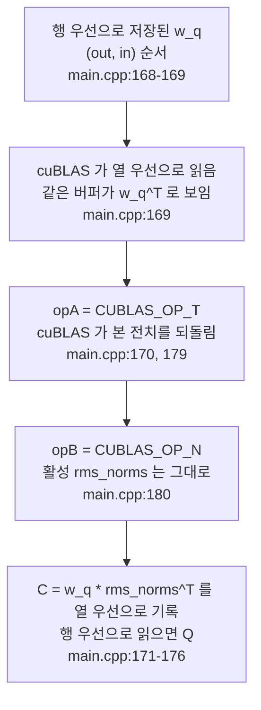

3편에서 Q/K/V 투영을 볼 때 이런 문장을 적어 두고 넘어갔다. "활성과 가중치는 행 우선인데 cuBLAS 는 열 우선을 가정하므로, `CUBLAS_OP_T` 전치 플래그와 lda/ldb/ldc 만으로 호출한다. 왜 이렇게 부르는지는 4편이 다룬다." 이 편이 그 "왜"다. 3편이 커널이 어떤 순서로 흐르는지를 보았다면, 이 편은 같은 cuBLAS 호출을 다시 꺼내 인자를 하나씩 읽는다.

한 줄 답은 이렇다. 이 코드는 행 우선(row-major) 데이터를, 열 우선(column-major)을 가정하는 cuBLAS 에 넘긴다. 데이터는 실제로 전치하지 않고, **전치 플래그와 lda/ldb/ldc 만으로 cuBLAS 가 이미 읽고 있는 전치를 되돌려 원하는 곱을 만든다.** 그래서 모든 가중치 행렬곱이 "피연산자가 뒤집힌 채로" 쓰여 있다. 어디서 시작했는지 보자.

## 행 우선 데이터와 열 우선 cuBLAS

행 우선과 열 우선은 행렬을 메모리에 놓는 두 순서다. 행 우선이면 한 행의 원소들이 메모리에서 연속이고, 열 우선이면 한 열의 원소들이 연속이다. cuBLAS 의 행렬곱 함수 `cublasGemmEx` 는 열 우선을 전제한다. 그런데 이 코드가 다루는 가중치·활성은 전부 행 우선이다. Q 가중치 `weights.w_q[layer]` 는 (2048, 2048) 행렬이고, 연속한 두 행의 시작 주소는 `EMBEDDING_LENGTH`(2048)만큼 떨어져 있으며, 이 값이 호출에서 `lda` 로 넘어간다([`src/main.cpp:16`](https://github.com/jmaczan/tiny-vllm/blob/e25bf1994efa90bc98b721ba7c527402f86fbeaf/src/main.cpp#L16), `187`).

여기서 cuBLAS 가 인자로 받는 leading dimension, 줄여서 ld 가 중요하다. 열 우선 매트릭스에서 ld 는 "한 열이 끝나고 다음 열이 시작하는 위치까지의 간격", 곧 cuBLAS 가 보는 행 개수다. 행 우선 데이터를 cuBLAS 에 그대로 넘기면, "연속한 두 행 사이 간격"이었던 값이 "연속한 두 열 사이 간격"으로 읽힌다. **같은 버퍼가 cuBLAS 에게는 전치된 행렬로 보인다.** 이 불일치가 이 편 전체의 출발점이고, 소스 주석이 그대로 적어 두었다.

```cpp
        // Q = inputs * wq^T; my matrices are row-major, cublas expects column-major
        // it perceives my matrices as transposed
        // there's a trick where C = A * B == C^T = B^T * A^T
        // so in my scenario cublas sees now: Q = inputs^T * wq^T^T = inputs ^T * wq
        // so I need to do: Q^T = wq ^T * inputs
        // the beauty is that we don't need to transpose Q^T back to Q
        // because cublas sees the output as column-major
        // so it's in fact transposed
        // final dim (num_tok, EMBEDDING_LENGTH)
```
— [`src/main.cpp:168-176`](https://github.com/jmaczan/tiny-vllm/blob/e25bf1994efa90bc98b721ba7c527402f86fbeaf/src/main.cpp#L168-L176)

주석은 "my matrices are row-major, cublas expects column-major"로 시작해 항등식 하나를 꺼낸다. `C = A * B == C^T = B^T * A^T` — 곱을 전치하면 피연산자의 순서가 뒤바뀌고 각각 전치된다. 코드는 이 항등식을 써서 데이터를 움직이지 않고 **호출을 전치한다.** 이어지는 줄들이 그 과정이다.

## Q 투영: 두 개의 플래그가 만드는 곱

가장 먼저 만나는 투영이 Q 다. 의도하는 곱은 `rms_norms · w_q^T`, 즉 (prompt_len, 2048) 활성에 (2048, 2048) 가중치를 곱해 (prompt_len, 2048) Q 를 만드는 일이다. 그런데 호출은 마치 `w_q` 를 앞에 세운 것처럼 보인다. 주석 바로 아래 호출을 보자.

```cpp
        q_proj = buf_2048_1;
        cublasStatus_t q_proj_status = cublasGemmEx(cublas_handle,
                                                    CUBLAS_OP_T,
                                                    CUBLAS_OP_N,
                                                    EMBEDDING_LENGTH,
                                                    prompt_len,
                                                    EMBEDDING_LENGTH,
                                                    &q_proj_alpha,
                                                    weights.w_q[layer],
                                                    CUDA_R_16BF,
                                                    EMBEDDING_LENGTH,
                                                    rms_norms,
                                                    CUDA_R_16BF,
                                                    EMBEDDING_LENGTH,
                                                    &q_proj_beta,
                                                    q_proj,
                                                    CUDA_R_16BF,
                                                    EMBEDDING_LENGTH,
                                                    CUBLAS_COMPUTE_32F,
                                                    CUBLAS_GEMM_DEFAULT);
```
— [`src/main.cpp:177-196`](https://github.com/jmaczan/tiny-vllm/blob/e25bf1994efa90bc98b721ba7c527402f86fbeaf/src/main.cpp#L177-L196)

`cublasGemmEx` 는 `C = α·op(A)·op(B) + β·C` 를 계산한다. op(X) 는 플래그가 `CUBLAS_OP_T` 면 X 의 전치, `CUBLAS_OP_N` 이면 X 그대로다. 이 정의대로 인자를 읽자.

- **A 자리, `CUBLAS_OP_T`:** 가중치 `weights.w_q[layer]`. 행 우선 (2048, 2048)이지만 cuBLAS 는 열 우선으로 읽으니 전치로 보인다. `CUBLAS_OP_T` 가 그 전치를 되돌리므로 op(A) = `w_q`.
- **B 자리, `CUBLAS_OP_N`:** 활성 `rms_norms`. (prompt_len, 2048)이 cuBLAS 에게는 (2048, prompt_len)의 전치로 보이고, 플래그를 걸지 않으니 op(B) = `rms_norms^T` 로 들어간다.
- **m = 2048, n = prompt_len, k = 2048:** n 이 토큰 수라는 점이 이 호출의 성격이다. 프롬프트 전체가 행렬의 열로 들어가 한 번에 곱해진다.

cuBLAS 가 쓰는 C 는 열 우선이므로 그 내용은 `w_q · rms_norms^T` 다. 같은 버퍼를 행 우선으로 읽으면 전치가 되어 `(w_q · rms_norms^T)^T = rms_norms · w_q^T = Q`. 의도한 (prompt_len, 2048) Q 가 자리에서 나온다. 전치된 채로 쓰고 전치된 채로 읽으므로 "Q^T 를 다시 Q 로 뒤집을 필요 없다"는 주석의 말([`src/main.cpp:171-175`](https://github.com/jmaczan/tiny-vllm/blob/e25bf1994efa90bc98b721ba7c527402f86fbeaf/src/main.cpp#L171-L175))이 그 뜻이다.

ld 세 개도 같은 해석의 일부다. `lda = ldb = ldc = EMBEDDING_LENGTH(2048)`([`src/main.cpp:187`](https://github.com/jmaczan/tiny-vllm/blob/e25bf1994efa90bc98b721ba7c527402f86fbeaf/src/main.cpp#L187), `190`, `194`). 열 우선 C 의 ld 는 행 개수이므로 `ldc = m = 2048` 이고, 행 우선으로 읽은 출력의 토큰 행 하나가 2048 칸 연속으로 쌓인다. 이 규칙 "ldc = m" 은 뒤에서 딱 한 번 깨지는데, 그 이야기는 잠시 후다.

## K/V, O, SwiGLU: 크기만 바뀐 같은 골격

K 와 V 는 같은 호출에서 `m` 과 `ldc` 만 512(`KV_DIM`)로 바뀐다. K 투영 주석이 그 사실을 정리해 두었다.

```cpp
        // input = (num_tokens, EMBEDDING_LENGTH), weights = (KV_DIM, EMBEDDING_LENGTH)
        // after trick: (KV_DIM, EMBEDDING_LENGTH) * (EMBEDDING_LENGTH, num_tokens) -> (KV_DIM, num_tokens), which really is (num_tok, KV_DIM)
        // lda: EMBEDDING_LENGTH, ldb: EMBEDDING_LENGTH, ldc: KV_DIM
```
— [`src/main.cpp:198-200`](https://github.com/jmaczan/tiny-vllm/blob/e25bf1994efa90bc98b721ba7c527402f86fbeaf/src/main.cpp#L198-L200)

곱 결과는 cuBLAS 에게는 (KV_DIM, num_tokens)로 보이는데, 행 우선으로 읽으면 (num_tok, KV_DIM)이라는 뜻이다. 호출부에서 `m = KV_DIM`([`src/main.cpp:204`](https://github.com/jmaczan/tiny-vllm/blob/e25bf1994efa90bc98b721ba7c527402f86fbeaf/src/main.cpp#L204)), `ldc = KV_DIM`([`src/main.cpp:217`](https://github.com/jmaczan/tiny-vllm/blob/e25bf1994efa90bc98b721ba7c527402f86fbeaf/src/main.cpp#L217)). V 는 [`src/main.cpp:222-240`](https://github.com/jmaczan/tiny-vllm/blob/e25bf1994efa90bc98b721ba7c527402f86fbeaf/src/main.cpp#L222-L240) 에 같은 모양으로 있다.

여덟 개의 가중치 투영 — Q, K, V, O, gate, up, down, 로짓 — 은 전부 이 골격이다. 가중치가 A 자리에 `CUBLAS_OP_T`, 활성이 B 자리에 `CUBLAS_OP_N`, 결과가 C 자리. 차이는 m·ldc 뿐이다. O 는 "same as Q projection, so copy paste"라는 주석 그대로 m = ldc = 2048([`src/main.cpp:378-396`](https://github.com/jmaczan/tiny-vllm/blob/e25bf1994efa90bc98b721ba7c527402f86fbeaf/src/main.cpp#L378-L396)). gate·up 은 m = ldc = 8192([`src/main.cpp:414-432`](https://github.com/jmaczan/tiny-vllm/blob/e25bf1994efa90bc98b721ba7c527402f86fbeaf/src/main.cpp#L414-L432), `435-453`). down 은 m = ldc = 2048 인데 k 가 8192 로 커지면서 `lda = ldb = HIDDEN_DIM(8192)` 이 된다([`src/main.cpp:461-489`](https://github.com/jmaczan/tiny-vllm/blob/e25bf1994efa90bc98b721ba7c527402f86fbeaf/src/main.cpp#L461-L489)). down 의 주석이 이 대목을 가장 조리 있게 남겼다.

```cpp
        // down projection
        // output = post-silu * down_proj^T
        // dims: (num_tok, 8192) * (2048, 8192) ^ T = (num_tok, 8192) * (8192, 2048) = (num_tok, 2048)
        // output^T = (down_proj^T)^T * post-silu^T
        // output^T = down_proj * post-silu^T
        // cublas sees them already as transposed so only down_proj I need to transpose
        // dims = (2048, 8192) * (8192, num_tok) = (2048, num_tok)
        // m: 2048 n: num_tok, k: 8192
        // lda: 8192, ldb: 8192, ldc: 2048
```
— [`src/main.cpp:461-469`](https://github.com/jmaczan/tiny-vllm/blob/e25bf1994efa90bc98b721ba7c527402f86fbeaf/src/main.cpp#L461-L469)

"cublas sees them already as transposed so only down_proj I need to transpose" — post-silu 를 지난 down 투영의 입력(`gate`)은 이미 cuBLAS 에게 전치로 보이므로, 가중치만 뒤집으면 된다. lda·ldb 가 8192 인 이유도 같다. down 가중치와 활성은 행 폭이 8192 다. decode 경로의 호출도 이 골격 그대로인데, n 이 `num_active_slots` 로 바뀌는 대비는 5편에서 다룬다.

## 로짓: 주석이 남긴 발상의 흐름

마지막 투영은 로짓이다. 임베딩 행렬 `embed_tokens`(128256, 2048)과 (prompt_len, 2048)을 곱해 (prompt_len, 128256)을 만든다. 여기도 `m = ldc = VOCAB_SIZE(128256)` 이다([`src/main.cpp:509-527`](https://github.com/jmaczan/tiny-vllm/blob/e25bf1994efa90bc98b721ba7c527402f86fbeaf/src/main.cpp#L509-L527)). 이 호출의 주석은 이 편 전체의 이야기를 한 번 더 들려준다.

```cpp
    // logits = rms_norms * weights.embed_tokens^T
    // dim rms_norms: (num_tok, 2048), dim embed_tokens: (128256, 2048)
    // logits dim = (num_tok, 2048) * (2048, 128256) = (num_tok, 128256) => m = num_tok, n = 128256, k = 2048
    // I leave this comment above because it shows a bug in my thinking
    // because I use the cublas trick, logits are transposed so m and n should be swapped
    // so m 128256, n num_tok
```
— [`src/main.cpp:496-501`](https://github.com/jmaczan/tiny-vllm/blob/e25bf1994efa90bc98b721ba7c527402f86fbeaf/src/main.cpp#L496-L501)

첫 세 줄은 "그냥 행렬곱으로 보면 m = num_tok, n = 128256"이라는 생각이고, 다음 줄이 "이건 틀렸다. 트릭 때문에 로짓은 전치되니 m 과 n 을 뒤집어야 한다"고 정정한다. 저자는 이 주석을 지우지 않고 "나의 사고 버그를 보여주는 것"이라며 남겨 두었다. m·n 을 뒤집는 관성, 곱 순서가 바뀌는 착각 — 이 저장소의 모든 호출을 읽을 때 부딪히는 함정이 그대로 기록되어 있다.

## 어텐션 점수: 같은 규약, 다른 차원

투영이 아닌 행렬곱도 규약은 같다. 어텐션 점수는 Q 헤드 32개마다 (prompt_len, prompt_len) 행렬을 만들고, K 헤드는 `i / GQA_Q_TO_K_RATIO` 로 골라 쓴다(GQA 는 3편에서 보았다). 여기서 K 헤드가 A 자리, Q 헤드가 B 자리다.

```cpp
        for (int i = 0; i < NUM_Q_HEADS; ++i)
        {
            int k_head_idx = i / GQA_Q_TO_K_RATIO;
            __nv_bfloat16 *q_head = q_proj + i * HEAD_DIM;
            __nv_bfloat16 *k_head = k_proj_temp_buf + k_head_idx * HEAD_DIM;
            __nv_bfloat16 *attn_score_head = prefill_attn_scores + prompt_len * prompt_len * i;

            cublasStatus_t attn_score_status = cublasGemmEx(cublas_handle,
                                                            CUBLAS_OP_T,
                                                            CUBLAS_OP_N,
                                                            prompt_len,
                                                            prompt_len,
                                                            HEAD_DIM,
                                                            &attn_alpha,
                                                            k_head,
                                                            CUDA_R_16BF,
                                                            KV_DIM,
                                                            q_head,
                                                            CUDA_R_16BF,
                                                            EMBEDDING_LENGTH,
                                                            &attn_beta,
                                                            attn_score_head,
                                                            CUDA_R_16BF,
                                                            prompt_len,
                                                            CUBLAS_COMPUTE_32F,
                                                            CUBLAS_GEMM_DEFAULT);
        }
```
— [`src/main.cpp:301-327`](https://github.com/jmaczan/tiny-vllm/blob/e25bf1994efa90bc98b721ba7c527402f86fbeaf/src/main.cpp#L301-L327)

`m = n = prompt_len`, `k = HEAD_DIM(64)`([`src/main.cpp:311-313`](https://github.com/jmaczan/tiny-vllm/blob/e25bf1994efa90bc98b721ba7c527402f86fbeaf/src/main.cpp#L311-L313)). K 헤드는 A 자리 `CUBLAS_OP_T`, Q 헤드는 B 자리 `CUBLAS_OP_N` — Q 투영과 같은 조합이다. 같은 해석을 그대로 밀면 cuBLAS 가 쓰는 열 우선 C = `k_head · q_head^T` 이고, 행 우선으로 읽으면 `q_head · k_head^T` — 원하는 점수 행렬이다. 스케일 `1/sqrt(64)` 는 alpha 인자 `attn_alpha = 1/8` 이 걸어 준다([`src/main.cpp:649`](https://github.com/jmaczan/tiny-vllm/blob/e25bf1994efa90bc98b721ba7c527402f86fbeaf/src/main.cpp#L649)).

여기서 lda·ldb 가 달라지는 이유는 두 피연산자가 "어느 버퍼의 조각"이기 때문이다. `k_head` 는 (prompt_len, 512) 버퍼 `k_proj_temp_buf` 안의 64 칸짜리 조각이라 행 폭이 512, 그래서 `lda = KV_DIM`([`src/main.cpp:317`](https://github.com/jmaczan/tiny-vllm/blob/e25bf1994efa90bc98b721ba7c527402f86fbeaf/src/main.cpp#L317)). `q_head` 는 (prompt_len, 2048) 버퍼 `q_proj` 안의 조각이라 `ldb = EMBEDDING_LENGTH`([`src/main.cpp:320`](https://github.com/jmaczan/tiny-vllm/blob/e25bf1994efa90bc98b721ba7c527402f86fbeaf/src/main.cpp#L320)). 결과는 `ldc = prompt_len`([`src/main.cpp:324`](https://github.com/jmaczan/tiny-vllm/blob/e25bf1994efa90bc98b721ba7c527402f86fbeaf/src/main.cpp#L324))로 m 과 같아 규칙을 지킨다.

## 점수×V: 전치 플래그가 사라진 유일한 호출

여기까지 본 모든 호출이 `CUBLAS_OP_T`/`CUBLAS_OP_N` 이라면, 두 플래그가 모두 `CUBLAS_OP_N` 인 호출은 점수×V 하나뿐이다.

```cpp
            cublasStatus_t attn_score_status = cublasGemmEx(cublas_handle,
                                                            CUBLAS_OP_N,
                                                            CUBLAS_OP_N,
                                                            HEAD_DIM,
                                                            prompt_len,
                                                            prompt_len,
                                                            &attn_scores_v_alpha,
                                                            v_head,
                                                            CUDA_R_16BF,
                                                            KV_DIM,
                                                            attn_scores_head,
                                                            CUDA_R_16BF,
                                                            prompt_len,
                                                            &attn_scores_v_beta,
                                                            output_attn_scores_head,
                                                            CUDA_R_16BF,
                                                            EMBEDDING_LENGTH,
                                                            CUBLAS_COMPUTE_32F,
                                                            CUBLAS_GEMM_DEFAULT);
```
— [`src/main.cpp:352-370`](https://github.com/jmaczan/tiny-vllm/blob/e25bf1994efa90bc98b721ba7c527402f86fbeaf/src/main.cpp#L352-L370)

`m = HEAD_DIM(64)`, `n = prompt_len`, `k = prompt_len`([`src/main.cpp:355-357`](https://github.com/jmaczan/tiny-vllm/blob/e25bf1994efa90bc98b721ba7c527402f86fbeaf/src/main.cpp#L355-L357)). `v_head` 가 A, `attn_scores_head` 가 B 다. 헤드 하나는 `v_head_idx = i / GQA_ATTN_SCORES_TO_V_RATIO` 로 밸류 헤드를 공유한다(3편). 두 피연산자는 이미 cuBLAS 에게 "전치된 원하는 상태"로 보인다. `v_head` 는 (prompt_len, 64) 조각이라 행 폭이 512, `lda = KV_DIM`([`src/main.cpp:361`](https://github.com/jmaczan/tiny-vllm/blob/e25bf1994efa90bc98b721ba7c527402f86fbeaf/src/main.cpp#L361))으로 읽으면 cuBLAS 에게 (64, prompt_len) — 바로 원하는 op(A) 다. `attn_scores_head` 는 (prompt_len, prompt_len)이라 `ldb = prompt_len`([`src/main.cpp:364`](https://github.com/jmaczan/tiny-vllm/blob/e25bf1994efa90bc98b721ba7c527402f86fbeaf/src/main.cpp#L364))이 그대로 원하는 op(B). 뒤집을 게 없어 플래그가 빠진다.

그래서 열 우선 C 는 `V^T · S^T` 가 되고, 행 우선으로 읽으면 `(V^T · S^T)^T = S · V` — 소프트맥스를 지난 점수 × V 다. 원하는 곱은 S·V 인데 cuBLAS 가 쓰는 건 그 전치, 행 우선으로 읽으면 다시 S·V 로 돌아온다. 여기까지 본 흐름과 다를 게 없다.

이 호출에서만 `ldc ≠ m` 이다([`src/main.cpp:368`](https://github.com/jmaczan/tiny-vllm/blob/e25bf1994efa90bc98b721ba7c527402f86fbeaf/src/main.cpp#L368), ldc = EMBEDDING_LENGTH). 결과는 `attn_scores_v + i * HEAD_DIM`([`src/main.cpp:350`](https://github.com/jmaczan/tiny-vllm/blob/e25bf1994efa90bc98b721ba7c527402f86fbeaf/src/main.cpp#L350))에 쌓이는데, `attn_scores_v` 는 (프롬프트, 2048) 버퍼다. ldc 가 2048 이라야 헤드 i 의 64 칸이 토큰 행 안의 `[i*64, i*64+64)` 구간에 들어가고, 헤드 32개가 나란히 붙어 (prompt_len, 2048)을 채운다. 출력 폭이 "헤드 폭"이 아니라 "헤드들이 쌓일 버퍼 폭"이라서 m 과 어긋나는 것이다. 이 결과는 바로 다음 O 투영의 입력이 된다([`src/main.cpp:343`](https://github.com/jmaczan/tiny-vllm/blob/e25bf1994efa90bc98b721ba7c527402f86fbeaf/src/main.cpp#L343), `388`).

## alpha 와 beta: 잔차는 여기서 더하지 않는다

모든 호출에 alpha·beta 인자가 따라붙는다. beta 에 잔차 누적을 맡기면 잔차 커널이 아예 필요 없을 텐데, 실제로는 beta 가 전부 0.0 이다.

```cpp
    float k_proj_alpha = 1.0f;
    float k_proj_beta = 0.0f;

    float v_proj_alpha = 1.0f;
    float v_proj_beta = 0.0f;

    __nv_bfloat16 *prefill_attn_scores;
    cudaMalloc(&prefill_attn_scores, MAX_PROMPT_LEN * MAX_PROMPT_LEN * sizeof(__nv_bfloat16) * NUM_Q_HEADS);
    float attn_alpha = 1.0f / 8.0f;
    float attn_beta = 0.0f;
```
— [`src/main.cpp:641-650`](https://github.com/jmaczan/tiny-vllm/blob/e25bf1994efa90bc98b721ba7c527402f86fbeaf/src/main.cpp#L641-L650)

열 개의 alpha·beta 쌍(q_proj `631-632`, k_proj `641-642`, v_proj `644-645`, attn `649-650`, attn_scores_v `653-654`, o_proj `659-660`, gate `664-665`, up `669-670`, down `673-674`, embed `678-679`)이 전부 이 모양이다. beta 가 0 이면 GEMM 은 기존 C 를 읽지 않고 덮어쓴다. beta 로 무언가를 "더할" 자리가 없다. 유일하게 1 이 아닌 alpha 가 어텐션 스케일 `1/8` 하나뿐이라는 것도 위 코드에서 보인다.

잔차는 별도 커널이 담당한다. 어텐션 뒤 `residualAdd(hidden_state, o_proj, prompt_len)`([`src/main.cpp:399`](https://github.com/jmaczan/tiny-vllm/blob/e25bf1994efa90bc98b721ba7c527402f86fbeaf/src/main.cpp#L399)), SwiGLU 뒤 `residualAdd(hidden_state, down, prompt_len)`([`src/main.cpp:492`](https://github.com/jmaczan/tiny-vllm/blob/e25bf1994efa90bc98b721ba7c527402f86fbeaf/src/main.cpp#L492)). 커널 구현은 3편에서 보았다. alpha·beta 가 잔차를 처리한다는 이야기는 이 코드에는 없다.

## 흐름 정리

행 우선 데이터가 전치 플래그를 거쳐 결과로 나오는 흐름을 한 장으로 정리하면 이렇다. 그림의 각 줄은 Q 투영의 소스 줄을 가리킨다.

<!-- visual: column-row-major-trick supports: [column-row-major-trick] -->


이 그림이 여덟 개 가중치 투영에 공통인 골격이다. alpha·beta 가 잔차를 누적하는 경로는 위에서 봤듯 이 코드에 없으므로, 그림에도 그 가지가 없다.

## 더 읽을거리

이 저장소가 이 주제의 배경으로 건 자료다.

- [행 우선/열 우선 순서 (Wikipedia)](https://en.wikipedia.org/wiki/Row-_and_column-major_order) — 레이아웃 불일치의 출발점
- [The cuBLAS transposition trick (Paged Out! #9)](https://pagedout.institute/) — 저장소 저자가 같은 내용을 다른 형태로 쓴 글
- [cublasGemmEx 레퍼런스](https://docs.nvidia.com/cuda/cublas/index.html#cublasgemmex) — 인자 순서와 op(A)·op(B) 정의
- [cuBLAS](https://developer.nvidia.com/cublas) — 공식 문서와 예제

## 이 글의 한계

이 편도 앞선 편들과 마찬가지로 빌드·실행하지 않았다. 모든 m·n·k·lda·ldb·ldc·플래그 설명은 커밋 `e25bf19` 의 소스를 읽어 얻은 것이며 실행 검증은 없다. 각 호출의 반환값(`*_status`)은 선언만 되고 검사되지 않으므로, 이 글은 호출이 전부 성공했음을 전제로 선다. 그리고 m·n·k·ld 는 `EMBEDDING_LENGTH`, `KV_DIM`, `HIDDEN_DIM`, `VOCAB_SIZE` 같은 컴파일 타임 상수([`src/main.cpp:16-25`](https://github.com/jmaczan/tiny-vllm/blob/e25bf1994efa90bc98b721ba7c527402f86fbeaf/src/main.cpp#L16-L25))에서 오므로, 상수가 바뀌면 여기 적은 모든 수치가 함께 바뀐다.
