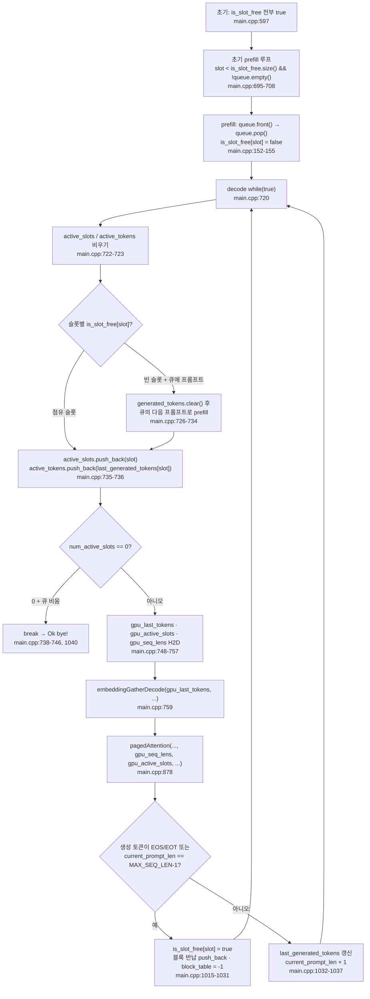

GPU 는 한 번에 한 시퀀스만 처리하면 그 시퀀스가 prefill 을 마치고 decode 로 넘어가는 사이에서 쉬게 된다. continuous batching 은 처리 중이던 요청이 끝나는 대로 그 자리에 큐에서 기다리던 다음 요청을 넣어 GPU 를 놀리지 않는 방식이다. 이 저장소의 README 도 그 원리를 한 문단으로 정리한다 — "슬롯에 프롬프트를 채우고, 어느 슬롯의 생성이 끝나면 그 결과를 돌려준 뒤 큐에서 기다리던 프롬프트를 갓 비워진 슬롯에 채운다."

이 편은 그 문장이 코드에서 어떤 두 저장소 — **슬롯과 큐** — 로 구현되는지를 본다. 3편이 prefill 의 커널 순서를, 5편이 decode 커널 변형을, 6편이 block table 읽기를 다뤘다. 이 편은 그 위에서 "어느 슬롯이 언제 채워지고 언제 비는지"만 담당한다. decode 루프가 매 반복 슬롯을 다시 구성하고, 종료된 슬롯은 큐의 다음 프롬프트로 다시 채워진다. 블록을 어떻게 읽는지는 6편의 몫이므로 여기서는 슬롯·큐에만 집중한다.

> 이 시리즈의 모든 인용은 커밋 [`e25bf19`](https://github.com/jmaczan/tiny-vllm/tree/e25bf1994efa90bc98b721ba7c527402f86fbeaf) 기준이다. 필자에게 NVIDIA GPU 가 없어 빌드도 실행도 하지 않았고, 아래 모든 설명은 소스를 읽어 얻은 것이다.

## 두 저장소: 슬롯과 큐

배치를 시작하려면 CPU 쪽에 저장소가 둘 필요하다. 하나는 **지금 돌아가는 시퀀스가 앉는 자리**인 슬롯이고, 다른 하나는 아직 시작하지 못한 프롬프트가 줄을 서는 **큐**다. 이 두 저장소가 이 편에서 보는 전부다. 큐부터 보자.

```cpp
    // PROMPT 0 (What is 2+2?) - length 17
    std::queue<std::vector<int>> queue;
    queue.push({128000, 128006, 882, 128007, 271, 3923, 374, 220, 17, 10, 17, 30, 128009, 128006, 78191, 128007, 271});

    // PROMPT 1 (Name a color.) - length 14
    queue.push({128000, 128006, 882, 128007, 271, 678, 264, 1933, 13, 128009, 128006, 78191, 128007, 271});

    // PROMPT 2 (Say hello.) - length 13
    queue.push({128000, 128006, 882, 128007, 271, 46864, 24748, 13, 128009, 128006, 78191, 128007, 271});

    // PROMPT 3 (Capital of France?) - length 14
    queue.push({128000, 128006, 882, 128007, 271, 64693, 315, 9822, 30, 128009, 128006, 78191, 128007, 271});
```
— [`src/main.cpp:583-594`](https://github.com/jmaczan/tiny-vllm/blob/e25bf1994efa90bc98b721ba7c527402f86fbeaf/src/main.cpp#L583-L594)

큐의 원소는 `std::vector<int>` 다. 각 벡터는 프롬프트 하나를 Llama 3 채팅 템플릿으로 감싼 토큰 ID 열이다. 이 ID 들이 어디서 왔는지는 `python/batching_test_tokens.py` 가 보여 준다. 이 스크립트는 `Llama-3.2-1B-Instruct` 토크나이저로 네 문장을 같은 템플릿에 넣어 토큰을 출력하는데, `main.cpp` 의 네 push 는 그 출력을 옮겨 적은 것이다.

```python
from transformers import AutoTokenizer
t = AutoTokenizer.from_pretrained("meta-llama/Llama-3.2-1B-Instruct")

prompts = [
    "What is 2+2?",
    "Name a color.",
    "Say hello.",
    "Capital of France?",
]

offset = 0
for i, p in enumerate(prompts):
    text = f"<|begin_of_text|><|start_header_id|>user<|end_header_id|>\n\n{p}<|eot_id|><|start_header_id|>assistant<|end_header_id|>\n\n"
    tokens = t.encode(text, add_special_tokens=False)
    print(f"// PROMPT {i} ({p}) - length {len(tokens)}")
```
— [`python/batching_test_tokens.py:1-15`](https://github.com/jmaczan/tiny-vllm/blob/e25bf1994efa90bc98b721ba7c527402f86fbeaf/python/batching_test_tokens.py#L1-L15)

`add_special_tokens=False` 로 특수 토큰을 끄고 문자열 안에 템플릿의 특수 토큰을 직접 넣은 뒤, 주석으로 길이를 출력한다. `main.cpp` 의 주석 "length 17", "length 14" 와 완전히 맞는다. 각 토큰 ID 가 무엇을 뜻하는지는 1편에서 봤다. 여기서 중요한 것은 그 ID 열이 **토크나이저 없이 소스에 고정되어 있다**는 사실과, 프롬프트 네 개의 길이가 17, 14, 13, 14 로 제각각이라는 점이다. 길이가 다른 요청을 같은 배치에서 겹치려는 것이 continuous batching 의 출발점이다.

슬롯의 수는 `BATCH_SIZE = 2` 다. 상수 선언에 달린 주석이 이 값의 성격을 말해 준다.

```cpp
constexpr int BATCH_SIZE = 2;                // TODO: not even close to being good, it's just here to have batching
```
— [`src/main.cpp:29`](https://github.com/jmaczan/tiny-vllm/blob/e25bf1994efa90bc98b721ba7c527402f86fbeaf/src/main.cpp#L29)

"좋기는커녕, batching 이 있다고 말할 수 있을 만큼만 넣었다"는 뜻이다. 이 값은 `MAX_SEQUENCES` 로 별칭되어 block table 의 첫 차원이 된다([`src/main.cpp:38`](https://github.com/jmaczan/tiny-vllm/blob/e25bf1994efa90bc98b721ba7c527402f86fbeaf/src/main.cpp#L38)). 그래서 block table 은 2 × 16 × 128 = 4096 항목이고, 각 슬롯에는 레이어 16개 × 논리 블록 128개 = 2048 항목 묶음이 배정된다. "슬롯당 행 하나"가 아니라 한 슬롯이 레이어·논리 블록으로 나뉜 묶음 전체를 가진다는 것도 6편에서 봤다.

슬롯의 점유 상태는 `is_slot_free` 벡터가 관리한다.

```cpp
    std::vector<bool> is_slot_free(BATCH_SIZE, true); // set to false when slot taken, set to true when free
```
— [`src/main.cpp:597`](https://github.com/jmaczan/tiny-vllm/blob/e25bf1994efa90bc98b721ba7c527402f86fbeaf/src/main.cpp#L597)

슬롯별 상태는 그 뒤 세 벡터로 따라붙는다. `generated_tokens` 는 그 슬롯이 만들어 낸 토큰의 누적, `last_generated_tokens` 는 그중 마지막 하나, `current_prompt_len` 은 현재 시퀀스 길이다(초기 0).

```cpp
    std::vector<std::vector<int>> generated_tokens(BATCH_SIZE);
    std::vector<int> last_generated_tokens(BATCH_SIZE);
    std::vector<int> current_prompt_len(BATCH_SIZE, 0);

    // needed to provide contiguous data for decode
    std::vector<int> active_slots;
    std::vector<int> active_tokens;
```
— [`src/main.cpp:599-605`](https://github.com/jmaczan/tiny-vllm/blob/e25bf1994efa90bc98b721ba7c527402f86fbeaf/src/main.cpp#L599-L605)

`active_slots`·`active_tokens` 는 주석이 말하듯 decode 가 커널에 넘길 **연속 배열**을 만들기 위한 CPU 쪽 수집소다. 매 반복마다 다시 채워지므로 빈 벡터로 시작한다. 이 배열들과 그 디바이스 사본(`gpu_active_slots`, `gpu_seq_lens`, `gpu_last_tokens`)의 크기·할당은 2편에서 표로 봤다.

## 초기 채움: 슬롯 0·1 이 프롬프트를 가져간다

배치가 시작되기 전에 `main` 은 빈 슬롯을 프롬프트로 채운다. 아래가 그 루프다. 이후 decode 루프가 매 반복 할 일의 미리보기다.

```cpp
    for (int slot = 0; slot < is_slot_free.size() && !queue.empty(); ++slot)
    {
        if (!is_slot_free[slot])
        {
            continue; // slot taken, skip
        }
        prefill(prompt, queue, prompt_len, is_slot_free, slot, ...);
    }
```
— [`src/main.cpp:695-708`](https://github.com/jmaczan/tiny-vllm/blob/e25bf1994efa90bc98b721ba7c527402f86fbeaf/src/main.cpp#L695-L708)

조건은 `slot < is_slot_free.size() && !queue.empty()` 다. 빈 슬롯이 남아 있고 큐에 프롬프트가 있는 동안 돈다. `is_slot_free.size()` 는 `BATCH_SIZE` 곧 2 이므로, 이 루프는 슬롯 0 과 슬롯 1 을 차례로 채우고 슬롯 2 에서 끝난다. `continue` 는 점유된 슬롯을 건너뛰기 위한 것인데, 초기에는 모든 슬롯이 비어 있어 이 루프에서는 발동하지 않는다.

프롬프트가 슬롯으로 옮겨가는 것은 `prefill` 진입부가 한다. 이 네 줄이 큐에서 슬롯으로 프롬프트가 옮겨가는 유일한 지점이다.

```cpp
    prompt = queue.front();
    prompt_len = prompt.size();
    queue.pop();
    is_slot_free[slot] = false;
```
— [`src/main.cpp:152-155`](https://github.com/jmaczan/tiny-vllm/blob/e25bf1994efa90bc98b721ba7c527402f86fbeaf/src/main.cpp#L152-L155)

순서는 큐 앞에서 꺼내고, 길이를 기록하고, 큐에서 빼고, 슬롯을 점유로 바꾼다. 프롬프트가 슬롯으로 들어가면 그 슬롯은 다시 비기 전까지 이 프롬프트를 배타적으로 가진다. 그래서 초기 채움의 결과는 슬롯 0·1 이 프롬프트 0·1 을 가져가고, 프롬프트 2·3 은 큐에 남는다. prefill 이 그 뒤 슬롯 상태를 어떻게 기록하고(`generated_tokens` push, `current_prompt_len` 설정) block table 을 동기화하는지는 3편·6편에서 봤다.

## decode 루프가 슬롯을 다시 구성한다

생성은 `while (true)` 루프로 들어간다. 루프 위 주석은 "inference server that's supposed to run foreveeer!!!" 라고 말한다 — 1편에서 "서버가 아니라 배치 프로그램"으로 지적한 그 지점이다. 이 편은 그 루프 머리가 매 반복 **슬롯을 다시 구성**하는 모습을 본다.

```cpp
    while (true) // exit condition irrelevant for now, since it's an inference server that's supposed to run foreveeer!!!
    {
        active_slots.clear();
        active_tokens.clear();
        for (int slot = 0; slot < BATCH_SIZE; ++slot)
        {
            if (is_slot_free[slot])
            {
                if (queue.empty())
                {
                    continue;
                }
                generated_tokens[slot].clear();
                prefill(prompt, queue, prompt_len, is_slot_free, slot, ...);
            }
            active_slots.push_back(slot);
            active_tokens.push_back(last_generated_tokens[slot]);
        }
        int num_active_slots = active_slots.size();
        if (num_active_slots == 0)
        {
            if (queue.empty())
            {
                break; // TODO: continue will make sense when I will finally write to queue, for now it has predefined size so break instead
            }
            continue;
        }
```
— [`src/main.cpp:720-746`](https://github.com/jmaczan/tiny-vllm/blob/e25bf1994efa90bc98b721ba7c527402f86fbeaf/src/main.cpp#L720-L746)

매 반복은 두 활성 배열을 비우는 것으로 시작한다. 그다음 슬롯을 하나씩 본다. 슬롯이 비어 있으면(`is_slot_free[slot]`) 큐의 다음 프롬프트를 꺼내 `prefill` 로 채운다. 이때 그 슬롯의 `generated_tokens` 를 먼저 비우는 이유는 이전 시퀀스의 토큰 기록이 새 시퀀스에 섞이지 않게 하기 위함이다. `prefill` 은 `current_prompt_len` 을 새 프롬프트 길이로 덮어쓰므로([`src/main.cpp:548`](https://github.com/jmaczan/tiny-vllm/blob/e25bf1994efa90bc98b721ba7c527402f86fbeaf/src/main.cpp#L548)), 재사용된 슬롯은 이전 시퀀스의 길이 상태를 물려받지 않는다. 큐가 비어 있으면 `continue` 로 그 슬롯을 건너뛴다.

핵심은 `active_slots.push_back(slot)` 이 `if` 블록 **밖**에 있다는 것이다(`735`). 방금 채운 슬롯도, 계속 점유 중인 슬롯도 이번 스텝의 활성 목록에 들어간다. `active_tokens` 도 같은 방식으로 채워져 각 슬롯의 `last_generated_tokens` 를 담는다. 따라서 두 배열은 언제나 "지금 계산할 슬롯만" 압축된 순서로 담는다 — 주석의 "contiguous data for decode" 가 바로 이 뜻이다.

활성 슬롯이 0 이면 분기한다. 큐도 비었으면 `break`, 프롬프트가 남아 있으면 `continue` 로 다음 반복에서 채우기를 다시 시도한다. break 자리에 달린 TODO 주석이 이 분기의 성격을 말한다.

> continue will make sense when I will finally write to queue, for now it has predefined size so break instead

— [`src/main.cpp:743`](https://github.com/jmaczan/tiny-vllm/blob/e25bf1994efa90bc98b721ba7c527402f86fbeaf/src/main.cpp#L743)

"큐에 새 요청을 넣는 기능이 생기면 continue 가 의미가 있고, 지금은 큐 크기가 처음부터 정해져 있어서 break 를 쓴다"는 뜻이다. 상시 운영 서버를 의도한 주석과 달리, 실제 실행은 큐가 비고 활성 슬롯이 전부 사라지면 `break` 로 끝나는 **유한한 배치 프로그램**이다.

## 활성 배열을 GPU 로 올리기

슬롯이 정해지면 세 배열을 GPU 로 올린다. 이 배열들이 각각 어느 소비자로 가는지를 갈라 놓는 것이 중요하다.

```cpp
        // copy useful data to gpu
        cudaMemcpy(gpu_last_tokens, active_tokens.data(), num_active_slots * sizeof(int), cudaMemcpyHostToDevice);
        cudaMemcpy(gpu_active_slots, active_slots.data(), num_active_slots * sizeof(int), cudaMemcpyHostToDevice);
        std::vector<int> seq_lens(num_active_slots);
        for (int slot = 0; slot < num_active_slots; ++slot)
        {
            int active_slot = active_slots[slot];
            seq_lens[slot] = current_prompt_len[active_slot] + 1;
        }
        cudaMemcpy(gpu_seq_lens, seq_lens.data(), seq_lens.size() * sizeof(int), cudaMemcpyHostToDevice);
```
— [`src/main.cpp:748-757`](https://github.com/jmaczan/tiny-vllm/blob/e25bf1994efa90bc98b721ba7c527402f86fbeaf/src/main.cpp#L748-L757)

소비자가 나뉜다. `gpu_last_tokens` 는 `active_tokens` 의 사본으로, 임베딩 커널 `embeddingGatherDecode` 의 입력이다([`src/main.cpp:759`](https://github.com/jmaczan/tiny-vllm/blob/e25bf1994efa90bc98b721ba7c527402f86fbeaf/src/main.cpp#L759)). 반면 `pagedAttention` 에 전달되는 상태는 6편에서 본 네 가지 — `kv_cache`, `block_table_gpu`, `gpu_seq_lens`, `gpu_active_slots` — 가 전부다. 호출부도 정확히 그 네 개만 넘긴다([`src/main.cpp:878`](https://github.com/jmaczan/tiny-vllm/blob/e25bf1994efa90bc98b721ba7c527402f86fbeaf/src/main.cpp#L878)). 커널은 `gpu_active_slots` 로 활성 슬롯을, `gpu_seq_lens` 로 각 슬롯의 현재 길이를 얻는다. `gpu_last_tokens` 는 어텐션의 입력이 아니라 임베딩 커널이 쓸 슬롯별 마지막 토큰 버퍼다. 두 디바이스 배열의 용도는 섞이지 않는다.

`seq_lens` 의 `+1` 은 이번 스텝의 현재 토큰을 포함하는 값이다. decode 는 새 토큰의 K/V 를 먼저 블록에 기록한 뒤 어텐션을 계산하므로, 어텐션이 읽을 길이는 기존 길이에 현재 토큰을 더한 값이어야 블록 수도 맞는다. 이 `+1` 이 6편에서 `(seq_len + BLOCK_SIZE - 1) / BLOCK_SIZE` 로 소비된다.

## 슬롯 수명

지금까지 본 흐름을 하나로 묶으면 슬롯의 수명이 된다. 슬롯이 채워지고, 매 스텝 활성 목록에 들어가고, 종료되면 다시 비워져 다음 프롬프트의 후보가 되는 — 그것이 전부다.

<!-- visual: slot-lifecycle supports: [slot-lifecycle] -->


점유는 `is_slot_free` 하나로 관리되고, 빈 슬롯은 큐의 다음 프롬프트로 채워지며, 점유 슬롯만 활성 배열에 모여 매 스텝 커널로 전달되고, 종료 조건이 오면 슬롯이 풀려 다음 반복의 재채움 후보가 된다. 이 순환을 "여러 요청을 겹친다"고 부른다. 종료 절차가 어떤 조건에서, 어떤 순서로 일어나는지는 다음 절이다.

## 종료와 블록 반납

각 스텝의 argmax 뒤, 종료 여부가 슬롯별로 정해진다. 생성 토큰이 EOS/EOT 이거나 총 길이가 `MAX_SEQ_LEN-1` 에 닿았으면 그 슬롯은 끝난다.

```cpp
            if (max_token_idx == END_OF_TEXT_TOKEN_ID || max_token_idx == EOT_ID_TOKEN_ID || current_prompt_len[active_slot] == MAX_SEQ_LEN - 1)
            {
                is_slot_free[active_slot] = true;
                for (int layer = 0; layer < N_LAYERS; ++layer)
                {
                    for (int logical_block_idx = 0; logical_block_idx < MAX_BLOCKS_PER_SEQ; ++logical_block_idx)
                    {
                        int block_idx = active_slot * N_LAYERS * MAX_BLOCKS_PER_SEQ + layer * MAX_BLOCKS_PER_SEQ + logical_block_idx;
                        if (block_table[block_idx] != -1)
                        {
                            free_blocks.push_back(block_table[block_idx]);
                            block_table[block_idx] = -1;
                        }
                    }
                }
                cudaMemcpy(block_table_gpu, block_table.data(), MAX_SEQUENCES * N_LAYERS * MAX_BLOCKS_PER_SEQ * sizeof(int), cudaMemcpyHostToDevice);
            }
            else
            {
                last_generated_tokens[active_slot] = max_token_idx;
                generated_tokens[active_slot].push_back(max_token_idx);
                current_prompt_len[active_slot] = current_prompt_len[active_slot] + 1;
            }
```
— [`src/main.cpp:1015-1037`](https://github.com/jmaczan/tiny-vllm/blob/e25bf1994efa90bc98b721ba7c527402f86fbeaf/src/main.cpp#L1015-L1037)

종료 조건은 셋이다. 생성 토큰이 `<|end_of_text|>`(128001, [`src/main.cpp:26`](https://github.com/jmaczan/tiny-vllm/blob/e25bf1994efa90bc98b721ba7c527402f86fbeaf/src/main.cpp#L26))이거나 `<|eot_id|>`(128009, [`src/main.cpp:27`](https://github.com/jmaczan/tiny-vllm/blob/e25bf1994efa90bc98b721ba7c527402f86fbeaf/src/main.cpp#L27))이거나, `current_prompt_len[active_slot] == MAX_SEQ_LEN - 1`([`src/main.cpp:1015`](https://github.com/jmaczan/tiny-vllm/blob/e25bf1994efa90bc98b721ba7c527402f86fbeaf/src/main.cpp#L1015))이다. 마지막 조건은 **생성 토큰 수의 상한이 아니라 총 시퀀스 길이의 상한**이다. `current_prompt_len` 은 프롬프트 길이와 생성 토큰 수를 합친 값이므로, 프롬프트가 길수록 그 한도에 더 일찍 도달한다.

종료 시 일어나는 일은 셋이다. 슬롯을 풀고(`is_slot_free[active_slot] = true`, `1017`), 그 슬롯이 소유한 모든 블록을 `free_blocks` 에 반납하며, block table 의 디바이스 사본을 H2D 로 동기화한다(`1030`). 반납은 6편에서 본 세 차원 순회(`active_slot · N_LAYERS · MAX_BLOCKS_PER_SEQ + layer · MAX_BLOCKS_PER_SEQ + logical_block_idx`)로 슬롯의 모든 논리 블록을 찾아, `-1` 이 아닌 것만 물리 블록 번호를 `push_back` 하고 다시 `-1` 로 되돌린다. 반납된 물리 블록은 이후 다른 슬롯의 할당(`pop_back`)이 다시 쓸 수 있다.

종료가 아니면 슬롯은 계속 점유 상태를 유지한다. `last_generated_tokens` 를 갱신하고, 토큰을 `generated_tokens` 에 누적하고, `current_prompt_len` 을 1 올린다(`1032-1037`). 이 값이 다음 반복의 `active_tokens.push_back` 을 거쳐 다시 커널로 보내진다.

상수 하나가 눈에 띈다. `MAX_NEW_TOKENS_GENERATED = 20`([`src/main.cpp:12`](https://github.com/jmaczan/tiny-vllm/blob/e25bf1994efa90bc98b721ba7c527402f86fbeaf/src/main.cpp#L12))은 선언만 있고 다른 곳에서 전혀 참조되지 않는다. 생성 종료는 오직 EOS/EOT 토큰 또는 `MAX_SEQ_LEN-1` 도달로만 정해지므로, 이 상수는 종료 조건으로 동작하지 않는다.

## 더 읽을거리

이 저장소가 이 주제의 배경으로 건 자료다.

- [vLLM](https://github.com/vllm-project/vllm) — README 가 "younger and smaller sibling" 이라 부르는 원 프로젝트. continuous batching 과 PagedAttention 이 유명해진 곳.
- [PagedAttention 논문 (Kwon et al., SOSP 2023)](https://arxiv.org/pdf/2309.06180) — 슬롯이 종료될 때 블록을 반납하고 재할당하는 구조의 배경.

## 이 글의 한계

빌드도 실행도 하지 않았고, 위 모든 설명은 커밋 `e25bf19` 의 소스를 읽어 얻은 정적 인용이다. 특히 네 지점이 실행 검증 없이 남는다. 첫째, 슬롯 종료는 EOS/EOT 토큰 또는 `MAX_SEQ_LEN-1` 도달뿐이고, `MAX_NEW_TOKENS_GENERATED = 20` 은 미참조 상수다. 둘째, 루프 주석([`src/main.cpp:720`](https://github.com/jmaczan/tiny-vllm/blob/e25bf1994efa90bc98b721ba7c527402f86fbeaf/src/main.cpp#L720))은 상시 운영 서버를 의도하지만, 활성 슬롯이 0 이고 큐가 비면 break 하므로([`src/main.cpp:739-744`](https://github.com/jmaczan/tiny-vllm/blob/e25bf1994efa90bc98b721ba7c527402f86fbeaf/src/main.cpp#L739-L744)) 실제 실행은 유한하다. 큐에 새 요청을 넣는 기능은 TODO 로 남아 있다([`src/main.cpp:743`](https://github.com/jmaczan/tiny-vllm/blob/e25bf1994efa90bc98b721ba7c527402f86fbeaf/src/main.cpp#L743)). 셋째, `seq_lens = current_prompt_len + 1` 의 `+1` 은 현재 토큰의 KV 를 포함한다는 해석이며, 소스 흐름에는 맞지만 실행 검증은 없다. 넷째, decode 는 레이어마다 block table 4096 항목을 통째로 H2D 복사하고([`src/main.cpp:876`](https://github.com/jmaczan/tiny-vllm/blob/e25bf1994efa90bc98b721ba7c527402f86fbeaf/src/main.cpp#L876)) 슬롯 반납 후에도 한 번 더 복사한다([`src/main.cpp:1030`](https://github.com/jmaczan/tiny-vllm/blob/e25bf1994efa90bc98b721ba7c527402f86fbeaf/src/main.cpp#L1030)). 이 비용은 측정하지 않았다. 가중치 파일은 gated 모델 `meta-llama/Llama-3.2-1B-Instruct` 의 `model.safetensors` 라 실제 배치 실행은 후속 과제로 남는다.
