[Paper](https://arxiv.org/abs/2609.12945)
## StepAudio 3 Gen: Unifying Speech, Song, Music, and Sound Effects with a Single Discrete Autoregressive (RVQ) Model

## TL;DR

**StepAudio 3 Gen**, released by StepFun, is a fully discrete autoregressive generator in which a $16 \times 2048$ residual vector quantization (RVQ) tokenizer at a 12.5 Hz frame rate compresses all audio into a single shared discrete code space, a pretrained LLM predicts the first codebook $c_0$ **along the time axis**, and a lightweight predictor predicts the remaining 15 codebooks $c_1,\dots,c_{15}$ **along the depth axis**. Despite abandoning the diffusion/flow-based continuous generation paradigm, it achieves state-of-the-art on TTS and voice design (§1, §3, §7).

## Key Idea

The central claim of this paper can be summarized in one sentence.

> **The authors hypothesize that by using [a shared RVQ discrete representation + time–depth factorization + interference-aware progressive pretraining], they can overcome [the forgetting problem in which a pretrained LLM's text ability collapses when audio modalities are added] while achieving [SOTA results that unify speech, song, music, and sound effects in a single discrete autoregressive generator].**

Three axes are central (§1).

1. **Interference-aware progressive pretraining**: A four-stage curriculum (alignment → understanding → decoupled generation → long-context joint cooldown) injects audio capabilities sequentially while preserving the LLM's text ability.
2. **RVQ Adaptor**: A per-token residual module initialized to zero (i.e., initially the identity mapping) maps the sum of the 16 codebook embeddings into the LLM input space.
3. **Discrete autoregressive modeling of general audio**: With a single LLM backbone + shared RVQ representation, it generates speech, song, music, sound effects, and mixed scenes in a discrete code space.

Key specs at a glance (§3, §5, §6).

| Item | Value |
|---|---|
| Tokenizer | 12.5 Hz, $16 \times 2048$ RVQ, 24 kHz waveform reconstruction |
| Codes per frame | 16 ($c_0\dots c_{15}$), 2,048 entries per codebook |
| Backbone | Pretrained decoder-only Transformer LLM |
| Context | 16,384 → 32,768 tokens (about 44 minutes of audio at 12.5 Hz) |
| Pretraining tokens | About 2.7 T tokens (Stage 3: 1.6 T, Stage 2: 380 B, Stage 4: 600 B) |
| SFT data | About 5,000 hours of audio |
| Reinforcement learning | GRPO (group size $G=16$) |

## Background: The Problem They Solved

Audio generation has long evolved **separately by domain**. TTS has optimized linguistic fidelity, speaker similarity, and prosody control; text-to-audio has optimized non-speech events and acoustic scenes; text-to-music/singing has optimized musical structure, timbre, and long-range consistency. Specialization made each area strong, but applications that need several kinds of audio at once (e.g., a scene where sound effects and background music are mixed into a conversation) were blocked by mutually incompatible representations, conditioning formats, and generation pipelines (§1).

Recent work is converging on **unified audio generation**, broadly along two lines.

- **Continuous latent space + diffusion/flow matching**: Audiobox, AudioX, UniFlow-Audio, Qwen-Audio-3.0-Gen-Preview, etc. Effective for parallel acoustic rendering.
- **Discrete units + LM-style sequence modeling**: AudioLM, UniAudio, AnyGPT, UniAudio 2.0, etc. Discrete representations are compatible with an LLM's vocabulary, causal objective, and interleaved context, making them favorable for packing "audio understanding + generation + text intelligence" into a single model (§1, §2).

Choosing the discrete direction immediately runs into **the high-quality RVQ dilemma**. High-quality RVQ has multiple codebook IDs per frame. Flattening this along the time axis makes the sequence unbearably long, while using only a single coarse semantic token loses acoustic detail. There are two existing solutions (§1, §2).

- **time–depth models** (RQ-Transformer, Moshi, etc.): a temporal Transformer handles inter-frame structure, and a small local Transformer handles the codebooks within a frame.
- **delayed pattern** (MusicGen, etc.): parallel codebook streams are shifted by different time offsets so a single Transformer predicts all layers.

In the authors' setting, the delayed pattern requires a **multi-stream audio output interface**, and the pretrained LLM directly predicts every residual layer and bears all the acoustic loss. They therefore choose **time–depth factorization**: the LLM handles the semantically concentrated $c_0$ and long-term planning, while a small module handles residual acoustic modeling and its gradients (§1).

But even with this factorization, a problem remains. **Adding audio tokens to a text LLM is not neutral.** The sum of several newly initialized RVQ embeddings does not match the statistics of the pretrained text embeddings, and the residual codebook objective supplies a great many acoustic predictions for every single temporal decision. Joint optimization can make the backbone absorb both effects before the audio modules become useful, trading inherited language intelligence for audio ability. The authors explicitly target these **two interference channels (representation level + optimization level)** (§1).

## The New Approach: StepAudio 3 Gen

### Tokenizer: StepAudio Tokenizer

A general-purpose audio tokenizer at a 12.5 Hz frame rate that discretizes speech, music, and general audio into a single shared multi-codebook space and reconstructs 24 kHz waveforms. Following the X-Codec line, it **jointly quantizes semantic and acoustic features** (§3).

- **Semantic features**: provided by a frozen SSL encoder.
- **Acoustic features**: extracted at 50 Hz from the raw waveform by a convolutional encoder using SnakeBeta activations.
- The two representations are fused **along the channel axis** → time-compressed to 12.5 Hz by strided convolutions → discretized by **a single shared quantizer**.

As a result, every code layer carries both semantic content and acoustic detail and is not dedicated to any particular modality. Quantization is a 16-layer × 2,048-entry residual vector quantizer using factorized cosine-similarity codebook lookup (DAC) (§3).

For streaming synthesis the decoder is fully causal. A Vocos-style Transformer backbone carries RoPE and **25-frame sliding-window attention**, and an inverse STFT (ISTFT) head emits 24 kHz audio. Under a bounded receptive field it reconstructs the waveform from tokens incrementally without look-ahead, enabling low-latency real-time service (§3).

### Backbone and Time–Depth Factorization

The pretrained decoder-only Transformer architecture is left as is; only the token embeddings and output vocabulary are expanded. **The coarsest codebook $c_0$ is incorporated into the main vocabulary as 2,048 consecutive audio tokens**, so a single LM head predicts natural-language tokens and the top-level audio code together (§3).

On the input side, an audio frame is not read as a single vocabulary embedding. Each of the 16 codebooks has its own embedding table; the 16 looked-up vectors are **summed** into one frame embedding, which then passes through the **RVQ Adaptor** (a stack of per-token pre-norm + SwiGLU residual blocks) and is mapped into the LLM input space. Its output is added element-wise to the $c_0$ token embedding **only at audio positions**. Text positions receive nothing from this path and are therefore left unchanged. This **position gating** is the key device for grafting the audio modality on without breaking the text distribution (§3).

Generation is factorized as follows.

$$
p(c_{t,0},\dots,c_{t,15} \mid \mathbf{z}_{<t}, \mathbf{c}_{<t})
= \underbrace{p(c_{t,0} \mid \mathbf{z}_{<t}, \mathbf{c}_{<t})}_{\text{main LM head}}
\prod_{k=1}^{15} \underbrace{p(c_{t,k} \mid \mathbf{z}_t, c_{t,0},\dots,c_{t,k-1})}_{\text{RVQ code predictor}}
$$

This factorization is not an approximation but **exact**. The earlier codebooks of past frames do not reach the predictor through a separate path — because all 16 looked-up vectors are summed into the frame embedding, $\mathbf{z}_t$ already encodes $\mathbf{c}_{<t}$ through the backbone. What is given up instead is the reverse direction, namely that the predictor's output is not fed back into the backbone, which is why the two halves are trained jointly only after the predictor has converged (§3).

The objective is the sum of a token-level term over text and $c_0$ and a term over the 15 residual codebooks.

$$
\mathcal{L} = \mathcal{L}_{\mathrm{tok}} + \lambda \mathcal{L}_{\mathrm{sp}},
\qquad
\mathcal{L}_{\mathrm{tok}} = -\sum \log p(c_{t,0}, x_t),
\qquad
\mathcal{L}_{\mathrm{sp}} = -\sum_t \sum_{k=1}^{15} \log p(c_{t,k} \mid \cdot)
$$

Here $\mathcal{L}_{\mathrm{sp}}$ is **summed** over depth (not averaged). $\lambda$ is the only weight that changes across stages (§3, §5).

### Interference-Aware Progressive Pretraining (4 Stages)

The authors address representation-level and optimization-level interference separately (§1, §5).

- **Input (representation) side**: The summed embedding of the full RVQ frame passes through the RVQ Adaptor and is then added to the regular token embedding. The Adaptor is zero-initialized and thus initially the identity mapping, giving the audio input a modality-specific transform without a separate sequence encoder or backbone replacement.
- **Optimization side**: With a four-stage curriculum, the conditional hidden states of the randomly initialized residual code predictor are **detached** from the backbone, preventing the 15-codebook loss from immediately reshaping the backbone.

The stages are as follows (Tab. 1, §5).

| Stage | Focus | Batch (tokens) | LR | Schedule |
|---|---|---|---|---|
| 1 | Modality alignment | 4.19 M | $2\times10^{-4} \to 2\times10^{-5}$ | cosine |
| 2 | Audio understanding | 12.58 M | $2\times10^{-5}$ | constant |
| 3 | Generation (decoupled) | 12.58 M | $2\times10^{-5}$ | constant |
| 4 | Long-context joint cooldown | 25.17 M | $2\times10^{-5} \to 1.5\times10^{-5}$ | cosine |

- **Stage 1 (alignment)**: Under a frozen backbone, only text outputs are supervised with ASR and speech-to-text translation data. Only the input-side audio embeddings and the Adaptor are trained, while the backbone, LM head, and code predictor have LR 0. Because the Adaptor's down-projection is zero-initialized, it is initially the identity mapping → text ability drift is **strictly zero**, so no text replay is needed.
- **Stage 2 (understanding)**: The whole model is unfrozen; audio understanding tasks and the text corpus are mixed 1:1 (audio output is still not supervised). LR is a constant $2\times10^{-5}$; from-scratch modules get a $10\times$ LR multiplier and are excluded from weight decay.
- **Stage 3 (decoupled generation)**: The main body of pretraining. Text:TTS:interleaved dialogue = 3:1:2 mix (keeping text share at 50%). The code predictor's conditioning input is **detached** from the backbone hidden states → only the predictor learns the residual acoustic part, while the backbone is updated solely by the token objective. $\lambda=1.0$. About 1.6 T tokens, roughly 60% of total compute (256×H800, 130k steps).
- **Stage 4 (cooldown)**: Detach is removed → the residual acoustics backpropagate into the backbone, making the hidden states good acoustic conditioning. $\lambda$ is lowered from $1.0\to0.1$ to bring the magnitudes of the two terms closer. Context parallelism extends the sequence from 16,384 → 32,768 (about 44 minutes of audio). About 600 B tokens.

This is followed by **SFT** (all parameters, $\lambda=0.1$, about 5,000 hours of audio, $10\times$ LR for the audio embeddings, Adaptor, and predictor) and **GRPO** reinforcement learning (§6).

### Conditional Control: ROLE / DIRECTOR / SCRIPT

The model is controlled by **a unified command format** rather than domain-specific APIs. Each request consists of three fields (§1).

- **ROLE**: speaker identity and voice characteristics (timbre, manner of speech, emotion, intonation, dialect, and even paralinguistic features such as laughter, breathing, and pauses).
- **DIRECTOR**: acoustic scene and generation intent (ambient sound, music, manner of speech, etc.).
- **SCRIPT**: the arrangement of speech and sound events along the time axis. Speech segments are prefixed with a speaker tag and mark style/emotion with `(description)`, while sound effects and music use `[description]` to specify their relative order.

## How It Works: A Concrete Example

Suppose we generate a scene where "a soft female voice says 'Hello,' with rain falling in the background." The input is given in the following form (§1).

```
ROLE: woman in her 20s, soft and calm timbre
DIRECTOR: quiet indoors, rain falling outside the window
SCRIPT: [rain starts] <SPK_1> (warmly) Hello. [rain continues]
```

The overall flow is shown in the diagram below.

```mermaid
flowchart LR
    A[24 kHz waveform] --> B[SSL semantic encoder + convolutional acoustic encoder]
    B --> C["16×2048 RVQ quantization"]
    C -->|"sum of 16 embeddings"| D[RVQ Adaptor]
    D -->|"+ token embedding (audio positions only)"| E[LLM backbone]
    E -->|"time axis: predict c0"| F["c0 (2048 tokens in vocabulary)"]
    E -->|"hidden state z_t"| G[RVQ Code Predictor]
    F --> G
    G -->|"depth axis: predict c1~c15"| H[16-code frame]
    H --> I[Neural codec decoder] --> J[24 kHz audio]
```



Let us follow the generation step along the time axis. Audio is 12.5 Hz, i.e., 12.5 frames per second (§5). Each frame $t$ is represented by 16 codes $c_{t,0},\dots,c_{t,15}$.

1. The LLM sequentially processes the text tokens (the strings of `ROLE`, `DIRECTOR`, `SCRIPT`).
2. When it reaches a position that should emit audio, the LLM's LM head samples **the first code $c_{t,0}$** as one of the 2,048 audio tokens in the vocabulary. This token carries the coarse meaning of "what this frame sounds like" (vowel/consonant/rain/silence, etc.).
3. At the same time, the **backbone hidden state $\mathbf{z}_t$** at that position and the just-sampled $c_{t,0}$ enter the prefix of the **RVQ Code Predictor** (a 4-layer causal Transformer, §1), which autoregressively completes $c_{t,1},\dots,c_{t,15}$ **along the depth axis**. These 15 codes fill in the acoustic detail of the same frame (timbre, noise, resonance, etc.).
4. The 16 codes come together into a complete RVQ frame, and the neural codec decoder turns it back into a 24 kHz waveform segment.

A very simple 3-frame toy example looks like this (values are illustrative).

| Frame | $c_0$ (predicted by the LLM along the time axis) | $c_1\dots c_{15}$ (predicted by the predictor along the depth axis) | Meaning |
|---|---|---|---|
| $t=1$ | 1532 | 16 values | rain (background) |
| $t=2$ | 402 | 16 values | "an" (vowel) |
| $t=3$ | 1187 | 16 values | "nyeong" (final consonant) |

The key is **the separation of responsibilities between the time axis (semantics/planning) and the depth axis (acoustic detail)**. The LLM only needs to choose one coarse 2,048-way semantic token, so the sequence does not grow long, and the lightweight predictor bears the residual acoustics (§1, §3).

## Evaluation: Main Results

The evaluation is built around three questions: does the RVQ Adaptor integrate multi-codebook representations well, does progressive pretraining preserve the LLM's text ability, and are the resulting model's generation quality and controllability good (§7)?

### (1) Effect of the RVQ Adaptor

The audio benchmark comparison with and without the Adaptor is shown below (Tab. 2, §7). The side using the Adaptor is overwhelmingly better on every metric.

| System | AISHELL-1 CER(%) ↓ | LibriSpeech WER(%) ↓ | MMAU Acc(%) ↑ | CoVoST BLEU ↑ (En→Zh) | CoVoST BLEU ↑ (Zh→En) | SpeechMMLU Acc(%) ↑ |
|---|---|---|---|---|---|---|
| w/o RVQ Adaptor | 5.25 | 6.00 | 40.70 | 12.05 | 5.99 | 12.13 |
| **w/ RVQ Adaptor** | **3.00** | **3.41** | **51.70** | **30.56** | **18.59** | **58.76** |

In particular, SpeechMMLU (T2S) jumping from 12.13% → 58.76% and CoVoST En→Zh BLEU from 12.05 → 30.56 (more than doubling) shows that aligning the audio embeddings to the LLM embedding space with the Adaptor revives the understanding ability itself (§7).

### (2) Text Preservation Effect of Progressive Pretraining

Compared with the 3-stage baseline, the interference-aware approach is superior on every text benchmark (Tab. 3, §7).

| System | FinEval | C-Eval | MMLU | CMMLU | MATH | GSM8K | BBH | HumanEval |
|---|---|---|---|---|---|---|---|---|
| Baseline | 65.86 | 66.34 | 64.99 | 66.69 | 36.62 | 67.94 | 59.61 | 47.56 |
| **Interference-aware** | **71.68** | **71.92** | **69.20** | **71.73** | **45.07** | **74.05** | **67.03** | **54.27** |

Preservation is especially large on reasoning benchmarks such as MATH (36.62 → 45.07, +8.45p) and GSM8K (67.94 → 74.05, +6.11p), evidence that detach + 50% text replay + the zero-initialized Adaptor substantially prevent the audio loss from eroding the backbone's reasoning ability (§5, §7).

### (3) TTS: SOTA in Human Evaluation

TTS is evaluated with a focus on human-likeness using **Arena-style pairwise comparisons**. The authors' reasoning is that objective metrics such as CER and speaker similarity (SS) can come out low even when prosody is flat, and thus do not properly reflect expressiveness and naturalness (§7).

- **First place with an Elo of 1755.33**, beating all five commercial TTS systems (Qwen-Audio-3.0-TTS-Plus, Doubao-App, MiniMax-Speech-2.8-HD, Inworld-TTS-2, StepAudio 2.5 TTS) (Fig. 2).
- 1,500 comparisons, 100 per opponent. **Overall win rate 82.0%**, and 73.0%–90.0% per opponent, ahead in every matchup (Fig. 2).

### (4) Voice Design: First in Both Objective Benchmark and Human Preference

On the InstructTTSEval benchmark (1,000 sentences each in Chinese and English × 3 conditions APS/DSD/RP = 6,000 utterances per system), Gemini 3.1 Pro judges binary style consistency (Tab. 4, §7).

| System | EN APS | EN DSD | EN RP | **EN AVG** | ZH APS | ZH DSD | ZH RP | **ZH AVG** |
|---|---|---|---|---|---|---|---|---|
| Qwen3-TTS-12Hz-1.7B-VoiceDesign | 74.7 | 83.8 | 61.9 | 73.5 | 79.0 | 86.7 | 56.2 | 74.0 |
| MOSS-VoiceGenerator | 59.5 | 79.0 | 56.1 | 64.9 | 63.7 | 78.1 | 53.4 | 65.1 |
| Ming-omni-tts-0.5B | 71.6 | 67.7 | 55.9 | 65.1 | 75.2 | 83.8 | 54.0 | 71.0 |
| VoiceSculptor | – | – | – | – | 49.2 | 62.5 | 45.9 | 52.5 |
| **StepAudio 3 Gen** | **82.4** | **85.5** | **65.2** | **77.7** | **88.5** | **91.5** | **75.5** | **85.2** |

It ranks first in both languages, with a Chinese average of 85.2% and an English average of 77.7%. In the human preference evaluation it also ranks first with **an Elo of 1668.5**, recording an overall win rate of 75.5% (65.3%–85.7% per opponent) (Fig. 3).

### Other Capabilities (Extensions)

It supports speech cloning-based song (speech-to-vocal), coherent instrumental pieces longer than 60 seconds, complex acoustic scenes ranging from a single sound effect to multiple sources with a temporal arrangement, and **vibe speech**, which jointly models dialogue, atmosphere, and background sound, as well as multi-speaker dialogue (§8).

## Our Perspective: Strengths, Limitations, and Why This Work Matters

### Strengths

What stands out most is **the completeness of the engineering craftsmanship**. The key contribution of this paper is that it handles the "text intelligence forgetting" that arises when grafting audio onto an LLM not merely by "mixing in some text replay," but by **splitting it into two channels — representation (zero-initialized Adaptor → identity mapping) and optimization (stop-gradient detach) — and addressing each precisely** (§1, §5). The claim that zero-initialization makes text drift strictly zero in Stage 1 is theoretically clean, and the results in Tab. 3 support it.

Second, **the reason for choosing time–depth factorization over the delayed pattern is clear**. That the frame factorization is exact rather than approximate (because past codes already enter $\mathbf{z}_t$ through the backbone) is mathematically elegant, and it meshes exactly with the 4-stage design in which joint training happens only after the predictor has converged (§3).

Third, **the philosophy of handling general audio in a single discrete code space** itself. At a time when diffusion/flow-based continuous generation is mainstream, achieving SOTA on TTS and voice design without an acoustic renderer shows that discrete autoregression can scale practically toward the goal of "all audio with a single language model" (§9).

### Limitations and Criticism

To be fair, the shortcomings are also clear.

1. **Key specs undisclosed**: The parameter count of the backbone LLM is not stated in the main text. Since the release is itself a technical report this is not fatal, but for readers trying to reproduce and verify the SOTA claims it is a critical information gap.
2. **Lack of quantitative evidence for general audio generation**: The LALM/AudioBox evaluation table for sound effects and music is commented out in the main text, with results left empty as `--` (TODO) (§7). In other words, the claim that "music and sound-effect generation is also strong" rests only on the qualitative description in Extensions. The evidence is much weaker than for TTS and voice design.
3. **Over-reliance on subjective evaluation**: TTS was verified entirely by human evaluation, without objective metrics such as CER/SS. This is valid for the goal of human-likeness, but reporting objective metrics alongside would have been more convincing in terms of reproducibility and leaderboard compatibility (§7).
4. **No verification of the RL effect**: The GRPO reward design (caption match × ASR error penalty) is elaborate, but no quantitative improvement before and after applying RL is reported, so its actual utility cannot be confirmed (§6).
5. **No inference-efficiency metrics**: Despite emphasizing low-latency streaming, there are no figures for TTFT, tokens/second throughput, or memory footprint. There is no basis for gauging production competitiveness (especially the latency of 16-codebook RVQ decoding + the 4-layer predictor) (§3).
6. **Insufficient safety and social impact**: There is no discussion of the misuse risks of high-quality TTS/voice design, such as voice cloning and deepfake audio.

### Why It Matters

Nevertheless, this work matters because it has actually demonstrated the claim that **"discrete autoregression is a practical alternative for general audio generation"** with SOTA performance. In particular, the recipe that confronts head-on the forgetting problem that every audio LLM must face, using two channels (4 stages + detach + zero-initialized Adaptor + 50% text replay), is a practical guideline that can be transplanted as-is to follow-up work grafting other modalities such as images and video onto LLMs.

## What's Next?: The Road Ahead

In the conclusion the authors emphasize three practical lessons: introduce audio capabilities progressively to reduce interference, multi-codebook representations can be integrated with a lightweight RVQ Adaptor, and discrete autoregression can scale beyond speech to general audio without a continuous renderer (§9).

Reasonable next steps that account for these limitations are as follows.

- **Fill in quantitative evaluation for music and sound effects**: Complete the empty LALM/AudioBox results and report objective metrics on public benchmarks such as MusicCaps and AudioCaps to support the "general-purpose" claim.
- **Report objective metrics alongside**: Report CER/SS/MOS and generation-diversity metrics together with human evaluation to improve reproducibility and show that the TTS advantage holds not only in "expressiveness" but also in "accuracy."
- **Optimize inference efficiency**: Disclose measured latency and throughput in streaming scenarios, and explore parallelization and lightweighting of the 4-layer predictor and 16-codebook decoding.
- **Verify scalability**: Analyze scaling to longer audio (several minutes to full songs) and how the discrete autoregressive approach scales with tokenizer resolution (12.5 Hz → higher resolution).
- **Responsible release**: State measures against misuse of voice cloning (watermarks, speaker verification, safety guardrails) and clarify data licensing and privacy handling.


<!-- verbatim-tables -->

## Tables from the paper

> Tables converted mechanically from the arXiv e-print LaTeX source. The numbers are the paper's own and did not pass through a model.

**Table 1. Four-stage pretraining recipe. Batch size is measured in tokens per optimizer step, where one temporal LLM step counts as one token. Thus, audio represented at 12.5 Hz contributes 12.5 tokens per second, although each audio token contains 16 RVQ codebook IDs. LR denotes learning rate.**

| Stage | Focus | Batch Size (tokens) | LR | LR scheduler |
|---|---|---|---|---|
| 1 | modality alignment | $4.19$M | $2\times10^{-4} \to 2\times10^{-5}$ | cosine |
| 2 | audio understanding | $12.58$M | $2\times10^{-5}$ | constant |
| 3 | generation, detached | $12.58$M | $2\times10^{-5}$ | constant |
| 4 | long-context cool-down | $25.17$M | $2\times10^{-5} \to 1.5\times10^{-5}$ | cosine |

**Table 2. Comparison of systems with and without the RVQ Adaptor on audio benchmarks after pretraining.**

| System | AISHELL-1 CER (%) $\downarrow$ | LibriSpeech WER (%) $\downarrow$ | MMAU Acc. (%) $\uparrow$ | CoVoST BLEU $\uparrow$ En$\to$Zh | CoVoST BLEU $\uparrow$ Zh$\to$En | SpeechMMLU (T2S) Acc. (%) $\uparrow$ |
|---|---|---|---|---|---|---|
| w/o RVQ Adaptor | 5.25 | 6.00 | 40.70 | 12.05 | 5.99 | 12.13 |
| w/ RVQ Adaptor | **3.00** | **3.41** | **51.70** | **30.56** | **18.59** | **58.76** |

**Table 3. Comparison of the baseline and our interference-aware progressive pretraining on text benchmarks after pretraining.**

| System | FinEval | C-Eval | MMLU | CMMLU | MATH | GSM8K | BBH | HumanEval |
|---|---|---|---|---|---|---|---|---|
|  | Acc. (%) $\uparrow$ | Acc. (%) $\uparrow$ | Acc. (%) $\uparrow$ | Acc. (%) $\uparrow$ | EM (%) $\uparrow$ | EM (%) $\uparrow$ | EM (%) $\uparrow$ | Pass@1 (%) $\uparrow$ |
| Baseline | 65.86 | 66.34 | 64.99 | 66.69 | 36.62 | 67.94 | 59.61 | 47.56 |
| Interference-aware | **71.68** | **71.92** | **69.20** | **71.73** | **45.07** | **74.05** | **67.03** | **54.27** |

**Table 4. StepAudio 3 Gen style-consistency scores on the full InstructTTSEval benchmark (2,000 texts under three conditions, totaling 6,000 generated utterances). Scores are percentages; higher is better. For each language, AVG is the unweighted mean of APS, DSD, and RP.**

|  | **InstructTTSEval-EN** APS$\uparrow$ | **InstructTTSEval-EN** DSD$\uparrow$ | **InstructTTSEval-EN** RP$\uparrow$ | **InstructTTSEval-EN** AVG$\uparrow$ | **InstructTTSEval-ZH** APS$\uparrow$ | **InstructTTSEval-ZH** DSD$\uparrow$ | **InstructTTSEval-ZH** RP$\uparrow$ | **InstructTTSEval-ZH** AVG$\uparrow$ |
|---|---|---|---|---|---|---|---|---|
| Qwen3-TTS-12Hz-1.7B-VoiceDesign | 74.7 | 83.8 | 61.9 | 73.5 | 79.0 | 86.7 | 56.2 | 74.0 |
| MOSS-VoiceGenerator | 59.5 | 79.0 | 56.1 | 64.9 | 63.7 | 78.1 | 53.4 | 65.1 |
| Ming-omni-tts-0.5B | 71.6 | 67.7 | 55.9 | 65.1 | 75.2 | 83.8 | 54.0 | 71.0 |
| VoiceSculptor | - | - | - | - | 49.2 | 62.5 | 45.9 | 52.5 |
| **StepAudio 3 Gen (Ours)** | **82.4** | **85.5** | **65.2** | **77.7** | **88.5** | **91.5** | **75.5** | **85.2** |
