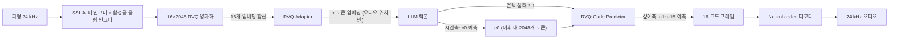

[논문 링크](https://arxiv.org/abs/2609.12945)
## StepAudio 3 Gen: 이산 자회귀(RVQ) 하나로 음성·노래·음악·효과음을 통합하다

## 한 줄 요약 (TL;DR)

StepFun이 발표한 **StepAudio 3 Gen** 은 12.5 Hz 프레임률의 $16 \times 2048$ 잔차 벡터 양자화(RVQ) 토크나이저로 모든 오디오를 하나의 공유 이산 코드 공간에 압축하고, 사전학습된 LLM이 **시간축에서** 첫 번째 코드북 $c_0$ 을, 경량 예측기가 **깊이축에서** 나머지 15개 코드북 $c_1,\dots,c_{15}$ 를 예측하는 완전 이산 자회귀 생성기다. 확산(diffusion)/플로우(flow) 기반 연속 생성 패러다임을 버렸음에도 TTS와 voice design에서 state-of-the-art를 달성했다(§1, §3, §7).

## 핵심 아이디어

이 논문의 중심 주장은 한 문장으로 정리할 수 있다.

> **저자들은 [공유 RVQ 이산 표현 + time–depth 분해 + 간섭 인지(interference-aware) 점진적 사전학습]을 사용함으로써 [오디오 모달리티를 더할 때 사전학습된 LLM의 텍스트 능력이 무너지는 망각 문제]를 극복하면서도 [음성·노래·음악·효과음 전반을 하나의 이산 자회귀 생성기로 통합하는 SOTA 결과]를 달성할 수 있다고 가정한다.**

구체적으로 세 가지 축이 핵심이다(§1).

1. **간섭 인지 점진적 사전학습**: 4단계 커리큘럼(정렬 → 이해 → 분리 생성 → 장문 컨텍스트 공동 쿨다운)으로 오디오 능력을 순차적으로 주입하면서 LLM의 텍스트 능력을 보존한다.
2. **RVQ Adaptor**: 0으로 초기화된(즉, 초기에 항등 사상) 토큰별 잔차 모듈이 16개 코드북 임베딩의 합을 LLM 입력 공간으로 사상한다.
3. **범용 오디오에 대한 이산 자회귀 모델링**: 단일 LLM 백본 + 공유 RVQ 표현으로 음성·노래·음악·효과음·혼합 장면까지 이산 코드 공간에서 생성한다.

한눈에 보는 핵심 스펙은 아래와 같다(§3, §5, §6).

| 항목 | 값 |
|---|---|
| 토크나이저 | 12.5 Hz, $16 \times 2048$ RVQ, 24 kHz 파형 재구성 |
| 프레임당 코드 | 16개 ($c_0\dots c_{15}$), 각 코드북 2,048개 항목 |
| 백본 | 사전학습된 decoder-only Transformer LLM |
| 컨텍스트 | 16,384 → 32,768 tokens (12.5 Hz 기준 약 44분 오디오) |
| 사전학습 토큰 | 약 2.7 T tokens (Stage 3: 1.6 T, Stage 2: 380 B, Stage 4: 600 B) |
| SFT 데이터 | 약 5,000시간 오디오 |
| 강화학습 | GRPO (그룹 크기 $G=16$) |

## 배경: 그들이 해결한 문제

오디오 생성은 오랫동안 **도메인별로 따로** 발전해 왔다. TTS는 언어적 충실도·화자 유사도·운율 제어를, text-to-audio는 비음성 이벤트·음향 장면을, text-to-music/singing은 음악 구조·음색·장기 일관성을 각각 최적화해 왔다. 특화 덕에 각 영역은 강해졌지만, 여러 종류의 오디오가 동시에 필요한 응용(대화 속에 효과음과 배경음악이 섞이는 장면 등)은 서로 호환되지 않는 표현·조건부 형식·생성 파이프라인에 막혀 있었다(§1).

최근 연구는 **통합 오디오 생성으로** 수렴하고 있으며, 크게 두 갈래다.

- **연속 잠재 공간 + 확산/플로우 매칭**: Audiobox, AudioX, UniFlow-Audio, Qwen-Audio-3.0-Gen-Preview 등. 병렬 음향 렌더링에는 효과적이다.
- **이산 유닛 + LM 스타일 시퀀스 모델링**: AudioLM, UniAudio, AnyGPT, UniAudio 2.0 등. 이산 표현은 LLM의 어휘·causal 목적함수·인터리브 컨텍스트와 호환되어, "오디오 이해 + 생성 + 텍스트 지능"을 한 모델에 담기에 유리하다(§1, §2).

이산 방향을 택하면 곧바로 **고품질 RVQ의 딜레마에** 부딪힌다. 고품질 RVQ는 프레임마다 여러 코드북 ID를 가진다. 이를 시간축으로 평평하게 펼치면 시퀀스가 감당할 수 없을 만큼 길어지고, 굵은(coarse) 의미 토큰 하나만 쓰면 음향 디테일을 잃는다. 이에 대한 기존 해법은 두 가지다(§1, §2).

- **time–depth 모델**(RQ-Transformer, Moshi 등): 시간 Transformer가 프레임 간 구조를, 작은 로컬 Transformer가 프레임 내 코드북을 담당.
- **delayed pattern**(MusicGen 등): 병렬 코드북 스트림을 서로 다른 시간 오프셋으로 밀어 한 Transformer가 모든 레이어를 예측.

저자들의 세팅에서는 delayed pattern이 **다중 스트림 오디오 출력 인터페이스** 를 요구하고, 사전학습된 LLM이 모든 잔차 레이어를 직접 예측하며 모든 음향 손실을 떠안게 된다. 그래서 **time–depth 분해** 를 택한다: LLM은 의미가 집중된 $c_0$ 와 장기 계획을, 작은 모듈은 잔차 음향 모델링과 그 그래디언트를 담당한다(§1).

그러나 이 분해를 해도 문제는 남는다. **텍스트 LLM에 오디오 토큰을 더하는 것은 중립적이지 않다.** 새로 초기화된 여러 RVQ 임베딩의 합은 사전학습된 텍스트 임베딩의 통계와 맞지 않고, 잔차 코드북 목적함수는 하나의 시간 결정마다 수많은 음향 예측을 공급한다. joint optimization은 오디오 모듈이 쓸모있어지기 전에 백본이 두 효과를 모두 흡수하게 만들어, 물려받은 언어 지능을 오디오 능력과 맞바꾸게 할 수 있다. 저자들은 이 **두 간섭 채널(표현 수준 + 최적화 수준)** 을 명시적으로 겨냥한다(§1).

## 새로운 접근법: StepAudio 3 Gen

### 토크나이저: StepAudio Tokenizer

12.5 Hz 프레임률의 범용 오디오 토크나이저로, 음성·음악·일반 오디오를 단일 공유 다중 코드북 공간으로 이산화하고 24 kHz 파형을 재구성한다. X-Codec 계열을 따라 **의미(semantic)와 음향(acoustic) 특징을 결합 양자화한다**(§3).

- **의미 특징**: 동결된 SSL 인코더가 제공.
- **음향 특징**: SnakeBeta 활성화를 쓰는 합성곱 인코더가 원시 파형에서 50 Hz로 추출.
- 두 표현을 **채널축으로** 융합 → stride 합성곱으로 12.5 Hz로 시간 압축 → **단일 공유 양자화기로** 이산화.

덕분에 모든 코드 레이어가 의미 내용과 음향 디테일을 동시에 담으며, 특정 모달리티에 전용되지 않는다. 양자화는 16층 × 2,048 항목의 잔차 벡터 양자화기이며, factorized cosine-similarity 코드북 룩업(DAC)을 쓴다(§3).

스트리밍 합성을 위해 디코더는 완전 causal이다. Vocos 스타일 Transformer 백본에 RoPE와 **25-프레임 슬라이딩 윈도우 어텐션** 을 얹고, 역 STFT(ISTFT) 헤드가 24 kHz 오디오를 내보낸다. 유계 수용장(bounded receptive field) 아래 look-ahead 없이 토큰에서 파형을 점진적으로 재구성하므로 저지연 실시간 서비스가 가능하다(§3).

### 백본과 time–depth 분해

사전학습된 decoder-only Transformer 구조는 그대로 두고, 토큰 임베딩과 출력 어휘만 확장한다. **가장 굵은 코드북 $c_0$ 를 2,048개의 연속된 오디오 토큰으로 주 어휘에 편입시켜**, 단일 LM 헤드가 자연어 토큰과 최상위 오디오 코드를 함께 예측하게 한다(§3).

입력 측에서는 오디오 프레임이 단일 어휘 임베딩 하나로 읽히지 않는다. 16개 코드북 각각이 자체 임베딩 테이블을 갖고, 조회된 16개 벡터를 **합산해** 하나의 프레임 임베딩을 만든 뒤 **RVQ Adaptor**(토큰별 pre-norm + SwiGLU 잔차 블록 스택)를 통과시켜 LLM 입력 공간으로 사상한다. 그 출력은 **오디오 위치에만** $c_0$ 토큰 임베딩에 요소별로 더해진다. 텍스트 위치는 이 경로로부터 아무것도 받지 않으므로 그대로 유지된다. 이 **위치 게이팅이** 텍스트 분포를 깨지 않고 오디오 모달리티를 접붙이는 핵심 장치다(§3).

생성은 다음처럼 인수분해된다.

$$
p(c_{t,0},\dots,c_{t,15} \mid \mathbf{z}_{<t}, \mathbf{c}_{<t})
= \underbrace{p(c_{t,0} \mid \mathbf{z}_{<t}, \mathbf{c}_{<t})}_{\text{main LM head}}
\prod_{k=1}^{15} \underbrace{p(c_{t,k} \mid \mathbf{z}_t, c_{t,0},\dots,c_{t,k-1})}_{\text{RVQ code predictor}}
$$

이 인수분해는 근사가 아니라 **정확하다**. 과거 프레임의 앞선 코드북들이 별도 경로로 예측기에 도달하지 않기 때문이다 — 16개 조회 벡터가 모두 프레임 임베딩에 합산되므로 $\mathbf{z}_t$ 는 이미 $\mathbf{c}_{<t}$ 를 백본을 통해 인코딩하고 있다. 대신 포기하는 것은 역방향, 즉 예측기의 출력이 백본으로 피드백되지 않는다는 점이며, 이것이 예측기가 수렴한 뒤에야 두 절반을 공동 학습하는 이유다(§3).

목적함수는 텍스트·$c_0$ 에 대한 토큰 단위 항과 15개 잔차 코드북 항의 합이다.

$$
\mathcal{L} = \mathcal{L}_{\mathrm{tok}} + \lambda \mathcal{L}_{\mathrm{sp}},
\qquad
\mathcal{L}_{\mathrm{tok}} = -\sum \log p(c_{t,0}, x_t),
\qquad
\mathcal{L}_{\mathrm{sp}} = -\sum_t \sum_{k=1}^{15} \log p(c_{t,k} \mid \cdot)
$$

여기서 $\mathcal{L}_{\mathrm{sp}}$ 는 깊이에 대해 **합산한다**(평균이 아니다). $\lambda$ 는 단계별로 바뀌는 유일한 가중치다(§3, §5).

### 간섭 인지 점진적 사전학습 (4단계)

저자들은 표현 수준과 최적화 수준의 간섭을 각각 해결한다(§1, §5).

- **입력(표현) 측**: 전체 RVQ 프레임의 합산 임베딩이 RVQ Adaptor를 거친 뒤 일반 토큰 임베딩에 더해진다. Adaptor는 0 초기화라 초기에는 항등 사상이므로, 별도 시퀀스 인코더나 백본 교체 없이 오디오 입력에 모달리티별 변환을 준다.
- **최적화 측**: 4단계 커리큘럼으로, 무작위 초기화된 잔차 코드 예측기의 조건부 은닉 상태를 백본에서 **분리(detach)시켜** 15-코드북 손실이 즉시 백본을 재구성하는 것을 막는다.

각 단계는 다음과 같다(Tab. 1, §5).

| 단계 | 초점 | 배치(토큰) | LR | 스케줄 |
|---|---|---|---|---|
| 1 | 모달리티 정렬 | 4.19 M | $2\times10^{-4} \to 2\times10^{-5}$ | cosine |
| 2 | 오디오 이해 | 12.58 M | $2\times10^{-5}$ | constant |
| 3 | 생성(분리) | 12.58 M | $2\times10^{-5}$ | constant |
| 4 | 장문 컨텍스트 공동 쿨다운 | 25.17 M | $2\times10^{-5} \to 1.5\times10^{-5}$ | cosine |

- **Stage 1 (정렬)**: 동결 백본 아래 ASR·음성→텍스트 번역 데이터로, 텍스트 출력만 지도한다. 입력측 오디오 임베딩과 Adaptor만 학습하고 백본·LM 헤드·코드 예측기는 LR 0이다. Adaptor의 down-projection이 0 초기화라 초기에 항등 사상 → 텍스트 능력 드리프트가 **엄밀히 0이므로** 텍스트 리플레이가 필요 없다.
- **Stage 2 (이해)**: 전체 모델 동결 해제, 오디오 이해 과제와 텍스트 코퍼스를 1:1 혼합(여전히 오디오 출력은 지도하지 않음). LR $2\times10^{-5}$ 상수, from-scratch 모듈은 $10\times$ LR 승수 + weight decay 제외.
- **Stage 3 (분리 생성)**: 사전학습의 본체. 텍스트:TTS:인터리브 대화 = 3:1:2 혼합(텍스트 점유율 50% 유지). 코드 예측기의 조건 입력을 백본 은닉 상태에서 **detach** → 잔차 음향 부분은 예측기만 학습, 백본은 토큰 목적함수로만 갱신. $\lambda=1.0$. 약 1.6 T tokens, 총 연산의 약 60%(256×H800, 130k steps).
- **Stage 4 (쿨다운)**: detach 해제 → 잔차 음향이 백본으로 역전파되어 은닉 상태가 좋은 음향 조건이 된다. $\lambda$ 를 $1.0\to0.1$ 로 낮춰 두 항의 크기를 비슷하게 맞춘다. 컨텍스트 병렬로 시퀀스를 16,384 → 32,768 로 확장(약 44분 오디오). 약 600 B tokens.

이후 **SFT**(전체 파라미터, $\lambda=0.1$, 약 5,000시간 오디오, 오디오 임베딩·Adaptor·예측기 $10\times$ LR)와 **GRPO** 강화학습을 거친다(§6).

### 조건부 제어: ROLE / DIRECTOR / SCRIPT

모델은 도메인별 API 대신 **통합 명령 포맷으로** 제어된다. 각 요청은 세 필드로 구성된다(§1).

- **ROLE**: 화자 정체성·음성 특징(음색, 말투, 감정, 억양, 방언, 웃음·숨·휴지 같은 준언어적 특징까지).
- **DIRECTOR**: 음향 장면·생성 의도(환경음, 음악, 말투 등).
- **SCRIPT**: 시간축의 말·소리 이벤트 배열. 말 구간은 화자 태그로 접두하고 `(description)` 로 스타일/감정을, 효과음·음악은 `[description]` 으로 표기해 상대 순서를 명시한다.

## 작동 원리: 구체적인 예시로 살펴보기

"부드러운 여성 목소리로 '안녕하세요' 라고 말하고, 배경에는 빗소리가 깔리는" 장면을 생성한다고 하자. 입력은 다음과 같은 형태로 주어진다(§1).

```
ROLE: 20대 여성, 부드럽고 차분한 음색
DIRECTOR: 조용한 실내, 창밖에 내리는 비
SCRIPT: [빗소리 시작] <SPK_1> (따뜻하게) 안녕하세요. [빗소리 계속]
```

전체 흐름을 다이어그램으로 그리면 이렇다.



생성 단계를 시간축으로 따라가 보자. 오디오는 12.5 Hz, 즉 1초에 12.5 프레임이다(§5). 각 프레임 $t$ 는 16개 코드 $c_{t,0},\dots,c_{t,15}$ 로 표현된다.

1. LLM이 텍스트 토큰들(`ROLE`, `DIRECTOR`, `SCRIPT` 의 문자열)을 순차 처리한다.
2. 오디오를 내보낼 위치에 도달하면, LLM의 LM 헤드가 **첫 코드 $c_{t,0}$** 를 어휘 내 2,048개 오디오 토큰 중 하나로 샘플링한다. 이 토큰은 대략 "지금 이 프레임이 어떤 소리인가"의 굵은 의미(모음/자음/빗소리/무음 등)를 담는다.
3. 동시에 그 위치의 **백본 은닉 상태 $\mathbf{z}_t$** 와 방금 뽑은 $c_{t,0}$ 가 **RVQ Code Predictor**(4층 causal Transformer, §1)의 접두어로 들어가, **깊이축으로** $c_{t,1},\dots,c_{t,15}$ 를 자동회귀적으로 완성한다. 이 15개 코드는 같은 프레임의 음향 디테일(음색, 잡음, 공명 등)을 채운다.
4. 16개 코드가 모여 완전한 RVQ 프레임이 되고, neural codec 디코더가 이를 24 kHz 파형 조각으로 되돌린다.

아주 단순한 3-프레임 toy 예시로 표현하면 다음과 같다(값은 예시).

| 프레임 | $c_0$ (LLM이 시간축에서 예측) | $c_1\dots c_{15}$ (예측기가 깊이축에서 예측) | 의미 |
|---|---|---|---|
| $t=1$ | 1532 | 16개 값 | 빗소리(배경) |
| $t=2$ | 402 | 16개 값 | "안" (모음) |
| $t=3$ | 1187 | 16개 값 | "녕" (받침) |

핵심은 **시간축(의미·계획)과 깊이축(음향 디테일)의 책임 분리다**. LLM은 2,048개짜리 굵은 의미 토큰 하나만 고르면 되므로 시퀀스가 길어지지 않고, 잔차 음향은 경량 예측기가 떠안는다(§1, §3).

## 성능 검증: 주요 결과

평가는 세 질문으로 구성된다: RVQ Adaptor가 다중 코드북 표현을 잘 통합하는가, 점진적 사전학습이 LLM 텍스트 능력을 보존하는가, 그리고 결과 모델의 생성 품질·제어력이 좋은가(§7).

### (1) RVQ Adaptor의 효과

Adaptor 유무에 따른 오디오 벤치마크 비교는 아래와 같다(Tab. 2, §7). 모든 지표에서 Adaptor를 쓴 쪽이 압도적으로 우수하다.

| 시스템 | AISHELL-1 CER(%) ↓ | LibriSpeech WER(%) ↓ | MMAU Acc(%) ↑ | CoVoST BLEU ↑ (En→Zh) | CoVoST BLEU ↑ (Zh→En) | SpeechMMLU Acc(%) ↑ |
|---|---|---|---|---|---|---|
| w/o RVQ Adaptor | 5.25 | 6.00 | 40.70 | 12.05 | 5.99 | 12.13 |
| **w/ RVQ Adaptor** | **3.00** | **3.41** | **51.70** | **30.56** | **18.59** | **58.76** |

특히 SpeechMMLU(T2S)가 12.13% → 58.76%, CoVoST En→Zh BLEU가 12.05 → 30.56 로 2배 이상 뛰는 것은, Adaptor가 오디오 임베딩을 LLM 임베딩 공간에 정렬해 줌으로써 이해 능력 자체가 살아난다는 것을 보여준다(§7).

### (2) 점진적 사전학습의 텍스트 보존 효과

3단계 baseline과 비교했을 때, 간섭 인지 방식이 모든 텍스트 벤치마크에서 우위를 보인다(Tab. 3, §7).

| 시스템 | FinEval | C-Eval | MMLU | CMMLU | MATH | GSM8K | BBH | HumanEval |
|---|---|---|---|---|---|---|---|---|
| Baseline | 65.86 | 66.34 | 64.99 | 66.69 | 36.62 | 67.94 | 59.61 | 47.56 |
| **Interference-aware** | **71.68** | **71.92** | **69.20** | **71.73** | **45.07** | **74.05** | **67.03** | **54.27** |

MATH(36.62 → 45.07, +8.45p), GSM8K(67.94 → 74.05, +6.11p) 같은 추론 벤치에서 특히 크게 보존되는데, 이는 detach + 50% 텍스트 리플레이 + 0초기화 Adaptor가 오디오 손실이 백본 추론 능력을 갉아먹는 것을 실질적으로 막는다는 증거다(§5, §7).

### (3) TTS: 인간 평가에서 SOTA

TTS는 인간 유사성(human-likeness)에 초점을 두고 **Arena 방식 이중 비교로** 평가한다. CER·화자 유사도(SS) 같은 객관 지표는 운율이 평평해도 낮게 나올 수 있어, 표현력·자연스러움을 제대로 반영하지 못한다는 게 저자들의 논리다(§7).

- **Elo 1755.33로** 1위, 5개 상용 TTS(Qwen-Audio-3.0-TTS-Plus, Doubao-App, MiniMax-Speech-2.8-HD, Inworld-TTS-2, StepAudio 2.5 TTS)를 모두 제쳤다(Fig. 2).
- 1,500회 비교, 상대당 100회. **종합 승률 82.0%**, 상대별 73.0%–90.0% 로 모든 매치업에서 우위(Fig. 2).

### (4) Voice Design: 객관 벤치마크 + 인간 선호 모두 1위

InstructTTSEval 벤치마크(중·영 각 1,000문장 × APS/DSD/RP 3조건 = 시스템당 6,000 발화)에서 Gemini 3.1 Pro가 이진 스타일 일관성을 판정한다(Tab. 4, §7).

| 시스템 | EN APS | EN DSD | EN RP | **EN AVG** | ZH APS | ZH DSD | ZH RP | **ZH AVG** |
|---|---|---|---|---|---|---|---|---|
| Qwen3-TTS-12Hz-1.7B-VoiceDesign | 74.7 | 83.8 | 61.9 | 73.5 | 79.0 | 86.7 | 56.2 | 74.0 |
| MOSS-VoiceGenerator | 59.5 | 79.0 | 56.1 | 64.9 | 63.7 | 78.1 | 53.4 | 65.1 |
| Ming-omni-tts-0.5B | 71.6 | 67.7 | 55.9 | 65.1 | 75.2 | 83.8 | 54.0 | 71.0 |
| VoiceSculptor | – | – | – | – | 49.2 | 62.5 | 45.9 | 52.5 |
| **StepAudio 3 Gen** | **82.4** | **85.5** | **65.2** | **77.7** | **88.5** | **91.5** | **75.5** | **85.2** |

중국어 평균 85.2%, 영어 평균 77.7% 로 두 언어 모두 1위다. 인간 선호 평가에서도 **Elo 1668.5로** 1위, 종합 승률 75.5%(상대별 65.3%–85.7%)를 기록했다(Fig. 3).

### 그 외 능력 (Extensions)

음성 복제 기반 노래(speech-to-vocal), 60초를 넘는 일관된 기악곡, 단일 효과음부터 다중 음원·시간 배열이 있는 복합 음향 장면, 그리고 대사·분위기·배경음을 함께 모델링하는 **vibe speech와** 다중 화자 대화까지 지원한다(§8).

## 우리의 관점: 강점, 한계, 그리고 이 연구가 중요한 이유

### 강점

가장 돋보이는 것은 **공학적 솜씨의 완성도다**. 오디오를 LLM에 접붙이는 과정에서 발생하는 "텍스트 지능 망각"을 단순히 "텍스트 리플레이를 섞었다" 정도가 아니라, **표현(0초기화 Adaptor → 항등 사상)과 최적화(stop-gradient detach) 두 채널로 나누어 정밀하게 다룬 점이** 이 논문의 핵심 공헌이다(§1, §5). 0초기화 덕분에 Stage 1에서 텍스트 드리프트가 엄밀히 0이 된다는 주장은 이론적으로 깔끔하고, Tab. 3의 결과가 이를 뒷받침한다.

둘째, **time–depth 분해를 delayed pattern 대신 택한 이유가 명확하다**. 프레임 인수분해가 근사가 아니라 정확하다는 점(과거 코드가 백본을 통해 이미 $\mathbf{z}_t$ 에 들어 있으므로)은 수학적으로 우아하며, 예측기가 수렴한 뒤에만 공동 학습하는 4단계 설계와 정확히 맞물린다(§3).

셋째, **범용 오디오를 하나의 이산 코드 공간에서** 다룬다는 철학 자체다. 확산·플로우 기반 연속 생성이 주류인 시점에서, 음향 렌더러 없이도 TTS·voice design에서 SOTA를 찍었다는 것은 이산 자회귀가 "언어 모델 하나로 모든 오디오를" 이라는 목표에 실용적으로 스케일할 수 있음을 보여준다(§9).

### 한계와 비판

공정하게 보자면 아쉬운 점도 뚜렷하다.

1. **핵심 스펙 미공개**: 백본 LLM의 파라미터 수가 본문에 명시되어 있지 않다. 발표 자체는 기술 보고서이므로 치명적이진 않지만, SOTA 주장을 재현·검증하려는 독자에게는 치명적인 정보 공백이다.
2. **일반 오디오 생성의 정량 근거 부족**: 효과음·음악에 대한 LALM/AudioBox 평가 테이블이 본문에서 주석 처리되고 결과가 `--` (TODO)로 비어 있다(§7). 즉 "음악·효과음 생성도 강하다"는 주장은 Extensions의 정성 서술에만 의존한다. TTS·voice design에 비해 근거가 크게 약하다.
3. **지나친 주관 평가 의존**: TTS를 CER/SS 같은 객관 지표 없이 전적으로 인간 평가로만 검증했다. 인간 유사성이라는 목표에는 타당하지만, 재현성과 리더보드 호환성 측면에서 객관 지표를 병기했다면 더 설득력 있었을 것이다(§7).
4. **RL 효과의 검증 부재**: GRPO 보상 설계(캡션 일치 × ASR 오류 패널티)는 정교하지만, RL 적용 전후의 정량 개선이 보고되지 않아 실제 효용을 확인할 수 없다(§6).
5. **추론 효율 지표 부재**: 저지연 스트리밍을 강조하면서도 TTFT·토큰/초 처리량·메모리 점유 같은 수치가 없다. 실서비스 경쟁력(특히 16-코드북 RVQ 디코딩 + 4층 예측기의 지연)을 가늠할 근거가 없다(§3).
6. **안전·사회적 영향 미흡**: 목소리 복제(voice cloning)·딥페이크 음성 등 고품질 TTS/voice design이 갖는 오남용 위험에 대한 논의가 없다.

### 왜 중요한가

그럼에도 이 연구가 중요한 이유는, **"이산 자회귀가 범용 오디오 생성의 실용적 대안"** 이라는 주장을 실제로 SOTA 성능으로 입증했다는 점이다. 특히 오디오 LLM이 반드시 부딪히는 망각 문제를 두 채널로 정면 돌파한 레시피(4단계 + detach + 0초기화 Adaptor + 50% 텍스트 리플레이)는 오디오를 넘어 이미지·비디오 등 다른 모달리티를 LLM에 접목하려는 후속 연구에 그대로 이식 가능한 실용적 지침이다.

## 다음 단계는?: 앞으로의 길

저자들은 결론에서 세 가지 실용적 교훈을 강조한다: 오디오 능력은 간섭을 줄이기 위해 점진적으로 도입하라, 다중 코드북 표현은 경량 RVQ Adaptor로 통합할 수 있다, 이산 자회귀는 연속 렌더러 없이 음성을 넘어 범용 오디오로 스케일할 수 있다(§9).

이 한계들을 고려한 합리적인 다음 단계는 다음과 같다.

- **음악·효과음의 정량 평가 보완**: 비워 둔 LALM/AudioBox 결과를 채우고, MusicCaps·AudioCaps 같은 공개 벤치마크에서의 객관 지표를 보고해 "범용" 주장을 뒷받침.
- **객관 지표 병기**: 인간 평가와 함께 CER/SS/MOS/생성 다양성 지표를 함께 보고해 재현성을 높이고, TTS에서의 우위가 "표현력"뿐 아니라 "정확도"에서도 유지됨을 보일 것.
- **추론 효율 최적화**: 스트리밍 시나리오에서의 실측 지연·처리량을 공개하고, 4층 예측기와 16-코드북 디코딩의 병렬화·경량화를 탐구.
- **확장성 검증**: 더 긴 오디오(수 분~전체 곡)로의 스케일링, 그리고 이산 자회귀 접근이 토크나이저 해상도(12.5 Hz → 고해상도)에서 어떻게 확장되는지 분석.
- **책임 있는 공개**: voice cloning의 오남용 방지(워터마크, 화자 검증, 안전 가드레일)와 데이터 라이선스·개인정보 처리에 대한 명시.


<!-- verbatim-tables -->

## 논문 원문의 표

> arXiv e-print 의 LaTeX 원본에서 기계적으로 옮긴 표입니다. 숫자는 논문의 값이며 모델을 거치지 않았습니다.

**표 1. Four-stage pretraining recipe. Batch size is measured in tokens per optimizer step, where one temporal LLM step counts as one token. Thus, audio represented at 12.5 Hz contributes 12.5 tokens per second, although each audio token contains 16 RVQ codebook IDs. LR denotes learning rate.**

| Stage | Focus | Batch Size (tokens) | LR | LR scheduler |
|---|---|---|---|---|
| 1 | modality alignment | $4.19$M | $2\times10^{-4} \to 2\times10^{-5}$ | cosine |
| 2 | audio understanding | $12.58$M | $2\times10^{-5}$ | constant |
| 3 | generation, detached | $12.58$M | $2\times10^{-5}$ | constant |
| 4 | long-context cool-down | $25.17$M | $2\times10^{-5} \to 1.5\times10^{-5}$ | cosine |

**표 2. Comparison of systems with and without the RVQ Adaptor on audio benchmarks after pretraining.**

| System | AISHELL-1 CER (%) $\downarrow$ | LibriSpeech WER (%) $\downarrow$ | MMAU Acc. (%) $\uparrow$ | CoVoST BLEU $\uparrow$ En$\to$Zh | CoVoST BLEU $\uparrow$ Zh$\to$En | SpeechMMLU (T2S) Acc. (%) $\uparrow$ |
|---|---|---|---|---|---|---|
| w/o RVQ Adaptor | 5.25 | 6.00 | 40.70 | 12.05 | 5.99 | 12.13 |
| w/ RVQ Adaptor | **3.00** | **3.41** | **51.70** | **30.56** | **18.59** | **58.76** |

**표 3. Comparison of the baseline and our interference-aware progressive pretraining on text benchmarks after pretraining.**

| System | FinEval | C-Eval | MMLU | CMMLU | MATH | GSM8K | BBH | HumanEval |
|---|---|---|---|---|---|---|---|---|
|  | Acc. (%) $\uparrow$ | Acc. (%) $\uparrow$ | Acc. (%) $\uparrow$ | Acc. (%) $\uparrow$ | EM (%) $\uparrow$ | EM (%) $\uparrow$ | EM (%) $\uparrow$ | Pass@1 (%) $\uparrow$ |
| Baseline | 65.86 | 66.34 | 64.99 | 66.69 | 36.62 | 67.94 | 59.61 | 47.56 |
| Interference-aware | **71.68** | **71.92** | **69.20** | **71.73** | **45.07** | **74.05** | **67.03** | **54.27** |

**표 4. StepAudio 3 Gen style-consistency scores on the full InstructTTSEval benchmark (2,000 texts under three conditions, totaling 6,000 generated utterances). Scores are percentages; higher is better. For each language, AVG is the unweighted mean of APS, DSD, and RP.**

|  | **InstructTTSEval-EN** APS$\uparrow$ | **InstructTTSEval-EN** DSD$\uparrow$ | **InstructTTSEval-EN** RP$\uparrow$ | **InstructTTSEval-EN** AVG$\uparrow$ | **InstructTTSEval-ZH** APS$\uparrow$ | **InstructTTSEval-ZH** DSD$\uparrow$ | **InstructTTSEval-ZH** RP$\uparrow$ | **InstructTTSEval-ZH** AVG$\uparrow$ |
|---|---|---|---|---|---|---|---|---|
| Qwen3-TTS-12Hz-1.7B-VoiceDesign | 74.7 | 83.8 | 61.9 | 73.5 | 79.0 | 86.7 | 56.2 | 74.0 |
| MOSS-VoiceGenerator | 59.5 | 79.0 | 56.1 | 64.9 | 63.7 | 78.1 | 53.4 | 65.1 |
| Ming-omni-tts-0.5B | 71.6 | 67.7 | 55.9 | 65.1 | 75.2 | 83.8 | 54.0 | 71.0 |
| VoiceSculptor | - | - | - | - | 49.2 | 62.5 | 45.9 | 52.5 |
| **StepAudio 3 Gen (Ours)** | **82.4** | **85.5** | **65.2** | **77.7** | **88.5** | **91.5** | **75.5** | **85.2** |
