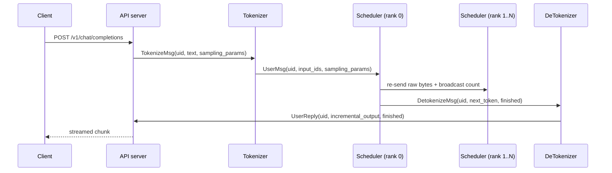

Open an LLM serving framework for the first time and you will probably go
looking for the scheduler. But no amount of reading scheduler code answers the
question that actually blocks you: who calls this function, and who puts things
in that queue? Mini-SGLang is not a single-process program. One HTTP request
passes through at least four kinds of process before it becomes an answer, and
every gap between them is crossed by a message and nothing else.

This chapter draws that map first. Once we have settled which processes exist,
how many of each, and what crosses each boundary, the scheduler code in the
chapters that follow stops being ambiguous about *where* it runs.

## What starts when the server starts

The place to begin is `start_subprocess` inside `launch_server`. Every process
is spawned in one function, so you can count the whole topology by reading it.

```python
        world_size = server_args.tp_info.size
        ...
        for i in range(world_size):
            new_args = replace(
                server_args,
                tp_info=DistributedInfo(i, world_size),
            )
            mp.Process(
                target=_run_scheduler,
                args=(new_args, ack_queue),
                daemon=False,
                name=f"minisgl-TP{i}-scheduler",
            ).start()
```

— [`python/minisgl/server/launch.py:54-69`](https://github.com/sgl-project/mini-sglang/blob/9a91cfafe754aa85daee49998176275667eb58f2/python/minisgl/server/launch.py#L54-L69)

One scheduler per tensor-parallel (TP) rank. TP is the practice of slicing model
weights across several GPUs; for now the only thing that matters is that one
scheduler process starts per GPU. How those ranks reach the same decisions is
chapter 8.

Next come the tokenizers, and there is a neat choice hiding here.

```python
        num_tokenizers = server_args.num_tokenizer
        # DeTokenizer, only 1
        mp.Process(
            target=tokenize_worker,
            kwargs={
                ...
                "tokenizer_id": num_tokenizers,
                "ack_queue": ack_queue,
            },
            daemon=False,
            name="minisgl-detokenizer-0",
        ).start()
        for i in range(num_tokenizers):
            mp.Process(
                target=tokenize_worker,
                kwargs={
                    ...
                    "tokenizer_id": i,
                    "ack_queue": ack_queue,
                },
                daemon=False,
                name=f"minisgl-tokenizer-{i}",
            ).start()
```

— [`python/minisgl/server/launch.py:71-103`](https://github.com/sgl-project/mini-sglang/blob/9a91cfafe754aa85daee49998176275667eb58f2/python/minisgl/server/launch.py#L71-L103)

The tokenizer and the detokenizer start from the **same function**,
`tokenize_worker`. All that separates them is a `tokenizer_id` and which address
they listen on. The detokenizer takes `tokenizer_id=num_tokenizers`, so its id
never collides with the others, and it listens on `zmq_detokenizer_addr`. Turning
text into tokens and turning tokens back into text both need the same tokenizer
object, so putting both in one worker and dispatching on the incoming message
type is simply less machinery.

The last step is the readiness check.

```python
        # Wait for acknowledgments from all worker processes:
        # - world_size schedulers (but only primary rank sends ack)
        # - num_tokenizers tokenizers
        # - 1 detokenizer
        # Total acks expected: 1 + num_tokenizers + 1 = num_tokenizers + 2
        for _ in range(num_tokenizers + 2):
            logger.info(ack_queue.get())
```

— [`python/minisgl/server/launch.py:105-111`](https://github.com/sgl-project/mini-sglang/blob/9a91cfafe754aa85daee49998176275667eb58f2/python/minisgl/server/launch.py#L105-L111)

However many schedulers start, exactly one ack arrives from them, because only
the primary rank sends one ([`python/minisgl/server/launch.py:24-25`](https://github.com/sgl-project/mini-sglang/blob/9a91cfafe754aa85daee49998176275667eb58f2/python/minisgl/server/launch.py#L24-L25)). The HTTP
server does not open until this loop finishes, so a request cannot land on a
backend that is still loading weights.

<!-- visual: process-roles supports: [process-roles] -->

| Process | Count | Responsibility | Listens on |
| --- | --- | --- | --- |
| Scheduler | `tp_info.size` | Batching, KV management, model execution | `zmq_backend_addr` |
| Tokenizer | `num_tokenizer` | Text → token ids | `zmq_tokenizer_addr` |
| DeTokenizer | 1 | Tokens → incremental text | `zmq_detokenizer_addr` |
| API server | 1 (main) | HTTP intake, uid allocation, streaming replies | `zmq_frontend_addr` |

## The journey of one request

Now follow a request. The FastAPI handler allocates a uid and throws exactly one
message.

```python
    uid = state.new_user()
    await state.send_one(
        TokenizeMsg(
            uid=uid,
            text=prompt,
            sampling_params=SamplingParams(
                ignore_eos=req.ignore_eos,
                max_tokens=req.max_tokens,
                ...
            ),
        )
    )
```

— [`python/minisgl/server/api_server.py:265-278`](https://github.com/sgl-project/mini-sglang/blob/9a91cfafe754aa85daee49998176275667eb58f2/python/minisgl/server/api_server.py#L265-L278)

The uid is a plain incrementing counter. Allocating it also creates the slot that
will hold this request's replies and the event that announces their arrival.

```python
    def new_user(self) -> int:
        uid = self.uid_counter
        self.uid_counter += 1
        self.ack_map[uid] = []
        self.event_map[uid] = asyncio.Event()
        return uid
```

— [`python/minisgl/server/api_server.py:109-114`](https://github.com/sgl-project/mini-sglang/blob/9a91cfafe754aa85daee49998176275667eb58f2/python/minisgl/server/api_server.py#L109-L114)

At this point the HTTP handler lets go. The return path is entirely separate: a
dedicated loop collects replies into `ack_map` and wakes the event
([`python/minisgl/server/api_server.py:116-123`](https://github.com/sgl-project/mini-sglang/blob/9a91cfafe754aa85daee49998176275667eb58f2/python/minisgl/server/api_server.py#L116-L123)), and the streaming response waits
on that event, flushing whatever has accumulated.

The tokenizer side sorts incoming messages by type and handles each group.

```python
            if len(tokenize_msg) > 0:
                tensors = tokenize_manager.tokenize(tokenize_msg)
                batch_output = BatchBackendMsg(
                    data=[
                        UserMsg(
                            uid=msg.uid,
                            input_ids=t,
                            sampling_params=msg.sampling_params,
                        )
                        for msg, t in zip(tokenize_msg, tensors, strict=True)
                    ]
                )
                if len(batch_output.data) == 1:
                    batch_output = batch_output.data[0]
                send_backend.put(batch_output)
```

— [`python/minisgl/tokenizer/server.py:87-101`](https://github.com/sgl-project/mini-sglang/blob/9a91cfafe754aa85daee49998176275667eb58f2/python/minisgl/tokenizer/server.py#L87-L101)

This is where the boundary changes character. The `TokenizeMsg` that came from
the frontend carried human-readable text; the `UserMsg` going out to the
scheduler carries a tensor of token ids.

```python
@dataclass
class UserMsg(BaseBackendMsg):
    uid: int
    input_ids: torch.Tensor  # CPU 1D int32 tensor
    sampling_params: SamplingParams
```

— [`python/minisgl/message/backend.py:32-36`](https://github.com/sgl-project/mini-sglang/blob/9a91cfafe754aa85daee49998176275667eb58f2/python/minisgl/message/backend.py#L32-L36)

As the comment nails down, this is a **1-D int32 tensor on the CPU**. Not a GPU
tensor. What crosses the process boundary is still a token sequence in host
memory; it moves to the GPU later, when the scheduler assembles a batch.

<!-- visual: request-process-flow supports: [request-process-flow] -->



The return path mirrors it. Every time the scheduler produces a token it sends a
`DetokenizeMsg(uid, next_token, finished)`
([`python/minisgl/message/tokenizer.py:27-31`](https://github.com/sgl-project/mini-sglang/blob/9a91cfafe754aa85daee49998176275667eb58f2/python/minisgl/message/tokenizer.py#L27-L31)), and the detokenizer gathers those
into `UserReply` objects for the frontend
([`python/minisgl/tokenizer/server.py:71-85`](https://github.com/sgl-project/mini-sglang/blob/9a91cfafe754aa85daee49998176275667eb58f2/python/minisgl/tokenizer/server.py#L71-L85)).

## Only rank 0 has a mailbox

With TP greater than 1 there are several schedulers, yet the tokenizer sends to a
single address. So how do the other ranks learn about a request?

```python
        pending_raw_msgs: List[bytes] = []
        while not self._recv_from_tokenizer.empty():
            pending_raw_msgs.append(self._recv_from_tokenizer.get_raw())

        # broadcast the number of raw messages to all ranks
        src_tensor = torch.tensor(len(pending_raw_msgs))
        self.tp_cpu_group.broadcast(src_tensor, root=0).wait()

        for raw in pending_raw_msgs:
            self._send_into_ranks.put_raw(raw)
            pending_msgs.append(self._recv_from_tokenizer.decode(raw))
```

— [`python/minisgl/scheduler/io.py:96-107`](https://github.com/sgl-project/mini-sglang/blob/9a91cfafe754aa85daee49998176275667eb58f2/python/minisgl/scheduler/io.py#L96-L107)

Rank 0 re-sends the bytes it received to the other ranks **before decoding
them**, then broadcasts how many messages there are. The receiving side reads
exactly that many ([`python/minisgl/scheduler/io.py:116-121`](https://github.com/sgl-project/mini-sglang/blob/9a91cfafe754aa85daee49998176275667eb58f2/python/minisgl/scheduler/io.py#L116-L121)). Without agreeing on
the count first, one rank could read two messages while another reads three, and
the two would build different batches for the same step. Chapter 8 covers the
protocol and how it fails.

## How a message becomes bytes

Everything that crosses a boundary is serialized, and this repository wrote that
itself too.

```python
def serialize_type(self) -> Dict:
    # find all member variables
    serialized = {}

    if isinstance(self, torch.Tensor):
        assert self.dim() == 1, "we can only serialize 1D tensor for now"
        serialized["__type__"] = "Tensor"
        serialized["buffer"] = self.numpy().tobytes()
        serialized["dtype"] = str(self.dtype)
        return serialized

    # normal type
    serialized["__type__"] = self.__class__.__name__
    for k, v in self.__dict__.items():
        serialized[k] = _serialize_any(v)
    return serialized
```

— [`python/minisgl/message/utils.py:20-35`](https://github.com/sgl-project/mini-sglang/blob/9a91cfafe754aa85daee49998176275667eb58f2/python/minisgl/message/utils.py#L20-L35)

It walks a dataclass's `__dict__` and records the class name under `__type__`.
Restoring looks the class up by that name
([`python/minisgl/message/utils.py:52-68`](https://github.com/sgl-project/mini-sglang/blob/9a91cfafe754aa85daee49998176275667eb58f2/python/minisgl/message/utils.py#L52-L68)). No schema file, no code generation.
Adding a message type means defining one dataclass in the same module. The price
is the constraint asserted right there in the code: only 1-D tensors may be sent.

The repository's own test checks that the round trip holds.

```python
    u = BatchBackendMsg([UserMsg(uid=0, input_ids=t, sampling_params=SamplingParams())])
    result = u.decoder(u.encoder())
```

— [`tests/misc/test_serialize.py:32-33`](https://github.com/sgl-project/mini-sglang/blob/9a91cfafe754aa85daee49998176275667eb58f2/tests/misc/test_serialize.py#L32-L33)

Encode a `UserMsg`, decode it, see that it survives — exactly that much.

## Wrapping up

One request travels API server → Tokenizer → Scheduler (rank 0 → the other
ranks) → DeTokenizer → API server. The message type changes at every boundary,
and the point where text becomes a tensor of token ids is the tokenizer. What the
scheduler receives is a 1-D int32 tensor on the CPU, and that is where the next
chapter begins: how that token sequence is represented inside the scheduler, and
which field remembers how far it has been computed.

Keep one thing in mind. All the scheduler code ahead runs inside a process that
is **replicated once per rank, each copy running on its own**.

## Further reading

- [SGLang](https://github.com/sgl-project/sglang) — the original project that
  Mini-SGLang condenses. The `README.md` says so in its opening.
- The repository's `docs/structures.md` — one paragraph fixing the division of
  labour: ZMQ for control messages, NCCL through `torch.distributed` for the
  heavy tensors between GPUs. This chapter followed the former; chapter 8 takes
  the latter.
