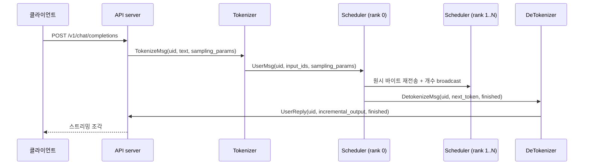

LLM 서빙 프레임워크를 처음 열면 대개 스케줄러부터 찾는다. 하지만 스케줄러 코드를
아무리 읽어도 "이 함수는 누가 부르고, 저 큐에는 누가 넣는가"가 풀리지 않는다.
Mini-SGLang 은 한 프로세스짜리 프로그램이 아니기 때문이다. HTTP 요청 하나가
답으로 돌아오기까지 최소 네 종류의 프로세스를 지나고, 그 사이는 전부 메시지로만
이어져 있다.

이 편은 그 지도를 먼저 그린다. 어떤 프로세스가 몇 개 뜨는지, 경계에서 무엇이
오가는지를 확정해 두면 다음 편부터 읽을 스케줄러 코드가 "어디에서 실행되는
코드인지" 분명해진다.

## 서버를 켜면 무엇이 뜨는가

시작점은 `launch_server` 안의 `start_subprocess` 다. 프로세스를 띄우는 코드가 한
군데에 모여 있어서, 여기만 읽으면 구성을 셀 수 있다.

```python
        world_size = server_args.tp_info.size
        ...
        for i in range(world_size):
            new_args = replace(
                server_args,
                tp_info=DistributedInfo(i, world_size),
            )
            mp.Process(
                target=_run_scheduler,
                args=(new_args, ack_queue),
                daemon=False,
                name=f"minisgl-TP{i}-scheduler",
            ).start()
```

— [`python/minisgl/server/launch.py:54-69`](https://github.com/sgl-project/mini-sglang/blob/9a91cfafe754aa85daee49998176275667eb58f2/python/minisgl/server/launch.py#L54-L69)

스케줄러는 텐서 병렬(TP) 크기만큼 뜬다. TP 는 모델 가중치를 여러 GPU 에 잘라
올리는 방식이고, 여기서는 "GPU 개수만큼 스케줄러 프로세스가 뜬다"는 사실만
필요하다. rank 들이 어떻게 같은 결정에 도달하는지는 8편에서 다룬다.

그다음이 토크나이저 쪽인데, 여기에 이 저장소의 재미있는 선택이 하나 있다.

```python
        num_tokenizers = server_args.num_tokenizer
        # DeTokenizer, only 1
        mp.Process(
            target=tokenize_worker,
            kwargs={
                ...
                "tokenizer_id": num_tokenizers,
                "ack_queue": ack_queue,
            },
            daemon=False,
            name="minisgl-detokenizer-0",
        ).start()
        for i in range(num_tokenizers):
            mp.Process(
                target=tokenize_worker,
                kwargs={
                    ...
                    "tokenizer_id": i,
                    "ack_queue": ack_queue,
                },
                daemon=False,
                name=f"minisgl-tokenizer-{i}",
            ).start()
```

— [`python/minisgl/server/launch.py:71-103`](https://github.com/sgl-project/mini-sglang/blob/9a91cfafe754aa85daee49998176275667eb58f2/python/minisgl/server/launch.py#L71-L103)

토크나이저와 디토크나이저가 **같은 함수**(`tokenize_worker`)로 뜬다. 둘을 가르는
것은 `tokenizer_id` 와 어느 주소를 듣느냐뿐이다. 디토크나이저는
`tokenizer_id=num_tokenizers` 를 받아 다른 것들과 번호가 겹치지 않고,
`zmq_detokenizer_addr` 를 듣는다. 텍스트를 토큰으로 바꾸는 일과 토큰을 텍스트로
되돌리는 일은 같은 토크나이저 객체가 필요하니, 한 워커에 둘 다 넣고 들어오는
메시지 종류로 구분하는 편이 단순하다.

마지막은 준비 확인이다.

```python
        # Wait for acknowledgments from all worker processes:
        # - world_size schedulers (but only primary rank sends ack)
        # - num_tokenizers tokenizers
        # - 1 detokenizer
        # Total acks expected: 1 + num_tokenizers + 1 = num_tokenizers + 2
        for _ in range(num_tokenizers + 2):
            logger.info(ack_queue.get())
```

— [`python/minisgl/server/launch.py:105-111`](https://github.com/sgl-project/mini-sglang/blob/9a91cfafe754aa85daee49998176275667eb58f2/python/minisgl/server/launch.py#L105-L111)

스케줄러가 TP 크기만큼 떠도 ack 는 하나만 온다. primary rank 만 보내기
때문이다([`python/minisgl/server/launch.py:24-25`](https://github.com/sgl-project/mini-sglang/blob/9a91cfafe754aa85daee49998176275667eb58f2/python/minisgl/server/launch.py#L24-L25)). 이 루프가 끝나야 HTTP 서버가
열리므로, 모델 적재가 끝나기 전에 들어온 요청이 빈 백엔드에 떨어지는 일은 없다.

<!-- visual: process-roles supports: [process-roles] -->

| 프로세스 | 개수 | 하는 일 | 듣는 주소 |
| --- | --- | --- | --- |
| Scheduler | `tp_info.size` | 배치 구성, KV 관리, 모델 실행 | `zmq_backend_addr` |
| Tokenizer | `num_tokenizer` | 텍스트 → 토큰열 | `zmq_tokenizer_addr` |
| DeTokenizer | 1 | 토큰 → 증분 텍스트 | `zmq_detokenizer_addr` |
| API server | 1 (메인) | HTTP 수신, uid 발급, 스트리밍 응답 | `zmq_frontend_addr` |

## 요청 하나의 여정

이제 요청을 따라가 보자. FastAPI 핸들러는 요청을 받자마자 uid 를 발급하고 메시지
하나를 던진다.

```python
    uid = state.new_user()
    await state.send_one(
        TokenizeMsg(
            uid=uid,
            text=prompt,
            sampling_params=SamplingParams(
                ignore_eos=req.ignore_eos,
                max_tokens=req.max_tokens,
                ...
            ),
        )
    )
```

— [`python/minisgl/server/api_server.py:265-278`](https://github.com/sgl-project/mini-sglang/blob/9a91cfafe754aa85daee49998176275667eb58f2/python/minisgl/server/api_server.py#L265-L278)

uid 는 단순한 증가 카운터다. 발급과 동시에 이 요청의 응답을 모아 둘 자리와, 응답이
도착했음을 알릴 이벤트가 만들어진다.

```python
    def new_user(self) -> int:
        uid = self.uid_counter
        self.uid_counter += 1
        self.ack_map[uid] = []
        self.event_map[uid] = asyncio.Event()
        return uid
```

— [`python/minisgl/server/api_server.py:109-114`](https://github.com/sgl-project/mini-sglang/blob/9a91cfafe754aa85daee49998176275667eb58f2/python/minisgl/server/api_server.py#L109-L114)

HTTP 핸들러는 여기서 손을 뗀다. 답이 오는 길은 완전히 분리되어 있어서, 응답을
받아 `ack_map` 에 쌓고 이벤트를 깨우는 일은 별도 루프가 맡는다
([`python/minisgl/server/api_server.py:116-123`](https://github.com/sgl-project/mini-sglang/blob/9a91cfafe754aa85daee49998176275667eb58f2/python/minisgl/server/api_server.py#L116-L123)). 스트리밍 응답은 그 이벤트를
기다리며 쌓인 조각을 흘려보낸다.

토크나이저 쪽은 들어온 메시지를 종류별로 갈라서 처리한다.

```python
            if len(tokenize_msg) > 0:
                tensors = tokenize_manager.tokenize(tokenize_msg)
                batch_output = BatchBackendMsg(
                    data=[
                        UserMsg(
                            uid=msg.uid,
                            input_ids=t,
                            sampling_params=msg.sampling_params,
                        )
                        for msg, t in zip(tokenize_msg, tensors, strict=True)
                    ]
                )
                if len(batch_output.data) == 1:
                    batch_output = batch_output.data[0]
                send_backend.put(batch_output)
```

— [`python/minisgl/tokenizer/server.py:87-101`](https://github.com/sgl-project/mini-sglang/blob/9a91cfafe754aa85daee49998176275667eb58f2/python/minisgl/tokenizer/server.py#L87-L101)

여기서 경계가 바뀐다. 프런트엔드가 보낸 `TokenizeMsg` 는 사람이 읽는 텍스트를
담고 있었지만, 스케줄러로 나가는 `UserMsg` 는 토큰 텐서를 담는다.

```python
@dataclass
class UserMsg(BaseBackendMsg):
    uid: int
    input_ids: torch.Tensor  # CPU 1D int32 tensor
    sampling_params: SamplingParams
```

— [`python/minisgl/message/backend.py:32-36`](https://github.com/sgl-project/mini-sglang/blob/9a91cfafe754aa85daee49998176275667eb58f2/python/minisgl/message/backend.py#L32-L36)

주석이 못 박아 둔 대로 **CPU 위의 1차원 int32 텐서**다. GPU 텐서가 아니다.
프로세스 경계를 넘는 것은 아직 호스트 메모리에 있는 토큰열이고, 이것이 GPU 로
올라가는 시점은 스케줄러가 배치를 짤 때다.

<!-- visual: request-process-flow supports: [request-process-flow] -->



돌아오는 길도 대칭이다. 스케줄러는 토큰 하나를 만들 때마다
`DetokenizeMsg(uid, next_token, finished)` 를 보내고
([`python/minisgl/message/tokenizer.py:27-31`](https://github.com/sgl-project/mini-sglang/blob/9a91cfafe754aa85daee49998176275667eb58f2/python/minisgl/message/tokenizer.py#L27-L31)), 디토크나이저는 그것을 모아
`UserReply` 로 바꿔 프런트엔드에 돌려준다
([`python/minisgl/tokenizer/server.py:71-85`](https://github.com/sgl-project/mini-sglang/blob/9a91cfafe754aa85daee49998176275667eb58f2/python/minisgl/tokenizer/server.py#L71-L85)).

## rank 0 만 우체통을 갖는다

TP 가 2 이상이면 스케줄러가 여러 개다. 그런데 토크나이저는 하나의 주소로만
보낸다. 그러면 나머지 rank 는 요청을 어떻게 아는가?

```python
        pending_raw_msgs: List[bytes] = []
        while not self._recv_from_tokenizer.empty():
            pending_raw_msgs.append(self._recv_from_tokenizer.get_raw())

        # broadcast the number of raw messages to all ranks
        src_tensor = torch.tensor(len(pending_raw_msgs))
        self.tp_cpu_group.broadcast(src_tensor, root=0).wait()

        for raw in pending_raw_msgs:
            self._send_into_ranks.put_raw(raw)
            pending_msgs.append(self._recv_from_tokenizer.decode(raw))
```

— [`python/minisgl/scheduler/io.py:96-107`](https://github.com/sgl-project/mini-sglang/blob/9a91cfafe754aa85daee49998176275667eb58f2/python/minisgl/scheduler/io.py#L96-L107)

rank 0 이 받은 바이트를 **디코딩하기 전에** 그대로 다른 rank 로 다시 뿌린다.
그리고 메시지 개수를 broadcast 한다. 받는 쪽은 그 개수만큼만 읽는다
([`python/minisgl/scheduler/io.py:116-121`](https://github.com/sgl-project/mini-sglang/blob/9a91cfafe754aa85daee49998176275667eb58f2/python/minisgl/scheduler/io.py#L116-L121)). 개수를 먼저 맞추지 않으면 어떤 rank 는
두 개를 읽고 어떤 rank 는 세 개를 읽어, 같은 스텝에서 서로 다른 배치를 만들게 된다.
이 규약의 자세한 이유와 실패 양상은 8편에서 다룬다.

## 메시지는 어떻게 바이트가 되는가

경계를 넘는 모든 것은 직렬화를 거친다. 이 저장소는 그것도 직접 만들었다.

```python
def serialize_type(self) -> Dict:
    # find all member variables
    serialized = {}

    if isinstance(self, torch.Tensor):
        assert self.dim() == 1, "we can only serialize 1D tensor for now"
        serialized["__type__"] = "Tensor"
        serialized["buffer"] = self.numpy().tobytes()
        serialized["dtype"] = str(self.dtype)
        return serialized

    # normal type
    serialized["__type__"] = self.__class__.__name__
    for k, v in self.__dict__.items():
        serialized[k] = _serialize_any(v)
    return serialized
```

— [`python/minisgl/message/utils.py:20-35`](https://github.com/sgl-project/mini-sglang/blob/9a91cfafe754aa85daee49998176275667eb58f2/python/minisgl/message/utils.py#L20-L35)

dataclass 의 `__dict__` 를 그대로 훑고, 클래스 이름을 `__type__` 에 적어 둔다.
복원할 때는 그 이름으로 클래스를 찾는다([`python/minisgl/message/utils.py:52-68`](https://github.com/sgl-project/mini-sglang/blob/9a91cfafe754aa85daee49998176275667eb58f2/python/minisgl/message/utils.py#L52-L68)).
스키마 파일도, 코드 생성도 없다. 새 메시지 타입을 추가하려면 dataclass 하나를
같은 모듈에 정의하면 끝이다. 대신 1차원 텐서만 보낼 수 있다는 제약이 단언으로
박혀 있다.

이 왕복이 실제로 성립하는지는 저장소의 테스트가 확인한다.

```python
    u = BatchBackendMsg([UserMsg(uid=0, input_ids=t, sampling_params=SamplingParams())])
    result = u.decoder(u.encoder())
```

— [`tests/misc/test_serialize.py:32-33`](https://github.com/sgl-project/mini-sglang/blob/9a91cfafe754aa85daee49998176275667eb58f2/tests/misc/test_serialize.py#L32-L33)

`UserMsg` 를 인코딩했다가 디코딩해서 되돌아오는지 보는, 딱 그만큼의 테스트다.

## 정리

요청 하나는 API server → Tokenizer → Scheduler(rank 0 → 나머지 rank) →
DeTokenizer → API server 를 지난다. 경계마다 메시지 타입이 바뀌고, 텍스트가 토큰
텐서로 바뀌는 지점은 Tokenizer 다. 스케줄러가 받는 것은 CPU 위의 1차원 int32
텐서이고, 여기서부터가 다음 편의 이야기다. 그 토큰열이 스케줄러 안에서 어떤
장부로 표현되는지, 그 장부의 어떤 필드가 "어디까지 계산했는가"를 기억하는지를
2편에서 본다.

한 가지만 기억해 두면 된다. 앞으로 읽을 스케줄러 코드는 **rank 수만큼 복제되어
각자 돌고 있는 프로세스 안의 코드**다.

## 더 읽을거리

- [SGLang](https://github.com/sgl-project/sglang) — Mini-SGLang 이 축약해 보여
  주는 원본 프로젝트. `README.md` 가 도입부에서 밝히고 있다.
- 저장소의 `docs/structures.md` — 제어 메시지는 ZMQ 로, GPU 사이의 큰 텐서는
  `torch.distributed` 를 통한 NCCL 로 나른다는 역할 분담을 한 문단으로 밝혀
  둔다. 이 편이 따라간 경계가 전자이고, 후자는 8편에서 다룬다.
