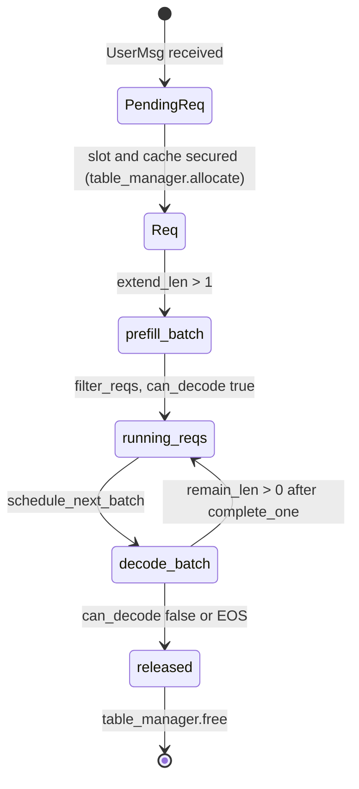

In chapter 1, what reached the scheduler was a 1-D int32 tensor on the CPU. While
that token sequence grows into an answer, the system has to write down somewhere
how far this request has got. That ledger is `Req`.

Calling it a ledger is deliberate, and not because it has many fields. It is
because progress is expressed by **three lengths** whose ordering is pinned down
as an invariant. This chapter is about what those three numbers mean, and who
moves them when.

## Three lengths

`Req` declares only one of them. The other two are built right after
construction.

```python
@dataclass(eq=False)
class Req:
    input_ids: torch.Tensor  # cpu tensor
    table_idx: int
    cached_len: int
    output_len: int
    uid: int
    sampling_params: SamplingParams
    cache_handle: BaseCacheHandle

    def __post_init__(self) -> None:
        assert self.input_ids.is_cpu
        self.device_len = len(self.input_ids)
        self.max_device_len = len(self.input_ids) + self.output_len
        assert 0 <= self.cached_len < self.device_len <= self.max_device_len
```

— [`python/minisgl/core.py:28-42`](https://github.com/sgl-project/mini-sglang/blob/9a91cfafe754aa85daee49998176275667eb58f2/python/minisgl/core.py#L28-L42)

That last line is almost the whole chapter. `cached_len < device_len <=
max_device_len` is not defensive code; it defines what the three values mean. The
gaps between them are "prompt not computed yet" and "room left to generate", and
both gaps have names.

```python
    @property
    def remain_len(self) -> int:
        return self.max_device_len - self.device_len

    @property
    def extend_len(self) -> int:
        return self.device_len - self.cached_len
```

— [`python/minisgl/core.py:44-50`](https://github.com/sgl-project/mini-sglang/blob/9a91cfafe754aa85daee49998176275667eb58f2/python/minisgl/core.py#L44-L50)

<!-- visual: req-length-fields supports: [req-length-fields] -->

| Value | Definition | Meaning |
| --- | --- | --- |
| `cached_len` | field | Length of the settled prefix this step's kernel only has to **read** |
| `device_len` | `len(input_ids)` in `__post_init__` | Length of the token sequence the host holds |
| `max_device_len` | `len(input_ids) + output_len` | Length this request will have when fully grown |
| `extend_len` | `device_len - cached_len` | Tokens that must be computed this time |
| `remain_len` | `max_device_len - device_len` | Tokens that may still be produced |

A request with a large `extend_len` is computing its prompt for the first time; a
request whose `extend_len` is 1 only needs the single preceding token computed.
That one value puts prefill and decode inside the same representation. The rules
for choosing what goes into a batch are chapter 3.

The finishing condition comes out of the same arithmetic.

```python
    @property
    def can_decode(self) -> bool:
        return self.remain_len > 0
```

— [`python/minisgl/core.py:59-61`](https://github.com/sgl-project/mini-sglang/blob/9a91cfafe754aa85daee49998176275667eb58f2/python/minisgl/core.py#L59-L61)

## Two hands move the ledger

What makes this interesting is that there are **two** update methods, and they are
called from different places.

```python
    def complete_one(self) -> None:
        self.cached_len = self.device_len
        self.device_len += 1

    def append_host(self, next_token: torch.Tensor) -> None:
        self.input_ids = torch.cat([self.input_ids, next_token])
```

— [`python/minisgl/core.py:52-57`](https://github.com/sgl-project/mini-sglang/blob/9a91cfafe754aa85daee49998176275667eb58f2/python/minisgl/core.py#L52-L57)

`complete_one` is progress on the GPU side. It runs right after the model, before
the host even knows which token came out.

```python
        for req in batch.reqs:
            req.complete_one()

        next_tokens_gpu = self.sampler.sample(logits[: batch.size], args).to(torch.int32)
        next_tokens_cpu = next_tokens_gpu.to("cpu", non_blocking=True)
```

— [`python/minisgl/engine/engine.py:199-203`](https://github.com/sgl-project/mini-sglang/blob/9a91cfafe754aa85daee49998176275667eb58f2/python/minisgl/engine/engine.py#L199-L203)

Look at the order: `complete_one()` first, sampling and the copy to CPU after.
What was just computed is settled, so `cached_len` moves up to it, and
`device_len += 1` opens the slot the next step will compute. The token value
itself is not needed for any of that.

The value reaches the host afterwards, and that is when the other hand moves.

```python
        copy_done.synchronize()
        ...
            for i, req in enumerate(batch.reqs):
                if isinstance(req, ChunkedReq):
                    continue
                next_token = next_tokens_cpu[i]
                req.append_host(next_token.unsqueeze(0))
```

— [`python/minisgl/scheduler/scheduler.py:143-151`](https://github.com/sgl-project/mini-sglang/blob/9a91cfafe754aa85daee49998176275667eb58f2/python/minisgl/scheduler/scheduler.py#L143-L151)

`append_host` extends the host-side token sequence by one. In other words, **the
length grows first on the GPU side, and the content is filled in later on the CPU
side.** Because the two updates are separated, the scheduler can assemble the
next batch without waiting for token values. Chapter 6's overlap loop is built on
exactly this gap.

The line that skips `ChunkedReq` is here for the same reason. A request still
working through a split prompt has not produced a token, so there is nothing to
append. Details in chapter 3.

## Slots and the running set

Each request holds one seat number: `table_idx`. What hands those out is very
plain.

```python
class TableManager:
    def __init__(self, max_running_reqs: int, page_table: torch.Tensor) -> None:
        self._max_running_reqs = max_running_reqs
        self._free_slots = list(range(max_running_reqs))
        self.page_table = page_table
        # NOTE: dummy request also use this pool to get the input ids, so we need to
        # make sure the token pool is initialized with valid values (token_id = 0).
        self.token_pool = torch.zeros_like(page_table, dtype=torch.int32)

    @property
    def available_size(self) -> int:
        return len(self._free_slots)

    def allocate(self) -> int:
        return self._free_slots.pop()

    def free(self, slot: int) -> None:
        self._free_slots.append(slot)
```

— [`python/minisgl/scheduler/table.py:4-21`](https://github.com/sgl-project/mini-sglang/blob/9a91cfafe754aa85daee49998176275667eb58f2/python/minisgl/scheduler/table.py#L4-L21)

Pop from one list, push back onto it. `available_size` becomes the answer to
"how many more can we admit at once?" when chapter 3 builds a batch; allocation
happens at [`python/minisgl/scheduler/prefill.py:56`](https://github.com/sgl-project/mini-sglang/blob/9a91cfafe754aa85daee49998176275667eb58f2/python/minisgl/scheduler/prefill.py#L56) and the return at
[`python/minisgl/scheduler/scheduler.py:200-202`](https://github.com/sgl-project/mini-sglang/blob/9a91cfafe754aa85daee49998176275667eb58f2/python/minisgl/scheduler/scheduler.py#L200-L202). The one thing worth remembering
is that returning the slot sits in the same function as releasing the rest of the
request's resources.

The same class also holds `token_pool`, zero-filled because, as the comment says,
even dummy requests read their input ids out of it. Why that pool has to live on
the GPU becomes clear in chapter 6.

The set of in-flight requests is managed separately.

```python
@dataclass
class DecodeManager:
    page_size: int
    running_reqs: Set[Req] = field(default_factory=set)

    def filter_reqs(self, reqs: Iterable[Req]) -> None:
        self.running_reqs = {req for req in self.running_reqs.union(reqs) if req.can_decode}
```

— [`python/minisgl/scheduler/decode.py:9-15`](https://github.com/sgl-project/mini-sglang/blob/9a91cfafe754aa85daee49998176275667eb58f2/python/minisgl/scheduler/decode.py#L9-L15)

One line does the union and the filter at once: add this batch's requests to the
set, and in the same expression drop any whose `can_decode` has become false.
There is exactly one call site, [`python/minisgl/scheduler/scheduler.py:232`](https://github.com/sgl-project/mini-sglang/blob/9a91cfafe754aa85daee49998176275667eb58f2/python/minisgl/scheduler/scheduler.py#L232). So
no path exists in which someone forgets to remove a finished request.

A waiting request is not a `Req` yet. With no slot and no cache handle, it has its
own representation.

```python
@dataclass
class PendingReq:
    uid: int
    input_ids: torch.Tensor
    sampling_params: SamplingParams
    chunked_req: ChunkedReq | None = None
```

— [`python/minisgl/scheduler/utils.py:14-19`](https://github.com/sgl-project/mini-sglang/blob/9a91cfafe754aa85daee49998176275667eb58f2/python/minisgl/scheduler/utils.py#L14-L19)

The moment a `PendingReq` is promoted to a `Req` is the moment resources are
taken. That boundary is chapter 3's subject.

<!-- visual: req-lifecycle supports: [req-lifecycle] -->



## A Batch is filled in two passes

A batch is a ledger too, but it is only half filled when it is created.

```python
@dataclass
class Batch:
    reqs: List[Req]
    phase: Literal["prefill", "decode"]
    # these fields should be set by scheduler
    input_ids: torch.Tensor = field(init=False)
    positions: torch.Tensor = field(init=False)
    out_loc: torch.Tensor = field(init=False)
    padded_reqs: List[Req] = field(init=False)
    # this field should be set by attention backend
    attn_metadata: BaseAttnMetadata = field(init=False)
```

— [`python/minisgl/core.py:71-81`](https://github.com/sgl-project/mini-sglang/blob/9a91cfafe754aa85daee49998176275667eb58f2/python/minisgl/core.py#L71-L81)

The five `init=False` fields are not taken by the constructor, and the comments
say who fills them: the scheduler sets `input_ids`, `positions`, `out_loc` and
`padded_reqs`; the attention backend sets `attn_metadata`. So holding a `Batch`
tells you nothing about how far it has been prepared — and that division of
labour foreshadows the structure of the chapters ahead. What `out_loc` is comes in
chapter 4; how `positions` and `attn_metadata` become kernel arguments is chapter
7.

Finally, `Context` carries a comment this series will read twice.

```python
@dataclass
class Context:
    page_size: int
    # NOTE: this table always treat page_size = 1
    page_table: torch.Tensor = field(init=False)
```

— [`python/minisgl/core.py:100-104`](https://github.com/sgl-project/mini-sglang/blob/9a91cfafe754aa85daee49998176275667eb58f2/python/minisgl/core.py#L100-L104)

It holds a page size, yet the table always treats the page size as 1. Why that
choice was made is chapter 4's central question.

## Wrapping up

The progress of one request is expressed by `cached_len`, `device_len` and
`max_device_len`, plus the derived `extend_len` and `remain_len`. GPU-side
progress is advanced by `complete_one` immediately after the model runs; the
host-side token sequence is filled by `append_host` once the copy has completed.
That the two updates are separated holds up several designs in this framework.

The next chapter picks up this ledger and asks what actually goes into the batch:
what gets looked at first when a request with a large `extend_len` and one with
`extend_len` of 1 compete for the same budget, and how a prompt longer than the
budget is split.

## Further reading

- The repository's `docs/structures.md` — one line stating that
  `minisgl.scheduler` runs on each TP worker process and manages its own
  `Engine`. The ledger this chapter read is the state kept inside that worker.
