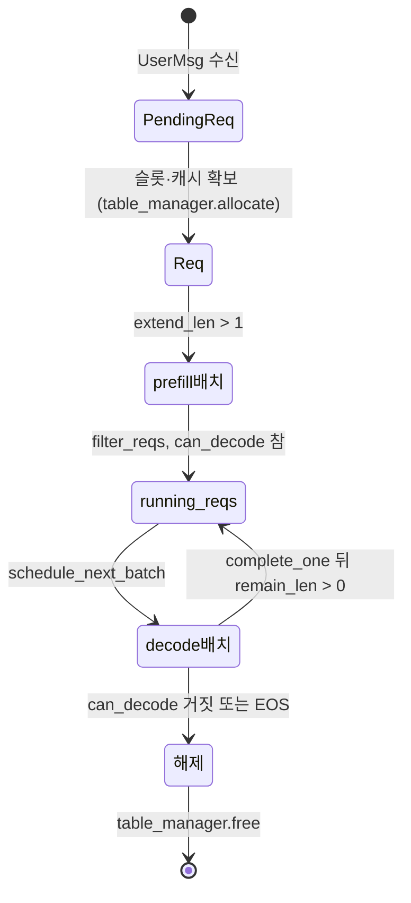

1편에서 스케줄러가 받은 것은 CPU 위의 1차원 int32 텐서였다. 그 토큰열이 답으로
자라는 동안, 시스템은 "이 요청이 어디까지 갔는가"를 어딘가에 적어 두어야 한다.
그 장부가 `Req` 다.

장부라고 부르는 이유가 있다. 필드가 많아서가 아니라, **길이 세 개**로 진행
상태를 표현하고 그 셋의 대소 관계를 불변식으로 못 박아 두기 때문이다. 이 편은
그 세 숫자가 각각 무엇을 가리키는지, 그리고 누가 언제 그것을 움직이는지를 본다.

## 세 개의 길이

`Req` 의 선언에는 길이가 하나만 있다. 나머지 둘은 생성 직후에 만들어진다.

```python
@dataclass(eq=False)
class Req:
    input_ids: torch.Tensor  # cpu tensor
    table_idx: int
    cached_len: int
    output_len: int
    uid: int
    sampling_params: SamplingParams
    cache_handle: BaseCacheHandle

    def __post_init__(self) -> None:
        assert self.input_ids.is_cpu
        self.device_len = len(self.input_ids)
        self.max_device_len = len(self.input_ids) + self.output_len
        assert 0 <= self.cached_len < self.device_len <= self.max_device_len
```

— [`python/minisgl/core.py:28-42`](https://github.com/sgl-project/mini-sglang/blob/9a91cfafe754aa85daee49998176275667eb58f2/python/minisgl/core.py#L28-L42)

마지막 줄이 이 편의 전부라고 해도 된다. `cached_len < device_len <=
max_device_len` 은 단순한 방어 코드가 아니라 세 값의 의미를 정의한다. 셋 사이의
간격이 각각 "아직 계산하지 않은 프롬프트"와 "앞으로 생성할 여지"이고, 그
간격에 이름이 붙어 있다.

```python
    @property
    def remain_len(self) -> int:
        return self.max_device_len - self.device_len

    @property
    def extend_len(self) -> int:
        return self.device_len - self.cached_len
```

— [`python/minisgl/core.py:44-50`](https://github.com/sgl-project/mini-sglang/blob/9a91cfafe754aa85daee49998176275667eb58f2/python/minisgl/core.py#L44-L50)

<!-- visual: req-length-fields supports: [req-length-fields] -->

| 값 | 정의 | 뜻 |
| --- | --- | --- |
| `cached_len` | 필드 | 이번 스텝의 커널이 **읽기만 하면 되는** 확정된 앞부분 길이 |
| `device_len` | `__post_init__` 에서 `len(input_ids)` | 호스트가 들고 있는 토큰열 길이 |
| `max_device_len` | `len(input_ids) + output_len` | 이 요청이 끝까지 자랐을 때의 길이 |
| `extend_len` | `device_len - cached_len` | 이번에 새로 계산해야 할 토큰 수 |
| `remain_len` | `max_device_len - device_len` | 앞으로 더 만들 수 있는 토큰 수 |

`extend_len` 이 큰 요청은 프롬프트를 처음 계산하는 중이고, `extend_len` 이 1 인
요청은 직전 토큰 하나만 계산하면 되는 상태다. 이 한 값으로 prefill 과 decode 가
같은 표현 안에 들어온다. 무엇을 배치에 넣을지 정하는 규칙은 3편에서 본다.

끝나는 조건도 같은 산술에서 나온다.

```python
    @property
    def can_decode(self) -> bool:
        return self.remain_len > 0
```

— [`python/minisgl/core.py:59-61`](https://github.com/sgl-project/mini-sglang/blob/9a91cfafe754aa85daee49998176275667eb58f2/python/minisgl/core.py#L59-L61)

## 장부를 움직이는 두 손

흥미로운 것은 필드를 갱신하는 함수가 **두 개인데 서로 다른 곳에서 호출된다**는
점이다.

```python
    def complete_one(self) -> None:
        self.cached_len = self.device_len
        self.device_len += 1

    def append_host(self, next_token: torch.Tensor) -> None:
        self.input_ids = torch.cat([self.input_ids, next_token])
```

— [`python/minisgl/core.py:52-57`](https://github.com/sgl-project/mini-sglang/blob/9a91cfafe754aa85daee49998176275667eb58f2/python/minisgl/core.py#L52-L57)

`complete_one` 은 GPU 쪽 진도다. 모델을 돌린 직후, 아직 어떤 토큰이 나왔는지
호스트가 알기도 전에 호출된다.

```python
        for req in batch.reqs:
            req.complete_one()

        next_tokens_gpu = self.sampler.sample(logits[: batch.size], args).to(torch.int32)
        next_tokens_cpu = next_tokens_gpu.to("cpu", non_blocking=True)
```

— [`python/minisgl/engine/engine.py:199-203`](https://github.com/sgl-project/mini-sglang/blob/9a91cfafe754aa85daee49998176275667eb58f2/python/minisgl/engine/engine.py#L199-L203)

순서를 보라. `complete_one()` 이 먼저고 샘플링과 CPU 복사가 나중이다. 방금
계산한 부분은 이미 확정됐으니 `cached_len` 을 거기까지 올리고, 다음 스텝이 계산할
자리 하나를 `device_len += 1` 로 미리 연다. 토큰 값 자체는 필요하지 않다.

값이 실제로 호스트에 도착하는 것은 그다음이고, 그때 다른 손이 움직인다.

```python
        copy_done.synchronize()
        ...
            for i, req in enumerate(batch.reqs):
                if isinstance(req, ChunkedReq):
                    continue
                next_token = next_tokens_cpu[i]
                req.append_host(next_token.unsqueeze(0))
```

— [`python/minisgl/scheduler/scheduler.py:143-151`](https://github.com/sgl-project/mini-sglang/blob/9a91cfafe754aa85daee49998176275667eb58f2/python/minisgl/scheduler/scheduler.py#L143-L151)

`append_host` 는 호스트 토큰열을 한 칸 늘린다. 즉 **길이는 GPU 쪽에서 먼저 늘고,
내용은 CPU 쪽에서 나중에 채워진다.** 두 갱신이 갈라져 있기 때문에 스케줄러는
토큰 값을 기다리지 않고 다음 배치를 짤 수 있다. 이 시간차를 본격적으로 활용하는
것이 6편의 overlap 루프다.

`ChunkedReq` 를 건너뛰는 한 줄도 같은 이유로 여기 있다. 프롬프트를 쪼개 계산하는
중인 요청은 아직 토큰을 만들지 않았으므로 호스트에 붙일 것이 없다. 자세한 것은
3편이다.

## 슬롯과 실행 중 집합

요청 하나는 자기 자리 번호를 하나 갖는다. `table_idx` 다. 그 번호를 나눠 주는
쪽은 아주 단순하다.

```python
class TableManager:
    def __init__(self, max_running_reqs: int, page_table: torch.Tensor) -> None:
        self._max_running_reqs = max_running_reqs
        self._free_slots = list(range(max_running_reqs))
        self.page_table = page_table
        # NOTE: dummy request also use this pool to get the input ids, so we need to
        # make sure the token pool is initialized with valid values (token_id = 0).
        self.token_pool = torch.zeros_like(page_table, dtype=torch.int32)

    @property
    def available_size(self) -> int:
        return len(self._free_slots)

    def allocate(self) -> int:
        return self._free_slots.pop()

    def free(self, slot: int) -> None:
        self._free_slots.append(slot)
```

— [`python/minisgl/scheduler/table.py:4-21`](https://github.com/sgl-project/mini-sglang/blob/9a91cfafe754aa85daee49998176275667eb58f2/python/minisgl/scheduler/table.py#L4-L21)

리스트 하나에서 꺼내고 되돌려 놓는 게 전부다. `available_size` 는 3편이 배치를
짤 때 "동시에 몇 개나 더 받을 수 있는가"를 묻는 값이 되고, 할당은
[`python/minisgl/scheduler/prefill.py:56`](https://github.com/sgl-project/mini-sglang/blob/9a91cfafe754aa85daee49998176275667eb58f2/python/minisgl/scheduler/prefill.py#L56), 반납은
[`python/minisgl/scheduler/scheduler.py:200-202`](https://github.com/sgl-project/mini-sglang/blob/9a91cfafe754aa85daee49998176275667eb58f2/python/minisgl/scheduler/scheduler.py#L200-L202) 에서 일어난다. 반납이 자원 해제와
한 함수에 묶여 있다는 점만 기억해 두면 된다.

같은 클래스가 `token_pool` 도 들고 있는데, 주석이 밝히듯 더미 요청까지 여기서
입력 토큰을 읽어 가기 때문에 0 으로 채워 둔다. 이 풀이 왜 GPU 에 있어야 하는지는
6편에서 드러난다.

진행 중인 요청의 집합은 따로 관리된다.

```python
@dataclass
class DecodeManager:
    page_size: int
    running_reqs: Set[Req] = field(default_factory=set)

    def filter_reqs(self, reqs: Iterable[Req]) -> None:
        self.running_reqs = {req for req in self.running_reqs.union(reqs) if req.can_decode}
```

— [`python/minisgl/scheduler/decode.py:9-15`](https://github.com/sgl-project/mini-sglang/blob/9a91cfafe754aa85daee49998176275667eb58f2/python/minisgl/scheduler/decode.py#L9-L15)

`filter_reqs` 한 줄이 합집합과 필터를 동시에 한다. 이번 배치에 있던 요청을 집합에
넣고, 그중 `can_decode` 가 거짓이 된 것을 같은 표현식에서 떨군다. 호출부는
[`python/minisgl/scheduler/scheduler.py:232`](https://github.com/sgl-project/mini-sglang/blob/9a91cfafe754aa85daee49998176275667eb58f2/python/minisgl/scheduler/scheduler.py#L232) 한 곳이다. 그래서 "끝난 요청을
지우는 것을 잊는" 경로가 존재하지 않는다.

대기 중인 요청은 아직 `Req` 가 아니다. 슬롯도 캐시 핸들도 없는 단계라 별도
표현을 쓴다.

```python
@dataclass
class PendingReq:
    uid: int
    input_ids: torch.Tensor
    sampling_params: SamplingParams
    chunked_req: ChunkedReq | None = None
```

— [`python/minisgl/scheduler/utils.py:14-19`](https://github.com/sgl-project/mini-sglang/blob/9a91cfafe754aa85daee49998176275667eb58f2/python/minisgl/scheduler/utils.py#L14-L19)

`PendingReq` 가 `Req` 로 승격되는 순간이 곧 자원이 잡히는 순간이다. 그 경계가
3편의 주제다.

<!-- visual: req-lifecycle supports: [req-lifecycle] -->



## Batch는 두 번에 걸쳐 채워진다

배치도 장부다. 다만 만들어질 때 절반만 채워진다.

```python
@dataclass
class Batch:
    reqs: List[Req]
    phase: Literal["prefill", "decode"]
    # these fields should be set by scheduler
    input_ids: torch.Tensor = field(init=False)
    positions: torch.Tensor = field(init=False)
    out_loc: torch.Tensor = field(init=False)
    padded_reqs: List[Req] = field(init=False)
    # this field should be set by attention backend
    attn_metadata: BaseAttnMetadata = field(init=False)
```

— [`python/minisgl/core.py:71-81`](https://github.com/sgl-project/mini-sglang/blob/9a91cfafe754aa85daee49998176275667eb58f2/python/minisgl/core.py#L71-L81)

`init=False` 가 붙은 다섯 필드는 생성자가 받지 않는다. 주석이 누가 채우는지까지
적어 두었다. 스케줄러가 `input_ids`, `positions`, `out_loc`, `padded_reqs` 를
채우고, 어텐션 백엔드가 `attn_metadata` 를 채운다. 그래서 `Batch` 하나를 손에
들고 있어도 그것이 어느 단계까지 준비됐는지는 타입만 봐서는 알 수 없다 — 이
분업 자체가 뒤 편들의 구조를 예고한다. `out_loc` 이 무엇인지는 4편, `positions`
와 `attn_metadata` 가 커널 인자로 바뀌는 과정은 7편이다.

마지막으로 `Context` 에는 이 시리즈에서 두 번 읽게 될 주석이 하나 있다.

```python
@dataclass
class Context:
    page_size: int
    # NOTE: this table always treat page_size = 1
    page_table: torch.Tensor = field(init=False)
```

— [`python/minisgl/core.py:100-104`](https://github.com/sgl-project/mini-sglang/blob/9a91cfafe754aa85daee49998176275667eb58f2/python/minisgl/core.py#L100-L104)

페이지 크기를 들고 있으면서도 표는 항상 페이지 크기 1 로 다룬다는 말이다. 왜
그런 선택을 했는지가 4편의 핵심 질문이다.

## 정리

요청 하나의 진행 상태는 `cached_len`, `device_len`, `max_device_len` 세 길이와
거기서 파생되는 `extend_len`, `remain_len` 으로 표현된다. GPU 쪽 진도는
`complete_one` 이 모델 실행 직후에 올리고, 호스트 토큰열은 `append_host` 가
복사가 끝난 뒤에 채운다. 두 갱신이 갈라져 있다는 사실이 이 프레임워크의 여러
설계를 떠받친다.

다음 편은 이 장부를 들고 "그래서 이번 배치에 무엇을 넣을 것인가"를 묻는다.
`extend_len` 이 큰 요청과 1 인 요청이 같은 예산을 두고 경쟁할 때 무엇을 먼저
보는지, 예산보다 긴 프롬프트는 어떻게 쪼개지는지를 본다.

## 더 읽을거리

- 저장소의 `docs/structures.md` — `minisgl.scheduler` 가 TP 워커마다 하나씩
  돌면서 자기 `Engine` 을 관리한다고 한 줄로 정리해 둔다. 이 편이 읽은 장부가
  그 워커 안에서 유지되는 상태다.
