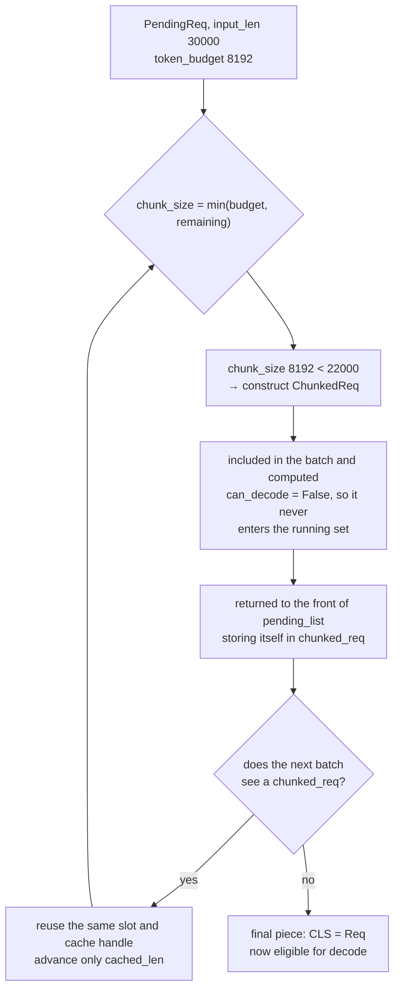

In chapter 2 a request became a ledger expressed by three lengths. Now there is
one question left: with several requests waiting, **what goes into this step, and
how much of it**.

The answer is two budgets and five checks. And in how a prompt larger than the
budget is handled, this repository makes one more tidy choice.

## There are two budgets

Whatever builds the batch constructs a fresh `PrefillAdder` every time. Its first
two arguments are the budgets.

```python
        # estimated offset due to in-flight decode
        adder = PrefillAdder(
            token_budget=prefill_budget,
            reserved_size=self.decode_manager.inflight_tokens,
            cache_manager=self.cache_manager,
            table_manager=self.table_manager,
        )
```

— [`python/minisgl/scheduler/prefill.py:130-136`](https://github.com/sgl-project/mini-sglang/blob/9a91cfafe754aa85daee49998176275667eb58f2/python/minisgl/scheduler/prefill.py#L130-L136)

`token_budget` caps **how many tokens this batch will compute**. It comes from
`max_extend_tokens`, which defaults to 8192
([`python/minisgl/scheduler/config.py:16`](https://github.com/sgl-project/mini-sglang/blob/9a91cfafe754aa85daee49998176275667eb58f2/python/minisgl/scheduler/config.py#L16),
[`python/minisgl/scheduler/scheduler.py:72`](https://github.com/sgl-project/mini-sglang/blob/9a91cfafe754aa85daee49998176275667eb58f2/python/minisgl/scheduler/scheduler.py#L72)).

`reserved_size` is a different kind of number: the space the currently decoding
requests **are going to need**.

```python
    @property
    def inflight_tokens(self) -> int:
        tokens_reserved = (self.page_size - 1) * len(self.running_reqs)  # 1 page reserved
        return sum(req.remain_len for req in self.running_reqs) + tokens_reserved
```

— [`python/minisgl/scheduler/decode.py:27-30`](https://github.com/sgl-project/mini-sglang/blob/9a91cfafe754aa85daee49998176275667eb58f2/python/minisgl/scheduler/decode.py#L27-L30)

It is the sum of `remain_len` over in-flight requests. Admit a new request
without subtracting this, and a request that is already halfway through its answer
finds its future seat taken by a newcomer. The unit being budgeted here is space,
not time.

## Five checks

Whether one request is admitted is decided by `_try_allocate_one`. The checks
stack up in source order, so you can read them straight down.

```python
    def _try_allocate_one(self, req: PendingReq) -> Tuple[BaseCacheHandle, int] | None:
        if self.table_manager.available_size == 0:
            return None

        # TODO: consider host cache match case
        handle = self.cache_manager.match_req(req).cuda_handle
        cached_len = handle.cached_len
        # TODO: better estimate policy
        extend_len = req.input_len - cached_len
        estimated_len = extend_len + req.output_len

        if estimated_len + self.reserved_size > self.cache_manager.available_size:
            return None
        self.cache_manager.lock(handle)
        if estimated_len + self.reserved_size > self.cache_manager.available_size:
            return self.cache_manager.unlock(handle)

        table_idx = self.table_manager.allocate()
```

— [`python/minisgl/scheduler/prefill.py:39-56`](https://github.com/sgl-project/mini-sglang/blob/9a91cfafe754aa85daee49998176275667eb58f2/python/minisgl/scheduler/prefill.py#L39-L56)

<!-- visual: prefill-budget-checks supports: [prefill-budget-checks] -->

| Order | Check | On failure |
| --- | --- | --- |
| 1 | Is a slot free (`available_size == 0`)? | `None`; this request cannot be admitted |
| 2 | Match the prefix to obtain `cached_len` | — (not a failure; this step shrinks the cost) |
| 3 | Is `extend_len + output_len + reserved_size` larger than the cache's free space? | `None` |
| 4 | `lock` the prefix | — |
| 5 | **Re-check condition 3 after locking** | `unlock` and `None` |

Steps 4 and 5 are the heart of this function. Why evaluate the same inequality
twice? Because `lock` changes `available_size`. Locking a prefix means those pages
are no longer space that may be evicted, so the free space shrinks by that much.
A request admitted on the pre-lock arithmetic can therefore be short of space once
the lock is taken. So the condition is evaluated again right after locking, and
reverted if it no longer holds. The relationship between locking and free space is
chapter 5's subject.

`estimated_len` being `extend_len + output_len` is worth noticing too: it reserves
room not only for the tokens to be computed now but for **all the tokens still to
be generated**. As the `TODO: better estimate policy` comment admits, the estimate
is neither optimistic nor sophisticated — but it is conservative, in that it rules
out the worst case first.

Once the request is admitted, the matched prefix is moved to the GPU.

```python
        if cached_len > 0:  # NOTE: set the cached part
            device_ids = self.table_manager.token_pool[table_idx][:cached_len]
            page_entry = self.table_manager.page_table[table_idx][:cached_len]
            device_ids.copy_(req.input_ids[:cached_len].pin_memory(), non_blocking=True)
            page_entry.copy_(handle.get_matched_indices())
```

— [`python/minisgl/scheduler/prefill.py:57-61`](https://github.com/sgl-project/mini-sglang/blob/9a91cfafe754aa85daee49998176275667eb58f2/python/minisgl/scheduler/prefill.py#L57-L61)

This is the first place values land in the rows of `token_pool` and `page_table`
that chapter 2 introduced. What exactly gets written into `page_table` is chapter
4's subject.

## A long prompt changes class

What happens when the budget is 8192 and the prompt is 30000 tokens? Here is the
choice.

```python
        remain_len = pending_req.input_len - cached_len
        chunk_size = min(self.token_budget, remain_len)
        is_chunked = chunk_size < remain_len
        CLS = ChunkedReq if is_chunked else Req
        self.token_budget -= chunk_size
        self.reserved_size += remain_len + pending_req.output_len
```

— [`python/minisgl/scheduler/prefill.py:72-77`](https://github.com/sgl-project/mini-sglang/blob/9a91cfafe754aa85daee49998176275667eb58f2/python/minisgl/scheduler/prefill.py#L72-L77)

No separate queue, no status flag. **It constructs a different class.** If the
whole thing fits this time it is a `Req`; if it must be cut it is a `ChunkedReq`.
And the definition of `ChunkedReq` is three lines.

```python
class ChunkedReq(Req):
    def append_host(self, next_token: torch.Tensor) -> None:
        raise NotImplementedError("ChunkedReq should not be sampled")

    @property
    def can_decode(self) -> bool:
        return False  # avoid being added to decode manager
```

— [`python/minisgl/scheduler/prefill.py:23-29`](https://github.com/sgl-project/mini-sglang/blob/9a91cfafe754aa85daee49998176275667eb58f2/python/minisgl/scheduler/prefill.py#L23-L29)

Because `can_decode` is always false it fails the filter in `filter_reqs` from
chapter 2 and never enters the running set. Nothing special was added to handle
it; **the existing filter does the work**, because only the property changed. The
exception in `append_host` has the same spirit: appending to a request that has
not produced a token would be a bug, so rather than pass silently it blows up.

A split request is continued in the next batch.

```python
        if chunked_req := pending_req.chunked_req:
            return self._add_one_req(
                pending_req=pending_req,
                cache_handle=chunked_req.cache_handle,
                table_idx=chunked_req.table_idx,
                cached_len=chunked_req.cached_len,
            )
```

— [`python/minisgl/scheduler/prefill.py:96-102`](https://github.com/sgl-project/mini-sglang/blob/9a91cfafe754aa85daee49998176275667eb58f2/python/minisgl/scheduler/prefill.py#L96-L102)

It reuses the cache handle and slot it already holds and only advances
`cached_len` to where the last pass stopped. Since no resource is acquired again,
it cannot be pushed out midway.

<!-- visual: chunked-req-split supports: [chunked-req-split] -->



The order it is returned in follows a rule too.

```python
        self.pending_list = chunked_list + self.pending_list[len(reqs) :]
```

— [`python/minisgl/scheduler/prefill.py:150`](https://github.com/sgl-project/mini-sglang/blob/9a91cfafe754aa85daee49998176275667eb58f2/python/minisgl/scheduler/prefill.py#L150)

The split requests go to the **front**, ahead of anything that was waiting behind
them. Holding a half-computed prompt keeps its space tied up, so finishing it
quickly turns that space over sooner.

## One blocked request blocks the rest

The loop that fills the batch stops at the first failure.

```python
        for pending_req in self.pending_list:
            if req := adder.try_add_one(pending_req):
                ...
            else:
                break  # We cannot add more requests
```

— [`python/minisgl/scheduler/prefill.py:139-147`](https://github.com/sgl-project/mini-sglang/blob/9a91cfafe754aa85daee49998176275667eb58f2/python/minisgl/scheduler/prefill.py#L139-L147)

`break`, not `continue`. If the request at the head cannot get its resources, the
smaller ones behind it are not even tried. Queue order is preserved exactly, at
the cost of everyone waiting behind one large request.

The rule for choosing the kind of batch has the same character.

```python
    def _schedule_next_batch(self) -> ForwardInput | None:
        # TODO: support other policies: e.g. DECODE first
        batch = (
            self.prefill_manager.schedule_next_batch(self.prefill_budget)
            or self.decode_manager.schedule_next_batch()
        )
```

— [`python/minisgl/scheduler/scheduler.py:219-224`](https://github.com/sgl-project/mini-sglang/blob/9a91cfafe754aa85daee49998176275667eb58f2/python/minisgl/scheduler/scheduler.py#L219-L224)

Prefill comes first. If a prefill batch can be assembled, decode sits this step
out. The `TODO` leaves room for other policies, but the code as it stands has
exactly one.

## Wrapping up

What goes into a batch is decided by two numbers — the token budget and the
reserved space — and five checks over slots and cache headroom. Evaluating the
same condition either side of the lock is the heart of that function, and a prompt
over budget is expressed as a `ChunkedReq` subclass that the existing filters
exclude on their own.

The next chapter picks up what was deferred here: what that "space" actually is,
and why what gets written into `page_table` is not a page number.

## Further reading

- [Sarathi-Serve](https://arxiv.org/abs/2403.02310) — the paper that introduced
  chunked prefill. The repository's `docs/features.md` links it as the source of
  the technique, notes it is on by default, and points at `--max-prefill-length`
  for the chunk size.
