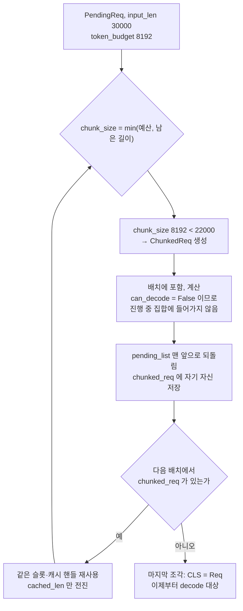

2편에서 요청 하나는 세 길이로 표현되는 장부가 됐다. 이제 질문은 하나다. 대기 중인
요청이 여럿일 때, 이번 스텝에 **무엇을 얼마나** 넣을 것인가.

답은 예산 두 개와 조건 다섯 개다. 그리고 예산을 넘는 프롬프트를 어떻게 처리하는지에
이 저장소의 깔끔한 선택이 하나 더 있다.

## 예산은 둘이다

배치를 짜는 쪽은 매번 `PrefillAdder` 를 새로 만든다. 생성 인자 두 개가 곧 예산이다.

```python
        # estimated offset due to in-flight decode
        adder = PrefillAdder(
            token_budget=prefill_budget,
            reserved_size=self.decode_manager.inflight_tokens,
            cache_manager=self.cache_manager,
            table_manager=self.table_manager,
        )
```

— [`python/minisgl/scheduler/prefill.py:130-136`](https://github.com/sgl-project/mini-sglang/blob/9a91cfafe754aa85daee49998176275667eb58f2/python/minisgl/scheduler/prefill.py#L130-L136)

`token_budget` 은 **이번 배치에서 계산할 토큰 수**의 상한이다. 값은
`max_extend_tokens` 에서 오고 기본값은 8192 다
([`python/minisgl/scheduler/config.py:16`](https://github.com/sgl-project/mini-sglang/blob/9a91cfafe754aa85daee49998176275667eb58f2/python/minisgl/scheduler/config.py#L16), [`python/minisgl/scheduler/scheduler.py:72`](https://github.com/sgl-project/mini-sglang/blob/9a91cfafe754aa85daee49998176275667eb58f2/python/minisgl/scheduler/scheduler.py#L72)).

`reserved_size` 는 성격이 다르다. 지금 돌고 있는 decode 요청들이 **앞으로 쓸**
공간이다.

```python
    @property
    def inflight_tokens(self) -> int:
        tokens_reserved = (self.page_size - 1) * len(self.running_reqs)  # 1 page reserved
        return sum(req.remain_len for req in self.running_reqs) + tokens_reserved
```

— [`python/minisgl/scheduler/decode.py:27-30`](https://github.com/sgl-project/mini-sglang/blob/9a91cfafe754aa85daee49998176275667eb58f2/python/minisgl/scheduler/decode.py#L27-L30)

진행 중인 요청들의 `remain_len` 합이다. 새 요청을 받을 때 이 값을 빼고 계산하지
않으면, 이미 절반쯤 답을 만든 요청이 나중에 쓸 자리를 신입이 먹어 버린다. 계산의
단위는 시간이 아니라 공간이다.

## 조건 다섯 개

요청 하나를 받아들일지는 `_try_allocate_one` 이 정한다. 조건이 코드 순서대로
쌓여 있어서 그대로 읽으면 된다.

```python
    def _try_allocate_one(self, req: PendingReq) -> Tuple[BaseCacheHandle, int] | None:
        if self.table_manager.available_size == 0:
            return None

        # TODO: consider host cache match case
        handle = self.cache_manager.match_req(req).cuda_handle
        cached_len = handle.cached_len
        # TODO: better estimate policy
        extend_len = req.input_len - cached_len
        estimated_len = extend_len + req.output_len

        if estimated_len + self.reserved_size > self.cache_manager.available_size:
            return None
        self.cache_manager.lock(handle)
        if estimated_len + self.reserved_size > self.cache_manager.available_size:
            return self.cache_manager.unlock(handle)

        table_idx = self.table_manager.allocate()
```

— [`python/minisgl/scheduler/prefill.py:39-56`](https://github.com/sgl-project/mini-sglang/blob/9a91cfafe754aa85daee49998176275667eb58f2/python/minisgl/scheduler/prefill.py#L39-L56)

<!-- visual: prefill-budget-checks supports: [prefill-budget-checks] -->

| 순서 | 확인 | 실패하면 |
| --- | --- | --- |
| 1 | 빈 슬롯이 있는가 (`available_size == 0`) | `None`, 이 요청은 못 받는다 |
| 2 | 접두사 일치로 `cached_len` 을 구한다 | — (실패가 아니라 값을 줄이는 단계) |
| 3 | `extend_len + output_len + reserved_size` 가 캐시 여유보다 큰가 | `None` |
| 4 | 접두사를 `lock` 한다 | — |
| 5 | **lock 한 뒤 3번 조건을 다시 확인한다** | `unlock` 하고 `None` |

4번과 5번이 이 함수의 핵심이다. 같은 부등식을 왜 두 번 보는가? `lock` 이
`available_size` 를 바꾸기 때문이다. 접두사를 잠그면 그 페이지들은 더 이상 버릴 수
있는 공간이 아니게 되고, 여유 공간이 그만큼 줄어든다. 잠그기 전의 계산으로
받아들였다가 잠근 뒤에 공간이 모자라는 상황이 가능하다는 뜻이다. 그래서 잠근
직후 같은 조건을 다시 보고, 어긋나면 되돌린다. 잠금과 여유 공간의 관계는 5편에서
자세히 본다.

`estimated_len` 이 `extend_len + output_len` 이라는 점도 눈여겨볼 만하다. 지금
계산할 토큰뿐 아니라 **앞으로 생성할 토큰까지 미리 자리를 본다**. 주석이
`TODO: better estimate policy` 라고 적어 둔 대로 낙관적이지도 정교하지도 않은
추정이지만, 최악의 경우를 먼저 막는다는 점에서 보수적이다.

받아들이기로 하면 접두사에 해당하는 부분을 GPU 로 옮긴다.

```python
        if cached_len > 0:  # NOTE: set the cached part
            device_ids = self.table_manager.token_pool[table_idx][:cached_len]
            page_entry = self.table_manager.page_table[table_idx][:cached_len]
            device_ids.copy_(req.input_ids[:cached_len].pin_memory(), non_blocking=True)
            page_entry.copy_(handle.get_matched_indices())
```

— [`python/minisgl/scheduler/prefill.py:57-61`](https://github.com/sgl-project/mini-sglang/blob/9a91cfafe754aa85daee49998176275667eb58f2/python/minisgl/scheduler/prefill.py#L57-L61)

2편에서 본 `token_pool` 과 `page_table` 의 해당 줄에 값이 채워지는 첫 지점이다.
`page_table` 에 무엇이 적히는지는 4편의 주제다.

## 긴 프롬프트는 클래스가 바뀐다

예산이 8192 인데 프롬프트가 30000 토큰이면 어떻게 하는가. 여기서 이 저장소의
선택이 나온다.

```python
        remain_len = pending_req.input_len - cached_len
        chunk_size = min(self.token_budget, remain_len)
        is_chunked = chunk_size < remain_len
        CLS = ChunkedReq if is_chunked else Req
        self.token_budget -= chunk_size
        self.reserved_size += remain_len + pending_req.output_len
```

— [`python/minisgl/scheduler/prefill.py:72-77`](https://github.com/sgl-project/mini-sglang/blob/9a91cfafe754aa85daee49998176275667eb58f2/python/minisgl/scheduler/prefill.py#L72-L77)

별도의 큐도, 상태 플래그도 없다. **클래스를 바꿔서 만든다.** 이번에 다 계산할 수
있으면 `Req`, 잘라야 하면 `ChunkedReq` 다. 그리고 `ChunkedReq` 의 정의는 세 줄이
전부다.

```python
class ChunkedReq(Req):
    def append_host(self, next_token: torch.Tensor) -> None:
        raise NotImplementedError("ChunkedReq should not be sampled")

    @property
    def can_decode(self) -> bool:
        return False  # avoid being added to decode manager
```

— [`python/minisgl/scheduler/prefill.py:23-29`](https://github.com/sgl-project/mini-sglang/blob/9a91cfafe754aa85daee49998176275667eb58f2/python/minisgl/scheduler/prefill.py#L23-L29)

`can_decode` 가 항상 거짓이므로 2편에서 본 `filter_reqs` 의 필터를 통과하지 못하고,
진행 중 집합에 들어가지 않는다. 별도 처리를 넣은 게 아니라 **기존 필터가 알아서
걸러 내도록** 성질만 바꿨다. `append_host` 가 예외를 던지는 것도 같은 맥락이다.
아직 토큰을 만들지 않았는데 붙이려 한다면 그건 버그이니, 조용히 넘어가는 대신
터뜨린다.

쪼개진 요청은 다음 배치에서 이어 붙인다.

```python
        if chunked_req := pending_req.chunked_req:
            return self._add_one_req(
                pending_req=pending_req,
                cache_handle=chunked_req.cache_handle,
                table_idx=chunked_req.table_idx,
                cached_len=chunked_req.cached_len,
            )
```

— [`python/minisgl/scheduler/prefill.py:96-102`](https://github.com/sgl-project/mini-sglang/blob/9a91cfafe754aa85daee49998176275667eb58f2/python/minisgl/scheduler/prefill.py#L96-L102)

이미 잡아 둔 캐시 핸들과 슬롯을 그대로 재사용하고, `cached_len` 만 지난번까지
계산한 지점으로 넘긴다. 자원을 다시 확보하지 않으므로 중간에 밀려날 일이 없다.

<!-- visual: chunked-req-split supports: [chunked-req-split] -->



되돌리는 순서에도 규칙이 있다.

```python
        self.pending_list = chunked_list + self.pending_list[len(reqs) :]
```

— [`python/minisgl/scheduler/prefill.py:150`](https://github.com/sgl-project/mini-sglang/blob/9a91cfafe754aa85daee49998176275667eb58f2/python/minisgl/scheduler/prefill.py#L150)

쪼개진 요청이 **맨 앞**에 온다. 뒤에 기다리던 요청보다 먼저 이어 붙인다는 뜻이다.
반쯤 계산해 둔 프롬프트를 오래 붙잡고 있으면 그 공간이 계속 묶여 있으므로, 빨리
끝내는 편이 공간 회전에 유리하다.

## 한 요청이 막히면 뒤도 막힌다

배치를 채우는 루프는 실패를 만나면 멈춘다.

```python
        for pending_req in self.pending_list:
            if req := adder.try_add_one(pending_req):
                ...
            else:
                break  # We cannot add more requests
```

— [`python/minisgl/scheduler/prefill.py:139-147`](https://github.com/sgl-project/mini-sglang/blob/9a91cfafe754aa85daee49998176275667eb58f2/python/minisgl/scheduler/prefill.py#L139-L147)

`continue` 가 아니라 `break` 다. 앞의 요청이 자리를 못 잡으면 뒤의 작은 요청도
시도하지 않는다. 대기열 순서를 그대로 지키는 대신, 큰 요청 하나가 앞에 서 있으면
뒤가 함께 기다린다.

배치 종류를 고르는 규칙도 같은 성격이다.

```python
    def _schedule_next_batch(self) -> ForwardInput | None:
        # TODO: support other policies: e.g. DECODE first
        batch = (
            self.prefill_manager.schedule_next_batch(self.prefill_budget)
            or self.decode_manager.schedule_next_batch()
        )
```

— [`python/minisgl/scheduler/scheduler.py:219-224`](https://github.com/sgl-project/mini-sglang/blob/9a91cfafe754aa85daee49998176275667eb58f2/python/minisgl/scheduler/scheduler.py#L219-L224)

prefill 이 먼저다. 짤 수 있는 prefill 배치가 있으면 decode 는 이번 스텝을 건너뛴다.
`TODO` 주석이 다른 정책의 여지를 남겨 두었지만, 현재 코드에는 선택지가 하나뿐이다.

## 정리

이번 배치에 무엇을 넣을지는 토큰 예산과 예약 공간 두 값, 그리고 슬롯·캐시 여유를
보는 다섯 단계 조건이 정한다. 잠금 전후로 같은 조건을 두 번 보는 것이 이 함수의
핵심이고, 예산을 넘는 프롬프트는 `ChunkedReq` 라는 서브클래스로 표현돼 기존 필터에
자연스럽게 걸러진다.

다음 편은 여기서 미뤄 둔 것을 받는다. 자리를 확보한다고 했을 때 그 "자리"가
정확히 무엇인지, `page_table` 에 적히는 값이 왜 페이지 번호가 아닌지를 본다.

## 더 읽을거리

- [Sarathi-Serve](https://arxiv.org/abs/2403.02310) — chunked prefill 을 제안한
  논문. 저장소의 `docs/features.md` 가 이 기법의 출처로 링크하고, 기본으로
  켜져 있으며 `--max-prefill-length` 로 조절한다고 밝힌다.
