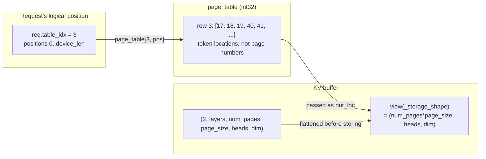

In chapter 3 a request "secured its space". What that space actually is, is this
chapter's subject.

The KV cache is managed in pages. Yet open the `page_table` that each request
owns a row of, and you find not page numbers but **the location of every single
token**. Why write token locations into the table when allocation happens in
pages? The repository answers that in a one-line comment.

## The table holds raw locations

```python
        # ======================= Page table initialization ========================
        # NOTE: 1. aligned to 128 bytes; 2. store raw locations instead of pages
        self.max_seq_len = min(config.max_seq_len, num_tokens)
        aligned_max_seq_len = _align_up_32(self.max_seq_len)
        self.ctx.page_table = self.page_table = torch.zeros(  # + 1 for dummy request
            (config.max_running_req + 1, aligned_max_seq_len),
            dtype=torch.int32,
            device=self.device,
        )
```

— [`python/minisgl/engine/engine.py:65-73`](https://github.com/sgl-project/mini-sglang/blob/9a91cfafe754aa85daee49998176275667eb58f2/python/minisgl/engine/engine.py#L65-L73)

`store raw locations instead of pages`. The table is (concurrent requests + 1) ×
(aligned maximum length), and reading `page_table[table_idx][position]` gives you
directly the row where that token's KV lives. There is no conversion step.

The reason becomes clear once you look at what consumes the value.

## The KV buffer has six axes, and three when written

The buffer itself keeps the page structure.

```python
        self._kv_buffer = torch.empty(
            (2, num_layers, num_pages, page_size, local_kv_heads, head_dim),
            device=device,
            dtype=dtype,
        )
        self._num_layers = num_layers
        self._k_buffer = self._kv_buffer[0]
        self._v_buffer = self._kv_buffer[1]
        self._device = device
        self._storage_shape = (num_pages * page_size, local_kv_heads, head_dim)
```

— [`python/minisgl/kvcache/mha_pool.py:28-37`](https://github.com/sgl-project/mini-sglang/blob/9a91cfafe754aa85daee49998176275667eb58f2/python/minisgl/kvcache/mha_pool.py#L28-L37)

<!-- visual: kv-buffer-shape supports: [kv-buffer-shape] -->

| Axis | Size | Meaning |
| --- | --- | --- |
| 0 | 2 | Key and value; `_k_buffer` and `_v_buffer` are index 0 and 1 |
| 1 | `num_layers` | Layer. Storing happens one layer at a time |
| 2 | `num_pages` | Page number |
| 3 | `page_size` | Token offset within the page |
| 4 | `local_kv_heads` | KV heads this rank owns, divided by the TP size |
| 5 | `head_dim` | Dimension of one head |

Look at `_storage_shape` on the last line: axes 2 and 3 have been multiplied
together into one. That is the shape used when writing.

```python
        store_cache(
            k_cache=self._k_buffer[layer_id].view(self._storage_shape),
            v_cache=self._v_buffer[layer_id].view(self._storage_shape),
            indices=out_loc,
            k=k,
            v=v,
        )
```

— [`python/minisgl/kvcache/mha_pool.py:50-56`](https://github.com/sgl-project/mini-sglang/blob/9a91cfafe754aa85daee49998176275667eb58f2/python/minisgl/kvcache/mha_pool.py#L50-L56)

It flattens with `view` right before handing off to the kernel. What the kernel
sees is `(total tokens, heads, head dim)`, and the value that indexes its first
axis is `out_loc`.

```python
    num_tokens = k_cache.shape[0]
    k_cache = k_cache.view(num_tokens, -1)
    v_cache = v_cache.view(num_tokens, -1)
    element_size = k_cache.shape[1] * k_cache.element_size()
```

— [`python/minisgl/kernel/store.py:37-40`](https://github.com/sgl-project/mini-sglang/blob/9a91cfafe754aa85daee49998176275667eb58f2/python/minisgl/kernel/store.py#L37-L40)

The kernel side flattens once more, ending at a copy shaped `(tokens, bytes per
token)`. Hand it page numbers and it has to compute `number * page_size + offset`
every time. Writing token locations into the table up front removes that
multiplication. **The table's format is shaped by how the kernel indexes.**

## Allocate in pages, record in tokens

So how does the allocation side move between the two units? It starts by holding
the free list in token locations already.

```python
        self.free_slots = torch.arange(num_pages, dtype=torch.int32, device=device) * page_size
```

— [`python/minisgl/scheduler/cache.py:20`](https://github.com/sgl-project/mini-sglang/blob/9a91cfafe754aa85daee49998176275667eb58f2/python/minisgl/scheduler/cache.py#L20)

`arange(num_pages) * page_size` — the **first token location** of each page. Not
0, 1, 2 but 0, page_size, 2 × page_size. Allocation requests are counted in pages
and expanded into token locations on the way out.

```python
    def _page_to_token(self, pages: torch.Tensor) -> torch.Tensor:
        if self.page_size == 1:
            return pages
        # [X * page_size] -> [X * page_size, ..., X * page_size + page_size - 1]
        offsets = torch.arange(self.page_size, device=self.device, dtype=torch.int32)
        return (pages.unsqueeze(1) + offsets).flatten()
```

— [`python/minisgl/scheduler/cache.py:119-124`](https://github.com/sgl-project/mini-sglang/blob/9a91cfafe754aa85daee49998176275667eb58f2/python/minisgl/scheduler/cache.py#L119-L124)

With `page_size` of 1 the conversion is the identity. The `Context` comment from
chapter 2 ([`python/minisgl/core.py:100-104`](https://github.com/sgl-project/mini-sglang/blob/9a91cfafe754aa85daee49998176275667eb58f2/python/minisgl/core.py#L100-L104), "this table always treat page_size =
1") earns its meaning here: the table is always in token units, and the page size
is only the unit of allocation.

How many pages are needed is counted as the difference between two page
boundaries.

```python
    def allocate_paged(self, reqs: List[Req]) -> None:
        needed_pages = 0
        allocation_info: List[Tuple[int, int, int]] = []
        for req in reqs:
            first_page = div_ceil(req.cached_len, self.page_size)
            last_page = div_ceil(req.device_len, self.page_size)
            if last_page > first_page:
                needed_pages += last_page - first_page
                allocation_info.append((req.table_idx, first_page, last_page))
        if needed_pages > 0:
            allocated = self._page_to_token(self._allocate(needed_pages))
            _write_page_table(self.page_table, allocated, allocation_info, self.page_size)
```

— [`python/minisgl/scheduler/cache.py:42-53`](https://github.com/sgl-project/mini-sglang/blob/9a91cfafe754aa85daee49998176275667eb58f2/python/minisgl/scheduler/cache.py#L42-L53)

Chapter 2's two lengths are used directly. Space already exists up to
`cached_len`, so growing to `device_len` only requires the pages in between. When
a request grows within one page, `last_page == first_page` and nothing is
allocated.

Recording it is a single scattered write.

```python
    offset = 0
    for table_idx, first_page, last_page in allocation_info:
        first_pos, last_pos = first_page * page_size, last_page * page_size
        length = last_pos - first_pos
        table_idx_host[offset : offset + length].fill_(table_idx)
        torch.arange(first_pos, last_pos, out=positions_host[offset : offset + length])
        offset += length
    assert offset == needed_tokens, "Mismatch in allocated tokens and filled tokens."
    table_idxs = table_idx_host.to(page_table.device, non_blocking=True)
    offsets = positions_host.to(page_table.device, non_blocking=True)
    page_table[table_idxs, offsets] = allocated
```

— [`python/minisgl/scheduler/cache.py:136-146`](https://github.com/sgl-project/mini-sglang/blob/9a91cfafe754aa85daee49998176275667eb58f2/python/minisgl/scheduler/cache.py#L136-L146)

Which row (`table_idx`) and which column (`positions`) to write is built on the
host, moved to the GPU, and the final line fills all of it at once. Nothing is
written per request.

<!-- visual: page-table-layout supports: [page-table-layout] -->



## Where the dummy request points

The table has one extra row — the `+ 1` in `max_running_req + 1`.

```python
        self.page_table[self.dummy_req.table_idx].fill_(num_tokens)  # point to dummy page
```

— [`python/minisgl/engine/engine.py:98`](https://github.com/sgl-project/mini-sglang/blob/9a91cfafe754aa85daee49998176275667eb58f2/python/minisgl/engine/engine.py#L98)

What `num_tokens` is, and why that location is writable, is in the
initialization.

```python
        self.num_pages = self._determine_num_pages(init_free_memory, config)
        num_tokens = self.num_pages * config.page_size
        ...
            num_pages=self.num_pages + 1,  # +1 for dummy page
```

— [`python/minisgl/engine/engine.py:55-59`](https://github.com/sgl-project/mini-sglang/blob/9a91cfafe754aa85daee49998176275667eb58f2/python/minisgl/engine/engine.py#L55-L59)

`num_tokens` is **where the managed pages end**, and the KV pool is allocated with
one page beyond that. So the dummy row points not outside the buffer but at real
memory — memory the cache manager simply never hands out. A dummy request mixed
into a batch can write its KV there without touching any request's data. Why that
dummy row is needed at all becomes clear in chapter 7, with CUDA graphs.

## Page alignment is held by a test

In code that moves between token locations and pages, the invariant that breaks
most easily is alignment. If reclaimed space does not start on a page boundary,
the next allocation is skewed. The repository catches that with an assertion.

```python
def _assert_all_page_aligned(tensor: torch.Tensor, page_size: int, label: str = ""):
    """Assert every element in tensor is a multiple of page_size."""
    if len(tensor) == 0:
        return
    misaligned = tensor[tensor % page_size != 0]
```

— [`tests/core/test_cache_allocate.py:36-40`](https://github.com/sgl-project/mini-sglang/blob/9a91cfafe754aa85daee49998176275667eb58f2/tests/core/test_cache_allocate.py#L36-L40)

It checks that both the allocation result and the free list are multiples of the
page size even after an eviction
([`tests/core/test_cache_allocate.py:61-80`](https://github.com/sgl-project/mini-sglang/blob/9a91cfafe754aa85daee49998176275667eb58f2/tests/core/test_cache_allocate.py#L61-L80)). One more path checks the same family
of invariant at runtime.

```python
        cache_pages = self.prefix_cache.size_info.total_size // self.page_size
        if len(self.free_slots) + cache_pages != self.num_pages:
            raise RuntimeError(
```

— [`python/minisgl/scheduler/cache.py:83-85`](https://github.com/sgl-project/mini-sglang/blob/9a91cfafe754aa85daee49998176275667eb58f2/python/minisgl/scheduler/cache.py#L83-L85)

Free pages plus the pages the cache holds must equal the total. A page that goes
missing is caught here.

## Wrapping up

`page_table` holds token locations rather than page numbers, because the KV buffer
is flattened to `(total tokens, heads, dim)` right before storing and the kernel
indexes that first axis. Allocation is counted in pages, `_page_to_token` expands
it into token locations on the way out, and the table is filled by one scattered
write.

The next chapter looks at what happens when these locations are **shared** between
requests. When two requests use the same prefix, no new page is needed — and from
that moment on, something has to count who is still using what.

## Further reading

- The repository's `docs/features.md` — it describes the attention kernels this
  framework keeps open: FlashAttention, FlashInfer and TensorRT-LLM fmha. The
  `out_loc` built in this chapter is an argument to those kernels, and the
  conversion is chapter 7.
