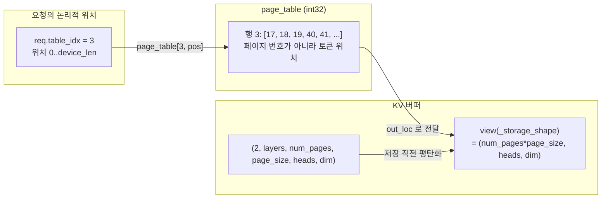

3편에서 요청 하나가 "자리를 잡았다"고 했다. 그 자리의 정체가 이 편의 주제다.

KV cache 는 페이지 단위로 관리된다. 그런데 요청마다 하나씩 있는 `page_table` 을
열어 보면 페이지 번호가 아니라 **토큰 하나하나의 위치**가 적혀 있다. 페이지로
잡으면서 왜 표에는 토큰 위치를 적는가. 저장소가 그 답을 주석 한 줄로 적어 두었다.

## 표에는 raw location이 들어간다

```python
        # ======================= Page table initialization ========================
        # NOTE: 1. aligned to 128 bytes; 2. store raw locations instead of pages
        self.max_seq_len = min(config.max_seq_len, num_tokens)
        aligned_max_seq_len = _align_up_32(self.max_seq_len)
        self.ctx.page_table = self.page_table = torch.zeros(  # + 1 for dummy request
            (config.max_running_req + 1, aligned_max_seq_len),
            dtype=torch.int32,
            device=self.device,
        )
```

— [`python/minisgl/engine/engine.py:65-73`](https://github.com/sgl-project/mini-sglang/blob/9a91cfafe754aa85daee49998176275667eb58f2/python/minisgl/engine/engine.py#L65-L73)

`store raw locations instead of pages`. 표의 모양은 (동시 실행 요청 수 + 1) ×
(정렬된 최대 길이) 이고, `page_table[table_idx][위치]` 를 읽으면 그 토큰의 KV 가
실제로 어느 줄에 있는지가 바로 나온다. 한 단계 변환이 없다.

이유는 이 값을 소비하는 쪽을 보면 분명해진다.

## KV 버퍼는 6축인데, 쓸 때는 3축이다

버퍼 자체는 페이지 구조를 그대로 갖고 있다.

```python
        self._kv_buffer = torch.empty(
            (2, num_layers, num_pages, page_size, local_kv_heads, head_dim),
            device=device,
            dtype=dtype,
        )
        self._num_layers = num_layers
        self._k_buffer = self._kv_buffer[0]
        self._v_buffer = self._kv_buffer[1]
        self._device = device
        self._storage_shape = (num_pages * page_size, local_kv_heads, head_dim)
```

— [`python/minisgl/kvcache/mha_pool.py:28-37`](https://github.com/sgl-project/mini-sglang/blob/9a91cfafe754aa85daee49998176275667eb58f2/python/minisgl/kvcache/mha_pool.py#L28-L37)

<!-- visual: kv-buffer-shape supports: [kv-buffer-shape] -->

| 축 | 크기 | 뜻 |
| --- | --- | --- |
| 0 | 2 | key 와 value. `_k_buffer` 와 `_v_buffer` 가 각각 0 번과 1 번 |
| 1 | `num_layers` | 레이어. 저장은 레이어 하나씩 일어난다 |
| 2 | `num_pages` | 페이지 번호 |
| 3 | `page_size` | 페이지 안에서의 토큰 오프셋 |
| 4 | `local_kv_heads` | 이 rank 가 맡은 KV 헤드 수. TP 크기로 나뉜다 |
| 5 | `head_dim` | 헤드 하나의 차원 |

마지막 줄의 `_storage_shape` 를 보라. 2번 축과 3번 축이 곱해져 하나로 합쳐졌다.
저장할 때 쓰는 모양이다.

```python
        store_cache(
            k_cache=self._k_buffer[layer_id].view(self._storage_shape),
            v_cache=self._v_buffer[layer_id].view(self._storage_shape),
            indices=out_loc,
            k=k,
            v=v,
        )
```

— [`python/minisgl/kvcache/mha_pool.py:50-56`](https://github.com/sgl-project/mini-sglang/blob/9a91cfafe754aa85daee49998176275667eb58f2/python/minisgl/kvcache/mha_pool.py#L50-L56)

커널에 넘기기 직전에 `view` 로 평탄화한다. 커널이 보는 것은
`(전체 토큰 수, 헤드 수, 헤드 차원)` 이고, 그 첫 축에 인덱싱할 값이 `out_loc` 이다.

```python
    num_tokens = k_cache.shape[0]
    k_cache = k_cache.view(num_tokens, -1)
    v_cache = v_cache.view(num_tokens, -1)
    element_size = k_cache.shape[1] * k_cache.element_size()
```

— [`python/minisgl/kernel/store.py:37-40`](https://github.com/sgl-project/mini-sglang/blob/9a91cfafe754aa85daee49998176275667eb58f2/python/minisgl/kernel/store.py#L37-L40)

커널 쪽에서 한 번 더 평탄화해서 결국 `(토큰 수, 한 토큰의 바이트 수)` 짜리 복사가
된다. 여기에 페이지 번호를 주면 커널이 매번 `번호 * page_size + 오프셋` 을
계산해야 한다. 표에 미리 토큰 위치를 적어 두면 그 곱셈이 사라진다. **표의 형식은
커널의 인덱싱 방식에 맞춰져 있다.**

## 할당은 페이지로, 기록은 토큰으로

그러면 할당 쪽은 어떻게 두 단위를 오가는가. 우선 여유 공간 목록부터 토큰 위치로
들고 있다.

```python
        self.free_slots = torch.arange(num_pages, dtype=torch.int32, device=device) * page_size
```

— [`python/minisgl/scheduler/cache.py:20`](https://github.com/sgl-project/mini-sglang/blob/9a91cfafe754aa85daee49998176275667eb58f2/python/minisgl/scheduler/cache.py#L20)

`arange(num_pages) * page_size` 다. 즉 각 페이지의 **첫 토큰 위치**를 담는다.
페이지 번호 0, 1, 2 가 아니라 0, page_size, 2 × page_size 가 들어 있다. 할당 요청은
페이지 단위로 세고, 나갈 때 토큰 위치로 펼친다.

```python
    def _page_to_token(self, pages: torch.Tensor) -> torch.Tensor:
        if self.page_size == 1:
            return pages
        # [X * page_size] -> [X * page_size, ..., X * page_size + page_size - 1]
        offsets = torch.arange(self.page_size, device=self.device, dtype=torch.int32)
        return (pages.unsqueeze(1) + offsets).flatten()
```

— [`python/minisgl/scheduler/cache.py:119-124`](https://github.com/sgl-project/mini-sglang/blob/9a91cfafe754aa85daee49998176275667eb58f2/python/minisgl/scheduler/cache.py#L119-L124)

`page_size` 가 1 이면 변환이 항등이다. 2편에서 본 `Context` 의 주석
([`python/minisgl/core.py:100-104`](https://github.com/sgl-project/mini-sglang/blob/9a91cfafe754aa85daee49998176275667eb58f2/python/minisgl/core.py#L100-L104), "this table always treat page_size = 1") 이
여기서 의미를 얻는다. 표는 언제나 토큰 단위이고, 페이지 크기는 할당의 단위일
뿐이다.

몇 페이지가 필요한지는 두 길이의 페이지 경계 차이로 센다.

```python
    def allocate_paged(self, reqs: List[Req]) -> None:
        needed_pages = 0
        allocation_info: List[Tuple[int, int, int]] = []
        for req in reqs:
            first_page = div_ceil(req.cached_len, self.page_size)
            last_page = div_ceil(req.device_len, self.page_size)
            if last_page > first_page:
                needed_pages += last_page - first_page
                allocation_info.append((req.table_idx, first_page, last_page))
        if needed_pages > 0:
            allocated = self._page_to_token(self._allocate(needed_pages))
            _write_page_table(self.page_table, allocated, allocation_info, self.page_size)
```

— [`python/minisgl/scheduler/cache.py:42-53`](https://github.com/sgl-project/mini-sglang/blob/9a91cfafe754aa85daee49998176275667eb58f2/python/minisgl/scheduler/cache.py#L42-L53)

2편의 두 길이가 그대로 쓰인다. `cached_len` 까지는 이미 자리가 있고,
`device_len` 까지 늘리려면 그 사이의 페이지만 새로 잡으면 된다. 같은 페이지 안에서
자라는 경우 `last_page == first_page` 가 되어 아무것도 할당하지 않는다.

기록은 한 번의 산포 쓰기로 끝낸다.

```python
    offset = 0
    for table_idx, first_page, last_page in allocation_info:
        first_pos, last_pos = first_page * page_size, last_page * page_size
        length = last_pos - first_pos
        table_idx_host[offset : offset + length].fill_(table_idx)
        torch.arange(first_pos, last_pos, out=positions_host[offset : offset + length])
        offset += length
    assert offset == needed_tokens, "Mismatch in allocated tokens and filled tokens."
    table_idxs = table_idx_host.to(page_table.device, non_blocking=True)
    offsets = positions_host.to(page_table.device, non_blocking=True)
    page_table[table_idxs, offsets] = allocated
```

— [`python/minisgl/scheduler/cache.py:136-146`](https://github.com/sgl-project/mini-sglang/blob/9a91cfafe754aa85daee49998176275667eb58f2/python/minisgl/scheduler/cache.py#L136-L146)

어느 행(`table_idx`)의 어느 열(`positions`)에 쓸지를 호스트에서 만들어 GPU 로
옮기고, 마지막 한 줄이 전부를 한꺼번에 채운다. 요청마다 따로 쓰지 않는다.

<!-- visual: page-table-layout supports: [page-table-layout] -->



## 더미 요청이 가리키는 곳

표에는 행이 하나 더 있다. `max_running_req + 1` 의 그 하나다.

```python
        self.page_table[self.dummy_req.table_idx].fill_(num_tokens)  # point to dummy page
```

— [`python/minisgl/engine/engine.py:98`](https://github.com/sgl-project/mini-sglang/blob/9a91cfafe754aa85daee49998176275667eb58f2/python/minisgl/engine/engine.py#L98)

`num_tokens` 가 무엇인지, 그리고 그 자리에 왜 쓸 수 있는지는 초기화 쪽에 있다.

```python
        self.num_pages = self._determine_num_pages(init_free_memory, config)
        num_tokens = self.num_pages * config.page_size
        ...
            num_pages=self.num_pages + 1,  # +1 for dummy page
```

— [`python/minisgl/engine/engine.py:55-59`](https://github.com/sgl-project/mini-sglang/blob/9a91cfafe754aa85daee49998176275667eb58f2/python/minisgl/engine/engine.py#L55-L59)

`num_tokens` 는 **관리 대상 페이지들이 끝나는 지점**이고, KV 풀은 거기에 한 페이지를
더해 잡는다. 그러니 더미 행이 가리키는 곳은 버퍼 바깥이 아니라 실재하는 메모리이고,
다만 캐시 관리자가 절대 나눠 주지 않는 자리다. 더미 요청이 섞여 들어와 그 줄에 KV 를
써도 아무 요청의 데이터를 건드리지 않는다. 이 더미 행이 왜 필요한지는 7편에서 CUDA
graph 를 다룰 때 드러난다.

## 페이지 정렬은 테스트가 지킨다

토큰 위치와 페이지를 오가는 코드에서 가장 쉽게 깨지는 불변식은 정렬이다. 회수된
공간이 페이지 경계에서 시작하지 않으면 다음 할당이 어긋난다. 저장소는 그것을
단언으로 잡는다.

```python
def _assert_all_page_aligned(tensor: torch.Tensor, page_size: int, label: str = ""):
    """Assert every element in tensor is a multiple of page_size."""
    if len(tensor) == 0:
        return
    misaligned = tensor[tensor % page_size != 0]
```

— [`tests/core/test_cache_allocate.py:36-40`](https://github.com/sgl-project/mini-sglang/blob/9a91cfafe754aa85daee49998176275667eb58f2/tests/core/test_cache_allocate.py#L36-L40)

eviction 이 일어난 뒤에도 할당 결과와 여유 목록이 모두 페이지 배수인지를 확인한다
([`tests/core/test_cache_allocate.py:61-80`](https://github.com/sgl-project/mini-sglang/blob/9a91cfafe754aa85daee49998176275667eb58f2/tests/core/test_cache_allocate.py#L61-L80)). 같은 불변식을 실행 중에도 점검하는
경로가 하나 더 있다.

```python
        cache_pages = self.prefix_cache.size_info.total_size // self.page_size
        if len(self.free_slots) + cache_pages != self.num_pages:
            raise RuntimeError(
```

— [`python/minisgl/scheduler/cache.py:83-85`](https://github.com/sgl-project/mini-sglang/blob/9a91cfafe754aa85daee49998176275667eb58f2/python/minisgl/scheduler/cache.py#L83-L85)

여유 페이지와 캐시가 쥔 페이지의 합이 전체와 같아야 한다. 잃어버린 페이지가
생기면 여기서 걸린다.

## 정리

`page_table` 은 페이지 번호가 아니라 토큰 위치를 담는다. KV 버퍼가 저장 직전에
`(전체 토큰, 헤드, 차원)` 으로 평탄화되고 커널이 그 첫 축에 인덱싱하기 때문이다.
할당은 페이지 단위로 세고, 나갈 때 `_page_to_token` 이 토큰 위치로 펼치며, 표는
한 번의 산포 쓰기로 채워진다.

다음 편은 이 자리들이 요청 사이에서 **공유**될 때 무슨 일이 일어나는지를 본다.
같은 접두사를 쓰는 요청이 둘이면 페이지를 새로 잡지 않아도 되고, 그때부터 "누가
아직 쓰고 있는가"를 세야 한다.

## 더 읽을거리

- 저장소의 `docs/features.md` — 이 프레임워크가 어텐션 커널로 FlashAttention,
  FlashInfer, TensorRT-LLM fmha 를 열어 둔다는 설명이 있다. 이 편이 만든
  `out_loc` 이 그 커널들에 들어가는 인자이고, 변환 과정은 7편에서 본다.
