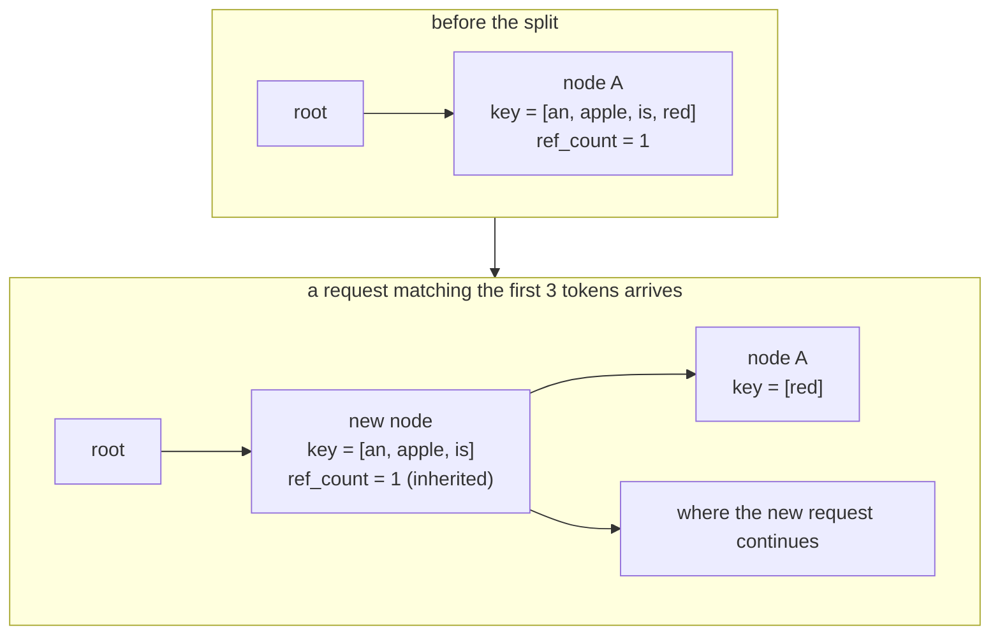

Chapter 4 showed how one request secures its space. But if a hundred requests
arrive with the same system prompt and each repeats the same computation, that
space runs out fast.

So already-computed prefixes get reused. Once you start reusing, two new
questions appear: how do you quickly find **how far two sequences agree**, and how
do you know **what may be thrown away** when space runs short?

## Walk the tree, and split where it diverges

Prefix lookup starts at the root and follows children down.

```python
        while prefix_len < indice_len:
            child_node = node.children.get(self.key_fn(input_ids[prefix_len:]))
            if child_node is None:
                return node, prefix_len
            node = child_node  # walk to child node

            # NOTE: at least 1 page is matched, so match_len >= page_size
            match_len = node.get_match_len(input_ids[prefix_len:])
            match_len = align_down(match_len, self.page_size)
            prefix_len += match_len

            # need to split the node if not fully matched
            if match_len != node.length:
                node = node.split_at(match_len)
                node.timestamp = tic
                return node, prefix_len
```

— [`python/minisgl/kvcache/radix_cache.py:211-226`](https://github.com/sgl-project/mini-sglang/blob/9a91cfafe754aa85daee49998176275667eb58f2/python/minisgl/kvcache/radix_cache.py#L211-L226)

The key that selects a child is the first token. With `page_size` of 1 it is
literally that one token.

```python
def _get_key_fn(page_size: int) -> KEY_FN:
    if page_size == 1:
        return lambda x: x[0].item()
    return lambda x: tuple(x[:page_size].tolist())
```

— [`python/minisgl/kvcache/radix_cache.py:234-237`](https://github.com/sgl-project/mini-sglang/blob/9a91cfafe754aa85daee49998176275667eb58f2/python/minisgl/kvcache/radix_cache.py#L234-L237)

Having found a child, it measures **how far** the node's key and the input agree.
That comparison is not Python.

```python
def fast_compare_key(x: torch.Tensor, y: torch.Tensor) -> int:
    # compare 2 1-D int cpu tensors for equality
    return _load_radix_module().fast_compare_key(x, y)
```

— [`python/minisgl/kernel/radix.py:18-20`](https://github.com/sgl-project/mini-sglang/blob/9a91cfafe754aa85daee49998176275667eb58f2/python/minisgl/kernel/radix.py#L18-L20)

It calls a prebuilt C++ module ([`python/minisgl/kernel/radix.py:13-15`](https://github.com/sgl-project/mini-sglang/blob/9a91cfafe754aa85daee49998176275667eb58f2/python/minisgl/kernel/radix.py#L13-L15)). Prefix
lookup happens per request and prompts are long. Leave this line as a Python loop
and the scheduler's CPU time turns straight into latency — the premise behind
chapter 6's overlap is already at work here.

When agreement stops halfway, the node is split.

```python
    def split_at(self, pos: int) -> RadixTreeNode:
        assert 0 < pos < self.length
        parent = self.parent

        new_node = RadixTreeNode(self.key_fn, self.timestamp)
        new_node.set_key_value(self._key[:pos], self._value[:pos])
        new_node.set_parent(parent)
        new_node.ref_count = self.ref_count

        self.set_key_value(self._key[pos:], self._value[pos:])
        self.set_parent(new_node)

        return new_node
```

— [`python/minisgl/kvcache/radix_cache.py:69-81`](https://github.com/sgl-project/mini-sglang/blob/9a91cfafe754aa85daee49998176275667eb58f2/python/minisgl/kvcache/radix_cache.py#L69-L81)

A new node holding the front part is created and **takes the parent position**,
while the original node keeps only the tail and moves underneath it. The line to
watch is `new_node.ref_count = self.ref_count`. The split-off front is still in
use by whoever was using the original node, so the reference count has to be
inherited. Without that line, a front part still in use would look discardable.

<!-- visual: radix-tree-split supports: [radix-tree-split] -->



## Two sizes

Space that may be thrown away and space that may not are counted separately.

```python
class SizeInfo(NamedTuple):
    evictable_size: int
    protected_size: int

    @property
    def total_size(self) -> int:
        return self.evictable_size + self.protected_size
```

— [`python/minisgl/kvcache/base.py:48-54`](https://github.com/sgl-project/mini-sglang/blob/9a91cfafe754aa85daee49998176275667eb58f2/python/minisgl/kvcache/base.py#L48-L54)

Locking is what moves quantity between the two.

```python
    def lock_handle(self, handle: BaseCacheHandle, unlock: bool = False) -> None:
        assert isinstance(handle, RadixCacheHandle)
        node = handle.node
        if unlock:
            while not node.is_root():
                node.ref_count -= 1
                assert node.ref_count >= 0
                if node.ref_count == 0:
                    self.evictable_size += node.length
                    self.protected_size -= node.length
                node = node.parent
        else:
            while not node.is_root():
                if node.ref_count == 0:
                    self.evictable_size -= node.length
                    self.protected_size += node.length
                node.ref_count += 1
                node = node.parent
```

— [`python/minisgl/kvcache/radix_cache.py:113-130`](https://github.com/sgl-project/mini-sglang/blob/9a91cfafe754aa85daee49998176275667eb58f2/python/minisgl/kvcache/radix_cache.py#L113-L130)

<!-- visual: lock-evict-sizes supports: [lock-evict-sizes] -->

| Operation | ref_count change | evictable | protected | When it moves |
| --- | --- | --- | --- | --- |
| `lock` | 0 → 1 | `- node.length` | `+ node.length` | Only when the first user attaches |
| `lock` | n → n+1 (n ≥ 1) | unchanged | unchanged | Already protected |
| `unlock` | 1 → 0 | `+ node.length` | `- node.length` | Only when the last user leaves |
| `unlock` | n → n-1 (n ≥ 2) | unchanged | unchanged | Someone is still using it |

The sum of the two never changes. Locking neither creates nor destroys space; it
**only changes the classification.** The interface documentation says the same:
"This operation will not modify the cache, but change the size info only."
([`python/minisgl/kvcache/base.py:70-75`](https://github.com/sgl-project/mini-sglang/blob/9a91cfafe754aa85daee49998176275667eb58f2/python/minisgl/kvcache/base.py#L70-L75)).

And locking happens **all the way up to the root**, not on one node. Using a node
means all of its ancestors are in use too. This is the reason behind chapter 3's
"re-check free space after locking": the moment you lock, ancestors move into
protected as well, so `available_size` can drop noticeably.

## Evict leaves first, oldest first

```python
        leave_nodes = self._collect_leave_nodes_for_evict()
        heapq.heapify(leave_nodes)
        evicted_indices: List[torch.Tensor] = []
        evicted_size = 0

        while evicted_size < size:
            ...
            node = heapq.heappop(leave_nodes)
            assert node.ref_count == 0 and node.is_leaf() and not node.is_root()
            evicted_size += node.length
            evicted_indices.append(node.value)
            self.evictable_size -= node.length
            parent = node.parent
            del parent.children[self.key_fn(node._key)]
            # NOTE: root is always protected, so won't be evicted
            if parent.is_leaf() and parent.ref_count == 0:
                heapq.heappush(leave_nodes, parent)
```

— [`python/minisgl/kvcache/radix_cache.py:155-173`](https://github.com/sgl-project/mini-sglang/blob/9a91cfafe754aa85daee49998176275667eb58f2/python/minisgl/kvcache/radix_cache.py#L155-L173)

Three rules. Only **leaves** are evicted (discard an interior node and its
children lose their parent). Only nodes with **zero references**. And the order
out of the heap is by `timestamp`.

```python
    def __lt__(self, other: RadixTreeNode) -> bool:
        return self.timestamp < other.timestamp
```

— [`python/minisgl/kvcache/radix_cache.py:83-84`](https://github.com/sgl-project/mini-sglang/blob/9a91cfafe754aa85daee49998176275667eb58f2/python/minisgl/kvcache/radix_cache.py#L83-L84)

`_tree_walk` refreshes `timestamp` on every node it passes
([`python/minisgl/kvcache/radix_cache.py:228-229`](https://github.com/sgl-project/mini-sglang/blob/9a91cfafe754aa85daee49998176275667eb58f2/python/minisgl/kvcache/radix_cache.py#L228-L229)), so the least recently used leaf
goes first. After a leaf is evicted, if its parent has become a leaf it is pushed
back onto the heap. An entire branch that has fallen out of use is peeled off from
the end inward.

The machinery for special-casing the root is one line.

```python
        self.root_node.ref_count = 1  # root is always protected
```

— [`python/minisgl/kvcache/radix_cache.py:111`](https://github.com/sgl-project/mini-sglang/blob/9a91cfafe754aa85daee49998176275667eb58f2/python/minisgl/kvcache/radix_cache.py#L111)

Instead of a conditional, the root is given a permanent reference. The eviction
loop therefore has no "skip the root" branch in it.

## What insertion gives back

A finished request inserts its prefix into the tree.

```python
    def insert_prefix(self, input_ids: torch.Tensor, indices: torch.Tensor) -> InsertResult:
        insert_len = align_down(len(input_ids), self.page_size)
        input_ids, indices = input_ids[:insert_len], indices[:insert_len]
        node, prefix_len = self._tree_walk(input_ids)
        if prefix_len != insert_len:  # NOTE: prefix_len < insert_len
            new_node = RadixTreeNode(self.key_fn)
            new_node.set_key_value(input_ids[prefix_len:], indices[prefix_len:].clone())
            new_node.set_parent(node)
            self.evictable_size += new_node.length
            node = new_node
        return InsertResult(prefix_len, RadixCacheHandle(insert_len, node))
```

— [`python/minisgl/kvcache/radix_cache.py:136-146`](https://github.com/sgl-project/mini-sglang/blob/9a91cfafe754aa85daee49998176275667eb58f2/python/minisgl/kvcache/radix_cache.py#L136-L146)

The `prefix_len` it returns is "the length that turned out to be **already in the
tree**". The copy this request computed is now redundant, so the caller has to
free it. That freeing is the region-by-region handling in `cache_req` from chapter
4.

```python
        cached_len, new_handle = self.prefix_cache.insert_prefix(insert_ids, page_indices)
        # unlock until all operations on handle is done
        self.unlock(old_handle)
        # this part is already in the prefix cache, free it
        self._free(page_indices[old_handle.cached_len : cached_len])
```

— [`python/minisgl/scheduler/cache.py:70-74`](https://github.com/sgl-project/mini-sglang/blob/9a91cfafe754aa85daee49998176275667eb58f2/python/minisgl/scheduler/cache.py#L70-L74)

The comment block above it ([`python/minisgl/scheduler/cache.py:56-66`](https://github.com/sgl-project/mini-sglang/blob/9a91cfafe754aa85daee49998176275667eb58f2/python/minisgl/scheduler/cache.py#L56-L66)) lays the
regions out in six lines: which region was already cached, which was newly
inserted, and which is the tail that must be freed when the request finishes.

## Turn it off and everything still works

The option to disable all of this is offered through the same interface.

```python
    def match_prefix(self, input_ids: torch.Tensor) -> MatchResult:
        return MatchResult(NaiveCacheHandle())

    def insert_prefix(self, input_ids: torch.Tensor, indices: torch.Tensor) -> InsertResult:
        return InsertResult(0, NaiveCacheHandle())
```

— [`python/minisgl/kvcache/naive_cache.py:26-30`](https://github.com/sgl-project/mini-sglang/blob/9a91cfafe754aa85daee49998176275667eb58f2/python/minisgl/kvcache/naive_cache.py#L26-L30)

`NaivePrefixCache` always answers "nothing matched", and its handle's
`get_matched_indices` is an empty tensor
([`python/minisgl/kvcache/naive_cache.py:12-13`](https://github.com/sgl-project/mini-sglang/blob/9a91cfafe754aa85daee49998176275667eb58f2/python/minisgl/kvcache/naive_cache.py#L12-L13)). Not one line of scheduler code
changes. This control case shows that prefix reuse is a performance feature and at
the same time **a feature that can be switched off without affecting
correctness**.

## Space accounting is held by tests

The alignment assertion from chapter 4 matters most when eviction is involved.

```python
    def test_allocate_after_evict_returns_page_aligned(self):
```

— [`tests/core/test_cache_allocate.py:61`](https://github.com/sgl-project/mini-sglang/blob/9a91cfafe754aa85daee49998176275667eb58f2/tests/core/test_cache_allocate.py#L61)

Whether space reclaimed by eviction starts on a page boundary, and whether
consecutive allocations overlap, are checked separately.

```python
    def test_consecutive_allocations_after_evict_no_overlap(self):
```

— [`tests/core/test_cache_allocate.py:82`](https://github.com/sgl-project/mini-sglang/blob/9a91cfafe754aa85daee49998176275667eb58f2/tests/core/test_cache_allocate.py#L82)

The overlap check actually intersects sets of token locations
([`tests/core/test_cache_allocate.py:46-54`](https://github.com/sgl-project/mini-sglang/blob/9a91cfafe754aa85daee49998176275667eb58f2/tests/core/test_cache_allocate.py#L46-L54)) — a check made possible by the fact,
from chapter 4, that the unit of a location is a token.

## Wrapping up

Prefix reuse is built on a radix tree. A partial match during lookup splits a
node, and the split-off front inherits the reference count. Locking does not
change the total amount of space, only its classification between evictable and
protected, and it propagates to the root. Eviction peels off zero-reference leaves
oldest-first.

The next chapter looks at how everything built so far overlaps **inside one
loop**: while the scheduler walks this tree and assembles a batch, what is the GPU
doing?

## Further reading

- [LMSYS blog (2024-01-17)](https://lmsys.org/blog/2024-01-17-sglang/) — linked by
  the repository's `docs/features.md` as the source of its radix attention
  illustration. The same paragraph states that this cache adopts SGLang's design
  and can be turned off with `--cache naive`.
