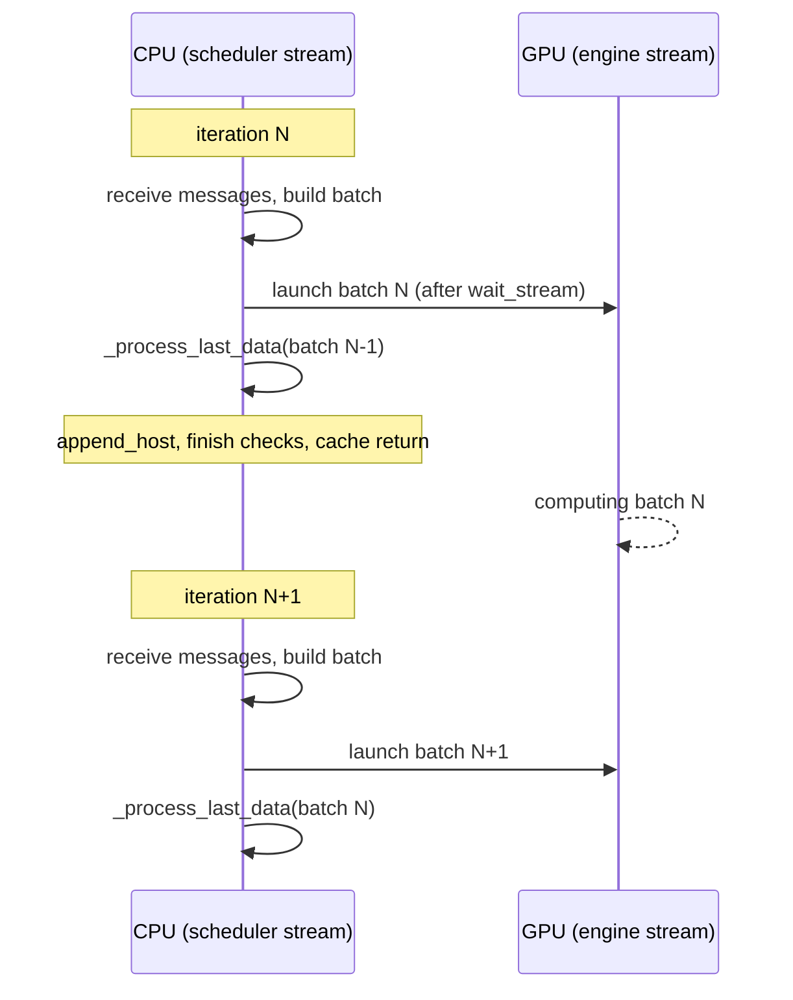

Across five chapters we have watched what the scheduler does. It receives
messages, computes budgets, walks a tree, allocates pages, fills a table. All of
it is **CPU work**.

What is the GPU doing meanwhile? If the answer is nothing, then however fast the
model runs, the gaps between runs are empty. This chapter reads the loop that
fills those gaps.

## Put the two loops side by side

There are two loops in the same file. The simple one first.

```python
    def normal_loop(self) -> None:
        blocking = not (self.prefill_manager.runnable or self.decode_manager.runnable)
        for msg in self.receive_msg(blocking=blocking):
            self._process_one_msg(msg)

        forward_input = self._schedule_next_batch()
        ongoing_data = None
        if forward_input is not None:
            ongoing_data = (forward_input, self._forward(forward_input))

        self._process_last_data(ongoing_data)
```

— [`python/minisgl/scheduler/scheduler.py:108-118`](https://github.com/sgl-project/mini-sglang/blob/9a91cfafe754aa85daee49998176275667eb58f2/python/minisgl/scheduler/scheduler.py#L108-L118)

Look at the last line: it processes the batch it just launched (`ongoing_data`)
**itself**. Since the first line of `_process_last_data` is
`copy_done.synchronize()` ([`python/minisgl/scheduler/scheduler.py:143`](https://github.com/sgl-project/mini-sglang/blob/9a91cfafe754aa85daee49998176275667eb58f2/python/minisgl/scheduler/scheduler.py#L143)), this loop
stops right there until the GPU is finished. No scheduling for the next batch
begins in the meantime.

Now the overlapping one.

```python
    def overlap_loop(self, last_data: ForwardData | None) -> ForwardData | None:
        """
        The main loop of overlapping scheduling and execution.

        It will overlap the execution of current batch and processing of last batch's results,
        which can effectively hide CPU latency and improve GPU utilization.
        """
        blocking = not (
            last_data is not None  # don't block if we have a batch to be processed
            or self.prefill_manager.runnable
            or self.decode_manager.runnable
        )
        for msg in self.receive_msg(blocking=blocking):
            self._process_one_msg(msg)

        forward_input = self._schedule_next_batch()
        ongoing_data = None
        if forward_input is not None:
            with self.engine_stream_ctx:  # run the batch in the engine's stream
                self.engine.stream.wait_stream(self.stream)
                ongoing_data = (forward_input, self._forward(forward_input))

        self._process_last_data(last_data)
        return ongoing_data
```

— [`python/minisgl/scheduler/scheduler.py:83-106`](https://github.com/sgl-project/mini-sglang/blob/9a91cfafe754aa85daee49998176275667eb58f2/python/minisgl/scheduler/scheduler.py#L83-L106)

The differences are the parameter and the last line. This batch is launched **on
the engine's stream**, and the CPU immediately processes the results of the
**previous** batch (`last_data`). Then it returns this batch, which becomes
`last_data` on the next call.

```python
            data = None
            while True:
                data = self.overlap_loop(data)
```

— [`python/minisgl/scheduler/scheduler.py:129-131`](https://github.com/sgl-project/mini-sglang/blob/9a91cfafe754aa85daee49998176275667eb58f2/python/minisgl/scheduler/scheduler.py#L129-L131)

<!-- visual: normal-vs-overlap supports: [normal-vs-overlap] -->

| | `normal_loop` | `overlap_loop` |
| --- | --- | --- |
| Parameter | none | previous batch, `last_data` |
| Stream the batch runs on | the caller's stream | the engine stream, inside `engine_stream_ctx` |
| Whose results are processed | the batch just launched | the **previous** batch |
| Synchronisation point | same iteration | next iteration |
| Blocking decision | waiting and running requests only | `last_data` as well |
| Selected when | `ENV.DISABLE_OVERLAP_SCHEDULING` is true | default |

The default is set in `env.py`.

```python
    DISABLE_OVERLAP_SCHEDULING = EnvBool(False)
```

— [`python/minisgl/env.py:69`](https://github.com/sgl-project/mini-sglang/blob/9a91cfafe754aa85daee49998176275667eb58f2/python/minisgl/env.py#L69)

The name is negative and the default is false: overlapping is the default, and an
environment variable turns it off.

<!-- visual: overlap-timeline supports: [overlap-timeline] -->



## The next input never goes through the CPU

Overlapping requires one condition. If building the next batch's input needs the
**token values** the last batch produced, nothing can overlap: the CPU would have
to wait for them.

This repository breaks that dependency inside the GPU.

```python
    def _forward(self, forward_input: ForwardInput) -> ForwardOutput:
        batch, sample_args, input_mapping, output_mapping = forward_input
        batch.input_ids = self.token_pool[input_mapping]
        forward_output = self.engine.forward_batch(batch, sample_args)
        self.token_pool[output_mapping] = forward_output.next_tokens_gpu
        self.decode_manager.filter_reqs(forward_input.batch.reqs)
        return forward_output
```

— [`python/minisgl/scheduler/scheduler.py:227-233`](https://github.com/sgl-project/mini-sglang/blob/9a91cfafe754aa85daee49998176275667eb58f2/python/minisgl/scheduler/scheduler.py#L227-L233)

Input is **read** from `token_pool` and output is **written** to the same
`token_pool`. Both are GPU tensors. The `token_pool` that `TableManager` held back
in chapter 2 ([`python/minisgl/scheduler/table.py:11`](https://github.com/sgl-project/mini-sglang/blob/9a91cfafe754aa85daee49998176275667eb58f2/python/minisgl/scheduler/table.py#L11)) is what is being used here.
On the next iteration, reading `token_pool[input_mapping]` finds the tokens the
last batch wrote already sitting there. The CPU never has to know what they are.

A copy down to the CPU still happens, but it is **for the answer being sent to a
person**, not for the next computation. It is the same reason `complete_one()` was
called before sampling back in chapter 2: a length can advance without a value.

The places to read from and write to are prepared when the batch is built.

```python
def _make_write_tuple(batch: Batch, device: torch.device) -> Indice2D:
    mapping_list = [req.table_idx for req in batch.reqs]
    mapping_host = torch.tensor(mapping_list, dtype=torch.int64, pin_memory=True)
    write_list = [(req.device_len if req.can_decode else -1) for req in batch.reqs]
```

— [`python/minisgl/scheduler/scheduler.py:262-265`](https://github.com/sgl-project/mini-sglang/blob/9a91cfafe754aa85daee49998176275667eb58f2/python/minisgl/scheduler/scheduler.py#L262-L265)

A request with nothing left to produce gets `-1` as its write position. Instead of
a conditional, it is handled by one index.

## Why the streams are split

Overlapping happens across two streams. One line sits right before the launch.

```python
            with self.engine_stream_ctx:  # run the batch in the engine's stream
                self.engine.stream.wait_stream(self.stream)
```

— [`python/minisgl/scheduler/scheduler.py:101-102`](https://github.com/sgl-project/mini-sglang/blob/9a91cfafe754aa85daee49998176275667eb58f2/python/minisgl/scheduler/scheduler.py#L101-L102)

It makes the engine stream wait for the scheduler stream. The copies queued on the
scheduler stream while preparing the batch — the scattered page-table write from
chapter 4 ([`python/minisgl/scheduler/cache.py:144-146`](https://github.com/sgl-project/mini-sglang/blob/9a91cfafe754aa85daee49998176275667eb58f2/python/minisgl/scheduler/cache.py#L144-L146)), the prefix token copy from
chapter 3 ([`python/minisgl/scheduler/prefill.py:58-61`](https://github.com/sgl-project/mini-sglang/blob/9a91cfafe754aa85daee49998176275667eb58f2/python/minisgl/scheduler/prefill.py#L58-L61)) — were all
`non_blocking=True`. Without the wait, the model could run on input that has not
arrived yet.

And when overlapping is in use, the stream is pinned down at the entry point.

```python
        if ENV.DISABLE_OVERLAP_SCHEDULING:
            with self.engine_stream_ctx:
                self.engine.stream.wait_stream(self.stream)
                while True:
                    self.normal_loop()
        else:
            assert torch.cuda.current_stream() == self.stream
```

— [`python/minisgl/scheduler/scheduler.py:122-128`](https://github.com/sgl-project/mini-sglang/blob/9a91cfafe754aa85daee49998176275667eb58f2/python/minisgl/scheduler/scheduler.py#L122-L128)

The non-overlapping path enters the engine stream and loops inside it; the
overlapping path asserts it is on the scheduler stream. The two loops run on
different premises, so the code checks those premises directly.

The engine side checks the same thing. It creates its own stream
([`python/minisgl/engine/engine.py:38-39`](https://github.com/sgl-project/mini-sglang/blob/9a91cfafe754aa85daee49998176275667eb58f2/python/minisgl/engine/engine.py#L38-L39)) and, on every batch, verifies it is
currently on it.

```python
    def forward_batch(self, batch: Batch, args: BatchSamplingArgs) -> ForwardOutput:
        assert torch.cuda.current_stream() == self.stream
```

— [`python/minisgl/engine/engine.py:191-192`](https://github.com/sgl-project/mini-sglang/blob/9a91cfafe754aa85daee49998176275667eb58f2/python/minisgl/engine/engine.py#L191-L192)

And it records, as an event, when the copy down to the CPU completed.

```python
        next_tokens_cpu = next_tokens_gpu.to("cpu", non_blocking=True)
        copy_done_event = torch.cuda.Event()
        copy_done_event.record(self.stream)
        return ForwardOutput(next_tokens_gpu, next_tokens_cpu, copy_done_event)
```

— [`python/minisgl/engine/engine.py:203-206`](https://github.com/sgl-project/mini-sglang/blob/9a91cfafe754aa85daee49998176275667eb58f2/python/minisgl/engine/engine.py#L203-L206)

That event is what `_process_last_data` waits on in the next iteration.
Overlapping does not remove the wait; it **defers it by one iteration**, and in
that interval the next batch has already left for the GPU.

## What one preparation contains

What CPU work the overlap is hiding becomes obvious from the batch preparation
function.

```python
    def _prepare_batch(self, batch: Batch) -> ForwardInput:
        self.engine.graph_runner.pad_batch(batch)
        self.cache_manager.allocate_paged(batch.reqs)
        batch.positions = _make_positions(batch, self.device)
        input_mapping = _make_input_tuple(batch, self.device)
        write_mapping = _make_write_tuple(batch, self.device)
        batch.out_loc = self.engine.page_table[input_mapping]
        self.engine.attn_backend.prepare_metadata(batch)
```

— [`python/minisgl/scheduler/scheduler.py:204-211`](https://github.com/sgl-project/mini-sglang/blob/9a91cfafe754aa85daee49998176275667eb58f2/python/minisgl/scheduler/scheduler.py#L204-L211)

Seven lines holding nearly everything this series has covered. Page allocation is
chapter 4, building `out_loc` by indexing the page table is chapter 4, and the
metadata preparation on the last line is chapter 7. Only `pad_batch` has not been
explained yet, and that is chapter 7's too.

These seven lines run on the CPU every step. Without overlapping, the GPU idles
for exactly that long.

## Wrapping up

`overlap_loop` launches this batch on the engine stream and processes the previous
batch's results. Because the next batch's input flows through `token_pool` inside
the GPU, the CPU never waits for token values. The difference between the two
loops is one parameter and one line, and an environment variable picks between
them.

The next chapter opens the last line of `_prepare_batch`: how the ledger the
scheduler built — positions, lengths, `out_loc` — becomes the tensors that go into
the attention kernel, and how CUDA graph replay pins those tensors down.

## Further reading

- [NanoFlow](https://arxiv.org/abs/2408.12757) — the paper the repository's
  `docs/features.md` links as the source of overlap scheduling. The same section
  also carries the illustration from
  [the LMSYS blog (2024-12-04)](https://lmsys.org/blog/2024-12-04-sglang-v0-4/).
