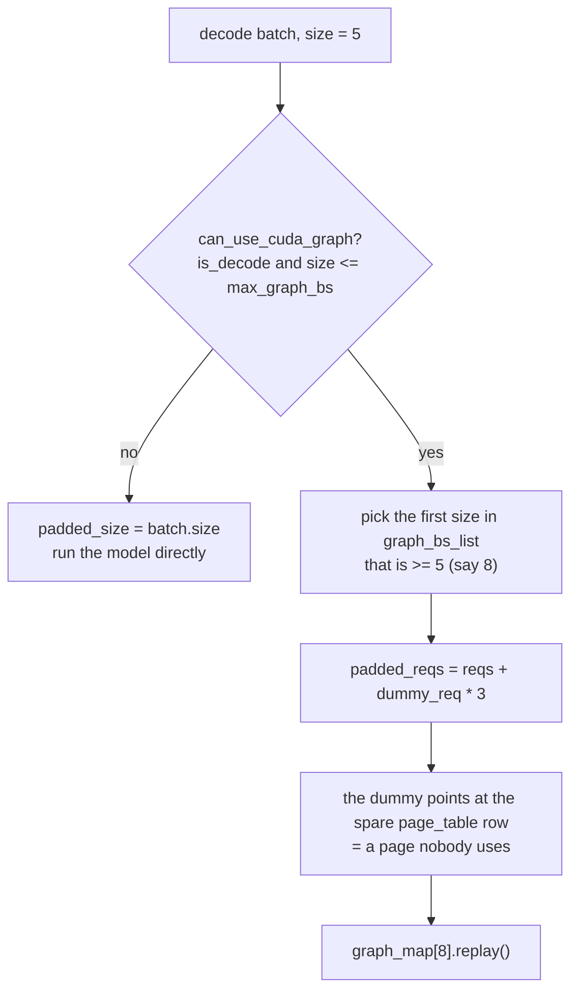

At the end of chapter 6 we listed the seven lines of `_prepare_batch` and left two
of them alone: `pad_batch` and `prepare_metadata`. This chapter opens both.

Everything built so far has been Python objects: three lengths on a `Req`, a slot
number, a row of the page table. Kernels know none of that. What a kernel receives
is a handful of tensors. This chapter is about where and how that conversion
happens, and how a CUDA graph pins those tensors down.

## From ledger to tensors

The FlashAttention backend's conversion is the easiest to read. It starts by
building Python lists.

```python
    def prepare_metadata(self, batch: Batch) -> None:
        reqs = batch.padded_reqs

        padded_size = len(reqs)
        seqlens_q = [req.extend_len for req in reqs]
        seqlens_k = [req.device_len for req in reqs]
        cached_lens = [req.cached_len for req in reqs]
        max_seqlen_k = max(seqlens_k)
        max_seqlen_q = max(seqlens_q)
```

— [`python/minisgl/attention/fa.py:67-75`](https://github.com/sgl-project/mini-sglang/blob/9a91cfafe754aa85daee49998176275667eb58f2/python/minisgl/attention/fa.py#L67-L75)

Chapter 2's three lengths become three lists as they are. `extend_len` is the
number of tokens to compute now, hence the query length; `device_len` is the total
length so far, hence the key length.

<!-- visual: metadata-conversion supports: [metadata-conversion] -->

| Scheduler's value | Kernel argument | How it is built |
| --- | --- | --- |
| `req.extend_len` | `cu_seqlens_q` | Collected in batch order, cumulative sum |
| `req.device_len` | `cu_seqlens_k` | Cumulative sum of `[0] + seqlens_k` |
| `req.device_len` | `cache_seqlens` | Made a tensor as is, no accumulation |
| `max(device_len)` | `max_seqlen_k` | Python `max` |
| `max(extend_len)` | `max_seqlen_q` | Python `max` |
| `page_table[table_idx]` | `page_table` (metadata side) | Rows sliced and stacked |

The reason for cumulative sums is that the kernel takes variable-length sequences
as one block. Requests in a batch differ in length, so a boundary array tells the
kernel where each one starts and ends.

```python
        cache_seqlens = torch.tensor(seqlens_k, **CPU_KWARGS)
        cache_seqlens = cache_seqlens.to(device, non_blocking=True)
        cu_seqlens_k = torch.tensor([0] + seqlens_k, **CPU_KWARGS).cumsum_(dim=0)
        cu_seqlens_k = cu_seqlens_k.to(device, non_blocking=True)
```

— [`python/minisgl/attention/fa.py:79-82`](https://github.com/sgl-project/mini-sglang/blob/9a91cfafe754aa85daee49998176275667eb58f2/python/minisgl/attention/fa.py#L79-L82)

`CPU_KWARGS` carries `pin_memory: True` and every transfer is `non_blocking=True`
([`python/minisgl/attention/fa.py:76`](https://github.com/sgl-project/mini-sglang/blob/9a91cfafe754aa85daee49998176275667eb58f2/python/minisgl/attention/fa.py#L76)). The `wait_stream` from chapter 6 is needed
here too.

The query-side boundary splits three ways.

```python
        if max_seqlen_q == 1:
            cu_seqlens_q = torch.arange(0, padded_size + 1, device=device, dtype=torch.int32)
        elif all(l == 0 for l in cached_lens):  # prefill with no cache hit
            cu_seqlens_q = cu_seqlens_k
        else:  # normal extend prefill, with partial cache hit
            cu_seqlens_q = torch.tensor([0] + seqlens_q, **CPU_KWARGS).cumsum_(dim=0)
```

— [`python/minisgl/attention/fa.py:84-89`](https://github.com/sgl-project/mini-sglang/blob/9a91cfafe754aa85daee49998176275667eb58f2/python/minisgl/attention/fa.py#L84-L89)

The three cases correspond one for one to states from chapters 2 through 5. If
every request's `extend_len` is 1 this is a decode batch, so the boundaries are
`0, 1, 2, …` and are built directly on the GPU. If no prefix matched at all, query
lengths equal key lengths and **the same tensor is reused**. Otherwise a proper
cumulative sum is built. Whether chapter 5's prefix reuse succeeded decides a
branch right here.

The page table is sliced and stacked.

```python
        page_table = get_global_ctx().page_table
        new_page_table = torch.stack(  # NOTE: global page table treat page_size = 1, we need slice
            [page_table[req.table_idx, : max_seqlen_k : self.page_size] for req in reqs]
        )
        if self.page_size > 1:
            new_page_table.div_(self.page_size, rounding_mode="floor")
```

— [`python/minisgl/attention/fa.py:92-97`](https://github.com/sgl-project/mini-sglang/blob/9a91cfafe754aa85daee49998176275667eb58f2/python/minisgl/attention/fa.py#L92-L97)

The comment points straight back at chapter 4. The global table is in token units,
so if a kernel wants page units the conversion happens here. With `page_size` of 1
there is no division. Chapter 4 said "the table's format is shaped by how the
kernel indexes"; with more than one kernel, the table matches one of them and the
rest convert at this point.

That there may be several backends is stated first by the interface.

```python
class BaseAttnBackend(ABC):
    @abstractmethod
    def forward(
```

— [`python/minisgl/attention/base.py:18-20`](https://github.com/sgl-project/mini-sglang/blob/9a91cfafe754aa85daee49998176275667eb58f2/python/minisgl/attention/base.py#L18-L20)

Besides `forward`, both `prepare_metadata` and `prepare_for_replay` are abstract
([`python/minisgl/attention/base.py:24-34`](https://github.com/sgl-project/mini-sglang/blob/9a91cfafe754aa85daee49998176275667eb58f2/python/minisgl/attention/base.py#L24-L34)). So a backend owns not just "how to call
the kernel" but "how to turn the ledger into arguments" and "how to prepare for
graph replay". Each kernel wants differently shaped arguments, so the conversion
belongs on the kernel's side.

The implementations are listed in a registry.

```python
@SUPPORTED_ATTENTION_BACKENDS.register("trtllm")
```

— [`python/minisgl/attention/__init__.py:22`](https://github.com/sgl-project/mini-sglang/blob/9a91cfafe754aa85daee49998176275667eb58f2/python/minisgl/attention/__init__.py#L22)

And using different backends for prefill and decode is permitted by one piece of
syntax.

```python
    if "," in backend:
        assert backend.count(",") == 1, "Only one comma is allowed in hybrid backend"
        p_backend, d_backend = backend.split(",", 1)
        if p_backend != d_backend:
            logger.info(f"Using hybrid attention backend: prefill={p_backend}, decode={d_backend}")
            p_backend = create_attention_backend(p_backend, config)
            d_backend = create_attention_backend(d_backend, config)
            return HybridBackend(p_backend, d_backend)
```

— [`python/minisgl/attention/__init__.py:57-64`](https://github.com/sgl-project/mini-sglang/blob/9a91cfafe754aa85daee49998176275667eb58f2/python/minisgl/attention/__init__.py#L57-L64)

Pass two names separated by a comma, like `"fa,fi"`, and each phase gets its own
kernel. Pass the same name twice and it warns and falls back to a single backend.
The libraries this needs are declared in the build configuration
(`pyproject.toml:30`, `flashinfer-python>=0.5.3`).

## The layer does not know the backend

Model-side code does not care which backend is in use.

```python
    def forward(self, qkv: torch.Tensor) -> torch.Tensor:
        ctx = get_global_ctx()
        q, k, v = qkv.split([self.qo_attn_dim, self.kv_attn_dim, self.kv_attn_dim], dim=-1)
        ...
        q, k = self.rotary.forward(ctx.batch.positions, q, k)
        q = q.view(-1, self.num_qo_heads, self.head_dim)
        o = ctx.attn_backend.forward(q, k, v, self.layer_id, ctx.batch)
```

— [`python/minisgl/layers/attention.py:47-56`](https://github.com/sgl-project/mini-sglang/blob/9a91cfafe754aa85daee49998176275667eb58f2/python/minisgl/layers/attention.py#L47-L56)

It pulls the current batch and backend out of a global context. The
`forward_batch` context manager on `Context` from chapter 2 is collected here —
that is how a layer whose arguments contain no batch can still use one.
`ctx.batch.positions` is the tensor `_prepare_batch` built in chapter 6.

## The graph fixes the shape

A CUDA graph records a sequence of GPU work once and replays it. For replay to
work, **tensor addresses and shapes must stay the same**. But batch size changes
every step.

So a few sizes are captured, and the real batch is padded up to one of them.

```python
    def pad_batch(self, batch: Batch) -> None:
        padded_size = (  # choose the first available batch size
            next(bs for bs in self.graph_bs_list if bs >= batch.size)
            if self.can_use_cuda_graph(batch)
            else batch.size
        )
        batch.padded_reqs = batch.reqs + [self.dummy_req] * (padded_size - batch.size)
```

— [`python/minisgl/engine/graph.py:160-166`](https://github.com/sgl-project/mini-sglang/blob/9a91cfafe754aa85daee49998176275667eb58f2/python/minisgl/engine/graph.py#L160-L166)

The `padded_reqs` field on `Batch` from chapter 2, and the extra page table row
with the dummy request pointing at it from chapter 4
([`python/minisgl/engine/engine.py:98`](https://github.com/sgl-project/mini-sglang/blob/9a91cfafe754aa85daee49998176275667eb58f2/python/minisgl/engine/engine.py#L98)), meet here. The shortfall is filled with
dummy requests. The KV space the dummy writes to is a page the cache manager
hands to no one, so its computed result affects nothing.

<!-- visual: graph-padding supports: [graph-padding] -->



There are only two conditions for using a graph.

```python
    def can_use_cuda_graph(self, batch: Batch) -> bool:
        return batch.is_decode and batch.size <= self.max_graph_bs
```

— [`python/minisgl/engine/graph.py:149-150`](https://github.com/sgl-project/mini-sglang/blob/9a91cfafe754aa85daee49998176275667eb58f2/python/minisgl/engine/graph.py#L149-L150)

It must be a decode batch, and within the largest captured size. Why prefill is
excluded follows from chapter 2's `extend_len`: in decode every request has query
length 1, so matching the batch size makes the shapes identical, while in prefill
prompt lengths differ and matching the size does not fix the shape.

Replay itself is three lines.

```python
    def replay(self, batch: Batch) -> torch.Tensor:
        assert self.can_use_cuda_graph(batch)
        self.buffer.copy_from(batch)
        g = self.graph_map[batch.padded_size]
        self.attn_backend.prepare_for_replay(batch)
        g.replay()
```

— [`python/minisgl/engine/graph.py:152-157`](https://github.com/sgl-project/mini-sglang/blob/9a91cfafe754aa85daee49998176275667eb58f2/python/minisgl/engine/graph.py#L152-L157)

Copy the values into fixed buffers, look up the graph for that size, have the
backend prepare for replay, and replay. The point is that no new tensors are
created: **the same storage gets new values**. That is also why the tensors
`prepare_metadata` built are not used directly on the graph path but pass through
the backend's replay preparation first.

## Wrapping up

The scheduler's ledger becomes kernel arguments in `prepare_metadata`. Length
lists become cumulative-sum boundaries, the page table is sliced and stacked, and
all of it is uploaded asynchronously from pinned memory. Decode batches can be
replayed from a CUDA graph, and to make that possible the batch is padded with
dummy requests up to a captured size.

The final chapter replicates all of this once per rank. Each rank runs its own
scheduler and must still reach the same decisions, and the weights have to be
split across them. The rank synchronisation protocol deferred in chapter 1 is
answered there as well.

## Further reading

- The repository's `docs/features.md` — it names FlashAttention, FlashInfer and
  TensorRT-LLM fmha as attention backends and links each source. The
  `prepare_metadata` read in this chapter is the FlashAttention implementation.
