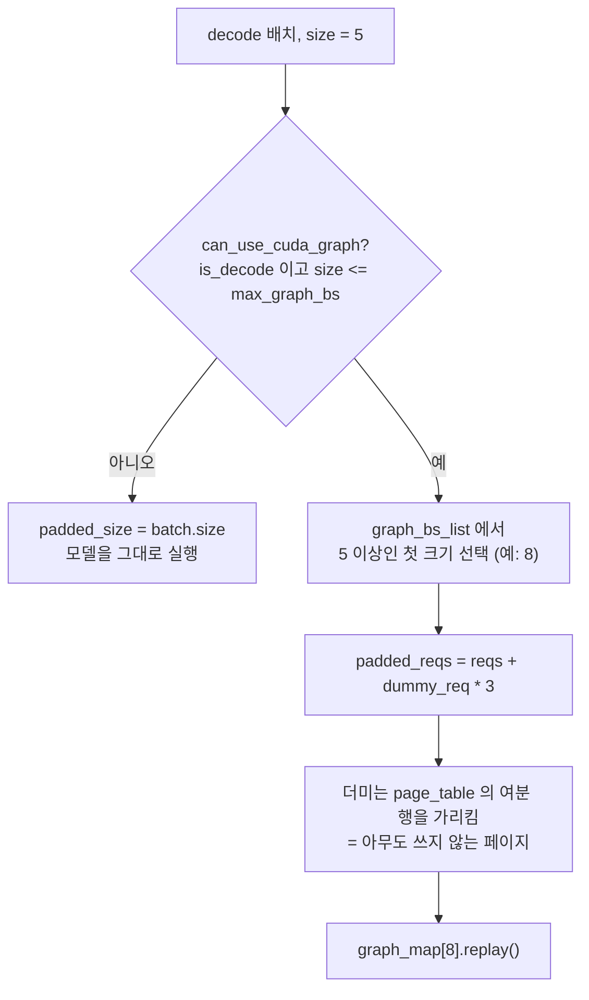

6편 마지막에 `_prepare_batch` 의 일곱 줄을 열거하면서 마지막 두 줄을 남겨 뒀다.
`pad_batch` 와 `prepare_metadata` 다. 이 편이 그 둘을 연다.

지금까지 세운 것은 전부 파이썬 객체였다. `Req` 의 길이 세 개, 슬롯 번호, page
table 의 한 행. 커널은 그런 것을 모른다. 커널이 받는 것은 텐서 몇 개다. 그 변환이
어디서 어떻게 일어나는지, 그리고 CUDA graph 가 그 텐서들을 어떻게 고정하는지를
본다.

## 장부에서 텐서로

FlashAttention 백엔드의 변환 함수가 가장 읽기 쉽다. 앞부분은 파이썬 리스트를 만드는
일이다.

```python
    def prepare_metadata(self, batch: Batch) -> None:
        reqs = batch.padded_reqs

        padded_size = len(reqs)
        seqlens_q = [req.extend_len for req in reqs]
        seqlens_k = [req.device_len for req in reqs]
        cached_lens = [req.cached_len for req in reqs]
        max_seqlen_k = max(seqlens_k)
        max_seqlen_q = max(seqlens_q)
```

— [`python/minisgl/attention/fa.py:67-75`](https://github.com/sgl-project/mini-sglang/blob/9a91cfafe754aa85daee49998176275667eb58f2/python/minisgl/attention/fa.py#L67-L75)

2편의 세 길이가 그대로 세 리스트가 된다. `extend_len` 은 이번에 계산할 토큰 수이니
질의 길이이고, `device_len` 은 지금까지의 전체 길이이니 키 길이다.

<!-- visual: metadata-conversion supports: [metadata-conversion] -->

| 스케줄러의 값 | 커널 인자 | 만드는 방법 |
| --- | --- | --- |
| `req.extend_len` | `cu_seqlens_q` | 배치 순서대로 모아 누적합 |
| `req.device_len` | `cu_seqlens_k` | `[0] + seqlens_k` 의 누적합 |
| `req.device_len` | `cache_seqlens` | 누적 없이 그대로 텐서화 |
| `max(device_len)` | `max_seqlen_k` | 파이썬 `max` |
| `max(extend_len)` | `max_seqlen_q` | 파이썬 `max` |
| `page_table[table_idx]` | `page_table` (메타데이터 쪽) | 행을 잘라 `stack` |

누적합으로 바꾸는 이유는 커널이 가변 길이 시퀀스를 한 덩어리로 받기 때문이다.
배치 안의 요청들이 길이가 제각각이라, 어디서 어디까지가 한 요청인지를 경계 배열로
알려 준다.

```python
        cache_seqlens = torch.tensor(seqlens_k, **CPU_KWARGS)
        cache_seqlens = cache_seqlens.to(device, non_blocking=True)
        cu_seqlens_k = torch.tensor([0] + seqlens_k, **CPU_KWARGS).cumsum_(dim=0)
        cu_seqlens_k = cu_seqlens_k.to(device, non_blocking=True)
```

— [`python/minisgl/attention/fa.py:79-82`](https://github.com/sgl-project/mini-sglang/blob/9a91cfafe754aa85daee49998176275667eb58f2/python/minisgl/attention/fa.py#L79-L82)

`CPU_KWARGS` 에 `pin_memory: True` 가 들어 있고 전송은 전부 `non_blocking=True`
다([`python/minisgl/attention/fa.py:76`](https://github.com/sgl-project/mini-sglang/blob/9a91cfafe754aa85daee49998176275667eb58f2/python/minisgl/attention/fa.py#L76)). 6편에서 본 `wait_stream` 이 필요한 이유가
여기에도 있다.

질의 쪽 경계는 세 갈래로 갈린다.

```python
        if max_seqlen_q == 1:
            cu_seqlens_q = torch.arange(0, padded_size + 1, device=device, dtype=torch.int32)
        elif all(l == 0 for l in cached_lens):  # prefill with no cache hit
            cu_seqlens_q = cu_seqlens_k
        else:  # normal extend prefill, with partial cache hit
            cu_seqlens_q = torch.tensor([0] + seqlens_q, **CPU_KWARGS).cumsum_(dim=0)
```

— [`python/minisgl/attention/fa.py:84-89`](https://github.com/sgl-project/mini-sglang/blob/9a91cfafe754aa85daee49998176275667eb58f2/python/minisgl/attention/fa.py#L84-L89)

세 경우가 2~5편의 상태와 하나씩 대응한다. 모든 요청의 `extend_len` 이 1 이면
decode 배치이므로 경계는 `0, 1, 2, ...` 이고 GPU 에서 바로 만든다. 접두사 일치가
하나도 없는 prefill 이면 질의 길이와 키 길이가 같으니 **같은 텐서를 재사용한다.**
그 외에는 제대로 누적합을 만든다. 5편의 접두사 재사용이 성공했는지가 여기서 분기
하나를 결정한다.

page table 은 잘라서 쌓는다.

```python
        page_table = get_global_ctx().page_table
        new_page_table = torch.stack(  # NOTE: global page table treat page_size = 1, we need slice
            [page_table[req.table_idx, : max_seqlen_k : self.page_size] for req in reqs]
        )
        if self.page_size > 1:
            new_page_table.div_(self.page_size, rounding_mode="floor")
```

— [`python/minisgl/attention/fa.py:92-97`](https://github.com/sgl-project/mini-sglang/blob/9a91cfafe754aa85daee49998176275667eb58f2/python/minisgl/attention/fa.py#L92-L97)

주석이 4편을 그대로 가리킨다. 전역 표는 토큰 단위이므로 커널이 페이지 단위를
원하면 여기서 되돌린다. `page_size` 가 1 이면 나눗셈이 없다. 4편에서 "표의 형식은
커널의 인덱싱 방식에 맞춰져 있다"고 했는데, 커널이 둘 이상이면 그중 하나에 맞추고
나머지는 이 지점에서 변환하는 셈이다.

백엔드가 여럿일 수 있다는 것은 인터페이스가 먼저 말한다.

```python
class BaseAttnBackend(ABC):
    @abstractmethod
    def forward(
```

— [`python/minisgl/attention/base.py:18-20`](https://github.com/sgl-project/mini-sglang/blob/9a91cfafe754aa85daee49998176275667eb58f2/python/minisgl/attention/base.py#L18-L20)

`forward` 말고도 `prepare_metadata` 와 `prepare_for_replay` 가 추상 메서드로 걸려
있다([`python/minisgl/attention/base.py:24-34`](https://github.com/sgl-project/mini-sglang/blob/9a91cfafe754aa85daee49998176275667eb58f2/python/minisgl/attention/base.py#L24-L34)). 즉 "커널을 부르는 법"뿐 아니라
"장부를 인자로 바꾸는 법"과 "그래프 재생 준비"까지가 백엔드의 책임이다. 커널마다
원하는 인자 모양이 다르므로 변환도 커널 쪽에 두는 편이 맞다.

구현체 목록은 등록표로 드러난다.

```python
@SUPPORTED_ATTENTION_BACKENDS.register("trtllm")
```

— [`python/minisgl/attention/__init__.py:22`](https://github.com/sgl-project/mini-sglang/blob/9a91cfafe754aa85daee49998176275667eb58f2/python/minisgl/attention/__init__.py#L22)

그리고 prefill 과 decode 에 서로 다른 백엔드를 쓰는 것도 문법 하나로 허용한다.

```python
    if "," in backend:
        assert backend.count(",") == 1, "Only one comma is allowed in hybrid backend"
        p_backend, d_backend = backend.split(",", 1)
        if p_backend != d_backend:
            logger.info(f"Using hybrid attention backend: prefill={p_backend}, decode={d_backend}")
            p_backend = create_attention_backend(p_backend, config)
            d_backend = create_attention_backend(d_backend, config)
            return HybridBackend(p_backend, d_backend)
```

— [`python/minisgl/attention/__init__.py:57-64`](https://github.com/sgl-project/mini-sglang/blob/9a91cfafe754aa85daee49998176275667eb58f2/python/minisgl/attention/__init__.py#L57-L64)

`"fa,fi"` 처럼 쉼표로 두 개를 주면 단계별로 다른 커널이 붙는다. 같은 값을 두 번
주면 경고를 남기고 단일 백엔드로 떨어진다. 필요한 라이브러리는 빌드 설정에 들어
있다(`pyproject.toml:30` 의 `flashinfer-python>=0.5.3`).

## 레이어는 백엔드를 모른다

모델 쪽 코드는 어느 백엔드인지 신경 쓰지 않는다.

```python
    def forward(self, qkv: torch.Tensor) -> torch.Tensor:
        ctx = get_global_ctx()
        q, k, v = qkv.split([self.qo_attn_dim, self.kv_attn_dim, self.kv_attn_dim], dim=-1)
        ...
        q, k = self.rotary.forward(ctx.batch.positions, q, k)
        q = q.view(-1, self.num_qo_heads, self.head_dim)
        o = ctx.attn_backend.forward(q, k, v, self.layer_id, ctx.batch)
```

— [`python/minisgl/layers/attention.py:47-56`](https://github.com/sgl-project/mini-sglang/blob/9a91cfafe754aa85daee49998176275667eb58f2/python/minisgl/layers/attention.py#L47-L56)

전역 컨텍스트에서 현재 배치와 백엔드를 꺼내 쓴다. 2편에서 본 `Context` 의
`forward_batch` 컨텍스트 매니저가 여기서 회수된다. 레이어가 받는 인자에 배치가
없는데도 배치를 쓸 수 있는 이유다. `ctx.batch.positions` 는 6편에서 본
`_prepare_batch` 가 만들어 둔 그 텐서다.

## 그래프는 모양을 고정한다

CUDA graph 는 GPU 작업 순서를 한 번 기록해 두고 다시 재생하는 기능이다. 재생이
성립하려면 **텐서의 주소와 모양이 그대로**여야 한다. 그런데 배치 크기는 매 스텝
달라진다.

그래서 크기를 몇 개만 골라 잡아 두고, 실제 배치를 그 크기까지 늘린다.

```python
    def pad_batch(self, batch: Batch) -> None:
        padded_size = (  # choose the first available batch size
            next(bs for bs in self.graph_bs_list if bs >= batch.size)
            if self.can_use_cuda_graph(batch)
            else batch.size
        )
        batch.padded_reqs = batch.reqs + [self.dummy_req] * (padded_size - batch.size)
```

— [`python/minisgl/engine/graph.py:160-166`](https://github.com/sgl-project/mini-sglang/blob/9a91cfafe754aa85daee49998176275667eb58f2/python/minisgl/engine/graph.py#L160-L166)

2편에서 `Batch` 에 `padded_reqs` 라는 필드가 있던 것, 4편에서 page table 에 행이
하나 더 있고 더미 요청이 그 행을 가리키던 것
([`python/minisgl/engine/engine.py:98`](https://github.com/sgl-project/mini-sglang/blob/9a91cfafe754aa85daee49998176275667eb58f2/python/minisgl/engine/engine.py#L98))이 여기서 만난다. 모자란 자리는 더미 요청으로
채운다. 더미가 쓰는 KV 자리는 캐시 관리자가 아무에게도 주지 않는 페이지이므로,
계산 결과가 어디에도 영향을 주지 않는다.

<!-- visual: graph-padding supports: [graph-padding] -->



그래프를 쓸 수 있는 조건은 두 개뿐이다.

```python
    def can_use_cuda_graph(self, batch: Batch) -> bool:
        return batch.is_decode and batch.size <= self.max_graph_bs
```

— [`python/minisgl/engine/graph.py:149-150`](https://github.com/sgl-project/mini-sglang/blob/9a91cfafe754aa85daee49998176275667eb58f2/python/minisgl/engine/graph.py#L149-L150)

decode 배치여야 하고, 잡아 둔 최대 크기 안이어야 한다. prefill 이 빠지는 이유는
2편의 `extend_len` 으로 설명된다. decode 는 요청마다 질의 길이가 항상 1 이라 배치
크기만 맞추면 모양이 같아지지만, prefill 은 프롬프트 길이가 제각각이라 크기를
맞춰도 모양이 고정되지 않는다.

재생 자체는 세 줄이다.

```python
    def replay(self, batch: Batch) -> torch.Tensor:
        assert self.can_use_cuda_graph(batch)
        self.buffer.copy_from(batch)
        g = self.graph_map[batch.padded_size]
        self.attn_backend.prepare_for_replay(batch)
        g.replay()
```

— [`python/minisgl/engine/graph.py:152-157`](https://github.com/sgl-project/mini-sglang/blob/9a91cfafe754aa85daee49998176275667eb58f2/python/minisgl/engine/graph.py#L152-L157)

값을 고정된 버퍼로 복사하고, 그 크기에 해당하는 그래프를 찾아, 백엔드에게 재생
준비를 시킨 뒤 재생한다. 매번 새 텐서를 만들지 않고 **같은 자리에 값만 갈아
끼우는** 것이 요점이다. 그래서 `prepare_metadata` 가 만든 텐서들도 그래프 경로에서는
그대로 쓰이지 않고 백엔드의 재생 준비를 한 번 거친다.

## 정리

스케줄러의 장부는 `prepare_metadata` 에서 커널 인자로 바뀐다. 길이 리스트는
누적합 경계가 되고, page table 은 잘려 쌓이며, 전부 pinned 메모리에서 비동기로
올라간다. decode 배치는 CUDA graph 로 재생할 수 있고, 그러기 위해 배치를 미리 잡아
둔 크기까지 더미 요청으로 채운다.

마지막 편은 이 전부를 rank 수만큼 복제한다. 각 rank 가 자기 스케줄러를 돌리면서도
같은 결정에 도달해야 하고, 가중치는 나뉘어 올라가 있어야 한다. 1편에서 미뤄 둔
rank 동기화 규약도 거기서 답한다.

## 더 읽을거리

- 저장소의 `docs/features.md` — 어텐션 백엔드로 FlashAttention, FlashInfer,
  TensorRT-LLM fmha 를 들고 각각의 출처를 링크한다. 이 편에서 읽은
  `prepare_metadata` 는 그중 FlashAttention 쪽 구현이다.
