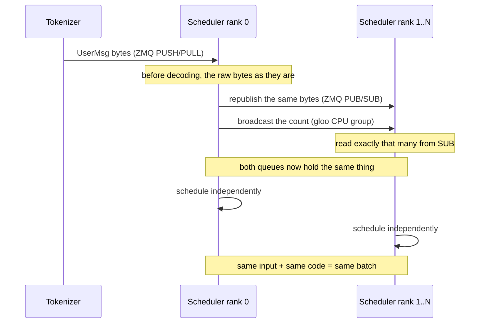

Chapter 1 showed that one scheduler starts per TP rank, and the six chapters since
read what happens inside **one** of them. Now all of it gets replicated once per
rank.

That creates a problem. The scheduler makes decisions every step: which requests
enter the batch, which pages to take, what to discard and when. If ranks decide
independently and arrive at different answers, GPUs holding slices of the same
model compute different things. How do they reach the same answer?

## The answer is that they do not agree

Ranks never exchange decisions. **They take the same input and run the same code.**
So what is needed is not synchronised decisions but **synchronised input**.

The code deferred in chapter 1 does exactly that.

```python
    def _recv_msg_multi_rank0(self, blocking: bool = False) -> List[BaseBackendMsg]:
        pending_msgs: List[BaseBackendMsg] = []
        if blocking:
            self.run_when_idle()
            raw = self._recv_from_tokenizer.get_raw()
            self._send_into_ranks.put_raw(raw)
            pending_msgs.append(self._recv_from_tokenizer.decode(raw))

        pending_raw_msgs: List[bytes] = []
        while not self._recv_from_tokenizer.empty():
            pending_raw_msgs.append(self._recv_from_tokenizer.get_raw())

        # broadcast the number of raw messages to all ranks
        src_tensor = torch.tensor(len(pending_raw_msgs))
        self.tp_cpu_group.broadcast(src_tensor, root=0).wait()

        for raw in pending_raw_msgs:
            self._send_into_ranks.put_raw(raw)
            pending_msgs.append(self._recv_from_tokenizer.decode(raw))
        return pending_msgs
```

— [`python/minisgl/scheduler/io.py:88-107`](https://github.com/sgl-project/mini-sglang/blob/9a91cfafe754aa85daee49998176275667eb58f2/python/minisgl/scheduler/io.py#L88-L107)

Only rank 0 is connected to the tokenizer. It republishes the bytes it received
before decoding them, and **broadcasts the count separately**. The receiving side
reads exactly that many.

```python
    def _recv_msg_multi_rank1(self, blocking: bool = False) -> List[BaseBackendMsg]:
        pending_msgs: List[BaseBackendMsg] = []
        if blocking:
            self.run_when_idle()
            pending_msgs.append(self._recv_from_rank0.get())

        # ensure all ranks have the same number of raw messages
        dst_tensor = torch.tensor(-1)
        self.tp_cpu_group.broadcast(dst_tensor, root=0).wait()
        dst_length = int(dst_tensor.item())

        for _ in range(dst_length):
            pending_msgs.append(self._recv_from_rank0.get())
        return pending_msgs
```

— [`python/minisgl/scheduler/io.py:109-122`](https://github.com/sgl-project/mini-sglang/blob/9a91cfafe754aa85daee49998176275667eb58f2/python/minisgl/scheduler/io.py#L109-L122)

<!-- visual: rank-sync-protocol supports: [rank-sync-protocol] -->



Why send the count separately? PUB/SUB cannot safely express "read everything that
has arrived so far". If ranks check for emptiness at different instants, one reads
two messages and another reads three. Their pending queues then differ, and the
single `break` from chapter 3 turns that difference into different batches. Fixing
the count first removes the possibility.

The reply path is asymmetric.

```python
    def _reply_tokenizer_rank1(self, reply: List[DetokenizeMsg]) -> None:
        _ = reply  # do nothing for non-primary ranks
```

— [`python/minisgl/scheduler/io.py:132-133`](https://github.com/sgl-project/mini-sglang/blob/9a91cfafe754aa85daee49998176275667eb58f2/python/minisgl/scheduler/io.py#L132-L133)

Ranks other than 0 compute the result and send it to nobody. Sending the same
answer N times would make the detokenizer answer N times, so only rank 0 emits
([`python/minisgl/scheduler/io.py:124-130`](https://github.com/sgl-project/mini-sglang/blob/9a91cfafe754aa85daee49998176275667eb58f2/python/minisgl/scheduler/io.py#L124-L130)). It is the same rule as the acks in
chapter 1, where only the primary rank sends one.

What distinguishes a rank is itself plain.

```python
class DistributedInfo:  # should not export from here
    rank: int
    size: int

    def __post_init__(self):
        assert 0 <= self.rank < self.size

    def is_primary(self) -> bool:
        return self.rank == 0
```

— [`python/minisgl/distributed/info.py:7-15`](https://github.com/sgl-project/mini-sglang/blob/9a91cfafe754aa85daee49998176275667eb58f2/python/minisgl/distributed/info.py#L7-L15)

## Weights are cut by name

Each rank holds only part of the model. What gets cut along which axis is decided
by the **parameter name**.

```python
_SPLIT_DIM_0 = [".q_proj", ".k_proj", ".v_proj", ".gate_proj", ".up_proj"]
_SPLIT_DIM_1 = [".o_proj", ".down_proj"]
```

— [`python/minisgl/models/weight.py:13-14`](https://github.com/sgl-project/mini-sglang/blob/9a91cfafe754aa85daee49998176275667eb58f2/python/minisgl/models/weight.py#L13-L14)

<!-- visual: tp-shard-map supports: [tp-shard-map] -->

| Name pattern | Axis cut | Why |
| --- | --- | --- |
| `.q_proj`, `.k_proj`, `.v_proj` | 0 (output) | Heads are divided between ranks |
| `.gate_proj`, `.up_proj` | 0 (output) | The intermediate dimension is divided |
| `.o_proj`, `.down_proj` | 1 (input) | They receive what the previous layer divided |
| `lm_head`, `embed_tokens` | 0 (vocabulary) | The vocabulary is split into ranges |
| everything else | not cut | Replicated on every rank |

The code is that table.

```python
def _shard_tensor(key: str, value: torch.Tensor, r: int, n: int, num_kv_heads: int):
    """Extract rank r's shard from a single tensor. Returns a contiguous copy."""
    if any(key.count(sub) for sub in _SPLIT_DIM_0):
        is_kv_proj = any(key.count(sub) for sub in (".k_proj", ".v_proj"))
        if is_kv_proj and num_kv_heads is not None and num_kv_heads < n:
            head_dim = value.shape[0] // num_kv_heads
            head_idx = r * num_kv_heads // n
            return value[head_idx * head_dim : (head_idx + 1) * head_dim].clone()
        return value.chunk(n, dim=0)[r].clone()
    elif any(key.count(sub) for sub in _SPLIT_DIM_1):
        return value.chunk(n, dim=1)[r].clone()
    elif key.count("lm_head") or key.count("embed_tokens"):
        num_embeddings = value.shape[0]
        num_embeddings_per_partition = div_ceil(num_embeddings, n)
        vocab_start_idx = r * num_embeddings_per_partition
        vocab_end_idx = min((r + 1) * num_embeddings_per_partition, num_embeddings)
        return value[vocab_start_idx:vocab_end_idx, :].clone()
    else:
        return value
```

— [`python/minisgl/models/weight.py:34-52`](https://github.com/sgl-project/mini-sglang/blob/9a91cfafe754aa85daee49998176275667eb58f2/python/minisgl/models/weight.py#L34-L52)

There is one special case. When there are fewer KV heads than ranks, they cannot
be divided — the situation in GQA-style models where KV heads are shared. Then,
instead of cutting, **several ranks hold a replica of the same head** (lines
38-41). That is why the KV buffer's `local_kv_heads` in chapter 4 was computed with
`div_even(..., allow_replicate=True)`.

Cutting and rejoining are a pair.

```python
    def forward(self, x: torch.Tensor) -> torch.Tensor:
        y = F.linear(x, self.weight, self.bias)
        if self._tp_size > 1:
            y = self._comm.all_reduce(y)
        return y
```

— [`python/minisgl/layers/linear.py:102-106`](https://github.com/sgl-project/mini-sglang/blob/9a91cfafe754aa85daee49998176275667eb58f2/python/minisgl/layers/linear.py#L102-L106)

A layer cut along the input axis (`o_proj`, `down_proj`) produces a partial sum on
each rank, so the sums must be added to be complete. That addition is the
all-reduce. A layer cut along the output axis hands its own slice of the output
straight to the next layer — which works because the next layer is cut along its
input axis. The vocabulary-parallel embedding rejoins the same way
([`python/minisgl/layers/embedding.py:42`](https://github.com/sgl-project/mini-sglang/blob/9a91cfafe754aa85daee49998176275667eb58f2/python/minisgl/layers/embedding.py#L42)).

The communication implementation is swappable.

```python
class DistributedImpl(ABC):
    @abstractmethod
    def all_reduce(self, x: torch.Tensor) -> torch.Tensor: ...
```

— [`python/minisgl/distributed/impl.py:16-18`](https://github.com/sgl-project/mini-sglang/blob/9a91cfafe754aa85daee49998176275667eb58f2/python/minisgl/distributed/impl.py#L16-L18)

There is one implementation over `torch.distributed` and one calling PyNCCL
directly ([`python/minisgl/distributed/impl.py:25-26`](https://github.com/sgl-project/mini-sglang/blob/9a91cfafe754aa85daee49998176275667eb58f2/python/minisgl/distributed/impl.py#L25-L26), `:45-48`), and the call site
does not know which. Whether the two produce the same result is checked by a test.

```python
    test_correctness(lambda x: comm.all_reduce(x, "sum"))
```

— [`tests/kernel/test_comm.py:137`](https://github.com/sgl-project/mini-sglang/blob/9a91cfafe754aa85daee49998176275667eb58f2/tests/kernel/test_comm.py#L137)

## The model is not a `torch.nn.Module`

By this point it stands out that the layer classes do not inherit PyTorch's
standard module. They implement their own `state_dict` instead.

```python
class BaseOP:
    @abstractmethod
    def forward(self, *args: Any, **kwargs: Any) -> Any: ...

    def state_dict(self, *, prefix: str = "", result: _STATE_DICT | None = None) -> _STATE_DICT:
        result = result if result is not None else {}

        for name, param in self.__dict__.items():
            if name.startswith("_"):
                continue
            if isinstance(param, torch.Tensor):
                result[_concat_prefix(prefix, name)] = param
            elif isinstance(param, BaseOP):
                param.state_dict(prefix=_concat_prefix(prefix, name), result=result)

        return result
```

— [`python/minisgl/layers/base.py:15-30`](https://github.com/sgl-project/mini-sglang/blob/9a91cfafe754aa85daee49998176275667eb58f2/python/minisgl/layers/base.py#L15-L30)

It walks `__dict__`, names anything that is a tensor, and recurses with an extended
prefix into any nested `BaseOP`. Names starting with an underscore are skipped —
which is why the `self._comm` and `self._tp_size` seen above are never mistaken for
weights. It is the same idea as the message serialisation from chapter 1
([`python/minisgl/message/utils.py:20-35`](https://github.com/sgl-project/mini-sglang/blob/9a91cfafe754aa85daee49998176275667eb58f2/python/minisgl/message/utils.py#L20-L35)): no separate schema, just a rule for
reading an object's fields.

## Wrapping up

Ranks do not agree on decisions. Rank 0 republishes the raw bytes it received and
broadcasts the count so that the **input** is identical, and from there each rank
reaches the same conclusion by running the same code. Weights are cut along an
axis chosen by parameter name, and layers cut along the input axis rejoin their
partial sums with an all-reduce.

This is where the series ends. We began with a map of processes in chapter 1 and
went through one request's ledger, the batching budget, paged allocation, prefix
reuse, two streams, kernel arguments, and finally replication across ranks.
Following the question each chapter handed to the next shows how ten thousand
lines under `python/minisgl/` mesh into a single serving loop.

## Further reading

- [SGLang](https://github.com/sgl-project/sglang) — the original project the
  repository's `README.md` names in its opening. Start there to see the structure
  Mini-SGLang condenses at full scale.
- The repository's `docs/structures.md` — it states the division of labour: ZMQ
  for control messages, NCCL through `torch.distributed` for the heavy tensors
  between GPUs. The two paths this chapter read are exactly those two.
