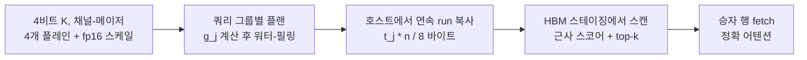

[논문 링크](https://arxiv.org/abs/2609.17652)
## Fathom: 쿼리마다 깊이를 바꾸는 스캔으로 1M 토큰 디코딩을 1.67배 빠르게 하다

## 한 줄 요약 (TL;DR)

에이전트 세션이 1M 토큰까지 길어지고 수십 세션이 동시에 상주하면 KV 캐시와 이를 랭킹하는 인덱스가 호스트 메모리에 살게 되고, 매 디코드 스텝의 top-k 스캔이 PCIe 바이트에 의해 묶인다 (근거: §1). Fathom은 4비트 K 캐시를 채널-메이저 비트 플레인으로 저장해 앞쪽 $$t$$개 플레인 읽기가 정확히 $$t$$비트 양자화가 되게 하고, 각 쿼리가 채널별 중요도 $$g_j$$에 따라 리버스 워터-필링으로 비트 예산을 나눠 읽는다 (근거: §3.2, §3.3). Qwen3-8B, 1M 토큰, 배치 1 조건에서 GPU 시간 기준 136비트 스캔 대비 1.67배, 랜드마크 대비 2.50배, 썸네일 대비 3.12배 빠르고, 동일 GPU 시간의 SparQ r=16 대비 18% 적은 바이트로 1.1–5.3배 낮은 어텐션 오차를 달성한다 (근거: Tab. 1, Tab. 2, Tab. 5). 단 인덱스가 HBM에 있으면 빨라지지 않는다 (근거: §7).

## 핵심 아이디어

핵심 가설을 한 문장으로 정리하면 다음과 같다.

**저자들은 채널-메이저 비트 플레인 저장 위에 쿼리별 리버스 워터-필링으로 채널마다 읽기 깊이를 다르게 할당함으로써 고정 깊이 스캔의 바이트 한계를 극복하고 동일 GPU 시간에 더 적은 바이트로 더 낮은 오차를 달성할 수 있다고 가정한다 (근거: §1, §3).**

가장 중요하고 독창적인 기여는 세 가지로 구분된다 (근거: §1).

1. **새로운 데이터 구조: 비트 플레인 K 스토어.** 4비트 K 코드를 블록당 4개 64비트 워드로 채널-메이저로 쌓는다 (근거: §3.2). 앞쪽 $$t$$개 워드를 읽으면 정확히 $$t$$비트 미드-라이즈 양자화가 되며 별도 저정밀 복사본이 필요 없다 (근거: §3.2). 이는 새로운 아키텍처 구성요소에 해당한다.
2. **새로운 이론적 통찰의 적용: 채널별 가변 깊이 워터-필링.** 채널 $$j$$의 기대 제곱 스코어 오차가 $$g_j 4^{-t_j}$$에 비례한다는 점에 착안해, 정수 깊이 최적해를 $$\text{clip}(\text{round}(\log_4(g_j/\theta)),0,4)$$ 형태로 닫힌 해로 풀고 $$\theta$$를 로그 이분법 30 스텝으로 찾는다 (근거: §3.3). 이는 새로운 학습 기법이 아니라 새로운 이론적 통찰의 추론 경로 적용이다.
3. **새로운 시스템 측정과 분석: 오프로드 대 HBM 체제의 분리.** 호스트 상주 인덱스에서 256k 토큰 1.37배, 1M 토큰 1.67배 GPU 시간 단축을 실측하고, HBM 상주에서는 연산-바운드로 빨라지지 않음을 정수 연산 대 바이트 분석으로 설명한다 (근거: §5.1, §7). 이는 기존 방법론의 새로운 적용과 측정 기여에 해당한다.

저자 관점에서 우월성의 논거는 명확하다 (근거: §1, §3.3). 첫 비트의 가치는 네 번째 비트와 다르다. 중요한 채널의 첫 비트는 사소한 채널의 첫 비트보다 훨씬 크고, 중요한 채널의 네 번째 비트는 사소한 채널의 첫 비트보다 작을 수 있다. 따라서 모든 채널을 같은 깊이로 읽는 것은 낭비이며, 한계 가치 순으로 비트를 배분해야 한다. 여기에 분산-가중 중요도 $$g_j = \sum_h (q_j^{(h)})^2 \text{Var}(k_j)$$를 쓰고 깊이를 graded하게 주는 점이 SparQ의 $$|q|$$ 상위 $$r$$개 올-오어-낫싱 선택과 다르다 (근거: §3.3).

## 배경: 그들이 해결한 문제

출판 시점의 최신 기술 상태는 이렇다 (근거: §1, §2).

긴 컨텍스트 디코딩은 원래 대역폭-바운드였다. 매 토큰마다 모델 가중치를 한 번, 층마다 전체 KV를 한 번 읽기 때문이다. 오프로딩은 캐시 읽기를 지배항으로 만든다. GQA와 2–4비트 KV 양자화가 캐시를 줄이고, top-k 희소 어텐션이 읽기를 줄인다. 그러나 스코어를 알기 전에는 전체 $$n$$개 키를 싼 표현으로 스캔해 랭킹해야 한다 (근거: §1).

Qwen3-8B 예시가 분할을 보여준다. 36개 층, 8개 KV 헤드, 헤드당 128개 채널, KV 헤드당 4개 쿼리 헤드 구성이다 (근거: §1). 32k 토큰에서 bf16 전체 KV는 스텝당 4.8 GB, $$k=512$$ top-k 승자 합집합은 최대 2048개 행으로 스텝당 약 200 MB이며 컨텍스트와 무관하다. 반면 Loki, Double Sparsity, SparQ r=32 스캔은 토큰당 136 비트로 층-헤드쌍 288개에 대해 스텝당 160 MB이며, 1M 토큰에서 5.1 GB까지 선형 증가한다 (근거: §1).

두 가지 레버가 있다 (근거: §1, §2). 하나는 더 적은 것을 스코어링하는 것으로 페이지, 블록, 랜드마크가 여기에 속한다. Quest는 16토큰 페이지를 채널별 최소-최대 키로, ShadowKV는 8토큰 청크를 평균 키로 스코어링한다 (근거: §2). 다른 하나는 키당 더 적은 비트를 읽는 것이다.

결정적 한계는 후자에 있다. 기존 토큰별 스캔은 비트를 미리 고정한다 (근거: §1). Loki는 $$r$$개 주성분 좌표를 읽고, Double Sparsity는 오프라인 선택 $$c$$개 채널을 4비트로 읽고, SparQ는 쿼리별 상위 $$r$$개 채널을 풀 깊이로 읽고, 썸네일은 전 채널을 2비트로 읽는다. 만지는 모든 채널에 대해 읽기 깊이가 동일하다 (근거: §1). 논문이 푸는 연구 공백은 바로 이 점이다. 쿼리마다, 채널마다 읽기 깊이를 결정하는 방법은 없었다.

평가 프로토콜도 통일한다. 처음 4개 토큰과 마지막 32개 토큰은 항상 유지하고 나머지 $$k-36$$개를 방법의 스코어 상위 집합으로 뽑아 쿼리 헤드별로 선택하며, 선택 집합 위의 정확한 어텐션 출력으로 측정한다 (근거: §2). SparQ의 비선택 질량 재분배는 어떤 방법에도 적용하지 않는다 (근거: §2).

## 새로운 접근법: Fathom

### 비용 모델

동시 디코딩 시퀀스 수 $$N$$, 시퀀스당 컨텍스트 $$n$$개 토큰, 스캔 비트 $$b$$ bits per token per KV head per layer, KV 헤드 수 $$H$$, 층 수 $$L$$, 그룹당 쿼리 헤드 수 $$G$$, 합집합 승자 행 수 $$k_{\cup} \le Gk$$, 전체 K+V 행 바이트 $$R$$에 대해 한 스텝은 다음을 읽는다 (근거: §3.1).

$$
\text{bytes} \approx W + N L H \left(\frac{b}{8} n + k_{\cup} R\right)
$$

여기서 $$W$$는 스텝당 한 번 읽는 가중치 바이트이다 (근거: §3.1). 스캔항은 상주 토큰 $$Nn$$에 비례해 커지고 행항은 $$N$$에만 비례한다. $$b n/8$$이 가장 클 때 $$b$$를 줄이는 것이 곧 시간이다. 즉 롱 컨텍스트 다세션 체제이다 (근거: §3.1).

### 비트 플레인 K 캐시

키는 채널당 균일 대칭 코드로 1회 4비트 양자화되며 64토큰 블록당 fp16 스케일 1개를 갖는다 (근거: §3.2). 블록 $$\beta$$, 채널 $$j$$에 대해 블록 최대값 $$a_{\beta,j} = \max_{i \in \beta} |k_{i,j}|$$, 셀 폭 $$s_{\beta,j}=a_{\beta,j}/8$$, 코드

$$
c_{i,j} = \text{clip}(\lfloor k_{i,j}/s_{\beta,j} \rfloor, -8, 7)+8 \in [0,16)
$$

를 사용한다 (근거: §3.2). 코드 8이 0이며 최상위 비트가 부호이다.

블록의 64개 코드 중 비트 $$p$$ (0이 MSB)를 하나의 64비트 워드 $$P_{\beta,j,p}$$에 패킹한다 (근거: §3.2). 채널-메이저이므로 $$P_{\cdot,j,0 \dots t-1}$$은 시퀀스 위에서 연속이다. 앞쪽 $$t$$개 플레인을 읽으면 $$c^{(t)} = c \gg (4-t)$$이며 역양자화값 $$(c^{(t)}+0.5-2^{t-1}) a_{\beta,j}/2^{t-1}$$은 구간 $$[-a_{\beta,j}, a_{\beta,j})$$ 위의 $$t$$비트 미드-라이즈 양자화와 정확히 일치한다. $$t=4$$에서는 $$(c-8+0.5)s_{\beta,j}$$로 환원된다 (근거: §3.2). 별도 인덱스로 두면 토큰당 KV 헤드당 68 bytes이며, Double Sparsity의 17 bytes, 32바이트 랜드마크의 2–4배 저장 비용이다. 읽는 바이트가 아니라 저장 바이트에서는 불리하고 쿼리당 읽는 바이트에서 유리하다 (근거: §3.2, §7).

호환성은 양자화族에 종속된다 (근거: §3.2). 고정 회전 후 양자화는 가능하지만 분산을 모으는 KLT여야 하며 TurboQuant류 랜덤 회전은 워터-필링할 것이 없어 부적합하다. KIVI류 균일 정수 코드와 INT8은 직접 호환되고, 비균일 코드는 정확한 prefix 성질을 잃는다. KVQuant의 룩업테이블, RoPE 전 양자화, 아웃라이어 분리는 미구현이며, FP8은 $$4^{-t}$$ 대신 실측 한계 이득이 필요하고, 코드북 벡터 양자화는 채널별 깊이 개념이 없다 (근거: §3.2).

### 쿼리별 읽기 깊이

한 KV 헤드를 공유하는 쿼리 그룹 $$\{q^{(h)}\}_h$$에 대해 채널 $$j$$의 스코어 기여 분산은 키들에 걸쳐 다음에 비례한다 (근거: §3.3).

$$
g_j = \sum_h (q_j^{(h)})^2 \text{Var}(k_j)
$$

여기서 $$\text{Var}(k_j)$$는 캘리브레이션 키에서 1회 측정한다. $$t$$개 플레인 읽기는 폭 $$\Delta = 2a_{\beta,j}/2^{t}$$인 $$2^{t}$$개 셀 균일 양자화이며 셀 중심 오차 분산은 $$\Delta^2/12 = a_{\beta,j}^2/(3 \cdot 4^{t})$$이다. 플레인 1개가 오차 분산을 4분의 1로 나눈다 (근거: §3.3). $$a_{\beta,j}^2$$을 $$\text{Var}(k_j)$$ 대리로 두면 채널 $$j$$의 기대 제곱 스코어 오차는 $$g_j 4^{-t_j}$$에 비례하고 총합 $$\sum_j g_j 4^{-t_j}$$를 $$\sum_j t_j \le B$$ 하에 최소화하는 것이 리버스 워터-필링이다 (근거: §3.3). 정수해는 공통 수면 $$\theta$$에 대해 위 가설 절의 식이며 30 스텝 로그 이분법으로 예산에 맞는 최소 $$\theta$$를 찾는다 (근거: §3.3). $$t_j=0$$ 채널은 완전히 건너뛰고 나머지가 활성 채널이다. 평균 48 bits 읽기에서 128개 중 30–34개 채널을 1–4개 플레인씩 건드린다 (근거: §3.3, Tab. 21). 플랜은 $$G$$개 헤드가 공유해 K 바이트를 한 번만 읽는다 (근거: §3.3).

층별 예산은 두 가지이다 (근거: §3.4). 플랫 예산은 전 층 동일 $$B$$이며 캘리브레이션 불필요하고 컨텍스트 길이 의존성이 없다. 탐욕 층별 플랜은 캘리브레이션 텍스트에서 비트당 오차 감소가 최대인 층으로 비트를 옮기며 목표 평균 48 bits 또는 64 bits에서 $$B_{\ell} \in \{24,\dots,128\}$$을 할당한다. Qwen3 16k에서 평균 48 bits 오차를 절반가량 낮추지만 32k에서는 효과가 줄고, Qwen2.5-7B와 Llama-3.1-8B에서는 최대 1.7배와 2.1배 악화되며, 16k 플랜을 32k에 쓰면 플랫보다 나쁘다. 권장 기본값은 플랫이다 (근거: §3.4, §6, Tab. 10, Tab. 14).

베이시스 규칙은 모델당 1회 결정된다 (근거: §3.5). QK-norm이 있는 Qwen3류는 날것 채널이 맞고 KLT 회전은 오류를 키운다. QK-norm이 없는 Llama-3.1-8B, Qwen2.5-7B, Qwen2.5-7B-1M은 KLT 회전이 동일 비트에서 오류를 낮춘다. 회전 변형은 $$(k-\mu)V$$의 플레인을 저장하고 $$g_j = \sum_h ((q^{(h)}V)_j)^2 \lambda_j$$를 쓰며 절삭은 없다 (근거: §3.5).

호스트 상주 스토어 읽기는 연속 run 모음으로 해결한다 (근거: §3.6). 전체 시퀀스를 하나의 채널-메이저 블록으로 두면 채널 $$j$$의 앞쪽 $$t_j$$개 플레인은 $$t_j n/8$$ bytes 연속 run이다. 게더 커널이 활성 채널별 1개 run과 스케일을 스테이징 버퍼로 복사하고 스캔은 HBM에서 돈다. run 리스트는 채널당 1슬롯 고정 크기이며 비활성은 길이 0이라 호스트 동기화가 없다 (근거: §3.6). 오프로드 실험의 모든 베이스라인에 동일 전송을 준다 (근거: §3.6).

## 작동 원리: 구체적인 예시로 살펴보기

대학원생 독자를 위해 논문의 6키 토이 예제를 단계별로 풀어쓴다 (근거: Appx. A). 입력은 키 행렬 $$K \in \mathbb{R}^{6 \times 4}$$, 채널 분산 $$\text{Var}=[1.222, 0.755, 0.127, 0.001]$$, 쿼리 헤드 A $$(3,1,2,0.1)$$과 헤드 B $$(1,2,-1,0.2)$$이다. 정확한 스코어의 top-2는 A가 $$\{t_0,t_3\}$$, B가 $$\{t_5,t_0\}$$이며 B의 $$t_0$$ 대 $$t_3$$ 결정은 채널 2에 달려 있다. $$t_3$$은 0.4, $$t_0$$은 -0.2 값을 갖는다 (근거: Appx. A).

**단계 1: 중요도 계산.** 식 $$g_j$$에 대입하면 $$g_0=(9+1)\times 1.222=12.22$$, $$g_1=(1+4)\times 0.755=3.77$$, $$g_2=(4+1)\times 0.127=0.63$$, $$g_3=(0.01+0.04)\times 0.001 \approx 0$$이다 (근거: Appx. A). 모든 핵심 용어는 즉시 정의된다. $$g_j$$는 쿼리가중 스코어 분산 기여도이며, $$t_j$$는 채널 $$j$$의 읽기 깊이 planes 수, $$B$$는 코드 비트 예산, $$\theta$$는 수면이다.

**단계 2: 수면 찾기.** 예산 $$B=8$$ bits, 브라켓 $$[0.001,10]$$에서 로그 중간점 기하평균으로 시도한다. $$\theta=0.1$$에서 깊이 $$(3,3,1,0)$$ 합 7 bits로 들어가고, $$\theta=0.01$$에서 $$(4,4,3,0)$$ 합 11 bits로 넘친다. 이를 반복해 30회 이분 후 $$\theta=0.079$$에 안착하며 깊이 $$(4,3,1,0)$$으로 8 bits를 다 쓴다 (근거: Appx. A).

**단계 3: 1개 플레인의 의미.** 채널 2의 블록 최대값 $$a_2=0.5$$, 셀 폭 $$s=0.0625$$, 4비트 코드는 $$(4,12,9,14,0,3)$$이다. 첫 플레인은 부호 비트이며 단독 해독값은 $$t_0,t_4,t_5$$에 -0.25, $$t_1,t_2,t_3$$에 +0.25로 진값 $$-0.2,0.3,0.1,0.4,-0.5,-0.3$$의 대소를 1비트로 복원한다. 즉 $$t_3$$이 $$t_0$$ 위에 온다 (근거: Appx. A).

**단계 4: 판정.** 깊이 $$(4,3,1,0)$$에서 B의 근사 스코어는 $$(2.84,0.24,-2.01,2.49,-0.61,3.36)$$으로 정확값 $$(2.81,0.40,-2.19,2.20,-0.69,3.39)$$와 대소가 일치해 $$\{t_5,t_0\}$$을 맞히고, A도 $$\{t_0,t_3\}$$을 맞힌다 (근거: Appx. A). 같은 8 bits에서 Loki r=2, Double Sparsity c=2, SparQ r=2 그룹 규칙은 모두 채널 0, 1만 읽어 B를 $$\{t_5,t_3\}$$로 틀리고, 2비트 썸네일도 양 헤드를 틀린다. $$B=6$$ bits 깊이 $$(3,2,1,0)$$에서는 Fathom도 B를 틀리는 실패 예산이 된다 (근거: Appx. A, Fig. 4).

### 비밀 병기: 균일 깊이 대 워터-필링

핵심 구성요소 1개를 고르면 채널별 가변 깊이이다. 제거하고 전 채널 균일 2플레인으로 대체한 것이 2비트 썸네일 288 bits per token이다 (근거: §6). 스케일 변화 시 차이는 다음과 같다 (근거: Tab. 14, Tab. 15, §6).

| 설정 | 균일 2비트 288 bits 오차 | 워터-필링 동등 오차 비트 | 절약 배율 |
|---|---|---:|---:|
| Qwen3-8B 16k, $$k=256$$ | 0.0028 | 약 74 bits | 약 3.9배 |
| Qwen3-8B 32k, $$k=512$$ | 0.0102 | 약 56–74 bits 구간 | 약 3.9–5.1배 |
| Qwen2.5-7B-1M 128k, $$k=2048$$ | 0.0001 | 약 148 bits | 약 1.9배 |

7개 설정 전체로는 썸네일 오차를 28–148 bits에서 도달한다 (근거: §6). 메커니즘은 단순하다. 균일 깊이는 쿼리 스코어에 기여하지 않는 채널에 비트를 쓴다. 워터-필링은 $$g_j$$가 작은 채널을 $$t_j=0$$으로 끄고 큰 채널에 3–4개 플레인을 몰아준다. 스캔 연산량은 활성 채널, 토큰, 헤드당 1개 multiply-add이므로 비트를 줄여도 multiply-add는 줄지 않지만, PCIe 체제에서는 바이트가 시간이므로 이득이 되고 HBM 체제에서는 연산이 남아 이득이 사라진다 (근거: §7).

## 성능 검증: 주요 결과

핵심 지표는 세 층이다. 디코드 스텝 GPU 시간 ms와 벽시계 ms, 스캔 바이트 bits per token, 어텐션 출력 상대 $$L_2$$ 오차이다 (근거: §4, §5). 벤치마크는 7개 모델-컨텍스트 설정의 충실도, 32k와 128k RULER 스타일 합성 검색-추적, 실제 코딩 에이전트 세션의 스텝 일치도이다 (근거: §4, §5).

저자들이 가장 강조하는 성공 증거는 목표 체제인 호스트 메모리 디코딩이다 (근거: §5.1). 합성 KV, Qwen3-8B, $$k=512$$, 배치 1 조건에서 컨텍스트가 커질수록 스캔 비중이 커지며 바이트비가 시간비에 접근한다 (근거: Fig. 2, Tab. 2). 1M 토큰에서 Fathom 56 bits 읽기는 32채널 스캔 136 bits 대비 GPU 시간 1.67배, 랜드마크 256 bits 대비 2.50배, 썸네일 288 bits 대비 3.12배 낮다. 벽시계로는 1.38배, 2.07배, 2.59배이다 (근거: Tab. 2). SparQ r=16은 68 bits로 22% 더 많은 스캔 바이트를 옮기고 GPU 시간 1.05배를 취한다. Fathom 평균 40 예산 약 47 bits는 SparQ r=16보다 31% 적은 바이트로 1.11배 빠르다 (근거: Tab. 2, Tab. 4). 256k 토큰에서는 공유 행 fetch 167–216 MB per step가 커서 1.37배이며, 실제 프리필 128k에서는 1.26배, SparQ r=16과는 1.00배이다 (근거: Tab. 3, §5.1). 배치 2에서는 256k 1.44배, 512k 1.63배이다 (근거: §5.1).

1M 스텝 분해는 어디서 버는지 보여준다 (근거: Tab. 4). 모든 스캔은 약 26 GB/s 링크 속도로 움직이므로 전송열이 바이트 수 나누기 링크 속도이다. Fathom 48의 전송 78 ms, 커널 21 ms, top-k 35 ms, 행 fetch 15 ms, GEMM 10 ms, 기타 19 ms, 스캔 합 99 ms, 스텝 177 ms이다. 32채널 스캔은 전송 197 ms, 스텝 296 ms이다. 공유 비용은 Fathom 스텝의 33%, 32채널의 20%이다 (근거: Tab. 4).

매칭 GPU 시간 비교가 두 번째 vurg점이다 (근거: §5.2, Tab. 5). SparQ r=16 68 bits와 Fathom 56 bits는 1M에서 1.05배, 실제 프리필 128k에서 1.00배로 같은 시간이다. 동일 시간에 Fathom은 18% 적은 바이트를 읽고 7개 설정 모두에서 더 좋은 플랜 기준 1.1–5.3배 낮은 오차, 플랫 기본값만으로 6개에서 낮은 오차를 보인다 (근거: Tab. 5). 가장 큰 격차는 다운스트림 중요 선택비인 Qwen2.5-7B-1M 128k $$k=2048$$ 5.3배이며, 가장 작은 격차는 Qwen3-8B 32k 플랫 동점 근처이다 (근거: Tab. 5). 평균 40 예산 약 47 bits에서도 7개 중 6개에서 낮고 더 빠르다 (근거: §5.2).

동등 오차 바이트 절약은 세 번째이다 (근거: §5.3, Tab. 6, Fig. 3). Double Sparsity 136 bits 오차에 46–74 bits로 도달해 1.8–2.9배 절약한다. SparQ r=32 136 bits에는 38–92 bits로 도달한다. Loki 136 bits는 랭크 제한이 없는 4개 설정에서 56–75 bits에 매칭되며 Qwen3에서는 붕괴한다 (근거: §5.3, §6).

선택비 효과는 주의점이다 (근거: §5.4, Tab. 16, Fig. 6). 128k에서 $$k=128$$은 0.1% 선택이며 고정 깊이 오차는 1.6% 대비 5–6배, Fathom은 15배, 전체 4비트 스캔은 그 이상으로 뛴다. SparQ r=16 대비 격차는 1.6%에서 4.4배, 0.1%에서 1.6배로 좁아진다. 절약은 컨텍스트 길이와 함께 줄지 않고 선택비와 함께 줄며, 이는 모든 스캔 공통이다 (근거: §5.4).

다운스트림 품질은 두 갈래이다 (근거: §5.5, §5.6). RULER 스타일에서는 32k 40샘플 표준오차 약 0.014, 128k 20샘플 약 0.034 안에서 모든 토큰별 스캔이 정확 top-k 오라클과 32k 0.008 이내, 128k 0.025 이내로 동점이다. Fathom도 56 bits와 74 bits로 동점이다. 블록 랜드마크는 32k 0.043, 128k 0.130 잃는다 (근거: Tab. 7, Fig. 7). 실제 OpenHands 궤적 80k–100k 토큰 세션에서는 분리된다. $$k=2048$$ 2% 예산 20세션에서 Fathom 56 bits가 정확 top-k 스텝과 단어 수준 일치도 0.67, SparQ r=16 0.49, 랜드마크 0.47이며 대응 차이는 $$+0.18 \pm 0.05$$이다 (근거: Tab. 9, §5.6). $$k=512$$ 0.5% 예산 40세션에서 최고 정확 SparQ r=32 136 bits 0.60과 Fathom 92 bits 0.60이 동점이며 대응 차 $$-0.00 \pm 0.04$$로 32% 적은 바이트이다 (근거: Tab. 8, §5.6).

시스템 구현 자원은 별도 모듈로 정리한다 (근거: Appx. E, §7). 하드웨어는 A100-SXM4-80GB, PCIe 4.0 호스트 링크, 2 TB host RAM, 16 vCPU이며 소프트웨어는 PyTorch 2.8, Triton 3.4, Transformers 4.56.1, CUDA 12.8이다. Llama-3.1-8B 활성값만 L4에서 캡처했다 (근거: Appx. E). 처리량은 위 표들이 곧 지연 시간이다. HBM 상주 Triton 스캔 커널은 Qwen3-8B 배치 $$4 \times 8$$ KV 헤드, $$k=512$$, 5개 층 평균에서 32k 토큰 Fathom 48 bits 0.140 ms 75 GB/s, 32채널 0.102 ms 175 GB/s, 전체 4비트 0.330 ms 217 GB/s이며 128k에서는 각각 0.415 ms 102 GB/s, 0.291 ms 245 GB/s, 1.010 ms 282 GB/s이다 (근거: Tab. 17, Fig. 9). PCIe 게더는 4 KB에서 512 KB run까지 최적 블록에서 25.1–26.2 GB/s로 단일 `cudaMemcpyAsync` 21.6–25.9 GB/s와 동등하며 4배 스트라이드에서도 손실이 없다. run당 복사 호출은 4 KB에서 0.4 GB/s 호출당 약 11 us이다 (근거: §7, Fig. 10). 메모리 점유는 별도 인덱스로 토큰당 KV 헤드당 68 bytes이며 1M 시퀀스 Qwen3-8B 기준 라벨 캐시 5.1 GB, 랜드마크 9.7 GB와 비교된다 (근거: §5.1, §7). 총 연산 비용 FLOPs나 Petaflop-days 내역은 보고되지 않았다.

비판적 비교에서 가장 강한 지점은 동일 GPU 시간의 SparQ r=16전이다. 같은 시간, 18% 적은 바이트, 6–7개 설정 낮은 오차라는 세 박자를 동시에 만족한다 (근거: Tab. 5). 가장 약한 지점도 명시된다. Qwen3-8B 32k 플랫 56 bits 오차 0.0081 대 SparQ r=16 0.0080으로 동점이며, SparQ r=32 136 bits가 3개 설정에서 더 정확하고 1.67배 GPU 시간을 비용으로 요구한다. 74–92 bits 읽기가 그 정확도에 도달하며 74 bits에서 1.4배 절약이다 (근거: §5.2, Tab. 14). 벽시계에서는 SparQ r=16이 1M에서 7% 빠르며 차이는 리서치 하네스의 호스트 오버헤드 48 ms 대 24 ms이지 전송이나 커널이 아니다 (근거: §5.2, §6). HBM 상주에서는 토큰별 스캔이 128k 스텝 45–48 ms에 모이며 Fathom이 가장 빠르지 않다 (근거: Tab. 3, Fig. 8). Loki의 Qwen3 붕괴는 양자화가 아니라 랭크 문제이며 fp16 좌표로도 복구되지 않고 r=64에서 복구된다 (근거: §6, Tab. 20). SparQ를 쿼리 헤드별 선택 합집합으로 강화하면 오차는 낮아지나 2.1–3배 바이트가 들어 r=16 변형이 148–200 bits로 Fathom 146 bits보다 모든 설정에서 나쁘다 (근거: §6, Tab. 18).

## 우리의 관점: 강점, 한계, 그리고 이 연구가 중요한 이유

강점은 체제 설정이 정직하다는 점이다 (근거: §5.1, §7, §8). 오프로드에서 빨라지고 HBM에서 안 빨라진다고 처음부터 말한다. 바이트 회계는 코드 비트 더하기 64토큰당 채널별 fp16 스케일 16 bits로 단일화하며 타이밍 하네스가 전송하는 값과 정확히 일치한다 (근거: §4). 베이스라인에 동일 연속 게더 전송을 주어 바이트 비교로 만든다 (근거: §3.6). 랜드마크 베이스라인이 ShadowKV와 Quest가 쓰지 않는 호스트 상주 설정의 재구현임을 밝히고, CPU 검색류 RetroInfer와 MagicPIG는 비교하지 않았다고 밝힌다 (근거: §2, §8).

명시적 한계도 많다 (근거: §8). 128k 초과 타이밍은 합성 KV 내용이며, Triton 커널은 프로토타입이고 융합 구현에 없는 파이썬 이슈 비용이 있어 GPU 시간을 1차 지표로 쓴다. 층별 플랜은 배포 컨텍스트 길이에서 캘리브레이션해야 하며, 채널 통계는 오프라인 캘리브레이션이고 에이전트 도메인에서는 최대 $$+0.07$$ 움직이나 1.5 표준오차 이내이다. 충실도는 설정당 1개 홀드아웃 윈도우이며 RULER 점수 표준오차가 수 포인트라 토큰별 스캔간 미세 차이는 확립되지 않았다. 오프로드 표는 배치 1 위주에 배치 2 체크 1회이며 다세션 동기는 인덱스 크기로 논증한다. 128k 인스트럭트 모델은 챗 템플릿 없이 프롬프팅해 절대 점수가 낮다. SparQ의 그룹 공유 top-k와 평균값 재분배는 평가하지 않았다 (근거: §8).

잠재적 한계는 세 가지이다. 첫째, 절약이 선택비에 민감하다. 0.1% 선택에서 격차가 크게 좁아지며 회전 스토어로 일부만 회복된다 (근거: §5.4, Tab. 16). 둘째, 메모리와 연산의 트레이드이다. 읽는 바이트는 줄지만 저장 68 bytes와 비트 추출 정수 연산 1–2 ops per bit, 니블 스캔 대비 비트당 4배 비용이 남는다. A100 정수 연산 대 바이트 약 5 ops per byte, H100 SXM 동급, L4 약 25 ops per byte 계산에서 A100 연산-바운드는 현 데이터센터 GPU 공통이며 Amdahl 법칙으로 스캔이 소수일 때 단계 이득이 작다 (근거: §7). 셋째, 일반화이다. 채널 통계 도메인, QK-norm 유무에 따른 베이시스 선택, 층별 플랜의 길이 의존성은 배포마다 재검증이 필요하다 (근거: §3.4, §3.5, Appx. D).

그럼에도 중요한 이유는 에이전트 시대의 병목이 정확히 여기이기 때문이다. 수백 k 토큰을 수 시간 들고 있는 코딩, 브라우징 에이전트가 한 서버에 다수 상주하면 가중치 옆에 KV가 들어가지 못한다 (근거: §1). 이때 승자 행은 200 MB per step로 고정인데 스캔은 1M에서 5.1 GB로 발산한다. 읽을 것을 고르는 지능을 비트 단위로 쪼개 같은 시간에 더 정확해지는 방법은 실용적이다. 특히 실제 에이전트 스텝에서 2% 예산 0.67 대 0.49 분리는 합성 검색 점수 동점 너머의 체감 차이를 보여준다 (근거: §5.6).

## 다음 단계는?: 앞으로의 길

저자들이 남긴 향후 과제는 명시적이다 (근거: §8). 100개 계획 중 40개에서 멈춘 $$k=512$$와 20개 $$k=2048$$ 너머의 대규모 세션, 테스트 실행을 포함한 종단 태스크 성공 측정이 남았다. 세션 자체 키로 평균, 고유기저, 고유값을 구하는 무캘리브레이션 변형은 100k 토큰에서 1 ms 미만으로 보고되며 이를 온라인화하는 것이 자연스럽다 (근거: Appx. D). 4비트 채널-메이저 K 캐시를 서빙 스택의 캐시 자체로 쓰고 승자 키를 4개 플레인에서 복원하는 경로는 미구현이며 단일 토큰 복원의 비용이 과제이다 (근거: §7). 융합 커널로 파이썬 이슈 갭을 없애 벽시계비를 GPU 시간비에 접근시키는 것도 남았다 (근거: §6).

합리적 대안 방향은 네 가지이다. 첫째, 배포 길이 적응형 층 예산이다. 길이별 플랜을 보간하거나 쿼리별 전역 예산을 동적 조절한다 (근거: §3.4). 둘째, 스캔과 top-k, 행 fetch의 파이프라이닝이다. 논문의 청크 파이프라인은 링크 포화와 커널 경합으로 이득이 없었으므로 스트림 분리와 커널 경량화가 선행되어야 한다 (근거: §6). 셋째, FP8, 비균일 코드, 잔차 VQ 스테이지별 깊이로의 확장이다. prefix가 단조 magnitude이거나 스테이지 점진성을 가질 때 한계 이득을 실측으로 교체하는 작업이다 (근거: §3.2). 넷째, 블록-랜드마크와 토큰-정밀 스캔의 하이브리드이다. RULER에서 블록 대 토큰 분리 효과가 큰 만큼 저예산에서 블록으로 후보를 좁히고 토큰 정밀도로 확정하는 2단계가 0.1% 선택비의 약점을 메울 수 있다 (근거: §5.5, §5.6).

<!-- verbatim-tables -->

## 논문 원문의 표

> arXiv e-print 의 LaTeX 원본에서 기계적으로 옮긴 표입니다. 숫자는 논문의 값이며 모델을 거치지 않았습니다.

**표 1. Measured results by regime on an A100 (Qwen3-8B, $k=512$). GPU time per decode step; the 136-bit scans are Double Sparsity, Loki and SparQ $r=32$.**

| regime | what binds | Fathom (56-bit read unless noted) |
|---|---|---|
| KV rows and index in host memory, 1M tokens | PCIe bytes | **1.67$\times$** faster than the 136-bit scans, **2.50$\times$** than landmarks; the same GPU time as SparQ $r=16$ at 56 bits (ratio 1.05) and **1.11$\times$** faster at 47 bits, at lower error |
| same, 128k tokens, real prefill | PCIe bytes | **1.26$\times$** faster than the 136-bit scans; SparQ $r=16$ takes 1.00$\times$ its GPU time |
| real coding-agent sessions, 100k tokens, $k=2048$ | scan fidelity | step agreement with exact top-$k$ **0.67**, SparQ $r=16$ 0.49, landmarks 0.47 |
| real coding-agent sessions, 100k tokens, $k=512$ | scan fidelity | **0.60** at 92 bits, equal to SparQ $r=32$'s 0.60 at 136 bits |
| rows in host memory, index in HBM | the shared row fetch | not faster; all per-token scans land at 45--48 ms |
| everything in HBM | arithmetic per scanned bit | not faster; the scan kernel is $1.4\times$ slower than a nibble scan |
