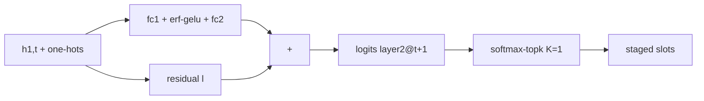

[Paper](https://arxiv.org/abs/2609.18063)
## Waking the MoE on SSD: Serving a 35B MoE at 20 tok/s on a 24 GB Desktop with Edge0

## One-line summary (TL;DR)

Even at 4-bit, a 35B-class MoE occupies 19.5 GB and cannot reside on a 24 GB machine (source: §1). Edge0 keeps expert weights on SSD and reads them with mmap streaming, hides disk latency behind compute with a prerouter that predicts next-layer routing one token ahead, consumes that prediction itself as routing to eliminate drops, and repays int4 + routing-replacement loss with an unmerged recovery LoRA (source: §3.2, §3.3). The result is 20.4 tok/s on the 35B tier on a 24 GB Mac mini M4 Pro, 2.9 GiB peak active memory, and a 3.9-point average gap to the fp16 teacher (source: Tab.1, Tab.2).

## Core idea

The core hypothesis can be stated in one sentence as follows.

> The authors assume that a 35B MoE can be served at practical speed on 24 GB consumer hardware by using a learned prerouter that predicts layer $N+1$ routing one token ahead from layer $N$ state together with an unmerged recovery LoRA served in parallel, thereby overcoming the serialization limit of SSD offloading and 4-bit quantization loss (source: §3.2, §3.3, §5.4).

Three original contributions support this hypothesis (source: §1).

- **Streaming executor that uses SSD as a weight tier**: closer to a new application of an existing methodology + system implementation than a new architectural component. It reads int4 per-layer stacked safetensors via mmap and binds them with OS page cache + LRU + staged pinned-slot double buffering (source: §3.1, Fig.1). It provides four paths (exact, staged, hot, whole-layer) and pins the math contract with the quantized gather kernel element-wise (source: §3.1).
- **Cross-token prerouter where prediction is routing**: a new architectural component + new training technique. Unlike same-token pre-gating, it keeps a full-token lead and makes the staged slot set and the routed set identical by definition (source: §3.2).
- **Unmerged recovery LoRA**: closer to a new application of an existing methodology (QLoRA, distillation) + new theoretical insight about serving time. It computes $y = W_{\text{int4}}(x) + \frac{\alpha}{r} BAx$ as a parallel delta, avoiding the arithmetic loss where 4-bit requantization erases the delta (source: §3.3).

## Background: The problem they solved

The starting point is that the memory wall named by Wulf and McKee in 1995 reappears 30 years later in the decode phase of AI inference (source: §1). Decode moves only a few FLOPs per weight byte read, while the hardware ridge point sits orders of magnitude above, so the bottleneck is the bytes themselves (source: §1).

The authors summarize the SOTA at publication time as follows (source: §2).

- **Dynamic state was compressed, while static weights went to the datacenter.** MLA cut KV state by an order of magnitude (source: §1, §2), sparse attention fixed the horizon (source: §2), and linear state models removed the cache (source: §2). By contrast, absorbing tens of GB of weights with expert parallelism and sharding became the accepted answer (source: §1).
- **Two local solutions stall at 35B.** Quantization has 4-bit as its practical floor, with no post-hoc recovery below it (source: §1, §2). MoE sparsity computes only about 3B parameters per token, but the stored footprint stays at 19.5 GB and occupies an entire 24 GB desktop (source: §1).
- **Offloading only moved the footprint without shrinking it.** llama.cpp `--cpu-moe`, PowerInfer's hot/cold split, the popularity/reuse caches of Mixtral-offloading and MoE-Infinity, and FlexGen's disk extension all went to disk without knowing which experts the next step needs (source: §2).
- **Pre-gated MoE has a short lead.** The schedule that picks block $N+1$ experts after block $N$ attention within the same token meets a streaming engine with per-layer synchronization and 30 ms - 100 ms /step head-evaluation cost, drains the pipeline, and lost even to the LRU baseline (source: §2, §3.2).

In short, the gap is this. The latter half of the memory wall for weights can be solved with placement decisions, yet naive streaming stalls once per layer per token because layer $N+1$ selection must wait for layer $N$ output (source: §1, §3.2). Edge0 breaks this dependency one token ahead with learning (source: §3.2).

## A new approach: Edge0

The full dataflow is condensed in Fig.1 (source: Fig.1).


19.5 GB int4 experts live on the left SSD tier as per-layer stacked safetensors (source: §3.1). The middle streaming pool (OS page cache → LRU → staged slots) reads byte ranges via mmap (source: §3.1). The right frozen int4 decoder stack is joined at a sum node with a parallel LoRA branch $B \cdot A \cdot (\alpha / r)$ (source: Fig.1, §3.3), and the red path where the layer-$N$-owned prerouter head predicts layer $N+1$ @ $t+1$ fills the staged slots (source: Fig.1). The bottom decode timeline shows token $t$ compute overlapping token $t+1$ predictive reads (source: Fig.1).

The four executor paths have clear roles (source: §3.1).

- `exact`: deduplicated on-demand bundle build + stack + quantized gather. This is the accuracy baseline (source: §3.1).
- `staged`: fixed-slot double buffer. The decode workhorse. `take` maps the slot table so indices never leave the GPU, repeated sets reuse cached graph nodes, and `incr_stack` patches only changed slots in place (source: §3.1). It removes the rebuild tax of 40 layers × 3 gate/up/down kinds × 3 weight/scale/bias kinds = 9 stack tensors per layer (source: §3.1).
- `hot`: per-layer LRU-resident hot set. Hits use stacked gather, misses fall back to exact (source: §3.1).
- `whole-layer`: one-shot load for prefill. It replaces 256 × 9 builds with 9 direct reads and overlaps CPU loads with prior-layer GPU execution (source: §3.1).

The math contract computes `down(silu(gate(x)) \cdot up(x))` with the same kernel and pins relative L2 < 1% versus the dequantized reference, with about 0.24% measured residual (source: §3.1). Thanks to this contract, switching paths per layer and per phase does not change outputs (source: §3.1).

Routing math also shares the vendored implementation verbatim (source: Appx.A). Softmax-top-k is $g = \text{softmax}(\ell)$, $inds = \text{top-k}(g, K)$, $w = g[inds] / \sum_{inds} g$ (source: Appx.A). Sigmoid-group keeps the top $G$ groups by group-wise top-2 sums after $\sigma = \text{sigmoid}(\ell)$, with $inds = \text{top-k}(\sigma, K)$, $w = s \cdot \sigma[inds] / (\sum \sigma[inds] + 10^{-20})$ (source: Appx.A). The 8B tier uses $n = 8$, $G = 4$, $s = 2.5$, $K = 8$ (source: Appx.A).

Training runs only on top of what is served. It freezes the base on the dequantized bf16 reconstruction of the 4-bit deployment checkpoint (source: §4).

- **Phase 1: head distillation.** Only the prerouter heads are trained with a loss that mimics the true next-layer router (source: §4).
- **Phase 2: student-path SFT.** LoRA is trained on about 2M rows of teacher-generated text with prerouting turned on, exactly on the served path. LoRA attaches only to attention, linear-attention, and shared experts, never to the streamed routed experts (source: §4). The order is enforced. Heads first, SFT later. This is because the SFT signal would swallow the small head gradients (source: §4).
- **Phase 3: on-policy distillation.** It converges in about 200k rows (1/10 of Phase 2) with reverse KL (mode-seeking) scored by the fp16 original base on generations from the Phase 2 checkpoint + teacher top-k + tail terms (source: §4).

The authors' case for its strengths is consistent (source: §3.2, §3.3, §5.3). A full-token lead turns per-layer synchronization into one flush per step, and since the prediction is consumed as routing, the coverage-versus-quality tradeoff is paid once in training rather than with runtime fallback (source: §3.2). Merge-and-requantize is strictly less faithful because the LoRA delta RMS of $10^{-3}$ sits below the 4-bit group step and is arithmetically erased, so not merging is the exact choice (source: §3.3). And thanks to the frozen base, switching from $K = 8$ to $K = 4$ is a file swap rather than a retraining campaign (source: §4).

## How it works: A concrete example

Let us build a toy example for a graduate student. Put $E = 4$, $K = 1$, a 3-layer decoder, and $d_{\text{model}} = 8$ (conceptual simplification of §3.2). Suppose at token $t$ we have passed layer 1 and obtained the post-attention norm output $h_{1,t}$ (dimension 8) (source: §3.2).

The prerouter head input is the concat of the hidden state plus two top-k one-hots (source: §3.2). The real 35B tier uses $2048 + 2 \times 256 = 2560$ dimensions with hidden width 512 (source: §3.2). In the toy it becomes $8 + 2 \times 4 = 16$ dimensions.

```text
h = [0.1, -0.2, ..., 0.05]  # 8-dim
one_hot_now = [0,1,0,0]     # layer 1 picked expert 1 for this token
one_hot_prev = [1,0,0,0]    # previous token picked expert 0
feat = concat(h, one_hot_now, one_hot_prev)  # 16-dim
```

The head is `fc1 → erf-gelu → fc2` + linear residual $\ell$ (source: §3.2). $\ell$ is warm-started from the next-layer router weights, so the starting point of training is equivalent to applying the next router directly to the current hidden state (source: §3.2). The output is the next-token logits $\hat{\ell}_{2,t+1}$ for layer 2 (dimension 4) (source: §3.2).



At decode time, layer 2 routes with this $\hat{\ell}$ in place of its own gate through the same softmax-topk math (source: §3.2). The staged slot set and the routed set are equal by definition, so there are no drops (source: §3.2). SSD reads overlap the current forward pass (source: Fig.1). The real 35B tier consumes heads at layers 7-38 out of 33 heads owned by 6-38, so 32 of 40 layers are predictively streamed, and the 8B tier consumes heads at layers 8-23 out of 16 heads owned by 7-22, so 16 of 24 layers are streamed (source: §3.2). The layer 39 routing predicted by the layer-38-owned head has no staged consumer and is only shipped together (source: §3.2).

There is feature drift. At training time the input one-hots are base-router choices, but at decode time the head's own predictions replace them (source: §3.2). Without retraining the heads, the recovery LoRA trained on the student path sees the deployed distribution, and quality is priced together with int4 in the measurements (source: §3.2, §5.2).

Prefill does not predict. Since it hits every expert in a layer, it takes the whole-layer path (source: §3.2).

### Secret weapon: What happens when you turn off the prerouter

If forced to pick one, it is the prerouter. Under same-session rotation A/B, same-token-sequence replay, and 3-round median conditions, the deltas are as follows (source: §5.1, Tab.3, Tab.4).

| $K$ | on-demand tok/s | prerouter tok/s | $\Delta$ | Mechanism |
|---:|---:|---:|:--|:--|
| 2 | 4.8 tok/s | 8.6 tok/s | +80% | main-thread blocking 154.9 ms → 46.5 ms /step (source: §5.3) |
| 4 | 3.5 tok/s | 6.4 tok/s | +82% | blocking 244.0 ms → 101.9 ms /step, bytes up 16% 50.9 MiB → 58.9 MiB /step (source: §5.3, Tab.4) |
| 8 | 1.8 tok/s | 3.3 tok/s | +84% | blocking 575.0 ms → 211.6 ms /step, bytes flat 126.9 MiB → 125.1 MiB /step (source: §5.3, Tab.4) |

Why it happens. The resource is not saturated; serialized load latency disappears. Disk reads are at most 12% of a step, the process uses about 1 of 8 cores, and the GPU is at 35% - 41% (source: §5.3). The gain is the exposed cold-read time of the storage tier, and the head only needs to supply the right set (source: §5.3). Adjacent tokens overlap in only about 25% of the expert set per layer, so prefetch reuse sets the bottleneck (source: §5.3).

The second secret weapon is not merging. Only 34% survives at the weight level in attention projections, 2% in dense projections, and 18% at the logit level (source: §3.3). The measurement formula is $1 - \|U-M\| / \|U-B\|$ with $U =$ unmerged, $M =$ merged, $B =$ base (source: §3.3). The unmerged path is strictly more faithful with a 42 MB adapter and unmeasurable decode-time cost (source: §3.3). The third is `incr_stack`, giving +34% decode over the same pipeline and 6.8 tok/s → 12.5 tok/s for the finished pipeline versus $K = 8$ native routing (source: Appx.B). But these figures come from a different campaign and setup than the §5.3 sweep, so they are not directly comparable to Tab.3 (source: Appx.B).

## Performance validation: Key results

The key metrics are quality (5 public benchmarks), decode throughput (tok/s), and peak active memory (GiB) (source: §5.1, Tab.1, Tab.2). Quality uses the same OpenCompass setup with no timing, while throughput and memory are single-device (source: §5.1). Tier profiles are on a 24 GB Mac mini M4 Pro, while prerouter A/B runs on a 16 GB MacBook M2 that cannot fit the 18.4 GiB checkpoint (19.5 GB int4 base + 0.2 GB adapters and heads) (source: §5.1). Single-shot benchmarks vary ±40% run-to-run and up to 2.3x across sessions, so cross-session numbers are not used as evidence (source: §5.1).

Release tier specifications are as follows (source: Tab.1).

- **edge0-35b**: based on Qwen3.6-35B-A3B, 40 × 256 + shared, about 3B active /token, $K = 4$, softmax-topk, int4 affine g64, 19.5 GB on disk, 33 heads, LoRA $r = 16$, $\alpha = 32$, 20.4 tok/s decode, 113 tok/s / 140 tok/s cold/warm prefill, 2.9 GiB peak (source: Tab.1).
- **edge0-8b**: based on Ling 3.0 tiny (MLA+MoE), 24 × 128 + shared, about 1.2B active /token, $K = 8$, sigmoid-group (8×4, ×2.5), int4 affine g64, 4.5 GB on disk, 16 heads, LoRA $r = 16$, $\alpha = 32$, 28.0 tok/s decode, 500 tok/s / 1102 tok/s prefill, 1.5 GiB peak (source: Tab.1). It uses a shared 64-bundle LRU (about 1.5 GiB) with separate staged slot structures, and growing LRU to 1024 bundles uses about 0.9 GiB and reaches 31.8 tok/s (source: Tab.1).

The quality figures and table are the success evidence the authors present (source: Fig.2, Tab.2).


| Benchmark | edge0-35b (int4) | Qwen3.6 (fp16) | edge0-8b (int4) | Ling 3.0 tiny (fp16) |
|---|---:|---:|---:|---:|
| AIME 2026 | 86.6 | 92.7 | 63.3 | 73.3 |
| HumanEval | 90.9 | 95.1 | 91.5 | 92.7 |
| GPQA-Diamond | 79.8 | 81.8 | 70.7 | 71.2 |
| MMLU-Pro | 81.0 | 84.6 | 70.1 | 65.8 |
| IFBench | 57.9 | 61.7 | 53.9 | 60.6 |
| Average | 79.2 | 83.2 | 69.9 | 72.7 |

(source: Tab.2). The gap averages 3.9 points per benchmark (35b) and 2.8 points (8b), treated as quality matching to the fp16 base (source: §5.2, Fig.2). On 8B MMLU-Pro the student leads by 4.3 points (source: §6).

Fig.3 compresses the breakdown of the prerouter gain (source: Fig.3).


(a) is the throughput jump from Tab.3 above, and (b) is the phenomenon of reading the same cold pages with fewer, larger, colder loads (source: Fig.3, Tab.4). At $K = 8$, 0.32 MiB /load·20% cold → 1.40 MiB /load·90% cold; at $K = 4$, 0.27 MiB /load·17% cold → 1.32 MiB /load·84% cold; at $K = 2$, 0.31 MiB /load·20% cold → 1.53 MiB /load·98% cold (source: Tab.4). Load cost fits $1.17\text{ ms} + 1.33\text{ ms} \times \text{cold fraction}$ on the $K = 8$ pair, reproducing all measured points within 0.13 ms and the prerouter points within 0.07 ms (source: §5.3).

Memory cost splits as follows (source: §5.3). The unreclaimable MLX allocation that must fit to run is 1.72 GiB, 1.73 GiB, 1.79 GiB on-demand versus 2.33 GiB, 2.60 GiB, 3.22 GiB with the prerouter ($K = 2, 4, 8$) (source: §5.3). Peak RSS including file-backed pages is 5.29 GiB, 6.12 GiB, 6.18 GiB on-demand versus 4.91 GiB, 5.61 GiB, 6.39 GiB with the prerouter (source: §5.3). The rest is reclaimable page cache that gets pushed into residency (source: §5.3). At $K = 8$, the price is 1.43 GiB more residency with the prerouter and 1.15 GiB less page cache (source: §5.3).

The strongest comparison is against resident serving. On the same machine and decode protocol, resident vanilla mlx-lm holds 18.2 GiB and runs 3.9 tok/s, while Edge0 $K = 4$ runs 20.4 tok/s at 2.9 GiB, about 5x (source: §3.1, §5.4). The authors diagnose the resident path as paging because it leaves no room for KV cache and the OS (source: §5.4). On the 35B tier with the prerouter off, it still runs 19.9 tok/s, so the difference is small on a 24 GB machine (source: Tab.1). In other words, the prerouter gain explodes on 16 GB setups where the checkpoint does not fit (source: §5.3, Tab.1).

Points where it does not win are also clear in the critical comparison (source: Tab.2, §6). A gap remains in long reasoning: 6.1 points on 35B AIME and 10.0 points on 8B AIME, with the remaining 8B benchmarks within 6.7 points (source: §6). Reasoning is where int4 + routing replacement remains visible (source: §6). It is also frankly reported that distilling alone to run student routing produces repetitive and collapsed text and needs added SFT to become coherent (source: §4).

## Our take: Strengths, limitations, and why this matters

The strength is in slicing the problem exactly. Byte bottleneck is solved with placement (source: §3.1), dependency with learned prediction (source: §3.2), quality debt with student-path distillation (source: §4), and adapter arithmetic is kept in serving form (source: §3.3). Bit-identical pinning of routing math and element-wise validation per path (source: §3.1, Appx.A), plus the same-session interleaved A/B and page-cache warmup and matched-cache-budget methodology (source: §5.1), raise confidence as a systems paper.

The authors state the limitations directly (source: §6).

- It covers only single-request FIFO serial serving. Batching changes the expert working set, so the profile does not apply (source: §6).
- Decode is CPU-bound rather than storage-bound. 44 ms /step graph building for a 40-layer forward pass is the floor and does not move with storage optimization (source: §6, Appx.B).
- The prerouter gain shrinks with hot caches and fast storage and is capped by reuse (about 25% overlap) (source: §6, §5.3).
- Quality loss concentrates in long-chain reasoning (source: §6).
- MLX is the only implementation and CUDA is architecture-only (source: §6).

Three potential limitations stand out. First, the stager double-holds bundle and stack tensor views, wasting about 0.45 GiB at $K = 8$, and incremental fill remains main-thread synchronous at 62.5 ms /step (source: §5.3). Second, increased resident memory eats page cache, so the cost of moving bytes early with prefetch is large (source: §5.3). Third, the training corpus is described only as about 2M rows teacher-generated plus about 200k rows on-policy, with no tokenizer, cleaning, license, seed, schedule, or evaluation-prompt details, so the reproduction checklist is weak (source: §4, §5.1).

Still, it matters because it shows with numbers that the second half of the 35B MoE memory wall can be solved without a datacenter. 2.9 GiB residency against a 19.5 GB checkpoint (source: Tab.1), 5x decode over resident (source: §5.4), and +80% - +84% on a 16 GB machine (source: Tab.3) all come from placement + prediction + unmerged, not batching or accuracy tricks.

## What's next?: Where to go from here

The authors' unclaimed levers are the next steps (source: §5.3). Drop one of the bundle/stack duplicates to reclaim about 0.45 GiB (source: §5.3), move incremental fill off the main thread so $K = 8$ no longer waits 62.5 ms /step (source: §5.3), and lower the 44 ms /step floor with kernel-level optimization such as graph amortization (source: §6, Appx.B).

A reasonable extension given the limits is to split the serving layer. Without concurrency and batch working-set modeling, the engine alone cannot escape FIFO (source: §6). A CUDA implementation behind a backend facade (source: §3, §6), and combination with KV compression such as MLA, are the paths that extend the memory headroom seen on 8B to 35B (source: §2, Tab.1). On quality, student-path reasoning-specific distillation aimed at the 6.1-point (35b) and 10.0-point (8b) reasoning gaps remains (source: §6, Tab.2).

The framework, checkpoints, and adapters are released under Apache-2.0 (source: §7). The closing line that the machine on your desk is already large enough is rhetoric, but this time it comes with numbers attached: 2.9 GiB, 20.4 tok/s, 3.9 points (source: Tab.1, Tab.2, §7).


<!-- verbatim-tables -->

## Tables from the paper

> Tables converted mechanically from the arXiv e-print LaTeX source. The numbers are the paper's own and did not pass through a model.

**Table 1. The two public release tiers, with the released checkpoint and adapters on a Mac mini M4 Pro 24 GB. Decode and memory are the latest paired measurements (each arm in its own process, warm, arm order rotated, medians over 3 rounds); memory is the MLX allocator peak at short contexts, since expert weights stream from SSD and only the decoder's expert cache is resident. Checkpoint on disk is the int4 base; the adapter and prerouter heads add 0.2 GB. The 35B row is the $K{=}4$ production profile of \S; the 8B row is its low-memory release profile, with a shared LRU of 64 expert bundles (${\approx}1.5$ GiB) separate from the per-layer staged slots; enlarging that LRU to 1024 bundles costs ${\approx}0.9$ GiB of the budget and lifts decode to 31.8 tok/s. Prefill warm is measured within one process on a 3.1k-token prompt, cold is the first request after process start. Disabling the prerouter on the 35B tier measures 19.9 tok/s.**

|  | `edge0-35b` | `edge0-8b` |
|---|---|---|
| Base model | Qwen3.6-35B-A3B | Ling 3.0 tiny (MLA+MoE) |
| Layers $\times$ experts | $40 \times 256$ + shared | $24 \times 128$ + shared |
| Active params / token | $\approx$3B | $\approx$1.2B |
| Routing width $K$ | 4 | 8 |
| Routing family | softmax-topk | sigmoid-group ($8{\times}4$, $\times2.5$) |
| Quantization | int4 affine g64 | int4 affine g64 |
| Checkpoint on disk | 19.5 GB | 4.5 GB |
| Prerouter heads | 33 | 16 |
| LoRA | $r{=}16,\ \alpha{=}32$ | $r{=}16,\ \alpha{=}32$ |
| Decode (tok/s) | 20.4 | 28.0 |
| Prefill cold / warm (tok/s) | 113 / 140 | 500 / 1102 |
| Peak active memory | 2.9 GiB | 1.5 GiB |

**Table 2. Quality vs fp16 base models (max 100, OpenCompass).**

| Benchmark | `edge0-35b` (int4) | Qwen3.6 (fp16) | `edge0-8b` (int4) | Ling 3.0 tiny (fp16) |
|---|---|---|---|---|
| AIME 2026 | 86.6 | 92.7 | 63.3 | 73.3 |
| HumanEval | 90.9 | 95.1 | 91.5 | 92.7 |
| GPQA-Diamond | 79.8 | 81.8 | 70.7 | 71.2 |
| MMLU-Pro | 81.0 | 84.6 | 70.1 | 65.8 |
| IFBench | 57.9 | 61.7 | 53.9 | 60.6 |
| Average | 79.2 | 83.2 | 69.9 | 72.7 |

**Table 3. The advantage, on the same machine and in the same session. Decode throughput with on-demand streaming against every staged layer prefetching one token ahead.**

| $K$ | on-demand | prerouter | gain |
|---|---|---|---|
| 2 | 4.8 | **8.6** | $+80\%$ |
| 4 | 3.5 | **6.4** | $+82\%$ |
| 8 | 1.8 | **3.3** | $+84\%$ |

**Table 4. What the price is made of (same session, same arms). Both arms move within a few percent of the same bytes at $K{=}2$ and $K{=}8$ (29.5 against 30.4 and 125.1 against 126.9 MiB, prerouter against on-demand); at $K{=}4$ the prerouter arm reads 16% more (58.9 against 50.9 MiB). The prerouter reads them in fewer, larger, colder loads.**

| $K$ | arm | loads/step | MiB/step | MiB/load | cold | ms/load |
|---|---|---|---|---|---|---|
| 2 | on-demand | 99.3 | 30.4 | 0.31 | 20% | 1.56 |
| 2 | prerouter | 19.3 | 29.5 | **1.53** | **98%** | 2.41 |
| 4 | on-demand | 189.4 | 50.9 | 0.27 | 17% | 1.29 |
| 4 | prerouter | 44.7 | 58.9 | **1.32** | **84%** | 2.28 |
| 8 | on-demand | 398.6 | 126.9 | 0.32 | 20% | 1.44 |
| 8 | prerouter | 89.5 | 125.1 | **1.40** | **90%** | 2.36 |


> Figures in this post are taken from the original arXiv:2609.18063 (CC BY 4.0). Only size and format were changed.
