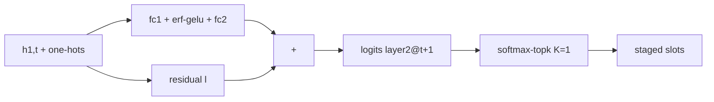

[논문 링크](https://arxiv.org/abs/2609.18063)
## SSD에 산 MoE를 깨우다: 24 GB 데스크톱에서 35B MoE를 20 tok/s로 서빙하는 Edge0

## 한 줄 요약 (TL;DR)

35B급 MoE는 4-bit로도 19.5 GB 를 차지해 24 GB 머신에 상주하지 못한다 (근거: §1). Edge0는 엑스퍼트 가중치를 SSD에 두고 mmap 스트리밍으로 읽되, 다음 레이어 라우팅을 한 토큰 앞서 예측하는 프리라우터(prerouter)로 디스크 지연을 컴퓨트 뒤에 숨기고, 그 예측 자체를 라우팅으로 소비해 드롭을 없애며, int4 + 라우팅 교체 손실을 병합하지 않은(unmerged) 복구 LoRA로 되갚는다 (근거: §3.2, §3.3). 결과는 Mac mini M4 Pro 24 GB 에서 35B 티어 20.4 tok/s , 피크 활성 메모리 2.9 GiB , fp16 교사 대비 평균 3.9 포인트 갭이다 (근거: Tab.1, Tab.2).

## 핵심 아이디어

핵심 가설을 한 문장으로 정리하면 다음과 같다.

> 저자들은 레이어 $N$ 의 상태로 레이어 $N+1$ 의 라우팅을 한 토큰 앞서 예측하는 학습된 프리라우터와 병합하지 않고 서빙하는 복구 LoRA를 사용함으로써 SSD 오프로딩의 직렬화 한계와 4-bit 양자화 손실을 극복하고 24 GB 소비자 하드웨어에서 35B MoE를 실용 속도로 서빙할 수 있다고 가정한다 (근거: §3.2, §3.3, §5.4).

이 가설을 떠받치는 독창적 기여는 세 가지로 갈라진다 (근거: §1).

- **SSD를 가중치 티어로 쓰는 스트리밍 실행기** : 새로운 아키텍처 구성요소가 아니라 기존 방법론의 새로운 적용 + 시스템 구현에 가깝다. int4 레이어별 스택형 safetensors를 mmap으로 읽고 OS 페이지 캐시 + LRU + 스테이지드 고정 슬롯 더블 버퍼로 묶는다 (근거: §3.1, Fig.1). 네 가지 경로(exact, staged, hot, whole-layer)를 두고 양자화 gather 커널과 수학 계약을 element-wise로 고정한다 (근거: §3.1).
- **예측이 곧 라우팅(prediction-as-routing)인 크로스 토큰 프리라우터** : 새로운 아키텍처 구성요소 + 새로운 학습 기법에 해당한다. 동일 토큰 내 pre-gating과 달리 풀 토큰 리드를 두고, staged 슬롯 집합과 routed 집합을 정의상 일치시킨다 (근거: §3.2).
- **병합하지 않는 복구 LoRA** : 기존 방법론(QLoRA, distillation)의 새로운 적용 + 서빙 시점에 대한 새로운 이론적 통찰에 가깝다. $y = W_{\text{int4}}(x) + \frac{\alpha}{r} BAx$ 를 병렬 델타로 계산해 4-bit 재양자화가 델타를 지우는 산술적 손실을 피한다 (근거: §3.3).

## 배경: 그들이 해결한 문제

1995년 Wulf와 McKee가 명명한 메모리 월이 30년 뒤 AI 추론의 디코드 단계에서 재현됐다는 것이 출발점이다 (근거: §1). 디코드는 읽는 가중치 바이트당 수 FLOPs 만 움직이는데 하드웨어 ridge point는 수 order 위에 있어 병목은 바이트 자체다 (근거: §1).

저자들이 그리는 출판 시점 SOTA는 이렇게 요약된다 (근거: §2).

- **동적 상태는 압축됐고, 정적 가중치는 데이터센터로 갔다.** MLA가 KV 상태를 한 order 줄였고 (근거: §1, §2), sparse attention이 horizon을 고정했으며 (근거: §2), 선형 상태 모델이 캐시를 없앴다 (근거: §2). 반면 수십 GB 가중치는 expert parallelism과 샤딩으로 흡수하는 것이 정답이 됐다 (근거: §1).
- **로컬 해법 두 가지는 35B에서 막힌다.** 양자화는 4-bit가 실용 하한이고 그 아래는 사후 복구가 안 된다 (근거: §1, §2). MoE 희소성은 토큰당 약 3B 파라미터만 계산하게 하지만 저장량은 19.5 GB 그대로라 24 GB 데스크톱 전체를 잠식한다 (근거: §1).
- **오프로딩은 footprint를 옮길 뿐 줄이지 못했다.** llama.cpp `--cpu-moe` , PowerInfer의 hot/cold 분리, Mixtral-offloading과 MoE-Infinity의 popularity/reuse 캐시, FlexGen의 디스크 확장은 모두 다음 스텝에 필요한 엑스퍼트를 모른 채 디스크까지 갔다 (근거: §2).
- **Pre-gated MoE는 리드가 짧다.** 블록 $N$ 어텐션 뒤에 블록 $N+1$ 엑스퍼트를 같은 토큰 안에서 고르는 스케줄은 스트리밍 엔진과 만나면 레이어당 동기화와 head 평가 30 ms - 100 ms /step 비용으로 파이프라인을 비우고, LRU 베이스라인에도 졌다 (근거: §2, §3.2).

즉 공백은 이것이다. 가중치 절반의 메모리 월을 placement 결정으로 풀면서도, 레이어 $N+1$ 선택이 레이어 $N$ 출력을 기다려야 한다는 의존성 때문에 naive 스트리밍이 토큰당 레이어당 한 번씩 스톨된다는 점이다 (근거: §1, §3.2). Edge0는 이 의존성을 학습으로 한 토큰 앞서 끊는다 (근거: §3.2).

## 새로운 접근법: Edge0

전체 데이터플로는 Fig.1에 집약돼 있다 (근거: Fig.1).


왼쪽 SSD 티어에 19.5 GB int4 엑스퍼트가 레이어별 스택형 safetensors로 산다 (근거: §3.1). 가운데 스트리밍 풀(OS 페이지 캐시 → LRU → staged 슬롯)이 바이트 범위를 mmap으로 읽는다 (근거: §3.1). 오른쪽 동결 int4 디코더 스택은 병렬 LoRA 가지 $B \cdot A \cdot (\alpha / r)$ 와 합 노드에서 합쳐지고 (근거: Fig.1, §3.3), 레이어 $N$ 소유 프리라우터 head가 레이어 $N+1$ @ $t+1$ 을 예측하는 빨간 경로가 staged 슬롯을 채운다 (근거: Fig.1). 하단 디코드 타임라인은 토큰 $t$ 컴퓨트와 토큰 $t+1$ 예측 읽기가 겹침을 보여준다 (근거: Fig.1).

실행기 네 경로는 역할이 명확하다 (근거: §3.1).

- `exact` : 중복 제거 온디맨드 번들 빌드 + 스택 + 양자화 gather. 정확도 베이스라인이다 (근거: §3.1).
- `staged` : 고정 슬롯 더블 버퍼. 디코드 워크호스다. `take` 으로 슬롯 테이블을 매핑해 인덱스가 GPU를 떠나지 않고, 반복 집합은 캐시된 그래프 노드를 재사용하며, `incr_stack` 으로 바뀐 슬롯만 in-place로 고친다 (근거: §3.1). 40개 레이어 × gate/up/down 3종 × weight/scale/bias 3종 = 레이어당 9개 스택 텐서 재빌드 세금을 없앤다 (근거: §3.1).
- `hot` : 레이어당 LRU 상주 hot 집합. 히트는 스택형 gather, 미스는 exact 폴백이다 (근거: §3.1).
- `whole-layer` : 프리필용 한 방 로드. 256 × 9 빌드 대신 9회 직접 읽고 CPU 로드를 이전 레이어 GPU 실행과 겹친다 (근거: §3.1).

수학 계약은 `down(silu(gate(x)) \cdot up(x))` 를 동일 커널로 계산하고 dequantized 참조 대비 relative L2 < 1% , 실측 잔차 약 0.24% 를 핀한다 (근거: §3.1). 이 계약 덕에 레이어별·페이즈별 경로 전환이 출력을 바꾸지 않는다 (근거: §3.1).

라우팅 수학도 vendored 구현을 verbatim으로 공유한다 (근거: Appx.A). Softmax-top-k는 $g = \text{softmax}(\ell)$ , $inds = \text{top-k}(g, K)$ , $w = g[inds] / \sum_{inds} g$ 다 (근거: Appx.A). Sigmoid-group은 $\sigma = \text{sigmoid}(\ell)$ 뒤 그룹별 top-2 합으로 상위 $G$ 그룹을 살리고 $inds = \text{top-k}(\sigma, K)$ , $w = s \cdot \sigma[inds] / (\sum \sigma[inds] + 10^{-20})$ 다 (근거: Appx.A). 8B 티어는 $n = 8$ , $G = 4$ , $s = 2.5$ , $K = 8$ 이다 (근거: Appx.A).

학습은 서빙되는 것 위에서만 한다. 4-bit 디플로이 체크포인트의 dequantized bf16 재구성 위에 베이스를 동결하고 돌린다 (근거: §4).

- **Phase 1: head 증류.** 다음 레이어 진짜 라우터를 모방하는 손실로 프리라우터 head만 학습한다 (근거: §4).
- **Phase 2: student 경로 SFT.** 프리라우팅을 켠 served 경로 그대로 약 2M 행 교사 생성 텍스트로 LoRA를 학습한다. LoRA는 어텐션, linear-attention, shared-expert에만 붙고 스트리밍되는 routed 엑스퍼트에는 붙지 않는다 (근거: §4). 순서가 강제됐다. head 먼저, SFT 나중이다. SFT 신호가 작은 head 그래디언트를 삼키기 때문이다 (근거: §4).
- **Phase 3: on-policy 증류.** Phase 2 체크포인트가 생성하고 fp16 원본 베이스가 스코어하는 reverse KL(모드 추구) + 교사 top-k + tail 항으로 약 200k 행(Phase 2의 1/10)으로 수렴한다 (근거: §4).

저자 관점의 강점 논거는 일관된다 (근거: §3.2, §3.3, §5.3). 풀 토큰 리드는 레이어당 동기화를 스텝당 1회 flush로 바꾸고, 예측을 라우팅으로 소비하니 커버리지 대 품질 트레이드오프를 런타임 폴백이 아니라 학습 한 번으로 지불한다 (근거: §3.2). 병합-재양자화는 LoRA 델타 RMS $10^{-3}$ 가 4-bit 그룹 스텝 아래에 있어 산술적으로 지워지니 병합하지 않는 것이 엄밀히 더 충실하다 (근거: §3.3). 그리고 베이스 동결 덕에 $K = 8$ 에서 $K = 4$ 로 바꾸는 것이 재학습 캠페인이 아니라 파일 스왑이다 (근거: §4).

## 작동 원리: 구체적인 예시로 살펴보기

대학원생을 위한 토이 예시를 만들자. $E = 4$ , $K = 1$ , 디코더 3층, $d_{\text{model}} = 8$ 이라 두자 (근거: §3.2 개념 단순화). 토큰 $t$ 에서 레이어 1을 지나 post-attention norm 출력 $h_{1,t}$ (차원 8)가 나왔다고 하자 (근거: §3.2).

프리라우터 head 입력은 hidden + 두 개 top-k one-hot의 concat이다 (근거: §3.2). 실제 35B 티어는 $2048 + 2 \times 256 = 2560$ 차원, 은닉폭 512 다 (근거: §3.2). 토이에서는 $8 + 2 \times 4 = 16$ 차원이 된다.

```text
h = [0.1, -0.2, ..., 0.05]  # 8-dim
one_hot_now = [0,1,0,0]     # 이번 토큰 레이어 1이 엑스퍼트 1 선택
one_hot_prev = [1,0,0,0]    # 이전 토큰은 엑스퍼트 0 선택
feat = concat(h, one_hot_now, one_hot_prev)  # 16-dim
```

Head는 `fc1 → erf-gelu → fc2` + 선형 residual $\ell$ 이다 (근거: §3.2). $\ell$ 은 다음 레이어 라우터 가중치로 warm-start돼 학습 시작점은 다음 라우터를 현재 hidden에 직접 적용하는 것과 같다 (근거: §3.2). 출력은 레이어 2의 다음 토큰용 로짓 $\hat{\ell}_{2,t+1}$ (차원 4)이다 (근거: §3.2).



디코드 시 레이어 2는 자신의 gate 대신 이 $\hat{\ell}$ 을 동일 softmax-topk 수학에 넣어 라우팅한다 (근거: §3.2). staged 슬롯 집합과 routed 집합이 정의상 같아 드롭이 없다 (근거: §3.2). SSD 읽기는 현재 forward pass와 겹친다 (근거: Fig.1). 실제 35B 티어는 owner 6-38의 33개 head 중 레이어 7-38에서 소비해 40층 중 32층이 예측 스트리밍되고, 8B 티어는 owner 7-22의 16개 head 중 레이어 8-23에서 소비해 24층 중 16층이 스트리밍된다 (근거: §3.2). 레이어 38 소유 head가 예측하는 레이어 39 라우팅은 staged 소비자가 없어 함께 배송만 된다 (근거: §3.2).

특징 드리프트(feature drift)가 있다. 학습 때는 입력 one-hot이 베이스 라우터 선택이지만 디코드 때는 head 자신의 예측이 그 자리를 대체한다 (근거: §3.2). head를 재학습하지 않고, student 경로에서 학습된 복구 LoRA가 배치된 분포를 보고 품질 측정에서 int4와 함께 가격된다 (근거: §3.2, §5.2).

프리필은 예측하지 않는다. 레이어의 모든 엑스퍼트에 히트하니 whole-layer 경로를 탄다 (근거: §3.2).

### 비밀 병기: 프리라우터를 끄면 무슨 일이 생기나

하나를 고른다면 프리라우터다. 동일 세션 회전 A/B, 동일 토큰 시퀀스 리플레이, 3라운드 median 조건에서 델타는 다음과 같다 (근거: §5.1, Tab.3, Tab.4).

| $K$ | on-demand tok/s | prerouter tok/s | $\Delta$ | 메커니즘 |
|---:|---:|---:|:--|:--|
| 2 | 4.8 tok/s | 8.6 tok/s | +80% | 메인 스레드 블로킹 154.9 ms → 46.5 ms /step (근거: §5.3) |
| 4 | 3.5 tok/s | 6.4 tok/s | +82% | 블로킹 244.0 ms → 101.9 ms /step, 바이트는 16% 증가 50.9 MiB → 58.9 MiB /step (근거: §5.3, Tab.4) |
| 8 | 1.8 tok/s | 3.3 tok/s | +84% | 블로킹 575.0 ms → 211.6 ms /step, 바이트는 126.9 MiB → 125.1 MiB /step 로 동등 (근거: §5.3, Tab.4) |

왜 생기나. 자원이 포화된 것이 아니라 직렬화된 로드 지연이 사라졌기 때문이다. 디스크 읽기는 스텝의 최대 12% , 프로세스는 8코어 중 약 1코어, GPU는 35% - 41% 다 (근거: §5.3). 이득은 스토리지 티어의 노출된 cold-read 시간만큼이고 head는 올바른 집합만 공급하면 된다 (근거: §5.3). 인접 토큰은 레이어당 약 25% 만 엑스퍼트 집합이 겹쳐 프리페치 재사용이 병목을 정한다 (근거: §5.3).

두 번째 비밀 병기는 병합하지 않음이다. 어텐션 프로젝션에서 가중치 레벨 34% , dense 프로젝션에서 2% , 로짓 레벨에서 18% 만 살아남는다 (근거: §3.3). 측정식은 $1 - \|U-M\| / \|U-B\|$ 이며 $U =$ unmerged, $M =$ merged, $B =$ base다 (근거: §3.3). 병합하지 않은 경로는 어댑터 42 MB , 디코드 시간 측정 불가 수준으로 엄밀히 더 충실하다 (근거: §3.3). 세 번째는 `incr_stack` 으로, 동일 파이프라인 대비 +34% 디코드, $K = 8$ 네이티브 라우팅 대비 완성 파이프라인 6.8 tok/s → 12.5 tok/s 다 (근거: Appx.B). 단 이 수치는 §5.3 스위프와 다른 캠페인·다른 설정이라 Tab.3과 직접 비교 불가다 (근거: Appx.B).

## 성능 검증: 주요 결과

핵심 지표는 품질(5개 공개 벤치), 디코드 처리량(tok/s), 피크 활성 메모리(GiB)다 (근거: §5.1, Tab.1, Tab.2). 품질은 OpenCompass 동일 설정, 타이밍 없음이고 처리량·메모리는 단일 디바이스다 (근거: §5.1). 티어 프로파일은 Mac mini M4 Pro 24 GB , 프리라우터 A/B는 18.4 GiB 체크포인트(19.5 GB int4 베이스 + 0.2 GB 어댑터·head)가 안 들어가는 MacBook M2 16 GB 다 (근거: §5.1). 싱글샷 벤치의 런투런 편차 ±40% , 세션 간 최대 2.3배라 세션 간 수치는 증거로 쓰지 않는다 (근거: §5.1).

릴리스 티어 사양은 다음과 같다 (근거: Tab.1).

- **edge0-35b** : Qwen3.6-35B-A3B 기반, 40 × 256 + shared, 활성 약 3B /token, $K = 4$ , softmax-topk, int4 affine g64, 디스크 19.5 GB , head 33개, LoRA $r = 16$ , $\alpha = 32$ , 디코드 20.4 tok/s , 프리필 cold/warm 113 tok/s / 140 tok/s , 피크 2.9 GiB (근거: Tab.1).
- **edge0-8b** : Ling 3.0 tiny(MLA+MoE) 기반, 24 × 128 + shared, 활성 약 1.2B /token, $K = 8$ , sigmoid-group(8×4, ×2.5), int4 affine g64, 디스크 4.5 GB , head 16개, LoRA $r = 16$ , $\alpha = 32$ , 디코드 28.0 tok/s , 프리필 500 tok/s / 1102 tok/s , 피크 1.5 GiB (근거: Tab.1). 공유 LRU 64번들(약 1.5 GiB)과 별도 staged 슬롯 구조이며 LRU를 1024번들로 키우면 약 0.9 GiB 를 쓰고 31.8 tok/s 다 (근거: Tab.1).

품질 그림과 표가 저자들이 내세우는 성공 증거다 (근거: Fig.2, Tab.2).


| Benchmark | edge0-35b (int4) | Qwen3.6 (fp16) | edge0-8b (int4) | Ling 3.0 tiny (fp16) |
|---|---:|---:|---:|---:|
| AIME 2026 | 86.6 | 92.7 | 63.3 | 73.3 |
| HumanEval | 90.9 | 95.1 | 91.5 | 92.7 |
| GPQA-Diamond | 79.8 | 81.8 | 70.7 | 71.2 |
| MMLU-Pro | 81.0 | 84.6 | 70.1 | 65.8 |
| IFBench | 57.9 | 61.7 | 53.9 | 60.6 |
| Average | 79.2 | 83.2 | 69.9 | 72.7 |

(근거: Tab.2). 평균 벤치당 갭 3.9 포인트(35b), 2.8 포인트(8b)로 fp16 베이스와 품질 매칭으로 간주한다 (근거: §5.2, Fig.2). 8B MMLU-Pro는 학생이 4.3 포인트 앞선다 (근거: §6).

프리라우터 이득의 내역은 Fig.3이 압축한다 (근거: Fig.3).


(a)는 위 Tab.3의 처리량 점프, (b)는 같은 cold 페이지를 더 적고 크고 차가운 로드로 읽는 현상이다 (근거: Fig.3, Tab.4). $K = 8$ 에서 로드당 0.32 MiB /load·20% cold → 1.40 MiB /load·90% cold, $K = 4$ 에서 0.27 MiB /load·17% cold → 1.32 MiB /load·84% cold, $K = 2$ 에서 0.31 MiB /load·20% cold → 1.53 MiB /load·98% cold다 (근거: Tab.4). 로드 비용은 $1.17\text{ ms} + 1.33\text{ ms} \times \text{cold fraction}$ 으로 $K = 8$ 쌍에 핏돼 전 측정점을 0.13 ms 이내, 프리라우터 점을 0.07 ms 이내로 재현한다 (근거: §5.3).

메모리 가격은 이렇게 갈린다 (근거: §5.3). 돌아가기 위해 맞아야 하는 unreclaimable MLX 할당은 on-demand 1.72 GiB , 1.73 GiB , 1.79 GiB 대비 프리라우터 2.33 GiB , 2.60 GiB , 3.22 GiB ($K = 2, 4, 8$)다 (근거: §5.3). 파일 backed 페이지 포함 RSS 피크는 on-demand 5.29 GiB , 6.12 GiB , 6.18 GiB 대비 프리라우터 4.91 GiB , 5.61 GiB , 6.39 GiB 다 (근거: §5.3). 나머지는 reclaimable 페이지 캐시라 상주로 밀려난다 (근거: §5.3). $K = 8$ 에서 프리라우터가 1.43 GiB 더 상주하고 페이지 캐시가 1.15 GiB 잃는 것이 그 대가다 (근거: §5.3).

가장 강한 비교는 상주 서빙과다. 동일 머신·동일 디코드 프로토콜에서 19.5 GB 상주 바닐라 mlx-lm은 18.2 GiB 를 잡고 3.9 tok/s , Edge0 $K = 4$ 는 2.9 GiB 에서 20.4 tok/s 로 약 5배다 (근거: §3.1, §5.4). 저자들은 상주 경로가 KV 캐시와 OS 자리를 남기지 못해 페이징한다고 진단한다 (근거: §5.4). 35B 티어에서 프리라우터를 끄면 19.9 tok/s 로 24 GB 머신에서는 차이가 작다 (근거: Tab.1). 즉 프리라우터 이득은 체크포인트가 안 들어가는 16 GB 체제에서 폭발한다 (근거: §5.3, Tab.1).

비판적 비교에서 못 이긴 지점도 분명하다 (근거: Tab.2, §6). 장문 추론에서 35B AIME 6.1 포인트, 8B AIME 10.0 포인트 갭이 남고 8B 나머지 벤치는 6.7 포인트 이내다 (근거: §6). int4 + 라우팅 교체가 가시적으로 남는 곳이 reasoning이다 (근거: §6). 증류만으로 student 라우팅을 돌리면 반복·붕괴 텍스트가 나오고 SFT를 더해야 coherent해진다는 점도 솔직히 보고된다 (근거: §4).

## 우리의 관점: 강점, 한계, 그리고 이 연구가 중요한 이유

강점은 문제를 정확히 쪼갠 데 있다. 바이트 병목을 placement로 풀고 (근거: §3.1), 의존성을 학습된 예측으로 풀고 (근거: §3.2), 품질 빚을 student 경로 증류로 갚으며 (근거: §4), 어댑터 산술을 서빙 형태로 지킨다 (근거: §3.3). 라우팅 수학 bit-identical 핀과 경로별 element-wise 검증 (근거: §3.1, Appx.A), 동일 세션 교대 A/B와 페이지 캐시 웜업·매칭 캐시 예산 방법론 (근거: §5.1)은 시스템 논문으로서 신뢰도를 올린다.

한계는 저자들이 직접 적시한다 (근거: §6).

- 단일 요청 FIFO 직렬 서빙만 다룬다. 배치는 엑스퍼트 워킹셋을 바꿔 프로파일이 적용 안 된다 (근거: §6).
- 디코드는 스토리지 바운드가 아니라 CPU 바운드다. 40층 forward의 스텝당 44 ms 그래프 빌딩이 바닥이라 스토리지 최적화로 안 움직인다 (근거: §6, Appx.B).
- 프리라우터 이득은 hot 캐시·빠른 스토리지에서 줄고 재사용(약 25% 겹침)에 상한이 묶인다 (근거: §6, §5.3).
- 품질 손실은 long-chain reasoning에 집중된다 (근거: §6).
- MLX가 유일 구현이고 CUDA는 아키텍처만 있다 (근거: §6).

잠재적 한계로는 세 가지가 보인다. 첫째, 스테이저가 번들과 스택 텐서 뷰를 이중 보관해 $K = 8$ 에서 약 0.45 GiB 를 낭비하고 incremental fill이 메인 스레드 동기 62.5 ms /step 로 남는다 (근거: §5.3). 둘째, 상주 메모리 증가가 페이지 캐시를 갉아 프리페치가 바이트를 일찍 움직이는 비용이 크다 (근거: §5.3). 셋째, 학습 코퍼스가 교사 생성 약 2M 행 + on-policy 약 200k 행 규모로만 기술되고 토크나이저·정제·라이선스·시드·스케줄·평가 프롬프트 상세가 없어 재현 체크리스트가 약하다 (근거: §4, §5.1).

그럼에도 중요한 이유가 있다. 35B MoE의 메모리 월 후반전을 데이터센터 없이 풀 수 있음을 숫자로 보였기 때문이다. 19.5 GB 체크포인트 대비 2.9 GiB 상주 (근거: Tab.1), 상주 대비 5배 디코드 (근거: §5.4), 16 GB 머신에서 +80% - +84% (근거: Tab.3)는 모두 배치·정확도 트릭이 아니라 placement + 예측 + 병합하지 않음의 합이다.

## 다음 단계는?: 앞으로의 길

저자들이 남긴 미인출 레버가 곧 다음 단계다 (근거: §5.3). 번들/스택 이중본 중 하나를 버려 약 0.45 GiB 를 돌려받고 (근거: §5.3), incremental fill을 메인 스레드에서 떼어 스텝당 62.5 ms /step ($K = 8$)를 기다리지 않게 하며 (근거: §5.3), 그래프 어모티제이션 같은 커널 레벨 최적화로 44 ms /step 바닥을 낮추는 것이다 (근거: §6, Appx.B).

한계에 비춘 합리적 확장은 서빙 레이어 분리다. 동시성·배치 워킹셋 모델링 없이 엔진만으로는 FIFO를 못 벗어난다 (근거: §6). 백엔드 파사드 뒤 CUDA 구현 (근거: §3, §6), MLA 같은 KV 압축과의 결합이 8B에서 보인 메모리 여유를 35B로 확장하는 길이다 (근거: §2, Tab.1). 품질 측면에서는 reasoning 갭 6.1 포인트(35b)와 10.0 포인트(8b)를 겨냥한 student 경로 추론 특화 증류가 남는다 (근거: §6, Tab.2).

프레임워크, 체크포인트, 어댑터는 Apache-2.0으로 공개된다 (근거: §7). 책상 위 머신이 이미 충분히 크다는 마지막 문장은 수사지만, 이번에는 2.9 GiB , 20.4 tok/s , 3.9 포인트라는 숫자가 붙어 있다 (근거: Tab.1, Tab.2, §7).


<!-- verbatim-tables -->

## 논문 원문의 표

> arXiv e-print 의 LaTeX 원본에서 기계적으로 옮긴 표입니다. 숫자는 논문의 값이며 모델을 거치지 않았습니다.

**표 1. The two public release tiers, with the released checkpoint and adapters on a Mac mini M4 Pro 24 GB. Decode and memory are the latest paired measurements (each arm in its own process, warm, arm order rotated, medians over 3 rounds); memory is the MLX allocator peak at short contexts, since expert weights stream from SSD and only the decoder's expert cache is resident. Checkpoint on disk is the int4 base; the adapter and prerouter heads add 0.2 GB. The 35B row is the $K{=}4$ production profile of \S; the 8B row is its low-memory release profile, with a shared LRU of 64 expert bundles (${\approx}1.5$ GiB) separate from the per-layer staged slots; enlarging that LRU to 1024 bundles costs ${\approx}0.9$ GiB of the budget and lifts decode to 31.8 tok/s. Prefill warm is measured within one process on a 3.1k-token prompt, cold is the first request after process start. Disabling the prerouter on the 35B tier measures 19.9 tok/s.**

|  | `edge0-35b` | `edge0-8b` |
|---|---|---|
| Base model | Qwen3.6-35B-A3B | Ling 3.0 tiny (MLA+MoE) |
| Layers $\times$ experts | $40 \times 256$ + shared | $24 \times 128$ + shared |
| Active params / token | $\approx$3B | $\approx$1.2B |
| Routing width $K$ | 4 | 8 |
| Routing family | softmax-topk | sigmoid-group ($8{\times}4$, $\times2.5$) |
| Quantization | int4 affine g64 | int4 affine g64 |
| Checkpoint on disk | 19.5 GB | 4.5 GB |
| Prerouter heads | 33 | 16 |
| LoRA | $r{=}16,\ \alpha{=}32$ | $r{=}16,\ \alpha{=}32$ |
| Decode (tok/s) | 20.4 | 28.0 |
| Prefill cold / warm (tok/s) | 113 / 140 | 500 / 1102 |
| Peak active memory | 2.9 GiB | 1.5 GiB |

**표 2. Quality vs fp16 base models (max 100, OpenCompass).**

| Benchmark | `edge0-35b` (int4) | Qwen3.6 (fp16) | `edge0-8b` (int4) | Ling 3.0 tiny (fp16) |
|---|---|---|---|---|
| AIME 2026 | 86.6 | 92.7 | 63.3 | 73.3 |
| HumanEval | 90.9 | 95.1 | 91.5 | 92.7 |
| GPQA-Diamond | 79.8 | 81.8 | 70.7 | 71.2 |
| MMLU-Pro | 81.0 | 84.6 | 70.1 | 65.8 |
| IFBench | 57.9 | 61.7 | 53.9 | 60.6 |
| Average | 79.2 | 83.2 | 69.9 | 72.7 |

**표 3. The advantage, on the same machine and in the same session. Decode throughput with on-demand streaming against every staged layer prefetching one token ahead.**

| $K$ | on-demand | prerouter | gain |
|---|---|---|---|
| 2 | 4.8 | **8.6** | $+80\%$ |
| 4 | 3.5 | **6.4** | $+82\%$ |
| 8 | 1.8 | **3.3** | $+84\%$ |

**표 4. What the price is made of (same session, same arms). Both arms move within a few percent of the same bytes at $K{=}2$ and $K{=}8$ (29.5 against 30.4 and 125.1 against 126.9 MiB, prerouter against on-demand); at $K{=}4$ the prerouter arm reads 16% more (58.9 against 50.9 MiB). The prerouter reads them in fewer, larger, colder loads.**

| $K$ | arm | loads/step | MiB/step | MiB/load | cold | ms/load |
|---|---|---|---|---|---|---|
| 2 | on-demand | 99.3 | 30.4 | 0.31 | 20% | 1.56 |
| 2 | prerouter | 19.3 | 29.5 | **1.53** | **98%** | 2.41 |
| 4 | on-demand | 189.4 | 50.9 | 0.27 | 17% | 1.29 |
| 4 | prerouter | 44.7 | 58.9 | **1.32** | **84%** | 2.28 |
| 8 | on-demand | 398.6 | 126.9 | 0.32 | 20% | 1.44 |
| 8 | prerouter | 89.5 | 125.1 | **1.40** | **90%** | 2.36 |


> 이 글의 그림은 arXiv:2609.18063 원본에서 가져왔습니다 (CC BY 4.0). 크기와 형식만 바꿨습니다.
