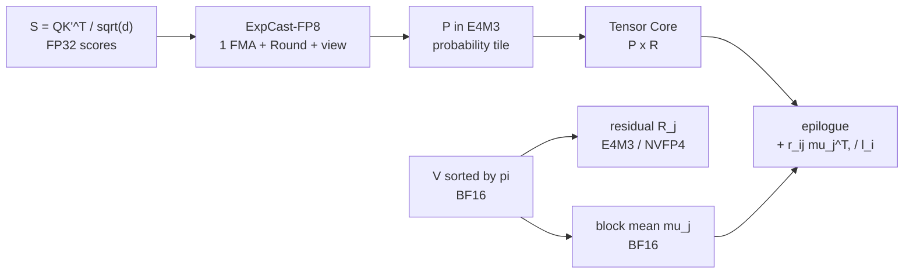

[Paper](https://arxiv.org/abs/2609.15810)
## VC-Attention: Value Smoothing and Softmax Casting for the Last Two Bottlenecks in Low-Bit Attention

One-line summary (TL;DR): A training-free kernel that removes both value quantization error and FP32 softmax in low-bit attention for video DiTs, achieving 1.59× attention and 1.19× clip-generation speedups on B200 (source: §4.3, Fig. 6).

## Core Idea

Low-bit attention only accelerates the two matrix multiplications $QK^\top$ and $PV$ (source: §1). VC-Attention fixes the two stages stuck between them.

First, V-Smooth sorts value tokens with online k-means, subtracts block means, and quantizes only the residuals (source: §3.2, Fig. 4). Second, ExpCast-FP8 writes log-domain scores directly as E4M3 probability bytes with a fused multiply-add, eliminating FP32 exp and FP32-to-FP8 casts (source: §3.3, Fig. 5).

Stated as a one-sentence hypothesis: the authors assume that training-free 8-bit / 4-bit fast high-precision attention that overcomes value outliers and the scalar softmax bottleneck can be achieved using online clustering-based block-mean removal of value tokens and direct log-code mapping (source: §3, §3.4).

## Background: The Problem They Solved

### Research Gap

Video Diffusion Transformers flatten the latent video into a single long spatiotemporal token sequence and run full self-attention at every layer (source: §1). Generating a 5-second 720p clip with Wan2.2-14B produces about 70K tokens, with attention accounting for over 64% of generation time on an RTX 5090 (source: §1).

The state of the art at that point focused on the QK side. The SageAttention family smoothed queries and keys down to INT4 and NVFP4, and FlashAttention-3 inserted a random Hadamard rotation before the FP8 path (source: §1, §2). But two gaps remained.

The first gap is value error. Decomposing the output error gives:

$$
O - O_q = (P - P_q)V + P_q(V - V_q)
$$

where $O = PV$ is the exact output, $P_q$ and $V_q$ are the dequantized low-bit probabilities and values, and $O_q = P_q V_q$ is the low-bit output (source: §3.1). Once QK smoothing and Hadamard rotations shrink the first term, the second term accounts for 82% of output error on Wan2.2 (source: §3.1, Fig. 3a). Value outliers do not follow fixed channels or spatiotemporal structure; they sit in a few tokens and pop up in channels that change across heads, layers, and steps (source: §3.1). Rotations that mix channels within a token preserve token norms, so outlier tokens survive, and block means cut in original order remove only 8% of block energy (source: §3.1, Fig. 4, Tab. 1).

The second gap is speed. While QK and PV run on Tensor Cores, the row maxima, exponentials, and probability casts of online softmax between them run on CUDA cores and MUFU (source: §3.1). In 8-bit attention with head dim 128, exponentials alone consume as many MUFU cycles as two FP8 multiplies on H200, and 2.0× on B200. That is because B200 Tensor Cores are 2.0× faster than Hopper while MUFU stays at 16 exponentials per SM per clock (source: §3.1). As a result, Tensor Cores stall waiting for probability tiles (source: Fig. 3b). On B200 under the MiniMax-H3 1344×768 configuration, SageAttention2 slows to 0.29× relative to BF16 FlashAttention-4 and even breaks shot motion (source: Fig. 1).

In short, SOTA at publication time minimized probability error but left value quantization in sequence order, and kernels left exp-cast in place. Attn-QAT closes the gap with retraining but requires per-model data and GPU time (source: §1, §2).

### Identifying Originality

The three most important contributions are distinguished as follows.

1. V-Smooth, an inference-time token rearrangement and quantization scheme close to a new architectural component: it builds $K' = K[\pi]$ and $V' = V[\pi]$ with the value-based online k-means permutation $\pi = \text{argsort}(z)$, subtracts the mean $\mu_j$ per 128-row block, quantizes only the residual $R_j$, and restores the means with row sums $r_{ij}$ inside the online recurrence (source: §3.2). There is no extra buffer and no second pass over $V$.
2. ExpCast-FP8, a combination of a new theoretical insight and a kernel technique: exploiting the fact that the E4M3 byte itself is a logarithmic representation, it writes probability codes with a single FMA plus integer conversion as $c(u) = \text{clip}_{[0,120]}(\text{Round}(8(u+8)+56+\beta))$ (source: §3.3). Here $u = (s-m'_i)\log_2 e$, $\beta = -0.35$, and 56 is the E4M3 bias.
3. A row-wise error guarantee, a new theoretical insight: for in-range rows it proves $TV(p,\hat{p}) < 3.64\%$ and $\lVert \hat{o}-o \rVert_2 \le 3.64\% \cdot \text{diam}_2(V')$, with a $0.0364+\tau$ extension adding underflow mass $\tau$ (source: §3.3, Prop. 3.1, Appx. D). The constants come from reading 8 and 56 off the format and from the minimax centering $-0.3443$ of the Mitchell error, not from fitting.

### Strengths From the Authors' Perspective

The authors argue that sorting makes mean subtraction worthwhile. Averaged over 59.1K blocks from 100 Wan2.2 heads, the share of block energy removed by the mean is 8% in sequence order, 12% for fixed cubes, and 36% after sorting, a 3.1× difference (source: Fig. 4). For value error alone, Hadamard on $V$ changes it by only 0.2% and fixed cubes recover only 3.7%, while k-means reduces it from $1.81 \times 10^{-4}$ to $1.28 \times 10^{-4}$ (source: Tab. 1).

On speed, they emphasize that writing bytes directly writes the correct bytes. Within one doubling interval, the two paths emit identical bytes over 79.6% of the interval and differ by 1 code elsewhere, and a maximum 7.5% per-element relative error cancels under row normalization to leave 1.6% mean TV (source: Fig. 5, §3.3). From a fusion perspective, the quantizer absorbs RoPE, Hadamard, means, and gathers backward so no high-precision intermediate tensor touches HBM (source: §3.4, Appx. B, Fig. 7).

## New Approach: VC-Attention

The full pipeline is an in-place CuTe/CUDA kernel replacing existing low-bit attention (source: §4.1). On datacenter GPUs, B200 and H200, both mechanisms are deployed together in 8-bit; on workstation Blackwell, RTX PRO 6000 and RTX 5090, only V-Smooth is deployed in 4-bit because softmax is not the bottleneck there (source: §4.1). The 4-bit datacenter configuration is not evaluated because per-16-element scale computation for NVFP4 $P$ remains on the softmax critical path (source: Appx. A).



The evaluation setup covers four video DiTs. Wan2.2-T2V-A14B uses 720p 81 frames 40 steps, LongCat-Video uses 480×832 93 frames 50 steps, HunyuanVideo-1.5 uses 720p 121 frames 50 steps, and MiniMax-H3 uses a 1344×768 243-frame 8-step distilled LoRA configuration (source: Appx. A). Attention token counts are 75.6K tokens, 37.4K tokens, 111.7K tokens, and 73.5K tokens in order, compared on MovieGen Bench 100 prompts with identical seeds (source: Appx. A, §4.1). Fidelity is measured as PSNR, SSIM, and LPIPS against BF16 FlashAttention-4 outputs, plus VBench subject consistency and imaging quality (source: §4.1).

## How It Works: A Concrete Walkthrough

For graduate-student readers, here is a small example tracing both mechanisms.

### V-Smooth: Grouping Similar Tokens Into the Same Block

Start with definitions. $N$ is the number of spatiotemporal tokens, $d$ is the head dimension, $B_v = 128$ is the hardware value block size, $z_t$ is the k-means label of token $t$, $\pi$ is the label-sorted permutation, $\mu_j$ is the mean vector of block $j$, and $R_j$ is the mean-subtracted residual (source: §3.1, §3.2).

Suppose the original $V$ has 4 tokens and 4 channels as follows, in arbitrary units.

```
t0: [ 1.2,  1.0,  0.3,  0.1]
t1: [-1.5,  1.3, -1.1, -1.6]
t2: [ 0.3, -0.1, -1.1,  1.1]
t3: [-1.6,  0.9, -0.7, -1.2]
```

Take the block size to be 2 rows. Cutting in sequence order gives blocks {t0,t1} and {t2,t3}. From t1's perspective, its blockmate is the ordinary t0, and the mean lands near $[ -0.15, 1.15, -0.40, -0.75 ]$. The mean removes little energy, and the residual keeps the large values $-1.5$ and $1.3$, inflating the quantization scale. In the paper's real head example, this share is 8% (source: Fig. 4).

Suppose online k-means on value vectors groups $t1$ and $t3$ into the same cluster. Permuting $K$ and $V$ together with the permutation $\pi = [0,2,1,3]$ leaves the output of non-causal self-attention in a video DiT unchanged as $P'V' = PV$ (source: §3.2). Now the blocks are {t0,t2} and {t1,t3}. The second block is:

```
t1: [-1.5,  1.3, -1.1, -1.6]
t3: [-1.6,  0.9, -0.7, -1.2]
mean: [-1.55, 1.10, -0.90, -1.40]
residual t1: [0.05, 0.20, -0.20, -0.20]
```

The 16-bit mean carries the outlier magnitude, and the residual entering the quantizer shrinks to absolute values of 0.20 or less. Averaged over 128 channels, this sorting removes 36% of energy and cuts E4M3 value error on the same head by 1.5× (source: Fig. 4).

In equations, each block is split as $V'_j = 1\mu_j^\top + R_j$ and only the residual is quantized as $R_{q,j}$ (source: §3.2). The online softmax recurrence splits as:

$$
A_i \leftarrow \alpha_i A_i + \tilde{P}_{q,ij} R_{q,j} + r_{ij}\mu_j^\top, \quad l_i \leftarrow \alpha_i l_i + r_{ij}
$$

where $\tilde{P}_{ij} = \exp(S_{ij}-m'_i)$ is the unnormalized probability tile, $r_{ij} = \tilde{P}_{ij}1$ is the row sum already accumulated by $l_i$, and $\alpha_i$ is the rescaling for a rising running maximum (source: §3.2). The mean term is a single outer product on CUDA cores, lives in the same accumulator, and is therefore covered by the same $\alpha_i$ rescaling.

Grouping is not done at every step. Grouping and demeaning run only in the first 25% of the full denoising steps, with a plain low-bit kernel using the remaining permutation afterward. Within the window, it is computed only once every 4 adjacent steps: recomputed at steps 0, 4, 8 for Wan2.2 40 steps and at steps 0, 4, 8, 12 for LongCat 50 steps (source: §3.4, Appx. A). On average, grouping accounts for 3% to 4% of attention time (source: §3.4, Fig. 6).

### ExpCast-FP8: Writing Bytes Instead of Computing exp

Viewing the E4M3 byte in terms of exponent field $e$ and mantissa field $m$, the stored value is $v = 2^{e-7}(1+m/8)$ (source: §3.3). Read as an integer, the byte $8e+m$ equals $8\log_2 v + 56 + \varepsilon(m)$, where $\varepsilon(m)$ does not exceed 1 code (source: Fig. 8). Folding the $2^8$ scale into the log score $u \le 0$ already held by online softmax by setting $\log_2 v = u+8$ yields the code above.

Check with toy numbers. For $u = -1.60$, the formula gives $106.85$, rounded to byte 107. That is $8 \cdot 13 + 3$ with decoded value 88. Direct exponentiation gives $2^{u+8} = 84.4$, which also rounds to 88 in the $[64,128)$ interval with E4M3 step 8 (source: §3.3). It writes the same byte.

### Dissecting One Secret Weapon: k-means Sorting

What changes when token order before the value quantizer is altered. The condition is 100 Wan2.2 heads on RTX PRO 6000, all with block demeaning and per-channel FP8 $V$ (source: Tab. 1).

| Token order | rMSE $\times 10^{-4}$ | Overhead % attn | $\Delta$ vs sequence |
|---|---:|---:|---:|
| Sequence | 1.81 | 0.0% | baseline |
| Hadamard on $V$ | 1.81 | 1.5% | 0.0% change |
| Static cube | 1.74 | 2.7% | -3.7% error |
| k-means | 1.28 | 16.5% | -29.3% error |
| k-means warm-started | 1.28 | 9.5% | same error, half cost |
| Balanced k-means | 1.17 | 84.5% | additional -8.5% error |

The mechanism is clear. Hadamard preserves token norms even as it mixes channels, so the tokens that set the scale survive. Fixed cubes are pinned to the spatiotemporal grid and mismatch value similarity. k-means gathers similar rows so the mean has shared content to subtract (source: §3.1, §3.2, Fig. 4). Balanced partitioning removes up to $k-1$ mixed blocks for additional gain, but grouping costs 2.8× and reaches 85% of attention time in the deployed shape, so it was not adopted. Warm starting from the previous step's centroids halves the cost with error changes within run-to-run variation of clustering itself (source: §3.2, Tab. 1).

Grouping placement is also part of the secret weapon. With 8-bit V-Smooth and ExpCast on LongCat-Video H200 32 prompts, results are as follows (source: Tab. 3).

| Grouped steps | PSNR dB | SSIM | LPIPS | Latency s |
|---|---:|---:|---:|---:|
| First 1/4 | 26.4 | 0.891 | 0.061 | 351.0 |
| Uniform 1/4 | 23.8 | 0.828 | 0.107 | 353.2 |
| All steps | 26.9 | 0.888 | 0.063 | 367.0 |

The same amount of work is 2.6 dB better when placed early. Where it is placed matters more than how much is done (source: §4.4).

## Performance Validation: Key Results

### Key Metrics and Evidence of Success

What the authors emphasize most is capturing fidelity and speed together. In 8-bit, V-Smooth alone ranks first on all columns across all four models, and the full kernel fused with ExpCast also ranks first on Wan2.2, LongCat, and Hunyuan, and falls within a 0.6 dB band on MiniMax-H3 (source: §4.2, Tab. 2).

Wan2.2-T2V-A14B 720p and LongCat-Video 480p results are as follows, in PSNR dB, SSIM, and LPIPS (source: Tab. 2).

| Method 8-bit | Wan2.2 PSNR | Wan2.2 LPIPS | LongCat PSNR | LongCat LPIPS |
|---|---:|---:|---:|---:|
| SageAttention2 8/8 | 20.3 | 0.206 | 23.1 | 0.122 |
| FlashAttention-4 8-bit | 18.8 | 0.248 | 21.3 | 0.154 |
| QK Hadamard 8/8 | 18.8 | 0.253 | 21.6 | 0.148 |
| VC V-Smooth 8/8 | 22.6 | 0.152 | 24.5 | 0.102 |
| VC V-Smooth+ExpCast 8/8 | 20.5 | 0.191 | 23.8 | 0.109 |

HunyuanVideo-1.5 720p and MiniMax-H3 distilled 1344×768 results point the same way (source: Tab. 2).

| Method 8-bit | Hunyuan PSNR | Hunyuan LPIPS | MiniMax PSNR | MiniMax LPIPS |
|---|---:|---:|---:|---:|
| SageAttention2 | 15.6 | 0.382 | 19.9 | 0.252 |
| VC V-Smooth | 18.4 | 0.271 | 21.0 | 0.218 |
| VC V-Smooth+ExpCast | 17.5 | 0.301 | 20.2 | 0.248 |

4-bit workstation results also favor V-Smooth. On Wan2.2 it rises from 13.9 dB to 16.8 dB over SageAttention3, a 2.9 dB gain, and on LongCat from 15.1 dB to 18.7 dB, a 3.6 dB gain. LPIPS drops by up to 41% (source: §4.2, Tab. 2).

Speed on Wan2.2 is as follows, for the attention kernel alone and clip wall-clock, as multiples over BF16 FlashAttention-4 (source: Fig. 6, §4.3).

| GPU, precision | Attention speedup | End-to-end speedup |
|---|---:|---:|
| B200, 8-bit | 1.59× | 1.19× |
| H200, 8-bit | 1.46× | 1.13× |
| RTX PRO 6000, 4-bit | 2.27× | 1.36× |
| RTX 5090, 4-bit | 3.58× | 1.70× |

On B200 it is 6.02× over SageAttention2, and on H200 1.16× (source: §4.3). In 4-bit it costs the same as SageAttention3, matching it on RTX PRO 6000 and staying within 5% on RTX 5090 (source: §4.3).

### Critical Comparison

The strongest comparison is that while SageAttention2 on B200 stays at 0.26× attention and 0.41× end-to-end, slower than BF16, VC-Attention delivers positive acceleration at 1.59× and 1.19× (source: Fig. 6). The cause is that SageAttention2 runs a kernel for older GPUs recompiled for sm_100a without a Blackwell kernel (source: Appx. A, Fig. 1).

There is also a control showing QK is not the bottleneck. Adding QK Hadamard to SageAttention3 changes PSNR by at most 0.1 dB, and to 8-bit FlashAttention-4 by at most 0.3 dB (source: §4.2, Tab. 2). This is consistent with the claim that the remaining error sits on the value side.

The training-dependence comparison is also sharp. Running Attn-QAT without training is 3.4 dB to 6.7 dB below SageAttention2 and the only method that also disturbs VBench (source: §4.2, Tab. 2, Fig. 6). By contrast, VC-Attention needs no per-model training.

There are also points it does not win or only ties. The MiniMax-H3 8-bit full kernel at 20.2 dB PSNR sits inside the band formed by SageAttention2 at 19.9 dB, 8-bit FlashAttention-4 at 20.2 dB, and QK Hadamard at 20.5 dB (source: Tab. 2). That is because ExpCast fusion trades 0.7 dB to 2.1 dB for speed (source: §4.2). VBench subject consistency and imaging quality stay within 0.01 of BF16 for all training-free methods, so they do not discriminate (source: §4.2, Tab. 2). Qualitative examples show VC closer to the reference in scarf position, chef salad trajectory, and cyclist shape, but generalizing from single-clip PSNR alone is difficult (source: Fig. 1, Fig. 9, Fig. 10, Appx. E).

### Implementation and Resources From a Systems Perspective

The key dependencies are hand-written fused passes in CuTe/CUDA plus grouping kernels, modifying FlashAttention-4 and SageAttention kernels in place (source: §3.4, §4.1). Latency is the per-launch median over a 10-second window after 20 seconds of warmup measured with CUPTI, with preprocessing such as quantization and grouping kept outside the attention timer and charged in end-to-end wall-clock (source: Appx. A).

For one V-Smooth attention call on Wan2.2 B200, fusion effects accumulate to 8.74×. From unfused 42.2 ms to quantization-fused 26.5 ms is 1.59×, adding smoothing and gather to 18.5 ms is 1.43×, RoPE fusion to 9.5 ms is 1.94×, and hand-written kernel optimization to 4.8 ms is 1.97× (source: Fig. 7, §4.4). Over 40 DiT forward calls, unfused 1688 ms becomes fused 193 ms, with grouping at 29% of the fused chain. On B300, with both QK and PV in FP8, naive FP8 at 1.31× and 17.1 dB compares to 1.47× and 18.4 dB (source: Tab. 4, §4.5).

From a computer-vision perspective, input resolutions are 720p, 480×832, and 1344×768 with no augmentation, because the setup measures generation fidelity against BF16 renders (source: Appx. A). Metrics are PSNR, SSIM, and LPIPS plus two VBench axes, and qualitative strips cut the same prompt and seed at the same 5-frame indices to show only method differences (source: §4.1, Appx. E).

## Our Take: Strengths, Limitations, and Why This Work Matters

The strength is splitting the problem at exactly the right place. The decomposition showing value error at 82%, Table 1 showing rotations do not help values, and quantification of the MUFU bottleneck map one-to-one onto the two prescriptions, V-Smooth and ExpCast (source: §3.1, Fig. 3, Tab. 1). In particular, resolving mean restoration through row-sum reuse with no extra pass, and deriving constants from the format to avoid per-model tuning, matter for deployment (source: §3.2, §3.3).

The authors are also relatively candid about limitations. ExpCast depends on the 3 mantissa bits and fixed bias of E4M3, so there is no single affine map for NVFP4 $P$, and it is disabled for 4-bit and workstation paths (source: Appx. A). The 4-bit datacenter configuration is not evaluated for the same reason. Balanced clustering reduces error further but costs 85%, so it was dropped, and the first-25% window gives up 0.5 dB relative to full grouping (source: Tab. 1, Tab. 3).

There are three additional potential limitations. First, permutation reuse depends on the assumption that the attention layout does not change much across adjacent denoising steps. Error could grow under fast scene cuts or few-step distilled schedules where 4-step reuse breaks (source: §3.4). Second, evaluation is fidelity against BF16 outputs, not human preference or text alignment. With VBench saturated, it may mask perceived differences (source: Tab. 2). Third, speed is isolated-kernel medians under single-GPU exclusive conditions, with no timed accuracy runs under concurrency. The 1.13× to 1.70× end-to-end gains can vary with production batching, batch size, sequence length, and parallelism settings (source: Appx. A, Fig. 6).

Even so, this work matters because it shows how to convert low-bit peak throughput into actual kernel acceleration. It quantifies that quantizing matrix multiplications alone leaves Tensor Cores idle on B200, and fills the gap with two training-free steps: value sorting and direct probability-byte writing (source: §3.1, §5, Fig. 6). It is also practical in composing with sparse attention, quantized linear layers, and few-step distillation without changing patterns or schedules (source: §2, §4.4).

## What Next?: Future Directions

The authors do not devote a long separate section to future directions, but next steps can be read from the text. Generalizing ExpCast to NVFP4 probabilities, removing scale-on-critical-path for the 4-bit datacenter path, adapting the grouping schedule, and growing the end-to-end share when combined with sparse attention or quantized linear layers remain (source: Appx. A, §4.4, §5).

Reasonable alternatives are as follows. Adjusting the cluster refresh interval based on per-prompt and per-step layout change instead of a fixed first-25% window, lowering the 9.5% overhead further with a cheaper approximate clustering substitute for k-means labels, and selective precision that picks rows with large underflow tails $\tau$ for FP32 fallback. Since the $TV < 0.0364+\tau$ guarantee already isolates the tail, it fits such adaptive designs well (source: Prop. 3.1, Appx. D).


<!-- verbatim-tables -->

## Tables from the paper

> Tables converted mechanically from the arXiv e-print LaTeX source. The numbers are the paper's own and did not pass through a model.

**Table 1. **Fidelity of low-bit attention, grouped by the GPU class each configuration is deployed on.** Measured against the BF16 FlashAttention-4 output of the same model and seed. S.C.\ is subject consistency\xspace and I.Q.\ is imaging quality\xspace, both near-saturated on these models. Bold is the best and underline the second best of a column within one GPU class. $^\dagger$ runs training-free.**

| Method | QK/PV | Wan2.2-T2V-A14B, 720p PSNR $\uparrow$ | Wan2.2-T2V-A14B, 720p SSIM $\uparrow$ | Wan2.2-T2V-A14B, 720p LPIPS $\downarrow$ | Wan2.2-T2V-A14B, 720p S.C. $\uparrow$ | Wan2.2-T2V-A14B, 720p I.Q. $\uparrow$ | LongCat-Video, 480p PSNR $\uparrow$ | LongCat-Video, 480p SSIM $\uparrow$ | LongCat-Video, 480p LPIPS $\downarrow$ | LongCat-Video, 480p S.C. $\uparrow$ | LongCat-Video, 480p I.Q. $\uparrow$ |
|---|---|---|---|---|---|---|---|---|---|---|---|
| FlashAttention-4 | BF16 | black!45-- | black!45-- | black!45-- | 0.932 | 0.703 | black!45-- | black!45-- | black!45-- | 0.941 | 0.694 |
| *Datacenter GPUs*: NVIDIA B200, 8-bit |  |  |  |  |  |  |  |  |  |  |  |
| SageAttention2 | 8/8 | 20.3 | 0.730 | 0.206 | 0.931 | 0.703 | 23.1 | 0.793 | 0.122 | **0.941** | **0.697** |
| FlashAttention-4 (8-bit) | 8/8 | 18.8 | 0.686 | 0.248 | 0.929 | 0.704 | 21.3 | 0.753 | 0.154 | 0.940 | **0.697** |
| + QK Hadamard | 8/8 | 18.8 | 0.685 | 0.253 | 0.929 | **0.706** | 21.6 | 0.762 | 0.148 | 0.940 | 0.695 |
| Attn-QAT$^\dagger$ | 4/8 | 15.5 | 0.561 | 0.428 | 0.913 | 0.699 | 16.4 | 0.556 | 0.398 | 0.908 | 0.656 |
| **VC-Attention\xspace (V-Smooth)** | 8/8 | **22.6** | **0.792** | **0.152** | 0.931 | 0.704 | **24.5** | **0.822** | **0.102** | **0.941** | 0.696 |
| **VC-Attention\xspace (V-Smooth + ExpCast)** | 8/8 | 20.5 | 0.744 | 0.191 | **0.932** | 0.705 | 23.8 | 0.807 | 0.109 | **0.941** | 0.696 |
| 2.5pt0pt 1.2pt1.5pt *Workstation GPUs*: NVIDIA RTX PRO 6000, 4-bit |  |  |  |  |  |  |  |  |  |  |  |
| SageAttention3 | 4/4 | 13.9 | 0.510 | 0.466 | 0.925 | 0.697 | 15.1 | 0.526 | 0.382 | 0.938 | 0.692 |
| + QK Hadamard | 4/4 | 14.0 | 0.516 | 0.454 | 0.928 | 0.702 | 15.1 | 0.530 | 0.375 | 0.938 | **0.695** |
| **VC-Attention\xspace (V-Smooth)** | 4/4 | **16.8** | **0.614** | **0.318** | **0.931** | **0.707** | **18.7** | **0.663** | **0.226** | **0.939** | **0.695** |
|  |  | HunyuanVideo-1.5, 720p |  |  |  |  | MiniMax-H3 distilled, 1344$\times$768 |  |  |  |  |
| Method | QK/PV | PSNR $\uparrow$ | SSIM $\uparrow$ | LPIPS $\downarrow$ | S.C. $\uparrow$ | I.Q. $\uparrow$ | PSNR $\uparrow$ | SSIM $\uparrow$ | LPIPS $\downarrow$ | S.C. $\uparrow$ | I.Q. $\uparrow$ |
| FlashAttention-4 | BF16 | black!45-- | black!45-- | black!45-- | 0.933 | 0.680 | black!45-- | black!45-- | black!45-- | 0.899 | 0.668 |
| *Datacenter GPUs*: NVIDIA B200, 8-bit |  |  |  |  |  |  |  |  |  |  |  |
| SageAttention2 | 8/8 | 15.6 | 0.581 | 0.382 | 0.931 | 0.676 | 19.9 | 0.723 | 0.252 | 0.897 | **0.671** |
| FlashAttention-4 (8-bit) | 8/8 | 15.9 | 0.592 | 0.370 | **0.932** | 0.676 | 20.2 | 0.731 | 0.243 | **0.899** | 0.668 |
| + QK Hadamard | 8/8 | 16.0 | 0.593 | 0.367 | **0.932** | 0.678 | 20.5 | 0.737 | 0.233 | 0.898 | 0.669 |
| Attn-QAT$^\dagger$ | 4/8 | 12.2 | 0.459 | 0.562 | 0.911 | 0.662 | 15.0 | 0.581 | 0.467 | 0.896 | 0.643 |
| **VC-Attention\xspace (V-Smooth)** | 8/8 | **18.4** | **0.675** | **0.271** | **0.932** | **0.679** | **21.0** | **0.751** | **0.218** | **0.899** | 0.669 |
| **VC-Attention\xspace (V-Smooth + ExpCast)** | 8/8 | 17.5 | 0.648 | 0.301 | 0.931 | 0.677 | 20.2 | 0.726 | 0.248 | 0.897 | 0.669 |
| 2.5pt0pt 1.2pt1.5pt *Workstation GPUs*: NVIDIA RTX PRO 6000, 4-bit |  |  |  |  |  |  |  |  |  |  |  |
| SageAttention3 | 4/4 | 10.9 | 0.391 | 0.652 | 0.927 | 0.677 | 16.1 | 0.587 | 0.408 | 0.907 | **0.686** |
| + QK Hadamard | 4/4 | 10.9 | 0.390 | 0.654 | 0.932 | **0.679** | 16.0 | 0.588 | 0.403 | 0.908 | **0.686** |
| **VC-Attention\xspace (V-Smooth)** | 4/4 | **13.8** | **0.486** | **0.481** | **0.934** | **0.679** | **16.6** | **0.605** | **0.380** | **0.909** | **0.686** |
