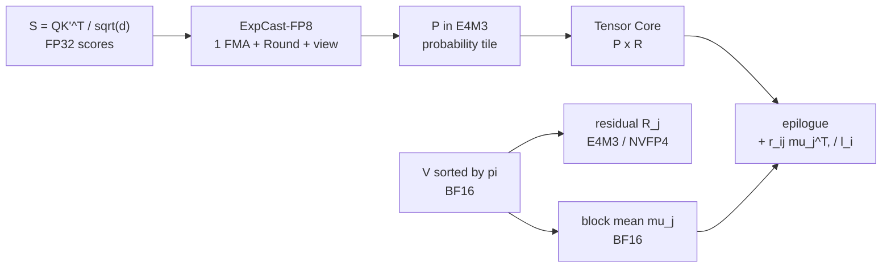

[논문 링크](https://arxiv.org/abs/2609.15810)
## VC-Attention: 저비트 어텐션의 남은 두 병목을 푼 Value Smoothing과 Softmax Casting

한 줄 요약 (TL;DR): 비디오 DiT의 저비트 어텐션에서 값(value) 양자화 오차와 FP32 softmax를 동시에 제거해 B200에서 어텐션 1.59× , 클립 생성 1.19× 를 달성한 학습-프리 커널이다 (근거: §4.3, Fig. 6).

## 핵심 아이디어

저비트 어텐션은 두 개의 행렬곱 $QK^\top$ 와 $PV$ 만 빠르게 만들 뿐이다 (근거: §1). VC-Attention은 그 사이에 낀 두 단계를 고친다.

첫째, V-Smooth는 값 토큰을 온라인 k-means로 정렬한 뒤 블록 평균을 빼고 잔차만 양자화한다 (근거: §3.2, Fig. 4). 둘째, ExpCast-FP8은 로그 도메인 점수를 E4M3 확률 바이트로 직접 쓰는 fused multiply-add로 FP32 exp와 FP32-to-FP8 cast를 없앤다 (근거: §3.3, Fig. 5).

한 문장 가설로 정리하면 다음과 같다. 저자들은 값 토큰의 온라인 군집 기반 블록 평균 제거와 로그-코드 직접 매핑을 사용함으로써 값 아웃라이어와 스칼라 softmax 병목을 극복하는 학습 없는 8-bit / 4-bit 고속 고정밀 어텐션을 달성할 수 있다고 가정한다 (근거: §3, §3.4).

## 배경: 그들이 해결한 문제

### 연구의 공백

비디오 Diffusion Transformer는 잠재 비디오를 하나의 긴 시공간 토큰 시퀀스로 펴서 매 층마다 전체 셀프 어텐션을 수행한다 (근거: §1). Wan2.2-14B로 5-second 720p 클립을 만들면 약 70K tokens가 되고 RTX 5090에서 어텐션이 생성 시간의 64% 이상을 차지한다 (근거: §1).

이 시점의 최신 기술은 QK 쪽에 집중돼 있었다. SageAttention 계열은 쿼리와 키를 INT4와 NVFP4까지 스무딩하고, FlashAttention-3은 FP8 경로 앞에 랜덤 Hadamard 회전을 넣었다 (근거: §1, §2). 그러나 두 가지가 남았다.

첫 번째 공백은 값 오차이다. 출력 오차를 분해하면 다음과 같다.

$$
O - O_q = (P - P_q)V + P_q(V - V_q)
$$

여기서 $O = PV$ 는 정확한 출력, $P_q$ 와 $V_q$ 는 복원된 저비트 확률과 값, $O_q = P_q V_q$ 는 저비트 출력이다 (근거: §3.1). QK 스무딩과 Hadamard 회전으로 첫 항을 줄이면 Wan2.2에서 두 번째 항이 출력 오차의 82% 를 차지한다 (근거: §3.1, Fig. 3a). 값 아웃라이어는 고정된 채널이나 시공간 구조를 따르지 않고 몇 개 토큰에 앉으며 헤드와 레이어와 스텝마다 바뀌는 채널에서 튄다 (근거: §3.1). 토큰 안 채널을 섞는 회전은 토큰 노름을 보존하므로 아웃라이어 토큰이 살아남고, 원래 순서대로 자른 블록 평균은 8% 의 블록 에너지만 제거한다 (근거: §3.1, Fig. 4, Tab. 1).

두 번째 공백은 속도이다. QK와 PV가 Tensor Core에서 도는 동안 온라인 softmax 사이의 행 최대값과 지수함수와 확률 cast는 CUDA 코어와 MUFU에서 돈다 (근거: §3.1). head dim 128인 8-bit 어텐션에서 지수함수만으로 H200의 두 FP8 곱과 같은 MUFU 사이클을 쓰고, B200에서는 2.0× 를 쓴다. B200의 Tensor Core는 Hopper 대비 2.0× 빨라졌지만 MUFU는 SM당 클록당 16 exponentials로 그대로이기 때문이다 (근거: §3.1). 결과로 Tensor Core가 확률 타일을 기다린다 (근거: Fig. 3b). B200에서 MiniMax-H3 1344×768 조건으로 SageAttention2는 BF16 FlashAttention-4 대비 0.29× 로 느려지고 샷의 움직임까지 어긋난다 (근거: Fig. 1).

정리하면 출판 시점 SOTA는 확률 오차는 작게 만들되 값 양자화는 순서대로 두는 방식이었고, 커널은 exp-cast를 그대로 두는 방식이었다. Attn-QAT는 재학습으로 간극을 메우지만 모델별 데이터와 GPU 시간을 요구한다 (근거: §1, §2).

### 독창성 식별

가장 중요한 기여 3가지는 다음과 같이 구분된다.

1. V-Smooth, 새로운 아키텍처 구성요소에 가까운 추론시 토큰 재배열과 양자화 방식: 값 기준 온라인 k-means 순열 $\pi = \text{argsort}(z)$ 로 $K' = K[\pi]$ 와 $V' = V[\pi]$ 를 만들고, 128 rows 블록마다 평균 $\mu_j$ 를 빼서 잔차 $R_j$ 만 양자화한 뒤 온라인 recurrence 안에서 행합 $r_{ij}$ 로 평균을 복원한다 (근거: §3.2). 추가 버퍼와 $V$ 에 대한 두 번째 패스가 없다.
2. ExpCast-FP8, 새로운 이론적 통찰과 커널 기법의 결합: E4M3 바이트 자체가 로그 표현이라는 점에 착안해 $c(u) = \text{clip}_{[0,120]}(\text{Round}(8(u+8)+56+\beta))$ 로 한 번의 FMA와 정수 변환만으로 확률 코드를 쓴다 (근거: §3.3). 여기서 $u = (s-m'_i)\log_2 e$ , $\beta = -0.35$ , 56은 E4M3 바이어스이다.
3. 행 단위 오차 보장, 새로운 이론적 통찰: 정상 범위 행에 대해 $TV(p,\hat{p}) < 3.64\%$ 와 $\lVert \hat{o}-o \rVert_2 \le 3.64\% \cdot \text{diam}_2(V')$ 를 증명하고, 언더플로우 질량 $\tau$ 를 더한 $0.0364+\tau$ 확장을 제공한다 (근거: §3.3, Prop. 3.1, Appx. D). 상수는 피팅이 아니라 포맷에서 읽은 8과 56, 그리고 Mitchell 오차의 minimax 센터링 $-0.3443$ 에서 나온다.

### 저자 관점에서의 강점

저자들은 정렬이 평균을 뺄 만하게 만든다고 주장한다. Wan2.2 100개 헤드의 59.1K blocks 평균으로 평균이 제거하는 블록 에너지 비중은 순서대로 8% , 고정 cube 12% , 정렬 후 36% 이며 3.1× 에 해당한다 (근거: Fig. 4). 값 오차 자체로도 Hadamard on $V$ 는 0.2% 변화에 그치고 고정 cube는 3.7% 만 회복하는 반면 k-means는 $1.81 \times 10^{-4}$ 에서 $1.28 \times 10^{-4}$ 로 떨어뜨린다 (근거: Tab. 1).

속도 측면에서는 바이트를 직접 쓰는 것이 정답 바이트를 쓴다는 점을 강조한다. 한 doubling 구간에서 두 경로는 79.6% 구간에서 같은 바이트를 쓰고 나머지는 1 code 차이이며, 원소 상대 오차 최대 7.5% 가 행 정규화에서 상쇄돼 평균 TV 1.6% 로 남는다 (근거: Fig. 5, §3.3). 융합 관점에서는 양자화기 쪽으로 RoPE와 Hadamard와 평균과 gather를 역방향으로 흡수해 고 정밀 중간 텐서가 HBM에 닿지 않게 만든다 (근거: §3.4, Appx. B, Fig. 7).

## 새로운 접근법: VC-Attention

전체 파이프라인은 기존 저비트 어텐션을 제자리에서 바꾼 CuTe/CUDA 커널이다 (근거: §4.1). 데이터센터 GPU인 B200과 H200에서는 8-bit로 두 메커니즘을 함께 배포하고, 워크스테이션 Blackwell인 RTX PRO 6000과 RTX 5090에서는 softmax가 병목이 아니므로 4-bit로 V-Smooth만 배포한다 (근거: §4.1). 4-bit 데이터센터 구성은 NVFP4 $P$ 의 16-element별 스케일 계산이 softmax 크리티컬 패스에 남아 평가하지 않는다 (근거: Appx. A).



평가 설정은 비디오 DiT 4종이다. Wan2.2-T2V-A14B는 720p 81 frames 40 steps, LongCat-Video는 480×832 93 frames 50 steps, HunyuanVideo-1.5는 720p 121 frames 50 steps, MiniMax-H3은 1344×768 243 frames 8-step 증류 LoRA 조건이다 (근거: Appx. A). 어텐션 토큰 수는 순서대로 75.6K tokens, 37.4K tokens, 111.7K tokens, 73.5K tokens이며 MovieGen Bench 100 prompts와 동일 시드로 비교한다 (근거: Appx. A, §4.1). 충실도는 BF16 FlashAttention-4 출력 대비 PSNR과 SSIM과 LPIPS, 그리고 VBench의 subject consistency와 imaging quality로 측정한다 (근거: §4.1).

## 작동 원리: 구체적인 예시로 살펴보기

대학원생 독자를 위해 작은 예시로 두 메커니즘을 따라가 보자.

### V-Smooth: 비슷한 토큰을 같은 블록에 모으기

핵심 용어부터 정의한다. $N$ 은 시공간 토큰 수, $d$ 는 헤드 차원, $B_v = 128$ 은 하드웨어 값 블록 크기, $z_t$ 는 토큰 $t$ 의 k-means 라벨, $\pi$ 는 라벨 정렬 순열, $\mu_j$ 는 블록 $j$ 의 평균 벡터, $R_j$ 는 평균을 뺀 잔차이다 (근거: §3.1, §3.2).

원래 $V$ 가 4 tokens와 4 channels로 다음과 같다고 하자. 단위는 임의 단위이다.

```
t0: [ 1.2,  1.0,  0.3,  0.1]
t1: [-1.5,  1.3, -1.1, -1.6]
t2: [ 0.3, -0.1, -1.1,  1.1]
t3: [-1.6,  0.9, -0.7, -1.2]
```

블록 크기를 2 rows라고 하자. 순서대로 자르면 블록은 {t0,t1}과 {t2,t3}이다. t1의 입장에서 블록메이트는 평범한 t0이며 평균은 $[ -0.15, 1.15, -0.40, -0.75 ]$ 근처가 된다. 평균이 제거하는 에너지는 작고 잔차에 큰 값 $-1.5$ 와 $1.3$ 이 그대로 남아 양자화 스케일을 키운다. 논문의 실제 헤드 예시에서 이 비중은 8% 이다 (근거: Fig. 4).

온라인 k-means가 값 벡터 기준으로 $t1$ 과 $t3$ 를 같은 군집으로 묶었다고 하자. 순열 $\pi = [0,2,1,3]$ 으로 $K$ 와 $V$ 를 함께 permute하면 비디오 DiT의 비인과 셀프 어텐션 출력은 $P'V' = PV$ 로 그대로이다 (근거: §3.2). 이제 블록은 {t0,t2}와 {t1,t3}이다. 두 번째 블록은 다음과 같다.

```
t1: [-1.5,  1.3, -1.1, -1.6]
t3: [-1.6,  0.9, -0.7, -1.2]
mean: [-1.55, 1.10, -0.90, -1.40]
residual t1: [0.05, 0.20, -0.20, -0.20]
```

아웃라이어 크기는 16-bit 평균이 가져가고 양자화기에 들어가는 잔차는 0.20 이하 절대값으로 작아진다. 실제 128 channels 평균으로 이 정렬은 36% 에너지를 제거하고 같은 헤드의 E4M3 값 오차를 1.5× 줄인다 (근거: Fig. 4).

식으로는 블록을 $V'_j = 1\mu_j^\top + R_j$ 로 나누고 잔차만 $R_{q,j}$ 로 양자화한다 (근거: §3.2). 온라인 softmax recurrence는 다음과 같이 갈라진다.

$$
A_i \leftarrow \alpha_i A_i + \tilde{P}_{q,ij} R_{q,j} + r_{ij}\mu_j^\top, \quad l_i \leftarrow \alpha_i l_i + r_{ij}
$$

여기서 $\tilde{P}_{ij} = \exp(S_{ij}-m'_i)$ 는 비정규화 확률 타일, $r_{ij} = \tilde{P}_{ij}1$ 은 이미 $l_i$ 가 누적하는 행합, $\alpha_i$ 는 러닝 최대값 상승에 따른 재스케일이다 (근거: §3.2). 평균 항은 CUDA 코어의 outer product 한 번이며 같은 accumulator에 살므로 $\alpha_i$ 재스케일이 그대로 덮는다.

그룹핑은 매 스텝 하지 않는다. 전체 디노이징 스텝의 앞 25% 에서만 그룹핑과 demeaning을 하고 나머지는 남은 순열로 plain 저비트 커널을 돌린다. 윈도우 안에서는 4 adjacent steps마다 한 번씩만 계산하는데, Wan2.2 40 steps는 steps 0, 4, 8에서 재계산하고 LongCat 50 steps는 steps 0, 4, 8, 12에서 재계산한다 (근거: §3.4, Appx. A). 평균적으로 그룹핑은 어텐션 시간의 3% 에서 4% 이다 (근거: §3.4, Fig. 6).

### ExpCast-FP8: exp를 쓰지 않고 바이트를 쓰기

E4M3 바이트를 $e$ exponent field와 $m$ mantissa field로 보면 저장하는 값은 $v = 2^{e-7}(1+m/8)$ 이다 (근거: §3.3). 정수로 읽은 바이트 $8e+m$ 은 $8\log_2 v + 56 + \varepsilon(m)$ 이며 $\varepsilon(m)$ 은 최대 1 code를 넘지 않는다 (근거: Fig. 8). 온라인 softmax가 이미 가진 로그 점수 $u \le 0$ 에 $2^8$ 스케일을 접어 $\log_2 v = u+8$ 로 두면 코드는 위 식이 된다.

토이 숫자로 확인하자. $u = -1.60$ 이면 식은 $106.85$ 를 주고 반올림해 바이트 107을 쓴다. 이는 $8 \cdot 13 + 3$ 이며 디코딩 값 88이다. 직접 지수화하면 $2^{u+8} = 84.4$ 이며 E4M3 스텝이 8인 $[64,128)$ 구간에서 역시 88로 반올림된다 (근거: §3.3). 같은 바이트를 쓰는 셈이다.

### 비밀 병기 1개를 뜯어보기: k-means 정렬

값 양자화기 앞 토큰 순서를 바꾸면 어떻게 달라질까. Wan2.2 RTX PRO 6000 100 heads 조건이며 모두 블록 demeaning과 per-channel FP8 $V$ 를 쓴다 (근거: Tab. 1).

| Token order | rMSE $\times 10^{-4}$ | Overhead % attn | $\Delta$ vs sequence |
|---|---:|---:|---:|
| Sequence | 1.81 | 0.0% | 기준 |
| Hadamard on $V$ | 1.81 | 1.5% | 0.0% 변화 |
| Static cube | 1.74 | 2.7% | -3.7% 오차 |
| k-means | 1.28 | 16.5% | -29.3% 오차 |
| k-means warm-started | 1.28 | 9.5% | 동일 오차, 비용 절반 |
| Balanced k-means | 1.17 | 84.5% | 추가 -8.5% 오차 |

메커니즘은 명확하다. Hadamard는 채널을 섞어도 토큰 노름을 보존하므로 스케일을 정하는 토큰이 그대로 남는다. 고정 cube는 시공간 그리드에 고정돼 값 유사성과 어긋난다. k-means는 비슷한 행끼리 모아 평균이 뺄 공통 성분을 만든다 (근거: §3.1, §3.2, Fig. 4). 균등 분할은 $k-1$ 개 이하의 혼합 블록까지 없애 추가 이득을 주지만 그룹핑 비용이 2.8× 이고 배포 shape에서 어텐션 시간의 85% 에 달해 채택하지 않았다. 웜스타트는 이전 스텝 centroid로 시작해 비용을 절반으로 줄이고 오차 변화는 군집 자체의 run-to-run 편차 안에 있다 (근거: §3.2, Tab. 1).

그룹핑 위치도 비밀 병기의 일부이다. LongCat-Video H200 32 prompts 조건에서 8-bit V-Smooth와 ExpCast를 쓴 결과는 다음과 같다 (근거: Tab. 3).

| Grouped steps | PSNR dB | SSIM | LPIPS | Latency s |
|---|---:|---:|---:|---:|
| First 1/4 | 26.4 | 0.891 | 0.061 | 351.0 |
| Uniform 1/4 | 23.8 | 0.828 | 0.107 | 353.2 |
| All steps | 26.9 | 0.888 | 0.063 | 367.0 |

같은 양의 작업을 해도 앞쪽에 두면 2.6 dB 더 좋다. 어디에 두느냐가 얼마나 하느냐보다 중요하다 (근거: §4.4).

## 성능 검증: 주요 결과

### 핵심 지표와 성공 증거

저자들이 가장 강조하는 것은 충실도와 속도를 동시에 잡았다는 점이다. 8-bit에서 V-Smooth 단독은 4개 모델 모두 모든 열에서 1등이며, ExpCast를 융합한 전체 커널도 Wan2.2와 LongCat과 Hunyuan에서 1등, MiniMax-H3에서 0.6 dB 밴드 안에 든다 (근거: §4.2, Tab. 2).

Wan2.2-T2V-A14B 720p와 LongCat-Video 480p 결과는 다음과 같다. 단위는 PSNR dB, SSIM, LPIPS이다 (근거: Tab. 2).

| Method 8-bit | Wan2.2 PSNR | Wan2.2 LPIPS | LongCat PSNR | LongCat LPIPS |
|---|---:|---:|---:|---:|
| SageAttention2 8/8 | 20.3 | 0.206 | 23.1 | 0.122 |
| FlashAttention-4 8-bit | 18.8 | 0.248 | 21.3 | 0.154 |
| QK Hadamard 8/8 | 18.8 | 0.253 | 21.6 | 0.148 |
| VC V-Smooth 8/8 | 22.6 | 0.152 | 24.5 | 0.102 |
| VC V-Smooth+ExpCast 8/8 | 20.5 | 0.191 | 23.8 | 0.109 |

HunyuanVideo-1.5 720p와 MiniMax-H3 distilled 1344×768 결과도 같은 방향이다 (근거: Tab. 2).

| Method 8-bit | Hunyuan PSNR | Hunyuan LPIPS | MiniMax PSNR | MiniMax LPIPS |
|---|---:|---:|---:|---:|
| SageAttention2 | 15.6 | 0.382 | 19.9 | 0.252 |
| VC V-Smooth | 18.4 | 0.271 | 21.0 | 0.218 |
| VC V-Smooth+ExpCast | 17.5 | 0.301 | 20.2 | 0.248 |

4-bit 워크스테이션 결과도 V-Smooth가 앞선다. Wan2.2에서 SageAttention3 대비 13.9 dB에서 16.8 dB로 2.9 dB 오르고, LongCat에서 15.1 dB에서 18.7 dB로 3.6 dB 오른다. LPIPS는 최대 41% 감소한다 (근거: §4.2, Tab. 2).

속도는 Wan2.2 기준으로 다음과 같다. 어텐션 커널 단독과 클립 wall-clock이며 BF16 FlashAttention-4 대비 배율이다 (근거: Fig. 6, §4.3).

| GPU, 정밀도 | Attention speedup | End-to-end speedup |
|---|---:|---:|
| B200, 8-bit | 1.59× | 1.19× |
| H200, 8-bit | 1.46× | 1.13× |
| RTX PRO 6000, 4-bit | 2.27× | 1.36× |
| RTX 5090, 4-bit | 3.58× | 1.70× |

B200에서는 SageAttention2 대비 6.02× , H200에서는 1.16× 이다 (근거: §4.3). 4-bit에서는 SageAttention3와 같은 비용이며 RTX PRO 6000에서 동등, RTX 5090에서 5% 이내이다 (근거: §4.3).

### 비판적 비교

가장 강력한 비교 지점은 B200에서 SageAttention2가 BF16보다 느린 0.26× 어텐션과 0.41× end-to-end에 머무는 동안 VC-Attention이 1.59× 와 1.19× 로 양의 가속을 만든다는 점이다 (근거: Fig. 6). 원인은 SageAttention2가 Blackwell 커널 없이 이전 GPU용 커널을 sm_100a로 재컴파일해 돌기 때문이다 (근거: Appx. A, Fig. 1).

QK 쪽이 병목이 아니라는 대조 실험도 있다. SageAttention3에 QK Hadamard를 붙여도 PSNR 변화가 최대 0.1 dB, 8-bit FlashAttention-4에 붙여도 최대 0.3 dB이다 (근거: §4.2, Tab. 2). 남은 오차가 값 쪽에 있다는 주장과 정합적이다.

훈련 의존성 비교도 선명하다. Attn-QAT를 학습 없이 돌리면 SageAttention2보다 3.4 dB에서 6.7 dB 낮고 VBench까지 흔드는 유일한 방법이다 (근거: §4.2, Tab. 2, Fig. 6). 반대로 VC-Attention은 모델별 학습이 없다.

못 이기거나 박빙인 지점도 있다. MiniMax-H3 8-bit 전체 커널은 PSNR 20.2 dB로 SageAttention2 19.9 dB와 FlashAttention-4 8-bit 20.2 dB와 QK Hadamard 20.5 dB가 만든 밴드 안에 있다 (근거: Tab. 2). ExpCast 융합이 0.7 dB에서 2.1 dB를 속도와 맞바꾸기 때문이다 (근거: §4.2). VBench의 subject consistency와 imaging quality는 모든 학습-프리 방법이 BF16 대비 0.01 이내라 변별력이 없다 (근거: §4.2, Tab. 2). 정성 예시에서는 스카프 위치와 요리사 샐러드 궤적과 자전거 운전자 형태에서 VC가 기준에 가깝지만, 단일 클립 PSNR만으로 일반화하기는 어렵다 (근거: Fig. 1, Fig. 9, Fig. 10, Appx. E).

### 시스템 관점의 구현과 자원

핵심 의존성은 CuTe/CUDA로 손으로 쓴 융합 패스와 그룹핑 커널이며 FlashAttention-4와 SageAttention 커널을 제자리에서 수정했다 (근거: §3.4, §4.1). 지연 시간은 CUPTI로 20 seconds 웜업 후 10 seconds 윈도우의 launch당 median이며 양자화와 그룹핑 등 전처리는 어텐션 타이머 밖에 두고 end-to-end wall-clock에서 과금한다 (근거: Appx. A).

Wan2.2 B200 한 번의 V-Smooth 어텐션 호출에서 융합 효과는 누적 8.74× 이다. 미융합 42.2 ms에서 양자화 융합 26.5 ms로 1.59× , 스무딩과 gather 추가 18.5 ms로 1.43× , RoPE 융합 9.5 ms로 1.94× , 손작성 커널 최적화 4.8 ms로 1.97× 이다 (근거: Fig. 7, §4.4). DiT forward 40 calls 기준 미융합 1688 ms에서 융합 193 ms가 되며 그룹핑은 fused chain의 29% 이다. B300에서도 QK와 PV 모두 FP8 조건으로 naive FP8 1.31× 와 17.1 dB 대비 1.47× 와 18.4 dB를 보고한다 (근거: Tab. 4, §4.5).

컴퓨터 비전 관점에서 입력 해상도는 720p와 480×832와 1344×768이며 증강은 없다. 생성 충실도를 BF16 렌더 대비로 재는 설정이기 때문이다 (근거: Appx. A). 지표는 PSNR과 SSIM과 LPIPS에 VBench 2축을 더했고, 정성 스트립은 같은 프롬프트와 시드의 5 frames를 같은 인덱스로 잘라 방법 차이만 보이게 한다 (근거: §4.1, Appx. E).

## 우리의 관점: 강점, 한계, 그리고 이 연구가 중요한 이유

강점은 문제를 정확한 곳에서 쪼갰다는 점이다. 값 오차가 82% 라는 분해와 회전이 값에 듣지 않는다는 Table 1, 그리고 MUFU 병목의 정량화가 V-Smooth와 ExpCast라는 두 처방과 일대일로 맞물린다 (근거: §3.1, Fig. 3, Tab. 1). 특히 평균 복원을 행합 재사용으로 풀어 추가 패스를 없앤 점과 상수를 포맷에서 유도해 모델별 튜닝을 피한 점은 배포 관점에서 크다 (근거: §3.2, §3.3).

한계도 저자들이 비교적 솔직히 적었다. ExpCast는 E4M3의 3 mantissa bits와 고정 바이어스에 의존하므로 NVFP4 $P$ 에는 단일 아핀 맵이 없어 4-bit와 워크스테이션 경로에서는 끈다 (근거: Appx. A). 4-bit 데이터센터 구성도 같은 이유로 평가하지 않는다. 균등 군집은 오차를 더 줄이지만 비용이 85% 에 달해 버렸고, 앞 25% 윈도우는 전체 그룹핑 대비 0.5 dB를 포기한다 (근거: Tab. 1, Tab. 3).

잠재적 한계는 세 가지이다. 첫째, 순열 재사용이 인접 디노이징 스텝에서 어텐션 레이아웃이 크게 바뀌지 않는다는 가정에 의존한다. 빠른 장면 전환이나 증류된 적은 스텝에서 4 steps 재사용이 깨지면 오차가 커질 수 있다 (근거: §3.4). 둘째, 평가는 BF16 출력 대비 충실도이지 사람 선호도나 텍스트 정합도가 아니다. VBench가 포화돼 있어 실제 체감 차이를 가릴 수 있다 (근거: Tab. 2). 셋째, 속도는 isolated kernel median과 단일 GPU exclusive 조건이며 동시성 있는 정확도 런은 타이밍하지 않았다. 실서비스 배치와 배치 크기, 시퀀스 길이, 병렬 설정에 따라 1.13× 에서 1.70× end-to-end 이득은 달라질 수 있다 (근거: Appx. A, Fig. 6).

그럼에도 이 연구가 중요한 이유는 저비트 피크를 실제 커널 가속으로 바꾸는 법을 보였기 때문이다. 행렬곱만 양자화해서는 B200에서 Tensor Core가 논다는 점을 수치로 보이고, 값 정렬과 확률 바이트 직접 쓰기라는 학습 없는 두 단계로 이를 메웠다 (근거: §3.1, §5, Fig. 6). 희소 어텐션이나 양자화 선형층, few-step 증류와도 패턴과 스케줄을 바꾸지 않아 합성 가능하다는 점도 실용적이다 (근거: §2, §4.4).

## 다음 단계는?: 앞으로의 길

저자들은 향후 방향을 별도 절로 길게 적지 않았지만 본문에서 다음 단계가 읽힌다. NVFP4 확률에 대한 ExpCast 일반화, 4-bit 데이터센터 경로의 스케일-온-크리티컬-패스 제거, 그룹핑 스케줄의 적응화, 그리고 희소 어텐션이나 양자화 선형층과 결합했을 때 end-to-end 비중을 더 키우는 일이 남는다 (근거: Appx. A, §4.4, §5).

합리적인 대안은 다음과 같다. 앞 25% 고정 윈도우 대신 프롬프트와 스텝별 레이아웃 변화량을 보고 군집 새로고침 주기를 조절하는 방법, k-means 라벨 대신 더 싼 근사 군집으로 9.5% 오버헤드를 더 낮추는 방법, 언더플로우 꼬리 $\tau$ 가 큰 행을 골라 FP32 fallback을 주는 선택적 정밀도 방법이다. $TV < 0.0364+\tau$ 보장이 이미 꼬리를 분리해 두었으므로 이런 적응형 설계와 잘 맞는다 (근거: Prop. 3.1, Appx. D).


<!-- verbatim-tables -->

## 논문 원문의 표

> arXiv e-print 의 LaTeX 원본에서 기계적으로 옮긴 표입니다. 숫자는 논문의 값이며 모델을 거치지 않았습니다.

**표 1. **Fidelity of low-bit attention, grouped by the GPU class each configuration is deployed on.** Measured against the BF16 FlashAttention-4 output of the same model and seed. S.C.\ is subject consistency\xspace and I.Q.\ is imaging quality\xspace, both near-saturated on these models. Bold is the best and underline the second best of a column within one GPU class. $^\dagger$ runs training-free.**

| Method | QK/PV | Wan2.2-T2V-A14B, 720p PSNR $\uparrow$ | Wan2.2-T2V-A14B, 720p SSIM $\uparrow$ | Wan2.2-T2V-A14B, 720p LPIPS $\downarrow$ | Wan2.2-T2V-A14B, 720p S.C. $\uparrow$ | Wan2.2-T2V-A14B, 720p I.Q. $\uparrow$ | LongCat-Video, 480p PSNR $\uparrow$ | LongCat-Video, 480p SSIM $\uparrow$ | LongCat-Video, 480p LPIPS $\downarrow$ | LongCat-Video, 480p S.C. $\uparrow$ | LongCat-Video, 480p I.Q. $\uparrow$ |
|---|---|---|---|---|---|---|---|---|---|---|---|
| FlashAttention-4 | BF16 | black!45-- | black!45-- | black!45-- | 0.932 | 0.703 | black!45-- | black!45-- | black!45-- | 0.941 | 0.694 |
| *Datacenter GPUs*: NVIDIA B200, 8-bit |  |  |  |  |  |  |  |  |  |  |  |
| SageAttention2 | 8/8 | 20.3 | 0.730 | 0.206 | 0.931 | 0.703 | 23.1 | 0.793 | 0.122 | **0.941** | **0.697** |
| FlashAttention-4 (8-bit) | 8/8 | 18.8 | 0.686 | 0.248 | 0.929 | 0.704 | 21.3 | 0.753 | 0.154 | 0.940 | **0.697** |
| + QK Hadamard | 8/8 | 18.8 | 0.685 | 0.253 | 0.929 | **0.706** | 21.6 | 0.762 | 0.148 | 0.940 | 0.695 |
| Attn-QAT$^\dagger$ | 4/8 | 15.5 | 0.561 | 0.428 | 0.913 | 0.699 | 16.4 | 0.556 | 0.398 | 0.908 | 0.656 |
| **VC-Attention\xspace (V-Smooth)** | 8/8 | **22.6** | **0.792** | **0.152** | 0.931 | 0.704 | **24.5** | **0.822** | **0.102** | **0.941** | 0.696 |
| **VC-Attention\xspace (V-Smooth + ExpCast)** | 8/8 | 20.5 | 0.744 | 0.191 | **0.932** | 0.705 | 23.8 | 0.807 | 0.109 | **0.941** | 0.696 |
| 2.5pt0pt 1.2pt1.5pt *Workstation GPUs*: NVIDIA RTX PRO 6000, 4-bit |  |  |  |  |  |  |  |  |  |  |  |
| SageAttention3 | 4/4 | 13.9 | 0.510 | 0.466 | 0.925 | 0.697 | 15.1 | 0.526 | 0.382 | 0.938 | 0.692 |
| + QK Hadamard | 4/4 | 14.0 | 0.516 | 0.454 | 0.928 | 0.702 | 15.1 | 0.530 | 0.375 | 0.938 | **0.695** |
| **VC-Attention\xspace (V-Smooth)** | 4/4 | **16.8** | **0.614** | **0.318** | **0.931** | **0.707** | **18.7** | **0.663** | **0.226** | **0.939** | **0.695** |
|  |  | HunyuanVideo-1.5, 720p |  |  |  |  | MiniMax-H3 distilled, 1344$\times$768 |  |  |  |  |
| Method | QK/PV | PSNR $\uparrow$ | SSIM $\uparrow$ | LPIPS $\downarrow$ | S.C. $\uparrow$ | I.Q. $\uparrow$ | PSNR $\uparrow$ | SSIM $\uparrow$ | LPIPS $\downarrow$ | S.C. $\uparrow$ | I.Q. $\uparrow$ |
| FlashAttention-4 | BF16 | black!45-- | black!45-- | black!45-- | 0.933 | 0.680 | black!45-- | black!45-- | black!45-- | 0.899 | 0.668 |
| *Datacenter GPUs*: NVIDIA B200, 8-bit |  |  |  |  |  |  |  |  |  |  |  |
| SageAttention2 | 8/8 | 15.6 | 0.581 | 0.382 | 0.931 | 0.676 | 19.9 | 0.723 | 0.252 | 0.897 | **0.671** |
| FlashAttention-4 (8-bit) | 8/8 | 15.9 | 0.592 | 0.370 | **0.932** | 0.676 | 20.2 | 0.731 | 0.243 | **0.899** | 0.668 |
| + QK Hadamard | 8/8 | 16.0 | 0.593 | 0.367 | **0.932** | 0.678 | 20.5 | 0.737 | 0.233 | 0.898 | 0.669 |
| Attn-QAT$^\dagger$ | 4/8 | 12.2 | 0.459 | 0.562 | 0.911 | 0.662 | 15.0 | 0.581 | 0.467 | 0.896 | 0.643 |
| **VC-Attention\xspace (V-Smooth)** | 8/8 | **18.4** | **0.675** | **0.271** | **0.932** | **0.679** | **21.0** | **0.751** | **0.218** | **0.899** | 0.669 |
| **VC-Attention\xspace (V-Smooth + ExpCast)** | 8/8 | 17.5 | 0.648 | 0.301 | 0.931 | 0.677 | 20.2 | 0.726 | 0.248 | 0.897 | 0.669 |
| 2.5pt0pt 1.2pt1.5pt *Workstation GPUs*: NVIDIA RTX PRO 6000, 4-bit |  |  |  |  |  |  |  |  |  |  |  |
| SageAttention3 | 4/4 | 10.9 | 0.391 | 0.652 | 0.927 | 0.677 | 16.1 | 0.587 | 0.408 | 0.907 | **0.686** |
| + QK Hadamard | 4/4 | 10.9 | 0.390 | 0.654 | 0.932 | **0.679** | 16.0 | 0.588 | 0.403 | 0.908 | **0.686** |
| **VC-Attention\xspace (V-Smooth)** | 4/4 | **13.8** | **0.486** | **0.481** | **0.934** | **0.679** | **16.6** | **0.605** | **0.380** | **0.909** | **0.686** |
