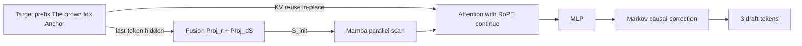

[Paper](https://arxiv.org/abs/2609.24197v1)
## Parallel Inference without Drafter-Side KV Cache: H-Spec's Hybrid Speculative Decoding

**TL;DR** shows that the bottleneck in concurrent serving is that a block-diffusion drafter must project target hidden states at every token to maintain a separate KV cache, and combines in-place target KV reuse with $O(1)$ injection of the last-token hidden state in a Mamba-attention hybrid to eliminate the cache while raising mean accepted length and throughput together (source: §1, §3.2, Tab. 2, Fig. 6).

## Key Idea

The central hypothesis of this paper can be stated in one sentence.

> The authors assume that by using hybrid injection that initializes the Mamba state with the target hidden state at the last input position and reuses target KV in place in attention, they can overcome the existing limitation of a separate drafter KV cache and achieve high draft quality across the whole block (source: §3.2, §3.3, Fig. 5).

The original contributions fall into three strands (source: §3, Appx. B).

- **New architectural component:** a 4-layer Mamba-attention-MLP hybrid backbone that consumes Mamba initial-state injection and in-place target KV reuse as separate modules, combined with DSpark Markov-head-based causal correction (source: §3.3, Appx. B.1).
- **New methodological insight:** reduction of context injection from $O(N)$ to $O(1)$, motivated by the observation that in causal attention the last-token hidden state summarizes the entire prefix (source: §3.2).
- **New application of an existing methodology:** applying the Mamba-2 parallel scan to block-parallel drafting to generate a $k=7$-token block in a single pass despite the recurrent structure (source: §3.3.1).

From the authors' perspective, the case for superiority is clear. Reusing target KV directly preserves early positions in the block but conditional acceptance rate falls by up to $16.5$ pp toward later positions, so a compressed global summary and fine-grained position-wise information must be provided together (source: §3.1, Fig. 4). Ablations establish that the two are complements, not substitutes (source: §4.3, Fig. 7a).

## Background: The Problem They Solved

At publication time, the state of the art was dominated by parallel drafting (source: §1, §5). The autoregressive drafters Eagle-series and ReDrafter came first, P-Eagle extended them with parallelization, and DFlash generated $k$ tokens in a single forward pass with block diffusion (source: §2, §5). Domino, DSpark, DBlast, and DFlash-2 added lightweight sequential heads, convolutions, or path selectors on top to reinforce inter-token causality (source: §2, §5, Appx. D.2).

The shared premise is **KV injection**. It fuses and projects hidden states from selected target layers at every input position and uses them as drafter prefix KV (source: §2, Fig. 2). Predictions become strongly conditioned on the target so acceptance rate rises, but a separate drafter KV cache must be held on GPU for the lifetime of the request (source: §2).

The costs are concrete (source: Tab. 1, Fig. 3).

- Per-token KV inflation with official DFlash checkpoints is $1.139$x for Qwen3-4B, $1.139$x for Qwen3-8B, $1.156$x for Llama3.1-8B-Instruct, $1.375$x for Qwen3.5-27B, and $1.800$x for Qwen3.5-397B-A17B. Units are an extra $20$ KiB / token to $24$ KiB / token in bf16.
- For Qwen3-8B, drafter KV injection time grows $4.7$x from $4$ concurrent requests to $128$ requests, averaged over five waves.

So the research gap is this. Can strong target conditioning be kept while eliminating $O(N)$ extra memory (source: §1)? The simplest fix, DFlash + direct target KV reuse, is on par at early draft positions $0$, $1$ with $-2.07$ pp to $+1.91$ pp, but gaps open up to $6.3$ pp, $12.5$ pp, and $16.5$ pp at indices $2$, $4$, and $6$ (source: §3.1, Fig. 4). Late-block quality collapse is the core motivation.

## New Approach: H-Spec

H-Spec's solution is to feed two kinds of target context to the modules suited to each (source: §3.3, Fig. 5).

- **Mamba module:** projects the target hidden state of the last input token and injects it as the recurrent state. Mamba's fixed-size-state role and whole-input-summary information fit together naturally (source: §3.3.1).
- **Attention module:** reuses the target KV cache as is. It pulls information from multiple depths via one-to-one layer mapping, but performs no cross-layer fusion and therefore creates no extra cache (source: §3.3.2).
- **Causal correction:** places DSpark's Markov head after the hybrid backbone to impose first-order Markov dependence that adjusts current logits with the immediately preceding prediction. The authors state explicitly that this is a replaceable part, not a contribution of this paper (source: §3.3.3).

Key settings were matched to baselines for fair comparison (source: Appx. B.1, Appx. B.2). Attention and MLP, and Markov rank $256$ dimensions, are identical to 5-layer DFlash/DSpark, and depth is reduced to $4$ layers because Mamba is added. Three layers are full Mamba-attention-MLP and one layer is partial Mamba-MLP. The trainable-parameter difference is within $2.9$% of DSpark. Mamba-2 uses head dimension $64$, state dimension $4$, $4$ groups, convolution kernel $4$, and expansion factor $1$, with head counts $44$ for Qwen3-4B, $48$ for Qwen3-8B, and $56$ for Llama3.1-8B-IT. Fusion rank $r$ is $4096$ dimensions for Llama3.1/Qwen3-8B and $2560$ dimensions for Qwen3-4B. Target layers are taken from Llama layers $1$, $8$, $15$, $22$, $30$ and Qwen3 layers $1$, $9$, $17$, $25$, $34$, and the 3 attention layers reuse KV from the last 3 of those layers. Sliding window $2048$ tokens, inference vocabulary $32000$-token pruning, fixed-length verification, and unified Qwen3 attention apply to all methods in common.

The latency model is as follows (source: §2).

$$
L_{sd} = (T_D(k) + T_T) / \tau
$$

Here $T_D(k)$ is $k$-token draft time (ms), $T_T$ is target single-forward time (ms), and $\tau$ is mean accepted length (MAL, tokens/step). It ranges over $1 \le \tau \le k+1$ and includes the 1 bonus token. Overall speedup is $L_T / L_{sd}$.

The Mamba initial-state computation is as follows (source: §3.3.1).

$$
F_n(\mathcal{M}) = \text{Proj}_{r}(\text{Concat}(\{h_n^{(m)}\}_{m \in \mathcal{M}})), \quad S_{\text{init}} = \text{Proj}_{d_S}(F_n(\mathcal{M}))
$$

Here $h_n^{(m)}$ is the target layer-$m$ hidden state at the last input position $n$, $\mathcal{M}$ is the selected 5-layer set, $r$ is the fusion rank, and $d_S$ is the flattened Mamba-2 state dimension. Weights are shared across all drafter layers so it is computed only once per forward pass.

## How It Works: A Concrete Walkthrough

For graduate-student readers, consider a toy example shrunk to a $3$-token sentence (source: §3.3, Fig. 5).

Input sentence: `The(0) brown(1) fox(2)` + `Anchor(3)` + `[MASK](4) [MASK](5) [MASK](6)`. Assume $k=3$ drafts and only $2$ target layers.

**Step 1: Target forward pass.** The target model processes positions $0$–$3$ with causal attention. KV is stored at each position, and hidden states $h_3^{(1)}$, $h_3^{(2)}$ at the last position $n=3$ summarize the whole `The brown fox Anchor`. Key term definitions: KV is the key-value cache, i.e., per-position information later queries retrieve, and hidden state is accumulated context useful for future prediction (source: §3.2).

**Step 2: Initial-state injection.** Concatenate the two layer vectors, reduce to $r$ dimensions with $\text{Proj}_r$, then project with $\text{Proj}_{d_S}$ to the Mamba state shape $[\text{nheads}, 64, 4]$. With $2$ heads in this example, a $2 \times 64 \times 4 = 512$-dimensional vector becomes $S_{\text{init}}$. Feed this state as the starting point of the Mamba-2 parallel scan (source: §3.3.1).

**Step 3: Mamba parallel scan.** The first Mamba layer input is the same `[MASK]` embedding at all three positions. The recurrence is $S_i = \bar{A}_i S_{i-1} + \bar{B}_i x_i$, where $\bar{A}_i$ and $\bar{B}_i$ are input-dependent. Because the recurrence is linear, all three positions are computed at once with no sequential execution. The outputs differ per position. Position $4$ is the output after one step from $S_{\text{init}}$, position $5$ after two evolved steps. Order information comes from the scan itself even without RoPE (source: §3.3.1).

**Step 4: In-place attention.** Each draft query causally attends to target prefix KV $0$–$3$ and prior positions inside the mask block. Q/K must use the same RoPE $\theta$ as the target and continuing position indices $4$, $5$, $6$ to match the stored post-RoPE KV. Nothing outside the $2048$-token window is visible (source: §3.3.2).

**Step 5: Causal correction.** The Markov head adjusts parallel-backbone output logits with the previous-position prediction to fix continuity such as `brown fox jumps`. Without it, each `[MASK]` is predicted independently and repetition such as `brown brown brown` easily arises (source: §3.3.3).

This flow works identically for $k=7$ tokens and a $36$-layer target, and because only 1 last token is stored, extra memory is $O(1)$ in input length $N$ (source: §3.2).

## Secret Weapon: What Breaks When the Hybrid Breaks

If one key part must be picked, it is the **combination of Mamba state initialization + KV reuse** itself. There are both experiments that fix the architecture and remove only inputs, and experiments that remove modules and match parameters (source: §4.3, Fig. 7, Appx. B.4). Mean $\tau$ is the unweighted mean over 8 tasks in units of tokens/step.

| Variant | Llama3.1-8B-IT $\tau$ | Qwen3-4B $\tau$ | Qwen3-8B $\tau$ | Mechanistic interpretation |
|---|---:|---:|---:|---|
| Full H-Spec | $3.08$ | $3.24$ | $3.21$ | Combined summary + position-wise information |
| Last token only | $2.14$ | $2.41$ | $2.44$ | Drops $-24.1$% to $-30.5$% with no fine-grained prefix retrieval |
| KV reuse only | $2.72$ | $2.99$ | $2.98$ | Drops $-7.1$% to $-11.7$% with loss of global summary |
| Mamba-only 5 layers | $2.07$ | $2.32$ | $2.36$ | Limited to recurrent compression with no position-wise retrieval |
| Attention-only 5 layers | $2.65$ | $2.69$ | $2.64$ | Late-block decay with retrieval only and no summary |
| Hybrid without Markov | $3.00$ | $3.06$ | $3.05$ | Backbone combination alone beats singletons by $+13.3$% to $+45.1$% |

Parameters were matched within $5.2$%, so this is not a capacity difference (source: §4.3). With last token only, mask-block attention cannot see the target, and with KV only, Mamba starts from a zero vector and repeats the late-block decay of DFlash variants. The crux of the hybrid division of labor is that Mamba captures long-range dependence with the $O(1)$ summary while attention fills in details with $O(N)$ retrieval (source: §4.3, Fig. 8).

The runtime reversal also matters. For Qwen3-8B, relative forward-time speedup of hybrid versus block diffusion is $-5.0$% to $0.0$% slower below concurrency $C=32$, but faster by about $+7.0$% at $C=64$ and about $+10.0$% at $C=128$. It is slower at input length $512$ tokens or below, but overtakes by $+7.0$% to $+20.0$% at $1024$ tokens or above. This is the effect of avoiding KV injection overhead and cutting to 3 attention layers (source: §4.3, Fig. 8).

## Performance Validation: Main Results

Single-request evaluation uses Llama3.1-8B-IT, Qwen3-4B, and Qwen3-8B targets on 8 tasks across math, QA, dialogue, RAG, summarization, translation, code, and tool use, with $k=7$ tokens, up to $4096$ tokens per response, on a single A100 $80$ GB GPU (source: §4, Tab. 2). Training mixes $100000$ Magpie and Ultrachat samples at $60$:$40$ for $5$ epochs with AdamW peak learning rate $6.0\times10^{-4}$, loss $0.1$ CE + $0.9$ TV, and block weight $\gamma=4$, uniformly (source: Appx. B.3). Optimizer steps are identical at $27086$ steps for Llama and $104032$ steps for Qwen3.

Key metrics are MAL $\tau$ (tokens/step) and ITL speedup (x) over no speculation (source: Tab. 2, Appx. C.1).

- Llama3.1-8B-IT mean $\tau$ $3.08$ versus best baseline $2.72$ for $+13.3$%, and speedup $2.51$x versus $2.23$x for $+12.6$%.
- Qwen3-4B mean $\tau$ $3.24$ versus $3.09$ for $+5.0$%, and speedup $2.50$x versus $2.37$x for $+5.3$%.
- Qwen3-8B mean $\tau$ $3.21$ versus $2.95$ for $+8.7$%, and speedup $2.61$x versus $2.40$x for $+8.7$%.
- 95% paired bootstrap CIs are all above $0$, so the gains are statistically significant. For example, $\tau$-improvement CIs are Llama $[+9.0$%, $+17.5$%$]$, Qwen3-4B $[+4.3$%, $+5.6$%$]$, and Qwen3-8B $[+8.0$%, $+9.4$%$]$.

What the authors emphasize most is concurrent serving. In vLLM with $1000$ requests each from MATH, LiveCodeBench, and Alpaca at concurrency $C=8$, $16$, $32$, $64$, $128$, H-Spec achieves the highest throughput and the lowest KV cache occupancy across the whole range simultaneously (source: §4.2, Fig. 6). Peak throughput gains are $13.0$%–$17.3$%, $5.1$%–$7.4$%, and $7.6$%–$9.7$% per target, while KV occupancy falls $4.3$%–$24.6$%. For Qwen3-8B the gap widens $1.13$x–$1.58$x from $C=8$ to $128$ because baseline injection overhead grows with concurrency while H-Spec avoids it.

Robustness checks are also broad (source: §4.4, Appx. D).

- Leads are retained with $\tau$ $+4.8$%–$+12.0$% under greedy sampling and $+4.7$%–$+8.4$% under non-truncated sampling at temperature $1.0$.
- At $k=3$, $5$, $7$, Qwen3-8B $\tau$ is $2.68$, $3.07$, $3.21$, ranking first throughout, with the margin growing to $+4.3$%, $+5.8$%, $+8.7$% by length.
- On HELMET cite and longQA from $1$K–$32$K tokens, $+6.8$%–$+9.2$% is retained, nearly flat from cite $1$K $+7.5$% to $32$K $+7.2$%.
- On 9 DeepSpec tasks, $\tau$ $+3.8$%–$+12.5$% and speedup $+4.3$%–$+13.1$%, ranking first on all tasks and all targets.
- Zero-shot transfer to 6 fine-tuned targets retains a significant first place in 11 of 12 settings.

The strongest point in critical comparison is the coincidence of first place on single requests and first place on serving. Draft quality and system efficiency are usually a tradeoff, but H-Spec captures both by eliminating drafter KV (source: §4.1, §4.2). Against an in-house DFlash-2 implementation, it still leads by MATH peak throughput $+4.2$%, LiveCodeBench $+2.4$%, Alpaca $+8.4$%, and KV occupancy $-9.7$%–$-20.2$% (source: Appx. D.2, Fig. 11). The contrast is that DFlash-2 improves quality over DSpark but keeps the KV injection structure, so it does not close the memory gap.

Conversely, points with small or insignificant gains are also reported (source: Appx. C.1). It ranks first on $\tau$ in $22$/$24$ and on speedup in $23$/$24$ task-target settings, and 95% CIs sit above $0$ in 42 of 45 leading settings. Three settings — Llama math and dialogue speed and Qwen3-4B translation $\tau$ — are insignificant against the best but significant against the runner-up. The authors do not hide this and report it alongside.

## Our Take: Strengths, Limitations, and Why This Matters

**Strengths** lie in the honesty of the problem definition and the coherence of the design. Memory inflation is measured at $1.139$x–$1.800$x, the failure curve of naive reuse is shown first, and only then is the solution presented (source: Tab. 1, Fig. 4). Putting the global summary in the Mamba-state vessel and leaving retrieval to attention matches each module's inductive bias (source: §3.3). With the same training recipe, same target layers, parameter matching within $2.9$%, and statistical-significance reporting, the claims carry high credibility (source: Appx. B, Appx. C).

**Explicit limitations** are also clear (source: §5). Using target KV as is imposes the structural constraint that drafter K/V dimensions and head counts must match the target. Below low concurrency $32$ or short inputs of $512$ tokens or fewer, the deeper compute graph makes forward passes slower than block diffusion. Because the ranking reverses in high-concurrency, long-context regimes, perceived gains depend on deployment conditions.

Three potential limitations stand out. First, Markov-head dependence remains, so results could change if causal correction is swapped. The authors themselves isolate it as a non-contributing part (source: §3.3.3). Second, serving measurements are limited to a single A100 $80$ GB GPU and means over $3$ repeats, so generalization to other parallelism and quantization stacks needs further checks (source: §4, §4.2). Third, the uniform settings of $32000$-token vocabulary pruning and fixed-length verification are fair to all methods, but whether rankings hold when combined with adaptive verification is unverified (source: Appx. B.2).

Even so, this work matters because it extends drafter design from an accuracy race to a system-efficiency race. Cases that simultaneously raise mean accepted length while cutting KV occupancy by $4.3$%–$24.6$% and raising throughput by $5.1$%–$17.3$% are rare (source: §4.2). That the gap widens as concurrency rises changes the selection criterion in real serving.

## What's Next?: Future Directions

Future work proposed by the authors is exploring target-layer selection strategies, cutting attention overhead via partial reuse of target KV heads, and evaluating additional causal corrections for the hybrid backbone (source: §5). Orthogonal combination that mounts DFlash-2's two-tap convolution and path selector on the hybrid backbone is also mentioned (source: Appx. D.2).

Against the limitations, four reasonable next steps stand out. First, redesigning the depth-versus-width tradeoff in the low-concurrency regime at $C=8$ and below. Second, measuring the actual speed-quality Pareto of head-subset reuse. Third, compatibility checks beyond $32$K tokens and on diverse KV-compressing targets such as GQA and MLA. Fourth, end-to-end throughput evaluation combined with confidence-based adaptive verification. Once these are filled in, cache-free parallel drafting could come close to the default (source: §5, Appx. D).

<!-- verbatim-tables -->

## Tables from the paper

> Tables converted mechanically from the arXiv e-print LaTeX source. The numbers are the paper's own and did not pass through a model.

**Table 1. **H-Spec\xspace improves accepted draft length and generation speed under batch size 1.** MAL ($\tau$) and speedup (*Spd.*) at batch size 1 over no-speculative-decoding. Max 4,096 tokens per response. H-Spec\xspace results are tinted; best values are bolded. Statistical uncertainty reported in sec:single-request-stat-uncert.**

| black0pt0ptblack!42 0pt2.6ex0pt0pt black!600.7pt0pt0ptblack!42 0pt2.7ex\scshapeL-8B-IT0pt0pt | **Math** $\tau$ | **Math** *Spd.* | **QA** $\tau$ | **QA** *Spd.* | **Chat** $\tau$ | **Chat** *Spd.* | **RAG** $\tau$ | **RAG** *Spd.* | **Summ.** $\tau$ | **Summ.** *Spd.* | **Transl.** $\tau$ | **Transl.** *Spd.* | **Code** $\tau$ | **Code** *Spd.* | **Tool** $\tau$ | **Tool** *Spd.* | **Avg.** $\tau$ | **Avg.** *Spd.* |
|---|---|---|---|---|---|---|---|---|---|---|---|---|---|---|---|---|---|---|
| black!300.3pt0pt0ptblack!42 0pt2.6exP-Eagle | 3.08 | *2.82*{4.6pt5pt\selectfont\texttimes} | **2.73** | 2.34{4.6pt5pt\selectfont\texttimes} | 2.59 | *2.14*{4.6pt5pt\selectfont\texttimes} | 2.62 | *2.02*{4.6pt5pt\selectfont\texttimes} | 2.44 | *1.89*{4.6pt5pt\selectfont\texttimes} | 1.66 | *1.35*{4.6pt5pt\selectfont\texttimes} | 3.62 | *2.59*{4.6pt5pt\selectfont\texttimes} | 2.78 | *2.12*{4.6pt5pt\selectfont\texttimes} | 2.69 | *2.16*{4.6pt5pt\selectfont\texttimes} |
| DFlash | 2.99 | *2.57*{4.6pt5pt\selectfont\texttimes} | 2.19 | *1.65*{4.6pt5pt\selectfont\texttimes} | 2.69 | *2.30*{4.6pt5pt\selectfont\texttimes} | 2.29 | *1.83*{4.6pt5pt\selectfont\texttimes} | 2.11 | *1.67*{4.6pt5pt\selectfont\texttimes} | 1.44 | *1.20*{4.6pt5pt\selectfont\texttimes} | 3.46 | *2.88*{4.6pt5pt\selectfont\texttimes} | 2.63 | *2.09*{4.6pt5pt\selectfont\texttimes} | 2.47 | *2.03*{4.6pt5pt\selectfont\texttimes} |
| DSpark | 3.27 | *2.77*{4.6pt5pt\selectfont\texttimes} | 2.63 | *2.32*{4.6pt5pt\selectfont\texttimes} | **3.03** | *2.49*{4.6pt5pt\selectfont\texttimes} | 2.48 | *1.95*{4.6pt5pt\selectfont\texttimes} | 2.27 | *1.79*{4.6pt5pt\selectfont\texttimes} | 1.46 | *1.20*{4.6pt5pt\selectfont\texttimes} | 3.82 | *3.09*{4.6pt5pt\selectfont\texttimes} | 2.77 | *2.23*{4.6pt5pt\selectfont\texttimes} | 2.72 | *2.23*{4.6pt5pt\selectfont\texttimes} |
| H-Spec\xspace | **4.24** | 3.23{4.6pt5pt\selectfont\texttimes} | 2.40 | *2.21*{4.6pt5pt\selectfont\texttimes} | 2.99 | 2.64{4.6pt5pt\selectfont\texttimes} | **2.96** | 2.31{4.6pt5pt\selectfont\texttimes} | **2.77** | 2.21{4.6pt5pt\selectfont\texttimes} | **1.80** | 1.43{4.6pt5pt\selectfont\texttimes} | **4.29** | 3.53{4.6pt5pt\selectfont\texttimes} | **3.19** | 2.54{4.6pt5pt\selectfont\texttimes} | **3.08** | 2.51{4.6pt5pt\selectfont\texttimes}0pt0pt |
| black!600.7pt0pt0ptblack!42 0pt2.7ex\scshapeQ-4B0pt0pt | $\tau$ | *Spd.* | $\tau$ | *Spd.* | $\tau$ | *Spd.* | $\tau$ | *Spd.* | $\tau$ | *Spd.* | $\tau$ | *Spd.* | $\tau$ | *Spd.* | $\tau$ | *Spd.* | $\tau$ | *Spd.* |
| black!300.3pt0pt0ptblack!42 0pt2.6exP-Eagle | 3.76 | *2.77*{4.6pt5pt\selectfont\texttimes} | 2.84 | *2.15*{4.6pt5pt\selectfont\texttimes} | 3.04 | *2.18*{4.6pt5pt\selectfont\texttimes} | 2.92 | *2.08*{4.6pt5pt\selectfont\texttimes} | 2.39 | *1.74*{4.6pt5pt\selectfont\texttimes} | 2.69 | *2.10*{4.6pt5pt\selectfont\texttimes} | 3.41 | *2.37*{4.6pt5pt\selectfont\texttimes} | 2.87 | *2.08*{4.6pt5pt\selectfont\texttimes} | 2.99 | *2.18*{4.6pt5pt\selectfont\texttimes} |
| DFlash | 3.74 | *2.93*{4.6pt5pt\selectfont\texttimes} | 2.67 | *2.22*{4.6pt5pt\selectfont\texttimes} | 2.91 | *2.31*{4.6pt5pt\selectfont\texttimes} | 2.68 | *2.12*{4.6pt5pt\selectfont\texttimes} | 2.28 | *1.80*{4.6pt5pt\selectfont\texttimes} | 2.43 | *2.03*{4.6pt5pt\selectfont\texttimes} | 3.39 | *2.52*{4.6pt5pt\selectfont\texttimes} | 2.80 | *2.20*{4.6pt5pt\selectfont\texttimes} | 2.86 | *2.26*{4.6pt5pt\selectfont\texttimes} |
| DSpark | 4.02 | *3.04*{4.6pt5pt\selectfont\texttimes} | 2.90 | *2.31*{4.6pt5pt\selectfont\texttimes} | 3.16 | *2.43*{4.6pt5pt\selectfont\texttimes} | 2.92 | *2.22*{4.6pt5pt\selectfont\texttimes} | 2.45 | *1.87*{4.6pt5pt\selectfont\texttimes} | 2.58 | *2.11*{4.6pt5pt\selectfont\texttimes} | 3.69 | *2.70*{4.6pt5pt\selectfont\texttimes} | 2.99 | *2.30*{4.6pt5pt\selectfont\texttimes} | 3.09 | *2.37*{4.6pt5pt\selectfont\texttimes} |
| H-Spec\xspace | **4.17** | 3.19{4.6pt5pt\selectfont\texttimes} | **3.04** | 2.43{4.6pt5pt\selectfont\texttimes} | **3.32** | 2.58{4.6pt5pt\selectfont\texttimes} | **3.12** | 2.32{4.6pt5pt\selectfont\texttimes} | **2.62** | 2.01{4.6pt5pt\selectfont\texttimes} | **2.74** | 2.23{4.6pt5pt\selectfont\texttimes} | **3.83** | 2.82{4.6pt5pt\selectfont\texttimes} | **3.09** | 2.42{4.6pt5pt\selectfont\texttimes} | **3.24** | 2.50{4.6pt5pt\selectfont\texttimes}0pt0pt |
| black!600.7pt0pt0ptblack!42 0pt2.7ex\scshapeQ-8B0pt0pt | $\tau$ | *Spd.* | $\tau$ | *Spd.* | $\tau$ | *Spd.* | $\tau$ | *Spd.* | $\tau$ | *Spd.* | $\tau$ | *Spd.* | $\tau$ | *Spd.* | $\tau$ | *Spd.* | $\tau$ | *Spd.* |
| black!300.3pt0pt0ptblack!42 0pt2.6exP-Eagle | 3.74 | *2.91*{4.6pt5pt\selectfont\texttimes} | 2.65 | *2.19*{4.6pt5pt\selectfont\texttimes} | 2.98 | *2.33*{4.6pt5pt\selectfont\texttimes} | 2.83 | *2.16*{4.6pt5pt\selectfont\texttimes} | 2.36 | *1.88*{4.6pt5pt\selectfont\texttimes} | 2.63 | *2.14*{4.6pt5pt\selectfont\texttimes} | 3.36 | *2.56*{4.6pt5pt\selectfont\texttimes} | 2.83 | *2.22*{4.6pt5pt\selectfont\texttimes} | 2.92 | *2.30*{4.6pt5pt\selectfont\texttimes} |
| DFlash | 3.68 | *2.97*{4.6pt5pt\selectfont\texttimes} | 2.58 | *2.17*{4.6pt5pt\selectfont\texttimes} | 2.85 | *2.35*{4.6pt5pt\selectfont\texttimes} | 2.58 | *2.11*{4.6pt5pt\selectfont\texttimes} | 2.22 | *1.82*{4.6pt5pt\selectfont\texttimes} | 2.31 | *1.99*{4.6pt5pt\selectfont\texttimes} | 3.29 | *2.60*{4.6pt5pt\selectfont\texttimes} | 2.68 | *2.21*{4.6pt5pt\selectfont\texttimes} | 2.77 | *2.28*{4.6pt5pt\selectfont\texttimes} |
| DSpark | 3.91 | *3.17*{4.6pt5pt\selectfont\texttimes} | 2.69 | *2.27*{4.6pt5pt\selectfont\texttimes} | 3.11 | *2.52*{4.6pt5pt\selectfont\texttimes} | 2.74 | *2.21*{4.6pt5pt\selectfont\texttimes} | 2.34 | *1.89*{4.6pt5pt\selectfont\texttimes} | 2.42 | *2.03*{4.6pt5pt\selectfont\texttimes} | 3.57 | *2.81*{4.6pt5pt\selectfont\texttimes} | 2.84 | *2.32*{4.6pt5pt\selectfont\texttimes} | 2.95 | *2.40*{4.6pt5pt\selectfont\texttimes} |
| H-Spec\xspace | **4.13** | 3.36{4.6pt5pt\selectfont\texttimes} | **2.97** | 2.44{4.6pt5pt\selectfont\texttimes} | **3.32** | 2.69{4.6pt5pt\selectfont\texttimes} | **3.03** | 2.46{4.6pt5pt\selectfont\texttimes} | **2.63** | 2.12{4.6pt5pt\selectfont\texttimes} | **2.74** | 2.31{4.6pt5pt\selectfont\texttimes} | **3.82** | 3.00{4.6pt5pt\selectfont\texttimes} | **3.06** | 2.50{4.6pt5pt\selectfont\texttimes} | **3.21** | 2.61{4.6pt5pt\selectfont\texttimes}0pt0pt |
| black0pt0ptblack!42 |  |  |  |  |  |  |  |  |  |  |  |  |  |  |  |  |  |  |

**Table 2. tab:deepspec-mal-spd**H-Spec\xspace leads in draft acceptance and speedup on the DeepSpec evaluation suite.** Mean accepted length ($\tau$) and batch-size-1 ITL speedup (Spd.) relative to no-speculative-decoding over nine tasks. Paired bootstrap 95% CIs for H-Spec\xspace's relative gains over the best baseline lie above zero for every task-target-metric setting, indicating statistical significance.**

| black0pt0ptblack!42 0pt2.6ex | **Math** |  |  |  |  |  | **Code** |  |  |  |  |  | **Chat** |  |  |  |  |  |
|---|---|---|---|---|---|---|---|---|---|---|---|---|---|---|---|---|---|---|
| black!42 0pt2.5ex0pt0pt | gsm8k |  | math500 |  | aime25 |  | livecodebench |  | mbpp |  | humaneval |  | alpaca |  | arena-hard-v2 |  | mt-bench |  |
| black!600.7pt0pt0ptblack!42 0pt2.7ex\scshapeL-8B-IT0pt0pt | $\tau$ | *Spd.* | $\tau$ | *Spd.* | $\tau$ | *Spd.* | $\tau$ | *Spd.* | $\tau$ | *Spd.* | $\tau$ | *Spd.* | $\tau$ | *Spd.* | $\tau$ | *Spd.* | $\tau$ | *Spd.* |
| black!300.3pt0pt0ptblack!42 0pt2.6exP-Eagle | 3.21 | *2.66*{4.6pt5pt\selectfont\texttimes} | 3.96 | *3.19*{4.6pt5pt\selectfont\texttimes} | 4.05 | *3.16*{4.6pt5pt\selectfont\texttimes} | 2.75 | *2.25*{4.6pt5pt\selectfont\texttimes} | 3.53 | *2.90*{4.6pt5pt\selectfont\texttimes} | 3.50 | *2.87*{4.6pt5pt\selectfont\texttimes} | 2.57 | *2.09*{4.6pt5pt\selectfont\texttimes} | 2.13 | *1.68*{4.6pt5pt\selectfont\texttimes} | 2.61 | *2.17*{4.6pt5pt\selectfont\texttimes} |
| DFlash | 3.11 | *2.65*{4.6pt5pt\selectfont\texttimes} | 3.78 | *3.14*{4.6pt5pt\selectfont\texttimes} | 3.86 | *3.03*{4.6pt5pt\selectfont\texttimes} | 2.67 | *2.23*{4.6pt5pt\selectfont\texttimes} | 3.46 | *2.91*{4.6pt5pt\selectfont\texttimes} | 3.26 | *2.72*{4.6pt5pt\selectfont\texttimes} | 2.40 | *2.02*{4.6pt5pt\selectfont\texttimes} | 2.08 | *1.63*{4.6pt5pt\selectfont\texttimes} | 2.45 | *2.11*{4.6pt5pt\selectfont\texttimes} |
| DSpark | 3.42 | *2.83*{4.6pt5pt\selectfont\texttimes} | 4.17 | *3.37*{4.6pt5pt\selectfont\texttimes} | 4.18 | *3.36*{4.6pt5pt\selectfont\texttimes} | 2.90 | *2.37*{4.6pt5pt\selectfont\texttimes} | 3.86 | *3.03*{4.6pt5pt\selectfont\texttimes} | 3.67 | *3.05*{4.6pt5pt\selectfont\texttimes} | 2.70 | *2.22*{4.6pt5pt\selectfont\texttimes} | 2.08 | *1.65*{4.6pt5pt\selectfont\texttimes} | 2.92 | *2.28*{4.6pt5pt\selectfont\texttimes} |
| H-Spec\xspace | **4.02** | 3.35{4.6pt5pt\selectfont\texttimes} | **4.64** | 3.78{4.6pt5pt\selectfont\texttimes} | **4.78** | 3.74{4.6pt5pt\selectfont\texttimes} | **3.33** | 2.66{4.6pt5pt\selectfont\texttimes} | **4.21** | 3.51{4.6pt5pt\selectfont\texttimes} | **4.20** | 3.39{4.6pt5pt\selectfont\texttimes} | **3.01** | 2.48{4.6pt5pt\selectfont\texttimes} | **2.31** | 1.90{4.6pt5pt\selectfont\texttimes} | **3.14** | 2.54{4.6pt5pt\selectfont\texttimes}0pt0pt |
| black!600.7pt0pt0ptblack!42 0pt2.7ex\scshapeQ-4B0pt0pt | $\tau$ | *Spd.* | $\tau$ | *Spd.* | $\tau$ | *Spd.* | $\tau$ | *Spd.* | $\tau$ | *Spd.* | $\tau$ | *Spd.* | $\tau$ | *Spd.* | $\tau$ | *Spd.* | $\tau$ | *Spd.* |
| black!300.3pt0pt0ptblack!42 0pt2.6exP-Eagle | 3.76 | *2.80*{4.6pt5pt\selectfont\texttimes} | 3.83 | *2.81*{4.6pt5pt\selectfont\texttimes} | 3.52 | *2.54*{4.6pt5pt\selectfont\texttimes} | 3.07 | *2.17*{4.6pt5pt\selectfont\texttimes} | 3.35 | *2.51*{4.6pt5pt\selectfont\texttimes} | 3.37 | *2.49*{4.6pt5pt\selectfont\texttimes} | 2.67 | *2.03*{4.6pt5pt\selectfont\texttimes} | 2.27 | *1.65*{4.6pt5pt\selectfont\texttimes} | 2.95 | *2.19*{4.6pt5pt\selectfont\texttimes} |
| DFlash | 3.70 | *2.96*{4.6pt5pt\selectfont\texttimes} | 3.79 | *3.00*{4.6pt5pt\selectfont\texttimes} | 3.50 | *2.74*{4.6pt5pt\selectfont\texttimes} | 2.98 | *2.27*{4.6pt5pt\selectfont\texttimes} | 3.29 | *2.65*{4.6pt5pt\selectfont\texttimes} | 3.29 | *2.59*{4.6pt5pt\selectfont\texttimes} | 2.56 | *2.11*{4.6pt5pt\selectfont\texttimes} | 2.19 | *1.71*{4.6pt5pt\selectfont\texttimes} | 2.85 | *2.27*{4.6pt5pt\selectfont\texttimes} |
| DSpark | 4.01 | *3.13*{4.6pt5pt\selectfont\texttimes} | 4.12 | *3.18*{4.6pt5pt\selectfont\texttimes} | 3.78 | *2.85*{4.6pt5pt\selectfont\texttimes} | 3.26 | *2.41*{4.6pt5pt\selectfont\texttimes} | 3.60 | *2.84*{4.6pt5pt\selectfont\texttimes} | 3.62 | *2.77*{4.6pt5pt\selectfont\texttimes} | 2.79 | *2.22*{4.6pt5pt\selectfont\texttimes} | 2.31 | *1.74*{4.6pt5pt\selectfont\texttimes} | 3.09 | *2.42*{4.6pt5pt\selectfont\texttimes} |
| H-Spec\xspace | **4.14** | 3.23{4.6pt5pt\selectfont\texttimes} | **4.27** | 3.29{4.6pt5pt\selectfont\texttimes} | **3.91** | 2.97{4.6pt5pt\selectfont\texttimes} | **3.40** | 2.53{4.6pt5pt\selectfont\texttimes} | **3.76** | 2.96{4.6pt5pt\selectfont\texttimes} | **3.76** | 2.89{4.6pt5pt\selectfont\texttimes} | **2.92** | 2.35{4.6pt5pt\selectfont\texttimes} | **2.38** | 1.82{4.6pt5pt\selectfont\texttimes} | **3.21** | 2.53{4.6pt5pt\selectfont\texttimes}0pt0pt |
| black!600.7pt0pt0ptblack!42 0pt2.7ex\scshapeQ-8B0pt0pt | $\tau$ | *Spd.* | $\tau$ | *Spd.* | $\tau$ | *Spd.* | $\tau$ | *Spd.* | $\tau$ | *Spd.* | $\tau$ | *Spd.* | $\tau$ | *Spd.* | $\tau$ | *Spd.* | $\tau$ | *Spd.* |
| black!300.3pt0pt0ptblack!42 0pt2.6exP-Eagle | 3.71 | *2.98*{4.6pt5pt\selectfont\texttimes} | 3.83 | *3.04*{4.6pt5pt\selectfont\texttimes} | 3.57 | *2.80*{4.6pt5pt\selectfont\texttimes} | 3.02 | *2.34*{4.6pt5pt\selectfont\texttimes} | 3.27 | *2.62*{4.6pt5pt\selectfont\texttimes} | 3.33 | *2.63*{4.6pt5pt\selectfont\texttimes} | 2.68 | *2.16*{4.6pt5pt\selectfont\texttimes} | 2.25 | *1.77*{4.6pt5pt\selectfont\texttimes} | 2.94 | *2.32*{4.6pt5pt\selectfont\texttimes} |
| DFlash | 3.58 | *2.98*{4.6pt5pt\selectfont\texttimes} | 3.75 | *3.07*{4.6pt5pt\selectfont\texttimes} | 3.47 | *2.79*{4.6pt5pt\selectfont\texttimes} | 2.92 | *2.34*{4.6pt5pt\selectfont\texttimes} | 3.18 | *2.64*{4.6pt5pt\selectfont\texttimes} | 3.18 | *2.63*{4.6pt5pt\selectfont\texttimes} | 2.54 | *2.13*{4.6pt5pt\selectfont\texttimes} | 2.14 | *1.76*{4.6pt5pt\selectfont\texttimes} | 2.78 | *2.31*{4.6pt5pt\selectfont\texttimes} |
| DSpark | 3.90 | *3.19*{4.6pt5pt\selectfont\texttimes} | 4.09 | *3.31*{4.6pt5pt\selectfont\texttimes} | 3.78 | *3.02*{4.6pt5pt\selectfont\texttimes} | 3.15 | *2.49*{4.6pt5pt\selectfont\texttimes} | 3.49 | *2.84*{4.6pt5pt\selectfont\texttimes} | 3.50 | *2.83*{4.6pt5pt\selectfont\texttimes} | 2.73 | *2.27*{4.6pt5pt\selectfont\texttimes} | 2.25 | *1.81*{4.6pt5pt\selectfont\texttimes} | 2.99 | *2.44*{4.6pt5pt\selectfont\texttimes} |
| H-Spec\xspace | **4.14** | 3.40{4.6pt5pt\selectfont\texttimes} | **4.32** | 3.52{4.6pt5pt\selectfont\texttimes} | **4.00** | 3.28{4.6pt5pt\selectfont\texttimes} | **3.37** | 2.69{4.6pt5pt\selectfont\texttimes} | **3.69** | 3.03{4.6pt5pt\selectfont\texttimes} | **3.74** | 3.05{4.6pt5pt\selectfont\texttimes} | **2.93** | 2.45{4.6pt5pt\selectfont\texttimes} | **2.39** | 1.92{4.6pt5pt\selectfont\texttimes} | **3.22** | 2.68{4.6pt5pt\selectfont\texttimes}0pt0pt |
| black0pt0ptblack!42 |  |  |  |  |  |  |  |  |  |  |  |  |  |  |  |  |  |  |

**Table 3. tab:finetuned-transfer**H-Spec\xspace remains the best drafter under zero-shot transfer.** Drafters trained for the base Llama3.1-8B-IT, Qwen3-4B, and Qwen3-8B target models are evaluated on two fine-tuned targets each. $\dagger$ indicates that the chat template changes in addition to the model weights.**

| black0pt0ptblack!42 0pt2.6ex | **Llama3.1-8B-IT** |  |  |  | **Qwen3-4B** |  |  |  | **Qwen3-8B** |  |  |  |
|---|---|---|---|---|---|---|---|---|---|---|---|---|
| black!42 0pt2.5ex | Selene-1 |  | R1-Distill$^\dagger$ |  | SFT-Sci |  | Jan-Nano$^\dagger$ |  | II-Medical |  | R1-0528$^\dagger$ |  |
| **Method**0pt0pt | $\tau$ | *Spd.* | $\tau$ | *Spd.* | $\tau$ | *Spd.* | $\tau$ | *Spd.* | $\tau$ | *Spd.* | $\tau$ | *Spd.* |
| black!300.3pt0pt0ptblack!42 0pt2.6exP-Eagle | 2.71 | *2.08*{4.6pt5pt\selectfont\texttimes} | 1.88 | *1.49*{4.6pt5pt\selectfont\texttimes} | 2.55 | *1.89*{4.6pt5pt\selectfont\texttimes} | 2.63 | *2.16*{4.6pt5pt\selectfont\texttimes} | 2.54 | *2.08*{4.6pt5pt\selectfont\texttimes} | 1.98 | *1.63*{4.6pt5pt\selectfont\texttimes} |
| DFlash | 2.44 | *2.00*{4.6pt5pt\selectfont\texttimes} | 1.72 | *1.39*{4.6pt5pt\selectfont\texttimes} | 2.44 | *2.01*{4.6pt5pt\selectfont\texttimes} | 2.53 | *2.12*{4.6pt5pt\selectfont\texttimes} | 2.38 | *1.97*{4.6pt5pt\selectfont\texttimes} | 1.90 | *1.58*{4.6pt5pt\selectfont\texttimes} |
| DSpark | 2.71 | *2.14*{4.6pt5pt\selectfont\texttimes} | 1.92 | *1.53*{4.6pt5pt\selectfont\texttimes} | 2.62 | *2.02*{4.6pt5pt\selectfont\texttimes} | 2.71 | *2.23*{4.6pt5pt\selectfont\texttimes} | 2.49 | *2.04*{4.6pt5pt\selectfont\texttimes} | 1.96 | *1.60*{4.6pt5pt\selectfont\texttimes} |
| H-Spec\xspace | **2.94** | 2.50{4.6pt5pt\selectfont\texttimes} | **2.26** | 1.82{4.6pt5pt\selectfont\texttimes} | **2.71** | 2.15{4.6pt5pt\selectfont\texttimes} | **2.89** | 2.38{4.6pt5pt\selectfont\texttimes} | **2.69** | 2.21{4.6pt5pt\selectfont\texttimes} | **2.11** | 1.74{4.6pt5pt\selectfont\texttimes}0pt0pt |
| black0pt0ptblack!42 |  |  |  |  |  |  |  |  |  |  |  |  |

> Figures in this post are taken from the original arXiv:2609.24197 (CC BY 4.0). Only size and format were changed.
