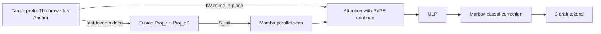

[논문 링크](https://arxiv.org/abs/2609.24197v1)
## Drafter-Side KV Cache 없이 병렬 추론하기: H-Spec의 하이브리드 추측 디코딩

**TL;DR** 은 블록 확산 드래프터가 매 토큰마다 타깃 은닉 상태를 투영해 별도 KV 캐시를 유지해야 한다는 점이 동시 서빙의 병목임을 보이고, 타깃 KV 제자리 재사용과 마지막 토큰 은닉 상태 $O(1)$ 주입을 Mamba-attention 하이브리드로 결합해 캐시를 제거하면서도 평균 수락 길이와 처리량을 동시에 끌어올린다 (근거: §1, §3.2, Tab. 2, Fig. 6) .

## 핵심 아이디어

이 논문의 중심 가설은 한 문장으로 정리할 수 있다.

> 저자들은 마지막 입력 위치의 타깃 은닉 상태로 Mamba 상태를 초기화하고 타깃 KV를 어텐션에서 제자리 재사용하는 하이브리드 주입을 사용함으로써 별도 드래프터 KV 캐시라는 기존 한계를 극복하고 블록 전체에서 높은 드래프트 품질을 달성할 수 있다고 가정한다 (근거: §3.2, §3.3, Fig. 5) .

독창적인 기여는 세 갈래로 구분된다 (근거: §3, Appx. B) .

- **새로운 아키텍처 구성요소:** Mamba 초기 상태 주입과 인플레이스 타깃 KV 재사용을 분리된 모듈로 소비하는 4층 Mamba-attention-MLP 하이브리드 백본과 DSpark Markov 헤드 기반 인과 보정 결합 (근거: §3.3, Appx. B.1) .
- **새로운 방법론적 통찰:** 인과 어텐션에서 마지막 토큰 은닉 상태가 전체 prefix 요약이라는 점에 착안한 $O(N)$ 에서 $O(1)$ 로의 컨텍스트 주입 축소 (근거: §3.2) .
- **기존 방법론의 새로운 적용:** Mamba-2 병렬 스캔을 블록 병렬 드래프팅에 적용해 순환 구조임에도 단일 패스로 $k=7$ 토큰 블록을 생성 (근거: §3.3.1) .

저자들의 관점에서 우월성의 근거는 명확하다. 직접 타깃 KV만 재사용하면 블록 앞쪽 위치에서는 유지되지만 뒤쪽으로 갈수록 조건부 수락률이 최대 $16.5$ pp 하락하므로, 압축된 전체 요약과 세밀한 위치별 정보를 함께 줘야 한다는 것이다 (근거: §3.1, Fig. 4) . 이 둘은 대체재가 아니라 보완재라는 점을 어블레이션으로 입증한다 (근거: §4.3, Fig. 7a) .

## 배경: 그들이 해결한 문제

출판 시점의 최신 기술은 병렬 드래프팅이 대세였다 (근거: §1, §5) . 자가회귀 드래프터인 Eagle 시리즈와 ReDrafter가 먼저 있었고, P-Eagle이 병렬화로 확장했으며, DFlash가 블록 확산 방식으로 $k$ 토큰을 단일 포워드 패스로 생성했다 (근거: §2, §5) . Domino, DSpark, DBlast, DFlash-2는 여기에 경량 순차 헤드나 컨볼루션, 경로 선택기를 얹어 토큰 간 인과성을 보강했다 (근거: §2, §5, Appx. D.2) .

공통 전제는 **KV 주입** 이다. 선택된 타깃 층의 은닉 상태를 매 입력 위치마다 융합·투영해 드래프터 prefix KV로 쓰는 방식이다 (근거: §2, Fig. 2) . 예측이 타깃에 강하게 조건화되어 수락률이 오르지만, 요청 수명 동안 별도 드래프터 KV 캐시를 GPU에 유지해야 한다 (근거: §2) .

비용은 구체적이다 (근거: Tab. 1, Fig. 3) .

- 공식 DFlash 체크포인트 기준 토큰당 KV 증가율은 Qwen3-4B에서 $1.139$ 배, Qwen3-8B에서 $1.139$ 배, Llama3.1-8B-Instruct에서 $1.156$ 배, Qwen3.5-27B에서 $1.375$ 배, Qwen3.5-397B-A17B에서 $1.800$ 배이다. 단위는 $20$ KiB / token부터 $24$ KiB / token 추가분이며 bf16 기준이다.
- Qwen3-8B에서 드래프터 KV 주입 시간은 동시성 $4$ 요청에서 $128$ 요청으로 갈 때 $4.7$ 배 증가하며, 다섯 웨이브 평균이다.

즉 연구 공백은 이것이다. 강한 타깃 조건화를 유지하면서 $O(N)$ 추가 메모리를 없앨 수 있는가 (근거: §1) . 가장 단순한 해법인 DFlash + 직접 타깃 KV 재사용은 앞쪽 드래프트 위치 인덱스 $0$, $1$ 에서는 $-2.07$ pp부터 $+1.91$ pp로 비등하지만, 인덱스 $2$, $4$, $6$ 에서 최대 $6.3$ pp, $12.5$ pp, $16.5$ pp까지 벌어진다 (근거: §3.1, Fig. 4) . 후반부 블록 품질 붕괴가 핵심 동기이다.

## 새로운 접근법: H-Spec

H-Spec의 해법은 두 가지 타깃 컨텍스트를 역할에 맞는 모듈에 나눠 먹이는 것이다 (근거: §3.3, Fig. 5) .

- **Mamba 모듈:** 마지막 입력 토큰의 타깃 은닉 상태를 투영해 순환 상태로 주입한다. Mamba의 고정 크기 상태라는 역할과 전체 입력 요약이라는 정보가 자연스럽게 맞물린다 (근거: §3.3.1) .
- **어텐션 모듈:** 타깃 KV 캐시를 그대로 재사용한다. 층별 일대일 매핑으로 여러 깊이의 정보를 가져오되, 층간 융합은 하지 않아 추가 캐시를 만들지 않는다 (근거: §3.3.2) .
- **인과 보정:** 하이브리드 백본 뒤에 DSpark의 Markov 헤드를 둬 바로 이전 위치 예측으로 현재 로짓을 조정하는 1차 Markov 의존성을 부여한다. 저자들은 이것이 본 논문의 기여가 아니라 교체 가능한 부품임을 명시한다 (근거: §3.3.3) .

주요 설정은 공정 비교를 위해 베이스라인과 맞췄다 (근거: Appx. B.1, Appx. B.2) . 어텐션과 MLP, Markov 랭크 $256$ 차원은 5층 DFlash/DSpark와 동일하고, Mamba가 추가된 만큼 층수는 $4$ 층으로 줄였다. 세 층은 전체 Mamba-attention-MLP, 한 층은 부분 Mamba-MLP이다. 학습 가능 파라미터 차이는 DSpark 대비 $2.9$ % 이내이다. Mamba-2는 헤드 차원 $64$ , 상태 차원 $4$ , 그룹 수 $4$ , 컨볼루션 커널 $4$ , 확장 계수 $1$ 을 쓰고, 헤드 수는 Qwen3-4B $44$ 개, Qwen3-8B $48$ 개, Llama3.1-8B-IT $56$ 개이다. 융합 랭크 $r$ 은 Llama3.1/Qwen3-8B $4096$ 차원, Qwen3-4B $2560$ 차원이다. 타깃 층은 Llama $1$, $8$, $15$, $22$, $30$ 층, Qwen3 $1$, $9$, $17$, $25$, $34$ 층에서 가져오고, 어텐션 3개는 뒤쪽 3개 층의 KV를 재사용한다. 슬라이딩 윈도우 $2048$ 토큰, 추론 어휘 $32000$ 토큰 가지치기, 고정 길이 검증, Qwen3 어텐션 통일이 전 방법에 공통 적용된다.

지연 시간 모델은 다음과 같다 (근거: §2) .

$$
L_{sd} = (T_D(k) + T_T) / \tau
$$

여기서 $T_D(k)$ 는 $k$ 토큰 드래프트 시간(ms), $T_T$ 는 타깃 단일 포워드 시간(ms), $\tau$ 는 평균 수락 길이(MAL, tokens/step)이다. $1 \le \tau \le k+1$ 범위를 가지며 보너스 1 토큰을 포함한다. 전체 속도 향상은 $L_T / L_{sd}$ 이다.

Mamba 초기 상태 계산은 다음과 같다 (근거: §3.3.1) .

$$
F_n(\mathcal{M}) = \text{Proj}_{r}(\text{Concat}(\{h_n^{(m)}\}_{m \in \mathcal{M}})), \quad S_{\text{init}} = \text{Proj}_{d_S}(F_n(\mathcal{M}))
$$

여기서 $h_n^{(m)}$ 은 마지막 입력 위치 $n$ 에서 타깃 $m$ 층 은닉 상태, $\mathcal{M}$ 은 선택된 5개 층 집합, $r$ 은 융합 랭크, $d_S$ 는 Mamba-2 상태 평탄화 차원이다. 가중치는 전 드래프터 층에서 공유되어 포워드당 1회만 계산된다.

## 작동 원리: 구체적인 예시로 살펴보기

대학원생 독자를 위해 $3$ 토큰 문장으로 축소한 토이 예시를 들어보자 (근거: §3.3, Fig. 5) .

입력 문장: `The(0) brown(1) fox(2)` + `Anchor(3)` + `[MASK](4) [MASK](5) [MASK](6)`. $k=3$ 드래프트, 타깃 $2$ 층만 사용한다고 가정한다.

**단계 1: 타깃 포워드.** 타깃 모델이 $0$–$3$ 위치를 인과 어텐션으로 처리한다. 각 위치에 KV가 저장되고, 마지막 위치 $n=3$ 의 은닉 상태 $h_3^{(1)}$, $h_3^{(2)}$ 는 `The brown fox Anchor` 전체를 요약한다. 핵심 용어 정의: KV는 키·밸류 캐시로 이후 쿼리가 검색할 위치별 정보이며, 은닉 상태는 미래 예측에 유용한 누적 문맥이다 (근거: §3.2) .

**단계 2: 초기 상태 주입.** 두 층 벡터를 이어붙여 $\text{Proj}_r$ 로 $r$ 차원으로 줄인 뒤 $\text{Proj}_{d_S}$ 로 Mamba 상태 크기 $[\text{nheads}, 64, 4]$ 에 맞춰 투영한다. 예시로 헤드 $2$ 개라면 $2 \times 64 \times 4 = 512$ 차원 벡터가 $S_{\text{init}}$ 이다. 이 상태를 Mamba-2 병렬 스캔의 시작점으로 넣는다 (근거: §3.3.1) .

**단계 3: Mamba 병렬 스캔.** 첫 Mamba 층 입력은 세 위치 모두 동일한 `[MASK]` 임베딩이다. 순환식은 $S_i = \bar{A}_i S_{i-1} + \bar{B}_i x_i$ 이며 $\bar{A}_i$, $\bar{B}_i$ 는 입력 의존적이다. 선형 순환이므로 세 위치를 순차 실행 없이 한 번에 계산한다. 결과는 위치마다 달라진다. 위치 $4$ 는 $S_{\text{init}}$ 에서 한 스텝, 위치 $5$ 는 두 스텝 진화된 상태의 출력이다. RoPE를 쓰지 않아도 스캔 자체가 순서 정보를 만든다 (근거: §3.3.1) .

**단계 4: 인플레이스 어텐션.** 각 드래프트 쿼리는 타깃 prefix KV $0$–$3$ 과 마스크 블록 내 이전 위치에 인과 어텐션한다. Q/K는 타깃과 동일한 RoPE $\theta$ 와 이어지는 위치 인덱스 $4$, $5$, $6$ 을 써야 저장된 post-RoPE KV와 정합된다. 윈도우 $2048$ 토큰 밖은 보지 않는다 (근거: §3.3.2) .

**단계 5: 인과 보정.** 병렬 백본 출력 로짓에 Markov 헤드가 이전 위치 예측을 반영해 `brown fox jumps` 같은 연속성을 보정한다. 없으면 각 `[MASK]` 가 독립적으로 예측되어 `brown brown brown` 같은 반복이 생기기 쉽다 (근거: §3.3.3) .

이 흐름이 $k=7$ 토큰, $36$ 층 타깃에서도 동일하게 동작하며, 마지막 토큰 1개만 저장하므로 추가 메모리는 입력 길이 $N$ 에 대해 $O(1)$ 이다 (근거: §3.2) .

## 비밀 병기: 하이브리드가 깨지면 무엇이 일어나는가

핵심 부품 하나를 고르면 **Mamba 상태 초기화 + KV 재사용의 결합** 자체이다. 아키텍처를 고정하고 입력만 제거한 실험과, 모듈을 제거하고 파라미터를 맞춘 실험이 모두 있다 (근거: §4.3, Fig. 7, Appx. B.4) . 평균 $\tau$ 는 8개 태스크 비가중 평균이며 단위는 tokens/step이다.

| 변형 | Llama3.1-8B-IT $\tau$ | Qwen3-4B $\tau$ | Qwen3-8B $\tau$ | 메커니즘 해석 |
|---|---:|---:|---:|---|
| H-Spec 전체 | $3.08$ | $3.24$ | $3.21$ | 요약 + 위치별 정보 결합 |
| 마지막 토큰만 | $2.14$ | $2.41$ | $2.44$ | prefix 세밀 검색 불가로 $-24.1$ %부터 $-30.5$ % 하락 |
| KV 재사용만 | $2.72$ | $2.99$ | $2.98$ | 전체 요약 상실로 $-7.1$ %부터 $-11.7$ % 하락 |
| Mamba 단독 5층 | $2.07$ | $2.32$ | $2.36$ | 위치별 검색 없이 순환 압축만으로 한계 |
| 어텐션 단독 5층 | $2.65$ | $2.69$ | $2.64$ | 요약 없이 검색만으로 후반부 감쇠 |
| 하이브리드 Markov 없음 | $3.00$ | $3.06$ | $3.05$ | 백본 결합만으로 단독 대비 $+13.3$ %부터 $+45.1$ % |

파라미터는 $5.2$ % 이내로 맞췄으므로 용량 차이가 아니다 (근거: §4.3) . 마지막 토큰만 쓰면 마스크 블록 어텐션이 타깃을 못 보고, KV만 쓰면 Mamba가 영벡터에서 시작해 DFlash 변형과 같은 후반부 감쇠를 답습한다. 하이브리드는 Mamba가 $O(1)$ 요약으로 먼 의존성을 잡고 어텐션이 $O(N)$ 검색으로 세부를 메우는 분업이 핵심이다 (근거: §4.3, Fig. 8) .

런타임 측면의 반전도 중요하다. Qwen3-8B에서 하이브리드 대 블록 확산 포워드 시간 상대 속도 향상은 동시성 $C=32$ 미만에서는 $-5.0$ %부터 $0.0$ %로 느리지만, $C=64$ 에서 약 $+7.0$ %, $C=128$ 에서 약 $+10.0$ %로 빨라진다. 입력 길이 $512$ 토큰 이하에서는 느리지만 $1024$ 토큰 이상에서 $+7.0$ %부터 $+20.0$ %로 역전된다. KV 주입 오버헤드 회피와 어텐션 3층 축소의 효과이다 (근거: §4.3, Fig. 8) .

## 성능 검증: 주요 결과

단일 요청 평가는 Llama3.1-8B-IT, Qwen3-4B, Qwen3-8B 타깃에 수학, QA, 대화, RAG, 요약, 번역, 코드, 도구 호출 8개 태스크, $k=7$ 토큰, 응답당 최대 $4096$ 토큰, A100 $80$ GB 단일 GPU 조건이다 (근거: §4, Tab. 2) . 학습은 Magpie와 Ultrachat $100000$ 샘플을 $60$:$40$ 으로 섞어 $5$ 에폭, AdamW 최대 학습률 $6.0\times10^{-4}$, 손실 $0.1$ CE + $0.9$ TV, 블록 가중 $\gamma=4$ 로 통일했다 (근거: Appx. B.3) . 옵티마이저 스텝은 Llama $27086$ 스텝, Qwen3 $104032$ 스텝으로 동일하다.

핵심 지표는 MAL $\tau$ (tokens/step)와 무추측 대비 ITL 속도 향상(배)이다 (근거: Tab. 2, Appx. C.1) .

- Llama3.1-8B-IT 평균 $\tau$ $3.08$ 대 최고 베이스라인 $2.72$ 로 $+13.3$ %, 속도 $2.51$ 배 대 $2.23$ 배로 $+12.6$ %이다.
- Qwen3-4B 평균 $\tau$ $3.24$ 대 $3.09$ 로 $+5.0$ %, 속도 $2.50$ 배 대 $2.37$ 배로 $+5.3$ %이다.
- Qwen3-8B 평균 $\tau$ $3.21$ 대 $2.95$ 로 $+8.7$ %, 속도 $2.61$ 배 대 $2.40$ 배로 $+8.7$ %이다.
- 95% paired bootstrap CI가 모두 $0$ 보다 위에 있어 통계적으로 유의하다. 예시로 $\tau$ 개선 CI는 Llama $[+9.0$ %, $+17.5$ %$]$, Qwen3-4B $[+4.3$ %, $+5.6$ %$]$, Qwen3-8B $[+8.0$ %, $+9.4$ %$]$ 이다.

저자들이 가장 강조하는 것은 동시 서빙이다. vLLM에서 MATH, LiveCodeBench, Alpaca 각 $1000$ 요청, 동시성 $C=8$, $16$, $32$, $64$, $128$ 조건에서 H-Spec은 전 구간 최고 처리량과 최저 KV 캐시 점유를 동시에 달성한다 (근거: §4.2, Fig. 6) . 피크 처리량 개선은 타깃별로 $13.0$ %–$17.3$ %, $5.1$ %–$7.4$ %, $7.6$ %–$9.7$ %이며, KV 점유는 $4.3$ %–$24.6$ % 감소한다. Qwen3-8B에서 $C=8$ 에서 $128$ 로 갈 때 격차가 $1.13$ 배–$1.58$ 배 벌어지는데, 베이스라인 주입 오버헤드가 동시성과 함께 커지는 반면 H-Spec은 이를 회피하기 때문이다.

견고성 검증도 폭넓다 (근거: §4.4, Appx. D) .

- 탐욕 샘플링에서 $\tau$ $+4.8$ %–$+12.0$ %, 비절단 샘플링 온도 $1.0$ 에서 $+4.7$ %–$+8.4$ %로 선두 유지.
- $k=3$, $5$, $7$ 에서 Qwen3-8B $\tau$ $2.68$, $3.07$, $3.21$ 로 전부 1위이며 길이별 격차가 $+4.3$ %, $+5.8$ %, $+8.7$ %로 커진다.
- HELMET cite와 longQA $1$K–$32$K 토큰에서 $+6.8$ %–$+9.2$ % 유지, cite $1$K $+7.5$ %에서 $32$K $+7.2$ %로 거의 평탄.
- 9개 DeepSpec 태스크에서도 $\tau$ $+3.8$ %–$+12.5$ %, 속도 $+4.3$ %–$+13.1$ %로 전 태스크·전 타깃 1위.
- 파인튜닝 타깃 6종 제로샷 전이에서 12개 설정 중 11개 유의한 1위 유지.

비판적 비교에서 가장 강한 지점은 단일 요청 1위와 서빙 1위의 일치이다. 보통 드래프트 품질과 시스템 효율은 트레이드오프인데, H-Spec은 드래프터 KV를 없애 둘 다 잡았다 (근거: §4.1, §4.2) . DFlash-2 자체 구현 대비로도 MATH 최대 처리량 $+4.2$ %, LiveCodeBench $+2.4$ %, Alpaca $+8.4$ %, KV 점유 $-9.7$ %–$-20.2$ %로 앞선다 (근거: Appx. D.2, Fig. 11) . DFlash-2가 DSpark보다 품질은 나아도 KV 주입 구조가 그대로라 메모리 격차는 좁히지 못한다는 점이 대조된다.

반대로 개선이 미미하거나 유의하지 않은 지점도 보고된다 (근거: Appx. C.1) . 24개 태스크·타깃 중 $\tau$ $22$/$24$, 속도 $23$/$24$ 에서 1위이며, 45개 선두 설정 중 42개에서 95% CI가 $0$ 위이다. Llama 수학과 대화 속도, Qwen3-4B 번역 $\tau$ 3개는 최고 대비 유의하지 않지만 차선 대비로는 유의하다. 저자들은 이를 숨기지 않고 병기한다.

## 우리의 관점: 강점, 한계, 그리고 이 연구가 중요한 이유

**강점** 은 문제 정의의 정직함과 설계의 정합성에 있다. 메모리 증가율을 $1.139$ 배–$1.800$ 배로 실측하고, 단순 재사용의 실패 곡선을 먼저 보여준 뒤 해법을 제시한다 (근거: Tab. 1, Fig. 4) . Mamba 상태라는 그릇에 전체 요약을 담고 어텐션에 검색을 맡기는 분업은 각 모듈의 귀납 편향과 맞아떨어진다 (근거: §3.3) . 동일 학습 레시피, 동일 타깃 층, 파라미터 $2.9$ % 이내 매칭, 통계적 유의성 보고까지 갖춰 주장의 신뢰도가 높다 (근거: Appx. B, Appx. C) .

**명시적 한계** 도 분명하다 (근거: §5) . 타깃 KV를 그대로 쓰려면 드래프터 K·V 차원과 헤드 수를 타깃에 맞춰야 하는 구조적 제약이 생긴다. 낮은 동시성 $32$ 미만이나 짧은 입력 $512$ 토큰 이하에서는 계산 그래프가 깊어 블록 확산보다 포워드가 느리다. 고동시·장문맥에서 역전되므로 배포 조건에 따라 체감이 다르다.

잠재적 한계로는 세 가지가 보인다. 첫째, Markov 헤드 의존도가 남아 있어 인과 보정을 바꾸면 결과가 달라질 수 있다. 저자들도 이를 비기여 부품으로 분리한다 (근거: §3.3.3) . 둘째, 서빙 측정이 A100 $80$ GB 단일 GPU와 $3$ 회 반복 평균에 한정되어 다른 병렬·양자화 스택에서의 일반화는 추가 확인이 필요하다 (근거: §4, §4.2) . 셋째, 어휘 $32000$ 토큰 가지치기와 고정 길이 검증이라는 통일 설정이 모든 방법에 공평하지만, 적응형 검증과 결합 시 순위가 유지되는지는 미검증이다 (근거: Appx. B.2) .

그럼에도 이 연구가 중요한 이유는 드래프터 설계를 정확도 경쟁에서 시스템 효율 경쟁으로 확장했기 때문이다. 평균 수락 길이를 올리면서 KV 점유 $4.3$ %–$24.6$ % 절감과 처리량 $5.1$ %–$17.3$ % 향상을 동시에 보인 사례는 드물다 (근거: §4.2) . 동시성이 오를수록 격차가 벌어진다는 점은 실제 서빙에서의 선택 기준을 바꾼다.

## 다음 단계는?: 앞으로의 길

저자들이 제시한 향후 과제는 타깃 층 선택 전략 탐색, 타깃 KV 헤드 부분 재사용으로 어텐션 오버헤드 절감, 하이브리드 백본용 추가 인과 보정 평가이다 (근거: §5) . DFlash-2의 투탭 컨볼루션과 경로 선택기를 하이브리드 백본에 얹는 직교 결합도 언급된다 (근거: Appx. D.2) .

한계에 비추어 합리적인 다음 단계는 네 가지이다. 첫째, $C=8$ 이하 저동시 구간에서의 깊이 대 너비 트레이드오프 재설계이다. 둘째, 헤드 서브셋 재사용의 실제 속도·품질 파레토 측정이다. 셋째, $32$K 토큰 초과와 GQA·MLA 등 다양한 KV 압축 타깃에서의 호환성 검증이다. 넷째, 신뢰도 기반 적응 검증과 결합한 종단 처리량 평가이다. 이들이 메워지면 무캐시 병렬 드래프팅이 기본값에 가까워질 수 있다 (근거: §5, Appx. D) .

<!-- verbatim-tables -->

## 논문 원문의 표

> arXiv e-print 의 LaTeX 원본에서 기계적으로 옮긴 표입니다. 숫자는 논문의 값이며 모델을 거치지 않았습니다.

**표 1. **H-Spec\xspace improves accepted draft length and generation speed under batch size 1.** MAL ($\tau$) and speedup (*Spd.*) at batch size 1 over no-speculative-decoding. Max 4,096 tokens per response. H-Spec\xspace results are tinted; best values are bolded. Statistical uncertainty reported in sec:single-request-stat-uncert.**

| black0pt0ptblack!42 0pt2.6ex0pt0pt black!600.7pt0pt0ptblack!42 0pt2.7ex\scshapeL-8B-IT0pt0pt | **Math** $\tau$ | **Math** *Spd.* | **QA** $\tau$ | **QA** *Spd.* | **Chat** $\tau$ | **Chat** *Spd.* | **RAG** $\tau$ | **RAG** *Spd.* | **Summ.** $\tau$ | **Summ.** *Spd.* | **Transl.** $\tau$ | **Transl.** *Spd.* | **Code** $\tau$ | **Code** *Spd.* | **Tool** $\tau$ | **Tool** *Spd.* | **Avg.** $\tau$ | **Avg.** *Spd.* |
|---|---|---|---|---|---|---|---|---|---|---|---|---|---|---|---|---|---|---|
| black!300.3pt0pt0ptblack!42 0pt2.6exP-Eagle | 3.08 | *2.82*{4.6pt5pt\selectfont\texttimes} | **2.73** | 2.34{4.6pt5pt\selectfont\texttimes} | 2.59 | *2.14*{4.6pt5pt\selectfont\texttimes} | 2.62 | *2.02*{4.6pt5pt\selectfont\texttimes} | 2.44 | *1.89*{4.6pt5pt\selectfont\texttimes} | 1.66 | *1.35*{4.6pt5pt\selectfont\texttimes} | 3.62 | *2.59*{4.6pt5pt\selectfont\texttimes} | 2.78 | *2.12*{4.6pt5pt\selectfont\texttimes} | 2.69 | *2.16*{4.6pt5pt\selectfont\texttimes} |
| DFlash | 2.99 | *2.57*{4.6pt5pt\selectfont\texttimes} | 2.19 | *1.65*{4.6pt5pt\selectfont\texttimes} | 2.69 | *2.30*{4.6pt5pt\selectfont\texttimes} | 2.29 | *1.83*{4.6pt5pt\selectfont\texttimes} | 2.11 | *1.67*{4.6pt5pt\selectfont\texttimes} | 1.44 | *1.20*{4.6pt5pt\selectfont\texttimes} | 3.46 | *2.88*{4.6pt5pt\selectfont\texttimes} | 2.63 | *2.09*{4.6pt5pt\selectfont\texttimes} | 2.47 | *2.03*{4.6pt5pt\selectfont\texttimes} |
| DSpark | 3.27 | *2.77*{4.6pt5pt\selectfont\texttimes} | 2.63 | *2.32*{4.6pt5pt\selectfont\texttimes} | **3.03** | *2.49*{4.6pt5pt\selectfont\texttimes} | 2.48 | *1.95*{4.6pt5pt\selectfont\texttimes} | 2.27 | *1.79*{4.6pt5pt\selectfont\texttimes} | 1.46 | *1.20*{4.6pt5pt\selectfont\texttimes} | 3.82 | *3.09*{4.6pt5pt\selectfont\texttimes} | 2.77 | *2.23*{4.6pt5pt\selectfont\texttimes} | 2.72 | *2.23*{4.6pt5pt\selectfont\texttimes} |
| H-Spec\xspace | **4.24** | 3.23{4.6pt5pt\selectfont\texttimes} | 2.40 | *2.21*{4.6pt5pt\selectfont\texttimes} | 2.99 | 2.64{4.6pt5pt\selectfont\texttimes} | **2.96** | 2.31{4.6pt5pt\selectfont\texttimes} | **2.77** | 2.21{4.6pt5pt\selectfont\texttimes} | **1.80** | 1.43{4.6pt5pt\selectfont\texttimes} | **4.29** | 3.53{4.6pt5pt\selectfont\texttimes} | **3.19** | 2.54{4.6pt5pt\selectfont\texttimes} | **3.08** | 2.51{4.6pt5pt\selectfont\texttimes}0pt0pt |
| black!600.7pt0pt0ptblack!42 0pt2.7ex\scshapeQ-4B0pt0pt | $\tau$ | *Spd.* | $\tau$ | *Spd.* | $\tau$ | *Spd.* | $\tau$ | *Spd.* | $\tau$ | *Spd.* | $\tau$ | *Spd.* | $\tau$ | *Spd.* | $\tau$ | *Spd.* | $\tau$ | *Spd.* |
| black!300.3pt0pt0ptblack!42 0pt2.6exP-Eagle | 3.76 | *2.77*{4.6pt5pt\selectfont\texttimes} | 2.84 | *2.15*{4.6pt5pt\selectfont\texttimes} | 3.04 | *2.18*{4.6pt5pt\selectfont\texttimes} | 2.92 | *2.08*{4.6pt5pt\selectfont\texttimes} | 2.39 | *1.74*{4.6pt5pt\selectfont\texttimes} | 2.69 | *2.10*{4.6pt5pt\selectfont\texttimes} | 3.41 | *2.37*{4.6pt5pt\selectfont\texttimes} | 2.87 | *2.08*{4.6pt5pt\selectfont\texttimes} | 2.99 | *2.18*{4.6pt5pt\selectfont\texttimes} |
| DFlash | 3.74 | *2.93*{4.6pt5pt\selectfont\texttimes} | 2.67 | *2.22*{4.6pt5pt\selectfont\texttimes} | 2.91 | *2.31*{4.6pt5pt\selectfont\texttimes} | 2.68 | *2.12*{4.6pt5pt\selectfont\texttimes} | 2.28 | *1.80*{4.6pt5pt\selectfont\texttimes} | 2.43 | *2.03*{4.6pt5pt\selectfont\texttimes} | 3.39 | *2.52*{4.6pt5pt\selectfont\texttimes} | 2.80 | *2.20*{4.6pt5pt\selectfont\texttimes} | 2.86 | *2.26*{4.6pt5pt\selectfont\texttimes} |
| DSpark | 4.02 | *3.04*{4.6pt5pt\selectfont\texttimes} | 2.90 | *2.31*{4.6pt5pt\selectfont\texttimes} | 3.16 | *2.43*{4.6pt5pt\selectfont\texttimes} | 2.92 | *2.22*{4.6pt5pt\selectfont\texttimes} | 2.45 | *1.87*{4.6pt5pt\selectfont\texttimes} | 2.58 | *2.11*{4.6pt5pt\selectfont\texttimes} | 3.69 | *2.70*{4.6pt5pt\selectfont\texttimes} | 2.99 | *2.30*{4.6pt5pt\selectfont\texttimes} | 3.09 | *2.37*{4.6pt5pt\selectfont\texttimes} |
| H-Spec\xspace | **4.17** | 3.19{4.6pt5pt\selectfont\texttimes} | **3.04** | 2.43{4.6pt5pt\selectfont\texttimes} | **3.32** | 2.58{4.6pt5pt\selectfont\texttimes} | **3.12** | 2.32{4.6pt5pt\selectfont\texttimes} | **2.62** | 2.01{4.6pt5pt\selectfont\texttimes} | **2.74** | 2.23{4.6pt5pt\selectfont\texttimes} | **3.83** | 2.82{4.6pt5pt\selectfont\texttimes} | **3.09** | 2.42{4.6pt5pt\selectfont\texttimes} | **3.24** | 2.50{4.6pt5pt\selectfont\texttimes}0pt0pt |
| black!600.7pt0pt0ptblack!42 0pt2.7ex\scshapeQ-8B0pt0pt | $\tau$ | *Spd.* | $\tau$ | *Spd.* | $\tau$ | *Spd.* | $\tau$ | *Spd.* | $\tau$ | *Spd.* | $\tau$ | *Spd.* | $\tau$ | *Spd.* | $\tau$ | *Spd.* | $\tau$ | *Spd.* |
| black!300.3pt0pt0ptblack!42 0pt2.6exP-Eagle | 3.74 | *2.91*{4.6pt5pt\selectfont\texttimes} | 2.65 | *2.19*{4.6pt5pt\selectfont\texttimes} | 2.98 | *2.33*{4.6pt5pt\selectfont\texttimes} | 2.83 | *2.16*{4.6pt5pt\selectfont\texttimes} | 2.36 | *1.88*{4.6pt5pt\selectfont\texttimes} | 2.63 | *2.14*{4.6pt5pt\selectfont\texttimes} | 3.36 | *2.56*{4.6pt5pt\selectfont\texttimes} | 2.83 | *2.22*{4.6pt5pt\selectfont\texttimes} | 2.92 | *2.30*{4.6pt5pt\selectfont\texttimes} |
| DFlash | 3.68 | *2.97*{4.6pt5pt\selectfont\texttimes} | 2.58 | *2.17*{4.6pt5pt\selectfont\texttimes} | 2.85 | *2.35*{4.6pt5pt\selectfont\texttimes} | 2.58 | *2.11*{4.6pt5pt\selectfont\texttimes} | 2.22 | *1.82*{4.6pt5pt\selectfont\texttimes} | 2.31 | *1.99*{4.6pt5pt\selectfont\texttimes} | 3.29 | *2.60*{4.6pt5pt\selectfont\texttimes} | 2.68 | *2.21*{4.6pt5pt\selectfont\texttimes} | 2.77 | *2.28*{4.6pt5pt\selectfont\texttimes} |
| DSpark | 3.91 | *3.17*{4.6pt5pt\selectfont\texttimes} | 2.69 | *2.27*{4.6pt5pt\selectfont\texttimes} | 3.11 | *2.52*{4.6pt5pt\selectfont\texttimes} | 2.74 | *2.21*{4.6pt5pt\selectfont\texttimes} | 2.34 | *1.89*{4.6pt5pt\selectfont\texttimes} | 2.42 | *2.03*{4.6pt5pt\selectfont\texttimes} | 3.57 | *2.81*{4.6pt5pt\selectfont\texttimes} | 2.84 | *2.32*{4.6pt5pt\selectfont\texttimes} | 2.95 | *2.40*{4.6pt5pt\selectfont\texttimes} |
| H-Spec\xspace | **4.13** | 3.36{4.6pt5pt\selectfont\texttimes} | **2.97** | 2.44{4.6pt5pt\selectfont\texttimes} | **3.32** | 2.69{4.6pt5pt\selectfont\texttimes} | **3.03** | 2.46{4.6pt5pt\selectfont\texttimes} | **2.63** | 2.12{4.6pt5pt\selectfont\texttimes} | **2.74** | 2.31{4.6pt5pt\selectfont\texttimes} | **3.82** | 3.00{4.6pt5pt\selectfont\texttimes} | **3.06** | 2.50{4.6pt5pt\selectfont\texttimes} | **3.21** | 2.61{4.6pt5pt\selectfont\texttimes}0pt0pt |
| black0pt0ptblack!42 |  |  |  |  |  |  |  |  |  |  |  |  |  |  |  |  |  |  |

**표 2. tab:deepspec-mal-spd**H-Spec\xspace leads in draft acceptance and speedup on the DeepSpec evaluation suite.** Mean accepted length ($\tau$) and batch-size-1 ITL speedup (Spd.) relative to no-speculative-decoding over nine tasks. Paired bootstrap 95% CIs for H-Spec\xspace's relative gains over the best baseline lie above zero for every task-target-metric setting, indicating statistical significance.**

| black0pt0ptblack!42 0pt2.6ex | **Math** |  |  |  |  |  | **Code** |  |  |  |  |  | **Chat** |  |  |  |  |  |
|---|---|---|---|---|---|---|---|---|---|---|---|---|---|---|---|---|---|---|
| black!42 0pt2.5ex0pt0pt | gsm8k |  | math500 |  | aime25 |  | livecodebench |  | mbpp |  | humaneval |  | alpaca |  | arena-hard-v2 |  | mt-bench |  |
| black!600.7pt0pt0ptblack!42 0pt2.7ex\scshapeL-8B-IT0pt0pt | $\tau$ | *Spd.* | $\tau$ | *Spd.* | $\tau$ | *Spd.* | $\tau$ | *Spd.* | $\tau$ | *Spd.* | $\tau$ | *Spd.* | $\tau$ | *Spd.* | $\tau$ | *Spd.* | $\tau$ | *Spd.* |
| black!300.3pt0pt0ptblack!42 0pt2.6exP-Eagle | 3.21 | *2.66*{4.6pt5pt\selectfont\texttimes} | 3.96 | *3.19*{4.6pt5pt\selectfont\texttimes} | 4.05 | *3.16*{4.6pt5pt\selectfont\texttimes} | 2.75 | *2.25*{4.6pt5pt\selectfont\texttimes} | 3.53 | *2.90*{4.6pt5pt\selectfont\texttimes} | 3.50 | *2.87*{4.6pt5pt\selectfont\texttimes} | 2.57 | *2.09*{4.6pt5pt\selectfont\texttimes} | 2.13 | *1.68*{4.6pt5pt\selectfont\texttimes} | 2.61 | *2.17*{4.6pt5pt\selectfont\texttimes} |
| DFlash | 3.11 | *2.65*{4.6pt5pt\selectfont\texttimes} | 3.78 | *3.14*{4.6pt5pt\selectfont\texttimes} | 3.86 | *3.03*{4.6pt5pt\selectfont\texttimes} | 2.67 | *2.23*{4.6pt5pt\selectfont\texttimes} | 3.46 | *2.91*{4.6pt5pt\selectfont\texttimes} | 3.26 | *2.72*{4.6pt5pt\selectfont\texttimes} | 2.40 | *2.02*{4.6pt5pt\selectfont\texttimes} | 2.08 | *1.63*{4.6pt5pt\selectfont\texttimes} | 2.45 | *2.11*{4.6pt5pt\selectfont\texttimes} |
| DSpark | 3.42 | *2.83*{4.6pt5pt\selectfont\texttimes} | 4.17 | *3.37*{4.6pt5pt\selectfont\texttimes} | 4.18 | *3.36*{4.6pt5pt\selectfont\texttimes} | 2.90 | *2.37*{4.6pt5pt\selectfont\texttimes} | 3.86 | *3.03*{4.6pt5pt\selectfont\texttimes} | 3.67 | *3.05*{4.6pt5pt\selectfont\texttimes} | 2.70 | *2.22*{4.6pt5pt\selectfont\texttimes} | 2.08 | *1.65*{4.6pt5pt\selectfont\texttimes} | 2.92 | *2.28*{4.6pt5pt\selectfont\texttimes} |
| H-Spec\xspace | **4.02** | 3.35{4.6pt5pt\selectfont\texttimes} | **4.64** | 3.78{4.6pt5pt\selectfont\texttimes} | **4.78** | 3.74{4.6pt5pt\selectfont\texttimes} | **3.33** | 2.66{4.6pt5pt\selectfont\texttimes} | **4.21** | 3.51{4.6pt5pt\selectfont\texttimes} | **4.20** | 3.39{4.6pt5pt\selectfont\texttimes} | **3.01** | 2.48{4.6pt5pt\selectfont\texttimes} | **2.31** | 1.90{4.6pt5pt\selectfont\texttimes} | **3.14** | 2.54{4.6pt5pt\selectfont\texttimes}0pt0pt |
| black!600.7pt0pt0ptblack!42 0pt2.7ex\scshapeQ-4B0pt0pt | $\tau$ | *Spd.* | $\tau$ | *Spd.* | $\tau$ | *Spd.* | $\tau$ | *Spd.* | $\tau$ | *Spd.* | $\tau$ | *Spd.* | $\tau$ | *Spd.* | $\tau$ | *Spd.* | $\tau$ | *Spd.* |
| black!300.3pt0pt0ptblack!42 0pt2.6exP-Eagle | 3.76 | *2.80*{4.6pt5pt\selectfont\texttimes} | 3.83 | *2.81*{4.6pt5pt\selectfont\texttimes} | 3.52 | *2.54*{4.6pt5pt\selectfont\texttimes} | 3.07 | *2.17*{4.6pt5pt\selectfont\texttimes} | 3.35 | *2.51*{4.6pt5pt\selectfont\texttimes} | 3.37 | *2.49*{4.6pt5pt\selectfont\texttimes} | 2.67 | *2.03*{4.6pt5pt\selectfont\texttimes} | 2.27 | *1.65*{4.6pt5pt\selectfont\texttimes} | 2.95 | *2.19*{4.6pt5pt\selectfont\texttimes} |
| DFlash | 3.70 | *2.96*{4.6pt5pt\selectfont\texttimes} | 3.79 | *3.00*{4.6pt5pt\selectfont\texttimes} | 3.50 | *2.74*{4.6pt5pt\selectfont\texttimes} | 2.98 | *2.27*{4.6pt5pt\selectfont\texttimes} | 3.29 | *2.65*{4.6pt5pt\selectfont\texttimes} | 3.29 | *2.59*{4.6pt5pt\selectfont\texttimes} | 2.56 | *2.11*{4.6pt5pt\selectfont\texttimes} | 2.19 | *1.71*{4.6pt5pt\selectfont\texttimes} | 2.85 | *2.27*{4.6pt5pt\selectfont\texttimes} |
| DSpark | 4.01 | *3.13*{4.6pt5pt\selectfont\texttimes} | 4.12 | *3.18*{4.6pt5pt\selectfont\texttimes} | 3.78 | *2.85*{4.6pt5pt\selectfont\texttimes} | 3.26 | *2.41*{4.6pt5pt\selectfont\texttimes} | 3.60 | *2.84*{4.6pt5pt\selectfont\texttimes} | 3.62 | *2.77*{4.6pt5pt\selectfont\texttimes} | 2.79 | *2.22*{4.6pt5pt\selectfont\texttimes} | 2.31 | *1.74*{4.6pt5pt\selectfont\texttimes} | 3.09 | *2.42*{4.6pt5pt\selectfont\texttimes} |
| H-Spec\xspace | **4.14** | 3.23{4.6pt5pt\selectfont\texttimes} | **4.27** | 3.29{4.6pt5pt\selectfont\texttimes} | **3.91** | 2.97{4.6pt5pt\selectfont\texttimes} | **3.40** | 2.53{4.6pt5pt\selectfont\texttimes} | **3.76** | 2.96{4.6pt5pt\selectfont\texttimes} | **3.76** | 2.89{4.6pt5pt\selectfont\texttimes} | **2.92** | 2.35{4.6pt5pt\selectfont\texttimes} | **2.38** | 1.82{4.6pt5pt\selectfont\texttimes} | **3.21** | 2.53{4.6pt5pt\selectfont\texttimes}0pt0pt |
| black!600.7pt0pt0ptblack!42 0pt2.7ex\scshapeQ-8B0pt0pt | $\tau$ | *Spd.* | $\tau$ | *Spd.* | $\tau$ | *Spd.* | $\tau$ | *Spd.* | $\tau$ | *Spd.* | $\tau$ | *Spd.* | $\tau$ | *Spd.* | $\tau$ | *Spd.* | $\tau$ | *Spd.* |
| black!300.3pt0pt0ptblack!42 0pt2.6exP-Eagle | 3.71 | *2.98*{4.6pt5pt\selectfont\texttimes} | 3.83 | *3.04*{4.6pt5pt\selectfont\texttimes} | 3.57 | *2.80*{4.6pt5pt\selectfont\texttimes} | 3.02 | *2.34*{4.6pt5pt\selectfont\texttimes} | 3.27 | *2.62*{4.6pt5pt\selectfont\texttimes} | 3.33 | *2.63*{4.6pt5pt\selectfont\texttimes} | 2.68 | *2.16*{4.6pt5pt\selectfont\texttimes} | 2.25 | *1.77*{4.6pt5pt\selectfont\texttimes} | 2.94 | *2.32*{4.6pt5pt\selectfont\texttimes} |
| DFlash | 3.58 | *2.98*{4.6pt5pt\selectfont\texttimes} | 3.75 | *3.07*{4.6pt5pt\selectfont\texttimes} | 3.47 | *2.79*{4.6pt5pt\selectfont\texttimes} | 2.92 | *2.34*{4.6pt5pt\selectfont\texttimes} | 3.18 | *2.64*{4.6pt5pt\selectfont\texttimes} | 3.18 | *2.63*{4.6pt5pt\selectfont\texttimes} | 2.54 | *2.13*{4.6pt5pt\selectfont\texttimes} | 2.14 | *1.76*{4.6pt5pt\selectfont\texttimes} | 2.78 | *2.31*{4.6pt5pt\selectfont\texttimes} |
| DSpark | 3.90 | *3.19*{4.6pt5pt\selectfont\texttimes} | 4.09 | *3.31*{4.6pt5pt\selectfont\texttimes} | 3.78 | *3.02*{4.6pt5pt\selectfont\texttimes} | 3.15 | *2.49*{4.6pt5pt\selectfont\texttimes} | 3.49 | *2.84*{4.6pt5pt\selectfont\texttimes} | 3.50 | *2.83*{4.6pt5pt\selectfont\texttimes} | 2.73 | *2.27*{4.6pt5pt\selectfont\texttimes} | 2.25 | *1.81*{4.6pt5pt\selectfont\texttimes} | 2.99 | *2.44*{4.6pt5pt\selectfont\texttimes} |
| H-Spec\xspace | **4.14** | 3.40{4.6pt5pt\selectfont\texttimes} | **4.32** | 3.52{4.6pt5pt\selectfont\texttimes} | **4.00** | 3.28{4.6pt5pt\selectfont\texttimes} | **3.37** | 2.69{4.6pt5pt\selectfont\texttimes} | **3.69** | 3.03{4.6pt5pt\selectfont\texttimes} | **3.74** | 3.05{4.6pt5pt\selectfont\texttimes} | **2.93** | 2.45{4.6pt5pt\selectfont\texttimes} | **2.39** | 1.92{4.6pt5pt\selectfont\texttimes} | **3.22** | 2.68{4.6pt5pt\selectfont\texttimes}0pt0pt |
| black0pt0ptblack!42 |  |  |  |  |  |  |  |  |  |  |  |  |  |  |  |  |  |  |

**표 3. tab:finetuned-transfer**H-Spec\xspace remains the best drafter under zero-shot transfer.** Drafters trained for the base Llama3.1-8B-IT, Qwen3-4B, and Qwen3-8B target models are evaluated on two fine-tuned targets each. $\dagger$ indicates that the chat template changes in addition to the model weights.**

| black0pt0ptblack!42 0pt2.6ex | **Llama3.1-8B-IT** |  |  |  | **Qwen3-4B** |  |  |  | **Qwen3-8B** |  |  |  |
|---|---|---|---|---|---|---|---|---|---|---|---|---|
| black!42 0pt2.5ex | Selene-1 |  | R1-Distill$^\dagger$ |  | SFT-Sci |  | Jan-Nano$^\dagger$ |  | II-Medical |  | R1-0528$^\dagger$ |  |
| **Method**0pt0pt | $\tau$ | *Spd.* | $\tau$ | *Spd.* | $\tau$ | *Spd.* | $\tau$ | *Spd.* | $\tau$ | *Spd.* | $\tau$ | *Spd.* |
| black!300.3pt0pt0ptblack!42 0pt2.6exP-Eagle | 2.71 | *2.08*{4.6pt5pt\selectfont\texttimes} | 1.88 | *1.49*{4.6pt5pt\selectfont\texttimes} | 2.55 | *1.89*{4.6pt5pt\selectfont\texttimes} | 2.63 | *2.16*{4.6pt5pt\selectfont\texttimes} | 2.54 | *2.08*{4.6pt5pt\selectfont\texttimes} | 1.98 | *1.63*{4.6pt5pt\selectfont\texttimes} |
| DFlash | 2.44 | *2.00*{4.6pt5pt\selectfont\texttimes} | 1.72 | *1.39*{4.6pt5pt\selectfont\texttimes} | 2.44 | *2.01*{4.6pt5pt\selectfont\texttimes} | 2.53 | *2.12*{4.6pt5pt\selectfont\texttimes} | 2.38 | *1.97*{4.6pt5pt\selectfont\texttimes} | 1.90 | *1.58*{4.6pt5pt\selectfont\texttimes} |
| DSpark | 2.71 | *2.14*{4.6pt5pt\selectfont\texttimes} | 1.92 | *1.53*{4.6pt5pt\selectfont\texttimes} | 2.62 | *2.02*{4.6pt5pt\selectfont\texttimes} | 2.71 | *2.23*{4.6pt5pt\selectfont\texttimes} | 2.49 | *2.04*{4.6pt5pt\selectfont\texttimes} | 1.96 | *1.60*{4.6pt5pt\selectfont\texttimes} |
| H-Spec\xspace | **2.94** | 2.50{4.6pt5pt\selectfont\texttimes} | **2.26** | 1.82{4.6pt5pt\selectfont\texttimes} | **2.71** | 2.15{4.6pt5pt\selectfont\texttimes} | **2.89** | 2.38{4.6pt5pt\selectfont\texttimes} | **2.69** | 2.21{4.6pt5pt\selectfont\texttimes} | **2.11** | 1.74{4.6pt5pt\selectfont\texttimes}0pt0pt |
| black0pt0ptblack!42 |  |  |  |  |  |  |  |  |  |  |  |  |

> 이 글의 그림은 arXiv:2609.24197 원본에서 가져왔습니다 (CC BY 4.0). 크기와 형식만 바꿨습니다.
