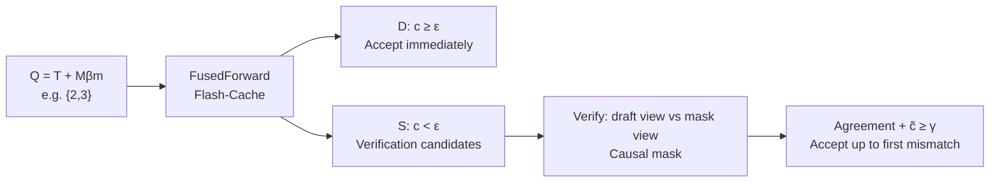

[Paper](https://arxiv.org/abs/2609.26796)
## Flash-dLLM: I/O-First Diffusion LLM Acceleration, Unlocking 210.6 tokens/s with Fused Cache and Self-Verification

## One-Line Summary (TL;DR)

Diffusion LLMs (dLLMs) support parallel denoising, but combining KV cache reuse with parallel decoding makes GPU memory I/O the bottleneck (source: §1). Flash-dLLM combines Flash-Cache, which fuses QKV projection, RoPE, and cache writes in SRAM with no training, and Flash-Verify, in which the dLLM itself serves as both drafter and verifier, achieving 210.6 tokens/s on GSM8K-512 with LLaDA-1.5, an 81.0× speedup, and 5.1× and 11.0× speedups over Elastic-Cache (source: Tab. 1, Tab. 2, Abstract).

## Core Ideas

- **I/O is the real bottleneck:** caching reduces FLOPs but repeats HBM reads/writes four times (source: §2.2, Fig. 1a). The fix is to reduce movement, not computation.
- **No need to see everything:** in middle layers, the top 32 tokens account for about 50% of total attention (source: Fig. 1b). Track only a fixed budget $\beta_t$ and serve the rest from cache.
- **Confidence is throughput:** mean confidence and the number of early-decodable tokens show a positive correlation of $r=0.48$ (source: Fig. 1c). Self-verifying discarded low-confidence predictions with two views doubles tokens per step (source: Fig. 6).

## Background: The Problem They Solved

### Research Gap

dLLMs do not generate left-to-right but refine a masked sequence over multiple passes (source: §1). This paradigm has been extended to LLaDA, Dream, Gemini Diffusion, and Mercury, but open-source dLLM inference has lagged behind autoregressive LLM optimizations for KV caching, attention kernels, and speculative decoding (source: §1, §4).

At publication time, the state of the art had three branches (source: §2.1, §4):

- **Fast-dLLM:** prefix caching and confidence-based parallel decoding. It unmasks in one shot only tokens whose confidence $c_i$ exceeds a threshold $\epsilon$.
- **Elastic-Cache:** adaptive cache reuse based on attention pattern drift. It is the baseline inheriting sliding-window decoding (source: §2.1).
- **dKV-Cache, dllm-Cache, Dyna-dLLM, FreeDave, FlashDLM:** fixed-interval caching, adaptive caching, external autoregressive verifiers, two-pass verification, and others.

The critical limitation is that they treated caching and parallel decoding separately (source: Abstract). In practice, the changing query set $Q_t$ at every step causes frequent cache reads/writes/updates, while uniformly processing tokens that are unchanged or have little influence wastes memory bandwidth (source: §1). Second, they ignored token-level sparsity. Third, they left the mismatch in confidence dynamics unresolved. Many tokens are already semantically determined, but a conservative $\epsilon$ delays commitment and wastes refinement steps (source: §1).

### Core Hypothesis

The authors **assume that existing caching limits can be overcome and denoising steps can be reduced without quality loss, achieving wall-clock speedup and memory scalability, by removing unnecessary HBM movement with a fused I/O-aware cache, selectively reusing only high-impact decoding tokens, and introducing two-view verification that uses the dLLM itself as drafter and verifier** (source: §1-§2.3).

## New Approach: Flash-dLLM

Flash-dLLM is a training-free inference framework (source: Abstract). It consists of two modules (source: Fig. 2, Alg. 2).

### Flash-Cache: I/O-Aware KV Caching

**1. Fused kernel.** Existing implementations run QKV projection, RoPE, cache writes, and attention in separate CUDA kernels per layer (source: §2.2). Because each kernel writes to HBM and the next kernel reads it, per-layer traffic is about $4 \times O(Q d_{\text{model}}) + O(N d)$. Flash-Cache takes inspiration from FlashAttention to perform projection and RoPE in SRAM and write keys and values directly to the KV cache (source: Fig. 3a, Alg. 1). It removes intermediate KV materialization and reduces HBM traffic and memory usage.

**2. Scheduled flash attention.** In dLLM batches, the lengths of the caching stage and the full-update stage differ widely across samples (source: §2.2). Instead of padding or forced synchronization, the batch is split into multiple sequence blocks, and a block table aligns query blocks with KV blocks (source: Fig. 3b). It differs from prior FlashAttention in its focus on controlling which blocks to compute and in what order.

**3. Selective cache update.** The next query is kept at a fixed size (source: §2.2):

$$
Q_{t+1} = M_{t+1}^{\beta_m} \cup T_{t+1}
$$

where $M_{t+1}^{\beta_m}$ is a masked sliding window of size $\beta_m$ and $T_{t+1}$ is a tracked set of size $\beta_t$. The importance of a decoded token $i$ is measured by how much masked queries attended to it:

$$
a_i^t = \sum_{l=1}^{L} \frac{1}{H} \sum_{h=1}^{H} \frac{1}{|M_t^{\beta_m}|} \sum_{j \in M_t^{\beta_m}} S_{j,i}^{t,l,h}, \quad i \in D_{<t}
$$

$S^{t,l}$ are unnormalized attention logits (source: §2.2). $T_{t+1}$ is the union of the top-$k$ tokens and the newly decoded $D_t$, while the rest do not join the query and are served from cache only, bounding per-step computation to $\beta_t + \beta_m$.

### Flash-Verify: Cache-Based Draft-Verification Parallel Decoding

Conventional confidence-based decoding accepts only tokens with $c_i \ge \epsilon$ and discards the rest (source: §2.3). On uncertain tasks, per-step acceptance hits a ceiling.

Flash-Verify queries the full KV cache for $Q_t = T_t \cup M_t^{\beta_m}$ in the draft pass and sorts masked positions by confidence into a confident set $D_t$ and an exploratory set $S_t$ (source: Alg. 2). The verification pass builds new queries from three groups: an adjusted tracked set $T_v$, a draft view that fills $S_t$ with draft predictions, and a mask view that fills the same positions with `[MASK]`. The two views share position embeddings but cannot see each other through a causal mask (source: §2.3, Fig. 2).

The acceptance rule is simple:

$$
\text{accept}(i) = \mathbb{I}[\hat{x}_i = \tilde{x}_i] \cdot \mathbb{I}[\tilde{c}_i \ge \gamma]
$$

$\hat{x}_i$ is the draft prediction, and $\tilde{x}_i$ and $\tilde{c}_i$ are the mask-view prediction and confidence. It accepts sequentially in decoding order only up to the first mismatch (source: §2.3). The extra cost scales with $2\beta_m$, not the full sequence, and no external model is needed.

There is also a theoretical guarantee (source: Appx. C). Let $p_i$ be the mask-view verification conditional distribution and $\pi_i$ the committed point mass; for each accepted token:

$$
\text{TV}(\pi_i, p_i) = 1 - \tilde{c}_i \le 1 - \gamma
$$

For a block $A = \{i_1,\dots,i_m\}$, $\text{TV}(\pi_A, p_A) = 1 - \prod_k \tilde{c}_{i_k} \le 1 - \gamma^m \le m(1-\gamma)$. Because the verification mask is causal, $p_A$ is the model's true joint, not a product of marginals, and verification tokens introduce no parallel-unmasking dependency error (source: Appx. C, Remark 1). Lowering $\epsilon$ is not equivalent to verification, because $\epsilon$ splits the draft marginals in the all-masked state while $\gamma$ splits the distribution that is actually committed (source: Appx. C, Remark 2).

## How It Works: A Concrete Example

Consider a mini example for a graduate student. The vocabulary contains only `{A, B, [MASK]}`, with generation length $N=4$, $\beta_m=2$, $\beta_t=1$, $\epsilon=0.9$, and $\gamma=0.8$ (variable definitions borrowed from §2.2-§2.3).

Let the input be $x_0 =$ `[BOS] [MASK] [MASK] [MASK] [MASK]`, $D_{<1} = \{1\}$, and $M_1 = \{2,3,4,5\}$. Here $Q$ is the query positions, $K$ and $V$ are the cache, $D_t$ is newly decoded positions, $M_t^{\beta_m}$ is the front $\beta_m$ masks, $T_t$ is the tracked set, and $S_t$ is verification targets.

**Step 1: Draft.** Since $M_1^{\beta_m}=\{2,3\}$ and $T_1=\emptyset$, $Q_1=\{2,3\}$. The fused kernel reads only $x[Q_1]$ to build $q,k,v$ in SRAM and writes them directly to cache (source: Alg. 1). After attending over the full cache, suppose the model outputs $q_2=[0.92,0.05,0.03]$ and $q_3=[0.70,0.20,0.10]$. Confidences are $c_2=0.92$ and $c_3=0.70$. With $\epsilon=0.9$, $D_1=\{2: \hat{x}_2=A\}$ and $S_1=\{3: \hat{x}_3=A\}$.

**Step 1: Verification.** The verification query has the form `[track, D_1=A, S_1 draft=A, S_1 mask=[MASK]]`. Positions 3 in the draft view and mask view are masked so they cannot see each other. If the mask view outputs $p_3=[0.85,0.10,0.05]$, then $\tilde{x}_3=A$ and $\tilde{c}_3=0.85$. Since $\hat{x}_3=\tilde{x}_3$ and $0.85 \ge \gamma$, position 3 is also accepted. Under the prior approach, this token would have been discarded because of 0.70.

**Step 1: Cache selection.** Compute $a_i^1$ and pick the one previously decoded token most attended by the masked queries $\{2,3\}$. The newly resolved $\{2,3\}$ are automatically included before ranking, so $T_2$ stays at size 1. The next query is $Q_2 = M_2^{\beta_m} \cup T_2$.

This figure shows why this example works. As in the left panel, middle layers concentrate on a few tokens, and as in the right panel, higher confidence increases per-step acceptance (source: Fig. 1b-c).

The second figure corresponds to the actual verification pipeline from draft sorting through the $\epsilon$ and $\gamma$ threshold decisions (source: Fig. 2).

### Tearing Down 1 Secret Weapon

If forced to choose between the fused kernel and self-verification, choose self-verification. The kernel trims constants, while verification changes the slope (source: §3.3).

| Configuration | Accuracy | Throughput | Tokens/step | Interpretation |
|---|---|---:|---:|---|
| Flash-Cache + confidence-based, $B=16$ | 82.24% | 131.8 tokens/s | 2.8 tokens/step | Baseline (source: Tab. 6) |
| Flash-Cache + Flash-Verify, $B=16$ | 81.73% | 186.2 tokens/s | 5.7 tokens/step | +41.3% throughput, about 2.0× tokens/step (source: Tab. 6) |
| Flash-Cache + Flash-Verify, $B=32$ | 83.02% | 199.8 tokens/s | 5.7 tokens/step | +43.2% over confidence-based with batch scaling (source: Tab. 6) |
| Fused kernel alone, RTX 3090 | - | 1.37× per layer | - | Removes the RoPE- and cache-write-dominated region (source: Fig. 1a) |

The mechanism is clear. Confidence-based decoding discards a token from the marginal $q_i$ even when it is correct if it does not pass $\epsilon$ (source: Appx. C). Flash-Verify asks again under $p_{i_k}$ conditioned on earlier drafts. As contextual evidence accumulates, $\tilde{c}$ rises and the $r=0.48$ correlation turns into throughput (source: Fig. 1c, Fig. 6). At $\gamma=0.60$, it decodes 7.2 tokens/step with throughput similar to confidence-based decoding at 5.6 tokens/step but 3.5pp higher accuracy. As tokens/iteration grow, the accuracy gap narrows while the throughput advantage widens up to 1.33× (source: §3.3, Fig. 6).

## Performance Validation: Key Results

### Experimental Setup

The default is a single NVIDIA A100 80GB GPU, Triton 2.0 fused kernels, and LLaDA-1.5 evaluation (source: §3.1). Benchmarks are GSM8K 5-shot, MATH 4-shot, HumanEval 0-shot, and MBPP 3-shot, with generation lengths of 256 tokens and 512 tokens (source: §3.1, Appx. D). Default hyperparameters are $\epsilon=0.9$, $\gamma=0.8$, block size $\beta=16$, $\beta_t=80$, and $\beta_m=64$ (source: §3.1). Throughput is mean tokens/s up to the stop token under `lm-eval-harness` (source: Appx. D). Tokenization and the pretraining corpus follow the LLaDA-1.5 base model with no additional training or fine-tuning. The fine-tuning strategy is not applicable (source: §3.1, Abstract).

The figure above summarizes the batch-scaling experiment. Throughput rises nearly linearly up to batch size 32, Fast-dLLM OOMs at 24, and memory is lowest across the full range (source: Fig. 4).

### Key Performance Metrics

- **GSM8K-512:** Flash-Cache + Flash-Verify ranks first in both accuracy and throughput at 83.02% accuracy and 210.6 tokens/s. That is 81.0× over greedy no-cache at 2.6 tokens/s (source: Tab. 1).
- **MATH-512:** 35.98%, 210.1 tokens/s, 42.0×. The highest accuracy is 37.76% from no-cache Flash-Verify (source: Tab. 1).
- **HumanEval-512:** 40.24%, 185.6 tokens/s, 58.0×. The highest accuracy is 42.07% from confidence-based Flash-Cache (source: Tab. 1).
- **MBPP-512:** 39.00%, 148.2 tokens/s, 148.2×. Greedy Flash-Cache leads in accuracy at 39.80% (source: Tab. 1).
- **Scaling comparison:** against dKV-Cache at 14.9 tokens/s, Fast-dLLM at 36.8 tokens/s, FreeDave at 42.8 tokens/s, and Elastic-Cache at 41.7 tokens/s, Flash-Cache + Flash-Verify reaches 210.6 tokens/s (source: Tab. 2).
- **Memory:** at batch size 16, about 26 GB versus about 50 GB for Fast-dLLM, about a 48% reduction. Flat preallocated cache removes padding overhead (source: §3.3, Fig. 4b).
- **Masked window $\beta_m$:** growing it from 16 to 96 lowers throughput, but Flash-Verify keeps a 1.4× to 1.5× lead over confidence-based decoding, with an accuracy gap of 0.2pp to 1.2pp (source: §3.3, Fig. 7).
- **Generation length and prefill:** both methods peak at 256 tokens and fall by about 10.5% to 12.8% at 1024 tokens. From 1-shot to 8-shot, the Flash-Verify advantage shrinks from 1.50× to 1.35×, but the absolute lead grows from 42.6 tokens/s to 78.6 tokens/s (source: Appx. F, Tab. 5).

### Critical Comparison

The strongest comparison is the same-hardware rerun against Elastic-Cache and FreeDave (source: §3.1, Tab. 2). Elastic-Cache had the best baseline accuracy at 82.79% and FreeDave the best throughput at 42.8 tokens/s, but Flash-Cache + confidence-based decoding beats both at 82.87% and 149.4 tokens/s, and adding Flash-Verify pushes further to 83.02% and 210.6 tokens/s.

Conversely, in the 256-token code setting, the throughput leader is not the accuracy leader. On HumanEval-256, 39.63% versus a best of 43.29% leaves a 3.66pp gap, and on MBPP-256, 38.20% versus a best of 41.80% leaves a 3.60pp gap (source: §3.2). On math reasoning the gap is within 1.78pp, but on short code generation there is a region where aggressive parallel commits do not replace strict single-token refinement. Confidence-based decoding peaks slightly higher at about 83.4% accuracy but drops to about 131 tokens/s throughput (source: §3.3, Fig. 5b). In other words, the Pareto frontier lies farther out on the Flash-Verify side, but conservative decoding remains for a single extreme-accuracy point.

### System-Level Metrics

The primary metrics are throughput in tokens/s and peak memory in GB, not latency (source: §3.3). From batch size 1 to 32, the greedy method goes from 18.5 tokens/s to 55.0 tokens/s for 2.97×, confidence-based decoding from 51.7 tokens/s to 139.5 tokens/s for 2.70×, and Flash-Verify from 56.0 tokens/s to 199.8 tokens/s for 3.57× (source: Appx. G, Tab. 6). Training FLOPs and `$/1M tokens` costs are not reported, nor are energy metrics. The reproduction checklist includes code release, Triton 2.0 specification, A100 80GB specification, and standard deviations over 5 seeds, but driver versions and exact full prompts rely on the appendix evaluation scripts (source: §3.1, Appx. D-E).

## Our Take: Strengths, Limitations, and Why This Matters

**Strengths.** The authors' claims are consistent. Cache reuse and parallel verification are not optimized separately but tied together on the same fused kernel and preallocated cache (source: §2.3). Having no external verifier matters for deployment. Unlike FlashDLM, which uses an external autoregressive verifier, and FreeDave, which uses two independent passes, there is no extra model or training (source: §4). It is also rare for a theory appendix to close a simple intuition with TV-distance guarantees (source: Appx. C).

**Explicit limitations.** The authors acknowledge evaluation focused on two masked diffusion LLMs and math/code structured outputs (source: Appx. A). Continuous-space diffusion, flat confidence distributions such as long-form writing or dialogue, and fixed $\gamma$ and $\beta_m$ remain unverified.

**Potential limitations.** First, a strong assumption. The guarantee bounds deviation from the model's own sequential distribution, not accuracy against the data distribution (source: Appx. C, Assumption 1). Second, the parallel error of $D_t$ still relies on the confidence-based theorem $[46, Thm. 1]$. Third, cost transparency is weak. Training compute is not applicable, but inference cost and power are missing. Fourth, societal impact inherits harmful/biased generation from the base dLLMs unchanged and does not alter safety filters (source: Appx. B).

The reason it still matters is that it reframes the dLLM deployment bottleneck from FLOPs to I/O and scheduling. Holding throughput without OOM up to batch size 32 while cutting memory nearly in half can be used directly in serving-system design (source: Fig. 4, Tab. 6).

## What's Next?: Future Directions

The authors propose adaptive $\gamma$ and $\beta_m$, open-ended generation verification, and continuous-space diffusion as extensions (source: Appx. A). Three reasonable next steps are:

- **Runtime confidence-statistics scheduler:** instead of fixed thresholds, attach a controller that shrinks $\beta_m$ and raises $\gamma$ when prefixes are long or uncertainty is high. This can mitigate the relative slowdown from 1-shot to 8-shot in the appendix (source: Appx. F).
- **Long-context and batched-serving integration:** connect the block-table design to a PagedAttention-style serving stack and test pushing the saturation point beyond batch size 16. Batch size 16 already delivers about 93.2% of batch size 32, so the efficiency point is clear (source: Appx. G).
- **Separate accuracy-sensitive code tasks:** to close the roughly 3pp gap on 256-token code, test hybrid commits that conservatively revert only positions with high verification failure rates (source: §3.2).

<!-- verbatim-tables -->

## Tables from the paper

> Tables converted mechanically from the arXiv e-print LaTeX source. The numbers are the paper's own and did not pass through a model.

**Table 1. Accuracy and decoding efficiency of LLaDA-1.5 across different benchmarks and decoding configurations. Each cell reports accuracy (top) and throughput with speedup over greedy decoding without caching (bottom; blueblue: tokens/s, orangeorange: speedup). **Bold** indicates the highest accuracy in each row, while yellow!20yellow shading indicates the highest throughput.**

| Benchmark | Len | Greedy No Cache | Greedy Flash-Cache | Confidence-Aware No Cache | Confidence-Aware Fast-dLLM | Confidence-Aware Elastic-Cache | Confidence-Aware Flash-Cache | Flash-Verify No Cache | Flash-Verify Flash-Cache |
|---|---|---|---|---|---|---|---|---|---|
| GSM8K (5-shot) | 256 | 80.36 { blue6.7 (orange1.0$\times$)} | 82.87 { blue56.8 (orange8.5$\times$)} | 80.44 { blue22.5 (orange3.4$\times$)} | 80.59 { blue51.2 (orange7.6$\times$)} | 81.88 { blue45.9 (orange6.9$\times$)} | 82.34 { blue144.9 (orange21.6$\times$)} | **83.62** { blue38.2 (orange5.7$\times$)} | 81.88 { blue194.9 (orange29.1$\times$)} |
|  | 512 | 81.35 { blue2.6 (orange1.0$\times$)} | 82.94 { blue54.8 (orange21.1$\times$)} | 81.88 { blue17.2 (orange6.6$\times$)} | 80.82 { blue36.8 (orange14.2$\times$)} | 82.79 { blue41.7 (orange16.0$\times$)} | 82.87 { blue149.4 (orange57.5$\times$)} | 82.71 { blue32.2 (orange12.4$\times$)} | **83.02** { blue210.6 (orange81.0$\times$)} |
| MATH (4-shot) | 256 | 33.52 { blue8.5 (orange1.0$\times$)} | **37.22** { blue67.6 (orange8.0$\times$)} | 33.60 { blue22.3 (orange2.6$\times$)} | 32.74 { blue44.4 (orange5.2$\times$)} | 33.26 { blue40.6 (orange4.8$\times$)} | 36.80 { blue144.3 (orange17.0$\times$)} | 36.98 { blue38.1 (orange4.5$\times$)} | 36.56 { blue189.7 (orange22.3$\times$)} |
|  | 512 | 35.63 { blue5.0 (orange1.0$\times$)} | 37.40 { blue66.2 (orange13.2$\times$)} | 35.56 { blue20.3 (orange4.1$\times$)} | 33.68 { blue44.4 (orange8.9$\times$)} | 35.84 { blue41.4 (orange8.3$\times$)} | 37.08 { blue149.9 (orange30.0$\times$)} | **37.76** { blue32.8 (orange6.6$\times$)} | 35.98 { blue210.1 (orange42.0$\times$)} |
| HumanEval (0-shot) | 256 | **43.29** { blue7.0 (orange1.0$\times$)} | 42.68 { blue79.0 (orange11.3$\times$)} | 42.68 { blue17.5 (orange2.5$\times$)} | 34.75 { blue18.7 (orange2.7$\times$)} | 36.59 { blue20.9 (orange3.0$\times$)} | 40.85 { blue169.4 (orange24.2$\times$)} | 37.20 { blue63.2 (orange9.0$\times$)} | 39.63 { blue209.2 (orange29.9$\times$)} |
|  | 512 | 40.85 { blue3.2 (orange1.0$\times$)} | 41.46 { blue74.5 (orange23.3$\times$)} | 39.63 { blue9.7 (orange3.0$\times$)} | 36.59 { blue15.4 (orange4.8$\times$)} | 37.80 { blue16.8 (orange5.2$\times$)} | **42.07** { blue145.7 (orange45.5$\times$)} | 37.20 { blue57.5 (orange18.0$\times$)} | 40.24 { blue185.6 (orange58.0$\times$)} |
| MBPP (3-shot) | 256 | 38.00 { blue2.4 (orange1.0$\times$)} | 41.20 { blue62.0 (orange25.8$\times$)} | 38.00 { blue14.2 (orange5.9$\times$)} | 34.60 { blue28.0 (orange11.7$\times$)} | 41.20 { blue32.7 (orange13.6$\times$)} | **41.80** { blue115.9 (orange48.3$\times$)} | 41.40 { blue37.7 (orange15.7$\times$)} | 38.20 { blue148.0 (orange61.7$\times$)} |
|  | 512 | 38.20 { blue1.0 (orange1.0$\times$)} | 39.80 { blue58.5 (orange58.5$\times$)} | 38.60 { blue11.5 (orange11.5$\times$)} | 36.20 { blue17.8 (orange17.8$\times$)} | 39.00 { blue32.8 (orange32.8$\times$)} | **40.20** { blue102.2 (orange102.2$\times$)} | 39.40 { blue31.6 (orange31.6$\times$)} | 39.00 { blue148.2 (orange148.2$\times$)} |

**Table 2. Comparison of accuracy and decoding throughput across different methods.**

| **Metric** | **dKV-Cache** | **FlashDLM** | **dLLM-Cache** | **Dyna-dLLM** | **Fast-dLLM** | **FreeDave** | **Elastic-Cache** | **Flash-Cache** **(conf-aware)** | **Flash-Cache** **+ Flash-Verify** |
|---|---|---|---|---|---|---|---|---|---|
| **Acc. (%)** | 81.50 | 79.91 | 80.97 | 79.32 | 80.82 | 80.97 | 82.79 | 82.87 | **83.02** |
| **TPS** | blue14.9 (orange5.7$\times$) | blue15.7 (orange6.0$\times$) | blue16.8 (orange6.5$\times$) | blue38.4 (orange14.8$\times$) | blue36.8 (orange14.2$\times$) | blue42.8 (orange16.5$\times$) | blue41.7 (orange16.0$\times$) | blue149.4 (orange57.5$\times$) | blue210.6 (orange81.0$\times$) |

**Table 3. The hyper-parameters of Flash-dLLM under various settings.**

| **Model** | **Benchmark** | **Gen Length** | Tracking budget $\beta_t$ | Window size $\beta_m$ | Flash-Verify $\gamma$ | Batch size |
|---|---|---|---|---|---|---|
| **LLaDA-1.5** | GSM8K (5-shot) | 256 | 64 | 64 | 0.8 | 32 |
|  |  | 512 | 64 | 64 | 0.8 | 32 |
|  | MATH (4-shot) | 256 | 64 | 64 | 0.85 | 32 |
|  |  | 512 | 64 | 64 | 0.85 | 32 |
|  | Humaneval (0-shot) | 256 | 64 | 64 | 0.85 | 32 |
|  |  | 512 | 64 | 64 | 0.85 | 32 |
|  | MBPP (3-shot) | 256 | 48 | 64 | 0.8 | 32 |
|  |  | 512 | 48 | 64 | 0.8 | 32 |

**Table 4. Mean accuracy (%) and throughput over five random seeds. Accuracy is shown on the first line and throughput is shown in blue on the second line. Values are mean $\pm$ standard deviation.**

| $\gamma$ | Track budget $\beta_t$ $48$ | Track budget $\beta_t$ $64$ | Track budget $\beta_t$ $80$ | Track budget $\beta_t$ $96$ |
|---|---|---|---|---|
| $0.60$ | 80.230.46277.801.18 | 80.760.21261.541.00 | 81.520.50248.800.70 | 81.420.41235.820.76 |
| $0.70$ | 80.740.66252.202.52 | 81.270.65234.864.94 | 82.000.36226.663.28 | 82.350.13214.782.18 |
| $0.75$ | 80.940.81235.601.36 | 82.140.47221.680.71 | 82.520.45209.761.29 | 82.560.91208.080.51 |
| $0.80$ | 81.640.54221.063.58 | 81.730.74208.402.64 | 82.150.47197.081.54 | 82.470.47196.980.84 |
| $0.85$ | 81.461.03211.320.69 | 82.710.51197.600.70 | 82.760.84187.280.75 | 83.150.17185.700.61 |
| $0.90$ | 81.550.49206.220.50 | 82.090.53192.900.75 | 82.640.41182.160.68 | 82.750.62171.860.33 |
| $1.00$ | 81.790.64165.140.83 | 82.240.43149.600.47 | 82.960.51138.280.37 | 83.410.50131.581.41 |

**Table 5. Ablation of generation and prefill lengths.**

| Approach | Metric | Len. 128 | Len. 256 | Len. 512 | Len. 1024 |
|---|---|---|---|---|---|
| Flash-Cache + Confidence | Accuracy | 79.03 | 82.36 | 82.24 | 82.29 |
|  | Throughput | blue126.7 (orange1.00$\times$) | blue140.4 (orange1.00$\times$) | blue131.8 (orange1.00$\times$) | blue125.7 (orange1.00$\times$) |
|  | Tokens/step | red2.5 | red2.8 | red2.8 | red2.9 |
| Flash-Cache + Flash-Verify | Accuracy | 79.55 | 81.90 | 81.73 | 81.72 |
|  | Throughput | blue174.5 (orange1.38$\times$) | blue198.4 (orange1.41$\times$) | blue186.2 (orange1.41$\times$) | blue173.0 (orange1.38$\times$) |
|  | Tokens/step | red5.6 | red5.6 | red5.6 | red5.6 |

**Table 6. Effect of batch size on throughput. Using LLaDA-1.5 for GSM8K-512 (5-shot). Speedup is measured relative to Flash-Cache with greedy decoding at the same batch size.**

| **Approach** | **ACC** | **Tok./step** | **Throughput** **B=1** | **Throughput** **B=2** | **Throughput** **B=4** | **Throughput** **B=8** | **Throughput** **B=16** | **Throughput** **B=24** | **Throughput** **B=32** |
|---|---|---|---|---|---|---|---|---|---|
| Flash-Cache + Greedy | 82.94 | red1.0 | { blue18.5 (orange1.0$\times$)} | { blue28.9 (orange1.0$\times$)} | { blue37.7 (orange1.0$\times$)} | { blue46.3 (orange1.0$\times$)} | { blue51.3 (orange1.0$\times$)} | { blue53.6 (orange1.0$\times$)} | { blue55.0 (orange1.0$\times$)} |
| Flash-Cache + Confidence | 82.87 | red2.8 | { blue51.7 (orange2.8$\times$)} | { blue78.0 (orange2.7$\times$)} | { blue102.4 (orange2.7$\times$)} | { blue120.5 (orange2.6$\times$)} | { blue131.8 (orange2.6$\times$)} | { blue136.4 (orange2.5$\times$)} | { blue139.5 (orange2.5$\times$)} |
| Flash-Cache + Flash-Verify | **83.02** | red5.7 | { blue56.0 (orange3.0$\times$)} | { blue90.9 (orange3.1$\times$)} | { blue131.3 (orange3.5$\times$)} | { blue164.8 (orange3.6$\times$)} | { blue186.2 (orange3.6$\times$)} | { blue195.5 (orange3.6$\times$)} | { blue199.8 (orange3.6$\times$)} |

**Table 7. Example LLaDA-1.5 (without cache) — A qualitative comparison of different decoding methods.**

| white**Greedy** | white**Confident-aware** | white**Flash-Verify** |
|---|---|---|
| First find the number of multiple-choice questions Amy answers correctly: 80% * 10 questions = <<10*.80=8>>8 questions Then find the number of true/false questions Amy answers correctly: 90% * 20 questions = <<20*.90=18>>18 questions Then find the number of long-answer questions Amy answers correctly: 60% * 5 questions = <<50*.60=3>>3 questions Then find the total points Amy gets from multiple-choice questions: 8 questions * 1 point/question = <<8*1=8>>8 points Then find the total points Amy gets from true/false questions: 18 questions * 1 point/question = <<18*1=18>>18 points Then find the total points Amy gets from long-answer questions: 3 questions * 5 points/question = <<3*5=15>>15 points Then add up the points from each type of question to find her total score: 8 points + 18 points + 15 points = <<8+18+15=41>>41 points $\boxed{41}$ red**Steps: 283, Tokens: 283, Time:64.7s** | First find the number of multiple-choice questions Amy answers correctly: 80% * 10 questions = <<80*.10=8>>8 questions Then find the number of true/false questions Amy answers correctly: 90% * 20 questions = <<90*.20=18>>18 questions Then find the number of long-answer questions Amy answers correctly: 60% * 5 questions = <<60*.05=3>>3 questions Then find the total points Amy gets from multiple-choice questions: 8 questions * 1 point/question = <<8*1=8>>8 points Then find the total points Amy gets from true/false questions: 18 questions * 1 point/question = <<18*1=18>>18 points Then find the total points Amy gets from long-answer questions: 3 questions * 5 points/question = <<3*5=15>>15 points Then add up the points from each type of question to find her total score: 8 points + 18 points + 15 points = <<8+18+15=41>>41 points $\boxed{41}$ red**Steps: 66, Tokens: 277, Time: 17.2s** | First find the number of multiple-choice questions Amy answers correctly: 10 questions * 80% = <<10*0.8=8>>8 questions Then find the number of true/false questions Amy answers correctly: 20 questions * 90% = <<20*0.9=18>>18 questions Then find the number of long-answer questions Amy answers correctly: 5 questions * 60% = <<5*0.6=3>>3 questions Then find the total points from the multiple-choice questions: 8 questions * 1 point/question = <<8*1=8>>8 points Then find the total points from the true/false questions: 18 questions * 1 point/question = <<18*1=18>>18 points Then find the total points from the long-answer questions: 3 questions * 5 points/question = <<3*5=15>>15 points Then add up the points from each type of question to find the total score: 8 points + 18 points + 15 points = <<8+18+15=41>>41 points $\boxed{41}$ red**Steps: 30, Tokens: 276, Time: 13.1s** |

**Table 8. Example Flash-dLLM: A qualitative comparison of different decoding methods, LLaDA-1.5**

| white**Greedy** | white**Confident-aware** | white**Flash-Verify** |
|---|---|---|
| Rong saves 20 coins per month, so in one year, he saves 20 * 12 = <<20*12=240>>240 coins. Neil saves 2/5 times more coins than Rong, so he saves 20 + (2/5) * 20 = 20 + 8 = 28 coins per month. In one year, Neil saves 28 * 12 = <<28*12=336>>336 coins. In ten years, Neil saves 336 * 10 = <<336*10=3360>>3360 coins. Together, Rong and Neil have 2400 + 3360 = <<2400+3360=5760>>5760 coins. $\boxed{5760}$ red**Steps: 224, Tokens: 224, Time:15.2s** | Rong saves 20 coins per month, so in one year, he saves 20 * 12 = <<20*12=240>>240 coins. Neil saves 2/5 times more coins than Rong, so he saves 20 + (2/5) * 20 = 20 + 8 = 28 coins per month. In one year, Neil saves 28 * 12 = <<28*12=336>>336 coins. In ten years, Neil saves 336 * 10 = <<336*10=3360>>3360 coins. Together, Rong and Neil have saved 240 + 3360 = <<240+3360=3600>>3600 coins. $\boxed{3600}$ red**Steps: 73, Tokens: 222, Time: 7.8s** | Rong saves 20 coins per month, so in one year, he saves 20 * 12 = <<20*12=240>>240 coins. Neil saves 2/5 times more coins than Rong, so he saves 20 + (2/5 * 20) = 20 + 8 = 28 coins per month. In one year, Neil saves 28 * 12 = <<28*12=336>>336 coins. In ten years, Neil saves 336 * 10 = <<336*10=3360>>3360 coins. Together, Rong and Neil have saved 240 + 3360 = <<240+3360=3600>>3600 coins. $\boxed{3600}$ red**Steps: 34, Tokens: 219, Time: 5.7s** |

> Figures in this post are taken from the original arXiv:2609.26796 (CC BY 4.0). Only size and format were changed.
