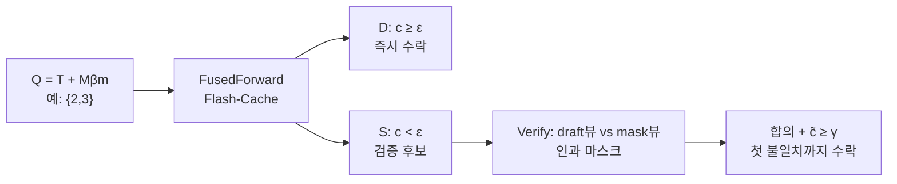

[논문 링크](https://arxiv.org/abs/2609.26796)
## Flash-dLLM: I/O를 먼저 본 Diffusion LLM 가속, 퓨즈드 캐시와 셀프 검증으로 210.6 tokens/s 를 열다

## 한 줄 요약 (TL;DR)

Diffusion LLM(dLLM)은 병렬 디노이징이 가능하지만 KV 캐시 재사용과 병렬 디코딩을 함께 쓰면 GPU 메모리 I/O가 병목이 된다 (근거: §1). Flash-dLLM은 학습 없이 QKV projection과 RoPE, 캐시 쓰기를 SRAM에서 융합한 Flash-Cache와 dLLM 스스로 초안과 검증을 맡는 Flash-Verify를 결합해 LLaDA-1.5에서 GSM8K-512 기준 210.6 tokens/s , 81.0× 속도 향상, Elastic-Cache 대비 5.1× 와 11.0× 속도 향상을 달성했다 (근거: Tab. 1, Tab. 2, Abstract).

## 핵심 아이디어

- **I/O가 진짜 병목이다:** 캐시는 FLOPs는 줄이지만 HBM 읽기/쓰기를 네 번 반복한다 (근거: §2.2, Fig. 1a). 해법은 연산이 아니라 이동을 줄이는 것이다.
- **다 볼 필요는 없다:** 중간층에서 상위 32개 토큰이 전체 어텐션의 약 50% 를 차지한다 (근거: Fig. 1b). 고정 예산 $\beta_t$ 만큼만 추적하고 나머지는 캐시로 서빙한다.
- **자신감이 곧 처리량이다:** 평균 신뢰도와 조기 디코딩 가능 토큰 수는 $r=0.48$ 양의 상관관계를 보인다 (근거: Fig. 1c). 버려지던 저신뢰 예측을 두 개의 뷰로 자체 검증하면 스텝당 토큰이 약 2배가 된다 (근거: Fig. 6).

## 배경: 그들이 해결한 문제

### 연구의 공백

dLLM은 왼쪽에서 오른쪽으로 생성하지 않고 마스크된 시퀀스를 여러 번 정제한다 (근거: §1). 이 패러다임은 LLaDA, Dream, Gemini Diffusion, Mercury로 확장됐지만 오픈소스 dLLM 추론은 자가회귀 LLM의 KV 캐싱, 어텐션 커널, 추측 디코딩 최적화를 따라가지 못했다 (근거: §1, §4).

출판 시점의 최신 기술은 세 갈래였다 (근거: §2.1, §4):

- **Fast-dLLM:** 프리픽스 캐싱과 신뢰도 기반 병렬 디코딩. 신뢰도 $c_i$ 가 임계값 $\epsilon$ 을 넘은 토큰만 한 번에 언마스킹한다.
- **Elastic-Cache:** 어텐션 패턴 드리프트 기반 적응형 캐시 재사용. 슬라이딩 윈도 디코딩을 계승한 기준점이다 (근거: §2.1).
- **dKV-Cache, dllm-Cache, Dyna-dLLM, FreeDave, FlashDLM:** 고정 주기 캐싱, 적응형 캐싱, 외부 자가회귀 검증기, 2회 패스 검증 등.

결정적 한계는 이들이 캐싱과 병렬 디코딩을 따로 봤다는 점이다 (근거: Abstract). 실제로는 매 스텝 변하는 쿼리 집합 $Q_t$ 때문에 캐시 읽기/쓰기/업데이트가 빈번하고, 변하지 않거나 영향이 작은 토큰까지 균일하게 처리하면서 메모리 대역폭을 낭비한다 (근거: §1). 두 번째로 토큰 수준 희소성을 무시했다. 세 번째로 신뢰도 역학의 불일치를 풀지 못했다. 많은 토큰은 이미 의미적으로 정해졌지만 보수적인 $\epsilon$ 때문에 커밋이 늦어지고 정제 스텝이 낭비된다 (근거: §1).

### 핵심 가설

저자들은 **퓨즈드 I/O 인지 캐시로 불필요한 HBM 이동을 제거하고 영향력 큰 디코딩 토큰만 선택적으로 재사용하며 dLLM 자체를 초안자와 검증자로 쓰는 투뷰 검증을 도입함으로써 기존 캐싱 한계를 극복하고 denoising 스텝을 줄여 품질 저하 없이 월클럭 가속과 메모리 확장성을 달성할 수 있다고 가정한다** (근거: §1-§2.3).

## 새로운 접근법: Flash-dLLM

Flash-dLLM은 훈련이 필요 없는 추론 프레임워크다 (근거: Abstract). 두 모듈로 구성된다 (근거: Fig. 2, Alg. 2).

### Flash-Cache: I/O 인지 KV 캐싱

**1. 퓨즈드 커널.** 기존 구현은 레이어마다 QKV projection, RoPE, 캐시 쓰기, 어텐션을 각각 다른 CUDA 커널로 실행한다 (근거: §2.2). 각 커널이 HBM에 쓰고 다음 커널이 읽으므로 레이어당 트래픽은 약 $4 \times O(Q d_{\text{model}}) + O(N d)$ 가 된다. Flash-Cache는 FlashAttention에서 착안해 projection과 RoPE를 SRAM에서 수행하고 키와 값을 KV 캐시에 직접 쓴다 (근거: Fig. 3a, Alg. 1). 중간 KV 물질화를 없애 HBM 트래픽과 메모리 사용량을 줄인다.

**2. 스케줄드 플래시 어텐션.** dLLM 배치에서는 캐싱 스테이지와 전체 업데이트 스테이지의 길이가 샘플마다 크게 갈린다 (근거: §2.2). 패딩이나 강제 동기화 대신 배치를 여러 시퀀스 블록으로 나누고 블록 테이블로 쿼리 블록과 KV 블록을 정렬한다 (근거: Fig. 3b). 계산할 블록과 순서를 제어하는 데 초점이 있다는 점이 기존 FlashAttention과 다르다.

**3. 선택적 캐시 업데이트.** 다음 쿼리는 고정 크기로 유지된다 (근거: §2.2):

$$
Q_{t+1} = M_{t+1}^{\beta_m} \cup T_{t+1}
$$

여기서 $M_{t+1}^{\beta_m}$ 는 크기 $\beta_m$ 인 마스크드 슬라이딩 윈도, $T_{t+1}$ 은 크기 $\beta_t$ 인 추적 집합이다. 디코딩된 토큰 $i$ 의 중요도는 마스크드 쿼리가 얼마나 주목했는지로 잰다:

$$
a_i^t = \sum_{l=1}^{L} \frac{1}{H} \sum_{h=1}^{H} \frac{1}{|M_t^{\beta_m}|} \sum_{j \in M_t^{\beta_m}} S_{j,i}^{t,l,h}, \quad i \in D_{<t}
$$

$S^{t,l}$ 은 비정규화 어텐션 로짓이다 (근거: §2.2). $T_{t+1}$ 은 상위 $k$ 개와 새로 디코딩된 $D_t$ 의 합집합이며 나머지는 쿼리에 참여하지 않고 캐시로만 서빙돼 스텝당 계산량이 $\beta_t + \beta_m$ 으로 묶인다.

### Flash-Verify: 캐시 기반 초안-검증 병렬 디코딩

기존 신뢰도 기반 디코딩은 $c_i \ge \epsilon$ 인 토큰만 수락하고 나머지는 버린다 (근거: §2.3). 불확실한 과제에서는 스텝당 수락량이 천장이 된다.

Flash-Verify는 드래프트 패스에서 $Q_t = T_t \cup M_t^{\beta_m}$ 에 대해 전체 KV 캐시를 조회하고 마스크드 위치를 신뢰도 순으로 정렬해 확신 집합 $D_t$ 와 탐색 집합 $S_t$ 로 나눈다 (근거: Alg. 2). 검증 패스는 세 그룹으로 새 쿼리를 만든다. 조정된 추적 집합 $T_v$ , $S_t$ 에 초안 예측을 채운 드래프트 뷰, 같은 위치에 `[MASK]` 를 채운 마스크 뷰이다. 두 뷰는 위치 임베딩을 공유하지만 인과적 마스크로 서로 볼 수 없다 (근거: §2.3, Fig. 2).

수락 규칙은 단순하다:

$$
\text{accept}(i) = \mathbb{I}[\hat{x}_i = \tilde{x}_i] \cdot \mathbb{I}[\tilde{c}_i \ge \gamma]
$$

$\hat{x}_i$ 는 드래프트 예측, $\tilde{x}_i$ 와 $\tilde{c}_i$ 는 마스크 뷰 예측과 신뢰도다. 디코딩 순서대로 첫 불일치까지만 순차 수락한다 (근거: §2.3). 추가 비용은 전체 시퀀스가 아니라 $2\beta_m$ 에 비례하며 외부 모델이 필요 없다.

이론적 보장도 있다 (근거: Appx. C). $p_i$ 를 마스크 뷰 검증 조건부 분포, $\pi_i$ 를 커밋된 점질량이라 하면 수락된 토큰마다 다음이 성립한다:

$$
\text{TV}(\pi_i, p_i) = 1 - \tilde{c}_i \le 1 - \gamma
$$

블록 $A = \{i_1,\dots,i_m\}$ 에 대해서는 $\text{TV}(\pi_A, p_A) = 1 - \prod_k \tilde{c}_{i_k} \le 1 - \gamma^m \le m(1-\gamma)$ 다. 검증 마스크가 인과적이므로 $p_A$ 는 주변 분포의 곱이 아니라 모델의 진짜 조인트이며 검증 토큰은 병렬 언마스킹 의존성 오차를 내지 않는다 (근거: Appx. C, Remark 1). $\epsilon$ 을 낮추는 것과 검증은 동등하지 않다. $\epsilon$ 은 모두 마스크된 상태의 초안 주변 분포를 가르고 $\gamma$ 는 실제로 커밋하는 분포를 가르기 때문이다 (근거: Appx. C, Remark 2).

## 작동 원리: 구체적인 예시로 살펴보기

대학원생을 위한 미니 예시를 만들자. 어휘가 `{A, B, [MASK]}` 뿐이고 생성 길이 $N=4$ , $\beta_m=2$ , $\beta_t=1$ , $\epsilon=0.9$ , $\gamma=0.8$ 이라 하자 (근거: §2.2-§2.3의 변수 정의 차용).

입력 $x_0 =$ `[BOS] [MASK] [MASK] [MASK] [MASK]` , $D_{<1} = \{1\}$ , $M_1 = \{2,3,4,5\}$ 라 두자. 여기서 $Q$ 는 쿼리 위치, $K$ 와 $V$ 는 캐시, $D_t$ 는 새로 디코딩된 위치, $M_t^{\beta_m}$ 은 앞쪽 $\beta_m$ 개 마스크, $T_t$ 는 추적 집합, $S_t$ 는 검증 대상이다.

**스텝 1: 드래프트.** $M_1^{\beta_m}=\{2,3\}$ 이고 $T_1=\emptyset$ 이므로 $Q_1=\{2,3\}$ 이다. 융합 커널이 $x[Q_1]$ 만 읽어 $q,k,v$ 를 SRAM에서 만들고 캐시에 직접 쓴다 (근거: Alg. 1). 전체 캐시에 대해 어텐션한 뒤 모델이 $q_2=[0.92,0.05,0.03]$ , $q_3=[0.70,0.20,0.10]$ 을 냈다고 하자. 신뢰도는 $c_2=0.92$ , $c_3=0.70$ 이다. $\epsilon=0.9$ 이므로 $D_1=\{2: \hat{x}_2=A\}$ , $S_1=\{3: \hat{x}_3=A\}$ 이다.

**스텝 1: 검증.** 검증 쿼리는 `[추적, D_1=A, S_1 드래프트=A, S_1 마스크=[MASK]]` 형태다. 위치 3의 드래프트 뷰와 마스크 뷰가 서로를 보지 못하도록 마스크를 씌운다. 마스크 뷰가 $p_3=[0.85,0.10,0.05]$ 를 내면 $\tilde{x}_3=A$ , $\tilde{c}_3=0.85$ 다. $\hat{x}_3=\tilde{x}_3$ 이고 $0.85 \ge \gamma$ 이므로 위치 3도 수락된다. 기존 방식이었다면 0.70 때문에 버려졌을 토큰이다.

**스텝 1: 캐시 선택.** $a_i^1$ 을 계산해 이전 디코딩 토큰 중 마스크드 쿼리 $\{2,3\}$ 으로부터 가장 주목받은 1개를 고른다. 새로 풀린 $\{2,3\}$ 은 자동 포함 후 랭킹하므로 $T_2$ 는 크기가 1로 유지된다. 다음 쿼리는 $Q_2 = M_2^{\beta_m} \cup T_2$ 다.

위 그림이 왜 이 예시가 통하는지 보여준다. 왼쪽 패널처럼 중간층은 소수 토큰에 집중하고 오른쪽 패널처럼 신뢰도를 올리면 스텝당 수락량이 늘어난다 (근거: Fig. 1b-c).

두 번째 그림은 드래프트 정렬부터 $\epsilon$ 과 $\gamma$ 임계값 판정까지의 실제 검증 파이프라인에 대응한다 (근거: Fig. 2).

### 비밀 병기 1개를 뜯어보면

퓨즈드 커널과 자체 검증 중 하나만 고른다면 자체 검증을 고른다. 커널이 상수를 깎는다면 검증은 기울기를 바꾸기 때문이다 (근거: §3.3).

| 구성 | 정확도 | 처리량 | 스텝당 토큰 | 해석 |
|---|---|---:|---:|---|
| Flash-Cache + 신뢰도 기반, $B=16$ | 82.24% | 131.8 tokens/s | 2.8 tokens/step | 기준점 (근거: Tab. 6) |
| Flash-Cache + Flash-Verify, $B=16$ | 81.73% | 186.2 tokens/s | 5.7 tokens/step | +41.3% 처리량, 약 2.0× 토큰/스텝 (근거: Tab. 6) |
| Flash-Cache + Flash-Verify, $B=32$ | 83.02% | 199.8 tokens/s | 5.7 tokens/step | 배치 확장 시 신뢰도 대비 +43.2% (근거: Tab. 6) |
| 퓨즈드 커널 단독 효과, RTX 3090 | - | 레이어당 1.37× | - | RoPE와 캐시 쓰기가 지배적이던 구간 제거 (근거: Fig. 1a) |

메커니즘은 명확하다. 신뢰도 기반은 주변 분포 $q_i$ 에서 $\epsilon$ 을 넘지 못하면 정답이어도 버린다 (근거: Appx. C). Flash-Verify는 앞선 초안을 조건으로 넣은 $p_{i_k}$ 에서 다시 묻는다. 문맥 증거가 모이면 $\tilde{c}$ 가 올라가 $r=0.48$ 상관관계가 처리량으로 전환된다 (근거: Fig. 1c, Fig. 6). $\gamma=0.60$ 에서 7.2 tokens/step 를 풀어도 신뢰도 기반 5.6 tokens/step 와 처리량은 비슷하면서 정확도는 3.5%p 높다. 토큰/반복이 커질수록 정확도 격차는 줄고 처리량 우위는 최대 1.33× 로 벌어진다 (근거: §3.3, Fig. 6).

## 성능 검증: 주요 결과

### 실험 설정

단일 NVIDIA A100 80GB GPU, Triton 2.0 퓨즈드 커널, LLaDA-1.5 평가가 기본이다 (근거: §3.1). 벤치마크는 GSM8K 5-shot, MATH 4-shot, HumanEval 0-shot, MBPP 3-shot이며 생성 길이 256 tokens 와 512 tokens 를 본다 (근거: §3.1, Appx. D). 기본 하이퍼파라미터는 $\epsilon=0.9$ , $\gamma=0.8$ , 블록 크기 $\beta=16$ , $\beta_t=80$ , $\beta_m=64$ 다 (근거: §3.1). 처리량은 `lm-eval-harness` 기준 종료 토큰까지의 평균 tokens/s 다 (근거: Appx. D). 토큰화와 사전학습 코퍼스는 LLaDA-1.5 기반 모델을 그대로 쓰며 추가 학습이나 파인튜닝은 없다. 파인튜닝 전략은 해당 없음이다 (근거: §3.1, Abstract).

위 그림은 배치 확장 실험을 요약한다. 배치 크기 32까지 선형에 가깝게 오르고 Fast-dLLM은 24에서 OOM이 나며 메모리도 전 구간에서 가장 낮다 (근거: Fig. 4).

### 핵심 성능 지표

- **GSM8K-512:** Flash-Cache + Flash-Verify가 83.02% 정확도와 210.6 tokens/s 로 정확도와 처리량 모두 1위다. 탐욕적 무캐시 2.6 tokens/s 대비 81.0× 다 (근거: Tab. 1).
- **MATH-512:** 35.98% , 210.1 tokens/s , 42.0× 다. 최고 정확도는 무캐시 Flash-Verify의 37.76% 다 (근거: Tab. 1).
- **HumanEval-512:** 40.24% , 185.6 tokens/s , 58.0× 다. 최고 정확도는 신뢰도 기반 Flash-Cache의 42.07% 다 (근거: Tab. 1).
- **MBPP-512:** 39.00% , 148.2 tokens/s , 148.2× 다. 탐욕적 Flash-Cache가 39.80% 로 정확도는 앞선다 (근거: Tab. 1).
- **확장 비교:** dKV-Cache 14.9 tokens/s , Fast-dLLM 36.8 tokens/s , FreeDave 42.8 tokens/s , Elastic-Cache 41.7 tokens/s 대비 Flash-Cache + Flash-Verify는 210.6 tokens/s 다 (근거: Tab. 2).
- **메모리:** 배치 크기 16에서 약 26 GB 대 Fast-dLLM 약 50 GB 로 약 48% 절감이다. 평탄한 사전 할당 캐시가 패딩 오버헤드를 없앤 덕분이다 (근거: §3.3, Fig. 4b).
- **마스크드 윈도 $\beta_m$ :** 16에서 96으로 키우면 처리량은 줄지만 Flash-Verify가 신뢰도 기반 대비 1.4× 에서 1.5× 로 우위를 유지하고 정확도 격차는 0.2%p 에서 1.2%p 다 (근거: §3.3, Fig. 7).
- **생성 길이와 프리필:** 256 tokens 에서 두 방식 모두 처리량 정점을 찍고 1024 tokens 로 가면 약 10.5% 에서 12.8% 하락한다. 1-shot에서 8-shot으로 가면 Flash-Verify 우위는 1.50× 에서 1.35× 로 줄지만 절대값은 42.6 tokens/s 에서 78.6 tokens/s 앞선다 (근거: Appx. F, Tab. 5).

### 비판적 비교

가장 강한 비교 지점은 동일 하드웨어에서 재실행한 Elastic-Cache와 FreeDave 대비 결과다 (근거: §3.1, Tab. 2). Elastic-Cache는 베이스라인 중 최고 정확도 82.79% , FreeDave는 최고 처리량 42.8 tokens/s 였지만 Flash-Cache + 신뢰도 기반이 82.87% 와 149.4 tokens/s 로 둘 다 넘고 Flash-Verify 결합이 83.02% 와 210.6 tokens/s 로 한 번 더 뛴다.

반대로 코드 256 tokens 설정에서는 처리량 1위가 정확도 1위가 아니다. HumanEval-256에서 39.63% 대 최고 43.29% 로 3.66%p, MBPP-256에서 38.20% 대 최고 41.80% 로 3.60%p 격차가 난다 (근거: §3.2). 수학 추론에서는 1.78%p 이내지만 코드 단문 생성에서는 적극적 병렬 커밋이 엄밀한 단일 토큰 정제를 대체하지 못하는 구간이 있다. 신뢰도 기반이 약 83.4% 로 피크 정확도는 조금 더 높지만 처리량은 약 131 tokens/s 로 떨어진다 (근거: §3.3, Fig. 5b). 즉 파레토 프론티어는 Flash-Verify 쪽이 더 바깥에 있지만 극단적 정확도一点을 노린다면 보수적 디코딩이 남는다.

### 시스템 관점 지표

주 지표는 지연 시간이 아니라 처리량 tokens/s 와 피크 메모리 GB 다 (근거: §3.3). 배치 크기 1에서 32로 가면 탐욕적 방법은 18.5 tokens/s 에서 55.0 tokens/s 로 2.97× , 신뢰도 기반은 51.7 tokens/s 에서 139.5 tokens/s 로 2.70× , Flash-Verify는 56.0 tokens/s 에서 199.8 tokens/s 로 3.57× 가 된다 (근거: Appx. G, Tab. 6). 학습 FLOPs나 `$/1M tokens` 비용은 보고하지 않았으며 에너지 지표도 없다. 재현 체크리스트로는 코드 공개, Triton 2.0 명시, A100 80GB 명시, 5개 시드 표준편차 보고는 있으나 드라이버 버전과 정확한 프롬프트 전문은 부록 평가 스크립트에 의존한다 (근거: §3.1, Appx. D-E).

## 우리의 관점: 강점, 한계, 그리고 이 연구가 중요한 이유

**강점.** 저자들의 주장은 일관된다. 캐시 재사용과 병렬 검증을 따로 최적화하지 않고 같은 융합 커널과 사전 할당 캐시 위에서 묶었다는 점이다 (근거: §2.3). 외부 검증기가 없다는 점은 배포 관점에서 크다. FlashDLM이 외부 자가회귀 검증기를 쓰고 FreeDave가 2회 독립 패스를 쓰는 것과 달리 추가 모델과 학습이 없다 (근거: §4). 이론 부록이 단순한 직관을 TV 거리 보장으로 닫은 것도 드물다 (근거: Appx. C).

**명시적 한계.** 저자들은 두 개 마스크드 확산 LLM과 수학·코드 구조화 출력 위주로 평가했음을 인정한다 (근거: Appx. A). 연속 공간 확산, 장문 쓰기나 대화 같은 평탄한 신뢰도 분포, 고정된 $\gamma$ 와 $\beta_m$ 은 미검증 영역이다.

**잠재적 한계.** 첫째 강한 가정이다. 보장은 모델 자신의 순차 분포에 대한 편차이지 데이터 분포에 대한 정확도가 아니다 (근거: Appx. C, Assumption 1). 둘째 $D_t$ 의 병렬 오차는 여전히 신뢰도 기반 정리 $[46, Thm. 1]$ 에 의존한다. 셋째 비용 투명성이 약하다. 훈련 연산량은 해당 없지만 추론 비용과 전력은 없다. 넷째 사회적 영향은 기반 dLLM의 유해·편향 생성을 그대로 상속하며 안전 필터를 바꾸지 않는다 (근거: Appx. B).

그럼에도 중요한 이유는 dLLM 실용화의 병목을 FLOPs가 아니라 I/O와 스케줄링으로 재정의했기 때문이다. 배치 크기 32까지 OOM 없이 처리량을 유지하고 메모리를 절반 가까이 줄인 결과는 서빙 시스템 설계에 직접 쓸 수 있다 (근거: Fig. 4, Tab. 6).

## 다음 단계는?: 앞으로의 길

저자들은 적응형 $\gamma$ 와 $\beta_m$ , 개방형 생성 검증, 연속 공간 확산으로 확장을 다음 방향으로 제시한다 (근거: Appx. A). 합리적인 다음 단계는 세 가지다.

- **실행 중 신뢰도 통계 기반 스케줄러:** 고정 임계값 대신 프리픽스가 길거나 불확실성이 클 때 $\beta_m$ 을 줄이고 $\gamma$ 를 올리는 제어기를 붙인다. 부록의 1-shot에서 8-shot까지 상대 속도 하락을 완화할 수 있다 (근거: Appx. F).
- **긴 문맥과 배치 서빙 결합:** 블록 테이블 설계를 PagedAttention류 서빙 스택과 붙여 배치 크기 16 이후 포화 구간을 미는 실험이 필요하다. 현재도 배치 크기 16이 배치 크기 32의 약 93.2% 를 내므로 효율점이 명확하다 (근거: Appx. G).
- **정확도 민감 코드 과제 분리:** 256 tokens 코드에서 생긴 3%p대 격차를 닫기 위해 검증 실패율이 높은 위치만 보수적으로 되돌리는 하이브리드 커밋을 시험한다 (근거: §3.2).

<!-- verbatim-tables -->

## 논문 원문의 표

> arXiv e-print 의 LaTeX 원본에서 기계적으로 옮긴 표입니다. 숫자는 논문의 값이며 모델을 거치지 않았습니다.

**표 1. Accuracy and decoding efficiency of LLaDA-1.5 across different benchmarks and decoding configurations. Each cell reports accuracy (top) and throughput with speedup over greedy decoding without caching (bottom; blueblue: tokens/s, orangeorange: speedup). **Bold** indicates the highest accuracy in each row, while yellow!20yellow shading indicates the highest throughput.**

| Benchmark | Len | Greedy No Cache | Greedy Flash-Cache | Confidence-Aware No Cache | Confidence-Aware Fast-dLLM | Confidence-Aware Elastic-Cache | Confidence-Aware Flash-Cache | Flash-Verify No Cache | Flash-Verify Flash-Cache |
|---|---|---|---|---|---|---|---|---|---|
| GSM8K (5-shot) | 256 | 80.36 { blue6.7 (orange1.0$\times$)} | 82.87 { blue56.8 (orange8.5$\times$)} | 80.44 { blue22.5 (orange3.4$\times$)} | 80.59 { blue51.2 (orange7.6$\times$)} | 81.88 { blue45.9 (orange6.9$\times$)} | 82.34 { blue144.9 (orange21.6$\times$)} | **83.62** { blue38.2 (orange5.7$\times$)} | 81.88 { blue194.9 (orange29.1$\times$)} |
|  | 512 | 81.35 { blue2.6 (orange1.0$\times$)} | 82.94 { blue54.8 (orange21.1$\times$)} | 81.88 { blue17.2 (orange6.6$\times$)} | 80.82 { blue36.8 (orange14.2$\times$)} | 82.79 { blue41.7 (orange16.0$\times$)} | 82.87 { blue149.4 (orange57.5$\times$)} | 82.71 { blue32.2 (orange12.4$\times$)} | **83.02** { blue210.6 (orange81.0$\times$)} |
| MATH (4-shot) | 256 | 33.52 { blue8.5 (orange1.0$\times$)} | **37.22** { blue67.6 (orange8.0$\times$)} | 33.60 { blue22.3 (orange2.6$\times$)} | 32.74 { blue44.4 (orange5.2$\times$)} | 33.26 { blue40.6 (orange4.8$\times$)} | 36.80 { blue144.3 (orange17.0$\times$)} | 36.98 { blue38.1 (orange4.5$\times$)} | 36.56 { blue189.7 (orange22.3$\times$)} |
|  | 512 | 35.63 { blue5.0 (orange1.0$\times$)} | 37.40 { blue66.2 (orange13.2$\times$)} | 35.56 { blue20.3 (orange4.1$\times$)} | 33.68 { blue44.4 (orange8.9$\times$)} | 35.84 { blue41.4 (orange8.3$\times$)} | 37.08 { blue149.9 (orange30.0$\times$)} | **37.76** { blue32.8 (orange6.6$\times$)} | 35.98 { blue210.1 (orange42.0$\times$)} |
| HumanEval (0-shot) | 256 | **43.29** { blue7.0 (orange1.0$\times$)} | 42.68 { blue79.0 (orange11.3$\times$)} | 42.68 { blue17.5 (orange2.5$\times$)} | 34.75 { blue18.7 (orange2.7$\times$)} | 36.59 { blue20.9 (orange3.0$\times$)} | 40.85 { blue169.4 (orange24.2$\times$)} | 37.20 { blue63.2 (orange9.0$\times$)} | 39.63 { blue209.2 (orange29.9$\times$)} |
|  | 512 | 40.85 { blue3.2 (orange1.0$\times$)} | 41.46 { blue74.5 (orange23.3$\times$)} | 39.63 { blue9.7 (orange3.0$\times$)} | 36.59 { blue15.4 (orange4.8$\times$)} | 37.80 { blue16.8 (orange5.2$\times$)} | **42.07** { blue145.7 (orange45.5$\times$)} | 37.20 { blue57.5 (orange18.0$\times$)} | 40.24 { blue185.6 (orange58.0$\times$)} |
| MBPP (3-shot) | 256 | 38.00 { blue2.4 (orange1.0$\times$)} | 41.20 { blue62.0 (orange25.8$\times$)} | 38.00 { blue14.2 (orange5.9$\times$)} | 34.60 { blue28.0 (orange11.7$\times$)} | 41.20 { blue32.7 (orange13.6$\times$)} | **41.80** { blue115.9 (orange48.3$\times$)} | 41.40 { blue37.7 (orange15.7$\times$)} | 38.20 { blue148.0 (orange61.7$\times$)} |
|  | 512 | 38.20 { blue1.0 (orange1.0$\times$)} | 39.80 { blue58.5 (orange58.5$\times$)} | 38.60 { blue11.5 (orange11.5$\times$)} | 36.20 { blue17.8 (orange17.8$\times$)} | 39.00 { blue32.8 (orange32.8$\times$)} | **40.20** { blue102.2 (orange102.2$\times$)} | 39.40 { blue31.6 (orange31.6$\times$)} | 39.00 { blue148.2 (orange148.2$\times$)} |

**표 2. Comparison of accuracy and decoding throughput across different methods.**

| **Metric** | **dKV-Cache** | **FlashDLM** | **dLLM-Cache** | **Dyna-dLLM** | **Fast-dLLM** | **FreeDave** | **Elastic-Cache** | **Flash-Cache** **(conf-aware)** | **Flash-Cache** **+ Flash-Verify** |
|---|---|---|---|---|---|---|---|---|---|
| **Acc. (%)** | 81.50 | 79.91 | 80.97 | 79.32 | 80.82 | 80.97 | 82.79 | 82.87 | **83.02** |
| **TPS** | blue14.9 (orange5.7$\times$) | blue15.7 (orange6.0$\times$) | blue16.8 (orange6.5$\times$) | blue38.4 (orange14.8$\times$) | blue36.8 (orange14.2$\times$) | blue42.8 (orange16.5$\times$) | blue41.7 (orange16.0$\times$) | blue149.4 (orange57.5$\times$) | blue210.6 (orange81.0$\times$) |

**표 3. The hyper-parameters of Flash-dLLM under various settings.**

| **Model** | **Benchmark** | **Gen Length** | Tracking budget $\beta_t$ | Window size $\beta_m$ | Flash-Verify $\gamma$ | Batch size |
|---|---|---|---|---|---|---|
| **LLaDA-1.5** | GSM8K (5-shot) | 256 | 64 | 64 | 0.8 | 32 |
|  |  | 512 | 64 | 64 | 0.8 | 32 |
|  | MATH (4-shot) | 256 | 64 | 64 | 0.85 | 32 |
|  |  | 512 | 64 | 64 | 0.85 | 32 |
|  | Humaneval (0-shot) | 256 | 64 | 64 | 0.85 | 32 |
|  |  | 512 | 64 | 64 | 0.85 | 32 |
|  | MBPP (3-shot) | 256 | 48 | 64 | 0.8 | 32 |
|  |  | 512 | 48 | 64 | 0.8 | 32 |

**표 4. Mean accuracy (%) and throughput over five random seeds. Accuracy is shown on the first line and throughput is shown in blue on the second line. Values are mean $\pm$ standard deviation.**

| $\gamma$ | Track budget $\beta_t$ $48$ | Track budget $\beta_t$ $64$ | Track budget $\beta_t$ $80$ | Track budget $\beta_t$ $96$ |
|---|---|---|---|---|
| $0.60$ | 80.230.46277.801.18 | 80.760.21261.541.00 | 81.520.50248.800.70 | 81.420.41235.820.76 |
| $0.70$ | 80.740.66252.202.52 | 81.270.65234.864.94 | 82.000.36226.663.28 | 82.350.13214.782.18 |
| $0.75$ | 80.940.81235.601.36 | 82.140.47221.680.71 | 82.520.45209.761.29 | 82.560.91208.080.51 |
| $0.80$ | 81.640.54221.063.58 | 81.730.74208.402.64 | 82.150.47197.081.54 | 82.470.47196.980.84 |
| $0.85$ | 81.461.03211.320.69 | 82.710.51197.600.70 | 82.760.84187.280.75 | 83.150.17185.700.61 |
| $0.90$ | 81.550.49206.220.50 | 82.090.53192.900.75 | 82.640.41182.160.68 | 82.750.62171.860.33 |
| $1.00$ | 81.790.64165.140.83 | 82.240.43149.600.47 | 82.960.51138.280.37 | 83.410.50131.581.41 |

**표 5. Ablation of generation and prefill lengths.**

| Approach | Metric | Len. 128 | Len. 256 | Len. 512 | Len. 1024 |
|---|---|---|---|---|---|
| Flash-Cache + Confidence | Accuracy | 79.03 | 82.36 | 82.24 | 82.29 |
|  | Throughput | blue126.7 (orange1.00$\times$) | blue140.4 (orange1.00$\times$) | blue131.8 (orange1.00$\times$) | blue125.7 (orange1.00$\times$) |
|  | Tokens/step | red2.5 | red2.8 | red2.8 | red2.9 |
| Flash-Cache + Flash-Verify | Accuracy | 79.55 | 81.90 | 81.73 | 81.72 |
|  | Throughput | blue174.5 (orange1.38$\times$) | blue198.4 (orange1.41$\times$) | blue186.2 (orange1.41$\times$) | blue173.0 (orange1.38$\times$) |
|  | Tokens/step | red5.6 | red5.6 | red5.6 | red5.6 |

**표 6. Effect of batch size on throughput. Using LLaDA-1.5 for GSM8K-512 (5-shot). Speedup is measured relative to Flash-Cache with greedy decoding at the same batch size.**

| **Approach** | **ACC** | **Tok./step** | **Throughput** **B=1** | **Throughput** **B=2** | **Throughput** **B=4** | **Throughput** **B=8** | **Throughput** **B=16** | **Throughput** **B=24** | **Throughput** **B=32** |
|---|---|---|---|---|---|---|---|---|---|
| Flash-Cache + Greedy | 82.94 | red1.0 | { blue18.5 (orange1.0$\times$)} | { blue28.9 (orange1.0$\times$)} | { blue37.7 (orange1.0$\times$)} | { blue46.3 (orange1.0$\times$)} | { blue51.3 (orange1.0$\times$)} | { blue53.6 (orange1.0$\times$)} | { blue55.0 (orange1.0$\times$)} |
| Flash-Cache + Confidence | 82.87 | red2.8 | { blue51.7 (orange2.8$\times$)} | { blue78.0 (orange2.7$\times$)} | { blue102.4 (orange2.7$\times$)} | { blue120.5 (orange2.6$\times$)} | { blue131.8 (orange2.6$\times$)} | { blue136.4 (orange2.5$\times$)} | { blue139.5 (orange2.5$\times$)} |
| Flash-Cache + Flash-Verify | **83.02** | red5.7 | { blue56.0 (orange3.0$\times$)} | { blue90.9 (orange3.1$\times$)} | { blue131.3 (orange3.5$\times$)} | { blue164.8 (orange3.6$\times$)} | { blue186.2 (orange3.6$\times$)} | { blue195.5 (orange3.6$\times$)} | { blue199.8 (orange3.6$\times$)} |

**표 7. Example LLaDA-1.5 (without cache) — A qualitative comparison of different decoding methods.**

| white**Greedy** | white**Confident-aware** | white**Flash-Verify** |
|---|---|---|
| First find the number of multiple-choice questions Amy answers correctly: 80% * 10 questions = <<10*.80=8>>8 questions Then find the number of true/false questions Amy answers correctly: 90% * 20 questions = <<20*.90=18>>18 questions Then find the number of long-answer questions Amy answers correctly: 60% * 5 questions = <<50*.60=3>>3 questions Then find the total points Amy gets from multiple-choice questions: 8 questions * 1 point/question = <<8*1=8>>8 points Then find the total points Amy gets from true/false questions: 18 questions * 1 point/question = <<18*1=18>>18 points Then find the total points Amy gets from long-answer questions: 3 questions * 5 points/question = <<3*5=15>>15 points Then add up the points from each type of question to find her total score: 8 points + 18 points + 15 points = <<8+18+15=41>>41 points $\boxed{41}$ red**Steps: 283, Tokens: 283, Time:64.7s** | First find the number of multiple-choice questions Amy answers correctly: 80% * 10 questions = <<80*.10=8>>8 questions Then find the number of true/false questions Amy answers correctly: 90% * 20 questions = <<90*.20=18>>18 questions Then find the number of long-answer questions Amy answers correctly: 60% * 5 questions = <<60*.05=3>>3 questions Then find the total points Amy gets from multiple-choice questions: 8 questions * 1 point/question = <<8*1=8>>8 points Then find the total points Amy gets from true/false questions: 18 questions * 1 point/question = <<18*1=18>>18 points Then find the total points Amy gets from long-answer questions: 3 questions * 5 points/question = <<3*5=15>>15 points Then add up the points from each type of question to find her total score: 8 points + 18 points + 15 points = <<8+18+15=41>>41 points $\boxed{41}$ red**Steps: 66, Tokens: 277, Time: 17.2s** | First find the number of multiple-choice questions Amy answers correctly: 10 questions * 80% = <<10*0.8=8>>8 questions Then find the number of true/false questions Amy answers correctly: 20 questions * 90% = <<20*0.9=18>>18 questions Then find the number of long-answer questions Amy answers correctly: 5 questions * 60% = <<5*0.6=3>>3 questions Then find the total points from the multiple-choice questions: 8 questions * 1 point/question = <<8*1=8>>8 points Then find the total points from the true/false questions: 18 questions * 1 point/question = <<18*1=18>>18 points Then find the total points from the long-answer questions: 3 questions * 5 points/question = <<3*5=15>>15 points Then add up the points from each type of question to find the total score: 8 points + 18 points + 15 points = <<8+18+15=41>>41 points $\boxed{41}$ red**Steps: 30, Tokens: 276, Time: 13.1s** |

**표 8. Example Flash-dLLM: A qualitative comparison of different decoding methods, LLaDA-1.5**

| white**Greedy** | white**Confident-aware** | white**Flash-Verify** |
|---|---|---|
| Rong saves 20 coins per month, so in one year, he saves 20 * 12 = <<20*12=240>>240 coins. Neil saves 2/5 times more coins than Rong, so he saves 20 + (2/5) * 20 = 20 + 8 = 28 coins per month. In one year, Neil saves 28 * 12 = <<28*12=336>>336 coins. In ten years, Neil saves 336 * 10 = <<336*10=3360>>3360 coins. Together, Rong and Neil have 2400 + 3360 = <<2400+3360=5760>>5760 coins. $\boxed{5760}$ red**Steps: 224, Tokens: 224, Time:15.2s** | Rong saves 20 coins per month, so in one year, he saves 20 * 12 = <<20*12=240>>240 coins. Neil saves 2/5 times more coins than Rong, so he saves 20 + (2/5) * 20 = 20 + 8 = 28 coins per month. In one year, Neil saves 28 * 12 = <<28*12=336>>336 coins. In ten years, Neil saves 336 * 10 = <<336*10=3360>>3360 coins. Together, Rong and Neil have saved 240 + 3360 = <<240+3360=3600>>3600 coins. $\boxed{3600}$ red**Steps: 73, Tokens: 222, Time: 7.8s** | Rong saves 20 coins per month, so in one year, he saves 20 * 12 = <<20*12=240>>240 coins. Neil saves 2/5 times more coins than Rong, so he saves 20 + (2/5 * 20) = 20 + 8 = 28 coins per month. In one year, Neil saves 28 * 12 = <<28*12=336>>336 coins. In ten years, Neil saves 336 * 10 = <<336*10=3360>>3360 coins. Together, Rong and Neil have saved 240 + 3360 = <<240+3360=3600>>3600 coins. $\boxed{3600}$ red**Steps: 34, Tokens: 219, Time: 5.7s** |

> 이 글의 그림은 arXiv:2609.26796 원본에서 가져왔습니다 (CC BY 4.0). 크기와 형식만 바꿨습니다.
