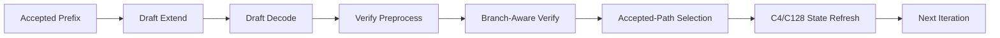

[논문 링크](https://arxiv.org/abs/2609.24698v1)
## 압축된 기억 위에서 가지를 뻗기: DeepSeek-V4에 트리 추론을 얹은 이야기

**TL;DR** DeepSeek-V4-Flash에 트리 구조 추론적 디코딩을 올리면 같은 검증 예산에서 더 긴 채택 길이와 최대 약 18.5% 의 디코드 처리량 향상을 얻는다 (근거: §5, Fig. 4) . 핵심은 트리 자체가 아니라 압축 어텐션 상태를 가지마다 격리했다가 채택된 경로만 커밋하는 검증 측 적응에 있다 (근거: §4) .

## 핵심 아이디어

자율주행차가 한 갈래 길만 예측하면 막다른 골목에서 멈추지만, 갈림길마다 대안을 들고 가면 살아남을 확률이 높아진다. 이 논문이 한 일도 같다.

선형 추론적 디코딩은 드래프트 모델이 토큰 체인 하나를 제안하고 타깃 모델이 한 번에 검증한다 (근거: §2.1) . 앞부분이 틀리면 뒷부분 전체가 버려진다. 트리 추론적 디코딩은 공유 접두사에서 여러 분기를 유지해 같은 검증 토큰 예산 $D$ 로 더 넓은 후보 커버리지를 검증한다 (근거: §2.1, Fig. 1) .

저자들의 중심 가설은 이렇게 한 문장으로 정리할 수 있다.

> 저자들은 분기 인식 인과 검증과 임시 상태 격리, 채택 경로 상태 새로고침을 사용함으로써 DeepSeek-V4의 온라인 압축 어텐션 제약을 극복하고 동일 예산에서 선형 대비 더 긴 채택 길이와 더 높은 처리량을 달성할 수 있다고 가정한다 (근거: §3, §4) .

이 가설에서 중요한 전환은 드래프트 측이 아니라 검증 측에 있다. 최근 DSpark가 드래프트 효율과 적응형 깊이에 집중했다면, 이 연구는 검증 측 너비를 넓히는 직교 축을 판다 (근거: §6) .

## 배경: 그들이 해결한 문제

### 출판 시점의 최신 기술은 어디에 있었나

EAGLE-3/MTP식 자회귀 추론적 디코딩은 가벼운 드래프트가 미래 토큰들을 예측하고 타깃이 한 번의 순전파로 검증하는 흐름이 표준이었다 (근거: §2.1) . 트리 검증 아이디어 자체는 SpecInfer, EAGLE-2, Medusa, Sequoia, DySpec 등에서 이미 확립된 확장이었다 (근거: §2.1, §3) .

DeepSeek-V4는 다른 문제를 풀고 있었다. Compressed Sparse Attention인 $CSA$ 와 Heavily Compressed Attention인 $HCA$ 로 시퀀스 차원까지 온라인 압축해 저장량과 어텐션 연산량을 줄인다 (근거: §2.2) . 토큰별 잠재 KV 압축과 달리, 여러 위치의 정보가 더 짧고 구조화된 표현으로 합쳐지고 디코딩이 진행되며 함께 진화한다 (근거: §2.2) .

### 핵심 연구 공백

논리적 토큰 히스토리는 여전히 선형 수열이지만, 물리적 어텐션 상태는 압축된 문맥 상태에서 나온다 (근거: §2.2) . 선형 추론은 tentative 수열 하나만 연장하면 되지만, 트리는 서로 배타적인 분기들을 동시에 검증해야 한다. 분기 이후 압축 결과가 달라져 버린다 (근거: §3.2) .

저자들이 명시한 세 가지 난관은 다음과 같다 (근거: §3) .

1. **분기 인식 인과 검증과 격리** : 후보는 자기 조상만 봐야 하고, 타 분기를 보면 안 된다. 물리적 배치 순서와 논리적 의존성이 어긋난다 (근거: §3.1) .
2. **압축 상태 일관성과 채택 경로 새로고침** : $CSA$ / $HCA$ 는 분기마다 다른 압축 토큰과 중간 버퍼를 만든다. 토큰 검증만으로는 부족하고 압축 상태까지 채택 수열과 일치해야 한다 (근거: §3.2) .
3. **실행 오버헤드와 최적화 경로 호환성** : 트리 구성, 메타데이터, 임시 상태, 채택 경로 추출이 매 사이클 지연을 더한다. 가변 트리 모양은 CUDA Graph 재생이나 선할당 메모리 같은 안정 형상 가정에 어긋난다 (근거: §3.3) .

즉 공백은 트리 마스크 하나가 아니라, 압축되고 재조직되는 문맥 위에서 트리 의미를 끝까지 보존하는 타깃 검증 적응이었다 (근거: §3, §4) .

## 새로운 접근법: Three-Stage Speculative Forward with Accepted-Path Refresh

가장 독창적인 기여 세 가지를 구분하면 다음과 같다 (근거: §4) .

1. **기존 방법론의 새로운 적용 + 시스템 적응** : EAGLE/MTP식 트리 추론을 DeepSeek-V4-Flash 파이프라인과 SGLang에 통합한 세 단계 순전파. 드래프트 확장, 드래프트 디코드, 타깃 검증으로 나눈다 (근거: §4.1, §4.4) .
2. **새로운 상태 관리 메커니즘** : 토큰 수준 KV와 경로 의존 압축 상태를 분리하고, 후보 체인별 격리 압축을 위한 스크래치 패드를 도입했다. 영속 캐시에 바로 쓰지 않고 채택 경로만 커밋한다 (근거: §4.2) .
3. **새로운 공학적 통찰** : $C4$ 와 $C128$ 의 서로 다른 새로고침 스케줄, 디바이스 측 메타데이터 처리, CUDA Graph 커버리지 상한 같은 오버헤드 제어 최적화 (근거: §4.3) .

저자 관점의 강점은 명확하다. 밀집 어텐션에서는 트리가 공유 KV 위의 마스크로 충분하지만, 압축 어텐션에서는 분기가 갈라진 뒤 상태 자체가 갈라지므로 검증 측 격리와 새로고침이 필수라는 것이다 (근거: §6) . 그래서 순수 이득을 다음처럼 설명한다.

$$
\text{순수 이득} \approx \text{너비로 얻는 추가 채택} - \text{분기 간 상태 발산으로 인한 추가 검증 비용}
$$

위 식은 저자들의 논의를 요약한 것이며, 압축 패러다임에서 두 번째 항이 가장 크다고 본다 (근거: §6) .

위 그림은 선형 추론이 단일 사슬 $T_0 \to T_1 \to T_2 \to T_3$ 을 따르는 반면, 트리 추론은 $T_{00}$ 에서 분기해 예산 제어 가지치기로 세 가지 대표 모양을 남기는 방식을 보여준다 (근거: Fig. 1) . 중요한 점은 모양 자체가 고정된 것이 아니라 드래프트 출력과 예산에 따라 달라진다는 것이다 (근거: §4.1) .

위 파이프라인은 SGLang 통합 흐름을 요약한다 (근거: Fig. 2, §4.4) . 채택 접두사와 영속 캐시가 들어오면 후보 트리를 확장하고, 트리 어텐션 마스크로 후보 표현을 계산한 뒤, 검증 전처리에서 후보 체인과 압축 경계를 정의한다. 서로 다른 체인을 한 압축 연산에 섞으면 상호 배타적 히스토리가 혼합되므로 체인별로 독립 압축한다 (근거: §4.1) . 검증 중 임시 결과는 스크래치 패드에 머물고, 채택 경로 선택 후 토큰 히스토리와 KV, $CSA$ / $HCA$ 압축 상태와 중간 버퍼만 새로고침한다 (근거: §4.2) .

## 작동 원리: 구체적인 예시로 살펴보기

대학원생을 위한 장난감 예시로 과정을 따라가 보자. 어휘가 `A, B, C` 세 토큰뿐이고, 이미 채택된 접두사가 `A` 라고 하자. 검증 예산 $D$ 가 3 tokens 이고, 드래프트가 두 단계에 걸쳐 top-2를 제안한다.

**용어 정의:** $D$ 는 타깃이 한 번에 검증하는 후보 토큰 수, top-$k$ 는 단계마다 유지하는 분기 수, $s$ 는 드래프트 스텝 수, 채택 길이는 한 검증 라운드당 채택된 평균 토큰 수이다 (근거: §5.1) .

1. **드래프트 확장:** `A` 뒤에 `B` 와 `C` 두 가지를 펼친다. 다음 단계에서 `B` 뒤에 `B, C` , `C` 뒤에 `A, B` 를 펼치면 전체 트리는 1 + 2 + 4 = 7 nodes 가 된다.
2. **예산 가지치기:** $D=3$ 이므로 점수 상위 3 nodes 만 남긴다. 예를 들어 `A-B`, `A-C`, `A-B-B` 가 남는다. 깊고 좁은 사슬 하나가 아니라 얕고 넓은 트리다.
3. **드래프트 디코드:** 각 후보는 자기 조상 경로로만 어텐션한다. `A-B-B` 는 `A, A-B` 를 보고, `A-C` 는 `A` 만 본다. DeepSeek-V4의 FlashMLA 경로가 트리 어텐션을 지원하므로 레이아웃과 메타데이터만 공급한다 (근거: §4.1) .
4. **검증 전처리:** 트리를 체인들로 푼다. `Chain1 = A-B-B`, `Chain2 = A-C` . 접두사 `A` 상태는 재사용하되, 분기 이후 압축은 체인별로 분리한다.
5. **타깃 검증:** 타깃 모델이 두 체인을 함께 검증한다. 선형이었다면 `A-B-?` 에서 두 번째 토큰이 틀리면 뒤가 전부 무효가 되지만, 트리에서는 `A-C` 가지가 살아남을 수 있다.
6. **채택 경로 커밋:** 예를 들어 `A-C` 가 채택되면 `Chain2` 의 KV와 $C4$ / $C128$ 압축 상태만 영속 캐시에 반영하고, `Chain1` 의 임시 압축 토큰과 중간 버퍼는 버린다. 다음 반복은 새로운 접두사 `A-C` 에서 시작한다 (근거: §4.2, §4.4) .

### 비밀 병기: 임시 분기 상태 격리

핵심 부품 하나만 꼽으면 스크래치 패드 기반 격리이다. $SWA$ 는 토큰 수준 KV 새로고침이면 되지만, $CSA$ / $HCA$ 는 체인별 압축 토큰과 중간 결과가 필요해 페이지 기반 KV 풀에 직접 쓰면 페이지 할당과 소유권이 꼬인다 (근거: §4.2) .

선형 대비 트리의 효과를 표로 정리하면 다음과 같다. 수치는 배치 크기 1부터 64까지 평균이며 단위는 tokens 또는 %이다 (근거: Tab. 1, §5.2, §5.3) .

| 예산 $D$ | 대표 비교 | 채택 길이 선형 tokens | 채택 길이 트리 tokens | 상대 채택 이득 % | 상대 처리량 이득 % |
|---|---|---:|---:|---:|---:|
| 5 | s4_k1_d5 대비 s4_k2_d5 | 2.39–2.84 | 2.67–3.15 | 약 +11.0 | 약 +3–+5 |
| 6 | s5_k1_d6 대비 s4_k2_d6 | 2.39–2.84 | 2.75–3.27 | 약 +14.4 | 약 +8–+9 |
| 7 | s6_k1_d7 대비 s4_k2_d7 | 2.39–2.81 | 2.81–3.36 | 약 +17.1 | 약 +9–+10 |
| 8 | s7_k1_d8 대비 s5_k2_d8 | 2.39–2.84 | 2.83–3.41 | 약 +18.6 | 약 +9–+10 |

이 표가 말하는 메커니즘은 단순하다. 예산 일부는 체인 깊이 유지에 쓰이고, 남은 잉여로 너비를 펼치는 데서 트리가 이긴다. 작은 예산에서는 잉여가 없어 선형에 가깝고, 큰 예산에서 너비가 효과를 낸다 (근거: §5.2) . 그런데 처리량은 $D \approx 6$ 이후 정체된다. 채택은 계속 늘지만 예산당 증가분이 줄고 오버헤드가 커져 상쇄되기 때문이다 (근거: §5.3) .

## 성능 검증: 주요 결과

실험 설정은 DeepSeek-V4-Flash 모델, 8 GPU NVIDIA 머신, 검증 예산 $D=5, 6, 7, 8$ , 배치 크기 1, 2, 4, 8, 16, 32, 64이다 (근거: §5.1) . 워크로드는 예측 가능성이 높은 GSM8K 수학 추론, 코드 생성인 MBPP, 발산도가 큰 ShareGPT 개방형 대화를 쓴다 (근거: §5.1) . 표기 `s4_k2_d5` 는 드래프트 4 steps, top-2, 예산 5 tokens 를 뜻하고, 동일 $D$ 에서 선형과 트리는 타깃이 검증하는 토큰 수가 같아 후보 조직 방식만 비교하는 통제 비교가 된다 (근거: §5.1) . 핵심 지표는 채택 길이 tokens 와 디코드 처리량이다 (근거: §5.1) .

위 그림에서 트리는 모든 예산과 배치에서 선형보다 높은 채택 길이를 보인다 (근거: Fig. 3, §5.2) . 네 가지 안정 패턴이 눈에 띈다.

1. **상대 이득은 예산과 함께 단조 증가** : 약 +11.0% 에서 약 +18.6% 까지 커지지만, 예산당 증가분은 약 +3.4% , +2.6% , +1.6% 로 줄어든다. 선형 기준선은 예산과 무관하게 약 2.84 / 2.67 / 2.39 tokens 에 머문다 (근거: §5.2, Tab. 1) .
2. **채택 길이는 배치 크기에 거의 불변** : 고정 구성에서 배치 1부터 64까지 변동이 0.04 tokens 미만이다. 드래프트 품질과 후보 구조에만 의존하기 때문이다 (근거: §5.2) .
3. **체인을 깊게 한다고 늘지 않는다** : 같은 예산에서 얕고 넓게와 깊고 좁게의 차이는 약 2% 이내이다. 드래프트의 신뢰 가능한 예측 지평이 한계이기 때문이다 (근거: §5.2) .
4. **과제 전반에 견고** : 절대값은 GSM8K, MBPP, ShareGPT 순이지만 상대 이득은 예산별로 1–2 %p 이내로 모인다. MBPP가 가장 낮고 GSM8K와 ShareGPT가 비슷하다 (근거: §5.2) .

처리량은 대부분 구성에서 양수이며 작은 예산에서만 손익분기점에 가깝다 (근거: Fig. 4, §5.3) .

1. **예산이 커야 오버헤드를 넘는다** : 평균 이득은 $D=5$ 에서 약 +3–+5% , $D=6$ 에서 약 +8–+9% , $D=7$ –8에서 약 +9–+10% 로 정체된다. $D=5$ 의 s4_k2_d5 배치 1 같은 경우는 거의 0% 근처이다 (근거: §5.3) .
2. **같은 예산에서는 스텝 수가 적을수록 유리** : $D=6$ 에서 s3_k2 약 +13% , s4_k2 약 +9% , s5_k2 약 +4% 로 떨어진다. 채택 길이는 스텝에 둔감하므로 차이는 직렬 드래프트 순전파와 트리 너비의 오버헤드에서 온다 (근거: §5.3) . 다만 너무 얕으면 깊이가 부족해져 최적 깊이는 드래프트 능력에 따라 이동한다 (근거: §5.3) .
3. **배치 크기는 역U자** : 배치 4 근처에서 정점을 찍고 64로 갈수록 내려간다. $D=6$ 에서 대략 배치 1 약 +8% , 배치 4 약 +11% , 배치 64 약 +7% 이다. 채택 길이가 배치 불변이므로 순수 실행 효과이며, 작을 때는 메모리 바운드라 검증 절감이 크고 클 때는 컴퓨트 바운드라 후보 검증이 연산 경합을 일으킨다 (근거: §5.3) .
4. **예측하기 어려운 워크로드가 가장 크게 가속** : ShareGPT가 가장 높고 전역 최대 약 +18.5% 는 s3_k2_d6 배치 4에서 나온다. 단일 체인이 일찍 실패하는 곳에서 트리 너비가 낭비를 가장 많이 회수한다 (근거: §5.3) .

베이스라인 비교 관점에서 가장 강한 증거는 동일 예산 통제 비교이다. 검증 토큰 수를 같게 놓고도 조직만 바꾸면 전 구간에서 채택 길이가 오르고, 대부분 처리량도 오른다 (근거: §5.2, §5.3) . 반대로 개선이 미미한 지점도 분명하다. $D=5$ 소예산, 깊은 스텝 구성, 큰 배치 64에서는 오버헤드가 이득을 갉아먹는다 (근거: §5.3) . 저자들은 범용 멀티 GPU 설정이 고동시 서빙에 최적화되지 않아 큰 배치에서 변동이 있다고 밝힌다 (근거: §5.3) .

시스템 관점에서 구현과 자원은 다음과 같다. 핵심 의존성은 SGLang 추론 파이프라인과 DeepSeek-V4의 FlashMLA/어텐션 경로, CUDA Graph이다 (근거: §4.1, §4.3, §4.4) . 평가는 지연 시간보다 유효 디코딩 처리량과 라운드당 채택 토큰 수에 초점을 맞추고, 확장성은 배치 크기에 대한 처리량 곡선으로 본다 (근거: §5.1, §5.3) . 학습 FLOPs나 토큰화, 사전학습 코퍼스 같은 내용은 이 논문의 범위가 아니며 보고되지 않는다 (근거: §5) .

## 우리의 관점: 강점, 한계, 그리고 이 연구가 중요한 이유

**강점** 은 문제 설정의 정직함에 있다. 트리를 새로 발명한 논문이 아니라, 압축 문맥에서 검증 측을 어떻게 고쳐야 하는지를 파고든 적응 논문임을 분명히 한다 (근거: §2, §6) . 동일 예산 통제 비교, 예산과 배치와 데이터셋을 모두 흔든 규칙성 분석, 채택 길이와 처리량의 디커플링 지적은 실무자가 바로 써먹을 수 있는 형태이다 (근거: §5) .

**명시적 한계** 도 저자들이 직접 적는다. 하드웨어 인식 예산 튜닝은 범위 밖이다 (근거: §3.3) . 고동시 설정이 아니라 큰 배치 변동이 있고, 더 얕게가 항상 좋은 것이 아니며 드래프트가 강해지면 최적 깊이가 깊어진다 (근거: §5.3) . 가지치기도 현재는 누적 점수 위주이다 (근거: §6) .

**잠재적 한계** 는 세 가지로 본다. 첫째, 절대 처리량 tokens/s 과 TTFT/TPOT ms 같은 서빙 지표의 절댓값이 없어 다른 하드웨어로 이전이 어렵다 (근거: §5) . 둘째, 8 GPU 단일 환경 결과라 텐서 병렬이나 파이프라인 병렬, prefix 캐싱과 얽힌 거동은 알 수 없다 (근거: §5.1) . 셋째, $CSA$ / $HCA$ 세부 압축률과 $C4$ / $C128$ 새로고침 비용의 정량 분해가 없어 오버헤드 중 무엇이 지배적인지 재현하기 어렵다 (근거: §4.3) .

그럼에도 이 연구가 중요한 이유는 방향이 바뀌고 있기 때문이다. 더 많은 모델이 압축되고 희소하고 구조화된 문맥 표현을 쓸수록, 트리가 돈을 버는 조건 중 타깃 검증 측이 결정적 변수가 된다 (근거: §6) . 드래프트가 강해져도 검증이 싸게 트리를 처리하지 못하면 너비의 이득은 오버헤드에 먹힌다. DeepSeek-V4.1-Flash가 $CSA2$ 로 올리고 $HCA$ 를 빼도 압축 패러다임은 남는다는 지적은 이 적응 작업이 일회성이 아님을 시사한다 (근거: §6) .

## 다음 단계는?: 앞으로의 길

저자들이 제안하는 향후 방향은 세 갈래이다 (근거: §6) .

1. **드래프트 측과 검증 측 공동 설계** : DSpark 같은 적응형 깊이와 검증 오버헤드는 트리 모양을 통해 연결되므로 깊이와 너비를 함께 정해야 한다 (근거: §6) .
2. **적응형 워크로드 인식 트리 형성** : 점수뿐 아니라 분기 깊이와 경로 구조, 후보 간 의존성, 과제 예측 가능성과 런타임 배치 크기로 트리 활성화 여부와 너비를 정한다 (근거: §6) .
3. **타깃 검증 적응의 지속** : 길어지는 문맥 서빙 확장성을 위해 압축과 희소, 구조화 문맥에서 검증 적응을 계속 발전시킨다 (근거: §7) .

합리적인 다음 단계로 두 가지를 덧붙이고 싶다. 하나는 배치 크기와 예측 가능성에 따른 트리 켜기/끄기 정책의 온라인 컨트롤러이다. 역U자와 ShareGPT 최대 이득이 이미 힌트를 준다 (근거: §5.3) . 다른 하나는 $C4$ / $C128$ 새로고침과 스크래치 패드 트래픽을 연산자와 메모리 이동으로 분해한 마이크로벤치마크이다. 그래야 작은 예산에서 손익분기점이 어디인지, 큰 예산에서 무엇이 정체를 만드는지 알 수 있다 (근거: §4.3, §5.3) .

트리가 만능은 아니다. 예산이 너비를 펼 만큼 커야 하고, 깊이는 드래프트 능력에 맞아야 하며, 작고 중간 배치와 예측 어려운 워크로드에서 가장 빛난다 (근거: §5.3) . 조건이 맞을 때 약 18.5% 의 처리량 향상은 압축된 기억 위에서도 가지가 통한다는 증거이다 (근거: §5.3) .

<!-- verbatim-tables -->

## 논문 원문의 표

> arXiv e-print 의 LaTeX 원본에서 기계적으로 옮긴 표입니다. 숫자는 논문의 값이며 모델을 거치지 않았습니다.

**표 1. Accepted length (absolute, averaged over batch sizes 1--64) of linear and tree-structured speculation under matched verification budgets $D$. Within each budget, the linear ($k{=}1$) and tree ($k{=}2$) configurations verify the same number of candidate tokens. Accepted length is nearly invariant to batch size (spread $<0.04$ across all tested batch sizes).**

| Budget | Config. | GSM8K | MBPP | ShareGPT |
|---|---|---|---|---|
| $D{=}5$ | s4_k1_d5 (linear) | 2.836 | 2.663 | 2.389 |
|  | s3_k2_d5 | 3.135 | 2.943 | 2.681 |
|  | s4_k2_d5 | 3.154 | 2.935 | 2.667 |
| $D{=}6$ | s5_k1_d6 (linear) | 2.841 | 2.669 | 2.392 |
|  | s3_k2_d6 | 3.219 | 3.038 | 2.757 |
|  | s4_k2_d6 | 3.274 | 3.044 | 2.754 |
|  | s5_k2_d6 | 3.256 | 3.030 | 2.741 |
| $D{=}7$ | s6_k1_d7 (linear) | 2.845 | 2.672 | 2.392 |
|  | s4_k2_d7 | 3.361 | 3.129 | 2.809 |
|  | s5_k2_d7 | 3.348 | 3.108 | 2.798 |
|  | s6_k2_d7 | 3.329 | 3.098 | 2.795 |
| $D{=}8$ | s7_k1_d8 (linear) | 2.842 | 2.678 | 2.393 |
|  | s5_k2_d8 | 3.406 | 3.163 | 2.839 |
|  | s6_k2_d8 | 3.394 | 3.153 | 2.834 |
|  | s7_k2_d8 | 3.387 | 3.153 | 2.830 |

> 이 글의 그림은 arXiv:2609.24698 원본에서 가져왔습니다 (CC BY 4.0). 크기와 형식만 바꿨습니다.
