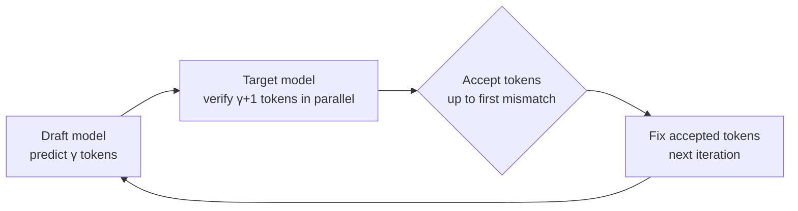

[Paper](https://arxiv.org/abs/2609.24847v1)
## SPECTRA: A Reconfigurable LLM Accelerator That Changes Its Hardware With Every Inference Stage

## TL;DR

Speculative decoding oscillates between prefill (compute-bound GEMM), decode (memory-bound GEMV), and the parallel verification in between, so **arithmetic intensity** fluctuates from token to token. A fixed datapath cannot handle all three regimes at once. **SPECTRA** is a reconfigurable architecture that switches the PE array inside a tile between systolic and vector-lane per kernel, and dynamically selects the tile count, sharding axis, and communication primitives across tiles. On a 20-tile FPGA prototype it achieves up to **2.09×** over a fixed design (tile level) plus an additional **1.25×** (system level), delivering up to **3.6×** throughput and **2.9×** power efficiency over edge GPUs.

## Core Idea

The central claim of this paper can be summed up in one sentence.

> **The authors hypothesize that by introducing [dual-mode PE arrays at the kernel level and dynamic sharding at the system level], they can overcome [the limitation that a fixed datapath cannot absorb the variable arithmetic intensity of speculative decoding] and achieve [up to 2.09× + 1.25× speedup].**

Specifically, the research gap the authors identify is clear. Existing speculative decoding accelerators (SpecPIM, LP-Spec, EdgeLLM, Ghidorah, etc.) statically decide only "which substrate for the draft model and which substrate for the target model" (source: §5). In other words, they cannot react to **runtime changes** in the workload. SPECTRA, by contrast, is the first to weave reconfigurable computing and LLM inference together **at two levels simultaneously**. The three contributions the authors present are as follows (source: §1).

1. **A new analysis**: quantitatively characterizing the "intermediate compute regime" that speculative decoding creates and its runtime dependencies.
2. **New architectural components**: a dual-mode PE array that switches GEMM↔GEMV per kernel, and system-level mapping that dynamically selects the number of tiles, the sharding axis, and the communication pattern.
3. **A new system prototype**: demonstrating on a 20-tile FPGA that combining the two levels of adaptivity yields substantial performance gains over a fixed datapath and static mapping.

## Background: The Problem They Solved

Transformer-based LLM inference splits into two phases with opposite computational characteristics. If the input matrix is $[M\times K]$ and the weights are $[K\times N]$ (where $M$ is the number of token rows processed at once, $K$ is the hidden dimension, and $N$ is the projection output dimension), arithmetic intensity (AI) is the compute divided by the bytes moved. Taking the weight load as the dominant term simplifies to (source: §2):

$$
\text{AI}(M) = \frac{2M \cdot KN}{4KN} = \frac{M}{2} \;\text{FLOPs/byte}
$$

The key point is that AI scales linearly with $M$ and is independent of $K$ and $N$. **Prefill** processes all $S$ input tokens at once ($M=S$), making it a GEMM that sits in the compute-bound regime. **Autoregressive decode**, conversely, processes only one token at a time ($M=1$), making it a GEMV that drops to $\text{AI}=0.5$ FLOPs/byte and becomes thoroughly memory-bound (source: §2). These sit at opposite ends of the roofline model.

This is where **speculative decoding** comes in. A lightweight **draft model** predicts $\gamma$ tokens in advance, and a heavy **target model** verifies $\gamma+1$ tokens in parallel (where $\gamma$ is the speculation length). Acceptance proceeds up to the first mismatching token, so accuracy is exactly identical to standard decoding (source: §2).

The benefit is a reduction in the number of target model invocations. In a typical combination with a per-token acceptance rate of 0.8–0.9 and $\gamma=4$–$8$, a single target call confirms 3–6 tokens, reducing the number of sequential forward passes accordingly (source: §2). The problem is precisely this verification phase. Verification has $M=\gamma+1$, making it a GEMM, and its exact position moves between memory-bound and compute-bound depending on $\gamma$ and the acceptance rate (source: §2, Fig. 1). A single fixed architecture cannot handle these three regimes well at the same time.

## New Approach: SPECTRA

SPECTRA is a **runtime-reconfigurable tiled architecture**. It consists of four components: accelerator tiles that execute kernels, a NoC (Network-on-Chip) responsible for inter-tile communication, a distributed memory subsystem that provides high-bandwidth access, and a host processor that configures the tiles and sequences kernel calls (source: §3). Reconfigurability appears at two levels.

- **Tile level (fine-grained)**: each tile's compute engine changes execution mode according to the kernel's $M$ value.
- **System level (coarse-grained)**: the host chooses the number of tiles, the sharding axis, and the communication pattern per kernel.

Each accelerator tile contains four double-buffered local memories (activations, weights, partial sums, outputs), a reconfigurable compute engine, a fused post-processing unit, and a communication unit (including a TLB). The heart of the compute engine is an **$8\times8$ PE array**, where each of the 64 PEs implements one MAC unit (source: §3). The same array is reused for every kernel, but only the **data delivery schedule and local memory interpretation** change at runtime. The array itself is unchanged, so the overhead is small.

The two execution modes are selected by the $M$ value (source: §3):

- **Systolic mode** ($M>1$): operates as an output-stationary systolic array. Weights stream in column by column, and activations are injected with a per-row time offset, creating a diagonal wavefront. Each PE accumulates partial sums locally along the reduction dimension. Suited to prefill and parallel verification.
- **Vector-lane mode** ($M=1$): the same array is reinterpreted as 8 independent dot-product lanes. A single activation is broadcast to all columns, and the weight memory is re-indexed so that all 64 banks are accessed in parallel. Even when $M=1$, the entire $8\times8$ weight sub-tile is read every cycle, maintaining high utilization. Suited to autoregressive decode.

This dual-mode design directly targets the two dominant regimes of speculative decoding. The complementary inefficiencies of a fixed datapath — vector-only in prefill and verification, systolic-only in draft decode — are resolved simultaneously by the reconfigurable engine (source: §3).

## How It Works: A Concrete Example

**First, let's get an intuition for the difference between systolic and vector-lane with small numbers.** Suppose some linear layer computes $Y = X W$.

- **Decode (draft generation)**: since $M=1$, $X$ is a single row $[1\times K]$. The output $Y$ is $N$ dot products, i.e., a GEMV. In vector-lane mode, this single row of activations is broadcast to all 8 lanes, and each lane takes a different column of $W$ to produce 8 output values **simultaneously**. It reads the 64 banks of weight memory in parallel, fetching the entire $8\times8$ sub-tile every cycle (source: §3). Even for a single-token computation, the PE array never idles.

- **Verification/prefill**: $M=\gamma+1$ or $M=S$, so $M>1$. Now $X$ has multiple rows and the output becomes an $M\times N$ GEMM. In systolic mode, weights flow along the column direction and activations enter with a per-row time skew, forming a diagonal wavefront. Each PE keeps accumulating only the partial sum at its own position (source: §3).

**Attention also finishes within a single tile, with no separate kernel.** The fused post-processing unit implements a FlashAttention-style dataflow. Instead of materializing the full $QK^T$ score matrix in memory, it computes incrementally block by block over KV and performs online softmax. Within each block, a $K$-way comparator finds the maximum (for numerical stability), an exponential LUT computes the exponential, and an adder tree accumulates the normalization factors. The intermediate quantities ($M_{\text{prev}}$, $M_{\text{new}}$, $I_{\text{prev}}$, $I_{\text{new}}$) maintain the per-row maximum and normalization factor across blocks, producing $O=\mathrm{softmax}(QK^T/\sqrt{d_h})\cdot V$ as a stream without storing the full score matrix (source: §3).

**The system-level "secret weapon" is the freedom of the sharding axis.** When splitting a matrix product $[M\times K]\cdot[K\times N]$ across $T$ tiles, the kernel chooses which of the three axes to split (source: §3):

- **N-sharding (output parallel)**: split the output dimension $N$. Activations are replicated, weights are partitioned, and no inter-tile reduction is needed.
- **K-sharding (reduction parallel)**: split the reduction dimension $K$. Partial sums must be combined via P2P.
- **M-sharding (row parallel)**: split the row dimension $M$. Weights are replicated, but no reduction is needed.

Intuitively, draft decode ($M=1$) has no row parallelism, so K-sharding is favorable, while prefill and verification have large $M$, making N-sharding attractive with no reduction overhead (source: §3). This decision is made by an in-house mapping flow based on a cost model built from FPGA profiling.

## Performance Evaluation: Key Results

The prototype is implemented with **20 tiles** (14 accelerators, 4 memories, 1 CVA6 RISC-V processor, 1 I/O) on a proFPGA UltraScale+ XCVU19P based on the ESP platform, and runs at **100 MHz** (source: §4). The workloads are three draft/target pairs: Pythia-70M→160M, SmolLM2-135M→360M, and GPT-2-124M→774M. The default setting is a 32-token prompt, averaged over 20 prompts per model pair, with $\gamma=8$.

**Effect of tile-level reconfiguration** (Fig. 6). The reconfigurable engine is **1.42× / 2.09× / 1.16×** faster than systolic-only, and **3.80× / 5.97× / 8.02×** faster than vector-only (in Pythia / SmolLM2 / GPT-2 order) (source: §4). The speedup the reconfigurable engine gains from speculative decoding over target-only decoding is also **1.36× / 2.04× / 3.82×**, the largest among the three datapaths. In other words, flexibility increases not only absolute performance but also "the payoff of speculation itself."

| Draft→Target model pair | R/V (vs vector-only) | R/S (vs systolic-only) | Speculative vs target-only |
|---:|---:|---:|---:|
| Pythia-70M→160M | 3.80× | 1.42× | 1.36× |
| SmolLM2-135M→360M | 5.97× | **2.09×** | 2.04× |
| GPT-2-124M→774M | 8.02× | 1.16× | 3.82× |

**It also matters that the price of flexibility is cheap.** The reconfigurable engine uses +82% more LUTs and +79% more FFs than systolic-only, but this is due to the dual datapath and mode-selection control (steering logic), while BRAM grows only +7.7%, URAM 0%, and DSP +10.4% (source: §4, Tab. 2). In other words, it achieves nearly 2× speedup by adding only control logic rather than replicating arithmetic and storage resources.

**Additional gain from system-level sharding** (Fig. 7). With the same reconfigurable engine, the mixed sharding policy is **1.14× / 1.25× / 1.05×** faster than the best fixed sharding. No single sharding family is universally optimal, and switching to N-sharding (avoiding the K-sharding reduction chain) or M-sharding depending on the phase is effective (source: §4).

**Head-to-head comparison with edge GPUs** (Tab. 3). For GPT-2 speculative decoding ($p=128$), SPECTRA records about **3.6×** higher throughput at **0.69 TPS** versus **0.19 TPS** for Jetson Orin NX and Jetson TX2, and a power efficiency of **0.035 TPS/W**, which is **2.9×** that of TX2 (0.012) and **4.4×** that of Orin NX (0.008). This holds even though the reference GPUs run at ~1 GHz and have higher off-chip bandwidth.

| Metric | Jetson Orin NX | Jetson TX2 | **SPECTRA** |
|---:|---:|---:|---:|
| Compute units | Ampere GPU (8 SM/1024 CUDA) | Pascal GPU (2 SM/256 CUDA) | 14 accelerators @ 100 MHz |
| On-chip memory | 11.8–15.8 MB | ~5.4 MB | 18.84 MB (BRAM+URAM) |
| Off-chip bandwidth | 102 GB/s LPDDR5 | 59.7 GB/s LPDDR4 | 45 GB/s DDR |
| Power | 25 W | 15 W | 19.9 W |
| Throughput (TPS) | 0.19 | 0.19 | **0.69** |
| Power efficiency (TPS/W) | 0.008 | 0.012 | **0.035** |

**Ablation** (Fig. 8, Pythia-160M→410M) also demonstrates robustness. It is effective across all $\gamma\in\{4,8,16\}$, with an optimum at $\gamma=8$, and as the output length grows from 32 to 256 tokens the speedup increases from **1.22×→1.90×**. This is because the share of one-time prefill shrinks and the repeated draft/verify loop dominates, increasing the benefit of supporting both regimes (source: §4).

## Our Perspective: Strengths, Limitations, and Why This Matters

**The strengths are clear.** This paper pushes the well-known fact that "arithmetic intensity varies with the inference phase" all the way to the design principle that **hardware must react at runtime**. In particular, two things stand out: (1) the dual-mode PE array achieves nearly 2× gain with only control logic, without replicating arithmetic resources; and (2) it unifies tile-level and system-level reconfiguration into a single mapping flow, quantitatively showing that the optimal sharding changes by phase.

**There are also points that warrant a critical look.**

- **Absolute throughput is low.** 0.69 TPS is not a serviceable level. One should not lose sight of the fact that the performance advantage comes from a relative figure, "3.6× over edge GPUs," and is a win under the constraints of a 100 MHz clock and 45 GB/s DDR (source: §4, Tab. 3).
- **Model scale is small.** The evaluated target models are at most 774M parameters, and scalability to modern LLMs of tens of billions or more is unverified. Long-context scenarios where the KV cache grows beyond the 18.84 MB of on-chip memory are also not addressed.
- **Precision is 32-bit.** As can be seen from the fact that the weight load in the AI formula assumes 32-bit (source: §2), combining with INT8/FP8 quantization is unexplored. Quantization is nearly essential for edge deployment, yet how the reconfigurable engine coexists with low precision remains open.
- **Mapping automation is limited.** Since the "in-house mapping flow" depends on a cost model based on FPGA profiling, its maturity as a general-purpose compiler/autotuner is unverified (source: §3).
- **Reconfiguration overhead is not quantified.** The latency and power cost of switching modes per kernel are not reported explicitly and separately.

Even so, why this work matters is clear. In the trend of LLM inference moving from the data center to the edge, it demonstrates at the prototype level that "hardware that changes shape at runtime instead of fixed silicon" can substantially circumvent the memory-bound bottleneck.

## What's Next?: The Road Ahead

In the conclusion, the authors summarize the combination of the two levels of reconfiguration as a promising solution for edge LLM inference (source: §6). Given the limitations, reasonable next steps might be:

1. **Break through clock and energy limits with an ASIC implementation.** Solving the frequency and power constraints of the FPGA (100 MHz) in an ASIC could bring absolute TPS close to a serviceable level.
2. **Combine with low precision and quantization.** Extending the PE array to support FP8/INT8 MACs could reduce both memory traffic and on-chip footprint.
3. **Larger models and long context.** The key question is how to distribute multi-billion-parameter targets and a growing KV cache across the tiled fabric.
4. **Automation and generalization of mapping.** Elevating the cost model that relies on FPGA profiling to the compiler level could lead to autonomous mapping that responds in real time to runtime changes in $\gamma$ and the acceptance rate.
5. **Co-design with dynamic speculation length.** A natural extension is to weave together an algorithm that adjusts $\gamma$ at runtime with a loop that immediately reflects those changes in the hardware mapping.

<!-- verbatim-tables -->

## Tables from the paper

> Tables converted mechanically from the arXiv e-print LaTeX source. The numbers are the paper's own and did not pass through a model.

**Table 1. Scalability at $\gamma=8$. All entries report speedup.**

| $\mathrm{out}$ | Pythia $R/V$ | Pythia $R/S$ | Pythia $T_R/\mathrm{SD}_R$ | SmolLM2 $R/V$ | SmolLM2 $R/S$ | SmolLM2 $T_R/\mathrm{SD}_R$ | GPT-2 $R/V$ | GPT-2 $R/S$ | GPT-2 $T_R/\mathrm{SD}_R$ |
|---|---|---|---|---|---|---|---|---|---|
| 128 | 3.38 | 1.47 | 1.15 | 5.14 | 2.16 | 1.70 | 4.65 | 1.32 | 1.82 |
| 256 | 3.20 | 1.50 | 1.37 | 4.86 | 2.20 | 1.93 | 4.41 | 1.35 | 2.12 |
| 512 | 2.67 | 1.42 | 1.44 | 3.44 | 1.86 | 1.83 | 3.21 | 1.25 | 1.91 |

**Table 2. Resource utilization across datapath configurations.**

| **Configuration** | **LUT** | **FF** | **BRAM** | **URAM** | **DSP** |
|---|---|---|---|---|---|
| Vector-only | 52,149 | 69,791 | 68 | 12 | 276 |
| Systolic-only | 48,426 | 57,863 | 104 | 18 | 279 |
| Reconfigurable | 88,206 | 103,564 | 112 | 18 | 308 |

**Table 3. Platform comparison on the GPT-2 speculative decoding workload ($p{=}128$). Jetson figures are derived from per-token latencies reported by ; SPECTRA results are measured on the FPGA prototype at 100 MHz.**

|  | Jetson Orin NX | Jetson TX2 | **SPECTRA** |
|---|---|---|---|
| tabular[c]@c@Compute |  |  |  |
| Unit |  |  |  |

> Figures in this post are taken from the original arXiv:2609.24847 (CC BY 4.0). Only size and format were changed.
