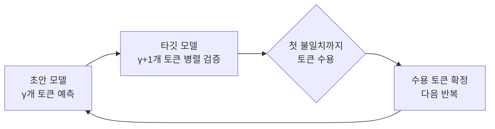

[논문 링크](https://arxiv.org/abs/2609.24847v1)
## SPECTRA: 추론 단계가 바뀔 때마다 하드웨어도 옷을 갈아입는 재구성 가능 LLM 가속기

## 한 줄 요약 (TL;DR)

스펙큘레이티브 디코딩은 프리필(연산 바운드 GEMM)·디코드(메모리 바운드 GEMV)·그 사이의 병렬 검증을 오가며 **산술 강도** 가 토큰마다 출렁인다. 고정 데이터패스로는 이 세 체제를 동시에 소화할 수 없다. **SPECTRA** 는 타일 내부의 PE 배열을 커널 단위로 시스톨릭↔벡터-레인으로 전환하고, 타일 간에는 타일 수·샤딩 축·통신 프리미티브를 동적으로 고르는 재구성 가능 아키텍처다. 20타일 FPGA 프로토타입에서 고정 설계 대비 최대 **2.09배**(타일 레벨)에 더해 **1.25배**(시스템 레벨)를 추가로 확보했고, 엣지 GPU 대비 최대 **3.6배** 처리량과 **2.9배** 전력 효율을 달성했다.

## 핵심 아이디어

이 논문의 중심 주장은 한 문장으로 정리할 수 있다.

> **저자들은 [커널 단위의 이중 모드 PE 배열과 시스템 레벨의 동적 샤딩]을 도입함으로써 [고정 데이터패스가 스펙큘레이티브 디코딩의 가변적 산술 강도를 소화하지 못하는 한계]를 극복하는 [최대 2.09배 + 1.25배의 가속]을 달성할 수 있다고 가정한다.**

구체적으로, 저자들이 짚는 연구 공백(research gap)은 명확하다. 기존의 스펙큘레이티브 디코딩 가속기들(SpecPIM, LP-Spec, EdgeLLM, Ghidorah 등)은 "어떤 기판에 초안 모델을, 어떤 기판에 타깃 모델을" 할당할지만 정적으로 정한다(근거: §5). 즉, 워크로드의 **실행 시간(runtime) 변화** 에 반응하지 못한다. 반면 SPECTRA는 재구성 가능 컴퓨팅(reconfigurable computing)과 LLM 추론을 처음으로 **두 레벨에서 동시에** 엮는다. 저자들이 제시하는 세 가지 기여는 다음과 같다(근거: §1).

1. **새로운 분석**: 스펙큘레이티브 디코딩이 만드는 "중간 연산 체제"와 그 런타임 의존성을 정량적으로 특성화한 것.
2. **새로운 아키텍처 구성요소**: 커널 단위로 GEMM↔GEMV를 전환하는 이중 모드 PE 배열과, 타일 수·샤딩 축·통신 패턴을 동적으로 고르는 시스템 레벨 매핑.
3. **새로운 시스템 프로토타입**: 20타일 FPGA에서 두 레벨의 적응성을 결합해 고정 데이터패스·정적 매핑 대비 실질적 성능 이득을 입증한 것.

## 배경: 그들이 해결한 문제

Transformer 기반 LLM 추론은 계산 특성이 정반대인 두 단계로 갈린다. 입력 행렬을 $[M\times K]$, 가중치를 $[K\times N]$이라 할 때(여기서 $M$은 한 번에 처리하는 토큰 행 수, $K$는 은닉 차원, $N$은 투영 출력 차원), 산술 강도(Arithmetic Intensity, AI)는 연산량을 이동 바이트로 나눈 값이다. 가중치 로드를 지배 항으로 두면 다음처럼 단순화된다(근거: §2).

$$
\text{AI}(M) = \frac{2M \cdot KN}{4KN} = \frac{M}{2} \;\text{FLOPs/byte}
$$

핵심은 AI가 $M$에 선형으로 비례하고 $K$, $N$과는 무관하다는 점이다. **프리필(prefill)** 은 전체 입력 $S$개 토큰을 한꺼번에 처리하므로($M=S$) GEMM이 되어 계산 바운드에 놓인다. 반대로 **자동회귀 디코드(decode)** 는 한 번에 토큰 하나만 처리하므로($M=1$) GEMV가 되어 $\text{AI}=0.5$ FLOPs/byte까지 떨어지고, 철저히 메모리 바운드가 된다(근거: §2). 이 둘은 로프라인 모델의 정반대 끝에 있다.

여기에 **스펙큘레이티브 디코딩** 이 끼어든다. 가벼운 **초안(draft) 모델**이 $\gamma$개 토큰을 미리 예측하고, 무거운 **타깃(target) 모델**이 $\gamma+1$개 토큰을 병렬로 검증한다(여기서 $\gamma$는 스펙큘레이션 길이). 수용은 첫 불일치 토큰까지 이뤄지므로 정확도는 표준 디코딩과 정확히 동일하다(근거: §2).

이득은 타깃 모델 호출 횟수의 감소다. 토큰당 수용률 0.8–0.9, $\gamma=4$–$8$인 전형적 조합에서 타깃 호출 한 번이 3–6개 토큰을 확정하므로, 순차적 포워드 패스 수가 그만큼 줄어든다(근거: §2). 문제는 바로 이 검증 단계다. 검증은 $M=\gamma+1$이 되어 GEMM이 되는데, 그 정확한 위치가 $\gamma$와 수용률에 따라 메모리 바운드와 계산 바운드 사이에서 움직인다(근거: §2, Fig. 1). 하나의 고정 아키텍처로는 이 세 체제를 동시에 잘 소화할 수 없는 것이다.

## 새로운 접근법: SPECTRA

SPECTRA는 **런타임 재구성 가능 타일드 아키텍처**다. 네 가지 구성요소로 이뤄진다: 커널을 실행하는 가속기 타일들, 타일 간 통신을 담당하는 NoC(Network-on-Chip), 고대역폭 접근을 제공하는 분산 메모리 서브시스템, 그리고 타일을 설정하고 커널 호출을 시퀀싱하는 호스트 프로세서(근거: §3). 재구성성은 두 레벨에서 드러난다.

- **타일 레벨(미세)**: 각 타일의 컴퓨트 엔진이 커널의 $M$ 값에 따라 실행 모드를 바꾼다.
- **시스템 레벨(거친)**: 호스트가 타일 수·샤딩 축·통신 패턴을 커널마다 고른다.

각 가속기 타일은 4개의 더블 버퍼 로컬 메모리(활성화·가중치·부분합·출력), 재구성 가능 컴퓨트 엔진, 융합형 후처리 유닛, 통신 유닛(TLB 포함)을 담고 있다. 컴퓨트 엔진의 심장은 **$8\times8$ PE 배열**로, 64개 PE 각각이 하나의 MAC 유닛을 구현한다(근거: §3). 같은 배열을 모든 커널에 재사용하되, 런타임에 **데이터 전달 스케줄과 로컬 메모리 해석만** 바꾼다. 배열 자체는 그대로라 오버헤드가 작다.

두 실행 모드는 $M$ 값으로 선택된다(근거: §3):

- **시스톨릭 모드** ($M>1$): 출력 고정(output-stationary) 시스톨릭 배열로 동작. 가중치가 열 단위로 스트리밍되고, 활성화는 행별 시간 오프셋을 두고 주입되어 대각 웨이브프론트를 만든다. 각 PE는 리덕션 차원을 따라 부분합을 로컬에 누적한다. 프리필·병렬 검증에 적합.
- **벡터-레인 모드** ($M=1$): 같은 배열을 8개의 독립 내적 레인으로 재해석. 단일 활성화를 모든 열에 브로드캐스트하고, 가중치 메모리를 재색인해 64개 뱅크를 모두 병렬 접근한다. $M=1$일 때도 사이클마다 $8\times8$ 가중치 서브타일 전체를 읽어 높은 활용률을 유지한다. 자동회귀 디코드에 적합.

이 이중 모드 설계는 스펙큘레이티브 디코딩의 두 지배 체제를 그대로 겨냥한다. 고정 데이터패스가 갖는 상보적 비효율 — 벡터 전용은 프리필·검증에서, 시스톨릭 전용은 초안 디코드에서 — 을 재구성 엔진이 동시에 해소한다(근거: §3).

## 작동 원리: 구체적인 예시로 살펴보기

**먼저 시스톨릭과 벡터-레인의 차이를 작은 숫자로 감각을 잡아보자.** 어떤 선형 레이어가 $Y = X W$를 계산한다고 하자.

- **디코드(초안 생성)**: $M=1$이므로 $X$는 단 한 줄 $[1\times K]$다. 출력 $Y$는 $N$개의 내적, 즉 GEMV다. 벡터-레인 모드에서는 이 한 줄의 활성화를 8개 레인 모두에 브로드캐스트하고, 각 레인이 $W$의 서로 다른 열을 맡아 8개의 출력값을 **동시에** 만든다. 가중치 메모리의 64개 뱅크를 병렬로 읽어 사이클마다 $8\times8$ 서브타일을 통째로 가져온다(근거: §3). 한 토큰짜리 계산이라도 PE 배열이 놀지 않는다.

- **검증/프리필**: $M=\gamma+1$ 또는 $M=S$로 $M>1$이다. 이제 $X$는 여러 행이고 출력은 $M\times N$짜리 GEMM이 된다. 시스톨릭 모드에서는 가중치가 열 방향으로 흐르고, 활성화가 행마다 시간을 어긋나게 들어가며 대각선 웨이브프론트를 형성한다. 각 PE는 자기 자리의 부분합만 계속 누적한다(근거: §3).

**어텐션도 별도 커널 없이 한 타일 안에서 끝난다.** 융합형 후처리 유닛이 FlashAttention 스타일 데이터플로우를 구현한다. 전체 $QK^T$ 점수 행렬을 메모리에 실체화하지 않고, KV 블록 단위로 점진 계산하며 온라인 소프트맥스를 수행한다. 각 블록에서 $K$-way 비교기가 최댓값(수치 안정화용)을 찾고, 지수 LUT가 exponential을 계산하고, 덧셈 트리가 정규화 계수를 누적한다. 중간량($M_{\text{prev}}$, $M_{\text{new}}$, $I_{\text{prev}}$, $I_{\text{new}}$)이 블록 사이의 행별 최댓값과 정규화 계수를 유지해, 점수 행렬을 통째로 저장하지 않고도 $O=\mathrm{softmax}(QK^T/\sqrt{d_h})\cdot V$를 스트리밍으로 생산한다(근거: §3).

**시스템 레벨의 "비밀 병기"는 샤딩 축의 자유다.** 행렬 곱 $[M\times K]\cdot[K\times N]$을 $T$개 타일에 나눌 때, 세 축 중 어느 것을 나눌지 커널마다 고른다(근거: §3):

- **N-샤딩(출력 병렬)**: 출력 차원 $N$을 나눈다. 활성화는 복제, 가중치는 분할, 타일 간 리덕션 불필요.
- **K-샤딩(리덕션 병렬)**: 리덕션 차원 $K$를 나눈다. 부분합을 P2P로 합쳐야 함.
- **M-샤딩(행 병렬)**: 행 차원 $M$을 나눈다. 가중치는 복제되지만 리덕션 불필요.

직관적으로, 초안 디코드($M=1$)는 행 병렬성이 없어 K-샤딩이 유리하고, 프리필·검증은 $M$이 커서 N-샤딩이 리덕션 오버헤드 없이 매력적이다(근거: §3). 이 결정은 FPGA 프로파일링으로 만든 코스트 모델 기반의 사내 매핑 플로우가 내려준다.

## 성능 검증: 주요 결과

프로토타입은 ESP 플랫폼 기반의 proFPGA UltraScale+ XCVU19P에서 **20타일**(가속기 14·메모리 4·CVA6 RISC-V 프로세서 1·I/O 1)로 구현됐고, **100 MHz**에서 동작한다(근거: §4). 워크로드는 세 초안/타깃 쌍이다: Pythia-70M→160M, SmolLM2-135M→360M, GPT-2-124M→774M. 기본 설정은 프롬프트 32토큰, 모델 쌍당 20개 프롬프트 평균, $\gamma=8$이다.

**타일 레벨 재구성의 효과**(Fig. 6). 재구성 엔진은 시스톨릭 전용 대비 **1.42배 / 2.09배 / 1.16배**, 벡터 전용 대비 **3.80배 / 5.97배 / 8.02배** 빠르다(Pythia / SmolLM2 / GPT-2 순)(근거: §4). 재구성 엔진이 타깃 전용 디코딩 대비 스펙큘레이티브 디코딩으로 얻는 속도향상도 **1.36배 / 2.04배 / 3.82배**로, 세 데이터패스 중 가장 크다. 즉 유연성은 절대 성능뿐 아니라 "스펙큘레이션 그 자체의 결실"도 키운다.

| 초안→타깃 모델 쌍 | R/V (vs 벡터 전용) | R/S (vs 시스톨릭 전용) | 스펙큘레이티브 vs 타깃 전용 |
|---:|---:|---:|---:|
| Pythia-70M→160M | 3.80× | 1.42× | 1.36× |
| SmolLM2-135M→360M | 5.97× | **2.09×** | 2.04× |
| GPT-2-124M→774M | 8.02× | 1.16× | 3.82× |

**유연성의 대가가 저렴하다는 점도 중요하다.** 재구성 엔진은 시스톨릭 전용 대비 LUT +82%, FF +79%를 더 쓰지만, 이는 이중 데이터패스와 모드 선택 제어(스티어링 로직) 때문이고, BRAM은 +7.7%, URAM은 0%, DSP는 +10.4% 증가에 그친다(근거: §4, Tab. 2). 즉 산술·저장 자원을 복제하지 않고 제어 로직만 더해 2배 가까운 속도향상을 얻는다.

**시스템 레벨 샤딩의 추가 이득**(Fig. 7). 동일 재구성 엔진에서 최선의 고정 샤딩 대비 혼합 샤딩 정책이 **1.14배 / 1.25배 / 1.05배** 더 빠르다. 어떤 단일 샤딩 계열도 보편적으로 최적이 아니며, 단계에 따라 N-샤딩(K-샤딩의 리덕션 체인을 피함)이나 M-샤딩으로 전환하는 것이 효과적이다(근거: §4).

**엣지 GPU와의 정면 비교**(Tab. 3). GPT-2 스펙큘레이티브 디코딩($p=128$)에서 SPECTRA는 Jetson Orin NX와 Jetson TX2의 **0.19 TPS** 대비 **0.69 TPS**로 약 **3.6배** 높은 처리량, 전력 효율은 **0.035 TPS/W**로 TX2(0.012)의 **2.9배**, Orin NX(0.008)의 **4.4배**를 기록했다. 참고 GPU가 ~1 GHz에서 돌고 오프칩 대역폭도 더 높음에도 불구하고다.

| 지표 | Jetson Orin NX | Jetson TX2 | **SPECTRA** |
|---:|---:|---:|---:|
| 컴퓨트 유닛 | Ampere GPU (8 SM/1024 CUDA) | Pascal GPU (2 SM/256 CUDA) | 가속기 14개 @ 100 MHz |
| 온칩 메모리 | 11.8–15.8 MB | ~5.4 MB | 18.84 MB (BRAM+URAM) |
| 오프칩 대역폭 | 102 GB/s LPDDR5 | 59.7 GB/s LPDDR4 | 45 GB/s DDR |
| 전력 | 25 W | 15 W | 19.9 W |
| 처리량 (TPS) | 0.19 | 0.19 | **0.69** |
| 전력 효율 (TPS/W) | 0.008 | 0.012 | **0.035** |

**에이블레이션**(Fig. 8, Pythia-160M→410M)도 견고함을 보인다. $\gamma\in\{4,8,16\}$에서 모두 유효하며 최적점은 $\gamma=8$, 출력 길이가 32→256토큰으로 늘면 속도향상이 **1.22배→1.90배**로 커진다. 일회성 프리필 비중이 줄고 반복되는 초안/검증 루프가 지배할수록 두 체제를 모두 지원하는 이점이 커지기 때문이다(근거: §4).

## 우리의 관점: 강점, 한계, 그리고 이 연구가 중요한 이유

**강점은 명확하다.** 이 논문은 "추론 단계마다 산술 강도가 달라진다"는 널리 알려진 사실을, **하드웨어가 런타임에 반응해야 한다**는 설계 원리로까지 밀어붙였다. 특히 (1) 이중 모드 PE 배열이 산술 자원을 복제하지 않고 제어 로직만으로 2배 가까운 이득을 낸 점, (2) 타일 레벨과 시스템 레벨의 재구성을 하나의 매핑 플로우로 통합해 단계별로 최적 샤딩이 달라지는 현상을 정량적으로 보인 점이 돋보인다.

**그러나 비판적으로 봐야 할 지점도 있다.**

- **절대 처리량은 낮다.** 0.69 TPS는 실서비스에 쓸 수준이 아니다. 성능 우위가 "엣지 GPU 대비 3.6배"라는 상대치에서 나오고, 100 MHz 클록·45 GB/s DDR이라는 제약 아래의 승리라는 점을 놓치면 안 된다(근거: §4, Tab. 3).
- **모델 규모가 작다.** 평가된 타깃 모델은 최대 774M 파라미터로, 수십 B 이상의 현대 LLM으로의 확장성은 검증되지 않았다. 온칩 메모리 18.84 MB에 비해 KV 캐시가 커지는 장문 맥락 시나리오도 다루지 않았다.
- **정밀도가 32비트다.** AI 공식의 가중치 로드가 32비트 전제에서 나온다는 점(근거: §2)에서 알 수 있듯, INT8/FP8 양자화와의 결합은 탐색되지 않았다. 양자화는 엣지 배치에서 거의 필수인데, 재구성 엔진이 저정밀과 어떻게 공존할지는 열려 있다.
- **매핑 자동화가 제한적이다.** "사내 매핑 플로우"가 FPGA 프로파일링 기반 코스트 모델에 의존하므로, 일반화된 컴파일러·오토튜너로서의 성숙도는 확인되지 않았다(근거: §3).
- **재구성 오버헤드의 정량화가 없다.** 커널마다 모드를 전환하는 지연(latency)·전력 비용이 명시적으로 분리돼 보고되지 않았다.

그럼에도 이 연구가 중요한 이유는 분명하다. LLM 추론이 데이터센터에서 엣지로 내려가는 흐름 속에서, "고정 실리콘 대신 런타임에 형태를 바꾸는 하드웨어"가 메모리 바운드 병목을 실질적으로 우회할 수 있음을 프로토타입 수준에서 증명했다는 점이다.

## 다음 단계는?: 앞으로의 길

저자들은 결론에서 두 레벨 재구성의 조합이 엣지 LLM 추론의 유망한 해법이라고 정리한다(근거: §6). 한계에 비추어 합리적인 다음 단계를 제안해보면:

1. **ASIC 구현으로 클록·에너지 한계 돌파.** FPGA(100 MHz)의 주파수·전력 제약을 ASIC에서 풀면 절대 TPS가 실서비스 수준에 가까워질 수 있다.
2. **저정밀·양자화와의 결합.** FP8/INT8 MAC을 지원하도록 PE 배열을 확장하면 메모리 트래픽과 온칩 점유를 동시에 줄일 수 있다.
3. **더 큰 모델과 장문 맥락.** 수 B 파라미터급 타깃과 성장하는 KV 캐시를 어떻게 타일드 패브릭에 분산할지가 관건이다.
4. **매핑의 자동화·일반화.** FPGA 프로파일링에 의존하는 코스트 모델을 컴파일러 수준으로 격상해, 런타임 $\gamma$·수용률 변화에 실시간 대응하는 자율 매핑으로 나아갈 수 있다.
5. **동적 스펙큘레이션 길이와의 공동 설계.** $\gamma$를 런타임에 조절하는 알고리즘과, 그 변화를 하드웨어 매핑에 즉시 반영하는 루프를 엮는 것이 자연스러운 확장이다.

<!-- verbatim-tables -->

## 논문 원문의 표

> arXiv e-print 의 LaTeX 원본에서 기계적으로 옮긴 표입니다. 숫자는 논문의 값이며 모델을 거치지 않았습니다.

**표 1. Scalability at $\gamma=8$. All entries report speedup.**

| $\mathrm{out}$ | Pythia $R/V$ | Pythia $R/S$ | Pythia $T_R/\mathrm{SD}_R$ | SmolLM2 $R/V$ | SmolLM2 $R/S$ | SmolLM2 $T_R/\mathrm{SD}_R$ | GPT-2 $R/V$ | GPT-2 $R/S$ | GPT-2 $T_R/\mathrm{SD}_R$ |
|---|---|---|---|---|---|---|---|---|---|
| 128 | 3.38 | 1.47 | 1.15 | 5.14 | 2.16 | 1.70 | 4.65 | 1.32 | 1.82 |
| 256 | 3.20 | 1.50 | 1.37 | 4.86 | 2.20 | 1.93 | 4.41 | 1.35 | 2.12 |
| 512 | 2.67 | 1.42 | 1.44 | 3.44 | 1.86 | 1.83 | 3.21 | 1.25 | 1.91 |

**표 2. Resource utilization across datapath configurations.**

| **Configuration** | **LUT** | **FF** | **BRAM** | **URAM** | **DSP** |
|---|---|---|---|---|---|
| Vector-only | 52,149 | 69,791 | 68 | 12 | 276 |
| Systolic-only | 48,426 | 57,863 | 104 | 18 | 279 |
| Reconfigurable | 88,206 | 103,564 | 112 | 18 | 308 |

**표 3. Platform comparison on the GPT-2 speculative decoding workload ($p{=}128$). Jetson figures are derived from per-token latencies reported by ; SPECTRA results are measured on the FPGA prototype at 100 MHz.**

|  | Jetson Orin NX | Jetson TX2 | **SPECTRA** |
|---|---|---|---|
| tabular[c]@c@Compute |  |  |  |
| Unit |  |  |  |

> 이 글의 그림은 arXiv:2609.24847 원본에서 가져왔습니다 (CC BY 4.0). 크기와 형식만 바꿨습니다.
