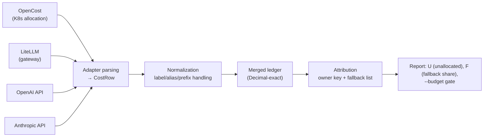

[Paper](https://arxiv.org/abs/2609.24991v1)
## Who pays for the KV cache? — Kubernetes, gateway, and provider bills in one ledger

> **TL;DR** — The cost of a single AI feature is scattered across **three disconnected ledgers**: Kubernetes allocations, gateway logs, and provider per-token bills. The authors build `unalloc`, an open-source tool that merges these three ledgers into a single Decimal-exact ledger, and ask "how much spend belongs to no one at all (unowned spend)?" The conclusion is sobering: within the same inference server, **a given tenant's billing share varies by up to 13.7 pp** depending on **which meter (tokens vs. time vs. KV memory)** you use, and if you attach labels only to the leader pod, **66% of monthly GPU cost is left without an owner** (source: §4, §6, §9).

---

## Key idea

AI cost management already has tools. OpenCost prices Kubernetes workloads, and FOCUS standardizes provider-specific billing records (source: §1, §10). But the place that actually hurts is **the seam between these systems**.

- The same dollar enters the ledger through two or more paths → **double counting**
- Ownership metadata is attached only at the **template** level, not the workload level → missing labels in distributed serving
- If a billing API read silently stops midway → **it just looks like a "cheap month"** (source: §1, §7)

The paper's central claim is stated as follows. **"By parsing costs from multiple sources into a single standard row (`CostRow`), deterministically normalizing labels, and grouping by ownership key to build a lightweight ledger, the authors claim they can quantify and reproducibly measure the attribution failures at the seams that existing tools fail to see."**

The novel contributions branch into three (source: §1 Contributions).

1. **Implementation contribution** — an open-source tool that merges OpenCost, LiteLLM, OpenAI, and Anthropic into a single ledger. Exact monetary handling (Decimal), deterministic label normalization, invoice reconciliation, fallback-aware reporting, and a CI budget gate.
2. **Empirical contribution** — **end-to-end measurement** of attribution failures arising at the seams: label propagation in multi-pod serving, fallback misattribution, double counting, and truncated billing reads (source: §6, §7).
3. **Meter comparison contribution** — cross-validating the pricing rules of a shared inference server (tokens / list-price tokens / compute time / KV memory) across simulation, CPU PyTorch, and vLLM on H100, and contrasting them with a Shapley reference point for request energy (JouleShare) (source: §4, §5, §9, §10).

This is not a typical "model architecture" paper. It belongs to the **systems/FinOps** area, and the question is not "how fast can you run the model" but **"who gets charged for that cost, and how"**.

---

## Background: the problem they solved

Producing a single RAG-based answer passes through a vector DB and an embedding job (Kubernetes), a self-hosted open-weight model (GPU pool), and a frontier model (behind an API gateway) (source: §1). The cost falls scattered across **systems that were never designed to agree with one another**.

The starting point of FinOps allocation practice is the question "how much of this month's spend **belongs to no one**" (source: §1, §14 ref). But to compute this share you need to:

- Normalize differing per-source schemas **into a single row unit**,
- Recognize that **different label spellings** such as `label_costCenter`, `team_id`, and `team:platform` **denote the same team**, and
- Account for the fact that a shared inference server shifts cost between tenants through **batching, paged KV, prefix caching, and tensor/pipeline parallelism** (source: §1, §2).

Each mechanism moves cost between tenants, but leaves a trace in the ledger—or fails to. The paper answers four questions (source: §1).

1. **Metering**: How much does the choice of meter (tokens, list-price tokens, compute time, KV memory) change per-tenant billing? (§4, §5, §9)
2. **Distribution**: When one model replica spans multiple pods, what happens to attribution? (§6)
3. **Joining**: What goes wrong when you merge gateway and provider ledgers? (§7)
4. **Use**: What can the merged ledger do beyond percentages? (§8)

---

## The new approach: `unalloc`

The design of `unalloc` is intentionally small (source: §2). Every source is parsed into a single `CostRow` type, labels go through canonicalization, and attribution groups the merged ledger by the chosen ownership key.

**There is one core formula.** Given an ownership key $d$ and a fallback list $f_1,\dots,f_k$, each row is attributed to the **first non-empty value** among $d, f_1, \dots, f_k$, and becomes `<unallocated>` if none exists. The unallocated ratio $U$ is (source: §2.1):

$$
U(R, d) = \frac{\sum_{r \in R,\ \mathrm{owner}(r)=\bot} \mathrm{amount}(r)}{\sum_{r \in R} \mathrm{amount}(r)}
$$

Here $\mathrm{owner}(r)=\bot$ means "no owner." The key insight of this design is that **fallbacks make the headline number smaller but not more accurate**. So `unalloc` separately reports the spend $F$ attributed only through fallback keys. §6 shows why this $F$ matters.

**Normalization rules** (source: §2.2) handle the messy reality:

- Lowercase keys, split camelCase
- Keep only the last segment of path-style keys (`app.kubernetes.io/name` → `name`)
- Strip known provider prefixes until none remain
- Merge `team_id`, `owner`, and `squad` into a single dimension via an alias table

When different raw keys collapse to the same canonical key, a fixed priority decides. Interestingly, before the study the tool kept the "first key to arrive," so a defect was revealed: **results depended on provider serialization order** (source: §2.2, App. A), which was later fixed deterministically.

---

## How it works: a walkthrough with concrete examples

### Change the meter, change who pays

Suppose one pod serves four tenants: **search** (RAG), **agents** (multi-turn dialogue), **platform**, and **sandbox**. On a shared server, "each tenant's share" is not self-evident. The authors split the same workload by **four meters** (source: §4, Fig.1).

- **Token meter**: split by the number of tokens sent/received by each tenant.
- **List-price meter**: weight cached input by 0.1× and output by 4×.
- **Step-time meter**: split each step's time among the sequences present in that step.
- **KV memory meter**: split each KV block-second among the requests holding that block.

The key point is that **these meters measure different scarce resources**. The token meter has no notion of "idle overhead" at all. With continuous batching running, any request is always in-flight, so **the step-time meter cannot see overhead**. Conversely, the KV memory meter **leaves 83% of the bill as "no request"** — because the pool is provisioned for peak (source: §4.2, Fig.1).

In concrete numbers: the raw token meter charges search 16.7% of the pod and the step-time meter charges 10.5% — **a 6.2 pp difference**. Once overhead is redistributed, the gap with the KV memory meter widens to **12.0 pp**. List-price weighting doesn't help much either: it moves agents from 72.4% to 59.4%, which **deviates by 12 pp** from the measured step time of 71.2% (source: §4.2).

### CPU measurement: token count and compute time diverge by 33 pp

The authors implement a 3.28M-parameter decoder (4 layers, $d=256$, RoPE) from scratch and serve a 96-request trace three times with a **real KV cache** (source: §5.1). Basic KV cache behavior is confirmed too: at a 1,024-token context the cache is 8.0 MiB, and a decode step takes **0.85 ms** instead of 30.9 ms for a full recompute — **36.5× faster** (source: §5.2, Fig.3).

More important from an attribution standpoint is Fig.4. search sent 18,024 prompt tokens and received only 701, while agents sent 2,345 and received 4,017. The token-based approach (and the analytical FLOPs that track tokens) charges search **about 45%** of the pool. Measured compute charges search only **12.4%**. Prefill is batched and cheap, while decode is sequential and expensive (source: §5.2).

This 33.0 pp gap corresponds to `$5,703 / $17,280` per month. The measured cost per token differs by **9.2×** between search and agents, yet a fixed token price charges both identically. Applying a 4× output weight only halves the gap to 17.8 pp; it does not close it (source: §5.2).

### Distributed serving: labels leak from the template

Splitting the model in Megatron style into tensor parallelism (TP2/TP4) and a 2-stage pipeline parallelism still yields identical tokens (maximum logit difference $3.3\times10^{-6}$) (source: §6.1). Per-rank parameters drop from 13.65 MB → 7.36 MB (TP2) → 4.21 MB (TP4).

The problem is the **label**. In a LeaderWorkerSet deployment, when the leader template and worker template are specified separately, the common mistake is to attach the ownership label only to the leader (source: §6.2). Three states are compared with a month's synthetic OpenCost allocation (`$38,400`) (source: Fig.6):

| State | Unallocated | Notes |
|---|---|---|
| S1: label only on leader template | **65.9%** | Most of the GPU bill has no owner |
| S2: fallback to `name` | **4.4%** | But `$23,597` (61%) is misattributed to `vllm` (the Helm chart name) |
| S3: label worker template too | 95.6% accurate | Only idle remains |

The decisive insight: **the headline ratio (4.4% vs 95.6%) cannot distinguish S2 from S3.** That is why the fallback-attributed amount $F$ is needed — `$23,597` for S2 and `$0` for S3. Here the trap is also exposed that `app.kubernetes.io/name` (= `vllm`) and `leaderworkerset.sigs.k8s.io/name` **collide** on the canonical key `name` (source: §6.2).

### Joining: the same dollar comes in twice

An end-to-end scenario merging gateway (LiteLLM) + provider (OpenAI/Anthropic) ledgers (source: §7, Table 2):

| Scenario | Ledger total | Unallocated |
|---|---:|---:|
| A. Cluster + gateway | `$41,420` | 66.9% |
| B. All sources enabled | `$57,813` | 76.3% |
| C. Provider bills only | `$16,393` | 100.0% |
| C′. Provider + project fallback | `$16,393` | 0.0% |

Three failures stand out (source: §7):

1. **Double counting**: enabling all sources adds `$16,393`, of which `$11,815` **exactly overlaps** gateway spend and is counted twice.
2. **Under-reporting**: the gateway ledger covers only 72.1% of the provider invoice. The gateway-only view misses `$4,578`, and without reconciliation you cannot even know it.
3. **Fallback illusion**: provider bills alone have no team dimension, so unallocated is 100%, but falling back to project/workspace makes it 0% — while nothing at all is attributed to teams.

And a critical bug: the adapter did not follow pagination, so it **was reading only 25% of OpenAI spend and 24% of Anthropic's** (source: §7, App. A).

---

## Validation: key results

### The meter gap does not disappear with vLLM on H100

The question left by simulation and CPU measurement is whether these results **survive on real serving software + real hardware**. The authors serve Qwen2.5-7B-Instruct with vLLM 0.29.0 in bf16 at an 8,192-token context on a DigitalOcean GPU Droplet (H100 80GB, driver 580.173.02, CUDA 13.0) (source: §9.1). The KV cache vLLM grabbed holds 995,296 tokens' worth.

| Configured load (req/s) | Completed throughput (req/s) | Output tokens/s | TTFT p50/p95 (ms) | TPOT p50 (ms) | GPU utilization | Power (W) | search token share | search time share |
|---:|---:|---:|---:|---:|---:|---:|---:|---:|
| 2 | 3.7 | 773 | 28 / 44 | 6.3 | 97% | 469 | 16.5% | 4.8% |
| 4 | 7.1 | 1,479 | 26 / 43 | 6.7 | 99% | 499 | 16.6% | 4.7% |
| 8 | 13.4 | 2,761 | 29 / 47 | 7.4 | 99% | 547 | 17.2% | 4.7% |
| 16 | 26.9 | 5,389 | 51 / 99 | 12.2 | 99% | 660 | 18.9% | 5.3% |

(source: §9.2, Table 3. TTFT = time to first token, TPOT = time per output token.)

Key conclusions (source: §9.2):

- **The meters still diverge.** The token meter charges search 16.5–18.9% and the time-share meter 4.7–5.3% — **an 11.7–13.7 pp gap at every load**. Smaller than the 33 pp gap from CPU measurement, but the same direction.
- **GPU utilization is not a cost signal.** nvidia-smi reported 97% at 2 req/s and 99% above that, yet throughput rose **7×**. KV cache occupancy was only 0.7–8.1% (source: §9.2). The overhead result from §4 is reproduced in the real system.
- **The simulator was overly pessimistic.** Below saturation the throughput matched (737 vs 773 output tokens/s), but the step-latency constant made it saturate at 8 req/s. The H100 served 16 req/s (26.9 completed req/s) at a p95 of 99 ms (source: §9.2).

As the authors themselves stress, even the time-share meter is a heuristic — it charges a request waiting for prefill the same as one that is decoding. The Shapley reference point (the JouleShare approach) requires replaying **15 non-empty coalitions** per load level for four tenants, and moving to a split of a fixed rental bill still requires an overhead allocation policy (source: §9.2, §10).

### The ledger's practical value

Beyond quantitative metrics, the use cases are compelling too (source: §8):

- **Labeling is a Pareto problem**: sorting the backlog by dollars, just **3** label changes can bring unallocated down from 66.9% → 1.9%.
- **Feature-level economics needs two ledgers**: a RAG answer feature costs `$22.32` per 1,000 requests including the vector DB, but counting only the LLM bill gives `$13.38` — **40% of the feature cost is invisible from the gateway-only view**.
- **Self-hosting vs. buying depends on utilization**: in the simulated traffic, a self-hosted GPU becomes cheaper than the mid-tier API above about 0.23 req/s and cheaper than the small tier above about 1.7 req/s.
- **Budgets belong in CI**: `unalloc report --budget 50` exits 2 at 73.5% unallocated, while `--budget 80` exits 0 — deploying an unlabeled workload can fail the review.

---

## Our take: strengths, limitations, and why this work matters

### Strengths

1. **Honest problem definition.** It does not claim a "correct share." It focuses on measuring **how much** several defensible meters diverge (source: §11). That is a rare academic restraint in an ambiguous domain.
2. **An unusual level of reproducibility.** Raw data, GPU boot/teardown captures, and one-command regeneration (`make research`, etc.) are all archived with a doi (source: §12). And it **publishes the flaws found in its own tool as a separate appendix**, attaching a regression test to each (source: App. A).
3. **A hierarchy of measurement.** Cross-validating simulation → CPU measurement → H100 measurement explicitly distinguishes which conclusions are hardware-dependent. The finding that the gap is 33 pp on CPU and ~12 pp on GPU — "the magnitude is hardware-bound, the direction is preserved" — is especially valuable (source: §5, §9).

### Limitations

The limitations the authors themselves acknowledge are clear (source: §11):

- **No allocation is ground truth.** The meters measure "how much they differ," but do not answer "which share is correct."
- **Single observation.** The GPU experiment is one GPU, one model, one 2-minute run per load level, on synthetic traffic. The 10-second window analysis is "a descriptive statistic of within-run variation, not an uncertainty estimate," and run-to-run variance was not measured (source: §9.2, §11).
- **Round prices.** It uses `$3.00` per hour for the H100 and example figures for API prices. The authors defend that "shares do not depend on absolute rates," but every absolute dollar figure rests on assumptions (source: §3, §11).
- **No comparison group.** §5/§9 are not controlled comparisons but are reported as "the difference between two experiments" across different models, software, and hardware. This is honest, but it means no causal claim can be made.

Potential limitations are also worth noting. `CostRow` is a small custom schema that openly acknowledges its non-compliance with FOCUS, so field mapping to the FOCUS standard ledger must come first for production adoption (source: §2.1, §10). Also, the correct answer for improving attribution accuracy is ultimately Shapley-style combinatorial measurement, which pays an **exponential replay cost** in the number of tenants (source: §9.2). Who bears this cost before scaling up remains open.

### Why this work matters

Most LLM systems papers focus on "faster." This paper squarely addresses **"who pays"** — the question that erupts the moment cost drives real organizational decisions. The fact that **a given tenant's monthly bill diverges by double-digit percentage points** depending on whether an organization uses a token meter or a time meter shows that the choice of meter is not a mere accounting detail but **product, pricing, and incentive design**. By quantifying where the cache hides cost, from which template labels leak, and through which path the same dollar enters twice, this work is rare empirical evidence for a problem FinOps practitioners already live with but no one has been able to pin down numerically.

---

## What's next?: the road ahead

The authors leave two explicit follow-up tasks (source: §9.2, §11):

1. **A repeated-run campaign.** `bench.py --repeats n` can already run each load level n times with varying seeds and report run-to-run variance. The current public dataset is n=1, so promoting the "12–14 pp gap" to **an estimate with a known standard error** is the logical next step.
2. **Calibrating the simulator constants.** Fitting the analytical step-latency constants from §4 to this H100 run to make the simulation's latency a calibrated value.

There are also directions to go further in light of the limitations:

- **Empirically grounding the Shapley reference point.** With four tenants, replaying 15 coalitions per load level can produce a measured Shapley reference for request energy (source: §9.2). Benchmarking the token, time, and KV meters against a "measured fair standard" can move beyond the current "direction only" conclusion.
- **A CPU/GPU controlled experiment on the same model and workload.** To confirm causally whether the gap of 33 pp on CPU and ~12 pp on GPU is really due to amortizing batching's fixed overhead, the same model must be run on both (source: §9.2).
- **FOCUS compliance mapping.** Performing a `CostRow` ↔ FOCUS field mapping for practical adoption would let this tool plug directly into a company's standard ledger pipeline (source: §10).

In the end, the question this paper raises is simple. **In a world where the KV cache hides cost, labels leak from templates, and the same dollar is counted twice, do we know who actually pays?** `unalloc` is the first step toward pulling that answer together into a single ledger.
