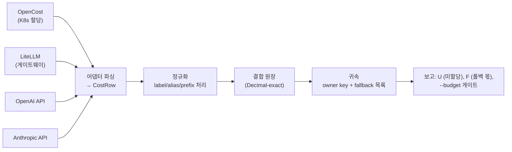

[논문 링크](https://arxiv.org/abs/2609.24991v1)
## KV 캐시 비용은 누가 내는가? — 쿠버네티스·게이트웨이·프로바이더 청구서를 하나의 장부로

> **TL;DR** — 같은 AI 기능 한 건에 드는 비용은 쿠버네티스 할당, 게이트웨이 로그, 프로바이더의 토큰 단위 청구서라는 **서로 연결되지 않은 세 장부**에 흩어져 있다. 저자는 이 세 장부를 하나의 Decimal-정확 원장(ledger)으로 합치는 오픈소스 도구 `unalloc`을 만들고, "도대체 누구 것도 아닌 지출(unowned spend)이 얼마인가"를 묻는다. 결론은 냉정하다: 같은 인퍼런스 서버 안에서 **어떤 미터(토큰 vs 시간 vs KV 메모리)를 쓰느냐에 따라 특정 테넌트의 청구 몫이 최대 13.7%p**나 갈리고, 라벨을 리더 파드에만 붙이면 **월 GPU 비용의 66%가 주인 없이 남는다**(근거: §4, §6, §9).

---

## 핵심 아이디어

AI 비용 관리는 이미 도구가 있다. OpenCost는 쿠버네티스 워크로드에 가격을 매기고, FOCUS는 프로바이더별 청구 기록을 표준화한다(근거: §1, §10). 그런데 실제로 아픈 곳은 **이 시스템들 사이의 이음새(seam)**다.

- 같은 1달러가 두 개 이상의 경로로 장부에 들어온다 → **이중 계상(double counting)**
- 소유권 메타데이터가 워크로드 단위가 아니라 **템플릿 단위**로만 붙는다 → 분산 서빙에서 라벨 누락
- 청구 API 읽기가 조용히 중간에 멈추면 → **그냥 "싼 달"로 보인다**(근거: §1, §7)

이 논문의 중심 주장은 이렇게 정리된다. **"저자들은 여러 소스의 비용을 하나의 표준 행(`CostRow`)으로 파싱하고, 라벨을 결정적으로 정규화한 뒤 소유권 키로 그룹핑하는 경량 원장을 만듦으로써, 기존 도구가 보지 못한 이음새의 귀속 실패를 정량화하고 재현 가능하게 측정할 수 있다고 주장한다."**

독창적인 기여는 세 갈래다(근거: §1 Contributions).

1. **구현 기여** — OpenCost·LiteLLM·OpenAI·Anthropic을 한 원장으로 합치는 오픈소스 도구. 정확한 금액 처리(Decimal), 결정적 라벨 정규화, 인보이스 대사(reconciliation), 폴백(fallback) 인식 보고, CI 예산 게이트.
2. **실증 기여** — 이음새에서 발생하는 귀속 실패를 **end-to-end로 측정**: 다중 파드 서빙의 라벨 전파, 폴백 오귀속, 이중 계상, 잘린 청구 읽기(근거: §6, §7).
3. **미터 비교 기여** — 공유 인퍼런스 서버의 요금 규칙(토큰/정가 토큰/컴퓨트 시간/KV 메모리)을 시뮬레이션·CPU PyTorch·H100 위 vLLM으로 교차 검증하고, 요청 에너지의 Shapley 기준점(JouleShare)과 대비(근거: §4, §5, §9, §10).

이 논문은 전형적인 "모델 아키텍처" 논문이 아니다. **시스템/FinOps** 영역에 속하며, 문제는 "모델을 얼마나 빨리 돌리느냐"가 아니라 **"그 비용을 누구한테 어떻게 매기느냐"**다.

---

## 배경: 그들이 해결한 문제

RAG 기반 답변 하나를 만들려면 벡터 DB와 임베딩 잡(쿠버네티스), 자체 호스팅 오픈웨이트 모델(GPU 풀), 프론티어 모델(API 게이트웨이 뒤)을 모두 거친다(근거: §1). 이 비용은 **서로 합의하도록 설계된 적이 없는 시스템들**에 나뉘어 떨어진다.

FinOps 할당 실무의 출발점은 "이번 달 지출 중 **아무에게도 속하지 않는 몫**이 얼마인가"라는 질문이다(근거: §1, §14 ref). 그런데 이 몫을 계산하려면:

- 소스마다 다른 스키마를 **하나의 행 단위로** 정규화해야 하고,
- `label_costCenter`, `team_id`, `team:platform` 같은 **서로 다른 라벨 표기가 같은 팀**임을 알아야 하며,
- 공유 인퍼런스 서버가 **배칭·페이징 KV·프리픽스 캐시·텐서/파이프라인 병렬**로 테넌트 간에 비용을 이동시킨다는 사실을 반영해야 한다(근거: §1, §2).

각 메커니즘은 비용을 테넌트 사이에서 움직이지만, 원장에는 흔적을 남기거나—남기지 못하거나—한다. 이 논문은 네 질문에 답한다(근거: §1).

1. **미터링(Metering)**: 미터(토큰, 정가 토큰, 컴퓨트 시간, KV 메모리) 선택이 테넌트별 청구를 얼마나 바꾸나? (§4, §5, §9)
2. **분산(Distribution)**: 한 모델 복제본이 여러 파드에 걸리면 귀속은 어떻게 되나? (§6)
3. **결합(Joining)**: 게이트웨이와 프로바이더 원장을 합치면 무엇이 틀어지나? (§7)
4. **사용(Use)**: 합친 원장으로 백분율 말고 무엇을 할 수 있나? (§8)

---

## 새로운 접근법: `unalloc`

`unalloc`의 설계는 의도적으로 작다(근거: §2). 모든 소스는 하나의 `CostRow` 타입으로 파싱되고, 라벨은 정규화(canonicalization)를 거친 뒤, 귀속(attribution)은 합쳐진 원장을 선택한 소유권 키로 그룹핑한다.

**핵심 수식은 하나다.** 소유권 키 $d$와 폴백 목록 $f_1,\dots,f_k$가 주어졌을 때, 각 행은 $d, f_1, \dots, f_k$ 중 **첫 번째로 비어 있지 않은 값**에 귀속되고, 아무것도 없으면 `<unallocated>`가 된다. 미할당 비율 $U$는(근거: §2.1):

$$
U(R, d) = \frac{\sum_{r \in R,\ \mathrm{owner}(r)=\bot} \mathrm{amount}(r)}{\sum_{r \in R} \mathrm{amount}(r)}
$$

여기서 $\mathrm{owner}(r)=\bot$은 "주인 없음"을 뜻한다. 이 설계의 핵심 통찰은 **폴백이 헤드라인 숫자를 작게 만들 뿐 더 정확하게 만들지는 않는다**는 점이다. 그래서 `unalloc`은 폴백 키를 통해서만 귀속된 지출 $F$를 따로 보고한다. §6에서 이 $F$가 왜 중요한지 보게 된다.

**정규화 규칙**(근거: §2.2)은 지저분한 현실을 다룬다:

- 키 소문자화, camelCase 분리
- 경로형 키는 마지막 세그먼트만 유지 (`app.kubernetes.io/name` → `name`)
- 알려진 프로바이더 접두사는 남지 않을 때까지 제거
- 별칭 테이블로 `team_id`·`owner`·`squad`를 하나의 차원으로 통합

서로 다른 원시 키가 같은 정규 키로 붕괴하면 고정 우선순위로 결정한다. 흥미롭게도, 연구 전에는 "먼저 도착한 키"를 유지했기 때문에 **결과가 프로바이더 직렬화 순서에 따라 달라졌다**는 결함이 드러났고(근거: §2.2, App. A), 이후 결정적으로 고쳐졌다.

---

## 작동 원리: 구체적인 예시로 살펴보기

### 미터가 바뀌면 누가 돈을 내는지가 바뀐다

한 파드가 네 테넌트를 서빙한다고 하자: **search**(RAG), **agents**(멀티턴 대화), **platform**, **sandbox**. 공유 서버에서 "각 테넌트의 몫"은 자명하지 않다. 저자는 같은 워크로드를 **네 가지 미터**로 나눠본다(근거: §4, Fig.1).

- **토큰 미터**: 테넌트가 보낸/받은 토큰 수로 나눈다.
- **정가(list-price) 미터**: 캐시된 입력은 0.1배, 출력은 4배로 가중치를 준다.
- **스텝 시간 미터**: 각 스텝의 시간을 그 스텝에 있던 시퀀스들로 나눈다.
- **KV 메모리 미터**: 각 KV 블록-초(block-second)를 그 블록을 들고 있던 요청들로 나눈다.

핵심은 **이들이 서로 다른 희소 자원을 잰다는 것**이다. 토큰 미터에는 "유휴 오버헤드"라는 개념이 아예 없다. 연속 배칭(continuous batching)이 돌면 어떤 요청이든 항상 in-flight 상태이므로 **스텝 시간 미터는 오버헤드를 보지 못한다**. 반대로 KV 메모리 미터는 **빌(bill)의 83%를 "요청 없음"으로 남긴다** — 풀이 피크를 대비해 프로비저닝되기 때문이다(근거: §4.2, Fig.1).

구체적인 숫자로 보자. raw 토큰 미터는 search에 파드의 16.7%를 청구하고, 스텝 시간 미터는 10.5%를 청구한다 — **6.2%p 차이**. 오버헤드를 재분배하면 KV 메모리와의 격차는 **12.0%p**까지 벌어진다. 정가 가중치도 별 도움이 안 된다: agents를 72.4%에서 59.4%로 옮기는데, 이는 실측 스텝 시간 71.2%에서 **12%p나 벗어난다**(근거: §4.2).

### CPU 실측: 토큰 수와 컴퓨트 시간이 33%p 갈린다

저자는 3.28M 파라미터(4레이어, $d=256$, RoPE) 디코더를 처음부터 구현해 **실제 KV 캐시**로 96-요청 트레이스를 세 번 서빙한다(근거: §5.1). KV 캐시의 기본 동작도 확인된다: 1,024 토큰 컨텍스트에서 캐시는 8.0 MiB이고, 디코드 스텝은 전체 재계산 30.9 ms 대신 **0.85 ms** — **36.5배 빠르다**(근거: §5.2, Fig.3).

귀속 관점에서 더 중요한 것은 Fig.4다. search는 프롬프트 토큰 18,024개를 보내고 701개만 받았고, agents는 2,345개를 보내고 4,017개를 받았다. 토큰 기반(그리고 토큰을 추적하는 분석적 FLOPs)은 search에 풀의 **약 45%**를 청구한다. 실측 컴퓨트는 search에 **12.4%**만 청구한다. 프리필은 배치되어 저렴하고, 디코드는 순차적이라 비싸기 때문이다(근거: §5.2).

이 33.0%p 격차는 한 달에 `$5,703 / $17,280`에 해당한다. 실측 토큰당 비용은 search와 agents 사이에 **9.2배**나 차이 나는데, 고정 토큰 가격은 둘을 동일하게 청구한다. 출력에 4배 가중치를 줘도 격차는 17.8%p로 절반 줄 뿐 닫히지 않는다(근거: §5.2).

### 분산 서빙: 라벨이 템플릿에서 새어 나간다

모델을 Megatron 스타일로 텐서 병렬(TP2/TP4)과 2단계 파이프라인 병렬로 쪼개도 토큰은 동일하게 나온다(최대 로짓 차이 $3.3\times10^{-6}$)(근거: §6.1). 랭크당 파라미터는 13.65 MB → 7.36 MB(TP2) → 4.21 MB(TP4)로 떨어진다.

문제는 **라벨**이다. LeaderWorkerSet 배포에서 리더 템플릿과 워커 템플릿을 따로 지정할 때, 소유 라벨을 리더에만 붙이는 흔한 실수가 발생한다(근거: §6.2). 한 달치 합성 OpenCost 할당(`$38,400`)으로 세 상태를 비교한다(근거: Fig.6):

| 상태 | 미할당 | 비고 |
|---|---|---|
| S1: 리더 템플릿에만 라벨 | **65.9%** | GPU 빌 대부분이 주인 없음 |
| S2: `name`으로 폴백 | **4.4%** | 그러나 `$23,597`(61%)이 `vllm`(Helm 차트 이름)으로 오귀속 |
| S3: 워커 템플릿도 라벨 | 95.6% 정확 | 유휴만 남음 |

결정적 통찰: **헤드라인 비율(4.4% vs 95.6%)은 S2와 S3를 구분하지 못한다.** 그래서 폴백 귀속액 $F$가 필요하다 — S2는 `$23,597`, S3는 `$0`. 여기서 `app.kubernetes.io/name`(= `vllm`)과 `leaderworkerset.sigs.k8s.io/name`이 정규 키 `name`에서 **충돌**하는 함정도 드러난다(근거: §6.2).

### 결합: 같은 달러가 두 번 들어온다

게이트웨이(LiteLLM) + 프로바이더(OpenAI/Anthropic) 원장을 합치는 end-to-end 시나리오(근거: §7, Table 2):

| 시나리오 | 원장 합계 | 미할당 |
|---|---:|---:|
| A. 클러스터 + 게이트웨이 | `$41,420` | 66.9% |
| B. 모든 소스 활성화 | `$57,813` | 76.3% |
| C. 프로바이더 청구만 | `$16,393` | 100.0% |
| C′. 프로바이더 + 프로젝트 폴백 | `$16,393` | 0.0% |

세 가지 실패가 눈에 띈다(근거: §7):

1. **이중 계상**: 모든 소스를 켜면 `$16,393`이 추가되는데, 그중 `$11,815`가 게이트웨이 지출과 **정확히 겹쳐 두 번 세어진다**.
2. **과소 보고**: 게이트웨이 원장은 프로바이더 인보이스의 72.1%만 커버한다. 게이트웨이-only 시점은 `$4,578`을 놓치고, 대사(reconciliation) 없이는 그걸 알 수조차 없다.
3. **폴백 착시**: 프로바이더 청구만 보면 팀 차원이 없으므로 미할당 100%지만, 프로젝트/워크스페이스로 폴백하면 0%가 된다 — 팀에는 아무것도 귀속되지 않으면서.

그리고 결정적 버그: 어댑터가 페이지네이션을 따르지 않아 **OpenAI 지출의 25%, Anthropic의 24%만 읽고 있었다**(근거: §7, App. A).

---

## 성능 검증: 주요 결과

### H100 위 vLLM에서도 미터 격차는 사라지지 않는다

시뮬레이션과 CPU 실측이 남긴 의문은 "이 결과가 **실제 서빙 소프트웨어 + 실제 하드웨어**에서도 살아남느냐"다. 저자는 DigitalOcean GPU Droplet(H100 80GB, 드라이버 580.173.02, CUDA 13.0)에서 vLLM 0.29.0으로 Qwen2.5-7B-Instruct를 bf16, 8,192 토큰 컨텍스트로 서빙했다(근거: §9.1). vLLM이 잡은 KV 캐시는 995,296 토큰 분량.

| 설정 부하(요청/s) | 완료 처리량(요청/s) | 출력 토큰/s | TTFT p50/p95 (ms) | TPOT p50 (ms) | GPU 이용률 | 전력(W) | search 토큰 몫 | search 시간 몫 |
|---:|---:|---:|---:|---:|---:|---:|---:|---:|
| 2 | 3.7 | 773 | 28 / 44 | 6.3 | 97% | 469 | 16.5% | 4.8% |
| 4 | 7.1 | 1,479 | 26 / 43 | 6.7 | 99% | 499 | 16.6% | 4.7% |
| 8 | 13.4 | 2,761 | 29 / 47 | 7.4 | 99% | 547 | 17.2% | 4.7% |
| 16 | 26.9 | 5,389 | 51 / 99 | 12.2 | 99% | 660 | 18.9% | 5.3% |

(근거: §9.2, Table 3. TTFT = time to first token, TPOT = time per output token.)

핵심 결론(근거: §9.2):

- **미터는 여전히 갈린다.** 토큰 미터는 search에 16.5–18.9%, 시간 공유(time-share) 미터는 4.7–5.3%를 청구한다 — **모든 부하에서 11.7–13.7%p 격차**. CPU 실측의 33%p 격차보다는 작지만 방향은 같다.
- **GPU 이용률은 비용 신호가 아니다.** nvidia-smi는 2 요청/s에서 97%, 그 이상에서 99%를 보고했지만 처리량은 **7배** 올랐다. KV 캐시 점유는 0.7–8.1%에 불과했다(근거: §9.2). §4의 오버헤드 결과가 실물로 재현된 셈이다.
- **시뮬레이터는 지나치게 비관적이었다.** 포화 이하에서는 처리량이 맞았지만(737 vs 773 출력 토큰/s), 스텝 지연 상수 때문에 8 요청/s에서 포화해버렸다. H100은 16 요청/s(26.9 완료 요청/s)를 p95 99 ms로 서빙했다(근거: §9.2).

저자 스스로가 강조하듯, 시간 공유 미터조차 휴리스틱이다 — 프리필을 기다리는 요청과 디코딩 중인 요청을 똑같이 청구한다. Shapley 기준점(JouleShare 방식)은 4개 테넌트면 부하 레벨당 **15개의 비어 있지 않은 연합(coalition)** 재생이 필요하며, 고정 렌탈 빌의 분할로 옮기려면 여전히 오버헤드 할당 정책이 필요하다(근거: §9.2, §10).

### 원장의 실전 가치

정량 지표 외의 사용 사례도 설득력 있다(근거: §8):

- **라벨링은 파레토 문제**: 달러 순으로 백로그를 정렬하면 라벨 변경 **3건**만으로 미할당을 66.9% → 1.9%로 낮출 수 있다.
- **기능 단위 경제성은 두 원장이 필요**: RAG 답변 기능은 벡터 DB를 포함해 1,000 요청당 `$22.32`인데, LLM 빌만 세면 `$13.38`이다 — **기능 비용의 40%가 게이트웨이-only 시점에서 보이지 않는다**.
- **자체 호스팅 vs 구매는 이용률에 달림**: 시뮬레이션 트래픽에서 자체 GPU는 중간 등급 API보다 약 0.23 요청/s 이상에서, 소형 등급보다 약 1.7 요청/s 이상에서 저렴해진다.
- **예산은 CI에 속한다**: `unalloc report --budget 50`은 미할당 73.5%에서 exit 2, `--budget 80`은 exit 0 — 미라벨 워크로드를 배포하면 리뷰를 실패시킬 수 있다.

---

## 우리의 관점: 강점, 한계, 그리고 이 연구가 중요한 이유

### 강점

1. **정직한 문제 정의.** "정답인 몫"을 주장하지 않는다. 여러 방어 가능한 미터를 놓고 **얼마나 갈리는지**를 측정하는 데 집중한다(근거: §11). 이는 애매한 도메인에서 드문 학문적 절제다.
2. **재현성의 수준이 이례적이다.** 원시 데이터, GPU 부팅/해체 캡처, 원커맨드 재생성(`make research` 등)이 모두 doi로 아카이빙됐다(근거: §12). 그리고 **자신의 도구에서 발견된 결함을 별도 부록으로 공개**하고 각각 회귀 테스트를 붙였다(근거: App. A).
3. **측정의 계층 구조.** 시뮬레이션 → CPU 실측 → H100 실측으로 교차 검증해, 어느 결론이 하드웨어 의존적인지 명시적으로 구분한다. CPU에서 33%p, GPU에서 ~12%p라는 "크기는 하드웨어에, 방향은 보존"이라는 결론이 특히 값지다(근거: §5, §9).

### 한계

저자가 스스로 인정하는 한계는 분명하다(근거: §11):

- **어떤 할당도 ground truth가 아니다.** 미터들이 "얼마나 다른가"를 쟀을 뿐, "어느 몫이 옳은가"는 답하지 않는다.
- **단일 관측.** GPU 실험은 GPU 1대, 모델 1개, 부하 레벨당 2분 런 1회, 합성 트래픽이다. 10초 윈도우 분석은 "불확실성 추정이 아니라 한 런 내 변동의 기술통계"이며, 런 간 분산은 측정하지 않았다(근거: §9.2, §11).
- **가격이 원형(round)이다.** H100을 시간당 `$3.00`로, API 가격을 예시 수치로 쓴다. 저자는 "몫(share)은 절대 요율에 의존하지 않는다"고 방어하지만, 절대 금액 표기는 전부 가정 위에 있다(근거: §3, §11).
- **비교군 없음.** §5/§9는 통제된 비교가 아니라 서로 다른 모델·소프트웨어·하드웨어 간 "두 실험의 차이"로 보고된다. 이건 정직하지만, 인과를 주장하지 못한다는 뜻이다.

잠재적 한계도 짚어볼 만하다. `CostRow`는 FOCUS 비준수를 스스로 인정하는 작은 자체 스키마라서, 실무 도입 시 FOCUS 표준 원장과의 필드 매핑이 선행돼야 한다(근거: §2.1, §10). 또, 귀속의 정확성을 높이는 정답은 결국 Shapley류의 조합 측정인데, 이는 테넌트 수에 대해 **지수적 재생 비용**을 지불한다(근거: §9.2). 스케일업 전에 이 비용을 누가 감당할지는 열려 있다.

### 이 연구가 중요한 이유

대부분의 LLM 시스템 논문은 "더 빠르게"에 집중한다. 이 논문은 **"누가 내는가"**라는, 비용이 실제 조직 의사결정을 움직이는 순간에 터지는 질문을 정면으로 다룬다. 한 조직이 토큰 미터를 쓰는지 시간 미터를 쓰는지에 따라 **특정 테넌트의 월 청구가 두 자릿수 퍼센트포인트 단위로 갈린다**는 사실은, 미터 선택이 단순한 회계 세부사항이 아니라 **제품·가격·인센티브 설계**라는 점을 보여준다. 캐시가 비용을 어디로 숨기는지, 라벨이 어느 템플릿에서 새는지, 같은 달러가 어느 경로에서 두 번 들어오는지를 정량화한 이 작업은 FinOps 실무자가 이미 겪고 있지만 아무도 숫자로 못 박지 못한 문제에 대한 드문 경험적 근거다.

---

## 다음 단계는?: 앞으로의 길

저자가 남긴 명시적 후속 과제는 두 가지다(근거: §9.2, §11):

1. **반복 런 캠페인.** `bench.py --repeats n`이 이미 각 부하 레벨을 씨앗을 바꿔 n번 돌리며 런 간 분산을 보고할 수 있게 됐다. 현재 공개 데이터셋은 n=1이므로, "12–14%p 격차"를 **알려진 표준오차를 가진 추정치**로 승격시키는 것이 논리적 다음 단계다.
2. **시뮬레이터 상수 보정.** §4의 분석적 스텝 지연 상수를 이 H100 런에 피팅해, 시뮬레이션의 지연(latency)을 보정된 값으로 만드는 것.

한계에 비추어 더 나아갈 방향도 있다:

- **Shapley 기준점의 실증.** 4개 테넌트면 부하 레벨당 15개 연합의 재생으로 요청 에너지의 측정된 Shapley 참조를 만들 수 있다(근거: §9.2). 토큰·시간·KV 미터를 "측정된 공정 기준"에 대해 벤치마킹하면, 지금의 "방향만 보존" 결론을 넘어설 수 있다.
- **동일 모델·동일 워크로드의 CPU/GPU 대조 실험.** CPU에서 33%p, GPU에서 ~12%p인 격차가 정말 배칭의 고정 오버헤드 분할상각 때문인지 인과를 확인하려면 같은 모델을 양쪽에서 돌려야 한다(근거: §9.2).
- **FOCUS 비준 매핑.** 실무 채택을 위해 `CostRow` ↔ FOCUS 필드 매핑을 수행하면, 이 도구가 기업의 표준 원장 파이프라인에 바로 꽂힐 수 있다(근거: §10).

결국 이 논문이 던지는 질문은 단순하다. **KV 캐시가 비용을 숨기고, 라벨이 템플릿에서 새고, 같은 달러가 두 번 세어지는 세상에서, 우리는 누가 정말 돈을 내는지 알고 있는가?** `unalloc`은 그 답을 한 장부로 끌어모으는 첫 단추다.

