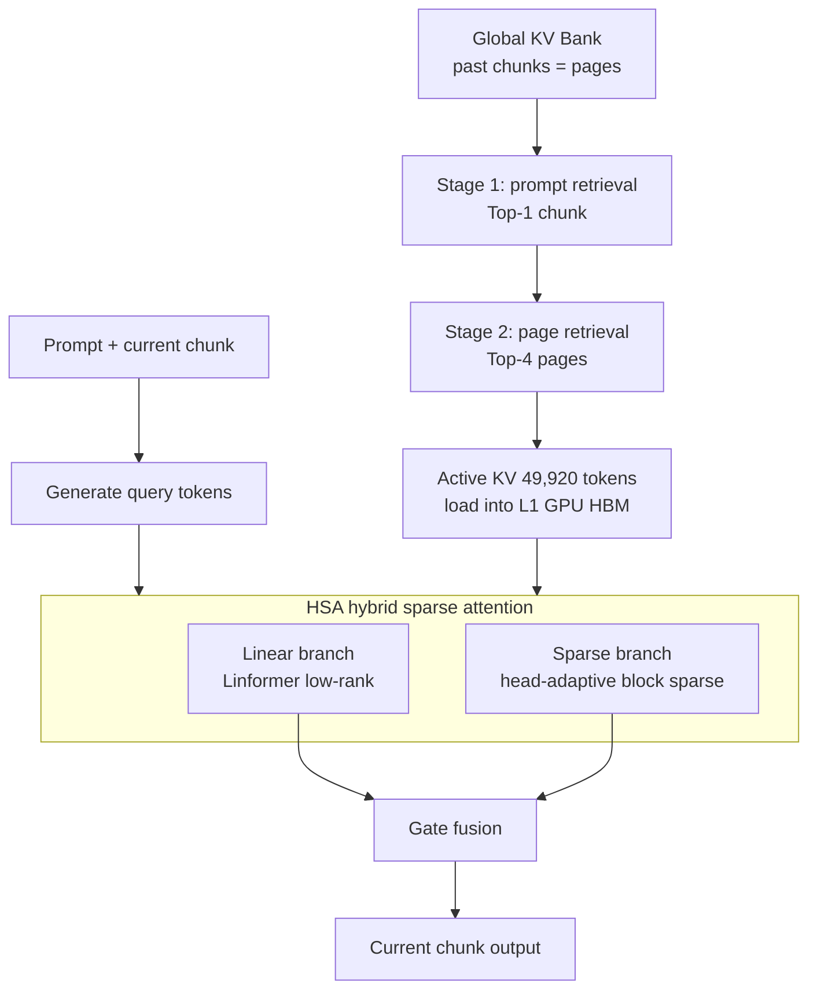

[Paper](https://arxiv.org/abs/2609.34606)
## WorldAttention: System Co-Design of an Interactive Video World Model That Drops the Sliding Window

**TL;DR** — Text-controlled interactive video world models are trapped between the demand to "remember the entire history" and the reality that "the KV cache grows linearly until GPU memory blows up." Researchers at Alibaba DAMO Academy solve this dilemma with an attention architecture called **WorldAttention**. A hierarchical KV cache (HKV) splits memory into pages and distributes them across a multi-tier memory hierarchy, a hybrid sparse attention (HSA) makes the computation linear and sparse, and custom kernels push actual hardware performance to the limit. The results are a VBench-Long subject consistency of **0.9472**, an InterVBench score of **0.9668**, and **22.0 FPS** on a single H100 GPU (source: Abstract, Tab. 1).

## Core Idea

The essential difficulty of interactive long video generation lies in **prompt switching**. When the user says "throw that red ball again" after about 50 seconds, the model must recall detailed visual information from tens of seconds earlier (source: §1 Introduction). For this reason, a plain sliding window is unsuitable because it "discards the past entirely," while keeping the full-history KV instead causes memory to blow up linearly (source: §1 Introduction).

WorldAttention's answer has three prongs (source: Fig. 1):

1. **HKV (Hierarchical KV Cache)** — splits past KV into "pages" of 8 frames and places them across GPU SRAM/HBM → CPU DRAM → NVMe, retrieving only the needed pages via two-stage search.
2. **HSA (Hybrid Sparse Attention)** — combines a linear attention branch and a head-adaptive block sparse branch to reduce quadratic complexity to effectively linear and sparse levels.
3. **Custom kernels** — reorganize retrieved pages into a contiguous buffer to eliminate the hardware waste caused by non-contiguous memory access.

The paper's core insight is that these three elements must mesh organically to deliver real speed. Interestingly, the authors demonstrate head-on through experiments that "kernel optimization alone is not enough" (source: Tab. 9).

## Background: The Problem They Solved

Text-conditioned interactive video world models aim to simulate a temporally consistent environment that responds to user prompts, built on the autoregressive diffusion paradigm (source: Abstract). Enabling low-latency, long-horizon generation here is key to embodied AI and simulation-based planning, but existing frameworks were trapped in a trade-off between two broad directions (source: §1 Introduction).

**Sliding-window KV cache** (MAGI-1, Self Forcing, LongLive, SkyReels-V2, CausVid, etc.) saves GPU memory by keeping only recent tokens, but it **permanently discards** visual context from tens of seconds earlier (source: §2 Related Work). When the user refers to an earlier scene, the required visual details are already gone.

**Sparse-retrieval KV cache** (BIFE) preserves the entire history to support recall, but the KV cache grows linearly with video length and soon exceeds GPU memory capacity (source: §2 Related Work). Moreover, BIFE's retrieval unit is the chunk level, so even when only some tokens are actually relevant, the whole chunk is loaded (source: §3.1 HKV).

In other words, the gap the paper attacks is the absence of an **attention architecture that satisfies both "full-history memory" and "efficient management."** The authors fill it with a system co-design along two axes: "attention redesign + hierarchical caching mechanism" (source: §1 Introduction).

## New Approach: WorldAttention

WorldAttention is built on the Wan2.1-T2V-1.3B backbone and generates 5-second clips at 16 FPS and 480p (832×480) resolution (source: §4.2 Implementation). Let us take the core design apart piece by piece.

### HKV: Page-Level Multi-Tier Memory

HKV refines the existing "chunk-level" KV management into finer "page-level" units. Each page holds **8 consecutive frames**, and one frame is **1,560 tokens** (source: §3.1 HKV). Memory is organized into 4 tiers (source: §3.1 HKV):

- **L0 (GPU SRAM)** — on-chip memory where Q·K·V are computed in FlashAttention style
- **L1 (GPU HBM)** — retrieved KV pages + prompt/page indices
- **L2 (CPU DRAM)** — KV chunks not used in the current chunk generation
- **L3 (NVMe)** — the final backup of all KV chunks

By aligning access frequency with hardware bandwidth, frequently used pages stay on the GPU and less-used chunks are automatically offloaded to the CPU. As a result, no matter how large the total KV grows, GPU (L1) occupancy stays bounded (source: §3.1 HKV, Fig. 2).

Retrieval happens in **two stages** (source: §3.1 HKV):

1. **Prompt stage** — selects the top-1 chunk by cosine similarity between the current prompt embedding and the prompt embeddings of past chunks.
2. **Page stage** — selects the top-$K_p$ pages using the score $\alpha_{m,j} = \frac{\bar{Q}^\top \bar{K}_{m,j}}{\sqrt{d_k}}$ between the current chunk's mean query $\bar{Q}$ and each page's mean key $\bar{K}_{m,j}$ (where $K_p = 4$).

The final active KV is $4 \times 8 \times 1560 = 49{,}920$ tokens. Prompt retrieval narrows the search space, and page retrieval picks out fine-grained context — a complementary structure (source: §4.5 Ablations).

### HSA: Dual Branches of Linear + Sparse

Because spatiotemporal redundancy remains even in retrieved pages, HSA allocates computation more finely across two branches (source: §3.2 HSA).

The **linear branch** uses Linformer-style low-rank projections. For each head $h$, it compresses keys and values with learned projection matrices $\mathbf{E}_K^{(h)}, \mathbf{E}_V^{(h)} \in \mathbb{R}^{L \times r}$:

$$
\widetilde{\mathbf{K}}^{(h)} = (\mathbf{E}_K^{(h)})^\top \mathbf{K}^{(h)}, \quad
\widetilde{\mathbf{V}}^{(h)} = (\mathbf{E}_V^{(h)})^\top \mathbf{V}^{(h)}
$$

This reduces complexity from $\mathcal{O}(L^2 d_k)$ to $\mathcal{O}(L r d_k)$. Since the projection rank $r \ll L$ is fixed, it is linear in $L$ (source: §3.2 HSA). The authors point out that the approach of existing linear attention (SLA, etc.) — "compressing an infinite past into a fixed-size hidden state" — causes **memory superposition and attention dilution**, and argue that Linformer's explicit structural downsampling preserves spatiotemporal physical anchors (source: Appx. Linear Branch).

The **sparse branch** performs block-level sparse computation at the original token resolution. It divides retrieved pages into blocks of size $B$, performs coarse block selection with a pooled attention map, and then runs SDPA with a block-sparse kernel only on the selected blocks (source: §3.2 HSA). The block size is set to a multiple of 16, the MMA/WGMMA compute unit on Hopper. It uses $B_{\text{inter}}=128$ for past pages (inter-chunk) and $B_{\text{intra}}=64$ for current chunk tokens (intra-chunk) (source: §3.2 HSA).

**Head-adaptive sparsity** is the charm of this branch. Instead of a fixed Top-K, each head determines its own sparsity level from the **Gini coefficient** $\mathcal{G}^{(h)}$ of its attention distribution (source: Appx. Sparse Branch):

$$
\tau_h = \tau_{\min} + \mathcal{G}^{(h)} \cdot (\tau_{\max} - \tau_{\min})
$$

For each head, it selects only the minimal set of blocks whose cumulative attention mass exceeds the threshold $\tau_h$. Heads with peaked distributions (focused on local interactions) and uniform heads (broad context) operate with different sparsity, which is finer-grained than layer- or globally fixed sparsity (source: §3.2 HSA, Fig. 3).

The two branches are fused by a per-head multiplicative gate:

$$
\mathbf{O}^{(h)} = \mathbf{O}^{(h)}_{\text{lin}} \odot \mathbf{G}^{(h)}_{\text{lin}} + \mathbf{O}^{(h)}_{\text{sp}} \odot \mathbf{G}^{(h)}_{\text{sp}}
$$

The linear branch ensures global information flow, while the sparse branch handles high-resolution modeling where needed (source: §3.2 HSA).

## How It Works: A Concrete Example

Let us follow the whole process through one of the paper's visualization examples, the "Rio's Christmas street" scene (source: Appx. Visualization). Suppose it is a 60-second video in which a man in a blue shirt throws a red ball, followed by a ribbon and then a flaming torch.

**1. Chunk splitting and KV bank initialization.** The 60-second video is generated as 12 five-second chunks. Each chunk's KV is split into pages $\mathcal{P}_{m,j}$ of 8 frames and stored in the global KV bank $\mathcal{B}$ (source: §3.1 HKV).

**2. A prompt switch occurs.** In the 50–60 second segment, the user requests "that man throws the red ball again." The model must recall the red ball scene from the 10–20 second segment.

**3. Two-stage retrieval.** First, the current prompt embedding is compared with each chunk's prompt embedding to pick the 10–20 second chunk as top-1. Then, within that chunk, the top-4 pages are selected by similarity between the current mean query and each page's mean key. As a result, the active KV becomes $4 \times 8 \times 1560 = 49{,}920$ tokens and is loaded into L1 (GPU HBM) (source: §3.1 HKV).

**4. HSA computation.** These 49,920 tokens enter both branches. Assuming $L = 49{,}920$, $d_k = 128$, and $r = 64$, the linear branch operates at roughly $L r d_k \approx 4.1 \times 10^8$ versus full attention's $QK^\top$ at $L^2 d_k \approx 3.2 \times 10^{11}$ FLOPs — about $L/r \approx 780\times$ less along the dimension axis. The sparse branch filters blocks by a Gini-coefficient-based threshold, actually computing only the high-mass blocks.

**5. Gate fusion and output.** The two branch outputs are mixed by per-head gates to drive denoising of the current chunk. This process repeats for each chunk, keeping the entire 60 seconds consistent.

The overall flow can be summarized in a diagram:

## Performance Validation: Key Results

### Quality: Best on Every Metric on VBench-Long

On the VBench-Long benchmark extended to 60 seconds, WorldAttention set the best score on most metrics with **subject consistency 0.9472, background consistency 0.9691, motion smoothness 0.9915, dynamic degree 0.7758, and image quality 0.7259** (source: Tab. 1). That is **+0.0062** over the previous best, BIFE (subject consistency 0.9410), and a clear improvement over LongLive (0.9403).

Its quality score of 85.53 over the full 60 seconds beats SkyReels-V2 (80.49), Self-Forcing (82.46), BIFE (84.38), and LongLive (83.95) (source: Tab. 2). The per-segment CLIP scores also stay at the top overall, from 0–10 seconds (29.04) to 50–60 seconds (25.01), showing little identity drift even after a prompt switch (source: Tab. 2).

### Quality: Drift Metrics on InterVBench

On InterVBench, a chunk-level long-horizon generation benchmark, WorldAttention recorded the lowest (least drift) VDE subject **0.0792**, VDE background **0.2850**, VDE motion **0.0095**, and VDE clearness **0.7390**, while achieving subject consistency **0.9668**, background consistency **0.9614**, and motion smoothness **0.9972** (source: Appx. InterVBench). This means it shows the least blurring or shaking over time.

### Efficiency: 14.02× Kernel, 22 FPS on a Single GPU

Efficiency is the highlight of this paper. The custom kernel **HSA_tk** (built on ThunderKittens) shows a **14.02×** speedup over FlashAttention-3, and the end-to-end speedup when combined with HKV is **2.21×** (source: Abstract, §4.3 Efficiency). On a single H100, it maintains **22.0 FPS** while reaching a quality score of 86.55, capturing both quality and speed (source: Tab. 3). This surpasses Self-Forcing (17.0 FPS), BIFE (18.0 FPS), and LongLive (20.7 FPS).

Decomposing the end-to-end speedup by stage, it accumulates as **HKV (+1.15×) → HSA (+1.91×) → kernel customization (+2.21×)** (source: Tab. 9). On the B200 GPU as well, it reaches **2.46×** for a 14B model at 720p and 60 seconds, and **2.35×** for the 90-second setting, so the gains grow with longer sequences and larger models (source: Tab. 10).

### Secret Weapon: Why This Combination?

The ablation study that carved out HSA's design space is striking (source: Tab. 4):

| Configuration | Subject consistency | Dynamic degree | Image quality |
|---|---:|---:|---:|
| Linear branch only | 0.9021 | 0.5825 | 0.6490 |
| Sparse only (τ=1.00/0.35) | 0.9365 | 0.6945 | 0.6995 |
| Linear+sparse (τ=0.75/0.35) | 0.9300 | 0.7520 | 0.7015 |
| **Linear+sparse (τ=1.00/0.35)** | **0.9472** | **0.7758** | **0.7259** |

The two branches are complementary. The linear branch is strong on subject and background consistency but weak on motion dynamics and visual quality, while the sparse branch is the opposite. Combined, every metric rises (source: §4.5 Ablations). In an analysis comparing the linear branch with SLA, SANA-Video, and full attention, the Linformer approach restored the long-range mass distribution of full attention most faithfully and also had the highest output cosine similarity (source: Fig. 4).

The HKV retrieval design is validated as well. Under the same 4-page budget, HKV (85.53) overwhelms recent-page retrieval (83.74), random retrieval (82.86), and mismatched retrieval (80.96), and the gap widens especially in the 50–60 second CLIP score, at 25.01 vs 21.48/20.12/17.36 (source: Tab. 7). It also shows robustness: even when three semantically similar chunks are mixed in, quality barely drops from 85.53 to 85.18 (source: Tab. 8).

## Our Take: Strengths, Limitations, and Why This Work Matters

### Strengths

The biggest contribution is that it **proves with data that "algorithm-hardware co-design is essential."** Decomposing HSA execution time, the sparse attention kernel itself accounts for only **1.86%** of the total, while KV reconstruction and contiguous memory copying take **31.00%** and the linear branch takes **39.78%** (source: Tab. 9). In other words, optimizing only the kernel misses the bottleneck. This is the real insight of a systems paper, directly refuting the conventional wisdom that "the optimal kernel = the best performance."

Second, the **page-level two-stage retrieval** is simple yet effective. Using prompt retrieval to keep retrieval cost independent of sequence length and page retrieval to obtain fine-grained context is a complementary structure (source: §4.5) that is clean from an engineering standpoint.

Third, the **consistency** of the results. The same conclusion emerges across two benchmarks (VBench-Long and InterVBench), two axes (quality and efficiency), two hardware platforms (H100 and B200), and two scales (1.3B and 14B) (source: Tab. 10).

### Limitations

The limitation the authors explicitly acknowledge is that **it uses only text prompts as the control signal**. It cannot handle richer conditional modalities such as action signals, control trajectories, or embodied interaction cues (source: Appx. Limitation).

Several potential limitations are also apparent. First, the setting in which training samples contain **exactly one prompt switch** may underestimate real multi-turn, multi-event interactions (source: §4.2 Implementation). The paper itself admits that "top-1 chunk retrieval may be unsuitable for multi-event prompts" (source: §4.5). Second, hyperparameters such as the page size (8 frames) and $K_p=4$ are fixed, so adapting to content density remains future work. Third, the backbone is small at 1.3B, so whether the gains remain linear on larger DiTs is not fully proven by the single 14B setting alone.

### Why It Matters

This work brings the central problem of LLM serving — **KV cache management** — into the entirely different domain of **video generation**, systematically dismantling the fundamental tension between "full memory" and "bounded memory." At a time when low-latency, long-horizon interactive generation is becoming increasingly important in embodied AI and simulation-based planning, this framework offers a reusable design pattern.

## What's Next?: The Road Ahead

The direction the authors propose is **action-conditioned generation**. Integrating action signals would enable controllable environment simulation and decision-making-based video prediction beyond a plain text-to-video model, allowing it to evolve into a true "video world model" (source: Appx. Limitation).

Adding reasonable next steps on top of this:

- **Support for multi-event, multi-turn switching.** It is natural to relax the top-1 chunk assumption and adaptively allocate the retrieval budget according to prompt complexity.
- **Adaptive page size.** A density-adaptive strategy that splits segments with frequent scene changes into smaller pages and static segments into larger pages.
- **Large-backbone validation.** Verification is needed of how HKV's offload policy and HSA's sparsity gains scale on 7B/14B-class DiTs.
- **Energy- and cost-oriented evaluation.** Quantifying the power and latency cost of the multi-tier memory (especially NVMe round trips) would clarify the real-serving trade-offs.

In the end, the paper's message is clear. The bottleneck of interactive long-horizon generation lies not in any single layer but at the **interface between attention structure, memory management, and hardware execution**, and only when that interface is co-designed does a system emerge that "keeps both the memory and the speed."

<!-- verbatim-tables -->

## Tables from the paper

> Tables converted mechanically from the arXiv e-print LaTeX source. The numbers are the paper's own and did not pass through a model.

**Table 1. **Comparison of different methods on InterVBench.** We report InterVBench results on five VDE metrics and five complementary metrics from VBench .**

| Method | VDE Subject $\downarrow$ | VDE Background $\downarrow$ | VDE Motion $\downarrow$ | VDE Aesthetic $\downarrow$ | VDE Clarity $\downarrow$ |
|---|---|---|---|---|---|
| MAGI-1 | 0.3090 | 0.5000 | 0.0243 | 3.8286 | 2.7225 |
| Self Forcing | 0.3716 | 1.6108 | 0.1549 | 3.4683 | 3.0798 |
| PAVDM | 1.8292 | 0.9323 | 0.0461 | 2.8957 | 1.9503 |
| FramePack | 4.3984 | 5.9421 | 0.0387 | 1.4751 | 4.2513 |
| SkyReels-V2-DF-1.3B | 0.1085 | 0.3179 | 0.0195 | 1.2083 | 0.9365 |
| LongLive | 0.0825 | 0.3016 | 0.0104 | 1.1452 | 0.8529 |
| BIFE | 0.0844 | 0.2945 | 0.0119 | 0.9618 | 0.7551 |
| **WorldAttention (Ours)** | **0.0792** | **0.2850** | **0.0095** | **0.9462** | **0.7390** |
| Method | Subject Consistency $\uparrow$ | Background Consistency $\uparrow$ | Motion Smoothness $\uparrow$ | Aesthetic Quality $\uparrow$ | Image Quality $\uparrow$ |
| MAGI-1 | 0.8992 | 0.9078 | 0.9947 | 0.6508 | 0.6662 |
| Self Forcing | 0.8481 | 0.8203 | 0.9947 | 0.6283 | 0.6805 |
| PAVDM | 0.8640 | 0.8924 | 0.9926 | 0.5267 | 0.6567 |
| FramePack | 0.9001 | 0.8791 | 0.9949 | 0.6043 | **0.6972** |
| SkyReels-V2-DF-1.3B | 0.9418 | 0.9579 | 0.9931 | 0.6035 | 0.6835 |
| LongLive | 0.9610 | 0.9552 | 0.9968 | **0.6595** | 0.6960 |
| BIFE | 0.9597 | 0.9588 | 0.9956 | 0.6047 | 0.6852 |
| **WorldAttention (Ours)** | **0.9668** | **0.9614** | **0.9972** | 0.6397 | 0.6965 |

**Table 2. **Comparison of different methods on VBench-Long .** We extended VBench-Long to 60 seconds following LongLive .**

| Method | Subject Consistency $\uparrow$ | Background Consistency $\uparrow$ | Motion Smoothness $\uparrow$ | Dynamic Degree $\uparrow$ | Aesthetic Quality $\uparrow$ | Image Quality $\uparrow$ |
|---|---|---|---|---|---|---|
| MAGI-1 | 0.8320 | 0.8931 | 0.9740 | 0.5537 | 0.5010 | 0.6120 |
| Self Forcing | 0.8211 | 0.9050 | 0.9799 | 0.6015 | 0.5130 | 0.6218 |
| PAVDM | 0.8415 | 0.9273 | 0.9769 | 0.6537 | 0.4970 | 0.6280 |
| FramePack | 0.9019 | 0.9450 | 0.9805 | 0.5715 | 0.5044 | 0.6381 |
| NOVA | 0.7750 | 0.8806 | 0.9894 | 0.1200 | 0.4753 | 0.4497 |
| CausVid | 0.8675 | 0.8985 | 0.9847 | 0.5200 | 0.6288 | 0.6747 |
| Self-Forcing++ | 0.9165 | 0.9092 | 0.9803 | 0.5865 | 0.5482 | 0.6453 |
| Deep Forcing | 0.9285 | 0.9136 | 0.9819 | 0.7035 | 0.6041 | 0.6455 |
| StreamDiffusionV2 | 0.9036 | 0.9051 | 0.9745 | 0.4552 | 0.5547 | 0.5528 |
| SkyReels-V2-DF-1.3B | 0.9391 | 0.9580 | 0.9838 | 0.6529 | 0.5320 | 0.6315 |
| LCT (MMDiT-3B) | 0.9380 | 0.9623 | 0.9816 | 0.6875 | 0.5200 | 0.6345 |
| MoC | 0.9398 | 0.9670 | 0.9851 | 0.7500 | 0.5547 | 0.6396 |
| Infinity-RoPE | 0.9352 | 0.9395 | 0.9710 | 0.5395 | 0.6045 | 0.6475 |
| BIFE | 0.9410 | 0.9650 | 0.9870 | 0.7720 | 0.5839 | 0.6527 |
| LongLive | 0.9403 | 0.9495 | 0.9845 | 0.7321 | 0.5795 | 0.6483 |
| Rolling Forcing | 0.9409 | 0.9447 | 0.9865 | 0.3600 | **0.6350** | 0.7242 |
| **WorldAttention (Ours)** | **0.9472** | **0.9691** | **0.9915** | **0.7758** | 0.6344 | **0.7259** |

**Table 3. **Interactive long video evaluation on VBench-Long .** Quality scores are reported on the full 60s sequence. CLIP scores are reported on 10s video segments with identical semantics ($\uparrow$ higher is better).**

| Method | Quality Score $\uparrow$ | CLIP Score $\uparrow$ 0--10s | CLIP Score $\uparrow$ 10--20s | CLIP Score $\uparrow$ 20--30s | CLIP Score $\uparrow$ 30--40s | CLIP Score $\uparrow$ 40--50s | CLIP Score $\uparrow$ 50--60s |
|---|---|---|---|---|---|---|---|
| SkyReels-V2 | 80.49 | 20.96 | 22.51 | 25.78 | 18.45 | 19.57 | 19.61 |
| Self-Forcing | 82.46 | 28.46 | 24.89 | 23.53 | 22.96 | 23.07 | 23.19 |
| BIFE | 84.38 | 28.60 | 25.95 | 23.69 | 24.41 | 22.85 | 24.10 |
| LongLive | 83.95 | 28.85 | 25.68 | 24.64 | 24.23 | **24.32** | 24.32 |
| **WorldAttention (Ours)** | **85.53** | **29.04** | **25.99** | **25.80** | **24.72** | 24.25 | **25.01** |

**Table 4. Single-prompt 30s long video evaluation on VBench-Long .**

| Model | Quality Score $\uparrow$ | Throughput (FPS) $\uparrow$ |
|---|---|---|
| SkyReels-V2 | 80.77 | 0.49 |
| FramePack | 83.61 | 0.92 |
| Self-Forcing | 83.82 | 17.0 |
| BIFE | 85.18 | 18.0 |
| LongLive (re-cache 12 frames) | 85.44 | 20.7 |
| LongLive (re-cache 32 frames) | 85.82 | 6.70 |
| **WorldAttention (Ours)** | **86.55** | **22.0** |

**Table 5. **Comparison of different modification on HSA.** We report VBench-Long metrics following .**

| Method | Subject Consistency $\uparrow$ | Background Consistency $\uparrow$ | Motion Smoothness $\uparrow$ | Dynamic Degree $\uparrow$ | Aesthetic Quality $\uparrow$ | Image Quality $\uparrow$ |
|---|---|---|---|---|---|---|
| Linear Only | 0.9021 | 0.9365 | 0.9747 | 0.5825 | 0.5632 | 0.6490 |
| Sparse Only: |  |  |  |  |  |  |
| **$\tau_{\max} = 0.75, \tau_{\min} = 0.35$** | 0.8736 | 0.8845 | 0.9735 | 0.6053 | 0.6342 | 0.7042 |
| **$\tau_{\max} = 1.00, \tau_{\min} = 0.10$** | 0.9254 | 0.9424 | 0.9880 | 0.6621 | 0.6293 | 0.7035 |
| **$\tau_{\max} = 1.00, \tau_{\min} = 0.35$** | 0.9365 | 0.9486 | 0.9894 | 0.6945 | 0.6046 | 0.6995 |
| Sparse and Linear: |  |  |  |  |  |  |
| **$\tau_{\max} = 0.75, \tau_{\min} = 0.35$** | 0.9300 | 0.9270 | 0.9863 | 0.7520 | 0.6201 | 0.7015 |
| **$\tau_{\max} = 1.00, \tau_{\min} = 0.10$** | 0.9415 | 0.9593 | 0.9914 | 0.7507 | 0.6287 | 0.7148 |
| **$\tau_{\max} = 1.00, \tau_{\min} = 0.35$** | **0.9472** | **0.9691** | **0.9915** | **0.7758** | **0.6344** | **0.7259** |

**Table 6. **Ablation of HKV: interactive long video evaluation on VBench-Long .** Quality scores are reported on the full 60s sequence. CLIP scores are reported on 10s video segments with identical semantics ($\uparrow$ higher is better).**

| Method | Throughput (FPS) $\uparrow$ | Quality Score $\uparrow$ | CLIP Score $\uparrow$ 0--10s | CLIP Score $\uparrow$ 10--20s | CLIP Score $\uparrow$ 20--30s | CLIP Score $\uparrow$ 30--40s | CLIP Score $\uparrow$ 40--50s | CLIP Score $\uparrow$ 50--60s |
|---|---|---|---|---|---|---|---|---|
| Sliding Window | 22.1 | 82.52 | 25.46 | 22.74 | 21.49 | 19.94 | 18.45 | 17.59 |
| Sliding Window (re-cache 12 frames) | 20.8 | 84.05 | 28.40 | 24.89 | 24.07 | 23.19 | 22.95 | 23.64 |
| Sliding Window (re-cache 32 frames) | 7.10 | 84.82 | 28.52 | 24.45 | 25.26 | 24.05 | 23.71 | 24.47 |
| HKV ($P_{size} = 2, K_p = 16$) | 21.9 | 85.38 | 29.01 | 25.51 | 25.37 | 24.69 | 24.19 | 24.93 |
| HKV ($P_{size} = 4, K_p = 8$) | 21.9 | 84.93 | 24.81 | **26.09** | 25.63 | 24.64 | 24.07 | 24.10 |
| HKV ($P_{size} = 8, K_p = 2$) | **24.0** | 83.05 | 27.48 | 25.08 | 25.12 | 24.10 | 23.99 | 24.28 |
| HKV ($P_{size} = 8, K_p = 4$) | 22.0 | **85.53** | **29.04** | 25.99 | **25.80** | **24.72** | **24.25** | **25.01** |

**Table 7. Comparison of hierarchical KV retrieval with alternative page-selection strategies under the same active KV budget of four pages (49,920 tokens). Quality is evaluated on the full 60-second VBench-Long sequence; CLIP scores are evaluated on aligned 10-second segments.**

| Method | Throughput (FPS) $\uparrow$ | Quality $\uparrow$ | CLIPScore 0--10s | CLIPScore 10--20s | CLIPScore 20--30s | CLIPScore 30--40s | CLIPScore 40--50s | CLIPScore 50--60s |
|---|---|---|---|---|---|---|---|---|
| Page-only retrieval over all history | 19.8 | 85.21 | 28.97 | 25.84 | 25.60 | 24.58 | 24.06 | 24.78 |
| Prompt-only chunk retrieval | 21.9 | 84.79 | 28.76 | 25.48 | 25.12 | 24.10 | 23.74 | 24.05 |
| Chunk-level retrieval | **22.3** | 84.48 | 28.41 | 25.21 | 24.86 | 23.88 | 23.45 | 23.70 |
| Recent-page retrieval | 22.1 | 83.74 | 27.93 | 24.72 | 23.92 | 22.91 | 22.05 | 21.48 |
| Random-page retrieval | 21.4 | 82.86 | 26.85 | 23.71 | 22.64 | 21.46 | 20.63 | 20.12 |
| Mismatched-page retrieval | 22.0 | 80.96 | 25.92 | 22.46 | 20.91 | 19.27 | 18.14 | 17.36 |
| **HKV (Ours)** | 22.0 | **85.53** | **29.04** | **25.99** | **25.80** | **24.72** | **24.25** | **25.01** |

**Table 8. Ablation of the number of prompt-level candidate chunks under the same active KV budget of four pages.**

| Method | Throughput (FPS) $\uparrow$ | Quality $\uparrow$ | CLIPScore 0--10s | CLIPScore 10--20s | CLIPScore 20--30s | CLIPScore 30--40s | CLIPScore 40--50s | CLIPScore 50--60s |
|---|---|---|---|---|---|---|---|---|
| Top-4 chunks, 1 page per chunk | 20.4 | 84.91 | 28.72 | 25.42 | 25.21 | 24.18 | 23.77 | 24.13 |
| Top-2 chunks, 2 pages per chunk | 21.2 | 85.31 | 28.93 | 25.78 | 25.57 | 24.55 | 24.09 | 24.72 |
| **Top-1 chunk, 4 pages (Ours)** | **22.0** | **85.53** | **29.04** | **25.99** | **25.80** | **24.72** | **24.25** | **25.01** |
