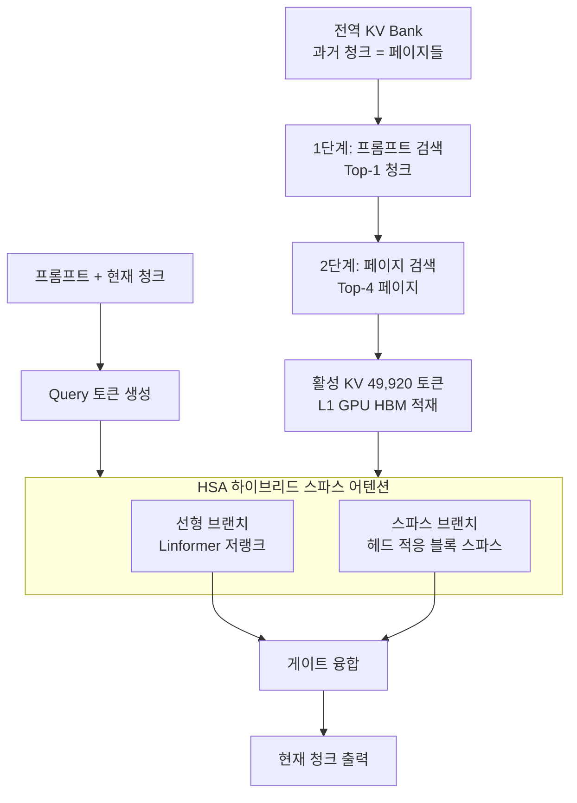

[논문 링크](https://arxiv.org/abs/2609.34606)
## WorldAttention: 슬라이딩 윈도우를 버린 인터랙티브 비디오 월드 모델의 시스템 공동 설계

**TL;DR** — 텍스트로 제어되는 인터랙티브 비디오 월드 모델은 "전체 히스토리를 기억해야 한다"는 요구와 "KV 캐시가 선형으로 불어 GPU 메모리가 터진다"는 현실 사이에 갇혀 있다. 알리바바 DAMO 아카데미 연구진은 **WorldAttention**이라는 어텐션 아키텍처로 이 딜레마를 풀었다. 계층형 KV 캐시(HKV)로 기억을 페이지 단위로 쪼개 다층 메모리에 분산 저장하고, 하이브리드 스파스 어텐션(HSA)으로 연산을 선형화·희소화한 뒤, 커스텀 커널로 실제 하드웨어 성능까지 끌어올린다. 결과는 VBench-Long 주제 일관성 **0.9472**, InterVBench **0.9668**, 그리고 H100 단일 GPU에서 **22.0 FPS**다(근거: Abstract, Tab. 1).

## 핵심 아이디어

인터랙티브 장기 비디오 생성의 본질적 어려움은 **프롬프트 전환(prompt switching)**에 있다. 사용자가 50초쯤 지나 "아까 그 빨간 공을 다시 던져봐"라고 하면, 모델은 수십 초 전의 세부 시각 정보를 회상해야 한다(근거: §1 Introduction). 이 때문에 단순한 슬라이딩 윈도우는 "과거를 아예 버려서" 부적합하고, 반대로 전체 히스토리 KV를 유지하면 메모리가 선형 폭증한다(근거: §1 Introduction).

WorldAttention의 답은 세 갈래다(근거: Fig. 1):

1. **HKV (Hierarchical KV Cache)** — 과거 KV를 8프레임짜리 "페이지" 단위로 쪼개 GPU SRAM/HBM → CPU DRAM → NVMe의 다층 메모리에 배치하고, 2단계 검색으로 필요한 페이지만 골라온다.
2. **HSA (Hybrid Sparse Attention)** — 선형 어텐션 브랜치와 헤드 적응형 블록 스파스 브랜치를 결합해 2차 복잡도를 사실상 선형·희소 수준으로 낮춘다.
3. **커스텀 커널** — 검색된 페이지를 연속 버퍼로 재배열해 비연속 메모리 접근으로 인한 하드웨어 낭비를 제거한다.

이 세 요소가 유기적으로 맞물려야 실제 속도가 나온다는 점이 이 논문의 핵심 통찰이다. 흥미롭게도 저자들은 "커널 최적화만으로는 부족하다"는 것을 정면으로 실험으로 보여준다(근거: Tab. 9).

## 배경: 그들이 해결한 문제

텍스트 조건부 인터랙티브 비디오 월드 모델은 자동회귀 확산(autoregressive diffusion) 패러다임 위에서, 사용자 프롬프트에 반응하며 시간적으로 일관된 환경을 시뮬레이션하는 것을 목표로 한다(근거: Abstract). 여기서 저지연·장기간 생성을 가능하게 하는 것이 체화 AI와 시뮬레이션 기반 계획의 핵심인데, 기존 프레임워크는 크게 두 갈래의 트레이드오프에 갇혀 있었다(근거: §1 Introduction).

**슬라이딩 윈도우 KV 캐시**(MAGI-1, Self Forcing, LongLive, SkyReels-V2, CausVid 등)는 최근 토큰만 유지해 GPU 메모리를 아끼지만, 수십 초 전의 시각 컨텍스트를 **영구적으로 폐기**한다(근거: §2 Related Work). 사용자가 이전 장면을 언급하면 필요한 시각 디테일이 이미 사라진 상태다.

**희소 검색 KV 캐시**(BIFE)는 전체 히스토리를 보존해 회상을 지원하지만, KV 캐시가 비디오 길이에 따라 선형으로 자라 곧 GPU 메모리 용량을 초과한다(근거: §2 Related Work). 게다가 BIFE의 검색 단위는 청크(chunk) 수준이라, 실제로 관련 있는 토큰은 일부인데도 청크 전체를 로딩하는 비효율이 있다(근거: §3.1 HKV).

즉, 논문이 파고든 공백은 **"전체 히스토리 기억"과 "효율적 관리"를 동시에 만족하는 어텐션 아키텍처**의 부재다. 저자들은 이를 "어텐션 재설계 + 계층형 캐싱 메커니즘"이라는 두 축의 시스템 공동 설계로 메운다(근거: §1 Introduction).

## 새로운 접근법: WorldAttention

WorldAttention은 Wan2.1-T2V-1.3B 백본 위에 구축되며, 16 FPS·480p(832×480) 해상도로 5초 클립을 생성한다(근거: §4.2 Implementation). 핵심 설계를 하나씩 뜯어보자.

### HKV: 페이지 단위의 다층 메모리

HKV는 기존의 "청크 단위" KV 관리를 "페이지(page) 단위"로 잘게 쪼갠다. 각 페이지는 **8개의 연속 프레임**을 담고, 한 프레임은 **1,560 토큰**이다(근거: §3.1 HKV). 메모리는 4계층으로 구성된다(근거: §3.1 HKV):

- **L0 (GPU SRAM)** — FlashAttention 스타일로 Q·K·V를 계산하는 온칩 메모리
- **L1 (GPU HBM)** — 검색된 KV 페이지 + 프롬프트/페이지 인덱스
- **L2 (CPU DRAM)** — 현재 청크 생성에 쓰이지 않는 KV 청크
- **L3 (NVMe)** — 전체 KV 청크의 최종 백업

접근 빈도와 하드웨어 대역폭을 정렬해, 자주 쓰는 페이지는 GPU에, 덜 쓰는 청크는 CPU로 자동 오프로드한다. 결과적으로 전체 KV가 아무리 커져도 GPU(L1) 점유는 유계(bounded)로 유지된다(근거: §3.1 HKV, Fig. 2).

검색은 **2단계**로 이뤄진다(근거: §3.1 HKV):

1. **프롬프트 단계** — 현재 프롬프트 임베딩과 과거 청크들의 프롬프트 임베딩 사이 코사인 유사도로 top-1 청크를 고른다.
2. **페이지 단계** — 현재 청크의 평균 쿼리 $\bar{Q}$와 각 페이지의 평균 키 $\bar{K}_{m,j}$ 사이 점수 $\alpha_{m,j} = \frac{\bar{Q}^\top \bar{K}_{m,j}}{\sqrt{d_k}}$로 top-$K_p$ 페이지를 선택한다(여기서 $K_p = 4$).

최종 활성 KV는 $4 \times 8 \times 1560 = 49{,}920$ 토큰이다. 프롬프트 검색은 검색 공간을 좁히고, 페이지 검색은 세밀한 컨텍스트를 골라내는 상호보완 구조다(근거: §4.5 Ablations).

### HSA: 선형 + 희소의 이중 브랜치

검색된 페이지에도 시공간 중복이 남아 있으므로, HSA는 두 브랜치로 연산을 더 세밀하게 할당한다(근거: §3.2 HSA).

**선형 브랜치(linear branch)** 는 Linformer 방식의 저랭크 투영을 쓴다. 각 헤드 $h$에 대해 학습된 투영 행렬 $\mathbf{E}_K^{(h)}, \mathbf{E}_V^{(h)} \in \mathbb{R}^{L \times r}$ 로 키·밸류를 압축한다:

$$
\widetilde{\mathbf{K}}^{(h)} = (\mathbf{E}_K^{(h)})^\top \mathbf{K}^{(h)}, \quad
\widetilde{\mathbf{V}}^{(h)} = (\mathbf{E}_V^{(h)})^\top \mathbf{V}^{(h)}
$$

이러면 복잡도가 $\mathcal{O}(L^2 d_k)$ 에서 $\mathcal{O}(L r d_k)$ 로 떨어진다. 투영 랭크 $r \ll L$ 이 고정이므로 $L$에 대해 선형이다(근거: §3.2 HSA). 저자들은 기존 선형 어텐션(SLA 등)의 "고정 크기 히든 스테이트에 무한한 과거를 압축"하는 방식이 **기억 중첩(memory superposition)과 어텐션 희석(attention dilution)**을 일으킨다고 지적하고, Linformer의 명시적 구조적 다운샘플링이 시공간 물리적 앵커를 보존한다고 주장한다(근거: Appx. Linear Branch).

**스파스 브랜치(sparse branch)** 는 원래 토큰 해상도에서 블록 단위 희소 연산을 한다. 검색된 페이지를 블록 크기 $B$ 로 나누고, 풀링된 어텐션 맵으로 조대한(coarse) 블록 선택을 한 뒤, 선택된 블록에 대해서만 블록-스파스 커널로 SDPA를 수행한다(근거: §3.2 HSA). 블록 크기는 Hopper의 MMA/WGMMA 연산 단위인 16의 배수로 맞춘다. 과거 페이지(inter-chunk)에는 $B_{\text{inter}}=128$, 현재 청크 토큰(intra-chunk)에는 $B_{\text{intra}}=64$ 를 쓴다(근거: §3.2 HSA).

**헤드 적응형 희소성**이 이 브랜치의 묘미다. 고정 Top-K 대신, 각 헤드가 자신의 어텐션 분포의 **지니 계수(Gini coefficient)** $\mathcal{G}^{(h)}$ 로 희소성 수준을 스스로 정한다(근거: Appx. Sparse Branch):

$$
\tau_h = \tau_{\min} + \mathcal{G}^{(h)} \cdot (\tau_{\max} - \tau_{\min})
$$

헤드마다 누적 어텐션 질량이 임계값 $\tau_h$ 를 넘는 최소 블록 집합만 선택한다. 분포가 뾰족한 헤드(지역적 상호작용에 집중)와 균일한 헤드(광범위 컨텍스트)가 서로 다른 희소성으로 동작해, 레이어·전역 고정 희소성보다 세밀하다(근거: §3.2 HSA, Fig. 3).

두 브랜드는 헤드 단위 곱셈 게이트로 융합된다:

$$
\mathbf{O}^{(h)} = \mathbf{O}^{(h)}_{\text{lin}} \odot \mathbf{G}^{(h)}_{\text{lin}} + \mathbf{O}^{(h)}_{\text{sp}} \odot \mathbf{G}^{(h)}_{\text{sp}}
$$

선형 브랜드는 전역 정보 흐름을 보장하고, 스파스 브랜드는 필요한 곳의 고해상도 모델링을 담당한다(근거: §3.2 HSA).

## 작동 원리: 구체적인 예시로 살펴보기

논문의 시각화 예시 중 하나인 "리우의 크리스마스 거리" 장면을 빌려 전 과정을 따라가 보자(근거: Appx. Visualization). 파란 셔츠의 남성이 빨간 공을 던지다 리본, 화염 토치로 이어지는 60초 영상이라고 하자.

**1. 청크 분할과 KV 뱅크 초기화.** 60초 영상은 5초짜리 청크 12개로 생성된다. 각 청크의 KV는 8프레임 단위 페이지 $\mathcal{P}_{m,j}$ 로 쪼개져 전역 KV 뱅크 $\mathcal{B}$ 에 저장된다(근거: §3.1 HKV).

**2. 프롬프트 전환 발생.** 사용자가 50~60초 구간에서 "그 남자가 다시 빨간 공을 던진다"라고 요청한다. 모델은 10~20초 구간의 빨간 공 장면을 회상해야 한다.

**3. 2단계 검색.** 먼저 현재 프롬프트 임베딩과 각 청크의 프롬프트 임베딩 유사도로 10~20초 청크를 top-1로 골라낸다. 이어서 그 청크 안에서 현재 평균 쿼리와 페이지별 평균 키 유사도로 top-4 페이지를 선택한다. 그 결과 활성 KV는 $4 \times 8 \times 1560 = 49{,}920$ 토큰이 되어 L1(GPU HBM)에 적재된다(근거: §3.1 HKV).

**4. HSA 연산.** 이 49,920 토큰이 두 브랜드로 들어간다. 선형 브랜드는 $L = 49{,}920$, $d_k = 128$, $r = 64$ 라고 가정할 때, 전체 어텐션의 $QK^\top$ 이 $L^2 d_k \approx 3.2 \times 10^{11}$ FLOPs인 데 비해 선형 브랜드는 $L r d_k \approx 4.1 \times 10^8$ 수준으로, 차원 축 방향으로 약 $L/r \approx 780$ 배 줄어든다. 스파스 브랜드는 블록을 지니 계수 기반 임계값으로 걸러내, 질량이 큰 블록만 실제 연산한다.

**5. 게이트 융합과 출력.** 두 브랜치 출력이 헤드별 게이트로 섞여 현재 청크의 노이즈 제거(denoising)를 이끈다. 이 과정이 청크마다 반복되며 60초 전체가 일관성 있게 이어진다.

전체 흐름을 그림으로 정리하면 다음과 같다:

## 성능 검증: 주요 결과

### 품질: VBench-Long에서 전 지표 최고

VBench-Long을 60초로 확장한 벤치마크에서 WorldAttention은 **주제 일관성 0.9472, 배경 일관성 0.9691, 모션 부드러움 0.9915, 다이내믹 정도 0.7758, 이미지 품질 0.7259**로 대부분 지표에서 최고를 기록했다(근거: Tab. 1). 직전 최고인 BIFE(주제 일관성 0.9410) 대비 **+0.0062**, LongLive(0.9403) 대비 뚜렷한 개선이다.

전체 60초에 대한 품질 점수 85.53은 SkyReels-V2(80.49), Self-Forcing(82.46), BIFE(84.38), LongLive(83.95)를 모두 앞선다(근거: Tab. 2). 구간별 CLIP 점수도 0~10초(29.04)부터 50~60초(25.01)까지 전반적으로 최고 수준을 유지해, 프롬프트 전환 이후에도 정체성 드리프트가 적음을 보여준다(근거: Tab. 2).

### 품질: InterVBench의 드리프트 지표

청크 단위 장기 생성 평가인 InterVBench에서도 WorldAttention은 VDE 주제 **0.0792**, VDE 배경 **0.2850**, VDE 모션 **0.0095**, VDE 클리어니스 **0.7390**로 최저(드리프트 최소)를 기록했고, 주제 일관성 **0.9668**, 배경 일관성 **0.9614**, 모션 부드러움 **0.9972**를 달성했다(근거: Appx. InterVBench). 시간이 지나도 흐려지거나 흔들리는 현상이 가장 적다는 의미다.

### 효율: 커널 14.02배, 단일 GPU 22 FPS

효율 측면은 이 논문의 백미다. 커스텀 커널 **HSA_tk**(ThunderKittens 기반)는 FlashAttention-3 대비 **14.02배** 속도 향상을 보였고, HKV까지 결합한 종단 간(end-to-end) 속도 향상은 **2.21배**다(근거: Abstract, §4.3 Efficiency). 단일 H100에서 **22.0 FPS**를 유지하면서 품질 점수 86.55를 기록해, 품질과 속도를 동시에 잡았다(근거: Tab. 3). 이는 Self-Forcing(17.0 FPS), BIFE(18.0 FPS), LongLive(20.7 FPS)를 모두 웃돈다.

종단 간 스피드업을 단계별로 분해하면 **HKV(+1.15×) → HSA(+1.91×) → 커널 커스터마이징(+2.21×)** 로 누적된다(근거: Tab. 9). B200 GPU에서도 14B 모델·720p·60초 설정에서 **2.46배**, 90초 설정에서 **2.35배**로, 시퀀스가 길고 모델이 클수록 이득이 커진다(근거: Tab. 10).

### 비밀 병기: 왜 하필 이 조합인가

HSA의 설계 공간을 깎아낸 절제 실험이 인상적이다(근거: Tab. 4):

| 구성 | 주제 일관성 | 다이내믹 정도 | 이미지 품질 |
|---|---:|---:|---:|
| 선형 브랜치만 | 0.9021 | 0.5825 | 0.6490 |
| 스파스만 (τ=1.00/0.35) | 0.9365 | 0.6945 | 0.6995 |
| 선형+스파스 (τ=0.75/0.35) | 0.9300 | 0.7520 | 0.7015 |
| **선형+스파스 (τ=1.00/0.35)** | **0.9472** | **0.7758** | **0.7259** |

두 브랜드는 상보적이다. 선형 브랜치는 주제·배경 일관성에 강하지만 움직임 역동성과 시각 품질이 약하고, 스파스 브랜치는 그 반대다. 결합하면 전 지표가 오른다(근거: §4.5 Ablations). 또한 선형 브랜치를 SLA·SANA-Video·전체 어텐션과 비교한 분석에서, Linformer 방식이 전체 어텐션의 장거리 질량 분포를 가장 충실히 복원하고 출력 코사인 유사도도 가장 높았다(근거: Fig. 4).

HKV 검색 설계 역시 검증됐다. 동일 4페이지 예산에서 HKV(85.53)는 최근 페이지 검색(83.74), 무작위 검색(82.86), 불일치 검색(80.96)을 압도하고, 특히 50~60초 CLIP 점수에서 25.01 vs 21.48/20.12/17.36으로 격차가 벌어진다(근거: Tab. 7). 의미적으로 유사한 청크가 3개나 섞여도 품질이 85.53 → 85.18로 거의 떨어지지 않는 강건성도 보여줬다(근거: Tab. 8).

## 우리의 관점: 강점, 한계, 그리고 이 연구가 중요한 이유

### 강점

가장 큰 기여는 **"알고리즘-하드웨어 공동 설계가 필수다"라는 것을 데이터로 증명한 점**이다. HSA 실행 시간을 분해하면 스파스 어텐션 커널 자체는 전체의 **1.86%**에 불과하고, KV 재구성과 연속 메모리 복사가 **31.00%**, 선형 브랜치가 **39.78%**를 차지한다(근거: Tab. 9). 즉 커널만 최적화하면 병목을 못 잡는다는 뜻이다. 이는 "최적 커널 = 최고 성능"이라는 통념을 정면으로 반박하는, 시스템 논문으로서의 진짜 통찰이다.

둘째, **페이지 단위 2단계 검색**이 단순하면서도 효과적이다. 프롬프트 검색으로 검색 비용이 시퀀스 길이와 무관하게 유지되고, 페이지 검색으로 세밀한 컨텍스트를 얻는 상호보완 구조는(근거: §4.5) 엔지니어링적으로 깔끔하다.

셋째, 결과의 **일관성**이다. VBench-Long과 InterVBench라는 두 벤치마크, 품질과 효율이라는 두 축, H100과 B200이라는 두 하드웨어, 1.3B와 14B라는 두 규모에서 모두 같은 결론이 나온다(근거: Tab. 10).

### 한계

저자들이 명시적으로 인정한 한계는 **텍스트 프롬프트만 제어 신호로 쓴다는 점**이다. 액션 신호, 제어 궤적, 체화 상호작용 큐 같은 더 풍부한 조건부 모달리티를 다루지 못한다(근거: Appx. Limitation).

잠재적 한계도 몇 가지 보인다. 첫째, 훈련 샘플이 **프롬프트 전환을 정확히 1회만** 포함한다는 설정은 실제 다회·다중 이벤트 상호작용을 과소평가할 수 있다(근거: §4.2 Implementation). 논문 스스로도 "top-1 청크 검색이 다중 이벤트 프롬프트에는 부적합할 수 있다"고 인정한다(근거: §4.5). 둘째, 페이지 크기(8프레임)와 $K_p=4$ 같은 하이퍼파라미터가 고정이라, 콘텐츠 밀도에 따른 적응은 미래 과제로 남는다. 셋째, 백본이 1.3B로 작아, 더 큰 DiT에서 이득이 선형적으로 유지되는지는 14B 단일 설정만으로는 완전히 증명되지 않았다.

### 왜 중요한가

이 연구는 **KV 캐시 관리**라는 LLM 서빙의 중심 문제를 **비디오 생성**이라는 전혀 다른 도메인으로 가져와, "전체 기억 vs 제한 메모리"라는 본질적 긴장을 체계적으로 해체했다. 체화 AI와 시뮬레이션 기반 계획에서 저지연·장기간 인터랙티브 생성이 점점 중요해지는 시점에, 이 프레임워크는 재사용 가능한 설계 패턴을 제시한다.

## 다음 단계는?: 앞으로의 길

저자들이 제안한 방향은 **액션 조건부 생성**이다. 액션 신호를 통합하면 단순 텍스트-비디오 모델을 넘어 제어 가능한 환경 시뮬레이션과 의사결정 기반 비디오 예측이 가능해져, 진짜 "비디오 월드 모델"로 진화할 수 있다(근거: Appx. Limitation).

여기에 더해 합리적인 다음 단계를 덧붙이자면:

- **다중 이벤트·다회 전환** 지원. top-1 청크 가정을 완화하고, 프롬프트 복잡도에 따라 검색 예산을 적응적으로 할당하는 방향이 자연스럽다.
- **적응형 페이지 크기**. 장면 변화가 잦은 구간은 더 작은 페이지, 정적인 구간은 더 큰 페이지로 나누는 밀도 적응 전략.
- **대규모 백본 검증**. 7B·14B급 DiT에서 HKV의 오프로드 정책과 HSA의 희소성 이득이 어떻게 스케일되는지 확인이 필요하다.
- **에너지·비용 관점의 평가**. 다층 메모리(특히 NVMe 왕복)의 전력·지연 비용을 정량화하면 실서빙에서의 트레이드오프가 더 명확해질 것이다.

결국 이 논문의 메시지는 명확하다. 인터랙티브 장기 생성의 병목은 어느 한 계층이 아니라 **어텐션 구조 · 메모리 관리 · 하드웨어 실행의 경계면**에 존재하며, 그 경계면을 함께 설계할 때 비로소 "기억도 지키고, 속도도 잡는" 시스템이 나온다.

<!-- verbatim-tables -->

## 논문 원문의 표

> arXiv e-print 의 LaTeX 원본에서 기계적으로 옮긴 표입니다. 숫자는 논문의 값이며 모델을 거치지 않았습니다.

**표 1. **Comparison of different methods on InterVBench.** We report InterVBench results on five VDE metrics and five complementary metrics from VBench .**

| Method | VDE Subject $\downarrow$ | VDE Background $\downarrow$ | VDE Motion $\downarrow$ | VDE Aesthetic $\downarrow$ | VDE Clarity $\downarrow$ |
|---|---|---|---|---|---|
| MAGI-1 | 0.3090 | 0.5000 | 0.0243 | 3.8286 | 2.7225 |
| Self Forcing | 0.3716 | 1.6108 | 0.1549 | 3.4683 | 3.0798 |
| PAVDM | 1.8292 | 0.9323 | 0.0461 | 2.8957 | 1.9503 |
| FramePack | 4.3984 | 5.9421 | 0.0387 | 1.4751 | 4.2513 |
| SkyReels-V2-DF-1.3B | 0.1085 | 0.3179 | 0.0195 | 1.2083 | 0.9365 |
| LongLive | 0.0825 | 0.3016 | 0.0104 | 1.1452 | 0.8529 |
| BIFE | 0.0844 | 0.2945 | 0.0119 | 0.9618 | 0.7551 |
| **WorldAttention (Ours)** | **0.0792** | **0.2850** | **0.0095** | **0.9462** | **0.7390** |
| Method | Subject Consistency $\uparrow$ | Background Consistency $\uparrow$ | Motion Smoothness $\uparrow$ | Aesthetic Quality $\uparrow$ | Image Quality $\uparrow$ |
| MAGI-1 | 0.8992 | 0.9078 | 0.9947 | 0.6508 | 0.6662 |
| Self Forcing | 0.8481 | 0.8203 | 0.9947 | 0.6283 | 0.6805 |
| PAVDM | 0.8640 | 0.8924 | 0.9926 | 0.5267 | 0.6567 |
| FramePack | 0.9001 | 0.8791 | 0.9949 | 0.6043 | **0.6972** |
| SkyReels-V2-DF-1.3B | 0.9418 | 0.9579 | 0.9931 | 0.6035 | 0.6835 |
| LongLive | 0.9610 | 0.9552 | 0.9968 | **0.6595** | 0.6960 |
| BIFE | 0.9597 | 0.9588 | 0.9956 | 0.6047 | 0.6852 |
| **WorldAttention (Ours)** | **0.9668** | **0.9614** | **0.9972** | 0.6397 | 0.6965 |

**표 2. **Comparison of different methods on VBench-Long .** We extended VBench-Long to 60 seconds following LongLive .**

| Method | Subject Consistency $\uparrow$ | Background Consistency $\uparrow$ | Motion Smoothness $\uparrow$ | Dynamic Degree $\uparrow$ | Aesthetic Quality $\uparrow$ | Image Quality $\uparrow$ |
|---|---|---|---|---|---|---|
| MAGI-1 | 0.8320 | 0.8931 | 0.9740 | 0.5537 | 0.5010 | 0.6120 |
| Self Forcing | 0.8211 | 0.9050 | 0.9799 | 0.6015 | 0.5130 | 0.6218 |
| PAVDM | 0.8415 | 0.9273 | 0.9769 | 0.6537 | 0.4970 | 0.6280 |
| FramePack | 0.9019 | 0.9450 | 0.9805 | 0.5715 | 0.5044 | 0.6381 |
| NOVA | 0.7750 | 0.8806 | 0.9894 | 0.1200 | 0.4753 | 0.4497 |
| CausVid | 0.8675 | 0.8985 | 0.9847 | 0.5200 | 0.6288 | 0.6747 |
| Self-Forcing++ | 0.9165 | 0.9092 | 0.9803 | 0.5865 | 0.5482 | 0.6453 |
| Deep Forcing | 0.9285 | 0.9136 | 0.9819 | 0.7035 | 0.6041 | 0.6455 |
| StreamDiffusionV2 | 0.9036 | 0.9051 | 0.9745 | 0.4552 | 0.5547 | 0.5528 |
| SkyReels-V2-DF-1.3B | 0.9391 | 0.9580 | 0.9838 | 0.6529 | 0.5320 | 0.6315 |
| LCT (MMDiT-3B) | 0.9380 | 0.9623 | 0.9816 | 0.6875 | 0.5200 | 0.6345 |
| MoC | 0.9398 | 0.9670 | 0.9851 | 0.7500 | 0.5547 | 0.6396 |
| Infinity-RoPE | 0.9352 | 0.9395 | 0.9710 | 0.5395 | 0.6045 | 0.6475 |
| BIFE | 0.9410 | 0.9650 | 0.9870 | 0.7720 | 0.5839 | 0.6527 |
| LongLive | 0.9403 | 0.9495 | 0.9845 | 0.7321 | 0.5795 | 0.6483 |
| Rolling Forcing | 0.9409 | 0.9447 | 0.9865 | 0.3600 | **0.6350** | 0.7242 |
| **WorldAttention (Ours)** | **0.9472** | **0.9691** | **0.9915** | **0.7758** | 0.6344 | **0.7259** |

**표 3. **Interactive long video evaluation on VBench-Long .** Quality scores are reported on the full 60s sequence. CLIP scores are reported on 10s video segments with identical semantics ($\uparrow$ higher is better).**

| Method | Quality Score $\uparrow$ | CLIP Score $\uparrow$ 0--10s | CLIP Score $\uparrow$ 10--20s | CLIP Score $\uparrow$ 20--30s | CLIP Score $\uparrow$ 30--40s | CLIP Score $\uparrow$ 40--50s | CLIP Score $\uparrow$ 50--60s |
|---|---|---|---|---|---|---|---|
| SkyReels-V2 | 80.49 | 20.96 | 22.51 | 25.78 | 18.45 | 19.57 | 19.61 |
| Self-Forcing | 82.46 | 28.46 | 24.89 | 23.53 | 22.96 | 23.07 | 23.19 |
| BIFE | 84.38 | 28.60 | 25.95 | 23.69 | 24.41 | 22.85 | 24.10 |
| LongLive | 83.95 | 28.85 | 25.68 | 24.64 | 24.23 | **24.32** | 24.32 |
| **WorldAttention (Ours)** | **85.53** | **29.04** | **25.99** | **25.80** | **24.72** | 24.25 | **25.01** |

**표 4. Single-prompt 30s long video evaluation on VBench-Long .**

| Model | Quality Score $\uparrow$ | Throughput (FPS) $\uparrow$ |
|---|---|---|
| SkyReels-V2 | 80.77 | 0.49 |
| FramePack | 83.61 | 0.92 |
| Self-Forcing | 83.82 | 17.0 |
| BIFE | 85.18 | 18.0 |
| LongLive (re-cache 12 frames) | 85.44 | 20.7 |
| LongLive (re-cache 32 frames) | 85.82 | 6.70 |
| **WorldAttention (Ours)** | **86.55** | **22.0** |

**표 5. **Comparison of different modification on HSA.** We report VBench-Long metrics following .**

| Method | Subject Consistency $\uparrow$ | Background Consistency $\uparrow$ | Motion Smoothness $\uparrow$ | Dynamic Degree $\uparrow$ | Aesthetic Quality $\uparrow$ | Image Quality $\uparrow$ |
|---|---|---|---|---|---|---|
| Linear Only | 0.9021 | 0.9365 | 0.9747 | 0.5825 | 0.5632 | 0.6490 |
| Sparse Only: |  |  |  |  |  |  |
| **$\tau_{\max} = 0.75, \tau_{\min} = 0.35$** | 0.8736 | 0.8845 | 0.9735 | 0.6053 | 0.6342 | 0.7042 |
| **$\tau_{\max} = 1.00, \tau_{\min} = 0.10$** | 0.9254 | 0.9424 | 0.9880 | 0.6621 | 0.6293 | 0.7035 |
| **$\tau_{\max} = 1.00, \tau_{\min} = 0.35$** | 0.9365 | 0.9486 | 0.9894 | 0.6945 | 0.6046 | 0.6995 |
| Sparse and Linear: |  |  |  |  |  |  |
| **$\tau_{\max} = 0.75, \tau_{\min} = 0.35$** | 0.9300 | 0.9270 | 0.9863 | 0.7520 | 0.6201 | 0.7015 |
| **$\tau_{\max} = 1.00, \tau_{\min} = 0.10$** | 0.9415 | 0.9593 | 0.9914 | 0.7507 | 0.6287 | 0.7148 |
| **$\tau_{\max} = 1.00, \tau_{\min} = 0.35$** | **0.9472** | **0.9691** | **0.9915** | **0.7758** | **0.6344** | **0.7259** |

**표 6. **Ablation of HKV: interactive long video evaluation on VBench-Long .** Quality scores are reported on the full 60s sequence. CLIP scores are reported on 10s video segments with identical semantics ($\uparrow$ higher is better).**

| Method | Throughput (FPS) $\uparrow$ | Quality Score $\uparrow$ | CLIP Score $\uparrow$ 0--10s | CLIP Score $\uparrow$ 10--20s | CLIP Score $\uparrow$ 20--30s | CLIP Score $\uparrow$ 30--40s | CLIP Score $\uparrow$ 40--50s | CLIP Score $\uparrow$ 50--60s |
|---|---|---|---|---|---|---|---|---|
| Sliding Window | 22.1 | 82.52 | 25.46 | 22.74 | 21.49 | 19.94 | 18.45 | 17.59 |
| Sliding Window (re-cache 12 frames) | 20.8 | 84.05 | 28.40 | 24.89 | 24.07 | 23.19 | 22.95 | 23.64 |
| Sliding Window (re-cache 32 frames) | 7.10 | 84.82 | 28.52 | 24.45 | 25.26 | 24.05 | 23.71 | 24.47 |
| HKV ($P_{size} = 2, K_p = 16$) | 21.9 | 85.38 | 29.01 | 25.51 | 25.37 | 24.69 | 24.19 | 24.93 |
| HKV ($P_{size} = 4, K_p = 8$) | 21.9 | 84.93 | 24.81 | **26.09** | 25.63 | 24.64 | 24.07 | 24.10 |
| HKV ($P_{size} = 8, K_p = 2$) | **24.0** | 83.05 | 27.48 | 25.08 | 25.12 | 24.10 | 23.99 | 24.28 |
| HKV ($P_{size} = 8, K_p = 4$) | 22.0 | **85.53** | **29.04** | 25.99 | **25.80** | **24.72** | **24.25** | **25.01** |

**표 7. Comparison of hierarchical KV retrieval with alternative page-selection strategies under the same active KV budget of four pages (49,920 tokens). Quality is evaluated on the full 60-second VBench-Long sequence; CLIP scores are evaluated on aligned 10-second segments.**

| Method | Throughput (FPS) $\uparrow$ | Quality $\uparrow$ | CLIPScore 0--10s | CLIPScore 10--20s | CLIPScore 20--30s | CLIPScore 30--40s | CLIPScore 40--50s | CLIPScore 50--60s |
|---|---|---|---|---|---|---|---|---|
| Page-only retrieval over all history | 19.8 | 85.21 | 28.97 | 25.84 | 25.60 | 24.58 | 24.06 | 24.78 |
| Prompt-only chunk retrieval | 21.9 | 84.79 | 28.76 | 25.48 | 25.12 | 24.10 | 23.74 | 24.05 |
| Chunk-level retrieval | **22.3** | 84.48 | 28.41 | 25.21 | 24.86 | 23.88 | 23.45 | 23.70 |
| Recent-page retrieval | 22.1 | 83.74 | 27.93 | 24.72 | 23.92 | 22.91 | 22.05 | 21.48 |
| Random-page retrieval | 21.4 | 82.86 | 26.85 | 23.71 | 22.64 | 21.46 | 20.63 | 20.12 |
| Mismatched-page retrieval | 22.0 | 80.96 | 25.92 | 22.46 | 20.91 | 19.27 | 18.14 | 17.36 |
| **HKV (Ours)** | 22.0 | **85.53** | **29.04** | **25.99** | **25.80** | **24.72** | **24.25** | **25.01** |

**표 8. Ablation of the number of prompt-level candidate chunks under the same active KV budget of four pages.**

| Method | Throughput (FPS) $\uparrow$ | Quality $\uparrow$ | CLIPScore 0--10s | CLIPScore 10--20s | CLIPScore 20--30s | CLIPScore 30--40s | CLIPScore 40--50s | CLIPScore 50--60s |
|---|---|---|---|---|---|---|---|---|
| Top-4 chunks, 1 page per chunk | 20.4 | 84.91 | 28.72 | 25.42 | 25.21 | 24.18 | 23.77 | 24.13 |
| Top-2 chunks, 2 pages per chunk | 21.2 | 85.31 | 28.93 | 25.78 | 25.57 | 24.55 | 24.09 | 24.72 |
| **Top-1 chunk, 4 pages (Ours)** | **22.0** | **85.53** | **29.04** | **25.99** | **25.80** | **24.72** | **24.25** | **25.01** |
