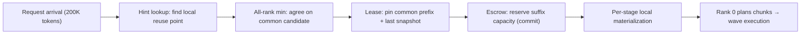

[Paper](https://arxiv.org/abs/2609.35263v1)
## WavePP — A Pipeline-Parallel Prefill Runtime That Burns In Prefix Reuse

## TL;DR

Built on top of TensorRT-LLM, **WavePP** overlaps request admission (reuse consensus, cache protection, capacity reservation) **asynchronously** with pipeline execution, and dynamically tunes the wave size to keep the pipeline full. On the **same kernels and the same topology**, it pushed prefill throughput for GLM 5.2 and MiniMax M2.7 up to **2.91×/2.02×**, and across the 28 Kimi K3 settings it recorded the highest throughput in **all 18** with concurrency 8 or higher.

## Core Idea

The real bottleneck in pipeline-parallel (PP) prefill is not GPU compute but "how quickly the next request can be prepared." In a system where each stage **independently maintains and evicts** its KV cache, **a local cache hit does not guarantee global reusability**. WavePP's central claim boils down to one sentence: "If you move request admission off the execution path and eliminate the moments when the GPU sits idle, you can substantially raise pipeline prefill throughput with the same kernels." Three pillars support this claim: **fast reuse hint**, **local lease**, and **capacity escrow**.

## Background: The Problem They Solved

As agentic workloads became widespread, LLMs process **increasingly long inputs** such as conversations, documents, and tool outputs (source: §1). The cost of the prefill stage surged accordingly, and in disaggregated serving, architectures that dedicate prefill-only workers became common.

As models grew too large to fit on a single GPU, three main parallelization strategies emerged. Tensor parallelism (TP) splits layers across devices, pipeline parallelism (PP) divides layers into a sequence of stage groups, and context parallelism (CP) splits the input length. PP is favorable for throughput because multiple microbatches pass through the stages in sequence and execute concurrently, but it has the structural limitation that **the slowest stage dominates the whole** (source: §3.5).

Once prefix caching gets involved, the problem becomes more complex. Reusing the cache state of a shared prefix can cut prefill computation by several times. For example, if 90% of a 100K context is in cache, only the last 10K tokens need to be processed (source: §3.2). In PP, however, **each stage keeps its own local cache for its layers**. Moreover, hybrid models like Kimi K3 have both the dense KV cache of MLA attention and a **sparse recurrent snapshot** of KDA (linear attention), and because the recurrent state cannot be restored by rewinding $S_r$ from $S_{r'}$ ($r'>r$), the reuse boundary is tied to the **intersection** of the two caches (source: §3.2, Fig. 1).

Ultimately, the research gap the authors point to is this: existing PP runtimes perform **request preparation (reuse-boundary consensus → cache pin → suffix capacity acquisition → metadata construction)** serially on the execution path. When this preparation delays the next forward pass, the pipeline idles even though the GPU still has work available. Tree traversal requires a mutex, and if the reuse boundary diverges across stages, a second traversal (re-calibration) becomes necessary, making the cost even larger (source: §4.1).

## New Approach: WavePP

WavePP is a prefill runtime that **decouples** this preparation work from execution and lets stages follow a single execution schedule while managing their caches independently. The core design is as follows (source: §4).

**1) Two threads and two communication planes.** Each rank has two threads. The `WAVE` thread handles request dispatch, reuse consensus, and capacity management, while the `LOOP` thread handles the executor and cache block materialization. Communication is likewise split into two planes: the `data plane` carries the wave schedule and activations, and the `rounds plane` carries requests and admission results (source: §4.2).

**2) Fast reuse hint.** To reduce traversal cost and mutex contention, it maintains a **hint index** that holds no blocks. For each token block $B_i$, it maintains a chained prefix hash.

$$H_{-1}=0,\qquad H_i=\operatorname{hash}(B_i,\ \mathrm{extraKeys}_i,\ \mathrm{salt},\ H_{i-1})$$

For dense-attention prefixes it reduces probing from $O(N)$ to about $O(\log N)$ using **gallop (skip by doubling) + bisect (binary search)**, while recurrent snapshots are sparse and are found by a **reverse scan** at the attention boundary. This hint neither pins the cache nor reserves capacity, so there is nothing to roll back even if a pending request is cancelled (source: §4.3). In a stress experiment with 200K tokens and concurrency 64, the median probe time dropped from **64.4 ms → 24 μs**, with a p99 of 2.35 ms (source: §4.3).

**3) Local lease.** For a consensus reuse candidate, it does not install the actual block into the tree but **protects only a reference**. Other requests may share that state, but it cannot be evicted until the lease is released. If the actual pin points diverge across stages, the richer side rolls back to the common point. Since this reconciliation is monotonically decreasing, it is guaranteed to converge (source: §4.4).

**4) Capacity escrow.** Even if a lease guarantees reuse, no one can complete if there is no room for the suffix. So each stage reserves suffix capacity immediately after the lease. This reservation does not allocate actual blocks or push out eviction victims; it **holds only a reference and defers the actual eviction/offload to the executor's materialization point** (source: §4.5). The eviction victim remains in the tree so other requests can still occupy it via reuse, and at commit time the reference count detects additional owners and selects a replacement block.

**5) MPU (Maximum Pipeline Utilization) scheduling.** Filling greedily reduces the number of waves and creates idle stages. Filling 2M tokens with a budget $M$ gives 2 waves, but reducing to $M/2$ gives 4 (source: Fig. 6). MPU looks at the remaining work and discretely halves the budget.

$$b_0=M,\qquad b_{j+1}=\max\left(b_{\min},\ \operatorname{alignDown}_{B}\left(b_j/2\right)\right)$$

It estimates the available number of waves as $n(b)=\max\left(W/b,\ N_{>b/2}\right)$ and chooses the largest budget that can supply the execution ring $R=2P$ (source: §4.6).

## How It Works: A Concrete Example

Suppose a 200K-token prompt arrives at a 4-stage (PP4) pipeline. 90% is cached, but the actual reusable point differs per stage.

1. **Hint lookup.** Each rank probes its own hint index to find its local reuse point. Suppose stage 0 can reuse up to 176K, stage 1 up to 180K, stage 2 up to 164K, and stage 3 up to 172K. The candidate becomes the all-rank minimum, **164K**. No cache is pinned yet.
2. **Lease.** Each stage pins the 164K prefix and the last recurrent snapshot at that point. Other requests may occupy these blocks but cannot evict them.
3. **Escrow.** The remaining suffix is $200\text{K}-164\text{K}=36\text{K}$ tokens. Each stage reserves cache blocks for 36K tokens. It does not actually allocate blocks or push out victims — this is deferred and overlapped with GPU execution.
4. **Materialization.** Each stage actually installs the blocks into its local cache tree. Stage 0 can start executing as soon as it is ready, **without waiting for the other stages to finish preparing**.
5. **Wave execution.** Rank 0 splits the 36K suffix into chunks. With $M=16{,}384$ there are 3 waves (16K+16K+4K), but if MPU reduces to $b=8{,}192$, it splits into more waves and fills the 4 stages more evenly.

The key here is the **reordering of steps**. Existing runtimes perform "consensus → pin → reserve → install" serially when a request is executed, making the pipeline wait. WavePP reorders this to "hint (non-blocking) → consensus → lease/escrow (reference only) → materialization while execution overlaps," so the next request is prepared in parallel while the GPU executes the previous request (source: Fig. 3).

## Performance Validation: Main Results

### 1) Improvements on the Same Kernels and Same Topology (GLM 5.2 / MiniMax M2.7)

Both models were fixed to NVFP4 weights, 4 B300 GPUs, PP4 topology, and TensorRT-LLM 1.3.0rc26 kernels, with only the runtime swapped (source: §5.2). The result was that WavePP was ahead in **37 of 40 settings**.

| Workload | $c$ | GLM 5.2 TRT-LLM | GLM 5.2 WavePP | Δ | MiniMax TRT-LLM | MiniMax WavePP | Δ |
|---|---|---|---|---|---|---|---|
| Short cold | 32 | 45,730 | 47,864 | +4.7% | 49,596 | 54,615 | +10.1% |
| Long cold | 32 | 40,844 | 43,357 | +6.2% | 36,789 | 40,165 | +9.2% |
| Short reuse(90%) | 32 | 321,750 | 378,951 | +17.8% | 315,446 | 348,107 | +10.4% |
| 4K suffix | 64 | 835,235 | 1,160,931 | +39.0% | 832,645 | 1,039,376 | +24.8% |
| 4K suffix | 128 | 416,294 | 1,212,572 | **+191.3%** | 551,143 | 1,113,196 | **+102.0%** |

(source: Table 1, units input tokens/s, including cached tokens)

The most dramatic point is **short suffix + high concurrency**. The faster requests finish, the faster the runtime must prepare new requests, and here admission latency directly erodes throughput. At $c=128$, WavePP achieved **2.91× (GLM)** and **2.02× (MiniMax)** throughput, and for the 4K suffix workload the median prefill completion time fell by about **71%** on GLM and about **55%** on MiniMax (source: §5.2).

Notably, **the reverse case also exists**. For long-prefix reuse at $c=8$ and 4K suffix MiniMax at $c=16$, WavePP was actually lower. The authors explain this as "a regime where GPU compute dominates and the admission savings are relatively small" (source: §5.2).

### 2) Kimi K3: TP vs PP, and Cross-Library Comparison

On Kimi K3, a 2.8T-parameter hybrid KDA/MLA MoE model, using 8 GB300 GPUs (two 4-GPU nodes), they compared WavePP (TP1×PP8) against TRT-LLM/SGLang/vLLM's TP8/EP8 and PP8 (source: §5.3). WavePP recorded the highest throughput in **21 of 28 settings**, and in **all 18** with concurrency 8 or higher (source: §5.4).

- **Cold long-context**: Geometric-mean throughput versus TRT-LLM TP8/EP8 was **+58.8% / +49.1% / +37.8%** at 65.5K/131K/262K respectively. At $c=32$, 44,643 / 35,878 / 28,031 input tok/s (source: §5.5).
- **Seeded reuse(90%)**: **289,096 tok/s** at 131K $c=32$, and **218,743 tok/s** at 262K $c=32$. Consistently ahead in both throughput and p50 completion time at concurrency 8 or higher (source: §5.6).
- **Mixed (75% warm-131K / 25% cold-262K)**: Geometric mean **+46.1~+56.8%** versus TP, and **+5.0% (SGLang)/+14.6% (vLLM)** versus PP. 61,190 tok/s at $c=32$ (source: §5.7).

An interesting observation is that **PP is more advantageous than TP for prefill**. SGLang PP8 had **+26.8%** higher geometric-mean throughput than SGLang TP8/EP8, and WavePP went one step further (source: §5.4).

### 3) Cache Retention and Ablation

In the prefix retention experiment, WavePP's good-hit rate (reusing 80% or more of the expected prefix) was **88~100%**, ahead of TP8/EP8's 73~83% at every arrival rate (source: §5.8). This is because decoupling admission from execution secures reuse before the cache is pushed out by new requests.

The ablation isolates the contribution of each mechanism (source: §5.9, Fig. 14).

| Rung | Added mechanism |
|---|---|
| R1 | Naive reimplementation (lockstep preparation) |
| R2 | + wave admission/transport |
| R3 | + lease admission |
| R4 | + MPU (planner packing, adaptive sizing, deadline) |

- Cold 131K $c=16$: From R1→R2, **8,826 → 29,692 tok/s (+236.4%)**. Changes afterward were marginal. MPU reduced p50 from 69.69→43.03 seconds but throughput improved only +1.4%.
- Reuse 131K $c=8$: lease/escrow (R3) gave **96,796 → 149,021 (+54.0%)**, and MPU (R4) gave **→ 211,214 (+41.7%)**.

In other words, **admission/transport is decisive for cold, while cache coordination and scheduling are decisive for reuse**. That said, MPU does not always win: at reuse 262K $c=32$, MPU lowered throughput by **-9.7%** (still +24.5% higher than TP8/EP8). This amounts to an admission that planner-driven packing can be worse than static packing for certain workloads.

## Our Perspective: Strengths, Limitations, and Why This Work Matters

**Strengths.** The paper's biggest contribution is its **redefinition of the problem**. Viewing prefill throughput optimization not as a "kernel compute acceleration" problem but as an "admission cadence" problem, and offering the conceptual framework `hint → lease → escrow → materialization`, is directly transplantable into real serving-system design. Also, by comparing with only the runtime swapped under the **same kernels and same topology**, the experimental design cleanly separates kernel performance from scheduling performance. Including a reproducibility check for SGLang PP8 (+5.7% versus the day-0 report) also raises confidence.

**Limitations.** First, MPU is a discrete budget adjustment that relies only on token counts without estimating the actual chunk execution time, so it cannot account for the fact that chunks of the same size differ in cost depending on the attention prefix length. Indeed, it caused **regressions** in some settings. Second, it validated only TP1×PP4·PP8, leaving the behavior under TP2×PP4, PP16, or imbalanced layer placement unknown. Third, it handled only FCFS scheduling and a single replica, leaving practical needs such as priority, deadlines, and cache-aware routing unaddressed. Finally, this is an implementation confined to TensorRT-LLM, so portability to other runtimes (vLLM/SGLang) is unproven (source: §6).

**Why it matters.** As agentic workloads grow longer and hybrid (attention + recurrent) models multiply, "how to consistently agree on the reuse boundary across multiple cache types" will become an increasingly important problem. By presenting both a clear principle — **separating execution from preparation** — and measurable gains (up to 2.91×) for this distributed admission problem, WavePP is a body of work that can serve as a reference point for both serving-system researchers and engineers.

## What's Next?: The Road Ahead

In addition to the directions the authors themselves propose (source: §6), reasonable follow-up work can be summarized as follows.

1. **Dynamic chunking based on execution-time estimation.** Instead of MPU's discrete budget, determining the size by observing per-chunk execution time and stage progress can improve pipeline balance while reducing regressions.
2. **Diverse topologies and imbalanced placement.** It is necessary to verify how admission overhead and overlap change under TP2×PP4, PP16, and inter-stage layer imbalance.
3. **Scheduling that accounts for priority, deadlines, and cache state.** Policies that go beyond FCFS to optimize tail latency and SLOs are a natural extension.
4. **Multi-replica + cache-aware routing.** Combining cache-aware routing and SLO curves across multiple prefill workers would allow validation of tail-latency improvements in real deployments.
5. **Porting to other runtimes.** Applying the `hint/lease/escrow` framework to other backends such as vLLM and SGLang to confirm generalizability is also a worthwhile follow-up study.

<!-- verbatim-tables -->

## Tables from the paper

> Tables converted mechanically from the arXiv e-print LaTeX source. The numbers are the paper's own and did not pass through a model.

**Table 1. PP4 comparison on matched kernels. Aggregate prompt throughput (tokens/s, including cached tokens) is the median of three boots per system and model. Each system uses one configuration throughout. Throughput change $\Delta$ is $(\mathrm{WavePP}/\text{TRT-LLM}-1)\times100\%$. Green shading marks the higher throughput. Short and long reuse use 90% cached prefixes. The 4K-suffix cells follow cold traffic and retain its cache-pool eviction history.**

| Family | $c$ | GLM 5.2 TRT-LLM | GLM 5.2 WavePP | GLM 5.2 $\Delta$ | MiniMax M2.7 TRT-LLM | MiniMax M2.7 WavePP | MiniMax M2.7 $\Delta$ |
|---|---|---|---|---|---|---|---|
| Short cold | 8 | 46,658 | 47,552 | +1.9% | 50,677 | 54,457 | +7.5% |
|  | 16 | 46,207 | 48,071 | +4.0% | 50,127 | 54,642 | +9.0% |
|  | 32 | 45,730 | 47,864 | +4.7% | 49,596 | 54,615 | +10.1% |
| Long cold | 8 | 41,839 | 43,456 | +3.9% | 37,146 | 40,388 | +8.7% |
|  | 16 | 41,610 | 43,310 | +4.1% | 37,051 | 40,363 | +8.9% |
|  | 32 | 40,844 | 43,357 | +6.2% | 36,789 | 40,165 | +9.2% |
| Short reuse | 8 | 309,301 | 309,762 | +0.1% | 283,199 | 303,921 | +7.3% |
|  | 16 | 351,119 | 391,338 | +11.5% | 344,174 | 375,368 | +9.1% |
|  | 32 | 321,750 | 378,951 | +17.8% | 315,446 | 348,107 | +10.4% |
| Long reuse | 8 | 316,516 | 278,418 | -12.0% | 250,815 | 206,548 | -17.6% |
|  | 16 | 297,822 | 310,786 | +4.4% | 239,657 | 241,150 | +0.6% |
|  | 32 | 264,520 | 306,497 | +15.9% | 227,220 | 236,459 | +4.1% |
| Mixed | 8 | 89,844 | 92,759 | +3.2% | 91,270 | 99,810 | +9.4% |
|  | 16 | 87,974 | 93,515 | +6.3% | 91,314 | 100,117 | +9.6% |
|  | 32 | 84,387 | 92,080 | +9.1% | 89,427 | 99,039 | +10.7% |
| 4K suffix | 8 | 497,230 | 503,184 | +1.2% | 435,088 | 441,314 | +1.4% |
|  | 16 | 658,662 | 661,230 | +0.4% | 642,896 | 606,764 | -5.6% |
|  | 32 | 884,810 | 895,482 | +1.2% | 872,496 | 886,305 | +1.6% |
|  | 64 | 835,235 | 1,160,931 | +39.0% | 832,645 | 1,039,376 | +24.8% |
|  | 128 | 416,294 | 1,212,572 | +191.3% | 551,143 | 1,113,196 | +102.0% |

**Table 2. Configurations of the Kimi K3 comparison baselines.**

| Baseline | Parallel configuration | Benchmark configuration |
|---|---|---|
| vLLM TP8/EP8 | TP8/EP8 on eight GPUs | v0.28.0 with the FlashInfer TensorRT-LLM MoE path |
| SGLang TP8/EP8 | TP8/EP8 on eight GPUs | Same SGLang build, 16K prefill budget, and hybrid host-cache configuration as the SGLang PP8 arm |
| TRT-LLM TP8/EP8 | TP8/EP8 on eight GPUs | Same Kimi K3 engine family and shared kernel changes as WavePP; valid two-node tensor-parallel placement |
| vLLM PP8 | Eight-stage pipeline parallelism | v0.28.0 with a 16K packed-token budget and prefix caching enabled |
| SGLang PP8 | Eight-stage pipeline parallelism | 16K prefill chunks; 128 GiB/rank hybrid MLA+Mamba host cache; write-through offload, kernel I/O, and page-first loading |

**Table 3. Kimi K3 workloads and offered concurrency. Input lengths are abbreviated in decimal thousands; the vLLM PP8 262K exception is described in the text.**

| Family | Input tokens | Shared prefix | Request composition | Concurrency |
|---|---|---|---|---|
| Cold 65.5K | 65,536 | 0% | cold | 1, 4, 8, 16, 32 |
| Cold 131K | 131,072 | 0% | cold | 1, 4, 8, 16, 32 |
| Cold 262K | 262,144 | 0% | cold | 1, 4, 8, 16, 32 |
| Reuse 131K | 131,072 | 90% | seeded shared prefix | 1, 4, 8, 16, 32 |
| Reuse 262K | 262,144 | 90% | seeded shared prefix | 1, 4, 8, 16, 32 |
| Mixed | -- | -- | 75/25 warm-131K/cold-262K | 8, 16, 32 |

**Table 4. Cold aggregate prompt throughput (input tok/s). Positive deltas indicate higher throughput for WavePP.**

| Context, $c$ | vLLM TP8/EP8 | SGLang TP8/EP8 | TRT-LLM TP8/EP8 | vLLM PP8 | SGLang PP8 | WavePP | $\Delta_{\mathrm{TP}}$ | $\Delta_{\mathrm{PP}}$ |
|---|---|---|---|---|---|---|---|---|
| 65.5K, 1 | 23,330 | 20,378 | 22,976 | 20,361 | 16,691 | 22,089 | -5.3% | +8.5% |
| 65.5K, 4 | 23,922 | 22,215 | 23,524 | 41,554 | 39,926 | 37,467 | +56.6% | -9.8% |
| 65.5K, 8 | 23,917 | 22,194 | 23,490 | 41,980 | 40,458 | 43,007 | +79.8% | +2.4% |
| 65.5K, 16 | 23,925 | 22,215 | 23,537 | 42,242 | 40,852 | 44,746 | +87.0% | +5.9% |
| 65.5K, 32 | 23,925 | 22,213 | 23,536 | 42,456 | 41,180 | 44,643 | +86.6% | +5.2% |
| 131K, 1 | 21,430 | 19,810 | 21,380 | 23,030 | 21,014 | 20,699 | -3.4% | -10.1% |
| 131K, 4 | 22,059 | 20,673 | 21,619 | 33,089 | 33,662 | 35,765 | +62.1% | +6.2% |
| 131K, 8 | 22,058 | 20,662 | 21,554 | 33,242 | 33,873 | 36,030 | +63.3% | +6.4% |
| 131K, 16 | 22,052 | 20,670 | 21,677 | 33,322 | 33,984 | 36,129 | +63.8% | +6.3% |
| 131K, 32 | 22,070 | 20,669 | 21,691 | 33,410 | 34,102 | 35,878 | +62.6% | +5.2% |
| 262K, 1 | 18,772 | 17,785 | 18,938 | 21,479 | 21,754 | 21,065 | +11.2% | -3.2% |
| 262K, 4 | 18,989 | 18,138 | 19,220 | 25,224 | 27,041 | 27,924 | +45.3% | +3.3% |
| 262K, 8 | 18,987 | 18,133 | 19,230 | 25,271 | 27,110 | 27,988 | +45.5% | +3.2% |
| 262K, 16 | 18,990 | 18,138 | 19,249 | 25,296 | 27,144 | 27,971 | +45.3% | +3.0% |
| 262K, 32 | 18,995 | 18,118 | 19,254 | 25,321 | 27,179 | 28,031 | +45.6% | +3.1% |

**Table 5. Queue-inclusive completion time for cold prefill, in seconds, with WavePP deltas against the lowest-latency TP8/EP8 and PP8 results in each cell. Negative deltas indicate lower completion time for WavePP.**

| Context, $c$ | vLLM TP8/EP8 p50 | vLLM TP8/EP8 p95 | SGLang TP8/EP8 p50 | SGLang TP8/EP8 p95 | TRT-LLM TP8/EP8 p50 | TRT-LLM TP8/EP8 p95 | vLLM PP8 p50 | vLLM PP8 p95 | SGLang PP8 p50 | SGLang PP8 p95 | WavePP p50 | WavePP p95 | $\Delta_{\mathrm{TP}}$ p50 | $\Delta_{\mathrm{TP}}$ p95 | $\Delta_{\mathrm{PP}}$ p50 | $\Delta_{\mathrm{PP}}$ p95 |
|---|---|---|---|---|---|---|---|---|---|---|---|---|---|---|---|---|
| 65.5K, 1 | 2.8 | 2.8 | 3.2 | 3.2 | 2.9 | 2.9 | 3.2 | 3.2 | 3.9 | 3.9 | 3.0 | 3.0 | +7.1% | +7.1% | -6.2% | -6.2% |
| 65.5K, 4 | 10.8 | 11.5 | 11.8 | 11.8 | 11.1 | 11.1 | 6.1 | 6.1 | 6.3 | 6.3 | 6.8 | 7.1 | -37.0% | -36.0% | +11.5% | +16.4% |
| 65.5K, 8 | 21.6 | 22.3 | 23.5 | 23.8 | 22.3 | 22.5 | 12.2 | 12.2 | 12.6 | 12.6 | 11.8 | 12.4 | -45.4% | -44.4% | -3.3% | +1.6% |
| 65.5K, 16 | 43.9 | 44.0 | 47.1 | 47.3 | 44.5 | 44.5 | 24.4 | 24.4 | 25.1 | 25.1 | 22.8 | 23.2 | -48.1% | -47.3% | -6.6% | -4.9% |
| 65.5K, 32 | 87.3 | 87.9 | 94.4 | 94.4 | 89.0 | 89.1 | 48.8 | 48.8 | 50.1 | 50.2 | 45.4 | 45.9 | -48.0% | -47.8% | -7.0% | -5.9% |
| 131K, 1 | 6.1 | 6.2 | 6.6 | 6.6 | 6.1 | 6.2 | 5.7 | 5.7 | 6.2 | 6.2 | 6.3 | 6.4 | +3.3% | +3.2% | +10.5% | +12.3% |
| 131K, 4 | 24.0 | 24.1 | 25.3 | 25.3 | 24.2 | 24.2 | 15.6 | 15.6 | 15.3 | 15.3 | 14.2 | 14.8 | -40.8% | -38.6% | -7.2% | -3.3% |
| 131K, 8 | 47.4 | 48.1 | 50.7 | 50.9 | 48.4 | 49.8 | 31.2 | 31.3 | 30.6 | 30.6 | 28.5 | 29.1 | -39.9% | -39.5% | -6.9% | -4.9% |
| 131K, 16 | 94.8 | 95.5 | 101.3 | 101.6 | 96.7 | 96.8 | 62.4 | 62.5 | 61.1 | 61.1 | 56.8 | 57.6 | -40.1% | -39.7% | -7.0% | -5.7% |
| 131K, 32 | 189.6 | 190.3 | 202.9 | 202.9 | 193.2 | 193.5 | 124.9 | 124.9 | 122.2 | 122.2 | 114.4 | 116.3 | -39.7% | -38.9% | -6.4% | -4.8% |
| 262K, 1 | 14.0 | 14.0 | 14.7 | 14.7 | 13.8 | 14.0 | 12.2 | 12.2 | 12.1 | 12.1 | 12.4 | 12.8 | -10.1% | -8.6% | +2.5% | +5.8% |
| 262K, 4 | 55.2 | 55.2 | 57.8 | 57.8 | 54.6 | 54.6 | 41.3 | 41.3 | 38.5 | 38.5 | 37.1 | 37.7 | -32.1% | -31.0% | -3.6% | -2.1% |
| 262K, 8 | 110.4 | 110.5 | 115.6 | 115.8 | 109.0 | 109.1 | 82.6 | 82.7 | 77.0 | 77.0 | 74.2 | 74.8 | -31.9% | -31.4% | -3.6% | -2.9% |
| 262K, 16 | 220.8 | 220.9 | 231.1 | 231.4 | 217.7 | 218.2 | 165.3 | 165.3 | 153.9 | 153.9 | 149.0 | 149.7 | -31.6% | -31.4% | -3.2% | -2.7% |
| 262K, 32 | 441.0 | 441.7 | 462.5 | 462.7 | 435.4 | 435.9 | 330.5 | 330.6 | 307.8 | 307.9 | 297.8 | 298.9 | -31.6% | -31.4% | -3.2% | -2.9% |

**Table 6. Seeded-reuse aggregate prompt throughput (input tok/s). Positive deltas indicate higher throughput for WavePP.**

| Context, $c$ | vLLM TP8/EP8 | SGLang TP8/EP8 | TRT-LLM TP8/EP8 | vLLM PP8 | SGLang PP8 | WavePP | $\Delta_{\mathrm{TP}}$ | $\Delta_{\mathrm{PP}}$ |
|---|---|---|---|---|---|---|---|---|
| 131K, 1 | 155,002 | 127,746 | 142,607 | 43,197 | 41,022 | 56,810 | -63.3% | +31.5% |
| 131K, 4 | 167,165 | 172,924 | 183,856 | 130,420 | 134,161 | 124,682 | -32.2% | -7.1% |
| 131K, 8 | 173,271 | 173,266 | 186,690 | 171,714 | 228,012 | 255,406 | +36.8% | +12.0% |
| 131K, 16 | 173,510 | 172,581 | 185,931 | 212,477 | 249,227 | 262,740 | +41.3% | +5.4% |
| 131K, 32 | 173,780 | 172,847 | 186,064 | 219,649 | 253,844 | 289,096 | +55.4% | +13.9% |
| 262K, 1 | 133,140 | 122,545 | 131,382 | 49,238 | 45,127 | 64,674 | -51.4% | +31.3% |
| 262K, 4 | 142,686 | 142,359 | 153,418 | 118,899 | 140,713 | 176,960 | +15.3% | +25.8% |
| 262K, 8 | 142,617 | 142,854 | 152,211 | 139,579 | 180,199 | 190,842 | +25.4% | +5.9% |
| 262K, 16 | 142,661 | 141,581 | 151,376 | 141,134 | 183,182 | 220,899 | +45.9% | +20.6% |
| 262K, 32 | 142,715 | 141,497 | 133,965 | 141,248 | 184,753 | 218,743 | +53.3% | +18.4% |

**Table 7. Queue-inclusive completion time for seeded reuse, in seconds, with WavePP deltas against the lowest-latency TP8/EP8 and PP8 results in each cell. Negative deltas indicate lower completion time for WavePP.**

| Context, $c$ | vLLM TP8/EP8 p50 | vLLM TP8/EP8 p95 | SGLang TP8/EP8 p50 | SGLang TP8/EP8 p95 | TRT-LLM TP8/EP8 p50 | TRT-LLM TP8/EP8 p95 | vLLM PP8 p50 | vLLM PP8 p95 | SGLang PP8 p50 | SGLang PP8 p95 | WavePP p50 | WavePP p95 | $\Delta_{\mathrm{TP}}$ p50 | $\Delta_{\mathrm{TP}}$ p95 | $\Delta_{\mathrm{PP}}$ p50 | $\Delta_{\mathrm{PP}}$ p95 |
|---|---|---|---|---|---|---|---|---|---|---|---|---|---|---|---|---|
| 131K, 1 | 0.8 | 0.9 | 1.0 | 1.0 | 0.9 | 0.9 | 3.0 | 3.0 | 3.2 | 3.2 | 2.3 | 2.3 | +187.5% | +155.6% | -23.3% | -23.3% |
| 131K, 4 | 3.1 | 3.7 | 3.1 | 3.8 | 2.8 | 3.0 | 3.6 | 4.6 | 3.8 | 4.7 | 4.2 | 4.5 | +50.0% | +50.0% | +16.7% | -2.2% |
| 131K, 8 | 6.2 | 6.3 | 5.6 | 7.0 | 5.2 | 6.9 | 5.7 | 7.9 | 4.1 | 6.2 | 3.7 | 5.5 | -28.8% | -12.7% | -9.8% | -11.3% |
| 131K, 16 | 12.4 | 12.5 | 12.0 | 12.7 | 10.5 | 12.3 | 8.9 | 12.4 | 8.0 | 9.3 | 7.3 | 9.6 | -30.5% | -22.0% | -8.8% | +3.2% |
| 131K, 32 | 23.9 | 24.8 | 23.8 | 24.7 | 22.6 | 22.8 | 17.9 | 20.3 | 15.9 | 16.6 | 13.2 | 17.0 | -41.6% | -25.4% | -17.0% | +2.4% |
| 262K, 1 | 2.0 | 2.0 | 2.1 | 2.1 | 2.0 | 2.0 | 5.3 | 5.3 | 5.8 | 5.8 | 4.1 | 4.1 | +105.0% | +105.0% | -22.6% | -22.6% |
| 262K, 4 | 6.8 | 8.0 | 6.9 | 8.1 | 7.7 | 8.5 | 8.5 | 10.2 | 7.1 | 8.4 | 5.7 | 6.2 | -16.2% | -22.5% | -19.7% | -26.2% |
| 262K, 8 | 14.7 | 14.7 | 14.8 | 15.0 | 13.1 | 15.2 | 14.5 | 16.4 | 11.2 | 12.4 | 10.6 | 12.7 | -19.1% | -13.6% | -5.4% | +2.4% |
| 262K, 16 | 29.4 | 29.5 | 29.5 | 30.9 | 27.9 | 28.4 | 28.9 | 29.0 | 22.4 | 22.4 | 18.1 | 19.3 | -35.1% | -32.0% | -19.2% | -13.8% |
| 262K, 32 | 58.9 | 58.9 | 59.3 | 60.6 | 61.9 | 66.0 | 57.9 | 58.0 | 44.1 | 44.9 | 35.8 | 39.7 | -39.2% | -32.6% | -18.8% | -11.6% |

**Table 8. Mixed-workload aggregate prompt throughput (input tok/s). Positive deltas indicate higher throughput for WavePP.**

| $c$ | vLLM TP8/EP8 | SGLang TP8/EP8 | TRT-LLM TP8/EP8 | vLLM PP8 | SGLang PP8 | WavePP | $\Delta_{\mathrm{TP}}$ | $\Delta_{\mathrm{PP}}$ |
|---|---|---|---|---|---|---|---|---|
| 8 | 40,797 | 38,986 | 41,945 | 53,129 | 58,079 | 61,063 | +45.6% | +5.1% |
| 16 | 40,790 | 39,062 | 42,064 | 53,551 | 58,468 | 61,436 | +46.1% | +5.1% |
| 32 | 40,849 | 39,074 | 41,695 | 53,678 | 58,348 | 61,190 | +46.8% | +4.9% |
