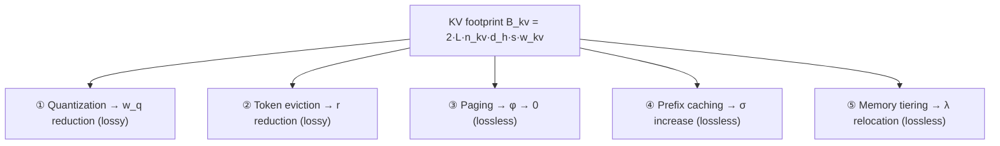

[Paper](https://arxiv.org/abs/2609.30854v1)
## The KV Cache Is the New Memory Wall: Three Regimes and Five Domains of Long-Context LLM Inference

> **TL;DR** — Long-context LLM decode inference is bound by memory bandwidth, not arithmetic, and once context length crosses a specific computable "crossover" point, the bottleneck shifts from model weights to the KV cache. This paper unifies the five families of techniques that aim to reduce the KV cache (quantization, token eviction, paging, prefix caching, tiering) into a single footprint model, derives exact crossover context lengths and speedup ceilings on roofline maps of the H100/B200/MI300X, and realigns results that were measured in different settings and could not be compared onto a single coordinate system.

## Key Idea

The paper *"The KV Cache Is the New Memory Wall"* (arXiv:2609.30854, Tejinder Singh, Dell Technologies) is a **Systematization of Knowledge (SoK)** paper. Rather than proposing a new algorithm, it binds scattered KV cache optimization literature into a single analytical framework. The core claims are three.

- **Decode is inherently memory-bound.** At batch 1, the arithmetic intensity of BF16 weights is only $1$ FLOP/B, just $1/295$ of the H100's ridge point of $295$ FLOP/B (source: §1.1).
- **The bottleneck transfers from weights → KV cache at a computable point.** Once context length $s$ exceeds the threshold $s^{*}(b)$, per-step KV bytes overtake weight bytes. This threshold drops hyperbolically with batch size $b$ (source: §3.4).
- **The five domains scale mutually orthogonal factors, and three regimes exist.** The reason the same 2-bit quantization yields $1.25\times$ at batch 1 and $4.82\times$ at batch 32 is that "the algorithm didn't change — the regime did" (source: §4.2, Tab. 7).

The authors manage reported figures with a measurement protocol that **never mixes derived and reported values in a single cell** (source: App. C).

## Background: The Problem They Solved

An autoregressive LLM generates tokens one at a time, and at every decode step it reads all Key/Value vector pairs of every token processed so far (the KV cache) and performs attention (source: §1). The byte size of the KV cache grows **linearly** with context length.

$$
B_{kv}(s) = 2 \, L \, n_{kv} \, d_h \, s \, w_{kv}
$$

where $L$ is the number of layers, $n_{kv}$ is the number of KV heads per layer, $d_h$ is the head dimension, $s$ is the context length, and $w_{kv}$ is the number of bytes per element. The factor 2 is because Key and Value are stored separately. Concretely, Llama-3-70B ($L=80$, $n_{kv}=8$, $d_h=128$) consumes **327,680 bytes (0.33 MB) per token** in BF16 (source: §2.1, Tab. 1).

The scale of the problem shows in three figures.

| Item | Value | Source |
|---|---:|---|
| Llama-3-70B weights (BF16) | 140 GB (exceeds the 80 GB HBM of the H100) | §1.2 |
| KV cache of one 128k-token sequence | 42 GB additional | §1.2 |
| KV cache of one $10^{6}$-token sequence | 328 GB (more than the total HBM of 4 H100s) | §1.2 |

**MHA → GQA → MLA** structural improvements only reduce the constant; they cannot change the law of linear growth in $s$. Looking at the per-token cost by architecture in Table 1, the constants differ by up to $12\times$ (DeepSeek-V2's MLA is the lowest at $0.07$ MB/token), but all are linear (source: §2.1).

The more fundamental problem is the **incomparability of the evidence base**. The authors point out three methodological flaws in the existing literature (source: §1.4).

1. There is no common analytical model for KV memory traffic, so each paper reports speedup against a baseline with different batching policy, kernels, and cache layout.
2. **Hardware topology is ignored.** The B200 bundles 2 dies via NV-HBI and the MI300X bundles 8 chiplets, so the datasheet total bandwidth does not reach all SMs evenly.
3. **Quality is reported on incompatible scales.** Perplexity, needle-retrieval accuracy, and downstream task scores are all different, and almost no study reports throughput and quality simultaneously under one protocol.

> The authors' one-line summary: "Almost every published number is right on its own. But almost none of them can be interpreted together." (source: §1.4)

## A New Approach: Unified Footprint Model + Roofline Map

The paper has four contributions (source: §1.5).

1. Formalize the KV cache structure and categorize the literature into 5 domains.
2. A **closed-form** derivation expressing decode arithmetic intensity as a decreasing function of context length.
3. A roofline model reflecting the topology constraints of the H100/B200/MI300X and a derivation of the crossover context length.
4. Evaluate one representative technique per domain on a standard 128k-context workload, **separating derived and reported values**.

Every technique reduces to scaling some factor of a single unified footprint model (source: §2.2).

$$
B_{kv}^{\mathrm{eff}}(s) = \underbrace{2 \, L \, n_{kv} \, d_h}_{\text{architecture}} \cdot \underbrace{w_q}_{\text{quantization}} \cdot \underbrace{r}_{\text{eviction}} \cdot \underbrace{s}_{\text{context}} \cdot \underbrace{\sigma^{-1}}_{\text{sharing}} \cdot \underbrace{(1 + \phi)}_{\text{fragmentation}}
$$

- $w_q$ : storage width after quantization, $r \in (0,1]$ : retention ratio after eviction, $\sigma \ge 1$ : sharing factor, $\phi \ge 0$ : fragmentation waste.

The five domains touch **different factors** of this model (source: §2.2, Tab. 2).

| Domain | Mechanism | Scale | Lossless | Representative technique |
|---|---|---|---|---|
| Quantization | Store K/V at $w_q < w$ | $w_q$ | No | KIVI, KVQuant, QServe |
| Token eviction | Keep ratio $r$ of the $s$ positions | $r$ | No | StreamingLLM, H2O, SnapKV, PyramidKV |
| KV paging | Fixed-size block allocation | $\phi$ | Yes | PagedAttention |
| Prefix caching | Eliminate duplicate shared prefixes | $\sigma$ | Yes | RadixAttention, LMCache |
| Memory tiering | Move between HBM/DRAM/NVMe | $\lambda$ | Yes* | FlexGen, CacheGen |

*The transport codec (CacheGen) can optionally quantize and make the link lossy (source: Tab. 2).

The authors note that the domains combine **multiplicatively** at the byte level, and that 2-bit quantization ($w_q=w/8$) + 50% retention ($r=0.5$) + sharing factor $\sigma=4$ reduces the footprint to $1/64$. However, the quality cost is not multiplicative, so joint validation is essential (source: §2.6).

## How It Works: Following Along with Numbers

The backbone of the core analysis is **exact FLOP/byte accounting** of one decode step. For batch $b$ and context $s$ (source: §3.1):

$$
F(s,b) = b\,(2P + 4 L n_q d_h s), \qquad
B(s,b) = P w_p + 2 b L n_{kv} d_h s w_{kv}
$$

Weights are read once per step regardless of batch, and KV bytes are proportional to batch because each sequence owns its own cache. Arithmetic intensity is the ratio of the two.

$$
\mathrm{AI}(s,b) = \frac{b\,(2P + 4 L n_q d_h s)}{P w_p + 2 b L n_{kv} d_h s w_{kv}}
$$

Two limits define the operating regimes (source: §3.2).

$$
\lim_{s \to 0} \mathrm{AI}(s,b) = \frac{2b}{w_p}, \qquad
\lim_{s \to \infty} \mathrm{AI}(s,b) = \frac{2 n_q}{n_{kv} w_{kv}} = \frac{2g}{w_{kv}}
$$

At short context, intensity is proportional to batch, but at long context it is **fixed** by the GQA group factor $g=n_q/n_{kv}$ and the KV storage precision, and batch cancels exactly. With BF16 + $g=8$, the floor is $8$ FLOP/B. Even raising the floor to $64$ FLOP/B with 2-bit storage still leaves it $4.6\times$ below the H100 ridge ($295$), so **no realistic precision can make decode compute-bound** (source: §3.2).

### Concrete Example: Computing the Crossover for Llama-3-70B

Below is a step-by-step reconstruction of the derivation in §3.4–3.5 of the paper.

**Step 1 — Collect the constants.** For Llama-3-70B, $P = 70\times10^{9}$ parameters, $w_p = 2$ bytes (BF16), $L=80$, $n_{kv}=8$, $d_h=128$, $w_{kv}=2$ bytes.

**Step 2 — KV bytes per token.** $2 \times 80 \times 8 \times 128 \times 2 = 327{,}680$ bytes $= 0.33$ MB (source: §2.1).

**Step 3 — Weight bytes.** $P w_p = 140$ GB.

**Step 4 — Crossover context length.** Setting per-step KV bytes ($b\,s \cdot 327{,}680$) equal to weight bytes ($140$ GB) (source: §3.4):

$$
s^{*}(b) = \frac{P w_p}{2 b L n_{kv} d_h w_{kv}} = \frac{1.40\times10^{11}}{b \times 327{,}680}
$$

At $b=1$, $s^{*} = 427.2$k tokens; at $b=32$, $13.4$k tokens. **Increasing the batch brings the crossover earlier.**

**Step 5 — Speedup structure.** In the memory-bound regime, step time is bytes ÷ bandwidth, so when KV bytes are reduced by a factor $c$, the speedup is (source: §3.5):

$$
S(c;s,b) = \frac{P w_p + 2 b L n_{kv} d_h w_{kv} s}{P w_p + 2 b L n_{kv} d_h (w_{kv}/c)\,s}, \qquad
\lim_{s\to 0} S = 1, \quad \lim_{s\to\infty} S = c
$$

These two limits explain the contradictions in the literature. **In the weight-bound regime, compression is diluted and speedup converges to 1; in the KV-bound regime it converges to the compression factor itself.** For example, 2-bit ($c=8$) at $b=1$, $s=128$k (**below** the crossover of $427.2$k) yields only $S = (140+41.9)/(140+41.9/8) = 1.25\times$, but at $b=1$, $s=512$k (**above** the crossover) it becomes $S = (140+167.8)/(140+167.8/8) = 1.91\times$ (source: §3.5, Tab. 5). The effect of the same algorithm differs by more than 50% depending on which side of the crossover it is on.

## Validation: Key Results

The evaluation protocol fixes the model (Llama-3-70B), hardware (B200, striped pages), and context (128k), and cites only the paper's reported values for quality figures (source: §4, App. C).

### The Three-Regime Map

The skeleton of the map the authors derive is two crossovers: the **traffic crossover** $s^{*}(b)$ and the **capacity crossover** $s_{\mathrm{cap}}$ (source: §3.4).

$$
s_{\mathrm{cap}} = \frac{C_{\mathrm{hbm}} - P w_p}{2 L n_{kv} d_h w_{kv}}
$$

| Model | $b{=}1$ | $b{=}8$ | $b{=}32$ | $b{=}128$ | $b{=}256$ |
|---|---:|---:|---:|---:|---:|
| Llama-3-8B | 122.5k | 15.3k | 3.8k | 957 | 479 |
| Llama-3-70B | 427.2k | 53.4k | 13.4k | 3.3k | 1.7k |
| Llama-3.1-405B | 1.57M | 196.2k | 49.0k | 12.3k | 6.1k |

(source: Tab. 4 — above this threshold, per-step KV traffic overtakes weight traffic.)

The capacity crossover is more dramatic. Llama-3-8B reaches $488$k tokens on the H100, while Llama-3-70B on the H100 has a **negative numerator (weights are already 140 GB, exceeding 80 GB) and simply cannot be loaded**, and on the B200/MI300X the limit is $159$k tokens. For 405B it is negative on all three devices (source: §3.4). **At the largest scales, what binds first is capacity, not bandwidth, and this is exactly where tiering is needed.**

From this, three regimes are defined (source: §3.5, §5.1): for $s < s^{*}$ weights dominate so KV compression is pointless; for $s^{*} < s < s_{\mathrm{cap}}$ KV dominates so byte savings translate directly into speedup; and for $s > s_{\mathrm{cap}}$ batching itself is impossible and tiering/sharding becomes mandatory.

### Hardware Topology: Placement Is the Primary Variable

The roofline ceiling $T_{\mathrm{step}} \ge B/\beta$ can use $\beta$ as the total HBM bandwidth **only when all bytes reach all compute units at that rate**. In multi-die packages this assumption breaks (source: §3.3).

| Device | Package | HBM | Total bandwidth | Per partition | BF16 | Ridge $I^{*}$ |
|---|---|---:|---:|---:|---:|---:|
| H100 SXM | Monolithic | 80 GB | 3.35 TB/s | 3.35 TB/s | 989.5 | 295 |
| B200 | 2 dies, NV-HBI 10 TB/s | 192 GB | 8.0 TB/s | 4.0 TB/s | 2250 | 281 |
| MI300X | 8 XCD, Infinity Fabric | 192 GB | 5.3 TB/s | 0.66 TB/s | 1307 | 247 |

(source: Tab. 3. Compute rates are dense tensor-core figures in TFLOPS/s.)

Placing pages in a **striped** layout lets the B200's NV-HBI (10 TB/s) exceed the per-die rate (4 TB/s) and fully recover the total 8 TB/s, but a **pinned** layout halves it to 4 TB/s. On the MI300X, the pinned-placement penalty is **up to $8\times$** (0.66 TB/s) (source: §3.3).

Converting this to the long-context token generation rate ceiling $R_{\infty} = \beta_{\mathrm{eff}}/(2 L n_{kv} d_h w_{kv})$ (source: §3.3, Cor. 1):

| Layout | H100 | B200 striped | B200 pinned | MI300X striped | MI300X pinned |
|---|---:|---:|---:|---:|---:|
| tokens/s | 10.2M | 24.4M | 12.2M | 16.2M | 2.0M |

That is, **before applying any compression at all, placement policy alone creates a ceiling gap of up to $8\times$.** Yet the authors point out that current serving stacks allocate pages without die/stack affinity (source: §3.3, §5.3).

### The SoK Comparison Matrix: Why the Same Compression Looks Different

| Technique | $c$ | KV (GB) | W1 | W2 | Lossless | Quality delta (reported) |
|---|---|---:|---:|---:|---|---|
| BF16 paging baseline | 1× | 41.9 | 1.00× | 1.00× | — | baseline |
| KIVI, 2-bit | 8× | 5.2 | 1.25× | 4.82× | No | +0.03~0.3 ppl, LongBench ≈ baseline |
| KVQuant, 3-bit | 5.3× | 7.9 | 1.23× | 3.78× | No | <0.1 ppl, LongBench close |
| H2O, $r{=}0.5$ | 2× | 21.0 | 1.13× | 1.83× | No | 97~99% task retention |
| SnapKV, $r{=}0.25$ | 4× | 10.5 | 1.21× | 3.12× | No | 96~98% LongBench retention |
| PagedAttention | 1× | 41.9 | 1.00× | 1.00× | Yes | waste 60~80% → <4% |
| RadixAttention (W3) | $\sigma{=}2.91$ | 115.3† | 1.00× | 1.00× | Yes | warm TTFT $2.8\times$ reduction |
| CacheGen tiering | codec 4× | 41.9 | 1.00× | 1.00× | approximate | W4 fetch 0.16s vs 25.0s recompute |

† Total storage for the 8 requests of W3 (335.5 GB without sharing) (source: Tab. 7).

Three readings are key (source: §4.2).

1. **The same 2-bit quantization is $1.25\times$ in W1 and $4.82\times$ in W2** — the algorithm is identical, only the regime differs.
2. **The lossless domains move feasibility, not decode speed.** Paging turns wasted memory into available batch slots, and prefix sharing divides stored bytes by $\sigma$.
3. **Tiering barely changes decode.** Instead, it provides the economic benefit of turning a 25-second recompute into a sub-second fetch on reuse.

The reuse economics of tiering are quantified in W4. Recomputing a 128k KV cache is a derived $25.0$ s on the B200 (prefill), fetching is $0.66$ s over PCIe Gen5, $0.16$ s with a $4\times$ codec, and $12$ ms over NVLink + codec. **The fetch is $38\times$~$2{,}100\times$ faster than recompute** (source: §4.5). Meanwhile, PCIe Gen5 x16 (about 64 GB/s) is about $50\times$ below H100 HBM and NVLink (900 GB/s) is also $3.7\times$ below, so performing intra-step reads from a remote tier starves the decode loop (source: §2.5). The authors' boundary is clear: *"Tiering is for reuse between steps, not for reads within a step."*

### The Ceiling of Combinations

Placing lossy techniques on the speed–quality plane, the frontier passes through KVQuant INT8/INT4 → KIVI 2-bit → the 2-bit + eviction combination point ($6.6\times$). Paging, prefix, and tiering are lossless and lie outside this plane, and should be treated not as "alternatives" but as always-on infrastructure (source: §4.6). In W2, the combination of 2-bit ($r=0.5$) + $\sigma=2.91$ approaches $46\times$ by capacity and $6.6\times$ by decode traffic (source: §4.6).

## Our Perspective: Strengths, Limitations, and Why It Matters

### Strengths

- **A rare "accounting identity" paper.** Every closed form is a FLOP/byte identity rather than a fit to measurements, and the appendix makes the constants reproducible from raw specs (source: App. B). The concluding line, "numbers age, but the equations remain" (source: §6.3), is no exaggeration.
- **The separation of evidence tiers stands out.** The discipline of not mixing derived and reported values in a single cell (source: App. C) resolves the incomparability problem "constructively."
- **It elevates topology awareness to a mainstream metric.** The placement penalties of B200 $2\times$ / MI300X $8\times$ are a primary factor that most serving papers ignore (source: §3.3).

### Limitations

- **The assumptions behind the derived values are optimistic.** Every speedup assumes perfect kernel efficiency, full bandwidth realization, and dequantization off the critical path. Yet the paper itself cites that QServe measured **20~90% runtime overhead** when dequantization falls back to ordinary CUDA cores (source: §5.2). In other words, real speedups sit systematically below the roofline ceiling.
- **Quality deltas are not cross-comparable.** As the authors honestly admit, the quality figures are only the reported values within each paper, and benchmarks, contexts, and precisions differ (source: App. C). Speed is derived precisely, but the quality axis remains only qualitative.
- **The undisclosed fabric bandwidth of the MI300X.** The striped calculation relies on the assumption that "the on-package fabric is not the bottleneck," and this assumption holds only as an upper bound (source: §3.3, Rem. 6).
- **Focus on a single model and single hardware.** The evaluation is fixed to Llama-3-70B + B200, so generalization to structural variants such as MLA and MoE is limited.

### Why It Matters

The real contribution of this paper is not "which technique is best" but formalizing the question **"in which regime is this technique best?"** By showing that the reason the same technique splits between $1.2\times$ and $4\times$ is regime confusion, it provides a **decision map** for serving engineers to use in an era when test-time reasoning grows contexts to $10^{5}$~$10^{6}$ tokens (source: §1, §5.1).

## Next Steps: The Road Ahead

The authors present five open research directions (source: §5.5).

1. **Unified KV representation.** A single paging layout holding per-block precision + retention mask. The success criterion is implementing the 2-bit + $r=0.5$ + $\sigma=4$ combination within 20% of the $64\times$ capacity ceiling at 128k.
2. **Topology-aware placement.** Assign die/stack affinity in the block manager and recover the B200 $2\times$ / MI300X $8\times$ ceiling gap.
3. **Guaranteed learning-based eviction.** An eviction policy that gives a per-request quality bound rather than an aggregate benchmark retention rate (e.g., attention-mass coverage in the style of conformal prediction).
4. **Codec co-design for tiering.** A KV bitstream codec matched to PCIe/NVLink/Ethernet bandwidth, and an attention kernel whose decompression does not pass through HBM.
5. **A standing SoK benchmark.** A public workload suite in the style of W1~W4, a protocol that separates measurement/derivation/analysis claims, and a comparison matrix that stays current.

Compressing these directions into a single decision procedure yields the **eight design rules** of the conclusion (source: §6.2): ① identify the regime first (compute $s^{*}$, $s_{\mathrm{cap}}$); ② always turn on the lossless domains (paging, prefix); ③ for $s < s^{*}$ don't compress the cache; ④ for $s > s^{*}$ quantize first (4-bit is nearly free, 2-bit needs a structure-aware layout); ⑤ evict with $r \ge 0.5$ only when the workload allows; ⑥ for $s > s_{\mathrm{cap}}$ tier/shard, but don't do intra-step reads from a remote tier; ⑦ stripe pages in multi-die packages; ⑧ re-evaluate the map on every change.

**In short, what this paper leaves behind is not a specific technique but a coordinate system made of one footprint model, two crossover laws, three regimes, five domains, and eight rules.** As long as test-time reasoning turns compute into context and context into KV state, this coordinate system survives even as models and accelerators change (source: §6.3).

<!-- verbatim-tables -->

## Tables from the paper

> Tables converted mechanically from the arXiv e-print LaTeX source. The numbers are the paper's own and did not pass through a model.

**Table 1. Per-token KV-cache footprint of representative architectures in BF16, computed from Eq. . $^{\dagger}$MLA stores a compressed latent vector of $(d_{c} + d_{r}) = 576$ dimensions per layer instead of full key-value pairs.**

| Model | Attn. | $L$ | $n_{q}$ | $n_{kv}$ | $d_{h}$ | MB/token |
|---|---|---|---|---|---|---|
| Llama-2-13B | MHA | 40 | 40 | 40 | 128 | 0.82 MB |
| Mixtral 8x7B | GQA | 32 | 32 | 8 | 128 | 0.13 MB |
| Llama-3-8B | GQA | 32 | 32 | 8 | 128 | 0.13 MB |
| Llama-3-70B | GQA | 80 | 64 | 8 | 128 | 0.33 MB |
| Llama-3.1-405B | GQA | 126 | 128 | 8 | 128 | 0.52 MB |
| DeepSeek-V2 | MLA | 60 | 128 | 576$^{\dagger}$ | --- | 0.07 MB |

**Table 2. Five-domain taxonomy of KV-cache mitigation. Each domain scales one factor of Eq. or relocates bytes across tiers. $^{\ast}$Transport codecs such as CacheGen optionally quantize, making the link lossy by choice.**

| Domain | Mechanism | Scales | Lossless | Representative methods |
|---|---|---|---|---|
| Quantization | Store keys and values at $w_{q} < w$ | $w_{q}$ | No | KIVI , KVQuant , QServe |
| Token eviction | Retain fraction $r$ of $s$ positions | $r$ | No | StreamingLLM , H2O , SnapKV , PyramidKV |
| KV paging | Fixed-size block allocation | $\phi$ | Yes | PagedAttention |
| Prefix caching | Deduplicate shared prefixes | $\sigma$ | Yes | RadixAttention , LMCache |
| Memory tiering | Migrate blocks across HBM, DRAM, NVMe | $\lambda$ | Yes$^{\ast}$ | FlexGen , CacheGen |

**Table 3. Hardware specification of the three benchmarked accelerators . Compute figures are dense tensor core rates in TFLOP/s. Per-partition bandwidth is aggregate bandwidth divided by die or stack count. Ridge point computed against BF16 dense compute. MI300X on-package fabric bandwidth is not publicly disclosed. Its inter-GPU Infinity Fabric runs at 896 GB/s.**

| Device | Package | HBM | $\beta_{\mathrm{agg}}$ | $\beta_{\mathrm{part}}$ | BF16 | FP8 | $I^{*}$ |
|---|---|---|---|---|---|---|---|
| H100 SXM | Monolithic | 80 GB | 3.35 TB/s | 3.35 TB/s | 989.5 | 1979 | 295 |
| B200 | 2 dies, NV-HBI 10 TB/s | 192 GB | 8.0 TB/s | 4.0 TB/s | 2250 | 4500 | 281 |
| MI300X | 8 XCDs, Infinity Fabric | 192 GB | 5.3 TB/s | 0.66 TB/s | 1307 | 2615 | 247 |

**Table 4. Traffic crossover context length $s^{*}(b)$ in tokens from Eq. , BF16 weights and cache. Above the tabulated value, per-step KV traffic exceeds weight traffic.**

| Model | $b{=}1$ | $b{=}8$ | $b{=}32$ | $b{=}128$ | $b{=}256$ |
|---|---|---|---|---|---|
| Llama-3-8B | 122.5k | 15.3k | 3.8k | 957 | 479 |
| Llama-3-70B | 427.2k | 53.4k | 13.4k | 3.3k | 1.7k |
| Llama-3.1-405B | 1.57M | 196.2k | 49.0k | 12.3k | 6.1k |

**Table 5. Worked roofline bounds for Llama-3-70B on B200 at batch one with striped pages, derived from Eqs. , , and . Derived quantities, not measurements. $T_{\mathrm{step}} = B/\beta$ with $\beta = 8.0$ TB/s; absolute times scale with realized bandwidth and ratios do not. Speedup relative to the BF16 baseline at the same context. The 128k block fits on one B200 ($181.9$ GB $\le 192$ GB). At 512k the BF16 and INT8 configurations exceed single-device capacity (307.8 and 223.9 GB against 192 GB) and are realized by sharding across two devices; the INT4 and 2-bit rows fit on one B200, and all speedup ratios are invariant to the shard count.**

| Configuration | $w_{kv}$ | KV (GB) | $T_{\mathrm{step}}$ (ms) | tok/s | Speedup | AI |
|---|---|---|---|---|---|---|
| *Context $s = 128$k, below crossover $s^{*} = 427.2$k.* |  |  |  |  |  |  |
| BF16 baseline | 16 bit | 41.9 | 22.7 | 44.0 | 1.00$\times$ | 2.6 |
| INT8 cache | 8 bit | 21.0 | 20.1 | 49.7 | 1.13$\times$ | 3.0 |
| INT4 cache | 4 bit | 10.5 | 18.8 | 53.2 | 1.21$\times$ | 3.2 |
| 2-bit cache | 2 bit | 5.2 | 18.2 | 55.1 | 1.25$\times$ | 3.3 |
| 2-bit plus $r = 0.5$ eviction | 2 bit | 2.6 | 17.8 | 56.1 | 1.28$\times$ | 3.3 |
| *Context $s = 512$k, above crossover.* |  |  |  |  |  |  |
| BF16 baseline | 16 bit | 167.8 | 38.5 | 26.0 | 1.00$\times$ | 4.8 |
| INT8 cache | 8 bit | 83.9 | 28.0 | 35.7 | 1.37$\times$ | 6.6 |
| INT4 cache | 4 bit | 41.9 | 22.7 | 44.0 | 1.69$\times$ | 8.1 |
| 2-bit cache | 2 bit | 21.0 | 20.1 | 49.7 | 1.91$\times$ | 9.2 |
| 2-bit plus $r = 0.5$ eviction | 2 bit | 10.5 | 18.8 | 53.2 | 2.05$\times$ | 9.8 |

**Table 6. Benchmark workloads. W1 and W2 isolate the batch-size lever. W3 isolates prefix sharing. W4 isolates reuse across sessions.**

| ID | Pattern | $b$ | $s$ | Binding constraint |
|---|---|---|---|---|
| W1 | Single-sequence decode | 1 | 128k | Latency, weight-dominated |
| W2 | Batched decode | 32 | 128k | Throughput, KV-dominated |
| W3 | 8 requests, 96k shared prefix plus 32k unique | 8 | 128k | Capacity and TTFT |
| W4 | Reuse after 10-minute gap | 1 | 128k | Recompute versus fetch |

**Table 7. SoK comparison matrix. Llama-3-70B, B200 with striped pages, 128k context. Byte factors and footprints are exact from Eq. . Decode speedups are derived from Eq. . Quality deltas are within-paper reported values on the benchmarks named and are not cross-comparable. $^{\dagger}$Total stored across the 8 requests of W3, versus 335.5 GB without sharing.**

| Method | $c$ | KV (GB) | W1 | W2 | Lossless | Quality delta (as reported) |
|---|---|---|---|---|---|---|
| BF16 paged baseline | 1$\times$ | 41.9 | 1.00$\times$ | 1.00$\times$ | --- | reference |
| KIVI, 2-bit | 8$\times$ | 5.2 | 1.25$\times$ | 4.82$\times$ | No | $+0.03$ to $0.3$ ppl. LongBench $\approx$ baseline |
| KVQuant, 3-bit | 5.3$\times$ | 7.9 | 1.23$\times$ | 3.78$\times$ | No | $<0.1$ ppl. LongBench near baseline |
| H2O, $r{=}0.5$ | 2$\times$ | 21.0 | 1.13$\times$ | 1.83$\times$ | No | 97 to 99% task retention reported |
| SnapKV, $r{=}0.25$ | 4$\times$ | 10.5 | 1.21$\times$ | 3.12$\times$ | No | 96 to 98% LongBench retention reported |
| PagedAttention | 1$\times$ | 41.9 | 1.00$\times$ | 1.00$\times$ | Yes | None. Waste cut from 60 to 80% to $<4$% |
| RadixAttention, W3 | $\sigma{=}2.91$ | 115.3$^{\dagger}$ | 1.00$\times$ | 1.00$\times$ | Yes | None. Derived TTFT $2.8\times$ lower on warm W3 hits (App. A) |
| CacheGen tiering | codec 4$\times$ | 41.9 | 1.00$\times$ | 1.00$\times$ | Near | Negligible loss reported. W4 fetch 0.16 s versus 25.0 s recompute |

**Table 8. Per-layer FLOP and byte accounting for one decode step, one sequence, context length $s$. Softmax is counted exactly in Eq. and omitted in the main text as lower order. KV bytes assume a single cache read; the write of the new token's key and value is a $1/s$ correction treated in Eq. .**

| Kernel | FLOPs | Bytes moved |
|---|---|---|
| QKV projection | $2 d d_{h} (n_{q} + 2 n_{kv})$ | $d d_{h} (n_{q} + 2 n_{kv})\, w_{p}$ |
| Scores $q K^{\top}$ | $2 s n_{q} d_{h}$ | $s n_{kv} d_{h}\, w_{kv}$ |
| Softmax | $3 n_{q} s$ | $0$ (on chip) |
| Value contraction | $2 s n_{q} d_{h}$ | $s n_{kv} d_{h}\, w_{kv}$ |
| Output projection | $2 d d_{h} n_{q}$ | $d d_{h} n_{q}\, w_{p}$ |
| MLP, SwiGLU | $6 d d_{ff}$ | $3 d d_{ff}\, w_{p}$ |
| Sum over $L$ layers | $2P + 4 L n_{q} d_{h} s + 3 L n_{q} s$ | $P w_{p} + 2 L n_{kv} d_{h} s w_{kv}$ |
