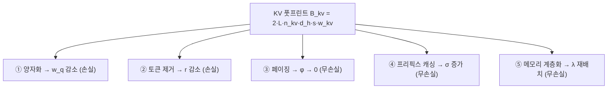

[논문 링크](https://arxiv.org/abs/2609.30854v1)
## KV 캐시가 새로운 메모리 월(Memory Wall)이다: 장문맥 LLM 추론의 세 영역과 다섯 도메인

> **TL;DR** — 장문맥 LLM의 디코드(decode) 추론은 산술 연산이 아니라 메모리 대역폭에 묶이며, 문맥 길이가 계산 가능한 특정 "크로스오버(crossover)" 지점을 넘어서면 병목이 모델 가중치에서 KV 캐시로 이동한다. 이 논문은 KV 캐시를 줄이려는 5개 기법군(양자화·토큰 제거·페이징·프리픽스 캐싱·계층화)을 하나의 풋프린트 모델로 통합하고, H100/B200/MI300X의 로플라인(roofline) 지도 위에 정확한 크로스오버 문맥 길이와 속도상승 상한을 도출해, 서로 다른 세팅에서 측정되어 비교가 불가능했던 결과들을 하나의 좌표계로 재정렬한다.

## 핵심 아이디어

논문 *"The KV Cache Is the New Memory Wall"*(arXiv:2609.30854, Tejinder Singh, Dell Technologies)는 **Systematization of Knowledge(SoK)** 논문이다. 새 알고리즘을 제안하기보다, 흩어진 KV 캐시 최적화 문헌을 하나의 분석 틀로 묶는다. 핵심 주장은 세 가지다.

- **디코드는 태생적으로 메모리 지배(memory-bound)다.** 배치 1에서 BF16 가중치의 산술 강도(arithmetic intensity)는 $1$ FLOP/B에 불과해, H100의 리지 포인트 $295$ FLOP/B의 $1/295$ 수준이다(근거: §1.1).
- **병목은 계산 가능한 지점에서 가중치 → KV 캐시로 전이한다.** 문맥 길이 $s$ 가 임계값 $s^{*}(b)$ 를 넘으면 단계당 KV 바이트가 가중치 바이트를 추월한다. 이 임계값은 배치 크기 $b$ 에 반비례(hyperbolic)로 급감한다(근거: §3.4).
- **다섯 도메인은 서로 직교하는 인자를 스케일하며, 세 영역이 존재한다.** 동일한 2-bit 양자화가 배치 1에서 $1.25\times$, 배치 32에서 $4.82\times$ 를 내는 이유는 "알고리즘이 바뀐 게 아니라 영역(regime)이 바뀐 것"이다(근거: §4.2, Tab. 7).

저자들은 보고된 수치를 **유도(derived) 값과 보고(reported) 값을 한 셀에 절대 섞지 않는** 측정 프로토콜로 관리한다(근거: App. C).

## 배경: 그들이 해결한 문제

자기회귀(autoregressive) LLM은 토큰을 하나씩 생성하며, 매 디코드 단계마다 지금까지 처리한 모든 토큰의 Key/Value 벡터 쌍(KV 캐시)을 전부 읽고 어텐션을 수행한다(근거: §1). KV 캐시의 바이트 크기는 문맥 길이에 **선형**으로 자란다.

$$
B_{kv}(s) = 2 \, L \, n_{kv} \, d_h \, s \, w_{kv}
$$

여기서 $L$ 은 레이어 수, $n_{kv}$ 는 레이어당 KV 헤드 수, $d_h$ 는 헤드 차원, $s$ 는 문맥 길이, $w_{kv}$ 는 요소당 바이트 수다. 계수 2는 Key와 Value를 각각 저장하기 때문이다. 구체적으로 Llama-3-70B($L=80$, $n_{kv}=8$, $d_h=128$)는 BF16에서 **토큰당 327,680 바이트(0.33 MB)** 를 소모한다(근거: §2.1, Tab. 1).

문제의 크기는 세 수치에서 드러난다.

| 항목 | 값 | 근거 |
|---|---:|---|
| Llama-3-70B 가중치(BF16) | 140 GB (H100의 80 GB HBM 초과) | §1.2 |
| 128k 토큰 1시퀀스의 KV 캐시 | 42 GB 추가 | §1.2 |
| $10^{6}$ 토큰 1시퀀스의 KV 캐시 | 328 GB (H100 4대 이상의 총 HBM) | §1.2 |

**MHA → GQA → MLA** 같은 구조적 개선은 상수만 줄일 뿐, $s$ 에 대한 선형 성장 법칙은 바꾸지 못한다. 표 1의 아키텍처별 토큰당 비용을 보면 상수는 최대 $12\times$ 차이가 나지만(DeepSeek-V2의 MLA가 $0.07$ MB/token으로 최저), 전부 선형이다(근거: §2.1).

더 근본적인 문제는 **근거 기반(evidence base)의 비교 불가능성**이다. 저자는 기존 문헌의 세 가지 방법론적 결함을 지적한다(근거: §1.4).

1. KV 메모리 트래픽에 대한 공통 분석 모델이 없어, 각 논문이 배치 정책·커널·캐시 레이아웃이 다른 베이스라인 대비 속도상승을 보고한다.
2. **하드웨어 토폴로지가 무시된다.** B200은 2개 다이를 NV-HBI로, MI300X는 8개 칩렛으로 묶여 있어, 데이터시트상의 총 대역폭이 모든 SM에 균등하게 도달하지 않는다.
3. **품질이 호환되지 않는 척도로 보고된다.** 퍼플렉서티·니들 검색 정확도·다운스트림 태스크 점수가 제각각이며, 처리량과 품질을 한 프로토콜로 동시에 보고한 연구는 거의 없다.

> 저자의 한 줄 정리: "거의 모든 발표 수치는 단독으로는 맞다. 그러나 거의 어떤 것도 함께 해석될 수 없다."(근거: §1.4)

## 새로운 접근법: 통합 풋프린트 모델 + 로플라인 지도

논문의 기여는 네 가지다(근거: §1.5).

1. KV 캐시 구조를 형식화하고 문헌을 5개 도메인으로 분류.
2. 디코드 산술 강도를 문맥 길이의 감소 함수로 표현하는 **폐형식(closed-form)** 유도.
3. H100/B200/MI300X의 토폴로지 제약을 반영한 로플라인 모델과 크로스오버 문맥 길이 유도.
4. 도메인당 대표 기법 1개를 128k 문맥의 표준 워크로드에서 **유도값과 보고값을 분리**해 평가.

모든 기법은 하나의 통합 풋프린트 모델의 어떤 인자를 스케일하는 것으로 환원된다(근거: §2.2).

$$
B_{kv}^{\mathrm{eff}}(s) = \underbrace{2 \, L \, n_{kv} \, d_h}_{\text{architecture}} \cdot \underbrace{w_q}_{\text{quantization}} \cdot \underbrace{r}_{\text{eviction}} \cdot \underbrace{s}_{\text{context}} \cdot \underbrace{\sigma^{-1}}_{\text{sharing}} \cdot \underbrace{(1 + \phi)}_{\text{fragmentation}}
$$

- $w_q$ : 양자화 후 저장 폭, $r \in (0,1]$ : 제거 후 유지 비율, $\sigma \ge 1$ : 공유 계수, $\phi \ge 0$ : 단편화 낭비.

다섯 도메인은 이 모델의 **서로 다른 인자**를 건드린다(근거: §2.2, Tab. 2).

| 도메인 | 메커니즘 | 스케일 | 무손실 | 대표 기법 |
|---|---|---|---|---|
| 양자화 | K/V를 $w_q < w$ 로 저장 | $w_q$ | 아니오 | KIVI, KVQuant, QServe |
| 토큰 제거 | $s$ 위치 중 비율 $r$ 유지 | $r$ | 아니오 | StreamingLLM, H2O, SnapKV, PyramidKV |
| KV 페이징 | 고정 크기 블록 할당 | $\phi$ | 예 | PagedAttention |
| 프리픽스 캐싱 | 공유 프리픽스 중복 제거 | $\sigma$ | 예 | RadixAttention, LMCache |
| 메모리 계층화 | HBM/DRAM/NVMe 간 이동 | $\lambda$ | 예* | FlexGen, CacheGen |

*운송 코덱(CacheGen)은 선택적으로 양자화해 링크를 손실로 만들 수 있다(근거: Tab. 2).

저자는 도메인들이 바이트 단위로 **곱셈적으로 조합**되며, 2-bit 양자화($w_q=w/8$) + 50% 유지($r=0.5$) + 공유 계수 $\sigma=4$ 가 풋프린트를 $1/64$ 로 줄인다고 지적한다. 다만 품질 비용은 곱셈적이지 않아 반드시 공동 검증이 필요하다(근거: §2.6).

## 작동 원리: 숫자로 따라가 보기

핵심 분석의 뼈대는 디코드 한 단계의 **정확한 FLOP/바이트 회계**다. 배치 $b$ , 문맥 $s$ 에 대해(근거: §3.1):

$$
F(s,b) = b\,(2P + 4 L n_q d_h s), \qquad
B(s,b) = P w_p + 2 b L n_{kv} d_h s w_{kv}
$$

가중치는 배치와 무관하게 단계당 한 번 읽히고, KV 바이트는 각 시퀀스가 자기 캐시를 소유하므로 배치에 비례한다. 산술 강도는 이 둘의 비다.

$$
\mathrm{AI}(s,b) = \frac{b\,(2P + 4 L n_q d_h s)}{P w_p + 2 b L n_{kv} d_h s w_{kv}}
$$

두 극한이 운영 영역을 정의한다(근거: §3.2).

$$
\lim_{s \to 0} \mathrm{AI}(s,b) = \frac{2b}{w_p}, \qquad
\lim_{s \to \infty} \mathrm{AI}(s,b) = \frac{2 n_q}{n_{kv} w_{kv}} = \frac{2g}{w_{kv}}
$$

짧은 문맥에서는 강도가 배치에 비례하지만, 긴 문맥에서는 GQA 그룹 팩터 $g=n_q/n_{kv}$ 와 KV 저장 정밀도에 **고정**되며 배치가 정확히 상쇄된다. BF16 + $g=8$ 이면 바닥은 $8$ FLOP/B다. 2-bit 저장으로 바닥을 $64$ FLOP/B까지 올려도 여전히 H100 리지($295$)의 $4.6\times$ 아래라, **어떤 현실적 정밀도로도 디코드를 연산 지배로 만들 수 없다**(근거: §3.2).

### 구체 예시: Llama-3-70B의 크로스오버 계산

아래는 논문 §3.4–3.5의 유도 과정을 단계별로 재구성한 것이다.

**1단계 — 상수 정리.** Llama-3-70B에서 $P = 70\times10^{9}$ 파라미터, $w_p = 2$ 바이트(BF16), $L=80$, $n_{kv}=8$, $d_h=128$, $w_{kv}=2$ 바이트.

**2단계 — 토큰당 KV 바이트.** $2 \times 80 \times 8 \times 128 \times 2 = 327{,}680$ 바이트 $= 0.33$ MB(근거: §2.1).

**3단계 — 가중치 바이트.** $P w_p = 140$ GB.

**4단계 — 크로스오버 문맥 길이.** 단계당 KV 바이트($b\,s \cdot 327{,}680$)와 가중치 바이트($140$ GB)를 같다고 두면(근거: §3.4):

$$
s^{*}(b) = \frac{P w_p}{2 b L n_{kv} d_h w_{kv}} = \frac{1.40\times10^{11}}{b \times 327{,}680}
$$

$b=1$ 이면 $s^{*} = 427.2$k 토큰, $b=32$ 이면 $13.4$k 토큰이다. **배치를 키우면 크로스오버가 더 일찍 온다.**

**5단계 — 속도상승 구조.** 메모리 지배 영역에서 단계 시간은 바이트 ÷ 대역폭이므로, KV 바이트를 $c$ 배 줄일 때 속도상승은(근거: §3.5):

$$
S(c;s,b) = \frac{P w_p + 2 b L n_{kv} d_h w_{kv} s}{P w_p + 2 b L n_{kv} d_h (w_{kv}/c)\,s}, \qquad
\lim_{s\to 0} S = 1, \quad \lim_{s\to\infty} S = c
$$

이 두 극한이 문헌의 모순을 설명한다. **가중치 지배 영역에서는 압축이 희석되어 속도상승이 1로 수렴하고, KV 지배 영역에서는 압축 계수 그대로 수렴한다.** 예컨대 2-bit($c=8$)는 $b=1$, $s=128$k(크로스오버 $427.2$k **아래**)에서 $S = (140+41.9)/(140+41.9/8) = 1.25\times$ 에 그치지만, $b=1$, $s=512$k(크로스오버 **위**)에서는 $S = (140+167.8)/(140+167.8/8) = 1.91\times$ 가 된다(근거: §3.5, Tab. 5). 같은 알고리즘의 효과가 어느 쪽 크로스오버에 있는지에 따라 50% 이상 달라진다.

## 성능 검증: 주요 결과

평가 프로토콜은 모델(Llama-3-70B), 하드웨어(B200, 스트라이프 페이지), 문맥(128k)을 고정하고, 품질 수치는 오직 논문 내 보고값만을 인용한다(근거: §4, App. C).

### 세 영역 지도

저자가 도출한 지도의 골격은 두 크로스오버다. **트래픽 크로스오버** $s^{*}(b)$ 와 **용량 크로스오버** $s_{\mathrm{cap}}$ 이다(근거: §3.4).

$$
s_{\mathrm{cap}} = \frac{C_{\mathrm{hbm}} - P w_p}{2 L n_{kv} d_h w_{kv}}
$$

| 모델 | $b{=}1$ | $b{=}8$ | $b{=}32$ | $b{=}128$ | $b{=}256$ |
|---|---:|---:|---:|---:|---:|
| Llama-3-8B | 122.5k | 15.3k | 3.8k | 957 | 479 |
| Llama-3-70B | 427.2k | 53.4k | 13.4k | 3.3k | 1.7k |
| Llama-3.1-405B | 1.57M | 196.2k | 49.0k | 12.3k | 6.1k |

(근거: Tab. 4 — 이 임계값 위에서 단계당 KV 트래픽이 가중치 트래픽을 추월한다.)

용량 크로스오버는 더 극적이다. Llama-3-8B는 H100에서 $488$k 토큰에, Llama-3-70B는 H100에서 **분자가 음수(가중치가 이미 140 GB로 80 GB를 초과)라 아예 탑재 불가**, B200/MI300X에서 $159$k 토큰이 한계다. 405B는 세 장치 모두에서 음수다(근거: §3.4). **가장 큰 규모에서 먼저 묶는 것은 대역폭이 아니라 용량이며, 이 영역이 바로 계층화(tiering)가 필요한 지점이다.**

이로부터 세 영역이 정의된다(근거: §3.5, §5.1): $s < s^{*}$ 에서는 가중치 지배라 KV 압축이 무의미하고, $s^{*} < s < s_{\mathrm{cap}}$ 에서는 KV 지배라 바이트 절감이 그대로 속도상승이 되며, $s > s_{\mathrm{cap}}$ 에서는 배치 자체가 불가능해 계층화/샤딩이 필수가 된다.

### 하드웨어 토폴로지: 배치가 1차 결정 변수

로플라인 상한 $T_{\mathrm{step}} \ge B/\beta$ 는 **모든 바이트가 모든 계산 유닛에 그 속도로 도달할 때만** $\beta$ 를 총 HBM 대역폭으로 쓸 수 있다. 다중 다이 패키지에서는 이 가정이 깨진다(근거: §3.3).

| 장치 | 패키지 | HBM | 총 대역폭 | 파티션당 | BF16 | 리지 $I^{*}$ |
|---|---|---:|---:|---:|---:|---:|
| H100 SXM | 모놀리식 | 80 GB | 3.35 TB/s | 3.35 TB/s | 989.5 | 295 |
| B200 | 2 다이, NV-HBI 10 TB/s | 192 GB | 8.0 TB/s | 4.0 TB/s | 2250 | 281 |
| MI300X | 8 XCD, Infinity Fabric | 192 GB | 5.3 TB/s | 0.66 TB/s | 1307 | 247 |

(근거: Tab. 3. 계산 속도는 TFLOPS/s 단위의 dense 텐서코어 수치.)

페이지를 **스트라이프(striped)** 배치하면 B200은 NV-HBI(10 TB/s)가 다이당 속도(4 TB/s)를 능가해 총 8 TB/s를 온전히 회복하지만, **핀(pinned)** 배치는 4 TB/s로 절반이 된다. MI300X에서 핀 배치 페널티는 **최대 $8\times$** (0.66 TB/s)다(근거: §3.3).

이를 장문맥 토큰 생성률 상한 $R_{\infty} = \beta_{\mathrm{eff}}/(2 L n_{kv} d_h w_{kv})$ 로 환산하면(근거: §3.3, Cor. 1):

| 배치 | H100 | B200 스트라이프 | B200 핀 | MI300X 스트라이프 | MI300X 핀 |
|---|---:|---:|---:|---:|---:|
| 토큰/s | 10.2M | 24.4M | 12.2M | 16.2M | 2.0M |

즉, **압축을 하나도 적용하기 전에 배치 정책만으로 최대 $8\times$ 의 천장 차이가 난다.** 그런데 현재 서빙 스택은 다이/스택 친화성(affinity) 없이 페이지를 할당한다는 것이 저자의 지적이다(근거: §3.3, §5.3).

### SoK 비교 매트릭스: 같은 압축이 왜 다르게 보이는가

| 기법 | $c$ | KV (GB) | W1 | W2 | 무손실 | 품질 델타(보고값) |
|---|---|---:|---:|---:|---|---|
| BF16 페이징 베이스라인 | 1× | 41.9 | 1.00× | 1.00× | — | 기준 |
| KIVI, 2-bit | 8× | 5.2 | 1.25× | 4.82× | 아니오 | +0.03~0.3 ppl, LongBench ≈ 기준 |
| KVQuant, 3-bit | 5.3× | 7.9 | 1.23× | 3.78× | 아니오 | <0.1 ppl, LongBench 근접 |
| H2O, $r{=}0.5$ | 2× | 21.0 | 1.13× | 1.83× | 아니오 | 97~99% 태스크 유지 |
| SnapKV, $r{=}0.25$ | 4× | 10.5 | 1.21× | 3.12× | 아니오 | 96~98% LongBench 유지 |
| PagedAttention | 1× | 41.9 | 1.00× | 1.00× | 예 | 낭비 60~80% → <4% |
| RadixAttention (W3) | $\sigma{=}2.91$ | 115.3† | 1.00× | 1.00× | 예 | warm TTFT $2.8\times$ 절감 |
| CacheGen 계층화 | 코덱 4× | 41.9 | 1.00× | 1.00× | 근사 | W4 fetch 0.16s vs 25.0s 재계산 |

† W3의 8개 요청 총 저장량(공유 없이는 335.5 GB)(근거: Tab. 7).

세 가지 읽기가 핵심이다(근거: §4.2).

1. **같은 2-bit 양자화가 W1에서 $1.25\times$, W2에서 $4.82\times$** — 알고리즘은 동일하고 영역만 다르다.
2. **무손실 도메인은 디코드 속도가 아니라 실현가능성(feasibility)을 옮긴다.** 페이징은 버려진 메모리를 가용 배치 슬롯으로 바꾸고, 프리픽스 공유는 저장 바이트를 $\sigma$ 로 나눈다.
3. **계층화는 디코드를 거의 바꾸지 않는다.** 대신 재사용 시 25초 재계산을 1초 미만 페치로 바꾸는 경제적 이득을 준다.

계층화의 재사용 경제성은 W4에서 정량화된다. 128k KV 캐시 재계산은 B200에서 유도값 $25.0$ s(프리필), 페치는 PCIe Gen5로 $0.66$ s, $4\times$ 코덱으로 $0.16$ s, NVLink+코덱으로 $12$ ms다. **페치가 재계산보다 $38\times$~$2{,}100\times$ 빠르다**(근거: §4.5). 반면 PCIe Gen5 x16(약 64 GB/s)는 H100 HBM의 약 $50\times$ 아래이고 NVLink(900 GB/s)도 $3.7\times$ 아래라, 단계 **내부** 읽기를 원격 티어에서 하면 디코드 루프가 굶는다(근거: §2.5). 저자의 경계는 명확하다: *"계층화는 단계 사이의 재사용을 위한 것이지, 단계 내부 읽기를 위한 것이 아니다."*

### 조합의 천장

손실 기법을 속도-품질 평면에 올리면 프런티어는 KVQuant INT8/INT4 → KIVI 2-bit → 2-bit+제거 조합점($6.6\times$)을 지난다. 페이징·프리픽스·계층화는 무손실이라 이 평면 밖에 있으며, "대안"이 아니라 항상 켜는 인프라로 취급해야 한다(근거: §4.6). W2에서 2-bit($r=0.5$) + $\sigma=2.91$ 조합은 용량 기준 $46\times$, 디코드 트래픽 기준 $6.6\times$ 에 접근한다(근거: §4.6).

## 우리의 관점: 강점, 한계, 그리고 왜 중요한가

### 강점

- **희소한 "회계 항등식" 논문.** 모든 폐형식이 측정에 대한 피팅이 아니라 FLOP/바이트 항등식이며, 부록에서 상수를 원시 스펙으로부터 재현 가능하게 만든다(근거: App. B). "숫자는 낡아도 방정식은 남는다"는 결론 문장(근거: §6.3)이 과장이 아니다.
- **증거 등급 분리가 돋보인다.** 유도값과 보고값을 한 셀에 섞지 않는 규율(근거: App. C)은 비교 불가능 문제를 "구성적으로" 해결한다.
- **토폴로지 인식을 주류 지표로 끌어올렸다.** B200 $2\times$ / MI300X $8\times$ 의 배치 페널티는 대부분의 서빙 논문이 무시하는 1차 요인이다(근거: §3.3).

### 한계

- **유도값의 가정이 낙관적이다.** 모든 속도상승은 완벽한 커널 효율·완전한 대역폭 실현·디퀀타이제이션 오프 크리티컬 패스를 가정한다. 그런데 논문 스스로 QServe가 디퀀타이제이션이 일반 CUDA 코어로 폴백할 때 **20~90% 런타임 오버헤드**를 측정했다고 인용한다(근거: §5.2). 즉 실제 속도상승은 로플라인 상한보다 체계적으로 아래에 놓인다.
- **품질 델타가 교차 비교 불가능하다.** 저자가 정직하게 고백하듯, 품질 수치는 논문 내 보고값일 뿐이며 벤치마크·문맥·정밀도가 다르다(근거: App. C). 속도는 정밀하게 유도하지만 품질 축은 정성 수준에 머문다.
- **MI300X의 미공개 패브릭 대역폭.** 스트라이프 계산이 "온패키지 패브릭이 병목이 아니다"라는 가정에 의존하며, 이 가정은 상한으로서만 성립한다(근거: §3.3, Rem. 6).
- **단일 모델·단일 하드웨어에 집중.** 평가가 Llama-3-70B + B200에 고정되어, MLA·MoE 등 구조적 변형의 일반화는 제한적이다.

### 왜 중요한가

이 논문의 진짜 기여는 "어떤 기법이 최고인가"가 아니라 **"이 기법은 어느 영역에서 최고인가"** 라는 질문을 정식화한 데 있다. 같은 기법이 $1.2\times$ 와 $4\times$ 로 갈리는 원인이 영역 혼동(regime confusion)임을 보임으로써, 테스트 타임 추론(reasoning)으로 문맥이 $10^{5}$~$10^{6}$ 토큰으로 늘어나는 시대에 서빙 엔지니어가 사용할 **의사결정 지도**를 제공한다(근거: §1, §5.1).

## 다음 단계는?: 앞으로의 길

저자는 다섯 개의 열린 연구 방향을 제시한다(근거: §5.5).

1. **통합 KV 표현.** 블록별 정밀도 + 유지 마스크를 담는 단일 페이징 레이아웃. 성공 기준은 2-bit + $r=0.5$ + $\sigma=4$ 조합을 128k에서 $64\times$ 용량 상한의 20% 이내로 구현하는 것.
2. **토폴로지 인지 배치.** 블록 매니저에 다이/스택 친화성 부여, B200 $2\times$ / MI300X $8\times$ 의 천장 격차 회수.
3. **보장된 학습 기반 제거.** 집계 벤치마크 유지율이 아니라 요청별 품질 상한을 주는 제거 정책(예: conformal prediction 스타일의 어텐션-질량 커버리지).
4. **계층화용 코덱 공동설계.** PCIe/NVLink/이더넷 대역폭에 맞춘 KV 비트스트림 코덱과, 디컴프레션이 HBM을 거치지 않는 어텐션 커널.
5. **상시 SoK 벤치마크.** W1~W4 스타일의 공개 워크로드 스위트와, 측정/유도/분석 주장을 분리하는 프로토콜, 유지되는 비교 매트릭스.

이 방향들을 하나의 의사결정 절차로 압축한 것이 결론의 **여덟 가지 설계 규칙**이다(근거: §6.2): ① 영역을 먼저 식별하고($s^{*}$, $s_{\mathrm{cap}}$ 계산), ② 무손실 도메인(페이징·프리픽스)은 무조건 켜고, ③ $s < s^{*}$ 에서는 캐시를 압축하지 말고, ④ $s > s^{*}$ 에서는 먼저 양자화하고(4-bit는 거의 무료, 2-bit는 구조 인지 레이아웃 필요), ⑤ 워크로드가 허용할 때만 $r \ge 0.5$ 로 제거하고, ⑥ $s > s_{\mathrm{cap}}$ 이면 계층화/샤딩하되 단계 내부 읽기는 원격 티어에서 하지 말고, ⑦ 다중 다이 패키지에서는 페이지를 스트라이프하고, ⑧ 모든 변경 시 지도를 재평가한다.

**요컨대 이 논문이 남긴 것은 특정 기법이 아니라, 하나의 풋프린트 모델·두 개의 크로스오버 법칙·세 영역·다섯 도메인·여덟 규칙으로 이뤄진 좌표계다.** 테스트 타임 추론이 계산을 문맥으로, 문맥을 KV 상태로 바꾸는 한, 이 좌표계는 모델과 가속기가 바뀌어도 살아남는다(근거: §6.3).

<!-- verbatim-tables -->

## 논문 원문의 표

> arXiv e-print 의 LaTeX 원본에서 기계적으로 옮긴 표입니다. 숫자는 논문의 값이며 모델을 거치지 않았습니다.

**표 1. Per-token KV-cache footprint of representative architectures in BF16, computed from Eq. . $^{\dagger}$MLA stores a compressed latent vector of $(d_{c} + d_{r}) = 576$ dimensions per layer instead of full key-value pairs.**

| Model | Attn. | $L$ | $n_{q}$ | $n_{kv}$ | $d_{h}$ | MB/token |
|---|---|---|---|---|---|---|
| Llama-2-13B | MHA | 40 | 40 | 40 | 128 | 0.82 MB |
| Mixtral 8x7B | GQA | 32 | 32 | 8 | 128 | 0.13 MB |
| Llama-3-8B | GQA | 32 | 32 | 8 | 128 | 0.13 MB |
| Llama-3-70B | GQA | 80 | 64 | 8 | 128 | 0.33 MB |
| Llama-3.1-405B | GQA | 126 | 128 | 8 | 128 | 0.52 MB |
| DeepSeek-V2 | MLA | 60 | 128 | 576$^{\dagger}$ | --- | 0.07 MB |

**표 2. Five-domain taxonomy of KV-cache mitigation. Each domain scales one factor of Eq. or relocates bytes across tiers. $^{\ast}$Transport codecs such as CacheGen optionally quantize, making the link lossy by choice.**

| Domain | Mechanism | Scales | Lossless | Representative methods |
|---|---|---|---|---|
| Quantization | Store keys and values at $w_{q} < w$ | $w_{q}$ | No | KIVI , KVQuant , QServe |
| Token eviction | Retain fraction $r$ of $s$ positions | $r$ | No | StreamingLLM , H2O , SnapKV , PyramidKV |
| KV paging | Fixed-size block allocation | $\phi$ | Yes | PagedAttention |
| Prefix caching | Deduplicate shared prefixes | $\sigma$ | Yes | RadixAttention , LMCache |
| Memory tiering | Migrate blocks across HBM, DRAM, NVMe | $\lambda$ | Yes$^{\ast}$ | FlexGen , CacheGen |

**표 3. Hardware specification of the three benchmarked accelerators . Compute figures are dense tensor core rates in TFLOP/s. Per-partition bandwidth is aggregate bandwidth divided by die or stack count. Ridge point computed against BF16 dense compute. MI300X on-package fabric bandwidth is not publicly disclosed. Its inter-GPU Infinity Fabric runs at 896 GB/s.**

| Device | Package | HBM | $\beta_{\mathrm{agg}}$ | $\beta_{\mathrm{part}}$ | BF16 | FP8 | $I^{*}$ |
|---|---|---|---|---|---|---|---|
| H100 SXM | Monolithic | 80 GB | 3.35 TB/s | 3.35 TB/s | 989.5 | 1979 | 295 |
| B200 | 2 dies, NV-HBI 10 TB/s | 192 GB | 8.0 TB/s | 4.0 TB/s | 2250 | 4500 | 281 |
| MI300X | 8 XCDs, Infinity Fabric | 192 GB | 5.3 TB/s | 0.66 TB/s | 1307 | 2615 | 247 |

**표 4. Traffic crossover context length $s^{*}(b)$ in tokens from Eq. , BF16 weights and cache. Above the tabulated value, per-step KV traffic exceeds weight traffic.**

| Model | $b{=}1$ | $b{=}8$ | $b{=}32$ | $b{=}128$ | $b{=}256$ |
|---|---|---|---|---|---|
| Llama-3-8B | 122.5k | 15.3k | 3.8k | 957 | 479 |
| Llama-3-70B | 427.2k | 53.4k | 13.4k | 3.3k | 1.7k |
| Llama-3.1-405B | 1.57M | 196.2k | 49.0k | 12.3k | 6.1k |

**표 5. Worked roofline bounds for Llama-3-70B on B200 at batch one with striped pages, derived from Eqs. , , and . Derived quantities, not measurements. $T_{\mathrm{step}} = B/\beta$ with $\beta = 8.0$ TB/s; absolute times scale with realized bandwidth and ratios do not. Speedup relative to the BF16 baseline at the same context. The 128k block fits on one B200 ($181.9$ GB $\le 192$ GB). At 512k the BF16 and INT8 configurations exceed single-device capacity (307.8 and 223.9 GB against 192 GB) and are realized by sharding across two devices; the INT4 and 2-bit rows fit on one B200, and all speedup ratios are invariant to the shard count.**

| Configuration | $w_{kv}$ | KV (GB) | $T_{\mathrm{step}}$ (ms) | tok/s | Speedup | AI |
|---|---|---|---|---|---|---|
| *Context $s = 128$k, below crossover $s^{*} = 427.2$k.* |  |  |  |  |  |  |
| BF16 baseline | 16 bit | 41.9 | 22.7 | 44.0 | 1.00$\times$ | 2.6 |
| INT8 cache | 8 bit | 21.0 | 20.1 | 49.7 | 1.13$\times$ | 3.0 |
| INT4 cache | 4 bit | 10.5 | 18.8 | 53.2 | 1.21$\times$ | 3.2 |
| 2-bit cache | 2 bit | 5.2 | 18.2 | 55.1 | 1.25$\times$ | 3.3 |
| 2-bit plus $r = 0.5$ eviction | 2 bit | 2.6 | 17.8 | 56.1 | 1.28$\times$ | 3.3 |
| *Context $s = 512$k, above crossover.* |  |  |  |  |  |  |
| BF16 baseline | 16 bit | 167.8 | 38.5 | 26.0 | 1.00$\times$ | 4.8 |
| INT8 cache | 8 bit | 83.9 | 28.0 | 35.7 | 1.37$\times$ | 6.6 |
| INT4 cache | 4 bit | 41.9 | 22.7 | 44.0 | 1.69$\times$ | 8.1 |
| 2-bit cache | 2 bit | 21.0 | 20.1 | 49.7 | 1.91$\times$ | 9.2 |
| 2-bit plus $r = 0.5$ eviction | 2 bit | 10.5 | 18.8 | 53.2 | 2.05$\times$ | 9.8 |

**표 6. Benchmark workloads. W1 and W2 isolate the batch-size lever. W3 isolates prefix sharing. W4 isolates reuse across sessions.**

| ID | Pattern | $b$ | $s$ | Binding constraint |
|---|---|---|---|---|
| W1 | Single-sequence decode | 1 | 128k | Latency, weight-dominated |
| W2 | Batched decode | 32 | 128k | Throughput, KV-dominated |
| W3 | 8 requests, 96k shared prefix plus 32k unique | 8 | 128k | Capacity and TTFT |
| W4 | Reuse after 10-minute gap | 1 | 128k | Recompute versus fetch |

**표 7. SoK comparison matrix. Llama-3-70B, B200 with striped pages, 128k context. Byte factors and footprints are exact from Eq. . Decode speedups are derived from Eq. . Quality deltas are within-paper reported values on the benchmarks named and are not cross-comparable. $^{\dagger}$Total stored across the 8 requests of W3, versus 335.5 GB without sharing.**

| Method | $c$ | KV (GB) | W1 | W2 | Lossless | Quality delta (as reported) |
|---|---|---|---|---|---|---|
| BF16 paged baseline | 1$\times$ | 41.9 | 1.00$\times$ | 1.00$\times$ | --- | reference |
| KIVI, 2-bit | 8$\times$ | 5.2 | 1.25$\times$ | 4.82$\times$ | No | $+0.03$ to $0.3$ ppl. LongBench $\approx$ baseline |
| KVQuant, 3-bit | 5.3$\times$ | 7.9 | 1.23$\times$ | 3.78$\times$ | No | $<0.1$ ppl. LongBench near baseline |
| H2O, $r{=}0.5$ | 2$\times$ | 21.0 | 1.13$\times$ | 1.83$\times$ | No | 97 to 99% task retention reported |
| SnapKV, $r{=}0.25$ | 4$\times$ | 10.5 | 1.21$\times$ | 3.12$\times$ | No | 96 to 98% LongBench retention reported |
| PagedAttention | 1$\times$ | 41.9 | 1.00$\times$ | 1.00$\times$ | Yes | None. Waste cut from 60 to 80% to $<4$% |
| RadixAttention, W3 | $\sigma{=}2.91$ | 115.3$^{\dagger}$ | 1.00$\times$ | 1.00$\times$ | Yes | None. Derived TTFT $2.8\times$ lower on warm W3 hits (App. A) |
| CacheGen tiering | codec 4$\times$ | 41.9 | 1.00$\times$ | 1.00$\times$ | Near | Negligible loss reported. W4 fetch 0.16 s versus 25.0 s recompute |

**표 8. Per-layer FLOP and byte accounting for one decode step, one sequence, context length $s$. Softmax is counted exactly in Eq. and omitted in the main text as lower order. KV bytes assume a single cache read; the write of the new token's key and value is a $1/s$ correction treated in Eq. .**

| Kernel | FLOPs | Bytes moved |
|---|---|---|
| QKV projection | $2 d d_{h} (n_{q} + 2 n_{kv})$ | $d d_{h} (n_{q} + 2 n_{kv})\, w_{p}$ |
| Scores $q K^{\top}$ | $2 s n_{q} d_{h}$ | $s n_{kv} d_{h}\, w_{kv}$ |
| Softmax | $3 n_{q} s$ | $0$ (on chip) |
| Value contraction | $2 s n_{q} d_{h}$ | $s n_{kv} d_{h}\, w_{kv}$ |
| Output projection | $2 d d_{h} n_{q}$ | $d d_{h} n_{q}\, w_{p}$ |
| MLP, SwiGLU | $6 d d_{ff}$ | $3 d d_{ff}\, w_{p}$ |
| Sum over $L$ layers | $2P + 4 L n_{q} d_{h} s + 3 L n_{q} s$ | $P w_{p} + 2 L n_{kv} d_{h} s w_{kv}$ |
