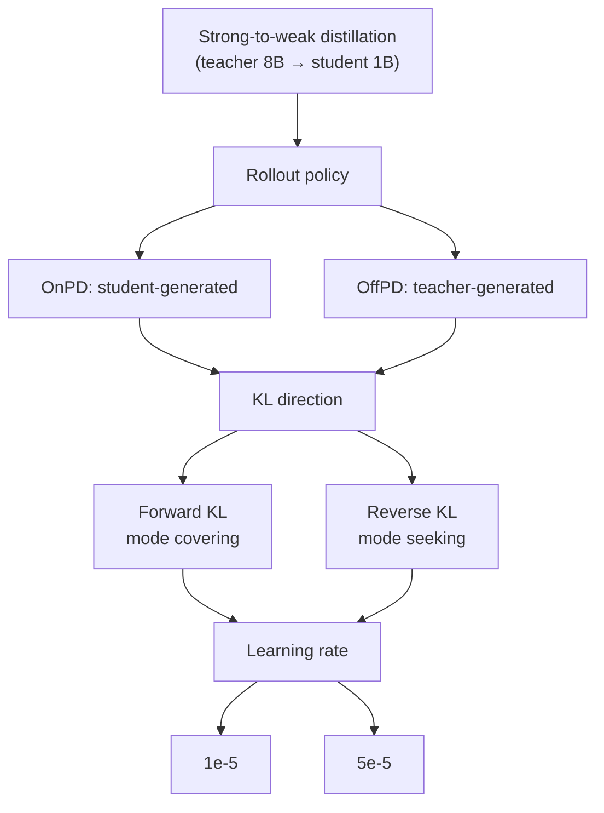

## On-Policy Is Not a Panacea: The Real Protagonists of Rollout Policy, KL Direction, and Learning Rate in Distillation Dynamics

> **TL;DR** — When we separate on-policy (OnPD) and off-policy (OffPD) distillation in strong-to-weak distillation, what determines final performance, forgetting, and update sparsity is not the rollout policy but the **KL direction** and the **learning rate**. Forward KL is surprisingly robust to the rollout policy, reverse KL is sensitive, and forgetting and update sparsity are essentially entirely decided by the learning rate.

---

### Core Idea

A popular hypothesis in recent LLM post-training is that "on-policy data is better." That is, the claim that training on data generated by the model being trained reduces forgetting, makes parameter updates sparser, and improves generalization (source: §1). The central claim of this paper is that **this causal relationship has never been verified**.

The authors cleanly disentangle this question with a single design trick. Instead of directly comparing SFT (off-policy) and RLVR (on-policy), they use **strong-to-weak distillation** as a controlled testbed (source: §1). This is because in distillation one can change only the "policy that generates the data (rollout policy)" while leaving the rest of the pipeline fixed. Adding two variables here, they independently vary **rollout policy × KL direction × learning rate**, and along these three axes measure (1) final accuracy, (2) catastrophic forgetting, and (3) update sparsity.

To state the conclusion up front, once the three axes are separated, the "superiority of on-policy" largely disappears (source: §4).

---

### Background: The Problem They Solved

Prior studies comparing SFT and RLVR changed too many things at once. Because the training objective, the presence of a reward signal, supervision density, the optimization procedure, and the learning rate all changed simultaneously, it was impossible to tell which of the observed differences came from "on-policy data" (source: §1, §2).

In particular, three claims have been credited to on-policy data (source: §2):

- **Reduced forgetting** — On-policy training preserves prior capabilities and reduces catastrophic forgetting
- **Sparse updates** — On-policy training produces sparser parameter changes
- **Improved generalization** — It performs better on tasks outside the training distribution

The problem is that all of this evidence came from comparing SFT vs RLVR checkpoints or analyzing public checkpoints produced with different recipes (source: §2). Moreover, on-policy distillation (OnPD) has conventionally been paired with reverse KL and off-policy distillation (OffPD) with forward KL, but these two choices are in fact independent design variables (source: §3).

**The gap this paper fills** is exactly this: there was no study measuring the causal role of the rollout policy while holding other factors fixed.

---

### New Approach: Controlled Strong-to-Weak Distillation + Rollout Policy Spectrum

#### Experimental Design: Factorial Separation of Three Factors

The authors distill from a Llama-3.1-8B teacher → Llama-3.2-1B student (and Qwen2.5-7B → Qwen2.5-1.5B), using three reasoning tasks: medical (MedReason), science (Science), and arithmetic (Countdown-3) (source: §4). The student is **fully parameter fine-tuned** without LoRA for 150 steps with 3 seeds.

Let's start by laying out the key definitions. Given a prompt $x$ and a partial generation $y_{<n}$, the distillation objective is as follows (source: §3):

$$
\mathcal{L}(\theta) = \mathbb{E}_{x \sim p_{\mathrm{data}}} \mathbb{E}_{y \sim \rho(\cdot|x)} \left[ \frac{1}{L_y}\sum_{n=1}^{L_y} \mathcal{D}\left(\pi_S^\theta(\cdot|x,y_{<n}) \,||\, \pi_T(\cdot|x,y_{<n})\right) \right]
$$

Here the rollout policy $\rho$ is **OffPD** if it is the teacher and **OnPD** if it is the student. The distance function $\mathcal{D}$ is the KL divergence, which splits into two kinds depending on direction (source: §3):

$$
D_{\text{F-KL}}(\pi_S,\pi_T) = \sum_{v\in\mathcal{V}} \pi_T(v)\log\frac{\pi_T(v)}{\pi_S(v)},
\qquad
D_{\text{R-KL}}(\pi_S,\pi_T) = \sum_{v\in\mathcal{V}} \pi_S(v)\log\frac{\pi_S(v)}{\pi_T(v)}
$$

forward KL is **mode covering**, which strongly penalizes missing tokens the teacher assigns high probability to, while reverse KL is **mode seeking**, focusing on tokens the student prefers (source: §3). This paper computes KL over the entire vocabulary, which allowed it to freely cross the KL direction with the rollout policy.

#### Rollout Policy Spectrum: A Continuum Connecting OnPD and OffPD

To answer "when does the rollout policy really matter?", the authors define a **rollout policy spectrum** that continuously interpolates between the student and teacher policies with a single parameter $\lambda$ (source: §5):

$$
(z_\lambda)_v = \frac{1}{2}\left(\log\pi_S(v)+\log\pi_T(v)\right) + \frac{\lambda}{2}\left(\log\pi_S(v)-\log\pi_T(v)\right)
$$

- $\lambda = -1$ → pure OffPD (teacher-generated)
- $\lambda = 0$ → geometric mean midpoint
- $\lambda = +1$ → pure OnPD (student-generated)
- $\lambda < -1$ / $\lambda > 1$ → **extrapolation** toward the tokens each policy prefers

The figure above shows how the student and teacher likelihoods for generation trajectories diverge as $\lambda$ moves. Thanks to this tool, beyond the dichotomy of "OnPD is good/bad," we could precisely observe how performance responds as the rollout distribution is pushed bit by bit.

---

### How It Works: Why Forward KL Is Robust and Reverse KL Is Sensitive

The most elegant part of this paper is the **gradient analysis**. It explains, through the structure of token-level gradients, why forward KL and reverse KL respond so differently to the rollout policy.

Letting the student logits be $z_S^\theta$, the parameter gradients of the two KLs at a fixed prefix are (source: §5, App):

$$
\nabla_\theta D_{\text{F-KL}} = \sum_{v\in\mathcal{V}} \left(\pi_S^\theta(v)-\pi_T(v)\right)\nabla_\theta(z_S^\theta)_v
$$

$$
\nabla_\theta D_{\text{R-KL}} = \sum_{v\in\mathcal{V}} \pi_S^\theta(v)\left[\log\frac{\pi_S^\theta(v)}{\pi_T(v)} - D_{\text{R-KL}}\right]\nabla_\theta(z_S^\theta)_v
$$

#### Toy Example: Asymmetry Seen with a 2-Token Vocabulary

Imagine an extreme situation where the vocabulary consists of only two tokens, $\{A, B\}$.

- The teacher sees token $A$ extremely rarely: $\pi_T = (\delta, 1-\delta)$, where $\delta$ is a very small value
- The student sees the two equally: $\pi_S = (0.5, 0.5)$

The logit gradient of **forward KL** is $\pi_S(v)-\pi_T(v)$, so each coordinate is always confined within $[-1,1]$ (source: §5). No matter how differently the teacher and student view things, a single coordinate of the gradient cannot exceed a magnitude of 1. Therefore, if the rollout distribution changes slightly, the expected update changes only in proportion. The paper formalizes this, showing that the semi-gradient of forward KL is Lipschitz continuous with respect to the total variation distance of the rollout distribution (source: App):

$$
\lVert \bar\nabla_\theta \mathcal{L}_{D_{\text{F-KL}}}(\theta;\rho) - \bar\nabla_\theta \mathcal{L}_{D_{\text{F-KL}}}(\theta;\rho') \rVert_2 \le 2\sqrt{2}\,B\,\mathbb{E}_{x}\!\left[\text{TV}(\rho(\cdot|x),\rho'(\cdot|x))\right]
$$

On the other hand, the logit gradient of **reverse KL** is weighted by $\pi_S^\theta(v)$ and contains the log-likelihood ratio $\log\frac{\pi_S^\theta(v)}{\pi_T(v)}$. In the toy example above, this gradient becomes (source: App)

$$
\frac{1}{4}\log\!\left(\frac{1-\delta}{\delta}\right)(1,-1)
$$

growing so that it **diverges to infinity** as $\delta \to 0$. When the teacher thinks "almost certainly $B$" but the student insists "$A$ is also half," that disagreement inflates the gradient without bound. The paper formalizes this and proves that for reverse KL **no distribution-independent rollout stability guarantee exists** (source: App). Only by restricting the range of the log-likelihood ratio to $R$ does one recover a similar bound.

This structural asymmetry predicts all experimental results: **forward KL is stable under changes to the rollout policy, while reverse KL depends heavily on the student-generated trajectory (on-policy).**

---

### Performance Validation: Main Results

#### Result 1 — There Is No On-Policy Advantage in Final Performance

In the average final accuracy across the three tasks, the best values of OnPD and OffPD are essentially tied: **OnPD 72% vs OffPD 73%** (source: §4, Fig. 1). Meanwhile, the KL direction produces a clear pattern. Forward KL maintains 71–73% across all rollout policies and learning rates, whereas reverse KL fluctuates **from 35% to 72%** and is extremely sensitive to the learning rate (source: §4).

#### Result 2 — Forgetting and Sparsity Are Dominated by the Learning Rate

Looking at forgetting measured as the average over 7 OOD benchmarks, at a low learning rate ($1\times10^{-5}$) the OOD performance change is **within 1.3pp**, whereas at a high learning rate ($5\times10^{-5}$) it drops sharply by **11.2–14.0pp** (source: §4). The difference between rollout policies is negligible by comparison, and in fact OffPD forgets slightly less.

Update sparsity (the fraction of parameters whose change is below $\tau=10^{-6}$) is the same: **85.3–89.6%** at the low learning rate and **51.9–60.0%** at the high learning rate (source: §4). OffPD produces updates at least as sparse as OnPD in every matched comparison. In the learning-rate sweep, sparsity **decreases almost linearly** with the learning rate (source: §4).

#### Result 3 — The KL Direction Determines When the Rollout Policy Matters

Moving $\lambda$ along the rollout spectrum sharpens the asymmetry. Forward KL maintains **accuracy above 80% across the entire spectrum**, with a fluctuation range of only **5.2pp** at a learning rate of $1\times10^{-5}$ (source: §5). Reverse KL, on the other hand, fluctuates greatly with $\lambda$, and drops sharply especially at teacher-preferred rollouts ($\lambda<0$). At low learning rates, reverse KL benefits strongly from student-preferred rollouts ($\lambda>0$).

#### Result 4 — Where On-Policy Truly Helps and Its Limits

There are differences you miss if you look at accuracy alone.

- **Output coverage**: Even at the same pass@1, forward KL gains far more in pass@10 than reverse KL — the KL direction determines output diversity (source: §5).
- **Generalization**: Moving to the harder Countdown-4E (4 operands), **on-policy rollout ($\lambda>0$) raises pass@k by 10–15% over off-policy** in both KL directions (source: §5). This is the first consistent evidence that "on-policy data helps generalization."
- **After RLVR**: However, this generalization advantage **does not persist reliably** through a subsequent RLVR stage. When RLVR is run for an additional 300 steps on Countdown-4, off-policy checkpoints that started near 0% initial accuracy actually end up with the highest final performance (source: §5).
- **Incidental style transfer**: In an experiment where the teacher was conditioned to answer in Spanish, only OnPD + reverse KL preserved the student's English style (source: §5).

#### Result 5 — The Conclusion Holds Under Three Design Choices

The conclusion is the same whether full-vocabulary KL is replaced with sampled KL, gradient clipping is removed, or the task is switched to Numina–MATH, which requires long reasoning averaging 622 tokens (teacher responses average 622 tokens) (source: §6). Removing clipping degrades only reverse KL substantially, which matches the gradient analysis above exactly.

---

### Our Perspective: Strengths, Limitations, and Why This Study Matters

#### Strengths

The biggest strength is the **cleanliness of the controlled experiment**. It elegantly removes the confounding that the SFT vs RLVR comparison committed by using distillation as a frame, and on top of that adds the continuous tool of the $\lambda$ spectrum, transcending the "OnPD vs OffPD" dichotomy. The way the theoretical gradient analysis dovetails exactly with the experimental results is also impressive. The contrast between the Lipschitz stability of forward KL and the possible infinite divergence of reverse KL is a theorem that anyone can reuse immediately when they encounter a similar phenomenon.

#### Limitations

As the authors acknowledge, the conclusion of this study is that "there is no *consistent* advantage of on-policy," not a proof of the *statistical equivalence* of OnPD and OffPD (source: §7). The scope is also limited: the student model is **at most 1.5B** and reasoning traces are **at most about 2,000 tokens** (source: §7). Some ablation experiments have only one run per condition (e.g., Numina–MATH), so the finding that "OnPD helps with long reasoning" is hedged by the authors themselves as "suggestive" (source: §6).

More fundamentally, while this study **highlights the alternative variable of the KL direction and explains why forward KL is so robust via the gradient structure**, it does not address the reward signal, supervision density, or optimization procedure of RLVR that actual practitioners use. In other words, the negative conclusion "the difference between SFT and RL cannot be explained by the rollout policy alone" is strong, but the positive answer "then what causes it?" remains open.

#### Why This Study Matters

The practical implications are clear. On-policy distillation requires continuous generation throughout training, which is expensive. This paper backs with data the warning that "there is not always a justified reason to bear that cost," and instead suggests **using OffPD as a standard baseline** (source: §7). At the same time, it gives an actionable guideline: "to reduce forgetting, lower the learning rate." This is a message directly useful to anyone designing a real-world post-training pipeline.

---

### What's Next?: The Road Ahead

The extensions the authors propose fall into two branches: scaling to **larger models** and **longer rollouts**, and exploring whether OnPD/OffPD differences emerge for **specific student-teacher combinations** (source: §7). In addition, follow-up questions worth our attention are as follows.

1. **Combination with reward signals** — This study is limited to KL distillation. If we separate how RLVR's reward and supervision density interact with the rollout policy using the same frame, we can get one step closer to "the real difference between SFT and RL."
2. **Log-likelihood ratio diagnostics** — The fact that reverse KL's instability comes from extreme $\log\frac{\pi_S}{\pi_T}$ ratios (source: App) suggests that monitoring this ratio during training could detect reverse KL collapse early. There is much room to develop this into a practical diagnostic tool.
3. **Control of style transfer** — The finding that OnPD + reverse KL suppresses incidental style transfer from the teacher is worth independently re-verifying in scenarios where one wants to prevent "unintended behavior transfer," such as personalization and safety alignment.

In one sentence: **The rollout policy is not the protagonist of distillation; the real levers are the KL direction and the learning rate. That said, in the narrow spot called "generalization," on-policy still does its part.**

<!-- verbatim-tables -->

## Tables from the paper

> Tables converted mechanically from the arXiv e-print LaTeX source. The numbers are the paper's own and did not pass through a model.

**Table 1. Task prompts used for teacher SFT and policy-distillation experiments. During SFT, the worked demonstration is supplied as the target completion rather than included in the input prompt.**

| Dataset | System prompt | User prompt |
|---|---|---|
| Countdown-3 | You are a careful arithmetic solver. | Solve the Countdown arithmetic problem. Using the provided numbers, create an equation that equals the target. You may use the operations $+$, $-$, $\times$, and $/$, and each number must be used exactly once; every division must have an integer result. Show your work in `<think>...</think>` tags and return the solution as compact, comma-separated equations in `<answer>...</answer>` tags. For example, `<answer>2+3=5,5*4=20</answer>`. The question is appended as `Numbers: [\ldots]` and `Target: \ldots`. |
| Science | You are a careful solver of multiple-choice science questions. | Given a question and four options, select the correct answer. Reason step by step in `<think>...</think>` tags and place only the corresponding option letter (A, B, C, or D) in `<answer>...</answer>` tags. The question and answer choices are appended to this instruction. |
| MedReason | You are a careful medical reasoning assistant. | Given a medical multiple-choice question and its answer choices, select the correct answer. Reason step by step in `<think>...</think>` tags and place only the letter corresponding to the correct option in `<answer>...</answer>` tags; do not repeat the answer text. The question and answer choices are appended to this instruction. |

**Table 2. In-distribution performance of the trained teachers. Results use 200 test examples per dataset, temperature $0.5$, one sampled response per prompt, and a 2,048-token completion limit. Response lengths are reported as mean $\pm$ standard deviation.**

| **Teacher** | **Dataset** | **Accuracy (%)** | **Response length (tokens)** |
|---|---|---|---|
| Qwen2.5-7B | MedReason | 77.5 | $90.95 \pm 28.58$ |
|  | Science | 72.0 | $288.82 \pm 90.38$ |
|  | Countdown-3 | 95.5 | $168.42 \pm 316.40$ |
| Llama-3.1-8B | MedReason | 85.5 | $93.74 \pm 30.81$ |
|  | Science | 67.5 | $134.65 \pm 50.77$ |
|  | Countdown-3 | 99.0 | $98.82 \pm 78.54$ |

**Table 3. Principal hyperparameters used for distillation training.**

| Hyperparameter | Value | Notes |
|---|---|---|
| Optimization steps | 150 | Reported primary comparisons use the checkpoint at step 150. |
| Optimizer | Fused AdamW | $\beta_1=0.9$, $\beta_2=0.999$, and $\epsilon=10^{-8}$. |
| Weight decay | 0 |  |
| Learning-rate schedule | Constant with linear warm-up | 10 warm-up steps. |
| Per-device batch size | 1 |  |
| Gradient accumulation | 32 steps | Gives an effective batch size of 32 prompts per optimizer step. |
| Trajectories per prompt | 1 | One completion is sampled for every selected prompt. |
| Maximum gradient norm | 1.0 |  |
| Student temperature | 1.0 | Used for student sampling and student logits in the KL objective. |
| Teacher temperature | 0.5 | Used for teacher sampling and teacher logits in the KL objective. |
| On-policy trajectory source | Student | Sampled at temperature 1.0. |
| Off-policy trajectory source | Teacher | Sampled at temperature 0.5. |
| Top-$p$ | 1.0 | Used for both on- and off-policy trajectory sampling. |
| Maximum prompt length | 2,048 tokens | Shared across datasets. |
| Maximum completion length | 512 / 1,024 tokens | 512 for Countdown-3; 1,024 for Science and MedReason. |
| Loss reduction | Mean over completion tokens | Computed over the full vocabulary at every non-padding completion position. |
| Gradient checkpointing | On-policy: enabled; off-policy: disabled | This difference is used for memory management. |

**Table 4. Training settings for RLVR on Countdown-4 after Countdown-3 distillation. These settings are identical across rollout policies, KL objectives, and learning rates used in the preceding distillation stage.**

| Setting | Value | Notes |
|---|---|---|
| Optimisation steps | 300 | Starting from each step-150 distilled checkpoint. |
| RLVR learning rate | $2\times10^{-6}$ | Shared across all 24 runs. |
| Learning-rate schedule | Cosine | Warm-up over the first 10% of steps (30 steps). |
| Optimizer | Eight-bit AdamW | Bfloat16 training. |
| Trainable parameters | LoRA adapters | Rank 256, scaling parameter 256, dropout 0; no bias adaptation. |
| Backbone weights | Frozen, loaded in four-bit precision | Gradient checkpointing enabled. |
| Per-device batch size | 8 | Gradient accumulation over 16 steps. |
| Completions per prompt | 8 | One reward-normalisation group per prompt. |
| Generation batch size | 48 completions | Six groups of eight completions. |
| Sampling | Temperature $1.0$, top-$p=0.95$ | Colocated vLLM generation. |
| Maximum prompt length | 2,048 tokens | Vanilla Countdown prompt with chat template. |
| Maximum completion length | 1,024 tokens | Shared across all configurations. |
| Loss and reward scaling | DAPO; group normalisation | No reference-model KL penalty ($\beta=0$). |
| Reward | $2$ for correctness, $0$ otherwise | No auxiliary reward terms. |
| Maximum gradient norm | $1.0$ | Global gradient clipping. |
| RLVR random seed | 42 | Distillation seeds are 42, 43, and 44. |
| Logging / checkpoint interval | 5 / 50 steps | Reward curves show logged training rewards. |

**Table 5. Experiment-specific settings for the Spanish-style transfer experiment. All unlisted training and evaluation settings follow the standard protocol.**

| Setting | Value | Notes |
|---|---|---|
| Student | `Qwen2.5-1.5B-Instruct` | Fully fine-tuned on Science. |
| Teacher | `Qwen2.5-3B-Instruct` | Frozen base instruct model; no task-specific fine-tuning. |
| Experimental grid | OnPD/OffPD $\times$ forward/reverse KL | Learning rates $\{1\times10^{-5},5\times10^{-5}\}$. |
| Random seeds | 42 | One run per condition. |
| Teacher conditioning | Correct demonstration and Spanish instruction | Used for teacher rollouts and teacher distributions. |
| Student conditioning | Vanilla Science prompt | Used for student rollouts, likelihoods, and evaluation. |
| Sampling temperature | 1.0 for OnPD and OffPD | The conditioned teacher therefore differs from the standard OffPD temperature of 0.5. |
| Distribution temperature | 1.0 for student and teacher | The teacher differs from the standard temperature of 0.5. |
| Maximum training completion length | 2,048 tokens | The standard Science experiments use 1,024 tokens. |
| Gradient checkpointing | Enabled for OnPD and OffPD | The standard OffPD runs disable gradient checkpointing. |
| Style evaluation | 1,000 responses per condition | 200 each from Science train and test, MedReason test, GSM8K test, and Countdown-3 test. |

**Table 6. Learning rates used to produce the checkpoints in the main RL comparison and the explicit SFT comparison of . ``From'' denotes the checkpoint against which parameter-update sparsity is measured. Rates refer to the language model or policy actor, using the peak rate where a schedule is reported.**

| Stage | From | Studied checkpoint | Training method | Model/actor LR |
|---|---|---|---|---|
| *SFT checkpoints (Appendix C)* |  |  |  |  |
| SFT | meta-llama/Llama-3.1-8B | allenai/Llama-3.1-Tulu-3-8B-SFT | Full-parameter SFT | $5\times10^{-6}$ |
| SFT | meta-llama/Llama-3.1-70B | allenai/Llama-3.1-Tulu-3-70B-SFT | Full-parameter SFT | $2\times10^{-6}$ |
| SFT | Qwen/Qwen2.5-Math-7B | PRIME-RL/Eurus-2-7B-SFT | Math-reasoning SFT | $2\times10^{-5}$ |
| *RL and preference-optimization checkpoints (Table 1)* |  |  |  |  |
| DPO | allenai/Llama-3.1-Tulu-3-8B-SFT | allenai/Llama-3.1-Tulu-3-8B-DPO | Offline DPO | $5\times10^{-7}$ |
| DPO | allenai/Llama-3.1-Tulu-3-70B-SFT | allenai/Llama-3.1-Tulu-3-70B-DPO | Offline DPO | $5\times10^{-7}$ |
| GRPO | deepseek-ai/deepseek-math-7b-instruct | deepseek-ai/deepseek-math-7b-rl | On-policy GRPO | $1\times10^{-6}$ |
| RL-Zero | deepseek-ai/DeepSeek-V3-Base | deepseek-ai/DeepSeek-R1-Zero | On-policy GRPO | Not disclosed |
| ORPO | mistralai/Mistral-7B-v0.1 | kaist-ai/mistral-orpo-beta | Offline, reference-free ORPO | $8\times10^{-6}$ |
| KTO | openbmb/Eurus-7b-sft | openbmb/Eurus-7b-kto | Offline KTO | $5\times10^{-7}$ |
| KTO | princeton-nlp/Llama-3-Base-8B-SFT | princeton-nlp/Llama-3-Base-8B-SFT-KTO | Offline KTO | $5\times10^{-7}$ |
| PPO | peiyi9979/mistral-7b-sft | peiyi9979/math-shepherd-mistral-7b-rl | On-policy PPO | $1\times10^{-6}$ |
| SimPO | meta-llama/Meta-Llama-3-8B-Instruct | princeton-nlp/Llama-3-Instruct-8B-SimPO | Offline, reference-free SimPO | $1\times10^{-6}$ |
| PRIME | PRIME-RL/Eurus-2-7B-SFT | PRIME-RL/Eurus-2-7B-PRIME | On-policy PRIME | $5\times10^{-7}$ |

> Figures in this post are taken from the original arXiv:2609.35259 (CC BY 4.0). Only size and format were changed.
