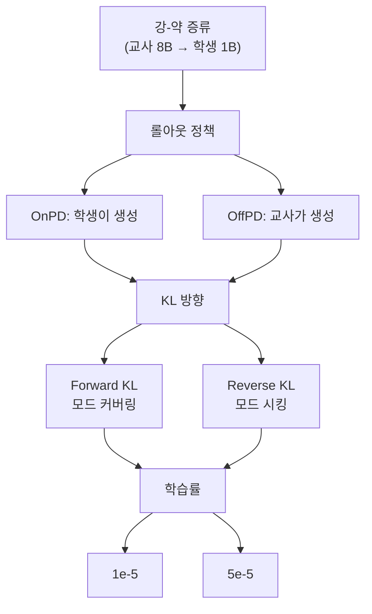

[논문 링크](https://arxiv.org/abs/2609.35259)
## 온폴리시는 만능이 아니다: 증류 동역학에서 롤아웃 정책·KL 방향·학습률의 진짜 주인공

> **TL;DR** — 강-약 증류(strong-to-weak distillation)에서 온폴리시(OnPD)와 오프폴리시(OffPD)를 분리해 보면, 최종 성능·망각·업데이트 희소성을 좌우하는 것은 롤아웃 정책이 아니라 **KL 방향**과 **학습률**이다. forward KL은 롤아웃 정책에 놀랄 만큼 강건하고, reverse KL은 민감하며, 망각(forgetting)과 업데이트 희소성은 학습률이 사실상 전부 결정한다.

---

### 핵심 아이디어

최근 LLM 포스트트레이닝에는 "온폴리시 데이터가 더 좋다"라는 유행 가설이 있다. 즉, 학습 중인 모델 자신이 생성한 데이터로 학습하면 망각이 줄고, 파라미터 업데이트가 더 희소하며, 일반화가 좋아진다는 주장이다 (근거: §1). 이 논문의 핵심 주장은 **이 인과관계가 검증된 적이 없다**는 것이다.

저자들은 한 가지 설계 트릭으로 이 질문을 깔끔하게 분리한다. SFT(오프폴리시)와 RLVR(온폴리시)을 직접 비교하는 대신, **강-약 증류**를 통제된 실험대(testbed)로 쓴다 (근거: §1). 증류에서는 나머지 파이프라인은 그대로 둔 채 "데이터를 생성하는 정책(롤아웃 정책)"만 바꿀 수 있기 때문이다. 여기에 두 변수를 더해 **롤아웃 정책 × KL 방향 × 학습률**을 독립적으로 변화시키며, 세 축에서 (1) 최종 정확도, (2) 치명적 망각, (3) 업데이트 희소성을 측정한다.

결론부터 말하면, 세 축을 분리하자 "온폴리시의 우월성"은 상당 부분 사라진다 (근거: §4).

---

### 배경: 그들이 해결한 문제

SFT와 RLVR을 비교한 기존 연구들은 한꺼번에 너무 많은 것을 바꿨다. 학습 목적함수(objective), 보상 신호의 유무, 지도 밀도(supervision density), 최적화 절차, 학습률까지 동시에 변하기 때문에, 관찰된 차이 중 어느 것이 "온폴리시 데이터" 때문인지 알 수 없었다 (근거: §1, §2).

특히 세 가지 주장이 온폴리시 데이터의 공으로 돌려져 왔다 (근거: §2):

- **망각 감소** — 온폴리시 학습이 이전 능력을 보존해 치명적 망각을 줄인다
- **희소 업데이트** — 온폴리시 학습이 더 희소한 파라미터 변화를 만든다
- **일반화 향상** — 학습 분포 밖의 과제에서 더 잘 동작한다

문제는 이 모든 증거가 SFT vs RLVR 체크포인트를 비교하거나, 서로 다른 레시피로 만들어진 공개 체크포인트를 분석한 데서 왔다는 것이다 (근거: §2). 게다가 온폴리시 증류(OnPD)는 관례적으로 reverse KL과, 오프폴리시 증류(OffPD)는 forward KL과 짝지어져 왔는데, 이 두 선택지는 사실 서로 독립적인 설계 변수다 (근거: §3).

**이 논문이 메우는 공백**은 바로 이것이다: "롤아웃 정책의 인과적 역할을, 다른 요인을 고정한 채 측정한 연구"가 없었다.

---

### 새로운 접근법: 통제된 강-약 증류 + 롤아웃 정책 스펙트럼

#### 실험 설계: 세 요인의 팩토리얼 분리

저자들은 Llama-3.1-8B 교사 → Llama-3.2-1B 학생(그리고 Qwen2.5-7B → Qwen2.5-1.5B)로 증류하며, 세 가지 추론 과제를 쓴다: 의료(MedReason), 과학(Science), 산술(Countdown-3) (근거: §4). 학생은 LoRA 없이 **전체 파라미터 파인튜닝**을 150 스텝, 시드 3개로 수행한다.

핵심 정의부터 정리하자. 프롬프트 $x$와 부분 생성 $y_{<n}$가 주어졌을 때, 증류 목적은 다음과 같다 (근거: §3):

$$
\mathcal{L}(\theta) = \mathbb{E}_{x \sim p_{\mathrm{data}}} \mathbb{E}_{y \sim \rho(\cdot|x)} \left[ \frac{1}{L_y}\sum_{n=1}^{L_y} \mathcal{D}\left(\pi_S^\theta(\cdot|x,y_{<n}) \,||\, \pi_T(\cdot|x,y_{<n})\right) \right]
$$

여기서 롤아웃 정책 $\rho$가 교사면 **OffPD**, 학생이면 **OnPD**다. 거리 함수 $\mathcal{D}$는 KL 발산이며, 방향에 따라 두 종류로 나뉜다 (근거: §3):

$$
D_{\text{F-KL}}(\pi_S,\pi_T) = \sum_{v\in\mathcal{V}} \pi_T(v)\log\frac{\pi_T(v)}{\pi_S(v)},
\qquad
D_{\text{R-KL}}(\pi_S,\pi_T) = \sum_{v\in\mathcal{V}} \pi_S(v)\log\frac{\pi_S(v)}{\pi_T(v)}
$$

forward KL은 교사가 높게 보는 토큰을 놓치면 강하게 벌을 주는 **모드 커버링**이고, reverse KL은 학생이 선호하는 토큰에 집중하는 **모드 시킹**이다 (근거: §3). 이 논문은 KL을 전체 어휘에 대해 계산해, KL 방향과 롤아웃 정책을 자유롭게 교차시킬 수 있었다.

#### 롤아웃 정책 스펙트럼: OnPD와 OffPD를 잇는 연속선

"언제 롤아웃 정책이 정말 중요해지는가?"를 답하기 위해, 저자들은 $\lambda$라는 하나의 파라미터로 학생·교사 정책을 연속적으로 보간하는 **롤아웃 정책 스펙트럼**을 정의한다 (근거: §5):

$$
(z_\lambda)_v = \frac{1}{2}\left(\log\pi_S(v)+\log\pi_T(v)\right) + \frac{\lambda}{2}\left(\log\pi_S(v)-\log\pi_T(v)\right)
$$

- $\lambda = -1$ → 순수 OffPD(교사 생성)
- $\lambda = 0$ → 기하 평균 중간점
- $\lambda = +1$ → 순수 OnPD(학생 생성)
- $\lambda < -1$ / $\lambda > 1$ → 각 정책이 선호하는 토큰으로 **외삽**

위 그림은 $\lambda$를 움직일 때 생성 궤적에 대한 학생·교사 우도가 어떻게 갈리는지 보여준다. 이 도구 덕분에 "OnPD가 좋다/나쁘다"라는 이분법을 넘어, 롤아웃 분포를 조금씩 밀었을 때 성능이 어떻게 반응하는지 정밀하게 관찰할 수 있었다.

---

### 작동 원리: 왜 forward KL은 강건하고 reverse KL은 민감한가

이 논문의 가장 우아한 부분은 **그라디언트 분석**이다. 왜 forward KL과 reverse KL이 롤아웃 정책에 이렇게 다르게 반응하는지를, 토큰 단위 그라디언트의 구조로 설명한다.

학생 로짓을 $z_S^\theta$라 하면, 고정된 프리픽스에서 두 KL의 파라미터 그라디언트는 (근거: §5, App):

$$
\nabla_\theta D_{\text{F-KL}} = \sum_{v\in\mathcal{V}} \left(\pi_S^\theta(v)-\pi_T(v)\right)\nabla_\theta(z_S^\theta)_v
$$

$$
\nabla_\theta D_{\text{R-KL}} = \sum_{v\in\mathcal{V}} \pi_S^\theta(v)\left[\log\frac{\pi_S^\theta(v)}{\pi_T(v)} - D_{\text{R-KL}}\right]\nabla_\theta(z_S^\theta)_v
$$

#### 토이 예시: 2-토큰 어휘로 본 비대칭성

어휘가 $\{A, B\}$ 두 토큰뿐인 극단적 상황을 상상해 보자.

- 교사는 토큰 $A$를 극히 드물게 본다: $\pi_T = (\delta, 1-\delta)$, $\delta$는 매우 작은 값
- 학생은 둘을 반반으로 본다: $\pi_S = (0.5, 0.5)$

**forward KL**의 로짓 그라디언트는 $\pi_S(v)-\pi_T(v)$라서, 각 좌표가 항상 $[-1,1]$ 안에 갇힌다 (근거: §5). 아무리 교사·학생이 다르게 봐도, 그라디언트 한 좌표는 최대 크기 1을 넘을 수 없다. 따라서 롤아웃 분포가 조금 바뀌면, 기대 업데이트도 그에 비례해서만 바뀐다. 논문은 이를 정식화해, forward KL의 준그라디언트(semi-gradient)가 롤아웃 분포의 총변동 거리(total variation)에 대해 립시츠 연속임을 보인다 (근거: App):

$$
\lVert \bar\nabla_\theta \mathcal{L}_{D_{\text{F-KL}}}(\theta;\rho) - \bar\nabla_\theta \mathcal{L}_{D_{\text{F-KL}}}(\theta;\rho') \rVert_2 \le 2\sqrt{2}\,B\,\mathbb{E}_{x}\!\left[\text{TV}(\rho(\cdot|x),\rho'(\cdot|x))\right]
$$

반면 **reverse KL**의 로짓 그라디언트는 $\pi_S^\theta(v)$로 가중되고, 그 안에 $\log\frac{\pi_S^\theta(v)}{\pi_T(v)}$라는 로그 우도비가 들어 있다. 위 토이 예시에서 이 그라디언트는 (근거: App)

$$
\frac{1}{4}\log\!\left(\frac{1-\delta}{\delta}\right)(1,-1)
$$

로 커져서, $\delta \to 0$일 때 **무한대로 발산**한다. 교사가 "거의 확실히 $B$"라고 생각하는데 학생이 "$A$도 절반"이라고 우기면, 그 불일치가 그라디언트를 무한정 키우는 것이다. 논문은 이를 정식화해, reverse KL에는 **분포 독립적인 롤아웃 안정성 보장이 존재하지 않음**을 증명한다 (근거: App). 로그 우도비 범위를 $R$로 제한해야만 비로소 유사한 한계를 되찾는다.

이 구조적 비대칭이 모든 실험 결과를 예측한다: **forward KL은 롤아웃 정책을 바꿔도 안정적이고, reverse KL은 학생이 생성한 궤적(on-policy)에 크게 의존한다.**

---

### 성능 검증: 주요 결과

#### 결과 1 — 최종 성능에서 온폴리시의 이점은 없다

세 과제 평균 최종 정확도에서 OnPD와 OffPD의 최고치는 사실상 동률이다: **OnPD 72% vs OffPD 73%** (근거: §4, Fig. 1). 반면 KL 방향은 뚜렷한 패턴을 만든다. forward KL은 모든 롤아웃·학습률에서 71–73%를 유지하는 데 비해, reverse KL은 **35%에서 72%까지** 흔들리며 학습률에 극도로 민감하다 (근거: §4).

#### 결과 2 — 망각과 희소성은 학습률이 지배한다

7개 OOD 벤치마크 평균으로 측정한 망각을 보면, 낮은 학습률($1\times10^{-5}$)에서는 OOD 성능 변화가 **1.3pp 이내**인 반면, 높은 학습률($5\times10^{-5}$)에서는 **11.2–14.0pp** 급락한다 (근거: §4). 롤아웃 정책 간 차이는 이에 비하면 미미하고, 오히려 OffPD가 미세하게 덜 잊어버린다.

업데이트 희소성(변화량이 $\tau=10^{-6}$ 미만인 파라미터 비율)도 마찬가지다: 낮은 학습률에서 **85.3–89.6%**, 높은 학습률에서 **51.9–60.0%** (근거: §4). OffPD는 모든 매칭 비교에서 OnPD 이상으로 희소한 업데이트를 만든다. 학습률 스윕에서는 희소성이 학습률에 따라 **거의 선형으로 감소**한다 (근거: §4).

#### 결과 3 — 롤아웃 정책이 중요한 순간은 KL 방향이 결정한다

롤아웃 스펙트럼을 따라 $\lambda$를 움직이면 비대칭성이 선명해진다. forward KL은 **스펙트럼 전체에서 정확도 80% 이상**을 유지하며 변동폭이 학습률 $1\times10^{-5}$에서 **5.2pp**에 불과하다 (근거: §5). 반면 reverse KL은 $\lambda$에 따라 크게 흔들리고, 특히 교사 선호 롤아웃($\lambda<0$)에서 급락한다. 낮은 학습률에서 reverse KL은 학생 선호 롤아웃($\lambda>0$)에서 강하게 이득을 본다.

#### 결과 4 — 온폴리시가 진짜 도움이 되는 곳과 그 한계

정확도 하나만 보면 놓치는 차이도 있다.

- **출력 커버리지**: 같은 pass@1에서도 forward KL이 reverse KL보다 pass@10에서 훨씬 큰 이득을 본다 — KL 방향이 출력 다양성을 결정한다 (근거: §5).
- **일반화**: 더 어려운 Countdown-4E(피연산자 4개)로 넘어가면, 두 KL 방향 모두에서 **온폴리시 롤아웃($\lambda>0$)이 오프폴리시보다 pass@k를 10–15% 높인다** (근거: §5). 이는 "온폴리시 데이터가 일반화에 도움"이라는 최초의 일관된 증거다.
- **RLVR 이후**: 하지만 이 일반화 우위는 후속 RLVR 단계에서 **신뢰성 있게 유지되지 않는다**. Countdown-4로 RLVR 300 스텝을 더 돌리면, 초기 정확도가 0%에 가깝던 오프폴리시 체크포인트가 최종 성능에서 오히려 가장 높게 올라온다 (근거: §5).
- **부수적 스타일 전이**: 교사가 스페인어로 답하도록 조건을 준 실험에서, OnPD + reverse KL만이 학생의 영어 스타일을 유지했다 (근거: §5).

#### 결과 5 — 세 가지 설계 선택에도 결론은 유지된다

전체 어휘 KL을 샘플링 KL로 바꿔도, 그라디언트 클리핑을 제거해도, 평균 622토큰의 긴 추론을 요구하는 Numina–MATH(교사 응답 평균 622토큰)로 바꿔도 결론은 같다 (근거: §6). 클리핑을 없애면 reverse KL만 크게 악화되는데, 이는 위 그라디언트 분석과 정확히 일치한다.

---

### 우리의 관점: 강점, 한계, 그리고 이 연구가 중요한 이유

#### 강점

가장 큰 강점은 **통제 실험의 깔끔함**이다. SFT vs RLVR 비교가 저지른 혼재(confounding)를 증류라는 프레임으로 우아하게 제거했고, 여기에 $\lambda$ 스펙트럼이라는 연속적 도구를 얹어 "OnPD vs OffPD"라는 이분법을 뛰어넘었다. 이론적 그라디언트 분석이 실험 결과와 정확히 맞물리는 점도 인상적이다. forward KL의 립시츠 안정성과 reverse KL의 무한 발산 가능성이라는 대비는, 이후 누군가 비슷한 현상을 만났을 때 바로 재사용할 수 있는 정리다.

#### 한계

저자들도 인정하듯, 이 연구의 결론은 "온폴리시의 *일관된* 이점이 없다"는 것이지 OnPD와 OffPD의 *통계적 동등성*을 증명한 게 아니다 (근거: §7). 범위도 제한적이다: 학생 모델이 **최대 1.5B**, 추론 트레이스가 **최대 약 2,000토큰**이다 (근거: §7). 일부 절제 실험은 조건당 실행이 1회뿐이라(예: Numina–MATH), "OnPD가 긴 추론에서 도움이 된다"는 발견은 저자 스스로 "시사적(suggestive)"이라고 단서를 단다 (근거: §6).

더 근본적으로, 이 연구는 **KL 방향이라는 대안적 변수를 부각시키는 대신, 왜 forward KL이 그토록 강건한지는 그라디언트 구조로 설명하지만**, 실제 실무자들이 쓰는 RLVR의 보상 신호·지도 밀도·최적화 절차까지는 다루지 않는다. 즉 "SFT와 RL의 차이는 롤아웃 정책만으로는 설명되지 않는다"는 부정적 결론은 강하지만, "그럼 무엇 때문인가"라는 긍정적 답은 여전히 열려 있다.

#### 이 연구가 중요한 이유

실무적 함의가 뚜렷하다. 온폴리시 증류는 학습 내내 계속 생성을 해야 해서 비싸다. 이 논문은 "그 비용을 들일 정당한 이유가 항상 있는 건 아니다"라는 경고를 데이터로 뒷받침하며, 오히려 **OffPD를 표준 베이스라인으로 삼으라**고 제안한다 (근거: §7). 동시에 "망각을 줄이려면 학습률을 낮추라"는 조작 가능한 지침을 준다. 이는 현실의 포스트트레이닝 파이프라인을 짜는 사람에게 직접 쓸모 있는 메시지다.

---

### 다음 단계는?: 앞으로의 길

저자들이 제안하는 확장은 두 갈래다: **더 큰 모델**과 **더 긴 롤아웃**으로의 확장, 그리고 **특정 학생-교사 조합**에서 OnPD/OffPD 차이가 나타나는지의 탐색이다 (근거: §7). 이에 더해 우리가 주목할 만한 후속 질문은 이렇다.

1. **보상 신호와의 결합** — 이 연구는 KL 증류에 국한된다. RLVR의 보상·지도 밀도가 롤아웃 정책과 어떻게 상호작용하는지 같은 프레임으로 분리해 보면, "SFT vs RL의 진짜 차이"에 한 걸음 더 다가갈 수 있다.
2. **로그 우도비 진단** — reverse KL의 불안정성이 극단적인 $\log\frac{\pi_S}{\pi_T}$ 비율에서 온다는 점은 (근거: App), 학습 중 이 비율을 모니터링하면 reverse KL 붕괴를 조기에 감지할 수 있음을 시사한다. 실용적인 진단 도구로 발전시킬 여지가 크다.
3. **스타일 전이의 통제** — OnPD + reverse KL이 교사의 부수적 스타일 전이를 억제한다는 발견은, 개인화·안전 정렬 등 "의도하지 않은 행동 전이"를 막고 싶은 시나리오에서 독립적으로 재검증할 가치가 있다.

한 문장으로 정리하면: **롤아웃 정책은 증류의 주인공이 아니며, 진짜 지렛대는 KL 방향과 학습률이다. 다만 "일반화"라는 좁은 지점에서는 온폴리시가 여전히 자기 몫을 한다.**

<!-- verbatim-tables -->

## 논문 원문의 표

> arXiv e-print 의 LaTeX 원본에서 기계적으로 옮긴 표입니다. 숫자는 논문의 값이며 모델을 거치지 않았습니다.

**표 1. Task prompts used for teacher SFT and policy-distillation experiments. During SFT, the worked demonstration is supplied as the target completion rather than included in the input prompt.**

| Dataset | System prompt | User prompt |
|---|---|---|
| Countdown-3 | You are a careful arithmetic solver. | Solve the Countdown arithmetic problem. Using the provided numbers, create an equation that equals the target. You may use the operations $+$, $-$, $\times$, and $/$, and each number must be used exactly once; every division must have an integer result. Show your work in `<think>...</think>` tags and return the solution as compact, comma-separated equations in `<answer>...</answer>` tags. For example, `<answer>2+3=5,5*4=20</answer>`. The question is appended as `Numbers: [\ldots]` and `Target: \ldots`. |
| Science | You are a careful solver of multiple-choice science questions. | Given a question and four options, select the correct answer. Reason step by step in `<think>...</think>` tags and place only the corresponding option letter (A, B, C, or D) in `<answer>...</answer>` tags. The question and answer choices are appended to this instruction. |
| MedReason | You are a careful medical reasoning assistant. | Given a medical multiple-choice question and its answer choices, select the correct answer. Reason step by step in `<think>...</think>` tags and place only the letter corresponding to the correct option in `<answer>...</answer>` tags; do not repeat the answer text. The question and answer choices are appended to this instruction. |

**표 2. In-distribution performance of the trained teachers. Results use 200 test examples per dataset, temperature $0.5$, one sampled response per prompt, and a 2,048-token completion limit. Response lengths are reported as mean $\pm$ standard deviation.**

| **Teacher** | **Dataset** | **Accuracy (%)** | **Response length (tokens)** |
|---|---|---|---|
| Qwen2.5-7B | MedReason | 77.5 | $90.95 \pm 28.58$ |
|  | Science | 72.0 | $288.82 \pm 90.38$ |
|  | Countdown-3 | 95.5 | $168.42 \pm 316.40$ |
| Llama-3.1-8B | MedReason | 85.5 | $93.74 \pm 30.81$ |
|  | Science | 67.5 | $134.65 \pm 50.77$ |
|  | Countdown-3 | 99.0 | $98.82 \pm 78.54$ |

**표 3. Principal hyperparameters used for distillation training.**

| Hyperparameter | Value | Notes |
|---|---|---|
| Optimization steps | 150 | Reported primary comparisons use the checkpoint at step 150. |
| Optimizer | Fused AdamW | $\beta_1=0.9$, $\beta_2=0.999$, and $\epsilon=10^{-8}$. |
| Weight decay | 0 |  |
| Learning-rate schedule | Constant with linear warm-up | 10 warm-up steps. |
| Per-device batch size | 1 |  |
| Gradient accumulation | 32 steps | Gives an effective batch size of 32 prompts per optimizer step. |
| Trajectories per prompt | 1 | One completion is sampled for every selected prompt. |
| Maximum gradient norm | 1.0 |  |
| Student temperature | 1.0 | Used for student sampling and student logits in the KL objective. |
| Teacher temperature | 0.5 | Used for teacher sampling and teacher logits in the KL objective. |
| On-policy trajectory source | Student | Sampled at temperature 1.0. |
| Off-policy trajectory source | Teacher | Sampled at temperature 0.5. |
| Top-$p$ | 1.0 | Used for both on- and off-policy trajectory sampling. |
| Maximum prompt length | 2,048 tokens | Shared across datasets. |
| Maximum completion length | 512 / 1,024 tokens | 512 for Countdown-3; 1,024 for Science and MedReason. |
| Loss reduction | Mean over completion tokens | Computed over the full vocabulary at every non-padding completion position. |
| Gradient checkpointing | On-policy: enabled; off-policy: disabled | This difference is used for memory management. |

**표 4. Training settings for RLVR on Countdown-4 after Countdown-3 distillation. These settings are identical across rollout policies, KL objectives, and learning rates used in the preceding distillation stage.**

| Setting | Value | Notes |
|---|---|---|
| Optimisation steps | 300 | Starting from each step-150 distilled checkpoint. |
| RLVR learning rate | $2\times10^{-6}$ | Shared across all 24 runs. |
| Learning-rate schedule | Cosine | Warm-up over the first 10% of steps (30 steps). |
| Optimizer | Eight-bit AdamW | Bfloat16 training. |
| Trainable parameters | LoRA adapters | Rank 256, scaling parameter 256, dropout 0; no bias adaptation. |
| Backbone weights | Frozen, loaded in four-bit precision | Gradient checkpointing enabled. |
| Per-device batch size | 8 | Gradient accumulation over 16 steps. |
| Completions per prompt | 8 | One reward-normalisation group per prompt. |
| Generation batch size | 48 completions | Six groups of eight completions. |
| Sampling | Temperature $1.0$, top-$p=0.95$ | Colocated vLLM generation. |
| Maximum prompt length | 2,048 tokens | Vanilla Countdown prompt with chat template. |
| Maximum completion length | 1,024 tokens | Shared across all configurations. |
| Loss and reward scaling | DAPO; group normalisation | No reference-model KL penalty ($\beta=0$). |
| Reward | $2$ for correctness, $0$ otherwise | No auxiliary reward terms. |
| Maximum gradient norm | $1.0$ | Global gradient clipping. |
| RLVR random seed | 42 | Distillation seeds are 42, 43, and 44. |
| Logging / checkpoint interval | 5 / 50 steps | Reward curves show logged training rewards. |

**표 5. Experiment-specific settings for the Spanish-style transfer experiment. All unlisted training and evaluation settings follow the standard protocol.**

| Setting | Value | Notes |
|---|---|---|
| Student | `Qwen2.5-1.5B-Instruct` | Fully fine-tuned on Science. |
| Teacher | `Qwen2.5-3B-Instruct` | Frozen base instruct model; no task-specific fine-tuning. |
| Experimental grid | OnPD/OffPD $\times$ forward/reverse KL | Learning rates $\{1\times10^{-5},5\times10^{-5}\}$. |
| Random seeds | 42 | One run per condition. |
| Teacher conditioning | Correct demonstration and Spanish instruction | Used for teacher rollouts and teacher distributions. |
| Student conditioning | Vanilla Science prompt | Used for student rollouts, likelihoods, and evaluation. |
| Sampling temperature | 1.0 for OnPD and OffPD | The conditioned teacher therefore differs from the standard OffPD temperature of 0.5. |
| Distribution temperature | 1.0 for student and teacher | The teacher differs from the standard temperature of 0.5. |
| Maximum training completion length | 2,048 tokens | The standard Science experiments use 1,024 tokens. |
| Gradient checkpointing | Enabled for OnPD and OffPD | The standard OffPD runs disable gradient checkpointing. |
| Style evaluation | 1,000 responses per condition | 200 each from Science train and test, MedReason test, GSM8K test, and Countdown-3 test. |

**표 6. Learning rates used to produce the checkpoints in the main RL comparison and the explicit SFT comparison of . ``From'' denotes the checkpoint against which parameter-update sparsity is measured. Rates refer to the language model or policy actor, using the peak rate where a schedule is reported.**

| Stage | From | Studied checkpoint | Training method | Model/actor LR |
|---|---|---|---|---|
| *SFT checkpoints (Appendix C)* |  |  |  |  |
| SFT | meta-llama/Llama-3.1-8B | allenai/Llama-3.1-Tulu-3-8B-SFT | Full-parameter SFT | $5\times10^{-6}$ |
| SFT | meta-llama/Llama-3.1-70B | allenai/Llama-3.1-Tulu-3-70B-SFT | Full-parameter SFT | $2\times10^{-6}$ |
| SFT | Qwen/Qwen2.5-Math-7B | PRIME-RL/Eurus-2-7B-SFT | Math-reasoning SFT | $2\times10^{-5}$ |
| *RL and preference-optimization checkpoints (Table 1)* |  |  |  |  |
| DPO | allenai/Llama-3.1-Tulu-3-8B-SFT | allenai/Llama-3.1-Tulu-3-8B-DPO | Offline DPO | $5\times10^{-7}$ |
| DPO | allenai/Llama-3.1-Tulu-3-70B-SFT | allenai/Llama-3.1-Tulu-3-70B-DPO | Offline DPO | $5\times10^{-7}$ |
| GRPO | deepseek-ai/deepseek-math-7b-instruct | deepseek-ai/deepseek-math-7b-rl | On-policy GRPO | $1\times10^{-6}$ |
| RL-Zero | deepseek-ai/DeepSeek-V3-Base | deepseek-ai/DeepSeek-R1-Zero | On-policy GRPO | Not disclosed |
| ORPO | mistralai/Mistral-7B-v0.1 | kaist-ai/mistral-orpo-beta | Offline, reference-free ORPO | $8\times10^{-6}$ |
| KTO | openbmb/Eurus-7b-sft | openbmb/Eurus-7b-kto | Offline KTO | $5\times10^{-7}$ |
| KTO | princeton-nlp/Llama-3-Base-8B-SFT | princeton-nlp/Llama-3-Base-8B-SFT-KTO | Offline KTO | $5\times10^{-7}$ |
| PPO | peiyi9979/mistral-7b-sft | peiyi9979/math-shepherd-mistral-7b-rl | On-policy PPO | $1\times10^{-6}$ |
| SimPO | meta-llama/Meta-Llama-3-8B-Instruct | princeton-nlp/Llama-3-Instruct-8B-SimPO | Offline, reference-free SimPO | $1\times10^{-6}$ |
| PRIME | PRIME-RL/Eurus-2-7B-SFT | PRIME-RL/Eurus-2-7B-PRIME | On-policy PRIME | $5\times10^{-7}$ |

> 이 글의 그림은 arXiv:2609.35259 원본에서 가져왔습니다 (CC BY 4.0). 크기와 형식만 바꿨습니다.
