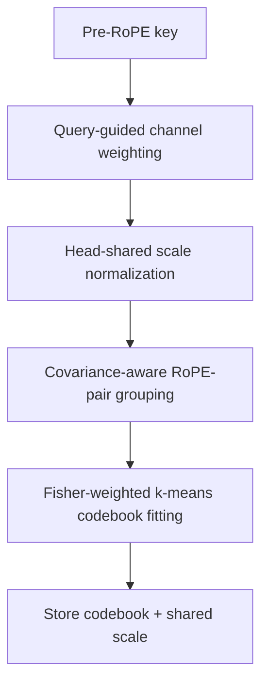

[Paper](https://arxiv.org/abs/2610.03027v1)
## TaSQ: 'Tailored Design' of the Quantization Space for a 1-bit KV Cache

**TL;DR** — TaSQ (Tailored Space Vector Quantization) **redesigns the very target space** to which vector quantization (VQ) is applied, compressing the KV cache to about 1.25 bits per channel while maintaining quality close to BF16. The key is applying query-guided channel weighting, head-shared normalization, and covariance-aware channel grouping to the **pre-RoPE key**. On a single RTX 6000 Ada, it expands the KV cache pool by 12.48× and raises the maximum batch from 6→84 (14×) and peak throughput by 1.87× (source: §Abstract, Fig. 4).

---

## Key Idea

In long-context inference, the KV cache becomes a bottleneck in both capacity and bandwidth. Existing vector quantization methods degrade sharply in quality once the compression rate reaches the 1-bit level, because a single codebook must represent an ever-growing number of channels with a limited number of centroids (source: §1).

TaSQ's insight is simple yet powerful. It focuses on two facts: **"the impact of quantization error on attention logits differs from channel to channel"** and **"for VQ to exploit inter-channel dependencies, dependent channels must be tied to the same codebook"** (source: §1).

Accordingly, TaSQ tailors the VQ target space with the following three transforms (source: Fig. 2):

1. **Query-Guided Channel Weighting** — weights channels that are sensitive to $QK^\top$ error (source: §4.1)
2. **Cross-Head Shared-Scale Normalization** — suppresses token-level magnitude outliers with a single RMS scale (source: §4.2)
3. **Covariance-Aware Channel Grouping** — assigns dependent channels to the same local VQ group (source: §4.3)

The key point is that all three operations use only **per-channel scaling and permutation**, and do not require dense rotation. As a result, weights and permutations can be absorbed into the key projection matrix and codebook in advance, and there is almost no extra computation at inference time (source: §1, §4.4).

The key figures at a glance are as follows (source: §5, §6.1, Appx. B):

| Item | Value |
|---|---|
| Target bit rate (K/V) | 1.266 / 1.250 bits/element |
| Codebook size / group size | $K=1024$ centroids, $g=8$ channels |
| Evaluated models | Llama-3.1-8B, Qwen3-4B(-Thinking), DeepSeek-R1-Distill-8B, Phi-4(14B) |
| Calibration | 64 windows × 2,048 tokens |
| Throughput | 412.6 tok/s (1.87× vs BF16 220.8 tok/s) |
| KV pool expansion | 12.48× (235,257 → 2,935,184 tokens) |

---

## Background: The Problem They Solved

### Why the KV cache is a bottleneck

Decoder-only transformers generate tokens autoregressively, and the key/value activations of past tokens are reused at every subsequent decoding step, so they are stored in the KV cache. The problem is that this cache grows linearly with sequence length and must be read repeatedly at every decoding step. As the context grows longer, pressure is applied to both storage capacity and memory bandwidth (source: §2.1).

Methods such as token eviction, cache merging, and quantization have been studied to mitigate this. Among them, **quantization** is the most widely used (source: §1).

### Why vector quantization (VQ)?

VQ replaces a $g$-dimensional vector with one codeword from a finite codebook $\mathcal{C} = \{c_1, \dots, c_K\}$:

$$z(x) = \arg\min_{j} \lVert x - c_j \rVert_2^2, \qquad \hat{x} = c_{z(x)}$$

When a $g$-dimensional vector is represented by one of $K$ codewords, the index cost is $\log_2 K / g$ bits per channel. Since multiple channels are represented jointly and the structure of the joint distribution can be exploited, VQ is particularly attractive for ultra-low-bit compression (source: §2.2).

### Collapse of existing VQ in the 1-bit regime

Existing methods either learn a codebook over contiguous channel groups (CQ) (source: §1), or normalize activations to use a global codebook without calibration (NSNQuant) (source: §1). However, when the bit rate approaches 1 bit per channel, each codebook must represent a larger channel group with fewer centroids, making it hard to maintain quality (source: §1).

The authors precisely diagnose the problem with three empirical observations (source: Fig. 1):

- **(a) Imbalanced channel sensitivity** — The query activation distribution varies greatly across channels, and some channels have a particularly wide activation range. In $QK^\top$, key-channel error scales in proportion to the corresponding query activation, so sensitivity differs per channel (source: §3.1, Fig. 1a).
- **(b) Non-uniform inter-channel correlation** — Some channel pairs are strongly correlated while others are nearly independent. For VQ to exploit dependencies, which channels are grouped together is decisive (source: §3.2, Fig. 1b).
- **(c, d) RoPE's distribution spreading** — RoPE rotates keys by position-dependent angles, spreading the distribution significantly. Pre-RoPE VQ shows lower reconstruction error in all 32 layers, with total reconstruction error **35% lower** (source: §3.3, Fig. 1c·d).

These three observations lead directly to TaSQ's three design axes.

---

## New Approach: TaSQ

TaSQ transforms the VQ target space in three stages for the **pre-RoPE key**, and at inference time absorbs these transforms into the projection and codebook, keeping the existing VQ lookup structure unchanged (source: §4).

### 4.1 Query-Guided Channel Weighting

To quantify the effect of the pre-RoPE key quantization error $\delta_{p,h} = k_{p,h} - \hat{k}_{p,h}$ on the attention logits, we write the squared inner-product error with the post-RoPE query $\bar{q}_{t,h}$ as follows (source: §4.1):

$$\big(\bar{q}_{t,h}^\top R_p \delta_{p,h}\big)^2 = \delta_{p,h}^\top A_{t,p,h} \delta_{p,h}, \qquad A_{t,p,h} = R_p^\top \bar{q}_{t,h} \bar{q}_{t,h}^\top R_p$$

where $R_p$ is the RoPE rotation matrix at position $p$. To obtain a position- and token-independent summary, we compute $\tilde{A}_h$ averaged over valid causal query-key pairs, and take a **diagonal approximation** to preserve the RoPE pair structure:

$$W_h = \operatorname{diag}(\tilde{A}_h), \qquad k^w_{p,h} = W_h^{1/2} k_{p,h}$$

This makes the Euclidean VQ reconstruction error in the weighted space a surrogate for the $QK^\top$ error (source: §4.1, Eq. 1). In Fig. 3(a), weighting consistently lowers $QK^\top$ MSE and attention KL divergence in all layers (source: Fig. 3a).

### 4.2 Head-Shared Scale Normalization

To suppress outlier tokens, per-token normalization is applied, but unlike the existing head-wise scheme, a **single RMS scale is used for all $H$ KV heads** (source: §4.2):

$$s_p = \left( \frac{1}{H d} \sum_{h=1}^{H} \lVert k^w_{p,h} \rVert_2^2 \right)^{1/2}, \qquad k^{wn}_{p,h} = \frac{k^w_{p,h}}{s_p}$$

The metadata cost of the $b_s$-bit scale is reduced **by a factor of $H$**, from $b_s / d$ for head-wise to $b_s / (H d)$. The authors store $s_p$ in FP16 ($b_s=16$) to maintain high resolution while lowering the cost (source: §4.2). The saved bits are reallocated to codebook indices, allowing more centroids to be obtained (source: Appx. D).

### 4.3 Covariance-Aware Channel Grouping

The covariance of the weighted and normalized key space is estimated from the calibration corpus ($\Sigma^{wn}_h$), and the cost of a candidate group $G$ is defined as follows (source: §4.3):

$$c_h(G) = \det\!\big(\Sigma^{wn}_h[G, G] + \varepsilon I\big)^{1/|G|}$$

This derives from the asymptotic scaling $D_G \propto K^{-2/|G|} \det(\Sigma^{wn}_h[G, G])^{1/|G|}$ given by high-rate quantization theory under a Gaussian model. Since $|G|$ and $K$ are fixed across groups, the group-dependent term is just the covariance determinant, which serves as a proxy for quantization error (source: §4.3).

Grouping is formulated as a partitioning problem that minimizes the total cost $\sum_{G \in \mathcal{G}_h} c_h(G)$ under the constraint that "each RoPE pair belongs to the same group." Since the number of possible partitions is exponential and exhaustive search is infeasible, an approximate solution is obtained by **hierarchical minimum-weight perfect matching** (source: §4.3, Alg. 1).

Empirically, this covariance-aware cost correlates strongly with actual VQ distortion. On a representative layer the Pearson correlation is $r=0.994$, and it is consistently high across all layers. It reduces both the grouping objective and VQ reconstruction error compared to contiguous grouping (source: Fig. 3b·c·d).

### 4.4 VQ in the Tailored Space and Runtime Fusion

For the weighted, normalized, and grouped key $k^{wnp}$, a $K$-centroid codebook $\mathcal{C}_{h,G}$ is fitted per layer, head, and group. To reflect **per-token importance** in addition to per-channel importance, Fisher-weighted k-means is performed by summing the diagonal empirical Fisher $F_{p,h,i} = (\partial \mathcal{L}/\partial k^{wnp}_{p,h,i})^2$ at the group level (source: §4.4).

At runtime, the weights and permutation are absorbed into the key projection ($\tilde{W}_{K,h} = P_h W_h^{1/2} W_{K,h}$), and the inverse weights are absorbed into the codewords ($\tilde{c}_{h,G,j} = [(P_h W_h P_h^\top)^{-1/2}]_{G,G}\, c_{h,G,j}$). Reconstruction is $\hat{k}_{p,h} = s_p \tilde{C}_h[z_{p,h}]$, and since $P_h$ permutes complete RoPE pairs, $\tilde{R}_{p,h} = P_h R_p P_h^\top$ retains the standard block-diagonal RoPE structure (source: §4.4). Codeword lookup, scale reconstruction, RoPE, and inner product are all fused into the attention kernel, so there is **no runtime channel shuffling, dense transform, or extra kernel launch at all** (source: §4.4).

The **value path** keeps the standard contiguous-group VQ unchanged. This is because values have a lower channel-sensitivity CV than keys (0.176 vs 0.841) and weaker inter-channel correlation (0.067 vs 0.136), so the gains from channel weighting and grouping are small (source: §4.4, Fig. 6, Appx. C).

---

## How It Works: A Concrete Example

The full pipeline as a flow is as follows (source: §4):

At inference time, these transforms are already absorbed into the projection and codebook, so on-the-fly RoPE and inner product are performed using only the stored indices and scales (source: §4.4).

### Why the diagonal approximation is efficient

In query-guided weighting, the key design decision is to use **diagonal** $\operatorname{diag}(\tilde{A}_h)^{1/2}$ instead of dense $\tilde{A}_h^{1/2}$. Using a dense transform requires reconstructing the key with a $d \times d$ matrix multiplication before applying position-dependent RoPE during decoding, and this reconstruction cannot be merged into the query projection (since $R_p$ depends on the key position). This cost reaches **36% of attention time at 1k tokens and 103% at 16k tokens** (source: Appx. D, Tab. 8).

In terms of quality, the diagonal approximation is actually better. The dense transform slightly lowers error on the calibration corpus (0.00264 vs 0.00287), but on GSM8K it shows **about 4× higher** error (0.00933 vs 0.00234). Off-diagonal channel coupling does not generalize (source: Appx. D, Tab. 9).

### What happens beyond the calibration length?

Since RoPE is position-dependent, methods fitted on post-RoPE activations can become fragile when they move beyond the positions seen during calibration. Looking at position-wise attention logit NMSE on 16k-length WikiText-2, the pre-RoPE methods CQ and TaSQ increase error gradually even outside the calibration range, whereas the post-RoPE method NovaKV degrades sharply (source: Appx. D, Fig. 7). This matches the pattern of the long-context retrieval results in Table 3 (source: Appx. D).

---

## Performance Evaluation: Main Results

The evaluation is divided into three axes—general tasks, long-context CoT reasoning, and long-context retrieval—and all quantization methods use the same policy (source: §5.1).

### General Benchmarks

On Llama-3.1-8B-Instruct, TaSQ achieves an average of **59.21**, closest to BF16 (63.94), surpassing CQ (48.03), NSNQuant (53.30), and NovaKV (53.32). On GSM8K it scores 81.73, only 1.89 points behind BF16 (83.62) (source: Tab. 1).

### Long-Context CoT Reasoning

The gap is more pronounced in reasoning models. On Qwen3-4B-Thinking-2507, TaSQ records **60.55** on average, preserving about 90% of BF16 (67.18), while CQ (28.52), NovaKV (12.89), and NSNQuant (46.67) collapse severely. In particular, on AIME'24 TaSQ scores 68.89, close to BF16 (74.44) (source: Tab. 2). NovaKV, by contrast, shows severe quality collapse in long-context reasoning (source: §5.2).

### Long-Context Retrieval (RULER)

On Llama-3.1-8B-Instruct's needle-in-a-haystack, TaSQ maintains **92.00–93.67** across the entire 4k–64k range, barely degrading as the context grows longer. NovaKV plummets to 1.83 at 64k, and CQ lags far behind across the whole range (source: Tab. 3).

### Serving Efficiency

On a single RTX 6000 Ada (source: Fig. 4, §6.1):

- TaSQ shows the same throughput as CQ, confirming that there is almost no additional serving overhead (source: Fig. 4a).
- The KV cache pool expanded from 235,257 → 2,935,184 tokens, a **12.48×** increase, and the maximum batch rose from 6 → 84 (**14×**) and peak throughput from 220.8 → 412.6 tok/s (**1.87×**) (source: Fig. 4a).
- VQ encoding increases the TTFT of 8k–32k prompts by **10–14%**, but this one-time prefill cost is offset by long generation (source: Fig. 4b).
- **Reasoning stability**: Compared to BF16's cap-reached rate of 0.2%, TaSQ is 3.8%, far more stable than CQ (20.0%). The average number of generated tokens is also maintained at 11,439, close to BF16 (9,625) (source: Fig. 4c).

### Ablation Study

WikiText-2 PPL with each component removed shows that grouping contributes the most (source: Tab. 4):

| Configuration | PPL↓ |
|---|---:|
| FP16 | 6.2374 |
| Full TaSQ | 8.4559 |
| w/o query-guided weighting | 8.5172 |
| w/o head-shared normalization | 8.5103 |
| w/o covariance grouping | **10.1731** |

In the bit-rate sweep, TaSQ also shows the strongest rate-accuracy trade-off across all models on GSM8K·MBPP, and its advantage grows as the key bit rate decreases (source: Fig. 5).

---

## Our Perspective: Strengths, Limitations, and Why This Research Matters

### Strengths

The biggest virtue of this paper is the shift in thinking: **"change the space."** Whereas existing VQ methods focused on codebook size and normalization schemes, TaSQ redesigns the space itself based on *where and how much the quantization error hurts*. As a result, all three transforms consist of cheap operations—**channel scaling and permutation**—raising quality at near-zero runtime cost (source: §1, Fig. 4a).

Another notable point is the **practical superiority of the diagonal approximation**. Theoretically, the dense transform appears more expressive, but in practice it is counterproductive outside the calibration range, and the decoding cost increases by up to 103% (source: Appx. D). This is a case that quantitatively demonstrates that "what is theoretically better is not always better in practice."

### Limitations

- **Values left as-is**: The value path keeps standard VQ. Applying value-side transforms improved PPL only from 8.45594 → 8.42058 (0.42%), so it was not adopted, because the structure of values is more uniform than that of keys (source: Appx. C). That said, the authors themselves leave tailored value-space design as future work (source: §7, Appx. C).
- **Residual gap in the ultra-low-bit limit**: Even at 1.25 bits, the general benchmark average still differs from BF16 by about 4–5 points (source: Tab. 1). The gap has narrowed but has not been fully closed.
- **Hierarchical grouping does not guarantee a global optimum**: The matching-based approximation does not guarantee the theoretically optimal partition, since earlier merges constrain later choices (source: Appx. D). It is empirically good enough, but room remains for more sophisticated optimization.
- **Single-GPU validation**: The serving efficiency experiments are based on a single RTX 6000 Ada card, and multi-node and large-scale batch scalability require further validation (source: §5.1).

### Why It Matters

1-bit-level KV cache compression means serving "longer contexts, at larger batches, in the same memory." The 14× batch expansion and 1.87× throughput improvement demonstrated by TaSQ translate directly into cost savings in long-context inference serving where memory bandwidth is the bottleneck (source: Fig. 4). Moreover, maintaining generation stability even in reasoning models precisely targets the most painful point in real production deployment (source: Fig. 4c).

---

## What's Next?: The Road Ahead

The direction the authors explicitly leave open is the **tailored design of the value path** (source: §7, Appx. C). The natural follow-up is to redesign the weighting, normalization, and grouping applied to keys to suit the structure of values (more uniform sensitivity, weaker correlation) (source: Fig. 6).

Reasonable next steps considering the limitations include the following:

1. **Improving grouping optimization** — Beyond the approximation limits of hierarchical matching, one could try partition search closer to the global optimum (e.g., spectral clustering, affine optimization) (source: Appx. D).
2. **Multi-GPU and distributed serving scaling** — It is necessary to verify whether the 1.87× throughput gain confirmed on a single card holds under tensor-parallel and pipeline-parallel environments (source: §5.1).
3. **Dynamic allocation of scale bit width** — Allocating the bit width of the head-shared scale differentially according to head/layer importance, rather than a fixed FP16, is also worth exploring (source: §4.2).

In sum, TaSQ is a clean piece of research showing how effective it is, in the hard problem of "ultra-low-bit KV cache compression," to **rework the space in which quantization happens to fit the problem** instead of simply training a better codebook.

<!-- verbatim-tables -->

## Tables from the paper

> Tables converted mechanically from the arXiv e-print LaTeX source. The numbers are the paper's own and did not pass through a model.

**Table 1. General performance under low-bit KV cache quantization. All results use greedy decoding. Bold denotes the best quantized result; higher is better.**

| Model | Method | Bits (K/V) | GSM8K | MATH500 | MBPP | HumanEval | BBH | MMLU | Avg. |
|---|---|---|---|---|---|---|---|---|---|
| Llama-3.1-8B-Instruct | BF16 | 16.000/16.000 | 83.62 | 42.20 | 59.60 | 62.20 | 73.38 | 62.64 | 63.94 |
|  | CQ | 1.250/1.250 | 68.01 | 19.60 | 52.00 | 54.27 | 40.08 | 54.21 | 48.03 |
|  | NovaKV | 1.375/1.250 | 76.95 | 29.40 | 55.00 | 53.66 | 48.46 | 56.43 | 53.32 |
|  | NSNQuant | 1.238/1.238 | 73.39 | 31.40 | 50.20 | 57.93 | 48.57 | **58.33** | 53.30 |
|  | TaSQ | 1.266/1.250 | **81.73** | **34.00** | **58.40** | **58.54** | **64.28** | **58.33** | **59.21** |
| Qwen3-4B | BF16 | 16.000/16.000 | 86.28 | 72.60 | 64.00 | 81.71 | 78.03 | 74.72 | 76.22 |
|  | CQ | 1.250/1.250 | 70.36 | 60.80 | 45.40 | 65.85 | 52.08 | 64.14 | 59.77 |
|  | NovaKV | 1.375/1.250 | 84.53 | 66.80 | **62.60** | 76.22 | **68.80** | 67.21 | 71.03 |
|  | NSNQuant | 1.238/1.238 | 65.58 | 52.40 | 46.20 | 67.68 | 49.57 | 63.29 | 57.45 |
|  | TaSQ | 1.266/1.250 | **85.44** | **69.80** | **62.60** | **77.44** | 68.28 | **71.26** | **72.47** |

**Table 2. Long-CoT reasoning performance under low-bit KV cache quantization. We report the mean and standard deviation over three seeds. Bold denotes the best quantized result; higher is better.**

| Model | Method | Bits (K/V) | AIME'24 | AIME'25 | LCB-v6 | SciBench | Avg. |
|---|---|---|---|---|---|---|---|
| Qwen3-4B-Thinking-2507 | BF16 | 16.000/16.000 | 74.44$\pm$1.92 | 74.44$\pm$5.09 | 45.85$\pm$0.62 | 73.99$\pm$0.43 | 67.18$\pm$1.37 |
|  | CQ | 1.250/1.250 | 26.67$\pm$3.33 | 14.44$\pm$5.09 | 18.99$\pm$0.44 | 54.00$\pm$0.94 | 28.52$\pm$1.54 |
|  | NovaKV | 1.375/1.250 | 7.78$\pm$1.92 | 6.67$\pm$3.33 | 9.16$\pm$0.38 | 27.94$\pm$2.08 | 12.89$\pm$1.10 |
|  | NSNQuant | 1.238/1.238 | 44.44$\pm$6.94 | 38.89$\pm$1.92 | 34.66$\pm$0.33 | 68.69$\pm$0.55 | 46.67$\pm$1.81 |
|  | TaSQ | 1.266/1.250 | **68.89$\pm$1.92** | **56.67$\pm$3.33** | **43.00$\pm$0.47** | **73.65$\pm$0.60** | **60.55$\pm$0.98** |
| DeepSeek-R1-Distill-Llama-8B | BF16 | 16.000/16.000 | 53.33$\pm$3.33 | 31.11$\pm$1.92 | 39.68$\pm$0.56 | 38.49$\pm$0.30 | 40.65$\pm$0.98 |
|  | CQ | 1.250/1.250 | 26.67$\pm$3.33 | 26.67$\pm$5.77 | 23.29$\pm$0.45 | 35.45$\pm$1.61 | 28.02$\pm$1.72 |
|  | NovaKV | 1.375/1.250 | 35.56$\pm$5.09 | 18.89$\pm$3.85 | 20.98$\pm$0.65 | 33.62$\pm$0.44 | 27.26$\pm$1.61 |
|  | NSNQuant | 1.238/1.238 | 44.44$\pm$5.09 | 24.44$\pm$5.09 | 32.67$\pm$1.15 | 34.83$\pm$1.64 | 34.10$\pm$1.87 |
|  | TaSQ | 1.266/1.250 | **48.89$\pm$6.94** | **31.11$\pm$1.92** | **32.95$\pm$0.61** | **39.11$\pm$1.50** | **38.02$\pm$1.85** |
| Phi4-14B-Reasoning-Plus | BF16 | 16.000/16.000 | 71.11$\pm$1.92 | 66.67$\pm$3.33 | 46.60$\pm$0.71 | 48.22$\pm$1.03 | 58.15$\pm$1.01 |
|  | CQ | 1.250/1.250 | 52.22$\pm$3.85 | 31.11$\pm$5.09 | 13.33$\pm$0.55 | 33.14$\pm$1.34 | 32.45$\pm$1.64 |
|  | NovaKV | 1.375/1.250 | 41.11$\pm$10.18 | 35.56$\pm$1.92 | 21.93$\pm$0.29 | 41.57$\pm$1.86 | 35.04$\pm$2.63 |
|  | NSNQuant | 1.238/1.238 | 63.33$\pm$6.67 | 55.56$\pm$5.09 | 37.12$\pm$1.04 | 44.99$\pm$0.65 | 50.25$\pm$2.12 |
|  | TaSQ | 1.263/1.250 | **71.11$\pm$5.09** | **60.00$\pm$0.00** | **41.20$\pm$0.52** | **50.58$\pm$1.90** | **55.72$\pm$1.36** |

**Table 3. Needle-in-a-haystack retrieval performance at increasing context lengths. We report the mean and standard deviation over three seeds. Bold denotes the best quantized result; higher is better.**

| Model | Method | Bits (K/V) | 4k | 8k | 16k | 32k | 64k |
|---|---|---|---|---|---|---|---|
| Llama-3.1-8B-Instruct | BF16 | 16.000/16.000 | 98.50$\pm$1.73 | 98.83$\pm$0.76 | 98.67$\pm$0.29 | 98.67$\pm$0.76 | 98.17$\pm$1.04 |
|  | CQ | 1.250/1.250 | 19.33$\pm$1.61 | 15.50$\pm$3.61 | 12.67$\pm$1.26 | 12.83$\pm$3.18 | 6.33$\pm$1.26 |
|  | NovaKV | 1.375/1.250 | 84.83$\pm$0.29 | 81.67$\pm$3.18 | 64.00$\pm$2.18 | 21.33$\pm$2.25 | 1.83$\pm$0.29 |
|  | NSNQuant | 1.238/1.238 | 89.17$\pm$1.61 | 86.00$\pm$1.32 | 86.83$\pm$4.25 | 88.17$\pm$1.15 | 82.17$\pm$0.58 |
|  | TaSQ | 1.266/1.250 | **93.33$\pm$2.08** | **93.17$\pm$0.76** | **92.00$\pm$1.32** | **93.67$\pm$1.04** | **93.17$\pm$0.76** |
| Qwen3-4B-Thinking-2507 | BF16 | 16.000/16.000 | 100.00$\pm$0.00 | 100.00$\pm$0.00 | 99.83$\pm$0.29 | 99.67$\pm$0.29 | 95.33$\pm$2.36 |
|  | CQ | 1.250/1.250 | 71.50$\pm$1.73 | 63.33$\pm$4.01 | 48.17$\pm$0.29 | 21.83$\pm$1.04 | 10.50$\pm$2.78 |
|  | NovaKV | 1.375/1.250 | **99.83$\pm$0.29** | 27.67$\pm$2.25 | 0.00$\pm$0.00 | 0.00$\pm$0.00 | 0.00$\pm$0.00 |
|  | NSNQuant | 1.238/1.238 | 97.83$\pm$2.47 | 97.00$\pm$0.50 | 93.67$\pm$0.76 | 91.17$\pm$0.29 | 73.00$\pm$2.18 |
|  | TaSQ | 1.266/1.250 | **99.83$\pm$0.29** | **98.67$\pm$0.76** | **98.83$\pm$0.58** | **98.50$\pm$0.00** | **81.50$\pm$1.50** |
| Phi4-14B-Reasoning-Plus | BF16 | 16.000/16.000 | 99.83$\pm$0.29 | 99.83$\pm$0.29 | 99.67$\pm$0.29 | 99.50$\pm$0.00 | -- |
|  | CQ | 1.250/1.250 | 62.00$\pm$1.32 | 54.83$\pm$3.33 | 47.67$\pm$3.51 | 34.33$\pm$4.25 | -- |
|  | NovaKV | 1.375/1.250 | 97.33$\pm$1.26 | 91.83$\pm$1.61 | 62.50$\pm$3.28 | 0.00$\pm$0.00 | -- |
|  | NSNQuant | 1.238/1.238 | 98.67$\pm$0.76 | 98.17$\pm$1.44 | 98.00$\pm$0.50 | 92.67$\pm$1.26 | -- |
|  | TaSQ | 1.263/1.250 | **99.83$\pm$0.29** | **99.33$\pm$0.76** | **98.67$\pm$0.58** | **97.33$\pm$0.76** | -- |

**Table 4. Component ablation of TaSQ on base Llama-3.1-8B. We report WikiText-2 perplexity at sequence length 2,048. Bold denotes the best quantized result.**

| Method | PPL $\downarrow$ |
|---|---|
| FP16 | 6.2374 |
| Full TaSQ | **8.4559** |
| w/o query-guided weighting | 8.5172 |
| w/o cross-head normalization | 8.5103 |
| w/o covariance-aware grouping | 10.1731 |

**Table 5. Effective cache rate in bits per element. Per-token metadata costs are included in the reported rates.**

| Method | Channel | Representation | Rate |
|---|---|---|---|
| CQ | K | 1,024-centroid VQ | \(10/8 = 1.250\) |
|  | V | 1,024-centroid VQ | \(10/8 = 1.250\) |
| NSNQuant | K | 256-centroid VQ + normalization metadata | \(8/8 + 0.238 = 1.238\) |
|  | V | 256-centroid VQ + normalization metadata | \(8/8 + 0.238 = 1.238\) |
| NovaKV | K | 1,024-centroid VQ + one 16-bit head-wise scale | \(10/8 + 16/128 = 1.375\) |
|  | V | 1-bit SQ + two 16-bit head-wise parameters | \(1 + 32/128 = 1.250\) |
| TaSQ | K | 1,024-centroid VQ + one 16-bit cross-head scale | \(10/8 + 16/(8\cdot128) = 1.266\) |
|  | V | 1,024-centroid VQ | \(10/8 = 1.250\) |

**Table 6. Value-side ablation on Llama-3.1-8B: WikiText-2 perplexity at sequence length 2,048 (lower is better). The TaSQ key path is identical in both rows.**

| Value quantization | PPL $\downarrow$ |
|---|---|
| TaSQ | 8.45594 |
| TaSQ + value-side transformations | **8.42058** |

**Table 7. Relative SSE with separately fitted codebooks, across all layers. Bits per channel include fp16 scale metadata with $g=8$, $d=128$, and $H=8$.**

| scale / codebook | bits/elem | Llama-3.1-8B mean | Llama-3.1-8B min | Llama-3.1-8B max | Qwen3-4B mean | Qwen3-4B min | Qwen3-4B max |
|---|---|---|---|---|---|---|---|
| per-head, $K=1024$ | 1.3750 | 0.004483 | 0.002882 | 0.006953 | 0.019794 | 0.006732 | 0.030261 |
| pooled, $K=1024$ | 1.2656 | 0.004564 | 0.002965 | 0.007037 | 0.019688 | 0.006754 | 0.030014 |
| pooled, $K=2048$ | 1.3906 | 0.003460 | 0.002245 | 0.005313 | 0.014763 | 0.005045 | 0.022639 |

**Table 8. Cost of dense key restoration for Qwen3-4B-Thinking-2507 on one RTX 3090 at batch size 1. Restoration is measured as a standalone BF16 GEMM over reconstructed keys, excluding VQ decoding; overhead is relative to attention latency.**

| Context (tokens) | Latency (ms/step) Attention | Latency (ms/step) Dense Restoration | Overhead (%) |
|---|---|---|---|
| 1 024 | 1.55 | 0.55 | $+36\%$ |
| 4 096 | 2.11 | 1.23 | $+58\%$ |
| 16 384 | 4.14 | 4.27 | $+103\%$ |

> Figures in this post are taken from the original arXiv:2610.03027 (CC BY 4.0). Only size and format were changed.
