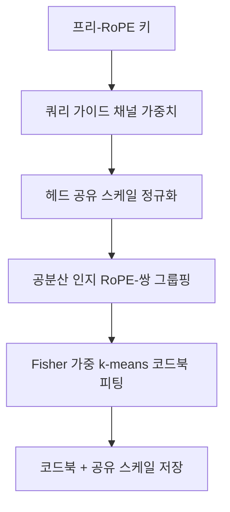

[논문 링크](https://arxiv.org/abs/2610.03027v1)
## TaSQ: 1비트 KV 캐시를 위한 양자화 공간 '맞춤 설계'

**TL;DR** — TaSQ(Tailored Space Vector Quantization)는 벡터 양자화(VQ)가 적용될 **타깃 공간 자체를 재설계**해, KV 캐시를 채널당 약 1.25비트로 압축하면서도 BF16에 근접한 품질을 유지한다. 핵심은 쿼리 가이드 채널 가중치, 헤드 공유 정규화, 공분산 인지 채널 그룹핑을 **프리-RoPE 키**에 적용하는 것이다. 단일 RTX 6000 Ada에서 KV 캐시 풀을 12.48배 확장하고, 최대 배치를 6→84(14배), 피크 처리량을 1.87배로 끌어올렸다 (근거: §Abstract, Fig. 4).

---

## 핵심 아이디어

긴 컨텍스트 추론에서 KV 캐시는 용량과 대역폭 모두에서 병목이 된다. 기존 벡터 양자화 방식은 1비트 수준까지 압축률이 높아지면 품질이 크게 무너지는데, 그 이유는 하나의 코드북이 점점 더 많은 채널을 제한된 센트로이드로 표현해야 하기 때문이다 (근거: §1).

TaSQ의 통찰은 단순하지만 강력하다. **"양자화 오차가 어텐션 로짓에 미치는 영향은 채널마다 다르다"** 그리고 **"VQ가 채널 간 의존성을 활용하려면 의존적인 채널이 같은 코드북에 묶여 있어야 한다"** 는 두 가지 사실에 주목한 것이다 (근거: §1).

이에 따라 TaSQ는 다음 세 변환으로 VQ 타깃 공간을 맞춤 설계한다 (근거: Fig. 2):

1. **쿼리 가이드 채널 가중치(Query-Guided Channel Weighting)** — $QK^\top$ 오차에 민감한 채널에 가중치를 부여 (근거: §4.1)
2. **헤드 공유 스케일 정규화(Cross-Head Shared-Scale Normalization)** — 토큰 수준의 크기 이상치(outlier)를 단일 RMS 스케일로 억제 (근거: §4.2)
3. **공분산 인지 채널 그룹핑(Covariance-Aware Channel Grouping)** — 의존적인 채널을 같은 로컬 VQ 그룹에 배정 (근거: §4.3)

핵심 포인트는 이 세 연산이 모두 **채널별 스케일링과 순열**만 사용할 뿐, 밀집 회전(dense rotation)을 요구하지 않는다는 것이다. 덕분에 가중치와 순열은 키 프로젝션 행렬과 코드북에 미리 흡수될 수 있고, 추론 시점에는 추가 연산이 거의 없다 (근거: §1, §4.4).

한눈에 보는 핵심 수치는 아래와 같다 (근거: §5, §6.1, Appx. B):

| 항목 | 값 |
|---|---|
| 타깃 비트율 (K/V) | 1.266 / 1.250 bits/element |
| 코드북 크기 / 그룹 크기 | $K=1024$ 센트로이드, $g=8$ 채널 |
| 평가 모델 | Llama-3.1-8B, Qwen3-4B(-Thinking), DeepSeek-R1-Distill-8B, Phi-4(14B) |
| 캘리브레이션 | 64개 창 × 2,048 토큰 |
| 처리량 | 412.6 tok/s (BF16 220.8 tok/s 대비 1.87배) |
| KV 풀 확장 | 12.48배 (235,257 → 2,935,184 토큰) |

---

## 배경: 그들이 해결한 문제

### KV 캐시는 왜 병목인가

디코더 전용 트랜스포머는 자기회귀적으로 토큰을 생성하며, 과거 토큰의 키/밸류 활성화는 이후 디코딩 스텝마다 재사용되므로 KV 캐시에 저장된다. 문제는 이 캐시가 시퀀스 길이에 따라 선형으로 증가하고, **매 디코딩 스텝마다 반복적으로 읽혀야** 한다는 점이다. 컨텍스트가 길어질수록 저장 용량과 메모리 대역폭 모두에 압력이 가해진다 (근거: §2.1).

이를 완화하는 방법으로 토큰 제거(eviction), 캐시 병합(merging), 양자화(quantization) 등이 연구되어 왔다. 그중 **양자화**가 가장 널리 쓰인다 (근거: §1).

### 왜 벡터 양자화(VQ)인가

VQ는 $g$차원 벡터를 유한 코드북 $\mathcal{C} = \{c_1, \dots, c_K\}$의 한 코드워드로 치환한다:

$$z(x) = \arg\min_{j} \lVert x - c_j \rVert_2^2, \qquad \hat{x} = c_{z(x)}$$

$g$차원 벡터를 $K$개 코드워드 중 하나로 표현할 때 인덱스 비용은 채널당 $\log_2 K / g$ 비트가 된다. 여러 채널을 공동으로 표현하며 결합 분포의 구조를 활용할 수 있으므로, VQ는 초저비트 압축에 특히 매력적이다 (근거: §2.2).

### 1비트 영역에서 기존 VQ의 붕괴

기존 방법은 연속적인 채널 그룹 위에 코드북을 학습하거나(CQ) (근거: §1), 캘리브레이션 없이 전역 코드북을 쓰기 위해 활성화를 정규화한다(NSNQuant) (근거: §1). 그러나 비트율이 채널당 1비트에 근접하면, 각 코드북이 더 큰 채널 그룹을 적은 센트로이드로 표현해야 하므로 품질 유지가 어려워진다 (근거: §1).

저자들은 세 가지 실험적 관찰로 문제를 정밀하게 진단한다 (근거: Fig. 1):

- **(a) 채널 민감도 불균형** — 쿼리 활성화 분포가 채널마다 크게 다르고, 일부 채널은 활성화 범위가 특히 넓다. $QK^\top$에서 키 채널 오차는 해당 쿼리 활성화에 비례해 스케일되므로, 채널별 민감도가 다르다 (근거: §3.1, Fig. 1a).
- **(b) 채널 간 상관관계 비균일** — 어떤 채널 쌍은 강하게 상관되지만 어떤 쌍은 거의 독립이다. VQ가 의존성을 활용하려면 어떤 채널을 함께 묶느냐가 결정적이다 (근거: §3.2, Fig. 1b).
- **(c, d) RoPE의 분포 확산** — RoPE는 키를 위치 의존 각도로 회전시켜 분포를 크게 퍼뜨린다. 프리-RoPE VQ가 모든 32개 레이어에서 더 낮은 복원 오차를 보이며, 총 복원 오차는 **35% 더 낮다** (근거: §3.3, Fig. 1c·d).

이 세 관찰이 곧 TaSQ의 세 설계 축으로 이어진다.

---

## 새로운 접근법: TaSQ

TaSQ는 **프리-RoPE 키**에 대해 VQ 타깃 공간을 세 단계로 변환하고, 추론 시에는 이 변환을 프로젝션과 코드북에 흡수해 기존 VQ 룩업 구조를 그대로 유지한다 (근거: §4).

### 4.1 쿼리 가이드 채널 가중치

프리-RoPE 키 양자화 오차 $\delta_{p,h} = k_{p,h} - \hat{k}_{p,h}$가 어텐션 로짓에 주는 영향을 정량화하기 위해, 포스트-RoPE 쿼리 $\bar{q}_{t,h}$와의 제곱 내적 오차를 다음과 같이 쓴다 (근거: §4.1):

$$\big(\bar{q}_{t,h}^\top R_p \delta_{p,h}\big)^2 = \delta_{p,h}^\top A_{t,p,h} \delta_{p,h}, \qquad A_{t,p,h} = R_p^\top \bar{q}_{t,h} \bar{q}_{t,h}^\top R_p$$

여기서 $R_p$는 위치 $p$의 RoPE 회전 행렬이다. 위치·토큰 독립적인 요약을 얻기 위해 유효 인과 쿼리-키 쌍에 대해 평균한 $\tilde{A}_h$를 구하고, RoPE 쌍 구조를 보존하기 위해 **대각 근사**를 취한다:

$$W_h = \operatorname{diag}(\tilde{A}_h), \qquad k^w_{p,h} = W_h^{1/2} k_{p,h}$$

이렇게 하면 가중 공간에서의 유클리드 VQ 복원 오차가 곧 $QK^\top$ 오차의 대리 지표(surrogate)가 된다 (근거: §4.1, Eq. 1). 그림 3(a)에서 가중치 부여가 모든 레이어에서 $QK^\top$ MSE와 어텐션 KL 발산을 일관되게 낮춘다 (근거: Fig. 3a).

### 4.2 헤드 공유 스케일 정규화

이상치 토큰을 억제하기 위해 토큰별 정규화를 적용하되, 기존 head-wise 방식과 달리 **모든 $H$개 KV 헤드에 단일 RMS 스케일**을 쓴다 (근거: §4.2):

$$s_p = \left( \frac{1}{H d} \sum_{h=1}^{H} \lVert k^w_{p,h} \rVert_2^2 \right)^{1/2}, \qquad k^{wn}_{p,h} = \frac{k^w_{p,h}}{s_p}$$

$b_s$비트 스케일의 메타데이터 비용은 head-wise의 $b_s / d$에서 $b_s / (H d)$로 **$H$배 감소**한다. 저자들은 $s_p$를 FP16($b_s=16$)으로 저장해 높은 해상도를 유지하면서도 비용을 낮춘다 (근거: §4.2). 절약된 비트는 코드북 인덱스에 재할당되어 더 많은 센트로이드를 확보할 수 있다 (근거: Appx. D).

### 4.3 공분산 인지 채널 그룹핑

가중·정규화된 키 공간의 공분산을 캘리브레이션 코퍼스로 추정하고($\Sigma^{wn}_h$), 후보 그룹 $G$의 비용을 다음과 같이 정의한다 (근거: §4.3):

$$c_h(G) = \det\!\big(\Sigma^{wn}_h[G, G] + \varepsilon I\big)^{1/|G|}$$

이는 가우시안 모델에서 고율 양자화 이론이 주는 점근 스케일링 $D_G \propto K^{-2/|G|} \det(\Sigma^{wn}_h[G, G])^{1/|G|}$에서 유래한다. $|G|$와 $K$가 그룹 간 고정이므로 그룹 의존 항은 공분산 행렬식뿐이고, 이것이 양자화 오차의 프록시가 된다 (근거: §4.3).

그룹핑은 "각 RoPE 쌍이 같은 그룹에 속하도록" 하는 제약 아래 총 비용 $\sum_{G \in \mathcal{G}_h} c_h(G)$를 최소화하는 분할 문제로 정식화된다. 가능한 분할 수가 지수적으로 많아 전수 탐색이 불가하므로, **계층적 최소 가중치 완전 매칭(hierarchical matching)** 으로 근사 해를 구한다 (근거: §4.3, Alg. 1).

실증적으로 이 공분산 인지 비용은 실제 VQ 왜곡과 강하게 상관된다. 대표 레이어에서 피어슨 상관 $r=0.994$, 전 레이어에서도 일관되게 높다. 연속 그룹핑 대비 그룹핑 목적과 VQ 복원 오차를 모두 줄인다 (근거: Fig. 3b·c·d).

### 4.4 맞춤 공간에서의 VQ와 런타임 융합

가중·정규화·그룹핑된 키 $k^{wnp}$에 대해 레이어·헤드·그룹별로 $K$센트로이드 코드북 $\mathcal{C}_{h,G}$를 피팅한다. 채널별 중요도에 더해 **토큰별 중요도**를 반영하기 위해 대각 경험적 Fisher $F_{p,h,i} = (\partial \mathcal{L}/\partial k^{wnp}_{p,h,i})^2$를 그룹 단위로 합산해 Fisher 가중 k-means를 수행한다 (근거: §4.4).

런타임에서는 가중치와 순열을 키 프로젝션에 흡수하고($\tilde{W}_{K,h} = P_h W_h^{1/2} W_{K,h}$), 역가중치는 코드워드에 흡수한다($\tilde{c}_{h,G,j} = [(P_h W_h P_h^\top)^{-1/2}]_{G,G}\, c_{h,G,j}$). 복원은 $\hat{k}_{p,h} = s_p \tilde{C}_h[z_{p,h}]$이며, $P_h$가 완전한 RoPE 쌍을 순열하므로 $\tilde{R}_{p,h} = P_h R_p P_h^\top$는 표준 블록대각 RoPE 구조를 유지한다 (근거: §4.4). 코드워드 룩업, 스케일 복원, RoPE, 내적이 모두 어텐션 커널에 융합되어 **런타임 채널 셔플링·밀집 변환·추가 커널 실행이 전혀 없다** (근거: §4.4).

**밸류 경로**는 표준 연속 그룹 VQ를 그대로 유지한다. 밸류는 키보다 채널 민감도 CV가 낮고(0.176 vs 0.841) 채널 간 상관도 약해(0.067 vs 0.136), 채널 가중·그룹핑의 이득이 작기 때문이다 (근거: §4.4, Fig. 6, Appx. C).

---

## 작동 원리: 구체적인 예시로 살펴보기

전체 파이프라인을 흐름으로 정리하면 다음과 같다 (근거: §4):

추론 시에는 이 변환들이 이미 프로젝션·코드북에 흡수되어 있어, 저장된 인덱스와 스케일만으로 즉석 RoPE와 내적을 수행한다 (근거: §4.4).

### 대각 근사가 왜 효율적인가

쿼리 가이드 가중치에서 핵심 설계 결정은 밀집 $\tilde{A}_h^{1/2}$ 대신 **대각** $\operatorname{diag}(\tilde{A}_h)^{1/2}$를 쓰는 것이다. 밀집 변환을 쓰면 디코딩 시 위치 의존 RoPE를 적용하기 전에 $d \times d$ 행렬곱으로 키를 복원해야 하는데, 이 복원은 쿼리 프로젝션에 합칠 수 없다($R_p$가 키 위치에 의존하므로). 이 비용은 어텐션 시간의 **1k 토큰에서 36%, 16k 토큰에서 103%** 에 이른다 (근거: Appx. D, Tab. 8).

품질 측면에서도 대각 근사가 오히려 낫다. 밀집 변환은 캘리브레이션 코퍼스에서 오차를 약간 낮추지만(0.00264 vs 0.00287), GSM8K에서는 **약 4배 높은** 오차(0.00933 vs 0.00234)를 보인다. 오프대각 채널 결합이 일반화되지 않는 것이다 (근거: Appx. D, Tab. 9).

### 캘리브레이션 길이를 넘어서면?

RoPE는 위치 의존적이므로, 포스트-RoPE 활성화에 피팅된 방법은 캘리브레이션에서 본 위치를 벗어나면 취약해질 수 있다. 16k 길이 WikiText-2에서 위치별 어텐션 로짓 NMSE를 보면, 프리-RoPE 방법인 CQ와 TaSQ는 캘리브레이션 범위 밖에서도 오차가 완만히 증가하지만, 포스트-RoPE 방법인 NovaKV는 급격히 악화된다 (근거: Appx. D, Fig. 7). 이것이 표 3의 장문 검색 결과와 일치하는 패턴이다 (근거: Appx. D).

---

## 성능 검증: 주요 결과

평가는 일반 태스크, 장문 사고(CoT) 추론, 장문 검색의 세 축으로 나뉘며, 모든 양자화 방법이 동일 정책을 쓴다 (근거: §5.1).

### 일반 벤치마크

Llama-3.1-8B-Instruct에서 TaSQ는 평균 **59.21** 로 BF16(63.94)에 가장 근접하며, CQ(48.03)·NSNQuant(53.30)·NovaKV(53.32)를 모두 앞선다. GSM8K에서는 81.73으로 BF16(83.62)과 불과 1.89포인트 차이다 (근거: Tab. 1).

### 장문 CoT 추론

추론 모델에서 격차가 더 두드러진다. Qwen3-4B-Thinking-2507의 평균에서 TaSQ는 **60.55** 를 기록해 BF16(67.18)의 약 90%를 보존하는 반면, CQ(28.52)·NovaKV(12.89)·NSNQuant(46.67)는 크게 무너진다. 특히 AIME'24에서 TaSQ는 68.89로 BF16(74.44)에 가깝다 (근거: Tab. 2). 반면 NovaKV는 장문 추론에서 심각한 품질 붕괴를 보인다 (근거: §5.2).

### 장문 검색 (RULER)

Llama-3.1-8B-Instruct의 니들-인-헤이스택에서 TaSQ는 4k–64k 전 구간 **92.00–93.67** 을 유지해 컨텍스트가 길어져도 거의 퇴화하지 않는다. NovaKV는 64k에서 1.83까지 추락하고, CQ는 전 구간에서 크게 뒤처진다 (근거: Tab. 3).

### 서빙 효율

단일 RTX 6000 Ada에서 (근거: Fig. 4, §6.1):

- TaSQ는 CQ와 동일한 처리량을 보여 추가 서빙 오버헤드가 거의 없음을 확인했다 (근거: Fig. 4a).
- KV 캐시 풀은 235,257 → 2,935,184 토큰으로 **12.48배** 확장됐고, 최대 배치 6 → 84(**14배**), 피크 처리량 220.8 → 412.6 tok/s(**1.87배**)로 상승했다 (근거: Fig. 4a).
- VQ 인코딩은 8k–32k 프롬프트의 TTFT를 **10–14%** 증가시키지만, 이 일회성 프리필 비용은 긴 생성으로 상쇄된다 (근거: Fig. 4b).
- **추론 안정성**: BF16의 캡 도달 비율 0.2% 대비 TaSQ는 3.8%로, CQ(20.0%)보다 훨씬 안정적이다. 생성 토큰 수 평균도 BF16(9,625)에 가까운 11,439로 유지된다 (근거: Fig. 4c).

### 절제 연구

각 구성요소를 제거한 WikiText-2 PPL은 그룹핑이 가장 큰 기여를 함을 보여준다 (근거: Tab. 4):

| 구성 | PPL↓ |
|---|---:|
| FP16 | 6.2374 |
| Full TaSQ | 8.4559 |
| w/o 쿼리 가이드 가중치 | 8.5172 |
| w/o 헤드 공유 정규화 | 8.5103 |
| w/o 공분산 그룹핑 | **10.1731** |

비트율 스윕에서도 TaSQ는 GSM8K·MBPP 전 모델에서 가장 강한 rate-accuracy 트레이드오프를 보이며, 키 비트율이 낮아질수록 우위가 커진다 (근거: Fig. 5).

---

## 우리의 관점: 강점, 한계, 그리고 이 연구가 중요한 이유

### 강점

이 논문의 가장 큰 미덕은 **"공간을 바꾼다"** 는 발상의 전환이다. 기존 VQ 방식이 코드북 크기·정규화 방식에 집중했다면, TaSQ는 양자화 *오차가 어디서, 얼마나 아파지는지*를 기준으로 공간 자체를 재설계한다. 그 결과 세 변환 모두 **채널 스케일링과 순열**이라는 값싼 연산으로 구성되어, 거의 무료에 가까운 런타임 비용으로 품질을 끌어올린다 (근거: §1, Fig. 4a).

또 하나 주목할 점은 **대각 근사의 실용적 우월성**이다. 이론적으로는 밀집 변환이 더 표현력이 높아 보이지만, 실제로는 캘리브레이션 범위 밖에서 오히려 역효과를 내며, 디코딩 비용은 최대 103%나 추가된다 (근거: Appx. D). "이론적으로 더 나은 것이 실전에서 항상 낫지 않다"는 것을 정량적으로 보여준 사례다.

### 한계

- **밸류는 그대로 둠**: 밸류 경로는 표준 VQ를 유지한다. 밸류 측 변환을 적용해도 PPL 개선이 8.45594 → 8.42058(0.42%)에 그쳐 수용하지 않았는데, 이는 키에 비해 밸류의 구조가 균일하기 때문이다 (근거: Appx. C). 다만 저자 스스로 밸류 맞춤 공간 설계를 미래 과제로 남겼다 (근거: §7, Appx. C).
- **초저비트 극한의 잔여 갭**: 1.25비트에서도 BF16 대비 일반 벤치마크 평균은 여전히 약 4–5포인트 차이가 있다 (근거: Tab. 1). 갭은 좁혀졌지만 완전히 메워지진 않았다.
- **계층적 그룹핑은 전역 최적을 보장하지 않음**: 매칭 기반 근사는 이전 병합이 이후 선택을 제약하므로, 이론적 최적 분할을 보장하지 않는다 (근거: Appx. D). 실험적으로는 충분히 좋지만, 더 정교한 최적화 여지가 남는다.
- **단일 GPU 검증**: 서빙 효율 실험은 RTX 6000 Ada 단일 카드 기준이며, 멀티 노드·대규모 배치 확장성은 추가 검증이 필요하다 (근거: §5.1).

### 왜 중요한가

1비트 수준의 KV 캐시 압축은 곧 "더 긴 컨텍스트를 더 큰 배치로, 같은 메모리에서" 서빙하는 것을 의미한다. TaSQ가 보여준 14배 배치 확장과 1.87배 처리량 향상은 메모리 대역폭이 병목인 장문 추론 서빙에서 직접적인 비용 절감으로 이어진다 (근거: Fig. 4). 게다가 추론 모델에서도 생성 안정성을 유지한다는 점은, 실제 프로덕션 배포에서 가장 아픈 지점을 정확히 겨냥한 것이다 (근거: Fig. 4c).

---

## 다음 단계는?: 앞으로의 길

저자가 명시적으로 열어둔 방향은 **밸류 경로의 맞춤 설계**다 (근거: §7, Appx. C). 키에 적용한 가중·정규화·그룹핑을 밸류의 구조(더 균일한 민감도, 약한 상관관계)에 맞게 재설계하는 것이 자연스러운 후속 작업이다 (근거: Fig. 6).

한계를 고려한 합리적 다음 단계로는 다음을 꼽을 수 있다:

1. **그룹핑 최적화의 개선** — 계층적 매칭의 근사 한계를 넘어, 전역 최적에 더 가까운 분할 탐색(예: 스펙트럴 클러스터링, 아핀 최적화)을 시도해 볼 수 있다 (근거: Appx. D).
2. **멀티 GPU·분산 서빙 확장** — 단일 카드에서 확인한 1.87배 처리량 이득이 텐서 병렬·파이프라인 병렬 환경에서도 유지되는지 검증이 필요하다 (근거: §5.1).
3. **스케일 비트폭의 동적 할당** — 헤드 공유 스케일의 비트폭을 고정 FP16이 아니라 헤드·레이어별 중요도에 따라 차등 할당하는 방향도 탐색 가치가 있다 (근거: §4.2).

종합하면 TaSQ는 "초저비트 KV 캐시 압축"이라는 어려운 문제에서, 단순히 코드북을 더 잘 학습하는 대신 **양자화가 일어나는 공간을 문제에 맞게 다시 짜는** 접근이 얼마나 효과적인지 보여준 깔끔한 연구다.

<!-- verbatim-tables -->

## 논문 원문의 표

> arXiv e-print 의 LaTeX 원본에서 기계적으로 옮긴 표입니다. 숫자는 논문의 값이며 모델을 거치지 않았습니다.

**표 1. General performance under low-bit KV cache quantization. All results use greedy decoding. Bold denotes the best quantized result; higher is better.**

| Model | Method | Bits (K/V) | GSM8K | MATH500 | MBPP | HumanEval | BBH | MMLU | Avg. |
|---|---|---|---|---|---|---|---|---|---|
| Llama-3.1-8B-Instruct | BF16 | 16.000/16.000 | 83.62 | 42.20 | 59.60 | 62.20 | 73.38 | 62.64 | 63.94 |
|  | CQ | 1.250/1.250 | 68.01 | 19.60 | 52.00 | 54.27 | 40.08 | 54.21 | 48.03 |
|  | NovaKV | 1.375/1.250 | 76.95 | 29.40 | 55.00 | 53.66 | 48.46 | 56.43 | 53.32 |
|  | NSNQuant | 1.238/1.238 | 73.39 | 31.40 | 50.20 | 57.93 | 48.57 | **58.33** | 53.30 |
|  | TaSQ | 1.266/1.250 | **81.73** | **34.00** | **58.40** | **58.54** | **64.28** | **58.33** | **59.21** |
| Qwen3-4B | BF16 | 16.000/16.000 | 86.28 | 72.60 | 64.00 | 81.71 | 78.03 | 74.72 | 76.22 |
|  | CQ | 1.250/1.250 | 70.36 | 60.80 | 45.40 | 65.85 | 52.08 | 64.14 | 59.77 |
|  | NovaKV | 1.375/1.250 | 84.53 | 66.80 | **62.60** | 76.22 | **68.80** | 67.21 | 71.03 |
|  | NSNQuant | 1.238/1.238 | 65.58 | 52.40 | 46.20 | 67.68 | 49.57 | 63.29 | 57.45 |
|  | TaSQ | 1.266/1.250 | **85.44** | **69.80** | **62.60** | **77.44** | 68.28 | **71.26** | **72.47** |

**표 2. Long-CoT reasoning performance under low-bit KV cache quantization. We report the mean and standard deviation over three seeds. Bold denotes the best quantized result; higher is better.**

| Model | Method | Bits (K/V) | AIME'24 | AIME'25 | LCB-v6 | SciBench | Avg. |
|---|---|---|---|---|---|---|---|
| Qwen3-4B-Thinking-2507 | BF16 | 16.000/16.000 | 74.44$\pm$1.92 | 74.44$\pm$5.09 | 45.85$\pm$0.62 | 73.99$\pm$0.43 | 67.18$\pm$1.37 |
|  | CQ | 1.250/1.250 | 26.67$\pm$3.33 | 14.44$\pm$5.09 | 18.99$\pm$0.44 | 54.00$\pm$0.94 | 28.52$\pm$1.54 |
|  | NovaKV | 1.375/1.250 | 7.78$\pm$1.92 | 6.67$\pm$3.33 | 9.16$\pm$0.38 | 27.94$\pm$2.08 | 12.89$\pm$1.10 |
|  | NSNQuant | 1.238/1.238 | 44.44$\pm$6.94 | 38.89$\pm$1.92 | 34.66$\pm$0.33 | 68.69$\pm$0.55 | 46.67$\pm$1.81 |
|  | TaSQ | 1.266/1.250 | **68.89$\pm$1.92** | **56.67$\pm$3.33** | **43.00$\pm$0.47** | **73.65$\pm$0.60** | **60.55$\pm$0.98** |
| DeepSeek-R1-Distill-Llama-8B | BF16 | 16.000/16.000 | 53.33$\pm$3.33 | 31.11$\pm$1.92 | 39.68$\pm$0.56 | 38.49$\pm$0.30 | 40.65$\pm$0.98 |
|  | CQ | 1.250/1.250 | 26.67$\pm$3.33 | 26.67$\pm$5.77 | 23.29$\pm$0.45 | 35.45$\pm$1.61 | 28.02$\pm$1.72 |
|  | NovaKV | 1.375/1.250 | 35.56$\pm$5.09 | 18.89$\pm$3.85 | 20.98$\pm$0.65 | 33.62$\pm$0.44 | 27.26$\pm$1.61 |
|  | NSNQuant | 1.238/1.238 | 44.44$\pm$5.09 | 24.44$\pm$5.09 | 32.67$\pm$1.15 | 34.83$\pm$1.64 | 34.10$\pm$1.87 |
|  | TaSQ | 1.266/1.250 | **48.89$\pm$6.94** | **31.11$\pm$1.92** | **32.95$\pm$0.61** | **39.11$\pm$1.50** | **38.02$\pm$1.85** |
| Phi4-14B-Reasoning-Plus | BF16 | 16.000/16.000 | 71.11$\pm$1.92 | 66.67$\pm$3.33 | 46.60$\pm$0.71 | 48.22$\pm$1.03 | 58.15$\pm$1.01 |
|  | CQ | 1.250/1.250 | 52.22$\pm$3.85 | 31.11$\pm$5.09 | 13.33$\pm$0.55 | 33.14$\pm$1.34 | 32.45$\pm$1.64 |
|  | NovaKV | 1.375/1.250 | 41.11$\pm$10.18 | 35.56$\pm$1.92 | 21.93$\pm$0.29 | 41.57$\pm$1.86 | 35.04$\pm$2.63 |
|  | NSNQuant | 1.238/1.238 | 63.33$\pm$6.67 | 55.56$\pm$5.09 | 37.12$\pm$1.04 | 44.99$\pm$0.65 | 50.25$\pm$2.12 |
|  | TaSQ | 1.263/1.250 | **71.11$\pm$5.09** | **60.00$\pm$0.00** | **41.20$\pm$0.52** | **50.58$\pm$1.90** | **55.72$\pm$1.36** |

**표 3. Needle-in-a-haystack retrieval performance at increasing context lengths. We report the mean and standard deviation over three seeds. Bold denotes the best quantized result; higher is better.**

| Model | Method | Bits (K/V) | 4k | 8k | 16k | 32k | 64k |
|---|---|---|---|---|---|---|---|
| Llama-3.1-8B-Instruct | BF16 | 16.000/16.000 | 98.50$\pm$1.73 | 98.83$\pm$0.76 | 98.67$\pm$0.29 | 98.67$\pm$0.76 | 98.17$\pm$1.04 |
|  | CQ | 1.250/1.250 | 19.33$\pm$1.61 | 15.50$\pm$3.61 | 12.67$\pm$1.26 | 12.83$\pm$3.18 | 6.33$\pm$1.26 |
|  | NovaKV | 1.375/1.250 | 84.83$\pm$0.29 | 81.67$\pm$3.18 | 64.00$\pm$2.18 | 21.33$\pm$2.25 | 1.83$\pm$0.29 |
|  | NSNQuant | 1.238/1.238 | 89.17$\pm$1.61 | 86.00$\pm$1.32 | 86.83$\pm$4.25 | 88.17$\pm$1.15 | 82.17$\pm$0.58 |
|  | TaSQ | 1.266/1.250 | **93.33$\pm$2.08** | **93.17$\pm$0.76** | **92.00$\pm$1.32** | **93.67$\pm$1.04** | **93.17$\pm$0.76** |
| Qwen3-4B-Thinking-2507 | BF16 | 16.000/16.000 | 100.00$\pm$0.00 | 100.00$\pm$0.00 | 99.83$\pm$0.29 | 99.67$\pm$0.29 | 95.33$\pm$2.36 |
|  | CQ | 1.250/1.250 | 71.50$\pm$1.73 | 63.33$\pm$4.01 | 48.17$\pm$0.29 | 21.83$\pm$1.04 | 10.50$\pm$2.78 |
|  | NovaKV | 1.375/1.250 | **99.83$\pm$0.29** | 27.67$\pm$2.25 | 0.00$\pm$0.00 | 0.00$\pm$0.00 | 0.00$\pm$0.00 |
|  | NSNQuant | 1.238/1.238 | 97.83$\pm$2.47 | 97.00$\pm$0.50 | 93.67$\pm$0.76 | 91.17$\pm$0.29 | 73.00$\pm$2.18 |
|  | TaSQ | 1.266/1.250 | **99.83$\pm$0.29** | **98.67$\pm$0.76** | **98.83$\pm$0.58** | **98.50$\pm$0.00** | **81.50$\pm$1.50** |
| Phi4-14B-Reasoning-Plus | BF16 | 16.000/16.000 | 99.83$\pm$0.29 | 99.83$\pm$0.29 | 99.67$\pm$0.29 | 99.50$\pm$0.00 | -- |
|  | CQ | 1.250/1.250 | 62.00$\pm$1.32 | 54.83$\pm$3.33 | 47.67$\pm$3.51 | 34.33$\pm$4.25 | -- |
|  | NovaKV | 1.375/1.250 | 97.33$\pm$1.26 | 91.83$\pm$1.61 | 62.50$\pm$3.28 | 0.00$\pm$0.00 | -- |
|  | NSNQuant | 1.238/1.238 | 98.67$\pm$0.76 | 98.17$\pm$1.44 | 98.00$\pm$0.50 | 92.67$\pm$1.26 | -- |
|  | TaSQ | 1.263/1.250 | **99.83$\pm$0.29** | **99.33$\pm$0.76** | **98.67$\pm$0.58** | **97.33$\pm$0.76** | -- |

**표 4. Component ablation of TaSQ on base Llama-3.1-8B. We report WikiText-2 perplexity at sequence length 2,048. Bold denotes the best quantized result.**

| Method | PPL $\downarrow$ |
|---|---|
| FP16 | 6.2374 |
| Full TaSQ | **8.4559** |
| w/o query-guided weighting | 8.5172 |
| w/o cross-head normalization | 8.5103 |
| w/o covariance-aware grouping | 10.1731 |

**표 5. Effective cache rate in bits per element. Per-token metadata costs are included in the reported rates.**

| Method | Channel | Representation | Rate |
|---|---|---|---|
| CQ | K | 1,024-centroid VQ | \(10/8 = 1.250\) |
|  | V | 1,024-centroid VQ | \(10/8 = 1.250\) |
| NSNQuant | K | 256-centroid VQ + normalization metadata | \(8/8 + 0.238 = 1.238\) |
|  | V | 256-centroid VQ + normalization metadata | \(8/8 + 0.238 = 1.238\) |
| NovaKV | K | 1,024-centroid VQ + one 16-bit head-wise scale | \(10/8 + 16/128 = 1.375\) |
|  | V | 1-bit SQ + two 16-bit head-wise parameters | \(1 + 32/128 = 1.250\) |
| TaSQ | K | 1,024-centroid VQ + one 16-bit cross-head scale | \(10/8 + 16/(8\cdot128) = 1.266\) |
|  | V | 1,024-centroid VQ | \(10/8 = 1.250\) |

**표 6. Value-side ablation on Llama-3.1-8B: WikiText-2 perplexity at sequence length 2,048 (lower is better). The TaSQ key path is identical in both rows.**

| Value quantization | PPL $\downarrow$ |
|---|---|
| TaSQ | 8.45594 |
| TaSQ + value-side transformations | **8.42058** |

**표 7. Relative SSE with separately fitted codebooks, across all layers. Bits per channel include fp16 scale metadata with $g=8$, $d=128$, and $H=8$.**

| scale / codebook | bits/elem | Llama-3.1-8B mean | Llama-3.1-8B min | Llama-3.1-8B max | Qwen3-4B mean | Qwen3-4B min | Qwen3-4B max |
|---|---|---|---|---|---|---|---|
| per-head, $K=1024$ | 1.3750 | 0.004483 | 0.002882 | 0.006953 | 0.019794 | 0.006732 | 0.030261 |
| pooled, $K=1024$ | 1.2656 | 0.004564 | 0.002965 | 0.007037 | 0.019688 | 0.006754 | 0.030014 |
| pooled, $K=2048$ | 1.3906 | 0.003460 | 0.002245 | 0.005313 | 0.014763 | 0.005045 | 0.022639 |

**표 8. Cost of dense key restoration for Qwen3-4B-Thinking-2507 on one RTX 3090 at batch size 1. Restoration is measured as a standalone BF16 GEMM over reconstructed keys, excluding VQ decoding; overhead is relative to attention latency.**

| Context (tokens) | Latency (ms/step) Attention | Latency (ms/step) Dense Restoration | Overhead (%) |
|---|---|---|---|
| 1 024 | 1.55 | 0.55 | $+36\%$ |
| 4 096 | 2.11 | 1.23 | $+58\%$ |
| 16 384 | 4.14 | 4.27 | $+103\%$ |

> 이 글의 그림은 arXiv:2610.03027 원본에서 가져왔습니다 (CC BY 4.0). 크기와 형식만 바꿨습니다.
