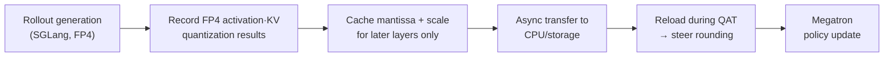

[Paper](https://arxiv.org/abs/2610.07767)
## TRACE: Rollout-Aligned FP4 Quantization-Aware Training — MoE LLM RL at BF16 Quality, up to 5.4x Faster

## TL;DR

In reinforcement learning (RL) for MoE LLMs, quantizing rollout generation to **FP4 (W4A4 + FP4 KV)** speeds up generation by up to **5.4x**, but it widens the numerical mismatch between the training path and the rollout path, making training unstable or causing collapse. This paper proposes **TRACE**, which uses the **FP4 quantization results** actually produced on the rollout side directly as a signal to steer the **rounding** decisions on the training side, preserving nearly identical performance to BF16 rollouts while capturing FP4's speed advantage (source: §1, §0).

## Key Idea

The authors' diagnosis is as follows. Existing FP4 RL methods (QUADS, Rollout-ResQ, etc.) focus on individually improving the **quantization accuracy of each path** — training and rollout. But reducing the quantization error of each path does not guarantee reducing the **discrepancy** between the two paths (source: §3.1). TRACE has two pillars.

- **Rollout-Guided QAT**: It sets the training-side rounding direction from the FP4 codewords generated during rollout, **directly** minimizing the cross-path discrepancy (source: §3.1).
- **Compact quantization-information caching**: Based on the observation that most discrepancies appear as a difference of **one adjacent bin** in the FP4 codebook, it retains only the **mantissa + scale** information of the deeper layers, cutting storage and communication overhead by about **6x** (source: §3.2).

## Background: The Problem They Solved

In post-training of LLMs, RL has become a key means of raising performance on reasoning, coding, and long-horizon tasks (source: §1). But RL must repeatedly generate long trajectories (rollout), so **compute and memory costs are high**. To reduce these costs, approaches that quantize rollouts to low precision have been proposed, and the aggressive **FP4 (W4A4)** in particular offers a larger acceleration margin (source: §1).

The problem is that FP4's coarse quantization space enlarges the **numerical mismatch between the training path and the rollout path**. This mismatch leads to **policy mismatch** and makes RL unstable. **MoE models are especially vulnerable**. A tiny numerical difference changes the router scores, which then activates different experts and amplifies the discrepancy (source: §2). R3 (routing replay), PR2 (router-evolution correction), GSPO (sequence-level clipping), and others address this routing mismatch, but they do not solve the **numerical mismatch caused by quantization itself** (source: §2).

The authors summarize the fundamental limitation of existing FP4 RL methods in one sentence: **"failure to align quantization-accuracy optimization with training–rollout discrepancy reduction"** — even reducing quantization error can still leave the two paths' quantized values far apart, ultimately leading to performance degradation or training collapse (source: §1).

## The New Approach: TRACE

**TRACE** stands for *Train-Rollout Quantization Alignment via Compact GuidancE*, an FP4 RL training framework for MoE LLMs (source: §0). It consists of **two designs** that align the quantization of the training path and the rollout path.

1. **Rollout-Guided QAT**: During rollout generation it records the quantization results of FP4 routed-expert activations and FP4 KV states, and in the subsequent QAT step it uses this information to steer training-side rounding (source: §3.1).
2. **Mantissa-only communication**: Instead of the full quantized values, it caches and transmits only the minimal information needed to determine the rounding direction (the mantissa and scale of the deeper layers) (source: §3.2).

A formula makes this clearer. At the same trajectory, token position, and quantization point, the quantization discrepancy between the paired training and rollout activations is defined as follows (source: §3.1).

$$
\mathcal{D}_{\mathrm{act}} = \left\| Q^{\mathrm{train}}_{\mathrm{FP4}}(X_{\mathrm{train}}) - Q^{\mathrm{rollout}}_{\mathrm{FP4}}(X_{\mathrm{rollout}}) \right\|_F
$$

The key insight is that in FP4 rounding, **a small BF16 difference is greatly amplified when it crosses a rounding boundary**. For example, suppose the training and rollout activations are $60.24$ and $59.76$, a BF16 difference of only $0.48$; normalized with the same global and block scales they become $2.51$ and $2.49$, straddling the rounding boundary and rounding to $3$ and $2$ respectively. The discrepancy is amplified from $0.48$ to $24$, about **50x** (source: §3.1).

## How It Works: A Concrete Example

### Why "improving accuracy" alone is not enough

Fig. 3 shows a case where an existing method (e.g., QUADS) actually increases the discrepancy (source: §3.1). QUADS keeps the BF16 training activation and corrects the rollout-side FP4 error with the residual $R(X)=X-Q(X)$. Consider the case where the training and rollout activations are $2.40$ and $2.49$.

- **Vanilla FP4**: Maps both values to $2$ → quantization discrepancy $0$.
- **QUADS**: Keeps $2.40$ on the training side and reconstructs $2.50$ on the rollout side → per-path error decreases, but the **discrepancy increases to $0.10$**.

In other words, reducing each path's error and reducing the discrepancy between paths are **separate goals**.

### TRACE's rounding choice

For each training activation $X_{\mathrm{train}}$, TRACE takes the **two neighboring FP4 E2M1 codewords** $\{q_{-}, q_{+}\}$ of the value normalized under the rollout scale as candidates, and instead of standard round-to-nearest (RTN) it picks the one closer to the rollout side's actual codeword $q_{\mathrm{rollout}}$ (source: §3.1).

$$
q_{\mathrm{TRACE}} = \arg\min_{q \in \{q_{-},\, q_{+}\}} \left| q - q_{\mathrm{rollout}} \right|
$$

This choice gives the following guarantee over the same candidate set (source: §3.1).

$$
\left| q_{\mathrm{TRACE}} - q_{\mathrm{rollout}} \right| \le \left| q_{\mathrm{RTN}} - q_{\mathrm{rollout}} \right|
$$

That is, compared with RTN, TRACE **does not increase the local discrepancy at each point**. This local guarantee does not imply a monotonic decrease in the overall network discrepancy, but the key point is that it removes the "unnecessary amplification caused by mismatched rounding" (source: §3.1).

### Why a single mantissa bit is enough

Transmitting **all** the rollout information needed for the above guidance is prohibitively expensive. For Qwen3.5-35B-A3B (hidden dimension $2048$, KV head dimension $256$, $40$ MoE layers, max response $256$K tokens), about $45$ KB of activation guidance and $5.6$ KB of KV guidance are generated per token. Using $4096$ trajectories per RL step gives **about 51 TB** of quantization information per step. At GPU→CPU $300$ GB/s that is about 3 minutes, but writing and reading it on storage at $5$ GB/s takes **about 3 hours**, far exceeding the RL step time (source: §3.2).

The authors make two observations (source: §3.2).

- **Over 99%** of the quantized values with discrepancies differ by only **one adjacent bin** in the FP4 codebook (Fig. 6).
- Rounding corrections occur mainly in the **deeper layers**.

Therefore, given the training-side activation and the rollout scale, the candidate codewords are nearly determined, so **sending only the mantissa codeword information rather than the full value** is enough to identify the desired neighboring codeword. TRACE transmits only the **mantissa + scale of the second half of the layers**. For Qwen3.5-35B-A3B, applying 1-bit mantissa + amortized scale to the last 20 layers gives $2048 \times 20 \times 1.5 = 61{,}440$ bits per token ≈ **$7.5$ KB**, about a **6x** reduction versus full activation caching (source: §4.2).

### Data Flow

## Evaluation: Main Results

Experiments span 4 MoE models (reasoning, coding, long-horizon RL) on a common infrastructure (VeRL + Megatron + SGLang, GRPO, R3) (source: §4).

On **reasoning RL (Qwen3.5-35B-A3B, joint NVFP4 W/A + KV quantization)**, TRACE leads existing methods on every benchmark and recovers BF16-level performance (source: §4.1, Tab. 1).

| Algorithm | LiveCodeBench | AIME24 | AIME25 | HMMT25 | Average |
|---|---:|---:|---:|---:|---:|
| BF16 (reference) | 67.1 | 83.8 | 81.3 | 67.5 | 74.9 |
| QAT | 55.1 | 70.7 | 63.4 | 49.2 | 59.6 |
| QaRL | 54.1 | 73.3 | 57.9 | 49.2 | 58.6 |
| QUADS | 60.4 | 80.5 | 75.4 | 59.0 | 68.8 |
| **TRACE** | **66.4** | **86.3** | 78.5 | **70.0** | **75.3** |

The average score jumps from **68.8 → 75.3 (+6.5)** versus QUADS, and HMMT25 from **59.0 → 70.0 (+11.0)**, essentially tying BF16 (74.9) (source: §4.1).

**Large-model scaling** is even more impressive (source: §4.1, Tab. 2).

| Model (task/metric) | BF16 | QAT | QUADS | TRACE |
|---|---:|---:|---:|---:|
| Qwen3.5-122B-A10B (DeepSWE) | 33.4 | 28.8 | 29.1 | 33.0 |
| Qwen3.8-Flash-Next (Terminal-Bench) | 68.8 | 60.4 | 66.4 | **70.6** |
| Qwen3.8-2.4T-A95B (GDPval) | 90.3 | 88.7 | 85.9 | 90.2 |

On Flash-Next it even **exceeds BF16 (68.8) by 1.8 points**. A notable finding is the training dynamics: TRACE starts below BF16 due to quantization but **catches up to BF16 after about 120 steps** and is thereafter equal or higher — that is, the policy **adapts** to the FP4 environment (source: §4.1, Fig. 7). In contrast, QAT, QaRL, and QUADS see the discrepancy grow as training proceeds, with reward and test scores collapsing in the later phase.

On **efficiency**, TRACE maintains generation throughput nearly identical to vanilla FP4 while achieving up to **5.4x** the decoding throughput of BF16 at a **128K output length**. End-to-end RL step time is only about **7.4%** overhead versus vanilla FP4 (**664 → 713**, in relative time units). Breaking down rollout time, model forward is **86%**, weight/KV guidance are **4%/2%** each, and KV dequantization is **8%** (source: §4.2).

The **ablation studies** are consistent (source: §4.3). In the MXFP4 format, W4A8 improves from **69.0 → 75.1** and the more aggressive W4A4 from **67.2 → 73.5**. In the sensitivity analysis, the default setting (last 20 layers, 1-bit mantissa) gives an average of **75.3**, and reducing coverage to 10/5 layers drops it gently to **74.1/73.4**. It also wins against Score Centering (74.1 vs 75.3), and against post-hoc PTQ after BF16 training (vanilla 70.4 / 4over6 71.0 / H-Scale 71.4 vs **TRACE 75.3**) (source: §4.4, §4.5).

## Our Perspective: Strengths, Limitations, and Why This Work Matters

### Strengths

- **Sharp problem definition.** Separating "quantization accuracy" from "training–rollout discrepancy" and making the latter the **direct objective** is the paper's biggest contribution and a first attempt of its kind (source: §1, §3.1).
- **A balance of theoretical guarantee and practical compromise.** It handles the accuracy–cost trade-off convincingly with the local non-increase guarantee (§3.1) and observation-driven mantissa-only communication (§3.2).
- **Breadth of scale and tasks.** From 35B to 2.4T-A95B, across reasoning, coding, and long-horizon tasks, it shows it does not overfit to a single setting (source: §4).
- **The "adaptation" finding.** A policy adapting to the FP4 environment and catching up to BF16 suggests possibilities for low-precision RL beyond mere preservation (source: §4.1).

### Limitations and Critical Questions

- **The explicit limitations section is empty.** The "Limitations" subsection in the appendix is commented out, leaving almost no limitations acknowledged by the authors (source: Appx.). This makes fairness evaluation difficult.
- **It does not resolve the fundamental mismatch of policy staleness.** TRACE only reduces the "extra discrepancy caused by rounding," leaving intact the activation differences that arise from the training policy and rollout policy differing in the first place (source: §4). Its interaction with routing-alignment methods such as R3 and PR2 remains open.
- **It relies on reconstruction rather than exact codewords.** Mantissa-only caching uses an approximate reference rather than "full recovery" (§3.2, Alg. 1), so guidance quality may degrade in extreme distributions.
- **FP4 hardware dependence.** It depends heavily on NVFP4/MXFP4 kernels and disaggregated (disagg) deployment and asynchronous communication pipelines, so generalization to other precisions and infrastructures needs further validation (source: §4, Appx. D).
- **The cost–benefit boundary is unclear.** There is a lack of total-cost-of-ownership (TCO) analysis of how the complex engineering needed to avoid the 7.4% step overhead and the ~51 TB of data movement actually exceeds the time saved versus BF16.

### Why It Matters

RL post-training is now standard in modern LLM development, and most of its cost lies in **rollout generation**. TRACE offers a way to break through this cost bottleneck with FP4 while preserving quality, providing a practically reproducible recipe. At the same time, the conceptual distinction of "quantization error vs cross-path discrepancy" is a framework reusable across low-precision training broadly.

## What's Next?: The Road Ahead

The authors state no explicit future plans, but given the above limitations the next steps follow naturally.

- **Integrating staleness alignment**: A unified framework combining R3/PR2 routing alignment with TRACE's quantization alignment to address both sources of policy mismatch (routing + quantization) together.
- **Adaptive caching**: Dynamically adjusting the number of guidance bits per layer and per step to reduce communication overhead further without performance loss.
- **Extension to other precisions and architectures**: Validation on FP8, INT4, dense models, and even longer contexts (1M-token scale).
- **TCO and energy analysis**: Quantifying the real benefit of low-precision RL from a total compute and power cost perspective, beyond "speedup."

<!-- verbatim-tables -->

## Tables from the paper

> Tables converted mechanically from the arXiv e-print LaTeX source. The numbers are the paper's own and did not pass through a model.

**Table 1. Table 1**

| Rollout Config | Algo. | Qwen3.5-35B-A3B LiveCodeBench | Qwen3.5-35B-A3B AIME24 | Qwen3.5-35B-A3B AIME25 | Qwen3.5-35B-A3B HMMT25 | Qwen3.5-35B-A3B Average |
|---|---|---|---|---|---|---|
| mygrayBF16 W/A + BF16 KV | mygrayVanilla | mygray**67.1** | mygray83.8 | mygray**81.3** | mygray67.5 | mygray74.9 |
| NVFP4 W/A + NVFP4 KV | QAT | 55.1 | 70.7 | 63.4 | 49.2 | 59.6 |
|  | QaRL | 54.1 | 73.3 | 57.9 | 49.2 | 58.6 |
|  | QUADS | 60.4 | 80.5 | 75.4 | 59.0 | 68.8 |
|  | **`TRACE`\xspace** | 66.4 (mygreen$\uparrow$6.0) | **86.3** (mygreen$\uparrow$5.8) | 78.5 (mygreen$\uparrow$3.1) | **70.0** (mygreen$\uparrow$11.0) | **75.3** (mygreen$\uparrow$6.5) |

**Table 2. Table 2**

| Rollout Config | Algo. | LiveCodeBench | AIME24 | AIME25 | HMMT25 | Average |
|---|---|---|---|---|---|---|
| mygrayBF16 W/A + BF16 KV | mygrayVanilla | mygray67.1 | mygray**83.8** | mygray81.3 | mygray67.5 | mygray74.9 |
| NVFP4 W/A + BF16 KV | QAT$^{\dagger}$ | 63.5 | 81.7 | 78.8 | 60.4 | 71.1 |
|  | QUADS$^{\dagger}$ | 64.8 | 83.3 | 80.4 | 62.9 | 72.9 |
|  | **`TRACE`\xspace** | 67.1 (mygreen$\uparrow$2.3) | 83.1 | **82.1** (mygreen$\uparrow$1.7) | **69.4** (mygreen$\uparrow$6.5) | **75.4** (mygreen$\uparrow$2.5) |
| BF16 W/A + NVFP4 KV | QAT | 65.3 | 82.3 | 79.2 | 65.8 | 73.2 |
|  | **`TRACE`\xspace** | **68.1** (mygreen$\uparrow$2.8) | 83.0 (mygreen$\uparrow$0.7) | 80.7 (mygreen$\uparrow$1.5) | 67.3 (mygreen$\uparrow$1.5) | 74.8 (mygreen$\uparrow$1.6) |

**Table 3. Table 3**

| Rollout Config | Algo. | LiveCodeBench | AIME24 | AIME25 | HMMT25 | Average |
|---|---|---|---|---|---|---|
| mygrayBF16 W/A + BF16 KV | mygrayVanilla | mygray**67.1** | mygray**83.8** | mygray**81.3** | mygray67.5 | mygray74.9 |
| W4A8 + MXFP4 KV | QAT | 64.9 | 75.4 | 76.9 | 58.8 | 69.0 |
|  | **`TRACE`\xspace** | **67.1** (mygreen$\uparrow$2.2) | 83.3 (mygreen$\uparrow$7.9) | 81.2 (mygreen$\uparrow$4.3) | **68.7** (mygreen$\uparrow$9.9) | **75.1** (mygreen$\uparrow$6.1) |
| W4A4 + MXFP4 KV | QAT | 60.2 | 74.8 | 73.2 | 60.7 | 67.2 |
|  | **`TRACE`\xspace** | 65.2 (mygreen$\uparrow$5.0) | 82.0 (mygreen$\uparrow$7.2) | 79.8 (mygreen$\uparrow$6.6) | 67.1 (mygreen$\uparrow$6.4) | 73.5 (mygreen$\uparrow$6.3) |

**Table 4. Table 4**

| Rollout Config | Algo. | LiveCodeBench | AIME24 | AIME25 | HMMT25 | Average |
|---|---|---|---|---|---|---|
| mygrayBF16 W/A + BF16 KV | mygrayVanilla | mygray**67.1** | mygray83.8 | mygray**81.3** | mygray67.5 | mygray74.9 |
| FP4 W/A + FP4 KV | QUADS | 60.4 | 80.5 | 75.4 | 59.0 | 68.8 |
|  | **`TRACE`\xspace `(R-4bit-L40)`** | 67.0 (mygreen$\uparrow$6.6) | 86.1 (mygreen$\uparrow$5.6) | 80.1 (mygreen$\uparrow$4.7) | **70.5** (mygreen$\uparrow$11.5) | **75.9** (mygreen$\uparrow$7.1) |
|  | **`TRACE`\xspace `(R-3bit-L40)`** | 66.8 (mygreen$\uparrow$6.4) | 85.9 (mygreen$\uparrow$5.4) | 81.2 (mygreen$\uparrow$5.8) | 66.8 (mygreen$\uparrow$7.8) | 75.2 (mygreen$\uparrow$6.4) |
|  | **`TRACE`\xspace `(R-2bit-L40)`** | **67.1** (mygreen$\uparrow$6.7) | 86.1 (mygreen$\uparrow$5.6) | 80.0 (mygreen$\uparrow$4.6) | 67.2 (mygreen$\uparrow$8.2) | 75.1 (mygreen$\uparrow$6.3) |
|  | **`TRACE`\xspace `(R-1bit-L40)`** | 66.4 (mygreen$\uparrow$6.0) | **86.3** (mygreen$\uparrow$5.8) | 80.5 (mygreen$\uparrow$5.1) | 70.0 (mygreen$\uparrow$11.0) | 75.8 (mygreen$\uparrow$7.0) |
|  | **`TRACE`\xspace `(R-1bit-L20)`** | 66.4 (mygreen$\uparrow$6.0) | **86.3** (mygreen$\uparrow$5.8) | 78.5 (mygreen$\uparrow$3.1) | 70.0 (mygreen$\uparrow$11.0) | 75.3 (mygreen$\uparrow$6.5) |
|  | **`TRACE`\xspace `(R-1bit-L10)`** | 66.1 (mygreen$\uparrow$5.7) | 82.7 (mygreen$\uparrow$2.2) | **81.3** (mygreen$\uparrow$5.9) | 66.4 (mygreen$\uparrow$7.4) | 74.1 (mygreen$\uparrow$5.3) |
|  | **`TRACE`\xspace `(R-1bit-L5)`** | 65.8 (mygreen$\uparrow$5.4) | 81.2 (mygreen$\uparrow$0.7) | 79.7 (mygreen$\uparrow$4.3) | 66.9 (mygreen$\uparrow$7.9) | 73.4 (mygreen$\uparrow$4.6) |
