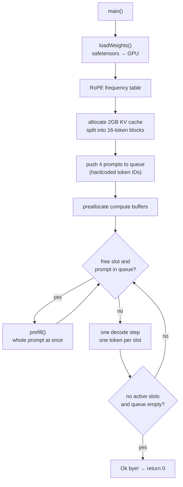

# 1. An Inference Engine in 1,500 Lines of CUDA: The Map

[jmaczan/tiny-vllm](https://github.com/jmaczan/tiny-vllm) is an inference engine for Llama 3.2 1B Instruct, written from scratch in C++ and CUDA. No PyTorch, no Hugging Face, not even a tokenizer. It opens the safetensors file itself, pushes the weights onto the GPU, and computes attention, RMSNorm, and softmax in its own kernels.

The striking part is the size. The product is **two files, 1,572 lines**.

```
src/main.cpp     1,044 lines   everything host-side (weight loading, prefill, decode loop, batching)
src/kernels.cu     528 lines   11 GPU kernels
```

vLLM proper runs to hundreds of thousands of lines, so this is closer to a minimal proof of the ideas an inference engine is made of. That is what makes it worth reading: things you have only seen named in papers fit into a hundred lines here.

This series reads those 1,572 lines across seven chapters. This one is the map: **what is implemented, what path a single inference takes, and why the code looks the way it does.**

> Every citation in this series is pinned to commit [`e25bf19`](https://github.com/jmaczan/tiny-vllm/tree/e25bf1994efa90bc98b721ba7c527402f86fbeaf). I have no NVIDIA GPU, so **nothing here was built or run.** There are no performance numbers anywhere in this series; every claim comes from reading the source.

## What is in the box

Here is what the repository implements. On the left is where the idea comes from; on the right is where to find it in the repository.

| Idea | Origin | In tiny-vllm | Chapter |
| --- | --- | --- | --- |
| Transformer inference | [Attention Is All You Need](https://arxiv.org/pdf/1706.03762) | `prefill()` + decode loop | 3, 5 |
| RMSNorm | [Zhang & Sennrich, 2019](https://arxiv.org/abs/1910.07467) | `rmsNormKernel` | 3 |
| RoPE (Llama 3 scaling) | [visual explainer — Fleetwood](https://fleetwood.dev/posts/you-could-have-designed-SOTA-positional-encoding) | `ropeKernel_llama3` | 3 |
| GQA | [Ainslie et al., 2023](https://arxiv.org/pdf/2305.13245) | `GQA_Q_TO_K_RATIO = 4` | 6 |
| cuBLAS transposition trick | [row/column-major](https://en.wikipedia.org/wiki/Row-_and_column-major_order) | `cublasGemmEx` calling convention | 4 |
| Parallel reduction | [NVIDIA technical note (PDF)](https://developer.download.nvidia.com/assets/cuda/files/reduction.pdf) | `__shfl_down_sync` tree | 3, 6 |
| Online softmax | [CSE599M lecture notes (PDF)](https://courses.cs.washington.edu/courses/cse599m/23sp/notes/flashattn.pdf) | `pagedAttentionKernel` | 6 |
| **PagedAttention** | [Kwon et al., SOSP 2023](https://arxiv.org/pdf/2309.06180) | `block_table` + 16-token pages | 6 |
| Continuous batching | — | slot table + queue | 7 |

The last two rows are the reason this repository exists. PagedAttention is the idea that made vLLM famous — **managing the KV cache as small blocks, like operating-system pages, instead of one large contiguous region** — and here it is about a hundred lines: 16-token pages (`BLOCK_SIZE = 16`) plus a `block_table` index array.

## The path of one inference

Start at `main()`. Stripped to its skeleton:

```cpp
int main(int argc, char *argv[])
{
    cublasHandle_t cublas_handle;
    cublasStatus_t status = cublasCreate(&cublas_handle);   // (1) matmul library
    if (status != CUBLAS_STATUS_SUCCESS) { ... return 1; }

    Weights weights{};
    if (loadWeights(weights) != 0) { return 1; }            // (2) safetensors -> GPU

    init_rope_frequencies(HEAD_DIM, MAX_SEQ_LEN, 500000.0f, // (3) positional encoding table
                          32.0f, 1.0f, 4.0f, 8192);

    __nv_bfloat16 *kv_cache;                                // (4) 2GB KV cache, all at once
    cudaMalloc(&kv_cache, KV_CACHE_SIZE_BYTES);
    std::vector<int> free_blocks(NUM_BLOCKS);
    std::iota(free_blocks.begin(), free_blocks.end(), 0);
    std::vector<int> block_table(MAX_SEQUENCES * N_LAYERS * MAX_BLOCKS_PER_SEQ, -1);
```
— [`src/main.cpp:555-581`](https://github.com/jmaczan/tiny-vllm/blob/e25bf1994efa90bc98b721ba7c527402f86fbeaf/src/main.cpp#L555-L581)

Step (4) is PagedAttention setting up. It grabs 2GB once (`cudaMalloc` is expensive, so it happens exactly once), cuts it into 16-token blocks and numbers them (`free_blocks` = 0, 1, 2, …), and `block_table` remembers which block holds which chunk of which sequence. The initial value `-1` means "not assigned yet."

What comes next tells you the most about this code:

```cpp
    // PROMPT 0 (What is 2+2?) - length 17
    std::queue<std::vector<int>> queue;
    queue.push({128000, 128006, 882, 128007, 271, 3923, 374, 220, 17, 10, 17, 30,
                128009, 128006, 78191, 128007, 271});

    // PROMPT 1 (Name a color.) - length 14
    queue.push({128000, 128006, 882, 128007, 271, 678, 264, 1933, 13, ...});
```
— [`src/main.cpp:583-594`](https://github.com/jmaczan/tiny-vllm/blob/e25bf1994efa90bc98b721ba7c527402f86fbeaf/src/main.cpp#L583-L594)

**The prompts are hardcoded as token IDs**, because there is no tokenizer. The repository only names two of them (`END_OF_TEXT_TOKEN_ID = 128001`, `EOT_ID_TOKEN_ID = 128009`), but the rest are the [Llama 3 chat template](https://huggingface.co/meta-llama/Llama-3.2-1B-Instruct) special tokens: `128000` is `<|begin_of_text|>`, `128006`/`128007` open and close the role header, and `271` is a double newline. Someone tokenized these by hand and typed them in.

Then all buffers are preallocated, free slots are filled from the queue, and an infinite loop starts.

```cpp
while (true) // exit condition irrelevant for now, since it's an inference
             // server that's supposed to run foreveeer!!!
{
    ...
    if (num_active_slots == 0) {
        if (queue.empty()) { break; }
        continue;
    }
```
— [`src/main.cpp:720-746`](https://github.com/jmaczan/tiny-vllm/blob/e25bf1994efa90bc98b721ba7c527402f86fbeaf/src/main.cpp#L720-L746)

The comment says it runs forever because it is a server — but a `break` sits right below it. When the queue is empty and no slot is active, it stops. So this is **not a server; it is a batch program that processes four prompts and exits.** That gap between comment and code is this repository being honest about being a work in progress.

The whole flow:



`prefill` and decode are separate because the shape of the computation differs. Prefill pushes all 17 prompt tokens through **at once**, so it is matrix × matrix. Decode handles **one** token per step, so it is vector × matrix. Same math, different optimal GPU implementation — which is why the kernels come in pairs: `softmaxKernel` and `softmaxKernelDecode`, `ropeKernel_llama3` and `ropeKernelDecode`.

## A function with 51 parameters

The first thing that jumps out is the signature of `prefill()`.

```cpp
void prefill(std::vector<int> &prompt, std::queue<std::vector<int>> &queue,
             int &prompt_len, std::vector<bool> &is_slot_free, int slot,
             int *gpu_input_tokens, nv_bfloat16 *input_embeddings,
             Weights &weights, nv_bfloat16 *hidden_state, nv_bfloat16 *rms_norms,
             nv_bfloat16 *&q_proj, nv_bfloat16 *buf_2048_1,
             cublasHandle_t cublas_handle, float &q_proj_alpha, float &q_proj_beta,
             /* … 36 more … */
             std::vector<int> &free_blocks, __nv_bfloat16 *kv_cache)
```
— [`src/main.cpp:150`](https://github.com/jmaczan/tiny-vllm/blob/e25bf1994efa90bc98b721ba7c527402f86fbeaf/src/main.cpp#L150)

**51 parameters**, all on one line. The call site is one line too.

Any normal code review would send this back, but there is a reason. GPU allocation (`cudaMalloc`) is expensive and must not happen per request. So this repository **allocates every buffer once at the top of `main()` and passes them down by hand.** It could have bundled them into a struct or a class; since the repository doubles as a course, the choice reads as wanting the reader to see, at a glance, exactly what is alive in GPU memory at this point. Names like `buf_2048_1` and `buf_2048_2` mean that buffer gets **reused**. Inside `prefill`, the same buffer is first the Q projection

```cpp
q_proj = buf_2048_1;        // src/main.cpp:177
...
attn_scores_v = buf_2048_1; // src/main.cpp:343
```

and later the attention-scores × V result. Several named pointers, one actual allocation on the GPU. Chapter 2 lays out which buffer is what at each stage.

The same attitude shows in the constants.

```cpp
constexpr int N_LAYERS = 16;              // TODO: hardcoded for llama 3.2 1B, just like any other value for now
constexpr int BATCH_SIZE = 2;             // TODO: not even close to being good, it's just here to have batching
constexpr int MAX_NEW_TOKENS_GENERATED = 20;  // TODO: parameterize it with program arguments
constexpr int BLOCK_SIZE = 16;            // TODO: tunable as well, defined the size of a single page in pagedattn
```
— [`src/main.cpp:12-35`](https://github.com/jmaczan/tiny-vllm/blob/e25bf1994efa90bc98b721ba7c527402f86fbeaf/src/main.cpp#L12-L35)

The whole model configuration is compile-time constants, and the author knows it — the `TODO`s say so. `BATCH_SIZE = 2` is the smallest value that lets you claim continuous batching exists. Rather than treating this as a defect, this series reads it as **the line between what is essential and what was deferred.**

## The build: two files, two backends

The build definition is short.

```cmake
add_executable(tiny-vllm
    src/main.cpp
    src/kernels.cu
)
```
— [`CMakeLists.txt:49-52`](https://github.com/jmaczan/tiny-vllm/blob/e25bf1994efa90bc98b721ba7c527402f86fbeaf/CMakeLists.txt#L49-L52)

That is all of it. The largest file in the repository is `include/json.hpp` (92% of the source bytes), but that is a vendored copy of [nlohmann/json](https://github.com/nlohmann/json), used exactly once to parse the safetensors header. Someone else's code, so this series does not read it.

One more thing: the same source builds for both NVIDIA and AMD. The mechanism is modest — one header that renames CUDA to HIP.

```cpp
#if defined(USE_HIP) || defined(__HIP_PLATFORM_AMD__)
#include <hip/hip_runtime.h>
// bfloat16 type mappings
#define __nv_bfloat16 __hip_bfloat16
// CUDA runtime -> HIP runtime
#define cudaMalloc              hipMalloc
#define cudaFree                hipFree
#define cudaMemcpy              hipMemcpy
```
— [`src/cuda_to_hip.h:6-19`](https://github.com/jmaczan/tiny-vllm/blob/e25bf1994efa90bc98b721ba7c527402f86fbeaf/src/cuda_to_hip.h#L6-L19)

The body is written in CUDA; the macros swap the names only when targeting AMD. Most swaps are cosmetic, but one changes meaning: `WARP_FULL_MASK` is `0xffffffff` on NVIDIA, where a warp is 32 threads, and `0xffffffffffffffffULL` on AMD, where it is 64. That constant is used inside `pagedAttentionKernel` where threads exchange values with each other, and those five lines are the densest code in the engine. Chapter 6.

## The route from here

| Chapter | Subject | Question |
| --- | --- | --- |
| 1 (this one) | Overall structure | What was built, and where does it start |
| 2 | Weight loading and buffers | How is safetensors read, what gets preallocated |
| 3 | The prefill path | Which kernels does a token pass through |
| 4 | The cuBLAS transposition trick | Why hand the matrices over flipped |
| 5 | The decode path | Why separate kernels |
| 6 | **PagedAttention** | How does a block table drive attention |
| 7 | Continuous batching | How do slots and a queue overlap requests |

## Further reading

If the conceptual side feels thin here, the repository's own [README](https://github.com/jmaczan/tiny-vllm/blob/e25bf1994efa90bc98b721ba7c527402f86fbeaf/README.md) is a 94KB course that derives everything from floating point up to PagedAttention. This series does not repeat that course; it reads the finished code instead.

- [PagedAttention paper (Kwon et al., SOSP 2023)](https://arxiv.org/pdf/2309.06180) — background for chapter 6
- [FlashAttention / online softmax lecture notes](https://courses.cs.washington.edu/courses/cse599m/23sp/notes/flashattn.pdf) — background for chapter 6
- [CUDA parallel reduction (NVIDIA)](https://developer.download.nvidia.com/assets/cuda/files/reduction.pdf) — the `__shfl_down_sync` trees in chapters 3 and 6
- [RoPE visual explainer (Fleetwood)](https://fleetwood.dev/posts/you-could-have-designed-SOTA-positional-encoding) — positional encoding in chapter 3
- [cublasGemmEx reference](https://docs.nvidia.com/cuda/cublas/index.html#cublasgemmex) — the transposition trick in chapter 4
- [Llama 3.2 1B Instruct model card](https://huggingface.co/meta-llama/Llama-3.2-1B-Instruct) — where the constants come from

## Limits of this chapter

Nothing was built and nothing was run. Everything above comes from reading the source at commit `e25bf19`; there are no measurements — runtime, memory use, or otherwise — anywhere in this series. The HIP branch was never even compiled, so whether those macro substitutions hold up against a real AMD toolchain is unverified.
