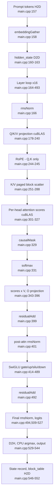
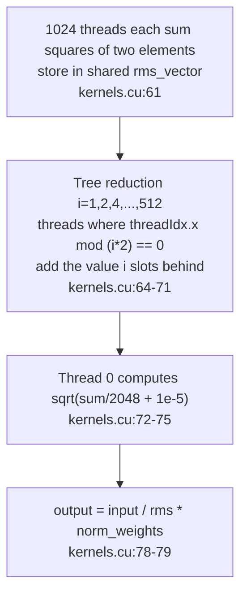

# 3. The prefill path that streams the whole prompt in one pass

Every path and line number in this article refers to the tree at the fixed
revision `e25bf1994efa90bc98b721ba7c527402f86fbeaf`. Notation is in
`file:start-end` form, and these are source citations, not execution results.

## The question of this chapter

In what kernel order do the prompt tokens flow from embedding to next-token
selection? The code scope is four files: `src/main.cpp`, `src/kernels.cu`,
`src/kernels.cuh`, `tests/test_softmax.cu`. The minimum evidence for this chapter
is 6 code citations, 1 test, and 0 executions.

This chapter owns the prefill path and the parallel reduction explanation. Build
boundaries and entry points belong to part 1; weight loading and buffer
sizes/aliasing belong to part 2. cuBLAS transpose flags and column-major layout
belong to part 4, decode-family kernel variants to part 5, paged attention and
the block table to part 6, and slot/queue lifetimes to part 7. Here we focus on
the order in which kernels are called and what each kernel computes, and hand off
the layout details of the cuBLAS calls to part 4.

This series was written in an environment without an NVIDIA GPU or CUDA
toolchain, so no kernel was executed. All ordering, index, and reduction claims
below are source citations, and kernel execution time, throughput, and memory
usage are not measured.

## Where prefill is called

There are only four host functions: `checkGPUStatus` (`src/main.cpp:40-62`),
`loadWeights` (`src/main.cpp:79-147`), `prefill` (`src/main.cpp:150-553`), and
`main` (`src/main.cpp:555-1044`), and the entire model forward is contained
within `prefill`. `main` fills empty slots with prompts from the queue in the
initial prefill loop (`src/main.cpp:695-708`), and also calls `prefill` again for
each empty slot on every iteration of the decode loop (`src/main.cpp:724-737`).
In other words, prefill is not a one-time initialization but a path that runs
whenever a new prompt enters a slot. When slots empty and refill is owned by
part 7.

`prefill` takes a prompt from the queue, sets `prompt`/`prompt_len`, and marks
the slot as occupied (`src/main.cpp:152-155`). It then copies the prompt token
IDs H2D (`src/main.cpp:157`) and streams all `prompt_len` tokens at once. This
"all at once" is the dividing point between prefill and decode, where decode
handles only one token per slot. That contrast is covered in part 5.

## prefill kernel order

`prefill` uses the prompt length taken from the queue directly as the token count
for kernel launches. The call order from embedding to next-token selection is as
follows.

<!-- visual: prefill-kernel-sequence supports: [prefill-kernel-sequence] -->


This order repeats in each of the 16 layers. The layer loop is
`src/main.cpp:164-493`, and within it the attention block and SwiGLU block each
run once. Only after the last layer do the final RMSNorm and logits come
(`src/main.cpp:494`, `509-527`). Below we look at each section in order.

## Embedding and hidden_state initialization

After copying the prompt token IDs up (`src/main.cpp:157`), `embeddingGather`
turns the token IDs into embedding rows (`src/main.cpp:158`). In the kernel, one
block handles one token, and 1024 threads read the 2048-wide embedding in two
passes (`src/kernels.cu:32-40`). The launch configuration is
`<<<num_input_tokens, 1024>>>` (`src/kernels.cu:45`), and the reason the thread
count per token is not set to 2048 is that the maximum threads per block is
1024, as the comment states (`src/kernels.cu:44`).

Then `input_embeddings` is copied D2D to `hidden_state`
(`src/main.cpp:160-163`). This copy is the starting point of the residual that
the layer loop accumulates.

## RMSNorm and intra-block parallel reduction

The first operation of the layer loop is the input RMSNorm
(`src/main.cpp:166`). `rmsNormKernel` has one block handle one token and 1024
threads process a 2048-wide vector (`src/kernels.cu:55-81`, launch
`src/kernels.cu:84-86`). Each thread adds the squares of two elements—its own
position and the position 1024 slots behind—into shared memory `rms_vector`
(`src/kernels.cu:57`, `61`). It then combines the 1024 values into one with a
tree reduction (`src/kernels.cu:62-71`). Thread 0 computes the rms as
`sqrt(sum/2048 + 1e-5)` (`src/kernels.cu:72-75`), and every thread divides its
element by the rms and multiplies by the normalization weight to produce the
output (`src/kernels.cu:78-79`).

```cpp
rms_vector[threadIdx.x] = (float)input[workIndex] * (float)input[workIndex]
                        + (float)input[workIndex + 1024] * (float)input[workIndex + 1024];
for (int i = 1; i < 1024; i = i * 2)
{
    if (threadIdx.x % (i * 2) == 0)
        rms_vector[threadIdx.x] = rms_vector[threadIdx.x] + rms_vector[threadIdx.x + i];
    __syncthreads();
}
if (threadIdx.x == 0)
    rms_vector[0] = sqrt(rms_vector[0] / 2048.0 + 1.0e-5);
```

Citation: [`src/kernels.cu:61-75`](https://github.com/jmaczan/tiny-vllm/blob/e25bf1994efa90bc98b721ba7c527402f86fbeaf/src/kernels.cu#L61-L75)

This structure is the parallel reduction explanation owned by this chapter.
softmax uses the same kind of reduction, but it is explained once here and not
repeated in later parts.

<!-- visual: rmsnorm-reduction supports: [rmsnorm-reduction] -->


The numerical verification evidence is covered in the "Tests and committed
reference output" section at the end of this chapter.

## Q/K/V projection and RoPE

Q, K, V are projected with cuBLAS from the RMSNorm output. Q uses an
`EMBEDDING_LENGTH × EMBEDDING_LENGTH` weight (`src/main.cpp:178-196`), and K and
V use `KV_DIM × EMBEDDING_LENGTH` weights (`src/main.cpp:201-219`, `222-240`).
The n argument of all three calls is `prompt_len`. This means the entire prompt
is placed as columns of the matrix, and this is the structure that processes all
tokens in a single call. Why the transpose flags and leading dimensions are the
way they are is owned by part 4.

RoPE is applied immediately after projection (`src/main.cpp:244-245`). What
stands out is that the rotation targets are only Q and K. There are only two
calls, `rope(q_proj, prompt_len, EMBEDDING_LENGTH)` and
`rope(k_proj_temp_buf, prompt_len, KV_DIM)`, and `v_proj_temp_buf`, which
corresponds to V, is not passed. V is written to the paged blocks in the next
step without its positional information being rotated.

The RoPE kernel is launched with one block per token and `proj_dim/2` threads
(`src/kernels.cu:202-212`). Each thread rotates the two elements at positions
`pair_idx` and `pair_idx + head_dim/2` within a head, and reads the angle from a
precomputed table via `cos_table[token_idx * head_dim + pair_idx * 2]`
(`src/kernels.cu:184-199`). This table is built once at the start of `main` by
`init_rope_frequencies` and uploaded to the GPU (`src/main.cpp:572`,
`src/kernels.cu:96-152`). The table is `d_cos_table`/`d_sin_table` of size
`max_seq_len × head_dim` (`src/kernels.cu:146-151`).

## Scattering K/V into paged blocks

K, which has finished RoPE, and V, which is not a RoPE target, are cut into
blocks of `BLOCK_SIZE=16` tokens and written to the paged KV cache
(`src/main.cpp:251-288`). `BLOCK_SIZE` is 16 (`src/main.cpp:32`), and one block
holds `16 × KV_DIM` each of K and V (`src/main.cpp:33-34`).

For each token range, the logical block index `token_idx / BLOCK_SIZE` is
computed and the physical block is read from `block_table`
(`src/main.cpp:264-265`). If the value is `-1`, a physical block is taken from
the back of `free_blocks` and written into that spot (`src/main.cpp:266-272`);
if a value already exists, it is treated as a state impossible in prefill and
`assert(false)` is called (`src/main.cpp:273-277`). K is written at the block
start address and V at the block start plus `V_OFFSET` back, via `cudaMemcpy`
D2D (`src/main.cpp:280-287`). The meaning of this index arithmetic and block
layout is owned by part 6.

## Attention scores and GQA

Score computation is a loop over the 32 Q heads (`src/main.cpp:301-327`). Q head
i shares K head `i / GQA_Q_TO_K_RATIO` (`src/main.cpp:303`). This ratio is 4
(`src/main.cpp:23`), meaning the 32 Q heads (`src/main.cpp:20`) reuse the 8 K
heads (`src/main.cpp:21`) at a 4:1 ratio. The 8 K heads equal `KV_DIM(512)`
(`src/main.cpp:18`) divided by `HEAD_DIM(64)` (`src/main.cpp:19`).

Scores are computed with cuBLAS by scaling the dot product of the Q head and K
head by `attn_alpha = 1.0f / 8.0f` (`src/main.cpp:308-326`,
`src/main.cpp:649-650`). Since HEAD_DIM is 64, 1/8 is `1/sqrt(64)`. The results
accumulate per head in the `prefill_attn_scores` buffer, which is sized
`MAX_PROMPT_LEN × MAX_PROMPT_LEN × NUM_Q_HEADS` (`src/main.cpp:306`, `647-648`).
Buffer sizing itself is owned by part 2.

After the scores, `causalMask` overwrites future positions with `-HUGE_VALF`
(`src/main.cpp:329`, `src/kernels.cu:224-237`), and `softmax` produces
probabilities per row (`src/main.cpp:331`). Both kernels have one block handle
one (head, row), and are launched as
`<<<num_tokens * NUM_Q_HEADS, num_tokens>>>` (`src/kernels.cu:247`, `301`). The
softmax kernel uses an online softmax that combines the running max and running
denominator with a tree reduction (`src/kernels.cu:257-290`). The three kernels
causalMask, softmax, and RoPE skip the launch and only print a warning when the
token count exceeds 1024 (`src/kernels.cu:241-245`, `295-299`, `205-209`).

## Scores×V, O projection, residual, SwiGLU

V is multiplied with the scores after softmax. Q head i shares V head
`i / GQA_ATTN_SCORES_TO_V_RATIO` (`src/main.cpp:346`), and this ratio is also 4
(`src/main.cpp:24`). The 32 Q heads reuse the 8 V heads (`src/main.cpp:22`) at
4:1. The outputs of the 32 heads are concatenated to form `(num_tok, 2048)`
(`src/main.cpp:343-371`). The result is fed into the O projection
(`src/main.cpp:378-396`) and added to `hidden_state` with `residualAdd`
(`src/main.cpp:399`). This residual is handled not by the GEMM beta argument but
by a separate kernel. The reason and the `beta = 0` design are covered in part 4.

Next, post-attention RMSNorm is applied once more (`src/main.cpp:401`), and
SwiGLU is computed. gate and up are each projected with cuBLAS
(`src/main.cpp:414-432`, `435-453`), the `silu` kernel overwrites gate in place
with `gate * sigmoid(gate) * up` (`src/main.cpp:459`, `src/kernels.cu:331-338`),
then after the down projection (`src/main.cpp:470-489`) it is added to
`hidden_state` again with `residualAdd` (`src/main.cpp:492`). This completes one
layer.

## Final logits and next token

After passing all 16 layers, the final RMSNorm is applied
(`src/main.cpp:494`) and logits are computed with the `embed_tokens` weight
(`src/main.cpp:509-527`). The logits are brought down D2H (`src/main.cpp:529`),
and on the CPU only the last token row is scanned to find the index of the
maximum value (`src/main.cpp:533-543`). This index is the next token, and the
value and index are printed to standard output (`src/main.cpp:544`). Finally,
the slot's generated token, last token, and prompt length are recorded
(`src/main.cpp:546-548`), and the entire `block_table` is synchronized H2D to
`block_table_gpu` (`src/main.cpp:552`). Converting the generated token ID into
human-readable text is outside the runtime.

## Tests and committed reference output

Of the minimum evidence for this chapter, the 1 test is filled not by execution
but by artifacts committed to the repository.

First, `tests/test_softmax.cu` is a committed test that verifies the prefill
softmax kernel. This file declares `void softmax(__nv_bfloat16 *, int)`
(`tests/test_softmax.cu:63`) and runs five cases with different row lengths and
value distributions through `run_case` (`tests/test_softmax.cu:65-108`, cases
`tests/test_softmax.cu:114-119`). Each case checks that the row sum is within
0.01 of 1.0 and that there are no NaN/Inf (`tests/test_softmax.cu:87-104`). The
file header comment states that this fused reduction was identical to the
two-pass version down to the last bit of bfloat16 (`tests/test_softmax.cu:1-52`).
This is what the file itself states, and this series did not run the test.

Second, `reference.txt` and `python/rms_norm_crosscheck.txt` are reference
outputs committed to the repository. The first 151 lines of the two files are
identical (`reference.txt:1-151`, `python/rms_norm_crosscheck.txt:1-151`), and
they contain the first 10 values of the layer 0 `input_layernorm` RMSNorm output
for a six-token prompt (`reference.txt:78-150`,
`python/rms_norm_crosscheck.txt:78-150`). For example, the RMSNorm values for
token 0 (id=128000) start with `[0] = 0.021240234375`,
`[1] = 0.0289306640625` (`python/rms_norm_crosscheck.txt:80-90`). The fact that
this output is from layer 0 `input_layernorm` is stated by the script that
produced it (`python/rms_norm.py:43-44`, `python/reference.py:43-44`). The first
10 values of the RMSNorm weight are also committed
(`python/rms_norm_crosscheck.txt:152-162`).

What `rmsNormKernel` does is exactly this input-layer RMSNorm. These values are
therefore used as the expected values the kernel must reproduce. However, this
series has no GPU, so it could not actually compare them against kernel output.

## What this chapter does not cover

- Build boundaries and execution entry points: part 1.
- Weight loading, buffer sizing, and aliasing: part 2. The size and sharing
  relationships of `prefill_attn_scores` and `buf_2048_1`/`buf_2048_2` are not
  redefined here.
- cuBLAS transpose flags, leading dimensions, column-major layout: part 4. This
  chapter covers only which call happens when.
- Decode-family kernels (`...Decode`) and `pagedAttentionKernel`: parts 5 and 6.
- block table indexing and paged KV cache layout: part 6.
- Slot and queue lifetimes and termination conditions: part 7.

## Limitations of this chapter

- This series was written in an environment without an NVIDIA GPU or CUDA
  toolchain, so not a single kernel was executed. All claims about kernel order,
  indices, and reductions are source citations with no execution verification.
- The minimum evidence for this chapter is 6 code citations, 1 test, and 0
  executions. Kernel execution time, throughput, and memory usage are not
  measured, and there are no performance figures in this chapter that could be
  read as measured values.
- `tests/test_softmax.cu` is committed but cannot be run. The "identical to the
  two-pass version" result this file claims was also not reproduced by this
  series.
- `reference.txt` and `python/rms_norm_crosscheck.txt` are reference outputs
  committed to the repository, not artifacts produced by this series. No
  comparison against the RMSNorm kernel output was performed.
- The RoPE, causalMask, and softmax kernels skip the launch when the token count
  exceeds 1024 (`src/kernels.cu:205-209`, `241-245`, `295-299`). The order
  explained in this chapter assumes the launch guards did not trigger.
- The prefill path does not contemplate prompts exceeding `MAX_PROMPT_LEN = 512`
  (`src/main.cpp:30`). If this value changes, the score buffer and K/V temporary
  buffer sizes change with it.
- `ropeKernel_llama3` is launched with `proj_dim/2` threads, so Q(2048) uses 1024
  threads and K(512) uses 256 threads (`src/kernels.cu:204`, `211`). The
  thread-count guard (`src/kernels.cu:205-209`) applies to this value.
- The safety of the buffer aliases (`q_proj`/`attn_scores_v` as `buf_2048_1`,
  `o_proj`/`down` as `buf_2048_2`) is a static claim about consumption order,
  with no execution verification (`src/main.cpp:177`, `343`, `377`, `470`).
  Sizes and ownership are in part 2.
- The weight file is `model.safetensors` of the gated model
  `meta-llama/Llama-3.2-1B-Instruct`, so actually running prefill remains a
  follow-up task.

## Sources

- `src/main.cpp:40-62`, `79-147`, `150-553`, `555-1044` — the four host
  functions and the whole of `prefill`/`main`.
- `src/main.cpp:152-158` — prompt queue consumption, slot occupation, token H2D,
  `embeddingGather`.
- `src/main.cpp:160-166` — `hidden_state` D2D, layer loop start, input RMSNorm.
- `src/main.cpp:177-240` — Q/K/V projection and the `buf_2048_1` alias.
- `src/main.cpp:244-245` — RoPE calls (Q and K only).
- `src/main.cpp:251-288` — K/V paged block scattering and block allocation.
- `src/main.cpp:301-331` — per-head scores, causalMask, softmax.
- `src/main.cpp:343-401` — scores×V, O projection, residualAdd, post-attn
  RMSNorm.
- `src/main.cpp:414-492` — SwiGLU and residualAdd.
- `src/main.cpp:494-552` — final RMSNorm, logits, argmax, state recording,
  block_table H2D.
- `src/main.cpp:18-34`, `572`, `647-650` — dimension/block constants and
  attention scale.
- `src/kernels.cu:32-53` — `embeddingGatherKernel` and launch.
- `src/kernels.cu:55-94` — `rmsNormKernel` and launch.
- `src/kernels.cu:96-152` — RoPE frequency table generation/H2D.
- `src/kernels.cu:173-222` — `ropeKernel_llama3` and launch.
- `src/kernels.cu:224-309` — `causalMaskKernel`, `softmaxKernel` and launches.
- `src/kernels.cu:311-344` — `residualKernel`, `siluKernel`.
- `src/kernels.cuh:11-20` — prefill kernel declarations.
- `tests/test_softmax.cu:1-52`, `63-119` — softmax test.
- `reference.txt:1-151`, `78-150` — committed reference output.
- `python/rms_norm_crosscheck.txt:1-151`, `78-162` — committed RMSNorm reference
  output.
- `python/rms_norm.py:43-44`, `python/reference.py:43-44` — code stating that the
  reference output is layer 0 `input_layernorm`.
