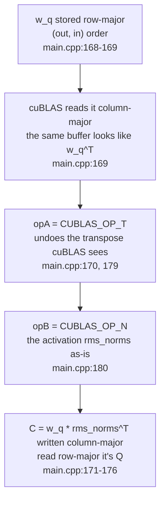

# 4. The cuBLAS Transposition Trick — Why the Matrices Are Passed Reversed

In part 3, when looking at the Q/K/V projections, I wrote this sentence and moved on: "Activations and weights are row-major, but cuBLAS assumes column-major, so the call is made using only the `CUBLAS_OP_T` transpose flag and the lda/ldb/ldc arguments. Why it's called this way is covered in part 4." This part is that "why." While part 3 looked at the order in which the kernels flow, this part pulls out the same cuBLAS call again and reads each argument one by one.

The one-line answer is this: this code passes row-major data to cuBLAS, which assumes column-major. The data is not actually transposed; instead, **the transpose flag and lda/ldb/ldc alone undo the transpose cuBLAS is already perceiving, producing the desired product.** That is why every weight matmul is written with "the operands reversed." Let's see where it starts.

## Row-major data and column-major cuBLAS

Row-major and column-major are the two orders in which matrices are laid out in memory. In row-major, the elements of one row are contiguous in memory; in column-major, the elements of one column are contiguous. cuBLAS's matmul function `cublasGemmEx` assumes column-major. But the weights and activations this code handles are all row-major. The Q weight `weights.w_q[layer]` is a (2048, 2048) matrix, and the starting addresses of two consecutive rows are `EMBEDDING_LENGTH`(2048) apart; that value is passed as `lda` in the call(`src/main.cpp:16`, `187`).

Here the leading dimension, abbreviated ld, that cuBLAS takes as an argument matters. In a column-major matrix, ld is "the gap between where one column ends and the next begins," i.e., the number of rows cuBLAS sees. If row-major data is passed to cuBLAS as-is, the value that was "the gap between two consecutive rows" is read as "the gap between two consecutive columns." **The same buffer looks to cuBLAS like a transposed matrix.** This mismatch is the starting point of this whole part, and the source comment records it verbatim.

```cpp
        // Q = inputs * wq^T; my matrices are row-major, cublas expects column-major
        // it perceives my matrices as transposed
        // there's a trick where C = A * B == C^T = B^T * A^T
        // so in my scenario cublas sees now: Q = inputs^T * wq^T^T = inputs ^T * wq
        // so I need to do: Q^T = wq ^T * inputs
        // the beauty is that we don't need to transpose Q^T back to Q
        // because cublas sees the output as column-major
        // so it's in fact transposed
        // final dim (num_tok, EMBEDDING_LENGTH)
```
— [`src/main.cpp:168-176`](https://github.com/jmaczan/tiny-vllm/blob/e25bf1994efa90bc98b721ba7c527402f86fbeaf/src/main.cpp#L168-L176)

The comment starts with "my matrices are row-major, cublas expects column-major" and pulls out one identity: `C = A * B == C^T = B^T * A^T` — transposing the product swaps the order of the operands and transposes each one. The code uses this identity to **transpose the call** without moving any data. The following lines are that process.

## The Q projection: the product built by two flags

The first projection encountered is Q. The intended product is `rms_norms · w_q^T`, i.e., multiplying a (prompt_len, 2048) activation by a (2048, 2048) weight to produce a (prompt_len, 2048) Q. Yet the call looks as if `w_q` is placed in front. Let's look at the call right below the comment.

```cpp
        q_proj = buf_2048_1;
        cublasStatus_t q_proj_status = cublasGemmEx(cublas_handle,
                                                    CUBLAS_OP_T,
                                                    CUBLAS_OP_N,
                                                    EMBEDDING_LENGTH,
                                                    prompt_len,
                                                    EMBEDDING_LENGTH,
                                                    &q_proj_alpha,
                                                    weights.w_q[layer],
                                                    CUDA_R_16BF,
                                                    EMBEDDING_LENGTH,
                                                    rms_norms,
                                                    CUDA_R_16BF,
                                                    EMBEDDING_LENGTH,
                                                    &q_proj_beta,
                                                    q_proj,
                                                    CUDA_R_16BF,
                                                    EMBEDDING_LENGTH,
                                                    CUBLAS_COMPUTE_32F,
                                                    CUBLAS_GEMM_DEFAULT);
```
— [`src/main.cpp:177-196`](https://github.com/jmaczan/tiny-vllm/blob/e25bf1994efa90bc98b721ba7c527402f86fbeaf/src/main.cpp#L177-L196)

`cublasGemmEx` computes `C = α·op(A)·op(B) + β·C`. op(X) is X's transpose if the flag is `CUBLAS_OP_T`, and X as-is if it's `CUBLAS_OP_N`. Let's read the arguments per this definition.

- **A slot, `CUBLAS_OP_T`:** the weight `weights.w_q[layer]`. It's row-major (2048, 2048), but cuBLAS reads it column-major, so it sees a transpose. `CUBLAS_OP_T` undoes that transpose, so op(A) = `w_q`.
- **B slot, `CUBLAS_OP_N`:** the activation `rms_norms`. A (prompt_len, 2048) looks to cuBLAS like the transpose of (2048, prompt_len), and since no flag is set, it enters as op(B) = `rms_norms^T`.
- **m = 2048, n = prompt_len, k = 2048:** the fact that n is the number of tokens is the nature of this call. The whole prompt goes in as the matrix's columns and is multiplied in one go.

The C that cuBLAS writes is column-major, so its contents are `w_q · rms_norms^T`. Reading the same buffer row-major transposes it, giving `(w_q · rms_norms^T)^T = rms_norms · w_q^T = Q`. The intended (prompt_len, 2048) Q emerges in place. Since it's written transposed and read transposed, the comment's claim that "we don't need to transpose Q^T back to Q"(`src/main.cpp:171-175`) is exactly what that means.

The three lds are part of the same reading. `lda = ldb = ldc = EMBEDDING_LENGTH(2048)`(`src/main.cpp:187`, `190`, `194`). Since the ld of a column-major C is its number of rows, `ldc = m = 2048`, and when the output is read row-major, one token row is stacked contiguously across 2048 slots. This rule "ldc = m" is broken exactly once later, and that story comes in a moment.

## K/V, O, SwiGLU: the same skeleton with only sizes changed

In K and V, the same call changes only `m` and `ldc` to 512(`KV_DIM`). The K projection comment lays out that fact.

```cpp
        // input = (num_tokens, EMBEDDING_LENGTH), weights = (KV_DIM, EMBEDDING_LENGTH)
        // after trick: (KV_DIM, EMBEDDING_LENGTH) * (EMBEDDING_LENGTH, num_tokens) -> (KV_DIM, num_tokens), which really is (num_tok, KV_DIM)
        // lda: EMBEDDING_LENGTH, ldb: EMBEDDING_LENGTH, ldc: KV_DIM
```
— [`src/main.cpp:198-200`](https://github.com/jmaczan/tiny-vllm/blob/e25bf1994efa90bc98b721ba7c527402f86fbeaf/src/main.cpp#L198-L200)

The product result looks like (KV_DIM, num_tokens) to cuBLAS, which means read row-major it's (num_tok, KV_DIM). In the call site `m = KV_DIM`(`src/main.cpp:204`), `ldc = KV_DIM`(`src/main.cpp:217`). V sits at `src/main.cpp:222-240` in the same shape.

All eight weight projections — Q, K, V, O, gate, up, down, logits — are this skeleton. The weight is in the A slot with `CUBLAS_OP_T`, the activation in the B slot with `CUBLAS_OP_N`, the result in the C slot. The only differences are m·ldc. O is, per its comment "same as Q projection, so copy paste," m = ldc = 2048(`src/main.cpp:378-396`). gate·up are m = ldc = 8192(`src/main.cpp:414-432`, `435-453`). down is m = ldc = 2048, but as k grows to 8192, `lda = ldb = HIDDEN_DIM(8192)`(`src/main.cpp:461-489`). The down comment records this passage most neatly.

```cpp
        // down projection
        // output = post-silu * down_proj^T
        // dims: (num_tok, 8192) * (2048, 8192) ^ T = (num_tok, 8192) * (8192, 2048) = (num_tok, 2048)
        // output^T = (down_proj^T)^T * post-silu^T
        // output^T = down_proj * post-silu^T
        // cublas sees them already as transposed so only down_proj I need to transpose
        // dims = (2048, 8192) * (8192, num_tok) = (2048, num_tok)
        // m: 2048 n: num_tok, k: 8192
        // lda: 8192, ldb: 8192, ldc: 2048
```
— [`src/main.cpp:461-469`](https://github.com/jmaczan/tiny-vllm/blob/e25bf1994efa90bc98b721ba7c527402f86fbeaf/src/main.cpp#L461-L469)

"cublas sees them already as transposed so only down_proj I need to transpose" — the down projection's input (`gate`) that has passed through post-silu already looks transposed to cuBLAS, so only the weight needs flipping. The reason lda·ldb are 8192 is the same: the down weight and activation have a row width of 8192. The decode path's calls follow this same skeleton, with only `n` changing to `num_active_slots` — a contrast covered in part 5.

## Logits: the flow of an idea left in a comment

The last projection is logits. It multiplies the embedding matrix `embed_tokens`(128256, 2048) with (prompt_len, 2048) to produce (prompt_len, 128256). Here too `m = ldc = VOCAB_SIZE(128256)`(`src/main.cpp:509-527`). This call's comment retells this whole part's story once more.

```cpp
    // logits = rms_norms * weights.embed_tokens^T
    // dim rms_norms: (num_tok, 2048), dim embed_tokens: (128256, 2048)
    // logits dim = (num_tok, 2048) * (2048, 128256) = (num_tok, 128256) => m = num_tok, n = 128256, k = 2048
    // I leave this comment above because it shows a bug in my thinking
    // because I use the cublas trick, logits are transposed so m and n should be swapped
    // so m 128256, n num_tok
```
— [`src/main.cpp:496-501`](https://github.com/jmaczan/tiny-vllm/blob/e25bf1994efa90bc98b721ba7c527402f86fbeaf/src/main.cpp#L496-L501)

The first three lines are the thought "if you just look at it as a matmul, m = num_tok, n = 128256," and the next lines correct it: "this is wrong. Because of the trick, logits are transposed, so m and n must be swapped." The author didn't delete this comment, leaving it because "it shows a bug in my thinking." The habit of swapping m·n, the illusion that the product order changed — the pitfall you hit when reading every call in this repo is recorded right here.

## Attention scores: same convention, different dimensions

Matmuls that aren't projections follow the same convention. The attention scores build a (prompt_len, prompt_len) matrix per Q head, 32 heads, and pick the K head with `i / GQA_Q_TO_K_RATIO`(GQA was seen in part 3). Here the K head is in the A slot and the Q head in the B slot.

```cpp
        for (int i = 0; i < NUM_Q_HEADS; ++i)
        {
            int k_head_idx = i / GQA_Q_TO_K_RATIO;
            __nv_bfloat16 *q_head = q_proj + i * HEAD_DIM;
            __nv_bfloat16 *k_head = k_proj_temp_buf + k_head_idx * HEAD_DIM;
            __nv_bfloat16 *attn_score_head = prefill_attn_scores + prompt_len * prompt_len * i;

            cublasStatus_t attn_score_status = cublasGemmEx(cublas_handle,
                                                            CUBLAS_OP_T,
                                                            CUBLAS_OP_N,
                                                            prompt_len,
                                                            prompt_len,
                                                            HEAD_DIM,
                                                            &attn_alpha,
                                                            k_head,
                                                            CUDA_R_16BF,
                                                            KV_DIM,
                                                            q_head,
                                                            CUDA_R_16BF,
                                                            EMBEDDING_LENGTH,
                                                            &attn_beta,
                                                            attn_score_head,
                                                            CUDA_R_16BF,
                                                            prompt_len,
                                                            CUBLAS_COMPUTE_32F,
                                                            CUBLAS_GEMM_DEFAULT);
        }
```
— [`src/main.cpp:301-327`](https://github.com/jmaczan/tiny-vllm/blob/e25bf1994efa90bc98b721ba7c527402f86fbeaf/src/main.cpp#L301-L327)

`m = n = prompt_len`, `k = HEAD_DIM(64)`(`src/main.cpp:311-313`). The K head is in the A slot with `CUBLAS_OP_T`, the Q head in the B slot with `CUBLAS_OP_N` — the same combination as the Q projection. Pushing the same reading through, the column-major C that cuBLAS writes is `k_head · q_head^T`, and read row-major it's `q_head · k_head^T` — the desired score matrix. The scale `1/sqrt(64)` is applied by the alpha argument `attn_alpha = 1/8`(`src/main.cpp:649`).

Here's why lda·ldb differ: the two operands are "slices of some buffer." `k_head` is a 64-slot slice inside the (prompt_len, 512) buffer `k_proj_temp_buf`, so its row width is 512, hence `lda = KV_DIM`(`src/main.cpp:317`). `q_head` is a slice inside the (prompt_len, 2048) buffer `q_proj`, hence `ldb = EMBEDDING_LENGTH`(`src/main.cpp:320`). The result has `ldc = prompt_len`(`src/main.cpp:324`), equal to m, keeping the rule.

## Scores×V: the only call where the transpose flags disappear

If every call seen so far uses `CUBLAS_OP_T`/`CUBLAS_OP_N`, then the one call where both flags are `CUBLAS_OP_N` is scores×V.

```cpp
            cublasStatus_t attn_score_status = cublasGemmEx(cublas_handle,
                                                            CUBLAS_OP_N,
                                                            CUBLAS_OP_N,
                                                            HEAD_DIM,
                                                            prompt_len,
                                                            prompt_len,
                                                            &attn_scores_v_alpha,
                                                            v_head,
                                                            CUDA_R_16BF,
                                                            KV_DIM,
                                                            attn_scores_head,
                                                            CUDA_R_16BF,
                                                            prompt_len,
                                                            &attn_scores_v_beta,
                                                            output_attn_scores_head,
                                                            CUDA_R_16BF,
                                                            EMBEDDING_LENGTH,
                                                            CUBLAS_COMPUTE_32F,
                                                            CUBLAS_GEMM_DEFAULT);
```
— [`src/main.cpp:352-370`](https://github.com/jmaczan/tiny-vllm/blob/e25bf1994efa90bc98b721ba7c527402f86fbeaf/src/main.cpp#L352-L370)

`m = HEAD_DIM(64)`, `n = prompt_len`, `k = prompt_len`(`src/main.cpp:355-357`). `v_head` is A, `attn_scores_head` is B. Each head shares a value head via `v_head_idx = i / GQA_ATTN_SCORES_TO_V_RATIO`(part 3). Both operands already look to cuBLAS like "the desired state, transposed." `v_head` is a (prompt_len, 64) slice with a row width of 512; read with `lda = KV_DIM`(`src/main.cpp:361`), it looks to cuBLAS like (64, prompt_len) — exactly the desired op(A). `attn_scores_head` is (prompt_len, prompt_len), so `ldb = prompt_len`(`src/main.cpp:364`) is already the desired op(B). There's nothing to flip, so the flags are dropped.

Thus the column-major C is `V^T · S^T`, and read row-major it's `(V^T · S^T)^T = S · V` — the post-softmax scores × V. The desired product is S·V, cuBLAS writes its transpose, and reading row-major returns to S·V. Nothing differs from the flow seen so far.

Only in this call is `ldc ≠ m`(`src/main.cpp:368`, ldc = EMBEDDING_LENGTH). The result accumulates into `attn_scores_v + i * HEAD_DIM`(`src/main.cpp:350`), and `attn_scores_v` is a (prompt, 2048) buffer. Only with ldc = 2048 do head i's 64 slots land in the `[i*64, i*64+64)` interval within a token row, and the 32 heads sit side by side to fill (prompt_len, 2048). The output width is not "the head width" but "the width of the buffer where heads are stacked," which is why it's out of step with m. This result becomes the input of the very next O projection(`src/main.cpp:343`, `388`).

## alpha and beta: residuals are not added here

Every call carries alpha·beta arguments. If beta were left to accumulate the residual, the residual kernel wouldn't be needed at all — but in reality, every beta is 0.0.

```cpp
    float k_proj_alpha = 1.0f;
    float k_proj_beta = 0.0f;

    float v_proj_alpha = 1.0f;
    float v_proj_beta = 0.0f;

    __nv_bfloat16 *prefill_attn_scores;
    cudaMalloc(&prefill_attn_scores, MAX_PROMPT_LEN * MAX_PROMPT_LEN * sizeof(__nv_bfloat16) * NUM_Q_HEADS);
    float attn_alpha = 1.0f / 8.0f;
    float attn_beta = 0.0f;
```
— [`src/main.cpp:641-650`](https://github.com/jmaczan/tiny-vllm/blob/e25bf1994efa90bc98b721ba7c527402f86fbeaf/src/main.cpp#L641-L650)

All ten alpha·beta pairs (q_proj `631-632`, k_proj `641-642`, v_proj `644-645`, attn `649-650`, attn_scores_v `653-654`, o_proj `659-660`, gate `664-665`, up `669-670`, down `673-674`, embed `678-679`) have this shape. When beta is 0, GEMM doesn't read the existing C and overwrites it. There's no place to "add" anything via beta. The fact that the only non-1 alpha is the attention scale `1/8` is also visible in the code above.

Residuals are handled by a separate kernel. After attention, `residualAdd(hidden_state, o_proj, prompt_len)`(`src/main.cpp:399`); after SwiGLU, `residualAdd(hidden_state, down, prompt_len)`(`src/main.cpp:492`). We saw the kernel implementation in part 3. There is no story in this code of alpha·beta handling residuals.

## Flow summary

Here's the flow of row-major data passing through the transpose flags and emerging as a result, laid out in one diagram. Each line of the diagram points to the corresponding source line of the Q projection.

<!-- visual: column-row-major-trick supports: [column-row-major-trick] -->


This diagram is the skeleton common to the eight weight projections. As seen above, this code has no path where alpha·beta accumulates residuals, so the diagram has no such branch either.

## Further reading

Material this repo points to as background for this topic.

- [Row- and column-major order (Wikipedia)](https://en.wikipedia.org/wiki/Row-_and_column-major_order) — the starting point of the layout mismatch
- [The cuBLAS transposition trick (Paged Out! #9)](https://pagedout.institute/) — an article by this repo's author covering the same content in a different form
- [cublasGemmEx reference](https://docs.nvidia.com/cuda/cublas/index.html#cublasgemmex) — argument order and the op(A)·op(B) definitions
- [cuBLAS](https://developer.nvidia.com/cublas) — official docs and examples

## Limitations of this article

Like the preceding parts, this part was not built or run. Every m·n·k·lda·ldb·ldc·flag explanation was obtained by reading the source at commit `e25bf19` and has no runtime verification. Each call's return value(`*_status`) is only declared, never checked, so this article assumes every call succeeded. And since m·n·k·ld come from compile-time constants such as `EMBEDDING_LENGTH`, `KV_DIM`, `HIDDEN_DIM`, `VOCAB_SIZE`(`src/main.cpp:16-25`), if those constants change, every number written here changes with them.