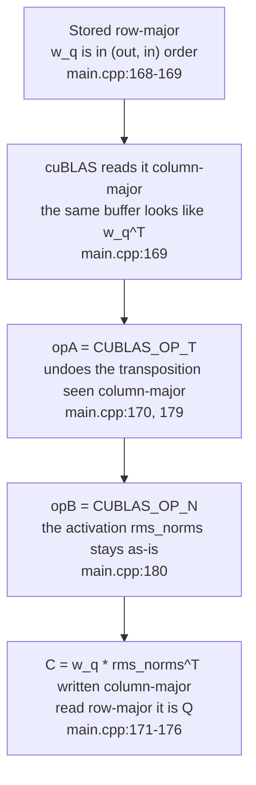

# 4. cuBLAS matrix multiplication and the column-major/row-major transpose trick

Every path and line number in this article refers to the tree at the fixed
revision `e25bf1994efa90bc98b721ba7c527402f86fbeaf`. Notation is in
`file:start-end` form, and these are source citations, not execution results.

## The question of this chapter

Why are the weight matrix multiplications handed to cuBLAS in transposed form?
The code scope is a single file, `src/main.cpp`, and the minimum evidence for
this chapter is 3 code citations, 0 tests, and 0 executions. This chapter depends
on the prefill path of part 3. Where part 3 covered which kernels and cuBLAS
calls happen in what order, here we cover why the `m`, `n`, `k`, `lda`, `ldb`,
`ldc` and transpose flags of those calls are what they are.

This chapter owns the column-major layout and leading dimension explanation.
Part 3 owns the prefill kernel order and the parallel reduction, and part 2 owns
buffer sizing and aliasing. Decode-family kernels and the calls where `n` becomes
`num_active_slots` belong to part 5, the block table and paged attention to part
6, and slots and queues to part 7. The residual kernel is not redefined here
either; it links to part 3.

This series was written in an environment without an NVIDIA GPU or CUDA
toolchain, so no kernel was executed. All argument, dimension, and layout claims
below are source citations, and kernel execution time, throughput, and memory
usage are not measured.

## Row-major data and column-major cuBLAS

All activations and weights in `src/main.cpp` are laid out row-major in memory.
For example, the Q weight `weights.w_q[layer]` has shape `(out=2048, in=2048)`,
and the starts of two consecutive rows are `EMBEDDING_LENGTH` (2048) apart
(`src/main.cpp:16`, `185`). The K/V weights are `(KV_DIM=512,
EMBEDDING_LENGTH=2048)` (`src/main.cpp:18`, `208`, `229`).

cuBLAS's `cublasGemmEx`, by contrast, assumes that A, B, and C are all
column-major. The source comment records this mismatch verbatim.

```cpp
// Q = inputs * wq^T; my matrices are row-major, cublas expects column-major
// it perceives my matrices as transposed
```

(`src/main.cpp:168-169`)

In a column-major matrix, the leading dimension `ld` is the distance between the
starts of two consecutive columns—that is, the number of rows. In a row-major
matrix, the value playing the same role is the distance between the starts of
two consecutive rows—that is, the number of columns. So when the same buffer is
handed to cuBLAS, cuBLAS sees it as the transposed matrix. A row-major `(m, n)`
matrix is `(n, m)` under the column-major reading.

The identity that sidesteps this problem is written in the source comment.

```cpp
// there's a trick where C = A * B == C^T = B^T * A^T
```

(`src/main.cpp:170`)

Transposing the product swaps the order of the two operands and transposes each
of them. So the code does not actually transpose the data: it uses the transpose
flags to undo the transposition cuBLAS already perceives, receives the result
still transposed, and writes it as-is to the next stage. Since the output C is
also written column-major, reading the same buffer row-major yields the desired
matrix. That is why the source comment says there is no need to transpose Q^T
back to Q (`src/main.cpp:171-175`).

## The common structure built by one pair of transpose flags

The eight weight projections—Q, K, V, O, gate, up, down, and logits—all follow
the same skeleton. The weight goes in the A position with `CUBLAS_OP_T`, the
activation in the B position with `CUBLAS_OP_N`, and the output in the C
position. `n` is always `prompt_len`. This means the entire prompt enters as the
columns of the matrix, which is the structure by which a single prefill
processes all tokens together.

`ldc` is the leading dimension of the output C as cuBLAS sees it column-major.
In these eight calls and in the attention-score call, `ldc` equals `m`. Since
the column-major C is `(m, n)`, `ldc` is its number of rows, which is also the
number of columns of the output when the same buffer is read row-major. For
example, in the Q call `m = 2048` and `ldc = 2048`, the column-major C is
`(2048, prompt_len)`, and the output read row-major is `(prompt_len, 2048)`
(`src/main.cpp:181`, `194`). K/V have 512 (`src/main.cpp:204`, `217`), gate/up
8192 (`src/main.cpp:417`, `430`), down 2048 (`src/main.cpp:474`, `487`), and
logits 128256 (`src/main.cpp:512`, `525`) in the same relationship. Only the
attention-scores×V call deviates from this rule, and the reason is treated
separately below.

## Q projection

The Q projection call is the archetype of this structure (`src/main.cpp:178-196`).

```cpp
cublasStatus_t q_proj_status = cublasGemmEx(cublas_handle,
                                            CUBLAS_OP_T,
                                            CUBLAS_OP_N,
                                            EMBEDDING_LENGTH,
                                            prompt_len,
                                            EMBEDDING_LENGTH,
                                            &q_proj_alpha,
                                            weights.w_q[layer],
                                            CUDA_R_16BF,
                                            EMBEDDING_LENGTH,
                                            rms_norms,
                                            CUDA_R_16BF,
                                            EMBEDDING_LENGTH,
                                            &q_proj_beta,
                                            q_proj,
                                            CUDA_R_16BF,
                                            EMBEDDING_LENGTH,
                                            CUBLAS_COMPUTE_32F,
                                            CUBLAS_GEMM_DEFAULT);
```

In argument order: `opA = CUBLAS_OP_T` (`src/main.cpp:179`), `opB = CUBLAS_OP_N`
(`src/main.cpp:180`), `m = EMBEDDING_LENGTH` (2048, `src/main.cpp:181`), `n =
prompt_len` (`src/main.cpp:182`), `k = EMBEDDING_LENGTH` (2048,
`src/main.cpp:183`), and `lda = ldb = ldc = 2048` (`src/main.cpp:187`, `190`,
`194`). alpha is `q_proj_alpha` and beta is `q_proj_beta` (`src/main.cpp:184`,
`191`).

What this call computes inside cuBLAS is `C = op(A)·op(B)`. The
`weights.w_q[layer]` in the A position is row-major `(out, in)`, but cuBLAS
reads it column-major and sees `w_q^T`. `CUBLAS_OP_T` undoes that transposition,
so `op(A) = w_q`. The `rms_norms` in the B position is row-major `(prompt_len,
2048)`, and cuBLAS sees it as `rms_norms^T`. With `CUBLAS_OP_N`, `op(B) =
rms_norms^T`. Thus the column-major C is `w_q · rms_norms^T`, and reading that
buffer row-major gives `Q = rms_norms · w_q^T`. That is the intended Q.

The source comment writes the same fact as the shorthand `Q^T = wq^T * inputs`
(`src/main.cpp:170-172`). The precise basis is `op(A)` and `op(B)`, and the
derivation above is that basis.

## K/V projection

K and V use the same skeleton with only `m` and `ldc` changed to `KV_DIM` (512)
(`src/main.cpp:201-219`, `222-240`). The weights are `weights.w_k[layer]`
(`src/main.cpp:208`) and `weights.w_v[layer]` (`src/main.cpp:229`), and the
activation in both is `rms_norms`. The outputs go to `k_proj_temp_buf`
(`src/main.cpp:215`) and `v_proj_temp_buf` (`src/main.cpp:236`), with `ldc =
KV_DIM` (`src/main.cpp:217`, `238`). The comment states that this call computes
`(KV_DIM, EMBEDDING_LENGTH) * (EMBEDDING_LENGTH, num_tokens)` and that the
result, read row-major, is `(num_tok, KV_DIM)` (`src/main.cpp:198-200`). The
fact that these two buffers become the inputs of RoPE and paged block scattering
is owned by part 3.

## Attention scores

Attention scores are also computed with cuBLAS (`src/main.cpp:301-327`). Inside
the loop over the 32 Q heads, the K head `i / GQA_Q_TO_K_RATIO` goes in the A
position with `CUBLAS_OP_T` and the Q head in the B position with `CUBLAS_OP_N`
(`src/main.cpp:303`, `309-310`). `m = n = prompt_len` and `k = HEAD_DIM`
(`src/main.cpp:311-313`), with `lda = KV_DIM` (`src/main.cpp:317`), `ldb =
EMBEDDING_LENGTH` (`src/main.cpp:320`), and `ldc = prompt_len`
(`src/main.cpp:324`). Reading the output buffer row-major yields the
`(prompt_len, prompt_len)` score matrix. alpha is `attn_alpha = 1.0f / 8.0f`,
which is `1/sqrt(64)` for `HEAD_DIM = 64` (`src/main.cpp:649`,
`src/main.cpp:19`). The GQA ratio and the meaning of the scores are covered in
part 3. Here we only confirm that `ldc` equals `m`, following the skeleton of
the transpose trick as-is.

## Scores×V: the exception where the transpose flags disappear

The scores×V call uses `CUBLAS_OP_N` twice (`src/main.cpp:352-370`, `353-354`).
`m = HEAD_DIM` (64), `n = prompt_len`, and `k = prompt_len`
(`src/main.cpp:355-357`), with `lda = KV_DIM` (512, `src/main.cpp:361`), `ldb =
prompt_len` (`src/main.cpp:364`), and `ldc = EMBEDDING_LENGTH` (2048,
`src/main.cpp:368`).

The `v_head` in the A position points to a single V head inside
`v_proj_temp_buf` (`src/main.cpp:349`). This slice is row-major `(num_tok, 64)`,
but read with `lda = KV_DIM = 512` it looks like `(64, num_tok)` to cuBLAS. With
`CUBLAS_OP_N` it stays as `op(A)`, matching `(m, k) = (64, prompt_len)`. The
`attn_scores_head` in the B position is likewise read with `ldb = prompt_len`
and becomes the transposed `(prompt_len, prompt_len)`, and with `CUBLAS_OP_N` it
is `op(B)` as-is. The result C is `(64, prompt_len)`.

The output is written to `attn_scores_v + i * HEAD_DIM` (`src/main.cpp:350`).
Since `ldc = EMBEDDING_LENGTH = 2048`, each token row is 2048 wide, and the 64
slots of head i occupy the `[i*64, (i+1)*64)` range inside it. The 32 heads
concatenate to fill a `(num_tok, 2048)` buffer. This is why only this call has
`ldc` different from `m`: the two operands already appear in the orientation
cuBLAS needs, so no transpose flag is required, and the output width is set by
the width of the buffer the heads are concatenated into. This result becomes the
input of the O projection directly (`src/main.cpp:343`, `388`). The GQA ratio in
which four Q heads share a V head is owned by part 3.

## O projection, SwiGLU, and logits

The remaining weight projections repeat the same skeleton as Q.

- The O projection places `weights.w_o[layer]` in the A position and the scores×V
  result `attn_scores_v` in the B position, calling with `m = ldc =
  EMBEDDING_LENGTH` (`src/main.cpp:378-396`, `381`, `394`). The comment reads
  "same as Q projection, so copy paste" (`src/main.cpp:376`).
- gate and up place `weights.mlp_gate_proj[layer]` and
  `weights.mlp_up_proj[layer]` in the A position and `rms_norms` in the B
  position (`src/main.cpp:414-432`, `435-453`). `m = ldc = HIDDEN_DIM` (8192) and
  `k = EMBEDDING_LENGTH` (`src/main.cpp:417`, `430`).
- down places `weights.mlp_down_proj[layer]` in the A position and `gate` after
  `silu` in the B position (`src/main.cpp:471-489`). `m = ldc = EMBEDDING_LENGTH`
  (2048), `k = HIDDEN_DIM` (8192), and `lda = ldb = HIDDEN_DIM` (`src/main.cpp:474`,
  `480`, `483`, `487`). The comment reads "cublas sees them already as transposed
  so only down_proj I need to transpose" (`src/main.cpp:466`).
- The logits place `weights.embed_tokens` in the A position and `rms_norms` in
  the B position (`src/main.cpp:509-527`). `m = ldc = VOCAB_SIZE` (128256) and
  `k = EMBEDDING_LENGTH` (`src/main.cpp:512`, `525`). The comment preserves the
  process of first thinking of `m` and `n` swapped and then correcting it
  because of the trick (`src/main.cpp:498-501`).

## alpha and beta: the residual is handled by a kernel, not the GEMM

There is an account that the GEMM's alpha and beta arguments also handle residual
accumulation, but the code at the fixed revision does not support it. Looking at
the ten alpha/beta declarations, all the beta values are `0.0f` (`src/main.cpp:632`,
`642`, `645`, `650`, `654`, `660`, `665`, `670`, `674`, `679`). The alphas are
all `1.0f` except the attention scores' `1.0f / 8.0f` (`src/main.cpp:631`, `641`,
`644`, `649`, `653`, `659`, `664`, `669`, `673`, `678`). A beta of 0 means the
GEMM does not read the existing C and overwrites it, so there is no place for
residual accumulation.

Residual accumulation is handled by separate calls. After attention there is
`residualAdd(hidden_state, o_proj, prompt_len)` (`src/main.cpp:399`), and after
SwiGLU `residualAdd(hidden_state, down, prompt_len)` (`src/main.cpp:492`). The
implementation of this kernel is owned by part 3; here we only note that it is
independent of the beta argument.

## Visual: the flow of the transpose trick

The flow by which row-major data passes through the transpose flags and becomes
the result is summarized as follows.

<!-- visual: column-row-major-trick supports: [column-row-major-trick] -->


This diagram shows the skeleton common to all eight weight projections. The
claim that alpha and beta accumulate the residual was rejected above, so it is
not put into the diagram.

## What this chapter does not cover

- prefill kernel order and the parallel reduction: part 3. This chapter covers
  only the arguments of the cuBLAS calls.
- Buffer sizing and aliasing (`buf_2048_1`/`buf_2048_2`): part 2.
- The `residualAdd` kernel implementation: part 3.
- Decode-family calls. In decode, `n` becomes `num_active_slots` instead of
  `prompt_len` (`src/main.cpp:765-783` etc.). This contrast is owned by part 5.
- block table indexing and paged attention: part 6.
- Slot and queue lifetimes: part 7.

## Limitations of this chapter

- This series was written in an environment without an NVIDIA GPU or CUDA
  toolchain, so not a single kernel was executed. All claims about `m`, `n`, `k`,
  `lda`, `ldb`, `ldc`, and the transpose flags are source citations with no
  execution verification.
- The minimum evidence for this chapter is 3 code citations, 0 tests, and 0
  executions. Kernel execution time, throughput, and memory usage are not
  measured, and there are no performance figures in this chapter that could be
  read as measured values.
- `m`, `n`, `k`, `lda`, `ldb`, and `ldc` come from compile-time constants such as
  `EMBEDDING_LENGTH`, `KV_DIM`, `HIDDEN_DIM`, and `VOCAB_SIZE`
  (`src/main.cpp:16-25`). If these values change, the leading dimensions of each
  call change with them.
- The `Q^T = wq^T * inputs` expression in the source comment is the author's
  shorthand. The `op(A)`/`op(B)` basis presented in this chapter matches the
  actual computation of `cublasGemmEx`.
- Only the attention-scores×V call has `ldc` different from `m`
  (`src/main.cpp:355`, `368`). The cause of this exception was explained above,
  but it was not verified by execution.
- The return status of every cuBLAS call (`*_status`) is only declared and never
  checked (`src/main.cpp:178`, `201`, `222`, `308`, `352`, `378`, `414`, `435`,
  `471`, `509`). This chapter stands on the premise that these calls succeeded.
- The weight file is `model.safetensors` of the gated model
  `meta-llama/Llama-3.2-1B-Instruct`, so verification by actually running the
  projections and comparing the numbers remains a follow-up task.

## Sources

- `src/main.cpp:16-25` — the `EMBEDDING_LENGTH`, `KV_DIM`, `HEAD_DIM`,
  `HIDDEN_DIM`, `VOCAB_SIZE` dimension constants.
- `src/main.cpp:168-176` — the Q projection transpose-trick comment and
  `C = A·B == C^T = B^T·A^T`.
- `src/main.cpp:178-196` — the Q projection cuBLAS call and its arguments (`179`,
  `180`, `181-183`, `187`, `190`, `194`).
- `src/main.cpp:198-219` — the K projection comment and call (`204`, `208`,
  `215`, `217`).
- `src/main.cpp:222-240` — the V projection call (`225`, `229`, `236`, `238`).
- `src/main.cpp:301-327` — the per-head attention-score cuBLAS call (`303`,
  `309-313`, `317`, `320`, `324`).
- `src/main.cpp:343-371` — the scores×V call (`349`, `350`, `353-357`, `361`,
  `364`, `368`).
- `src/main.cpp:373-396` — the O projection comment and call (`376`, `381`,
  `388`, `394`).
- `src/main.cpp:404-432` — the gate projection comment and call (`417`, `430`).
- `src/main.cpp:434-453` — the up projection call (`438`, `451`).
- `src/main.cpp:461-489` — the down projection comment and call (`466`, `474`,
  `480`, `483`, `487`).
- `src/main.cpp:496-527` — the logits comment and call (`498-501`, `512`,
  `525`).
- `src/main.cpp:631-679` — the ten alpha/beta declarations (`632`, `642`, `645`,
  `650`, `654`, `660`, `665`, `670`, `674`, `679`).
- `src/main.cpp:399`, `492` — the `residualAdd` calls (residual accumulation is
  independent of beta).