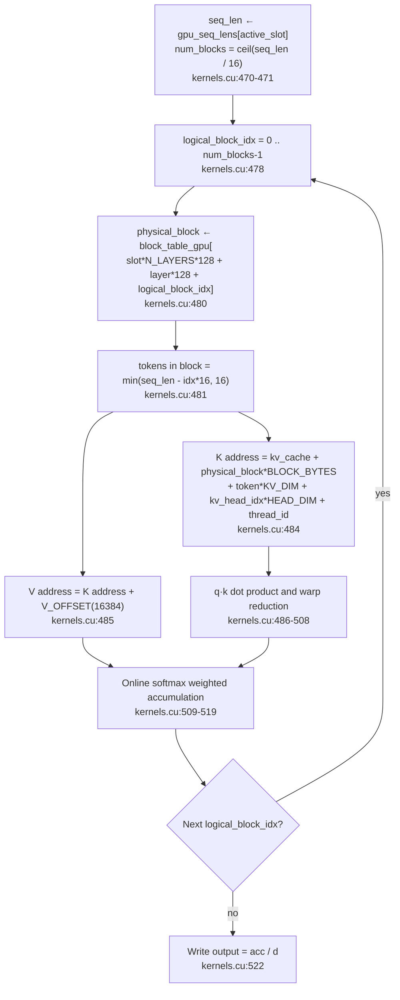

# 6. A Paged KV Cache Indexed in Blocks

Every path and line number in this article points to the tree at the fixed
revision `e25bf1994efa90bc98b721ba7c527402f86fbeaf`. The notation is
`file:start-end`, and references are source quotations, not execution results.

## The Question of This Chapter

When the KV cache is split into blocks and referenced through a block table, what
does the attention kernel read, and how? The code scope is two files,
`src/kernels.cu` and `src/main.cpp`. The minimum evidence for this chapter is 5
code citations, 0 tests, and 0 runs.

This chapter is the sole owner of the block table and the paged attention
explanation. Why decode uses a different kernel variant from prefill is owned by
Part 5, and the lifecycle of slots and the queue, along with the chain of block
returns when a slot ends, is owned by Part 7. The overall prefill kernel order
belongs to Part 3, and cuBLAS transpose flags and column-major layout to Part 4.
Here we focus on the unit in which KV is stored, what references that unit, and
how the attention kernel turns those references into addresses.

This series was written in an environment without an NVIDIA GPU or CUDA
toolchain, so no kernel was executed. Every layout, index, and reduction claim
below is a source citation, and kernel execution time, throughput, and memory
usage are not measured.

## Three Pieces of the KV Cache Allocator

After preparing the cuBLAS handle and the weights, `main` creates the allocator
for paged attention (`src/main.cpp:574-581`).

- `kv_cache` is a single `cudaMalloc` of `KV_CACHE_SIZE_BYTES = 2GB`
  (`src/main.cpp:35`, `src/main.cpp:576`).
- `free_blocks` is the list of available blocks filled from 0 to
  `NUM_BLOCKS - 1` (`src/main.cpp:577-578`).
- `block_table` initializes all `MAX_SEQUENCES × N_LAYERS × MAX_BLOCKS_PER_SEQ`
  entries to `-1` (`src/main.cpp:579`), and a device copy of the same size,
  `block_table_gpu`, is `cudaMalloc`ed (`src/main.cpp:580-581`).

Filling in the dimensions, `MAX_SEQUENCES = BATCH_SIZE = 2` (`src/main.cpp:29`,
`src/main.cpp:38`), `N_LAYERS = 16` (`src/main.cpp:15`), and
`MAX_BLOCKS_PER_SEQ = MAX_SEQ_LEN / BLOCK_SIZE = 2048 / 16 = 128`
(`src/main.cpp:28`, `src/main.cpp:36`), so the block table has 2 × 16 × 128 =
4096 entries. The `-1` marks "there is not yet a physical block at this
(slot, layer, logical block) position." These three pieces are this chapter's
stage.

The size of `kv_cache`, `KV_CACHE_SIZE_BYTES`, is declared as
`2ULL * 1024 * 1024 * 1024` (`src/main.cpp:35`). This value and the block size
below determine `NUM_BLOCKS`.

## The Layout of a Single Block

`BLOCK_SIZE` is 16, and the comment states that this defines the size of "a
single page in pagedattn" (`src/main.cpp:32`). A single block holds K and V, each
of `16 × KV_DIM(512)` bf16 elements. `V_OFFSET` is
`BLOCK_SIZE * KV_DIM * sizeof(__nv_bfloat16) = 16 × 512 × 2 = 16384` bytes
(`src/main.cpp:33`); K sits at the start of the block, and V sits `V_OFFSET`
after the block start. The total block size is `BLOCK_BYTES = V_OFFSET × 2 =
32768` bytes (`src/main.cpp:34`). Dividing the 2GB cache by this size gives
`NUM_BLOCKS` of 65536 (`src/main.cpp:37`). Using `BLOCK_SIZE` 16 and
`BLOCK_BYTES` 32768, 2GB becomes `2 × 1024³ / 32768 = 65536` blocks.

The same constants are also defined independently in `src/kernels.cu`
(`src/kernels.cu:16-19`). They are `BLOCK_SIZE` (`src/kernels.cu:16`),
`V_OFFSET` (`src/kernels.cu:17`), `BLOCK_BYTES` (`src/kernels.cu:18`), and
`MAX_BLOCKS_PER_SEQ` (`src/kernels.cu:19`). A TODO comment at the top of the file
points out that these values are duplicated from `main.cpp` (`src/kernels.cu:6`).

The address arithmetic inside a block relies on the fact that K and V form two
regions in the same block separated by `V_OFFSET`, and that computation holds
only if the kernel and the host share the same constants.

## The Two Places Where K/V Scatter into Blocks

There are two places where KV is written into blocks: the prefill scatter and
the decode scatter.

Prefill cuts the prompt into chunks of `BLOCK_SIZE` tokens and iterates over them
(`src/main.cpp:251-288`). For each token range it computes the logical block
index `block_idx = token_idx / BLOCK_SIZE` (`src/main.cpp:264`) and reads the
physical block from the block table (`src/main.cpp:265`). If the value is `-1`,
it pops one from the back of `free_blocks` and writes it there
(`src/main.cpp:266-272`); if a value already exists, it treats that as an
impossible state in prefill and calls `assert(false)` (`src/main.cpp:273-277`).
The number of tokens to record is clipped to the smaller of the remaining length
and `BLOCK_SIZE` (`src/main.cpp:253-257`). K goes to
`kv_cache + block * BLOCK_BYTES` (`src/main.cpp:280-282`) and V to `V_OFFSET`
after that (`src/main.cpp:285-287`) via D2D `cudaMemcpy`.

Decode appends one new token per slot to the end of the existing sequence
(`src/main.cpp:851-873`). The position is split into
`logical_block_idx = seq_len / BLOCK_SIZE` and
`token_in_block_idx = seq_len % BLOCK_SIZE` (`src/main.cpp:855-857`). The only
case in which a new physical block is allocated is `token_in_block_idx == 0`,
that is, the first token of a new block (`src/main.cpp:859-865`). Otherwise it
overwrites K and V with D2D at position `token_in_block_idx` of the already
allocated block (`src/main.cpp:866-872`). The process of gathering the KV
projections into the per-slot batch buffer itself is owned by Part 5.

Both places look up the block table with the same three-term index
`slot * N_LAYERS * MAX_BLOCKS_PER_SEQ + layer * MAX_BLOCKS_PER_SEQ + block_idx`
(`src/main.cpp:265`, `src/main.cpp:858`). The first term is the slot, the second
is the layer, and the third is the logical block within that layer. Blocks are
allocated independently per slot and per layer, so even the same physical block
number is distinguished by this index according to which slot and layer it
belongs to.

## The Kernel Turns the Block Table into Addresses

`pagedAttentionKernel` is the only kernel that reads this structure
([`src/kernels.cu:461-523`](https://github.com/jmaczan/tiny-vllm/blob/e25bf1994efa90bc98b721ba7c527402f86fbeaf/src/kernels.cu#L461-L523)).
Its signature is as follows.

```cpp
__global__ void pagedAttentionKernel(int layer, int num_active_slots, __nv_bfloat16 *q_proj,
                                     __nv_bfloat16 *kv_cache, int *block_table_gpu, int *gpu_seq_lens,
                                     int *gpu_active_slots, __nv_bfloat16 *output)
```

Citation: [`src/kernels.cu:461`](https://github.com/jmaczan/tiny-vllm/blob/e25bf1994efa90bc98b721ba7c527402f86fbeaf/src/kernels.cu#L461)

The kernel is parallelized over three indices. `blockIdx.x` is the active slot,
`blockIdx.y` is the Q head, and `threadIdx.x` is the 64 dimensions of the head
(`src/kernels.cu:464-467`). The launch is
`<<<dim3(num_active_slots, NUM_Q_HEADS), HEAD_DIM>>>` (`src/kernels.cu:527`).
Since `HEAD_DIM = 64` (`src/kernels.cu:11`), one block is 64 threads, i.e. two
warps.

The block traversal looks like this (`src/kernels.cu:470-485`).

```cpp
int seq_len = gpu_seq_lens[active_slot];
int num_blocks = (seq_len + BLOCK_SIZE - 1) / BLOCK_SIZE;
...
for (int logical_block_idx = 0; logical_block_idx < num_blocks; ++logical_block_idx)
{
    int physical_block = block_table_gpu[slot * N_LAYERS * MAX_BLOCKS_PER_SEQ + layer * MAX_BLOCKS_PER_SEQ + logical_block_idx];
    int tokens_in_block = min(seq_len - logical_block_idx * BLOCK_SIZE, BLOCK_SIZE);
    for (int token = 0; token < tokens_in_block; ++token)
    {
        __nv_bfloat16 *k = (__nv_bfloat16 *)((char *)kv_cache + physical_block * BLOCK_BYTES + token * KV_DIM * sizeof(__nv_bfloat16) + kv_head_idx * HEAD_DIM * sizeof(__nv_bfloat16) + thread_id * sizeof(__nv_bfloat16));
        __nv_bfloat16 *v = (__nv_bfloat16 *)((char *)kv_cache + physical_block * BLOCK_BYTES + V_OFFSET + token * KV_DIM * sizeof(__nv_bfloat16) + kv_head_idx * HEAD_DIM * sizeof(__nv_bfloat16) + thread_id * sizeof(__nv_bfloat16));
```

Citation: [`src/kernels.cu:470-485`](https://github.com/jmaczan/tiny-vllm/blob/e25bf1994efa90bc98b721ba7c527402f86fbeaf/src/kernels.cu#L470-L485)

The read order is as follows.

1. `seq_len` determines how many logical blocks to visit (`src/kernels.cu:470-471`).
2. For each logical block it obtains the physical block number from
   `block_table_gpu` (`src/kernels.cu:480`). This one line is the heart of paged
   attention. KV that is logically contiguous may be physically non-contiguous,
   and the kernel follows only the physical number without knowing about the
   gaps.
3. Within a block, the number of actually valid tokens is clipped with `min`
   (`src/kernels.cu:481`). The last block may not fill all 16.
4. Per token, the K address starts at `physical_block * BLOCK_BYTES` and advances
   by `token * KV_DIM`, within which it picks the head slice via
   `kv_head_idx * HEAD_DIM` and the dimension element via `thread_id`
   (`src/kernels.cu:484`). The V address is the same expression plus `V_OFFSET`
   (`src/kernels.cu:485`).

`kv_head_idx` is derived from the Q head by the GQA ratio
(`kv_head_idx = q_head_id / GQA_Q_TO_K_RATIO`, `src/kernels.cu:468`). That is,
the K/V cache is stored on the basis of 8 K heads, and 32 Q heads share one K
head four at a time (`KV_DIM = 512`, `HEAD_DIM = 64`, `NUM_Q_HEADS = 32`,
`NUM_K_HEADS = 8`, `GQA_Q_TO_K_RATIO = 4`, `src/main.cpp:18-23`). GQA itself is
covered in Part 3.

<!-- visual: block-table-indexing supports: [block-table-indexing, kv-block-layout] -->


This diagram captures both "how non-contiguous blocks are read," which
`block-table-indexing` must answer, and the block layout that the address
computation assumes (`kv-block-layout`). The logical block index becomes a
physical block, and that physical number becomes a byte address through
`BLOCK_BYTES` and `V_OFFSET`; that is the entire flow.

## The Four Pieces of State the Kernel Receives Together

`pagedAttentionKernel` is the only decode-family kernel that receives
`kv_cache`, `block_table_gpu`, `gpu_seq_lens`, and `gpu_active_slots` all at
once. The other decode kernels do not receive this combination.
`embeddingGatherKernelDecode` takes only `gpu_last_tokens`, `embed_tokens`, and
the output (`src/kernels.cu:347`), `ropeKernelDecode` takes only the input,
position, and dimensions (`src/kernels.cu:371`), and `softmaxKernelDecode` takes
only the input and `seq_len` (`src/kernels.cu:408`). Only paged attention needs
the KV store, its indexing state, and the slots and lengths to compute for this
step, all together.

<!-- visual: paged-attention-inputs supports: [paged-attention-inputs] -->
| Argument | Meaning | Evidence |
| --- | --- | --- |
| `kv_cache` | 2GB paged KV store. The base for physical block addresses | `src/kernels.cu:461`, `src/main.cpp:576` |
| `block_table_gpu` | Logical block → physical block mapping. Three-term index of `slot`·`layer`·logical block | `src/kernels.cu:480`, `src/main.cpp:878` |
| `gpu_seq_lens` | Current sequence length per active slot. Determines how many tokens to read | `src/kernels.cu:470`, `src/main.cpp:751-757` |
| `gpu_active_slots` | The actual slot list to compute this step. `active_slot → slot` conversion | `src/kernels.cu:465`, `src/main.cpp:750` |
| `q_proj` | Input Q. `buf_2048_1` compressed by active slot | `src/kernels.cu:469`, `src/main.cpp:763` |
| `output` | Output. Written to the same buffer as `q_proj` | `src/kernels.cu:522`, `src/main.cpp:878` |
| `layer` | The layer term of the block table index | `src/kernels.cu:480`, `src/main.cpp:878` |
| `num_active_slots` | Present in the signature but not referenced in the kernel body | `src/kernels.cu:461`, `src/kernels.cu:527` |

The important point is that the two index spaces differ.
`gpu_active_slots[active_slot]` yields the actual slot (`src/kernels.cu:465`),
and `gpu_seq_lens` is also read by `active_slot` (`src/kernels.cu:470`), but the
block table and the Q/output use different bases. The block table is indexed by
the actual slot `slot` (`src/kernels.cu:480`), while the Q input and output are
indexed by the compressed `active_slot` (`src/kernels.cu:469`,
`src/kernels.cu:522`). The active slot list is the bridge between these two
spaces.

## Warp Reduction and Online Softmax

For one (active slot, Q head) pair, 64 threads each take one element of the head
dimension. A single thread's multiplication is just `qk = (float)q * (float)*k`
(`src/kernels.cu:486`), and the sum of the 64 products is gathered in two
stages. First, within the warp, `__shfl_down_sync` is applied five times with
offsets 16, 8, 4, 2, 1 to gather the sum of 32 lanes into lane 0
(`src/kernels.cu:489-493`). Lane 0 of the first warp (thread 0) writes its warp
sum to `dot_products[0]`, and lane 0 of the second warp (thread 32) writes to
`dot_products[1]` (`src/kernels.cu:494-501`); after `__syncthreads`, thread 0
adds the two and divides by `SQRT_HEAD_DIM` (`src/kernels.cu:503-506`). Since
`SQRT_HEAD_DIM = 8` (`src/kernels.cu:12`), this equals a `1/sqrt(64)` scale.
This two-warp cooperation assumes `HEAD_DIM = 64`.

Next is online softmax. As it traverses the blocks, the kernel updates
`current_max`, the denominator `d`, and the weighted accumulation `acc`
(`src/kernels.cu:510-519`). If the new score is greater than the current maximum,
it raises the maximum, multiplies the previous accumulations by the correction
factor `correction_factor = expf(current_max - new_max)` to readjust them, and
then adds the new term (`src/kernels.cu:515-519`). This way, even while reading
the attention row block by block rather than all at once, it obtains an accurate
softmax weighted average. A comment in the kernel calls this approach online
softmax and includes a reference URL (`src/kernels.cu:473`). The final output is
`acc / d` (`src/kernels.cu:522`).

This reduction differs in form from the in-block tree reduction of prefill.
Prefill's RMSNorm reduction is a shared-memory tree reduction (owned by Part 3),
whereas here it uses warp shuffles and a two-warp combine.

## The Output Is Written to the Same Buffer as the Input

`pagedAttentionKernel` writes its result to the same location it read from. The
index at which it reads input Q is
`active_slot * EMBEDDING_LENGTH + q_head_id * HEAD_DIM + thread_id`
(`src/kernels.cu:469`), and the index at which it writes the output is exactly
the same (`src/kernels.cu:522`). Each thread reads its own element once, runs the
loop, and then writes to the same place, so within a single thread the order is
clear. Because the block dimension is the Q head (`blockIdx.y`), the regions of
different heads do not overlap either.

This aliasing is visible at the call site as well. Immediately before the call,
`q_proj` is `buf_2048_1` (`src/main.cpp:763`), and the `pagedAttention` call
passes the same `buf_2048_1` as both input and output (`src/main.cpp:878`). That
result immediately becomes the input to the O projection (`src/main.cpp:892`).
The size and sharing relationships of `buf_2048_1` are owned by Part 2.

## Allocation and Return

The lifetime of physical blocks is managed by the `free_blocks` list. Allocation
pops from the back with `pop_back` (`src/main.cpp:268-269`,
`src/main.cpp:861-862`), and return pushes to the back with `push_back`
(`src/main.cpp:1025`). The initial list runs from 0 to 65535
(`src/main.cpp:577-578`).

Prefill allocates a new block only when the logical block position is `-1`
(`src/main.cpp:266-272`), and decode allocates only when
`token_in_block_idx == 0` (`src/main.cpp:859-865`). When a slot ends, all blocks
owned by that slot are returned to `free_blocks` and the block table is reset to
`-1` (`src/main.cpp:1018-1029`). The termination procedure in which this return
happens, and the slot lifecycle, are owned by Part 7. Here we note only that the
return loop walks the block table in three dimensions and returns only the
entries that are not `-1` (`src/main.cpp:1020-1027`).

Every change to the block table is copied wholesale to the device copy. Once
after prefill finishes (`src/main.cpp:552`), once per layer inside the decode
layer loop (`src/main.cpp:876`), and once after the slot return
(`src/main.cpp:1030`). All three places synchronize all 4096 entries via H2D. The
source carries a TODO suggesting making this smarter (`src/main.cpp:551`).

## What This Chapter Does Not Cover

- The lifecycle of slots and the queue, and the chain from slot termination to
  block return: Part 7. This chapter focuses on the kernel side that reads the
  block table.
- How the decode-family kernels differ from prefill, and the per-slot batch K/V
  projections: Part 5.
- The overall prefill kernel call order and GQA: Part 3.
- cuBLAS transpose flags, leading dimension, and column-major layout: Part 4.
- Buffer size accounting, including the KV cache, and aliasing design in
  general: Part 2.

## Limitations of This Chapter

- This series was written in an environment without an NVIDIA GPU or CUDA
  toolchain, so not a single kernel was executed. Every claim about layout,
  indices, and reductions is a source citation with no execution verification.
- The execution consistency of the logical index arithmetic
  (`slot * N_LAYERS * MAX_BLOCKS_PER_SEQ + layer * MAX_BLOCKS_PER_SEQ +
  block_idx`) was not verified without a GPU. The block table size of 4096 and
  `NUM_BLOCKS` of 65536 are constant arithmetic, and the actual allocation and
  writes at runtime were not confirmed.
- The two-warp combine (`dot_products[2]`, thread 0 and thread 32) assumes
  `HEAD_DIM = 64`. It does not hold if `HEAD_DIM` is not 64
  (`src/kernels.cu:463`, `494-506`).
- The safety of the in-place output is a static claim that the read and write
  indices are the same (`src/kernels.cu:469`, `src/kernels.cu:522`). There is no
  execution verification of concurrency or races.
- The decode step copies all 4096 block table entries via H2D on every layer
  (`src/main.cpp:876`). This cost was not measured, and the source's TODO
  (`src/main.cpp:551`) remains unresolved.
- The `num_active_slots` argument of `pagedAttentionKernel` is present in the
  signature but not referenced in the kernel body. The grid size serves as the
  upper bound (`src/kernels.cu:527`).
- The reference URL pointed to by the online softmax comment in the kernel
  (`src/kernels.cu:473`) is what is written in the source, and this series did
  not verify that material.
- The weight file is `model.safetensors` of the gated model
  `meta-llama/Llama-3.2-1B-Instruct`, so actually running paged attention remains
  a follow-up task.

## Sources

- `src/main.cpp:15-38` — `N_LAYERS`, `EMBEDDING_LENGTH`, `KV_DIM`, `HEAD_DIM`,
  `MAX_SEQ_LEN`, `BLOCK_SIZE`, `V_OFFSET`, `BLOCK_BYTES`, `KV_CACHE_SIZE_BYTES`,
  `MAX_BLOCKS_PER_SEQ`, `NUM_BLOCKS`, `MAX_SEQUENCES`.
- `src/main.cpp:251-288` — Prefill's K/V block scatter and physical block
  allocation.
- `src/main.cpp:574-581` — The `kv_cache`, `free_blocks`, `block_table`, and
  `block_table_gpu` allocator.
- `src/main.cpp:851-873` — Decode's K/V block scatter and the
  `token_in_block_idx` branch.
- `src/main.cpp:876`, `1030`, `551` — Full block table H2D synchronization and
  the TODO.
- `src/main.cpp:1018-1029` — Block return and block table reinitialization on
  slot termination.
- `src/main.cpp:763`, `878`, `892` — The q projection of `buf_2048_1`, the
  pagedAttention input/output, and the O projection input.
- `src/kernels.cu:6`, `11-19` — Duplicated constant definitions on the kernel
  side, plus `HEAD_DIM` and `SQRT_HEAD_DIM`.
- `src/kernels.cu:347-458` — The contrast that only `pagedAttentionKernel` among
  the decode-family kernels receives the four pieces of state.
- `src/kernels.cu:461-523` — The body of `pagedAttentionKernel`: signature, grid
  mapping, block table traversal, K/V address computation, warp reduction,
  online softmax, in-place output.
- `src/kernels.cu:525-527` — The `pagedAttention` launch configuration.
- `src/kernels.cuh:28` — The `pagedAttention` declaration.
