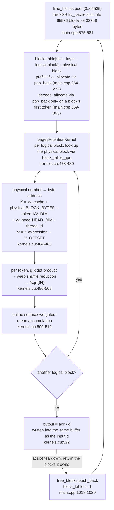

# 6. Splitting the KV cache into 16-token blocks — reading non-contiguous blocks via the block table

Every time decode produces one token, attention re-reads **all** the K/V that the sequence has accumulated so far. If that K/V is held in one large contiguous buffer per sequence, sequences that finish at different times leave unused gaps and waste memory. PagedAttention, the idea that made vLLM famous, answers by splitting the KV cache into **small blocks** — like operating system pages — allocating them only when needed, and letting an array called the block table track "which chunk of which sequence lives in which block" ([Kwon et al., SOSP 2023](https://arxiv.org/pdf/2309.06180)). This repository implements that idea with `BLOCK_SIZE = 16`-token blocks, a block table, and a single kernel, `pagedAttentionKernel`.

Part 1 showed the 2GB cache being reserved wholesale and `free_blocks`·`block_table` being prepared; parts 3 and 5 showed the side that **writes** K/V into those blocks. This part is the opposite direction. It looks at how `pagedAttentionKernel` **reads** blocks through the block table — in other words, how the fact that "the KV cache is split into blocks" shapes the attention kernel's address arithmetic and reductions. The order is: the shape of a block, the block table index that points to it, and the kernel steps that expand that into a byte address.

> All quotes in this series are relative to commit [`e25bf19`](https://github.com/jmaczan/tiny-vllm/tree/e25bf1994efa90bc98b721ba7c527402f86fbeaf). The author has no NVIDIA GPU, so nothing was built or run; all explanations below come from reading the source.

## What one block holds: K in front, V after V_OFFSET

The unit the attention kernel reads is the block. A single block holds the K and V of 16 tokens, laid out as two adjacent regions within the block. The kernel's address arithmetic only holds if this division is taken for granted, so let's look at the size constants first.

```cpp
constexpr int BLOCK_SIZE = 16; // TODO: tunable as well, defined the size of a single page in pagedattn
constexpr int V_OFFSET = BLOCK_SIZE * KV_DIM * sizeof(__nv_bfloat16);
constexpr int BLOCK_BYTES = V_OFFSET * 2;                         // * 2 because K and V
constexpr size_t KV_CACHE_SIZE_BYTES = 2ULL * 1024 * 1024 * 1024; // TODO: 2GB
constexpr int MAX_BLOCKS_PER_SEQ = MAX_SEQ_LEN / BLOCK_SIZE;      // 2048 / 16 = 128
constexpr int NUM_BLOCKS = KV_CACHE_SIZE_BYTES / BLOCK_BYTES;     // 2*1024*1024*1024/(16*512*2*2) = 65536
```
— [`src/main.cpp:32-37`](https://github.com/jmaczan/tiny-vllm/blob/e25bf1994efa90bc98b721ba7c527402f86fbeaf/src/main.cpp#L32-L37)

`KV_DIM = 512` is the product of 8 K/V heads (`NUM_K_HEADS`) and head dimension 64 (`HEAD_DIM`), and bf16 is 2 bytes per element. The arithmetic works out to `V_OFFSET = 16 × 512 × 2 = 16384` bytes and `BLOCK_BYTES = 16384 × 2 = 32768` bytes. K starts at the block's beginning; V starts after `V_OFFSET`. Dividing the 2GB cache by 32768 bytes gives 65536 blocks.

The same constants are redefined at `src/kernels.cu:16-19`. The TODO comment at the top of that file (`src/kernels.cu:6`) flags this duplication, asking "why not share these between main.cpp and kernels.cu". Because the kernel and the host must use the same values or addresses drift apart, this duplication is one that "has to be identical".

Part 5 showed the writing side working under this layout. A new token's K is written to `kv_cache + block·BLOCK_BYTES + token_in_block_idx·KV_DIM·sizeof(...)`, and its V to that same expression plus `V_OFFSET` (`src/main.cpp:866-872`). What this part looks at is how the reading side uses the same constants.

## The block table: an array of three entries — slot · layer · logical block

The block table is an array that turns logical blocks into physical blocks. A logical block is "which 16-token chunk of the sequence"; a physical block is "which 32768-byte piece of the 2GB cache". Even when logically consecutive KV is physically scattered, this one array remembers the mapping. `main` prepares the three pieces needed for this mapping together.

```cpp
    __nv_bfloat16 *kv_cache;
    cudaMalloc(&kv_cache, KV_CACHE_SIZE_BYTES);
    std::vector<int> free_blocks(NUM_BLOCKS);
    std::iota(free_blocks.begin(), free_blocks.end(), 0);
    std::vector<int> block_table(MAX_SEQUENCES * N_LAYERS * MAX_BLOCKS_PER_SEQ, -1);
    int *block_table_gpu;
    cudaMalloc(&block_table_gpu, MAX_SEQUENCES * N_LAYERS * MAX_BLOCKS_PER_SEQ * sizeof(int));
```
— [`src/main.cpp:575-581`](https://github.com/jmaczan/tiny-vllm/blob/e25bf1994efa90bc98b721ba7c527402f86fbeaf/src/main.cpp#L575-L581)

Each of the three pieces has a different role. `kv_cache` is a single 2GB buffer, `free_blocks` is a list filled with 0 through 65535 — "the physical blocks available right now" — and `block_table` is the mapping array, initialized entirely to `-1`. `-1` means "no physical block has been assigned to this slot yet". Filling in the sizes: `MAX_SEQUENCES = BATCH_SIZE = 2`, `N_LAYERS = 16`, and `MAX_BLOCKS_PER_SEQ = 128` (`src/main.cpp:15,29,36,38`), so the block table has 2 × 16 × 128 = 4096 entries.

Why three dimensions instead of one row per sequence? Because a sequence uses **different** blocks for each layer. This model has 16 layers, and layer 0's "logical block 3" and layer 5's "logical block 3" hold different KV. So the mapping is indexed by three entries: slot, layer, and logical block.

```cpp
            int block = block_table[slot * N_LAYERS * MAX_BLOCKS_PER_SEQ + layer * MAX_BLOCKS_PER_SEQ + block_idx];
```
— [`src/main.cpp:265`](https://github.com/jmaczan/tiny-vllm/blob/e25bf1994efa90bc98b721ba7c527402f86fbeaf/src/main.cpp#L265)

This index appears in the same form in four places: prefill's scatter (`src/main.cpp:265`), decode's scatter (`src/main.cpp:858`), the attention kernel (`src/kernels.cu:480`), and slot teardown (`src/main.cpp:1022`). The first term is the slot, the second the layer, and the third the logical block within that layer. Even the same physical block number is told apart by which slot and which layer it belongs to.

## pagedAttentionKernel: the only kernel that receives all four states together

For the attention kernel to read blocks, four things are needed together: the buffer holding the blocks (`kv_cache`), the logical→physical mapping (`block_table_gpu`), who is being computed (the active slots), and how far into each slot to read (the lengths). This is why, of all the decode kernels, only this one takes all four states at once. Let's look at the signature.

```cpp
__global__ void pagedAttentionKernel(int layer, int num_active_slots, __nv_bfloat16 *q_proj, __nv_bfloat16 *kv_cache, int *block_table_gpu, int *gpu_seq_lens, int *gpu_active_slots, __nv_bfloat16 *output)
```
— [`src/kernels.cu:461`](https://github.com/jmaczan/tiny-vllm/blob/e25bf1994efa90bc98b721ba7c527402f86fbeaf/src/kernels.cu#L461)

The kernel is parallelized over three indices. `blockIdx.x` is the active slot, `blockIdx.y` the Q head, and `threadIdx.x` the head's 64 dimensions.

```cpp
    int active_slot = blockIdx.x; // active_slot == seq_id
    int slot = gpu_active_slots[active_slot];
    int q_head_id = blockIdx.y;
    int thread_id = threadIdx.x;
    int kv_head_idx = q_head_id / GQA_Q_TO_K_RATIO;
    __nv_bfloat16 q = q_proj[active_slot * EMBEDDING_LENGTH + q_head_id * HEAD_DIM + thread_id];
```
— [`src/kernels.cu:464-469`](https://github.com/jmaczan/tiny-vllm/blob/e25bf1994efa90bc98b721ba7c527402f86fbeaf/src/kernels.cu#L464-L469)

The launch is `pagedAttentionKernel<<<dim3(num_active_slots, NUM_Q_HEADS), HEAD_DIM>>>` (`src/kernels.cu:527`). One block has 64 threads, i.e. two warps. `num_active_slots` in the signature is never referenced in the kernel body, because the grid's x-size is what determines the number of blocks.

`kv_head_idx = q_head_id / 4` is the GQA we saw in part 3. Four Q heads share one K/V head, so the KV cache is stored in units of 8 K/V heads (`KV_DIM = 512 = 8 × 64`), and the 32 Q heads pick one of them.

Let's tabulate the roles of the arguments.

<!-- visual: paged-attention-inputs supports: [paged-attention-inputs] -->
| Argument | Role | Evidence |
| --- | --- | --- |
| `kv_cache` | The KV store split into blocks; the base for physical block addresses | `src/kernels.cu:461`, `src/main.cpp:576` |
| `block_table_gpu` | Logical → physical block mapping, indexed by slot · layer · logical block | `src/kernels.cu:480`, `src/main.cpp:878` |
| `gpu_seq_lens` | Current length per active slot; determines how many tokens and blocks to read | `src/kernels.cu:470`, `src/main.cpp:751-757` |
| `gpu_active_slots` | The list of actual slots to compute this step; `active_slot` → `slot` translation | `src/kernels.cu:465`, `src/main.cpp:750` |
| `q_proj` | Input Q; `buf_2048_1` compacted into active-slot order | `src/kernels.cu:469`, `src/main.cpp:763` |
| `output` | Output; written into the same buffer as `q_proj` | `src/kernels.cu:522`, `src/main.cpp:878` |

Contrasting with the other decode kernels makes clear why this combination exists only in attention. `embeddingGatherKernelDecode` takes only `gpu_last_tokens`, the embeddings, and the output (`src/kernels.cu:347`); `ropeKernelDecode` takes only the input, positions, and dimensions (`src/kernels.cu:371`); `softmaxKernelDecode` takes only the input and the length (`src/kernels.cu:408`). Attention is the only kernel that needs the KV store, its mapping, and the slots and lengths to compute this step all at once.

Note that two index spaces diverge here. `gpu_active_slots[active_slot]` (`src/kernels.cu:465`) and `gpu_seq_lens[active_slot]` (`src/kernels.cu:470`) are read with the compacted index `active_slot`. `block_table_gpu`, by contrast, is indexed with the actual slot `slot` (`src/kernels.cu:480`). The q input and output are also indexed by `active_slot` (`src/kernels.cu:469`, `522`). Since the block table hands out blocks per sequence, it is indexed by the real slot number, while the data being computed is indexed by position within the current batch. The active slot list is the bridge between those two spaces.

## Logical block → physical block → byte address

The kernel's work compresses to one sentence: "count how many blocks to read, translate logical numbers to physical numbers, and expand physical numbers into byte addresses." These three substitutions are all there is to paged attention's reads.

```cpp
    int seq_len = gpu_seq_lens[active_slot];
    int num_blocks = (seq_len + BLOCK_SIZE - 1) / BLOCK_SIZE;

    // for online softmax https://courses.cs.washington.edu/courses/cse599m/23sp/notes/flashattn.pdf
    float current_max = -INFINITY;
    float acc = 0.0f;
    float d = 0.0f; // denominator, same name as in paper above

    for (int logical_block_idx = 0; logical_block_idx < num_blocks; ++logical_block_idx)
    {
        int physical_block = block_table_gpu[slot * N_LAYERS * MAX_BLOCKS_PER_SEQ + layer * MAX_BLOCKS_PER_SEQ + logical_block_idx];
        int tokens_in_block = min(seq_len - logical_block_idx * BLOCK_SIZE, BLOCK_SIZE);
        for (int token = 0; token < tokens_in_block; ++token)
        {
            __nv_bfloat16 *k = (__nv_bfloat16 *)((char *)kv_cache + physical_block * BLOCK_BYTES + token * KV_DIM * sizeof(__nv_bfloat16) + kv_head_idx * HEAD_DIM * sizeof(__nv_bfloat16) + thread_id * sizeof(__nv_bfloat16));
            __nv_bfloat16 *v = (__nv_bfloat16 *)((char *)kv_cache + physical_block * BLOCK_BYTES + V_OFFSET + token * KV_DIM * sizeof(__nv_bfloat16) + kv_head_idx * HEAD_DIM * sizeof(__nv_bfloat16) + thread_id * sizeof(__nv_bfloat16));
```
— [`src/kernels.cu:470-485`](https://github.com/jmaczan/tiny-vllm/blob/e25bf1994efa90bc98b721ba7c527402f86fbeaf/src/kernels.cu#L470-L485)

The first step counts blocks from the length. `gpu_seq_lens[active_slot]` is how many tokens this slot has accumulated, and `(seq_len + BLOCK_SIZE - 1) / BLOCK_SIZE` is a ceiling division yielding the number of blocks needed. The reason part 5 raised `seq_lens` to `current_prompt_len + 1` is consumed right here: the scatter writes this token's K/V first and attention reads after, so the length has to include this token for the block count to come out right.

Second, for each logical block, `block_table_gpu` is read. This one line is the heart of the block table. The kernel has no idea how many bytes apart logically consecutive KV lie physically; it simply reads along the physical numbers. Whether blocks are scattered or contiguous makes no difference to the kernel.

Third, the number of valid tokens within a block is clipped with `min` (`src/kernels.cu:481`). The last block may not fill 16 tokens, so it reads only what's left after subtracting the blocks already passed ×16 from the sequence length.

This loop also shows why prefill's `causalMask` disappears. This kernel reads tokens **only up to the sequence length**. What prefill needed `-HUGE_VALF` masking of future positions in the score matrix for is replaced here by "simply not reading the future at all."

Finally, each token's K·V address has the same skeleton: `physical_block × BLOCK_BYTES` pins the block start, `token × KV_DIM` the token position, `kv_head_idx × HEAD_DIM` the head region, and `thread_id` the dimensional element. The V address is the K address expression with a single `V_OFFSET` added.

<!-- visual: block-table-indexing supports: [block-table-indexing] -->


This diagram captures two facts. One is the read path: "the kernel reads non-contiguous blocks through the block table." A logical block number becomes a physical block number, and that number passes through `BLOCK_BYTES` and `V_OFFSET` to become a byte address. The other is block lifetime: "the `free_blocks` list manages allocation and return." Blocks are taken out with `pop_back` and handed back with `push_back`. The two boxes that build the scores and the weighted mean are covered in the next section.

## One score: a warp shuffle reduction

One token's contribution is a single q·k dot product. The reduction is what fuses those 64 dot products into one score. Part 3's rmsNorm and softmax used an in-block shared memory tree. Here the block is only 64 threads (two warps), so it finishes with warp shuffles. A warp is the execution unit in which 32 threads move together, and a shuffle is an instruction that lets those threads exchange register values directly.

```cpp
            float qk = (float)q * (float)*k;
            // tree reduction within current warp, thread 0 gets sum of all 32 elements within warp
            // could be done with __syncthreads but accessing memory of other threads in warp is op
            qk += __shfl_down_sync(WARP_FULL_MASK, qk, 16);
            qk += __shfl_down_sync(WARP_FULL_MASK, qk, 8);
            qk += __shfl_down_sync(WARP_FULL_MASK, qk, 4);
            qk += __shfl_down_sync(WARP_FULL_MASK, qk, 2);
            qk += __shfl_down_sync(WARP_FULL_MASK, qk, 1);
            if (thread_id == 0)
            {
                dot_products[0] = qk;
            }
            if (thread_id == 32)
            {
                dot_products[1] = qk;
            }
            __syncthreads();
            if (thread_id == 0)
            {
                dot_products[0] = (dot_products[0] + dot_products[1]) / SQRT_HEAD_DIM;
            }
            __syncthreads();
            float dot_product = dot_products[0];
```
— [`src/kernels.cu:486-508`](https://github.com/jmaczan/tiny-vllm/blob/e25bf1994efa90bc98b721ba7c527402f86fbeaf/src/kernels.cu#L486-L508)

`__shfl_down_sync(WARP_FULL_MASK, qk, 16)` means "add the value held by the thread 16 lanes below in the same warp to your own." A warp has 32 lanes, so the five offsets 16, 8, 4, 2, 1 collect the sum of 32 values into lane 0 — a shuffle version of tree reduction. `WARP_FULL_MASK` is the shim constant we saw in part 1: `0xffffffff` (all 32 bits set) in CUDA, and 64 bits in HIP.

Since the block has 64 threads, i.e. two warps, one more merge is needed. Lane 0 of warp 1 (thread 0) deposits its warp sum into `dot_products[0]`, lane 0 of warp 2 (thread 32) deposits its into `dot_products[1]`, and after `__syncthreads()` thread 0 adds the two and divides by `SQRT_HEAD_DIM = 8`. That's the `1/sqrt(64)` scale. This two-warp cooperation depends on `HEAD_DIM = 64`: if the head dimension weren't 64, `dot_products[2]` and the thread-0/32 pairing would not hold.

## Online softmax: scanning blocks into a weighted mean

The attention output is "a softmax-weighted mean of each token's score." This kernel doesn't build the full score matrix first; instead it scans blocks, updating the running max, denominator, and weighted sum as it goes. This is online softmax ([FlashAttention lecture notes](https://courses.cs.washington.edu/courses/cse599m/23sp/notes/flashattn.pdf)). Where prefill's softmax reduced one row of an already-built score matrix with a tree, this one accumulates each block as it arrives.

```cpp
            // online softmax
            float new_max = current_max;
            if (dot_product > current_max)
            {
                new_max = dot_product;
            }
            float correction_factor = expf(current_max - new_max);
            current_max = new_max;
            float exp_score = expf(dot_product - current_max);
            d = d * correction_factor + exp_score;
            acc = acc * correction_factor + exp_score * (float)*v;
        }
    }
    output[active_slot * EMBEDDING_LENGTH + q_head_id * HEAD_DIM + thread_id] = acc / d;
```
— [`src/kernels.cu:509-522`](https://github.com/jmaczan/tiny-vllm/blob/e25bf1994efa90bc98b721ba7c527402f86fbeaf/src/kernels.cu#L509-L522)

The correction factor is the heart of the accumulation. Because the running `d` and `acc` were computed against the previous max, encountering a larger score raises `current_max` and rescales the existing accumulation by `expf(previous max − new max)` to fit the new baseline. This is the same correction part 3's prefill softmax used when merging two halves. After all blocks are read, the output is `acc / d` — the attention result for this slot and head.

## Output lands where the input was: in-place

The kernel writes its output into the same buffer as the input q. Because the attention result immediately becomes the input to the O projection, there's no need for a separate buffer. Since the read index and the write index are the same, this in-place write is safe.

```cpp
    __nv_bfloat16 q = q_proj[active_slot * EMBEDDING_LENGTH + q_head_id * HEAD_DIM + thread_id];
```
— [`src/kernels.cu:469`](https://github.com/jmaczan/tiny-vllm/blob/e25bf1994efa90bc98b721ba7c527402f86fbeaf/src/kernels.cu#L469)

```cpp
    output[active_slot * EMBEDDING_LENGTH + q_head_id * HEAD_DIM + thread_id] = acc / d;
```
— [`src/kernels.cu:522`](https://github.com/jmaczan/tiny-vllm/blob/e25bf1994efa90bc98b721ba7c527402f86fbeaf/src/kernels.cu#L522)

The two indices match, so each thread reads its single element, runs its loop, and writes back to the same spot. The block dimension is the Q head (`blockIdx.y`), so it never overlaps another head's region either. The host side shows the same thing: `q_proj` points at `buf_2048_1` (`src/main.cpp:763`), and the `pagedAttention` call passes that same `buf_2048_1` in as both input and output (`src/main.cpp:878`). The result then becomes the O projection's input (`src/main.cpp:892`).

## Physical block lifetime: managed by free_blocks

Where blocks come from and where they go back is settled by the single `free_blocks` list. Allocation is `pop_back`; return is `push_back`. Return happens when a slot ends, in a loop that gives back every block the slot owned.

```cpp
                for (int layer = 0; layer < N_LAYERS; ++layer)
                {
                    for (int logical_block_idx = 0; logical_block_idx < MAX_BLOCKS_PER_SEQ; ++logical_block_idx)
                    {
                        int block_idx = active_slot * N_LAYERS * MAX_BLOCKS_PER_SEQ + layer * MAX_BLOCKS_PER_SEQ + logical_block_idx;
                        if (block_table[block_idx] != -1)
                        {
                            free_blocks.push_back(block_table[block_idx]);
                            block_table[block_idx] = -1;
                        }
                    }
                }
```
— [`src/main.cpp:1018-1029`](https://github.com/jmaczan/tiny-vllm/blob/e25bf1994efa90bc98b721ba7c527402f86fbeaf/src/main.cpp#L1018-L1029)

`free_blocks` starts filled with 0 through 65535 (`src/main.cpp:577-578`). Prefill pops a new physical block only when a logical block position is `-1`; decode pops one only when `token_in_block_idx == 0` (`src/main.cpp:266-272`, `859-865`). When a slot ends, a three-dimensional loop finds the blocks that slot owned, `push_back`s the ones that aren't `-1`, and resets them to `-1`. A returned block can be reused by another slot's later allocation. The conditions under which a slot ends are covered in part 7.

Changes to the block table are synced wholesale to the device copy three times: after prefill (`src/main.cpp:552`), after each decode layer (`src/main.cpp:876`), and after teardown (`src/main.cpp:1030`). This synchronization, which copies all 4096 entries host-to-device each time, carries a TODO comment about not copying the whole table unnecessarily (`src/main.cpp:551`).

## Further reading

Material this repository points to as background for this topic.

- [PagedAttention paper (Kwon et al., SOSP 2023)](https://arxiv.org/pdf/2309.06180) — the original idea of splitting the KV cache into blocks
- [FlashAttention / online softmax lecture notes](https://courses.cs.washington.edu/courses/cse599m/23sp/notes/flashattn.pdf) — the basis for the `acc/d` accumulation, which the kernel comment links directly
- [CUDA parallel reductions (NVIDIA)](https://developer.download.nvidia.com/assets/cuda/files/reduction.pdf) — background for the `__shfl_down_sync` tree reduction
- [GQA (Ainslie et al., 2023)](https://arxiv.org/pdf/2305.13245) — the head sharing assumed by `kv_head_idx = q_head_id / 4`

## Limitations of this article

Nothing was built or run, and every explanation above is a static quotation obtained by reading commit `e25bf19`'s source. In particular, four points remain without runtime verification. First, the runtime consistency of the block table's three-entry index arithmetic (`slot·N_LAYERS·MAX_BLOCKS_PER_SEQ + layer·MAX_BLOCKS_PER_SEQ + block_idx`) was not verified without a GPU; the 4096 entries and 65536 blocks are constant arithmetic. Second, `dot_products[2]` and the thread-0/32 cooperation depend on `HEAD_DIM = 64` and do not hold for other sizes. Third, the safety of the in-place output is a static claim of read/write index equality; concurrency and races were not verified at runtime. Fourth, the cost of copying all 4096 block table entries host-to-device per layer (`src/main.cpp:876`, TODO `src/main.cpp:551`) was not measured. The weights file is the gated model `meta-llama/Llama-3.2-1B-Instruct`'s `model.safetensors`, so actually running paged attention to verify it remains a follow-up task.